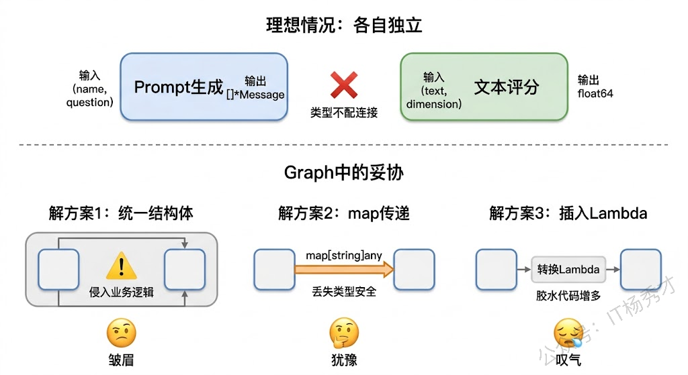
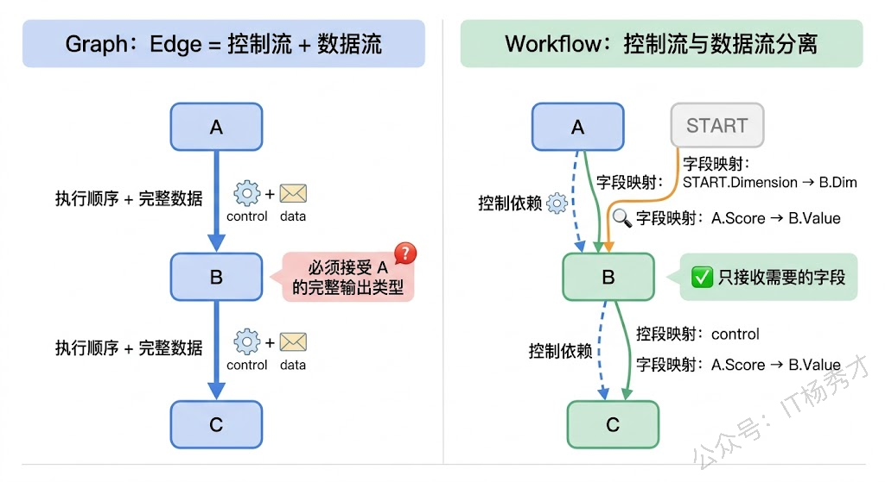
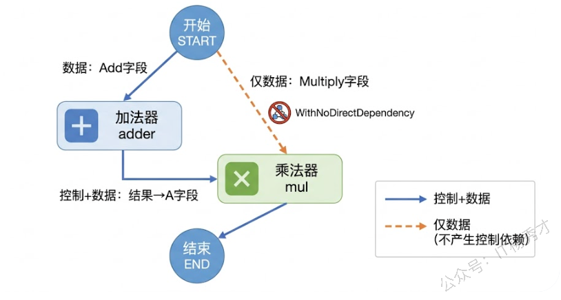
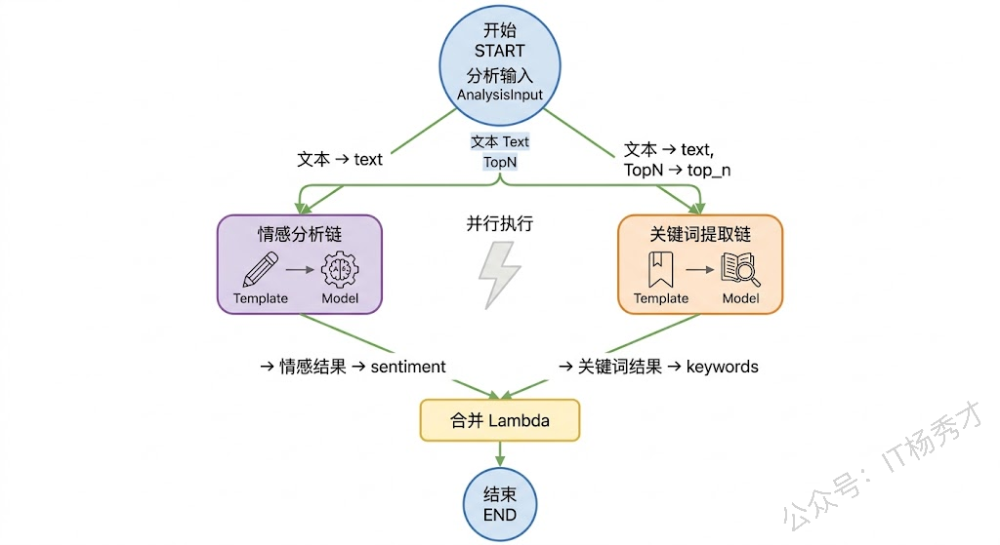
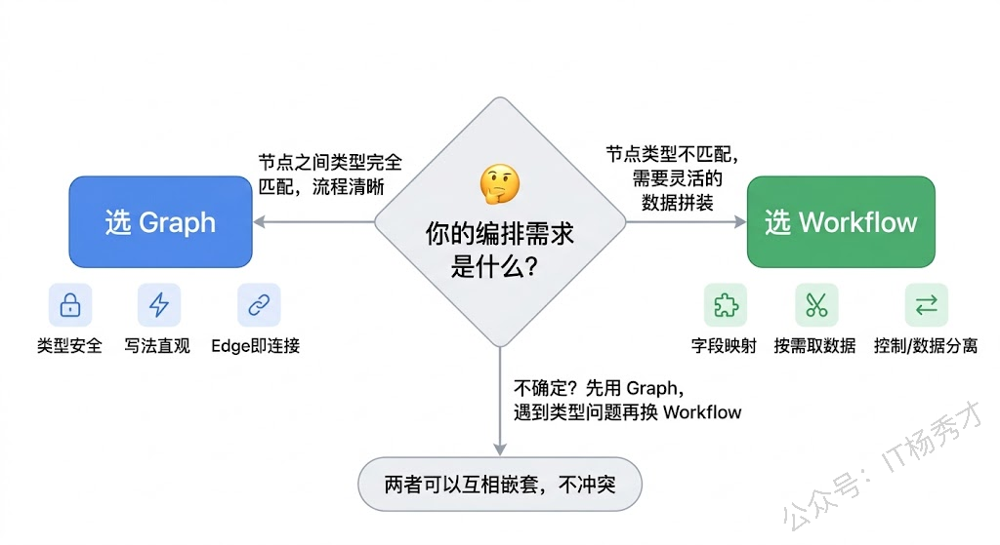

上一篇我们学了 Chain 和 Graph 两种编排方式，能够把模型调用、Prompt 模板、工具节点、Lambda 函数这些组件按照业务流程串联起来。但在实际项目中，你很快会遇到一个让人头疼的问题：相邻节点之间的输入输出类型必须完全匹配。比如节点 A 输出的是一个包含 `Name`、`Age`、`Score` 三个字段的结构体，但节点 B 只需要其中的 `Score` 字段——在 Graph 里，你要么改 B 的输入类型来适配 A 的输出，要么在中间插一个 Lambda 做类型转换。当编排图变得复杂，这种"类型对齐"的胶水代码会越来越多，节点的设计也被迫为了适配上下游而妥协，偏离了本来的业务语义。

Eino 的 Workflow 就是为了解决这个问题而生的。它和 Graph 处于同一个架构层级，拥有相同的节点类型、流式处理、回调机制和编译运行模型，但核心区别在于：**Workflow 支持字段级的数据映射**。你可以精确地指定"把节点 A 输出的 `Score` 字段，映射到节点 B 输入的 `Value` 字段"，而不需要两个节点的类型完全一致。这意味着每个节点只需要关心自己的业务逻辑，输入输出类型完全由业务场景决定，不用迁就上下游节点。

## **1. Graph 的类型对齐困境**

在正式学 Workflow 之前，先来看看 Graph 编排中类型对齐到底有多别扭。

假设我们有两个业务函数：一个根据用户名和问题生成个性化的 Prompt，另一个负责对模型的回答做评分。在正常的业务设计中，这两个函数的签名应该是各自独立的——生成 Prompt 的函数接收用户名和问题，返回拼装好的消息列表；评分函数接收一段文本和评分维度，返回分数。但如果你要在 Graph 里把它们串起来，就得面对一个问题：第一个函数输出的 `[]*schema.Message` 和第二个函数期望的输入 `ScoreInput{Text string, Dimension string}` 完全对不上。



你通常有三种选择：第一种是定义一个"万能结构体"把所有字段都放进去，两个函数都用这个结构体做输入输出，但这会让每个函数都被迫携带一堆自己不需要的字段，业务语义变得模糊。第二种是全部改成 `map[string]any` 传递，灵活是灵活了，但丢掉了 Go 语言最大的优势——编译期类型检查，运行时的类型断言错误让人防不胜防。第三种是在节点之间插入 Lambda 做转换，逻辑上没问题，但当编排图有几十个节点时，这些转换 Lambda 比业务节点还多，整个图变得又臃肿又难维护。

这就是 Workflow 登场的背景。

## **2. Workflow 的设计思路**

Workflow 的核心理念是**把控制流和数据流分离开**。在 Graph 里，一条 Edge 既决定了执行顺序（A 执行完才执行 B），也决定了数据传递（A 的输出就是 B 的输入）。但在 Workflow 里，执行顺序和数据传递是两件可以分别控制的事情。



具体来说，Workflow 中一个节点的输入可以由多个前置节点的输出字段拼装而成。节点 B 的某个字段可能来自节点 A 的输出，另一个字段来自 START 节点的输入，还有一个字段是固定的静态值——这些都通过字段映射来声明，编排框架在运行时自动完成数据的拆解和重组。每个节点的函数签名保持纯粹的业务语义，不需要为编排妥协。

从 API 设计上看，Workflow 和 Graph 非常像：同样用 `compose.NewWorkflow` 创建，同样用 `AddLambdaNode`、`AddChatModelNode` 等方法添加节点，同样用 `Compile` 编译、`Invoke`/`Stream` 运行。最大的区别是 Graph 用 `AddEdge` 连接节点，而 Workflow 用 `AddInput` 声明每个节点的输入来自哪里、映射哪些字段。

## **3. 基本用法**

先从一个简单的例子开始，感受 Workflow 字段映射的基本写法。

我们来构建一个"文本分析"流程：输入一段文本和一个要搜索的关键词，分别统计文本的总字符数和关键词出现的次数，最后把两个结果合并输出。这个场景的关键在于：统计字符数的函数只需要文本，统计关键词的函数需要文本和关键词——两个函数的输入类型不同，但都从同一个输入中取数据。

```go
package main

import (
        "context"
        "fmt"
        "log"
        "strings"

        "github.com/cloudwego/eino/compose"
)

func main() {
        ctx := context.Background()

        // 定义输入结构：包含文本和关键词
        type Input struct {
                Text    string
                Keyword string
        }

        // 函数1：统计字符数，只需要一个字符串
        charCounter := func(ctx context.Context, text string) (int, error) {
                return len([]rune(text)), nil
        }

        // 函数2：统计关键词出现次数，需要文本和关键词两个字段
        type KeywordInput struct {
                FullText string
                Word     string
        }
        keywordCounter := func(ctx context.Context, input KeywordInput) (int, error) {
                return strings.Count(input.FullText, input.Word), nil
        }

        // 创建 Workflow
        wf := compose.NewWorkflow[Input, map[string]any]()

        // 添加字符计数节点，从 START 的 Text 字段取值作为完整输入
        wf.AddLambdaNode("char_count", compose.InvokableLambda(charCounter)).
                AddInput(compose.START, compose.FromField("Text"))

        // 添加关键词计数节点，从 START 拼装两个字段
        wf.AddLambdaNode("keyword_count", compose.InvokableLambda(keywordCounter)).
                AddInput(compose.START,
                        // START 的 Text 字段 → KeywordInput 的 FullText 字段
                        compose.MapFields("Text", "FullText"),
                        // START 的 Keyword 字段 → KeywordInput 的 Word 字段
                        compose.MapFields("Keyword", "Word"),
                )

        // END 节点从两个计算节点收集结果
        wf.End().
                AddInput("char_count", compose.ToField("char_count")).
                AddInput("keyword_count", compose.ToField("keyword_count"))

        // 编译并运行
        runner, err := wf.Compile(ctx)
        if err != nil {
                log.Fatal("编译失败:", err)
        }

        result, err := runner.Invoke(ctx, Input{
                Text:    "Go语言是一门简洁高效的编程语言，Go的并发模型是Go最大的亮点之一。",
                Keyword: "Go",
        })
        if err != nil {
                log.Fatal("运行失败:", err)
        }

        fmt.Printf("字符总数: %v\n", result["char_count"])
        fmt.Printf("关键词出现次数: %v\n", result["keyword_count"])
}
```

运行结果：

```plain&#x20;text
字符总数: 35
关键词出现次数: 3
```

这段代码展示了 Workflow 最核心的几个 API。`compose.FromField("Text")` 表示把前置节点输出的 `Text` 字段提取出来作为当前节点的完整输入——注意这里 `charCounter` 函数的输入类型是 `string`，而 START 节点的输出类型是 `Input` 结构体，Workflow 自动完成了字段提取。`compose.MapFields("Text", "FullText")` 则是更精细的映射，把来源的 `Text` 字段映射到目标的 `FullText` 字段，字段名不需要相同。`compose.ToField("char_count")` 用于输出侧，把一个节点的完整输出放入目标的某个字段中——这里是把 `int` 类型的结果放入 `map[string]any` 的对应 key 里。

两个计算节点之间没有数据依赖，Workflow 会自动并行执行它们。这一点和 Graph 中需要显式使用 Parallel 不同——Workflow 只要发现两个节点没有依赖关系，就会自动并发调度。

## **4. 字段映射详解**

Workflow 提供了一组灵活的字段映射 API，覆盖了各种数据转换场景。

### **4.1 MapFields 和 MapFieldPaths**

`MapFields` 是最常用的映射方式，把来源结构体的一个顶层字段映射到目标结构体的一个顶层字段。但如果你的结构体有嵌套呢？比如来源输出是 `Outer{Inner: Inner{Value: "xxx"}}`，你想把 `Inner.Value` 映射到目标的 `Text` 字段——这时候就需要 `MapFieldPaths`，它接收两个字符串切片，分别描述来源和目标的字段路径。

```go
package main

import (
        "context"
        "fmt"
        "log"

        "github.com/cloudwego/eino/compose"
        "github.com/cloudwego/eino/schema"
)

func main() {
        ctx := context.Background()

        // 输入包含嵌套的 Message 结构
        type Input struct {
                *schema.Message
                Lang string
        }

        // 翻译函数：只需要文本内容和目标语言
        type TranslateInput struct {
                Text     string
                TargetLang string
        }
        translator := func(ctx context.Context, input TranslateInput) (string, error) {
                // 这里用简单的拼接模拟翻译结果
                return fmt.Sprintf("[%s] %s", input.TargetLang, input.Text), nil
        }

        wf := compose.NewWorkflow[Input, map[string]any]()

        wf.AddLambdaNode("translate", compose.InvokableLambda(translator)).
                AddInput(compose.START,
                        // 从嵌套路径 Message.Content 映射到 Text
                        compose.MapFieldPaths([]string{"Message", "Content"}, []string{"Text"}),
                        // 顶层字段映射
                        compose.MapFields("Lang", "TargetLang"),
                )

        wf.End().AddInput("translate", compose.ToField("result"))

        runner, err := wf.Compile(ctx)
        if err != nil {
                log.Fatal("编译失败:", err)
        }

        result, err := runner.Invoke(ctx, Input{
                Message: &schema.Message{
                        Role:    schema.User,
                        Content: "今天天气真好",
                },
                Lang: "English",
        })
        if err != nil {
                log.Fatal("运行失败:", err)
        }

        fmt.Println(result["result"])
}
```

运行结果：

```plain&#x20;text
[English] 今天天气真好
```

`MapFieldPaths` 的两个参数都是 `[]string` 类型，第一个表示来源字段路径，第二个表示目标字段路径。路径中的每个元素对应一层嵌套——`[]string{"Message", "Content"}` 就是先找 `Message` 字段，再在里面找 `Content` 字段。如果目标也有嵌套结构，同样用路径数组来描述。这种设计让你无论面对多深的嵌套结构，都能精确地"钻"进去取到想要的字段。

### **4.2 SetStaticValue**

有时候某个节点的输入字段并不来自其他节点的输出，而是一个在编排定义时就确定的固定值。比如一个评分函数需要一个"满分值"参数，这个参数对所有请求都是相同的，没必要每次都从上游传过来。`SetStaticValue` 就是干这个的。

```go
package main

import (
        "context"
        "fmt"
        "log"
        "math/rand"

        "github.com/cloudwego/eino/compose"
)

func main() {
        ctx := context.Background()

        type BidInput struct {
                Price  float64
                Budget float64
        }

        // 竞价函数：根据当前价格和预算出价
        bidder := func(ctx context.Context, in BidInput) (float64, error) {
                if in.Price >= in.Budget {
                        return in.Budget, nil
                }
                return in.Price + rand.Float64()*(in.Budget-in.Price), nil
        }

        wf := compose.NewWorkflow[float64, map[string]float64]()

        // 竞价者1：预算3.0
        wf.AddLambdaNode("bidder1", compose.InvokableLambda(bidder)).
                AddInput(compose.START, compose.ToField("Price")).
                SetStaticValue([]string{"Budget"}, 3.0) // 静态设置预算

        // 竞价者2：预算5.0
        wf.AddLambdaNode("bidder2", compose.InvokableLambda(bidder)).
                AddInput(compose.START, compose.ToField("Price")).
                SetStaticValue([]string{"Budget"}, 5.0) // 不同的预算

        wf.End().
                AddInput("bidder1", compose.ToField("bidder1")).
                AddInput("bidder2", compose.ToField("bidder2"))

        runner, err := wf.Compile(ctx)
        if err != nil {
                log.Fatal("编译失败:", err)
        }

        result, err := runner.Invoke(ctx, 2.0) // 起始价 2.0
        if err != nil {
                log.Fatal("运行失败:", err)
        }

        fmt.Printf("竞价者1出价: %.2f（预算3.0）\n", result["bidder1"])
        fmt.Printf("竞价者2出价: %.2f（预算5.0）\n", result["bidder2"])
}
```

运行结果：

```plain&#x20;text
竞价者1出价: 2.78（预算3.0）
竞价者2出价: 3.17（预算5.0）
```

`SetStaticValue` 接收一个字段路径和一个值。路径是 `[]string` 类型的，和 `MapFieldPaths` 一样支持嵌套——如果你要设置的是 `Config.MaxRetry` 这样的嵌套字段，路径就写成 `[]string{"Config", "MaxRetry"}`。静态值在 Workflow 编译时就确定了，运行时不会变化，非常适合配置类的参数。

### **4.3 控制依赖与数据依赖分离**

前面提到 Workflow 的一个重要特性是控制流和数据流的分离。默认情况下，`AddInput` 建立的是一个同时包含控制依赖和数据依赖的关系——节点 B 声明了 `AddInput("A", ...)`，意味着 B 既要等 A 执行完，又要从 A 拿数据。但有些场景下，B 需要从某个节点拿数据，却不需要等它执行完（因为有其他依赖路径保证了执行顺序）；或者反过来，B 必须在 A 之后执行，但不需要 A 的任何输出数据。



Eino 提供了两个机制来处理这种分离：`AddDependency` 只建立控制依赖（不传数据），`AddInputWithOptions` 配合 `compose.WithNoDirectDependency()` 只建立数据依赖（不产生控制依赖）。来看一个具体的例子：先做加法，再把加法结果和一个来自 START 的乘数做乘法。

```go
package main

import (
        "context"
        "fmt"
        "log"

        "github.com/cloudwego/eino/compose"
)

func main() {
        ctx := context.Background()

        type CalcInput struct {
                Add      []int
                Multiply int
        }

        // 加法器：把一组数字加起来
        adder := func(ctx context.Context, nums []int) (int, error) {
                sum := 0
                for _, n := range nums {
                        sum += n
                }
                return sum, nil
        }

        // 乘法器：两个数相乘
        type MulInput struct {
                A int
                B int
        }
        multiplier := func(ctx context.Context, m MulInput) (int, error) {
                return m.A * m.B, nil
        }

        wf := compose.NewWorkflow[CalcInput, int]()

        // 加法器从 START 的 Add 字段取数据
        wf.AddLambdaNode("adder", compose.InvokableLambda(adder)).
                AddInput(compose.START, compose.FromField("Add"))

        // 乘法器的 A 字段来自加法器的输出（同时建立控制依赖）
        // 乘法器的 B 字段来自 START 的 Multiply 字段（仅数据，不建立控制依赖）
        wf.AddLambdaNode("mul", compose.InvokableLambda(multiplier)).
                AddInput("adder", compose.ToField("A")).
                AddInputWithOptions(compose.START,
                        []*compose.FieldMapping{compose.MapFields("Multiply", "B")},
                        compose.WithNoDirectDependency(),
                )

        wf.End().AddInput("mul")

        runner, err := wf.Compile(ctx)
        if err != nil {
                log.Fatal("编译失败:", err)
        }

        // (2 + 5) * 3 = 21
        result, err := runner.Invoke(ctx, CalcInput{
                Add:      []int{2, 5},
                Multiply: 3,
        })
        if err != nil {
                log.Fatal("运行失败:", err)
        }

        fmt.Printf("结果: %d\n", result) // (2+5) * 3 = 21
}
```

运行结果：

```plain&#x20;text
结果: 21
```

这里的关键是 `mul` 节点的输入来自两个不同的地方：`A` 字段来自 `adder` 节点的输出（通过 `AddInput` 建立了控制依赖，保证加法先执行），`B` 字段来自 `START` 节点的 `Multiply` 字段（通过 `AddInputWithOptions` 配合 `WithNoDirectDependency()`，只传数据不建立控制依赖）。如果不加 `WithNoDirectDependency()`，Workflow 会认为 `mul` 既依赖 `adder` 又依赖 `START`，虽然逻辑上也能跑通，但语义上不够精确——`mul` 等待的只是 `adder` 完成，`START` 那边只是拿个参数而已。

反过来的场景也存在：`AddDependency` 只建立控制依赖不传数据。比如你有一个日志节点需要在主业务节点之后执行，但它不需要主业务节点的任何输出——这时候就用 `AddDependency("main_node")` 来声明"我要在它后面执行"，然后通过其他 `AddInput` 来获取实际需要的数据。

## **5. 结合大模型实战**

前面的例子都是纯计算逻辑，现在来看一个结合大模型调用的实战场景。我们要构建一个"多维度文本分析"系统：接收一段文本输入，同时让模型从"情感分析"和"关键词提取"两个维度做分析，最后把两个维度的结果合并成一份完整的分析报告。

这个场景的特点在于：两个分析节点需要的输入不完全一样——情感分析只需要文本内容，关键词提取需要文本内容和一个提取数量参数。而且两个分析任务之间没有依赖关系，可以并行执行。在 Graph 里实现这个逻辑，你得用 Parallel 来并行，还要在每条并行链里用 Lambda 做输入转换。用 Workflow 就简洁多了。

```go
package main

import (
        "context"
        "fmt"
        "log"
        "os"

        "github.com/cloudwego/eino-ext/components/model/openai"
        "github.com/cloudwego/eino/components/prompt"
        "github.com/cloudwego/eino/compose"
        "github.com/cloudwego/eino/schema"
)

func main() {
        ctx := context.Background()

        // 创建模型
        model, err := openai.NewChatModel(ctx, &openai.ChatModelConfig{
                BaseURL: "https://dashscope.aliyuncs.com/compatible-mode/v1",
                APIKey:  os.Getenv("DASHSCOPE_API_KEY"),
                Model:   "qwen-plus",
        })
        if err != nil {
                log.Fatal(err)
        }

        // 定义输入
        type AnalysisInput struct {
                Text     string
                TopN     string // 提取关键词的数量，用字符串方便模板渲染
        }

        // 情感分析 Prompt 模板
        sentimentTpl := prompt.FromMessages(schema.FString,
                schema.SystemMessage("你是一个情感分析专家。请分析以下文本的情感倾向，输出格式：情感倾向（正面/负面/中性）+ 一句话理由。"),
                schema.UserMessage("{text}"),
        )

        // 关键词提取 Prompt 模板
        keywordTpl := prompt.FromMessages(schema.FString,
                schema.SystemMessage("你是一个关键词提取专家。请从以下文本中提取{top_n}个最重要的关键词，用逗号分隔输出。"),
                schema.UserMessage("{text}"),
        )

        // 情感分析链：模板 → 模型
        sentimentChain := compose.NewChain[map[string]any, *schema.Message]()
        sentimentChain.AppendChatTemplate(sentimentTpl).AppendChatModel(model)

        // 关键词提取链：模板 → 模型
        keywordChain := compose.NewChain[map[string]any, *schema.Message]()
        keywordChain.AppendChatTemplate(keywordTpl).AppendChatModel(model)

        // 构建 Workflow
        wf := compose.NewWorkflow[AnalysisInput, string]()

        // 情感分析节点：只需要 Text 字段，映射到模板变量 text
        wf.AddGraphNode("sentiment", sentimentChain).
                AddInput(compose.START, compose.MapFields("Text", "text"))

        // 关键词提取节点：需要 Text 和 TopN 两个字段
        wf.AddGraphNode("keywords", keywordChain).
                AddInput(compose.START,
                        compose.MapFields("Text", "text"),
                        compose.MapFields("TopN", "top_n"),
                )

        // 合并结果的 Lambda
        wf.AddLambdaNode("merge", compose.InvokableLambda(
                func(ctx context.Context, results map[string]any) (string, error) {
                        sentiment := results["sentiment"].(*schema.Message)
                        keywords := results["keywords"].(*schema.Message)
                        return fmt.Sprintf("=== 文本分析报告 ===\n\n【情感分析】\n%s\n\n【关键词提取】\n%s",
                                sentiment.Content, keywords.Content), nil
                },
        )).
                AddInput("sentiment", compose.ToField("sentiment")).
                AddInput("keywords", compose.ToField("keywords"))

        wf.End().AddInput("merge")

        // 编译并运行
        runner, err := wf.Compile(ctx)
        if err != nil {
                log.Fatal("编译失败:", err)
        }

        result, err := runner.Invoke(ctx, AnalysisInput{
                Text: "这款新出的Go语言框架Eino让我眼前一亮，它把大模型应用开发中最头疼的编排问题解决得很优雅，API设计简洁又不失灵活性，字节跳动内部的实战验证也让人放心，唯一的遗憾是文档还不够丰富，社区生态还在成长期。",
                TopN: "5",
        })
        if err != nil {
                log.Fatal("运行失败:", err)
        }

        fmt.Println(result)
}
```

运行结果：

```plain&#x20;text
=== 文本分析报告 ===

【情感分析】
情感倾向：正面  
理由：整体评价高度肯定Eino框架的创新性、实用性与可靠性（“眼前一亮”“解决得很优雅”“简洁又不失灵活性”“实战验证让人放心”），虽提及文档和生态的不足，但用“唯一的遗憾”弱化负面，属于建设性补充，不改变总体积极基调。

【关键词提取】
Go语言框架,Eino,大模型应用开发,API设计,字节跳动
```



这个例子有几处值得注意。首先是 `wf.AddGraphNode`——你可以把一个已经编好的 Chain 或 Graph 作为子图直接嵌入 Workflow，这和 Graph 的 `AddGraph` 是一样的。其次，`sentiment` 和 `keywords` 两个节点各自从 START 映射了不同的字段组合，它们之间没有任何依赖关系，Workflow 自动并行执行它们。最后，`merge` 节点通过 `AddInput` 从两个上游节点收集结果，用 `ToField` 把每个结果放到 map 的对应 key 里，然后在 Lambda 函数中按 key 取出来合并。

对比一下如果用 Graph 来实现同样的逻辑：你需要用 Parallel 来包裹两条并行链，每条链的输入类型必须是 `map[string]any`（因为 Parallel 要求所有子链的输入类型相同），然后在每条链的开头加一个 Lambda 来提取各自需要的字段。Workflow 版本省掉了这些胶水代码，每个节点直接声明"我要什么"就够了。

## **6. 条件路由**

Workflow 同样支持 Branch 条件路由，用法和 Graph 几乎一样。我们来看一个实际场景：根据输入文本的长度决定使用不同的处理策略——短文本直接让模型分析，长文本先做摘要再分析。

```go
package main

import (
    "context"
    "fmt"
    "log"
    "os"

    "github.com/cloudwego/eino-ext/components/model/openai"
    "github.com/cloudwego/eino/components/prompt"
    "github.com/cloudwego/eino/compose"
    "github.com/cloudwego/eino/schema"
)

func main() {
    ctx := context.Background()

    model, err := openai.NewChatModel(ctx, &openai.ChatModelConfig{
       BaseURL: "https://dashscope.aliyuncs.com/compatible-mode/v1",
       APIKey:  os.Getenv("DASHSCOPE_API_KEY"),
       Model:   "qwen-plus",
    })
    if err != nil {
       log.Fatal(err)
    }

    // 输入类型
    type Input struct {
       Text string
    }

    // 长度检测：返回文本和分类标签
    type ClassifiedText struct {
       Text     string
       Category string
    }
    classifier := func(ctx context.Context, input Input) (ClassifiedText, error) {
       category := "short"
       if len([]rune(input.Text)) > 100 {
          category = "long"
       }
       return ClassifiedText{Text: input.Text, Category: category}, nil
    }

    // 摘要模板
    summaryTpl := prompt.FromMessages(schema.FString,
       schema.SystemMessage("请用不超过50字概括以下文本的核心内容。"),
       schema.UserMessage("{text}"),
    )
    summaryChain := compose.NewChain[map[string]any, *schema.Message]()
    summaryChain.AppendChatTemplate(summaryTpl).AppendChatModel(model)

    // 分析模板
    analysisTpl := prompt.FromMessages(schema.FString,
       schema.SystemMessage("请对以下文本进行深度分析，包括主要观点、论证逻辑和潜在问题。"),
       schema.UserMessage("{text}"),
    )
    analysisChain := compose.NewChain[map[string]any, *schema.Message]()
    analysisChain.AppendChatTemplate(analysisTpl).AppendChatModel(model)

    // 摘要后分析用的独立 chain（不能复用同一个 chain 实例）
    analysisChain2 := compose.NewChain[map[string]any, *schema.Message]()
    analysisChain2.AppendChatTemplate(analysisTpl).AppendChatModel(model)

    // 格式化输出
    formatter := func(ctx context.Context, msg *schema.Message) (string, error) {
       return msg.Content, nil
    }

    // 构建 Workflow，输出 map[string]any 以支持多条分支路径汇聚
    wf := compose.NewWorkflow[Input, map[string]any]()

    // 分类节点
    wf.AddLambdaNode("classifier", compose.InvokableLambda(classifier)).
       AddInput(compose.START)

    // 条件路由：返回值必须是目标节点名
    wf.AddBranch("classifier", compose.NewGraphBranch(
       func(ctx context.Context, ct ClassifiedText) (string, error) {
          if ct.Category == "long" {
             return "summary", nil
          }
          return "direct_analysis", nil
       },
       map[string]bool{"direct_analysis": true, "summary": true},
    ))

    // === 短文本路径：直接分析 ===
    wf.AddGraphNode("direct_analysis", analysisChain).
       AddInput("classifier", compose.MapFields("Text", "text"))

    wf.AddLambdaNode("format_direct", compose.InvokableLambda(formatter)).
       AddInput("direct_analysis")

    // 短文本路径完成后，通过 branch 直接路由到 END
    wf.AddBranch("format_direct", compose.NewGraphBranch(
       func(ctx context.Context, s string) (string, error) {
          return compose.END, nil
       },
       map[string]bool{compose.END: true},
    ))

    // === 长文本路径：先摘要再分析 ===
    wf.AddGraphNode("summary", summaryChain).
       AddInput("classifier", compose.MapFields("Text", "text"))

    wf.AddGraphNode("summary_analysis", analysisChain2).
       AddInput("summary", compose.MapFields("Content", "text"))

    wf.AddLambdaNode("format_summary", compose.InvokableLambda(formatter)).
       AddInput("summary_analysis")

    // 长文本路径通过 AddInput 连到 END
    // 短文本路径的结果通过 WithNoDirectDependency 可选地传入
    wf.End().
       AddInput("format_summary", compose.ToField("summary")).
       AddInputWithOptions("format_direct", []*compose.FieldMapping{compose.ToField("direct")}, compose.WithNoDirectDependency())

    runner, err := wf.Compile(ctx)
    if err != nil {
       log.Fatal("编译失败:", err)
    }

    // 提取结果：两条分支互斥，取有值的那个
    extractResult := func(result map[string]any) string {
       if v, ok := result["direct"]; ok && v != nil {
          return v.(string)
       }
       if v, ok := result["summary"]; ok && v != nil {
          return v.(string)
       }
       return ""
    }

    // 测试短文本
    shortResult, err := runner.Invoke(ctx, Input{
       Text: "Go语言的错误处理虽然被很多人吐槽啰嗦，但它的设计哲学其实很务实。",
    })
    if err != nil {
       log.Fatal("运行失败:", err)
    }
    fmt.Println("--- 短文本分析 ---")
    fmt.Println(extractResult(shortResult))

    fmt.Println()

    // 测试长文本
    longResult, err := runner.Invoke(ctx, Input{
       Text: "人工智能的发展经历了几次大的浪潮。从上世纪50年代的符号主义，到80年代的专家系统，再到2010年代深度学习的爆发，每一次浪潮都带来了巨大的期待和随之而来的失望。但2022年ChatGPT的出现似乎不同以往——大语言模型展现出的涌现能力让整个行业为之震动。从代码生成到文本创作，从数据分析到科学推理，LLM正在重新定义什么是可能的。",
    })
    if err != nil {
       log.Fatal("运行失败:", err)
    }
    fmt.Println("--- 长文本分析 ---")
    fmt.Println(extractResult(longResult))
}
```

运行结果：

```plain&#x20;text
--- 短文本分析 ---
这段观点触及了Go语言设计哲学的核心争议。主要观点是Go的错误处理看似啰嗦实则务实——通过显式的error返回值强制开发者在每个可能出错的地方做决策，避免了try-catch隐藏错误路径的问题。论证逻辑是"表面缺点实为设计优势"。潜在问题在于：这种论述回避了样板代码确实降低开发效率的现实，Go社区至今仍在探索更简洁的错误处理方案（如曾提出的try提案），说明"务实"和"好用"之间确实存在张力。

--- 长文本分析 ---
文本梳理了AI发展的历史脉络，核心观点是ChatGPT/LLM代表了一次与以往不同的AI浪潮。论证逻辑采用历史对比法——列举三次浪潮的"期待-失望"模式后，用"似乎不同以往"转折突出当前浪潮的特殊性。但论证存在几个问题：一是"涌现能力"的学术定义和可重复性仍有争议；二是选择性列举LLM的成功案例却回避了幻觉、推理不可靠等已知缺陷；三是"重新定义可能"的表述过于乐观，历史上每次浪潮的当事人都有同样的感受。
```

这个例子展示了 Workflow 中 Branch 的用法。和 Graph 中一样，`AddBranch` 接收一个条件函数和分支目标。不过 Workflow 中字段映射的灵活性让分支后的处理更自然——比如 `summary_analysis` 节点通过 `compose.MapFields("Content", "text")` 直接从 `summary` 节点的 `*schema.Message` 输出中提取 `Content` 字段，不需要额外的类型转换。

## **7. Workflow 和 Graph 怎么选**

说了这么多 Workflow 的好处，那是不是应该全面抛弃 Graph 只用 Workflow？当然不是。技术选型没有银弹，关键看你的场景。



如果你的编排图里大部分节点之间的类型天然匹配——比如 Prompt 模板输出 `[]*schema.Message`，ChatModel 输入就是 `[]*schema.Message`，这种情况下用 Graph 的 `AddEdge` 一条线连上去就完事了，代码简洁明了。强行用 Workflow 反而多了一堆字段映射的声明，属于过度设计。

Workflow 真正发光的场景是：节点之间的类型确实对不上，或者一个节点的输入需要从多个来源拼装。典型的例子包括：多维度并行分析（每个分析节点需要输入的不同子集）、多步骤流水线中间结果需要在后续步骤中"跨节点"引用、以及需要给特定节点注入配置参数（静态值）的场景。

实际项目中，两者经常混用。你完全可以把一个 Chain 或 Graph 作为子图嵌入 Workflow 的节点中，也可以反过来把一个 Workflow 编译后的 Runnable 放入 Graph。Eino 的编排体系设计得足够灵活，Chain、Graph、Workflow 三者不是互相替代的关系，而是不同粒度的工具——Chain 处理线性流水线，Graph 处理复杂拓扑，Workflow 处理需要字段级精细控制的数据流。根据每个局部的实际需求选择最合适的工具，是编排设计的艺术。

## **8. 小结**

Workflow 的本质是给编排系统加了一层"数据路由"能力。Graph 里一条 Edge 既管执行顺序又管数据传递，你没得选——上游输出什么类型，下游就得接什么类型。Workflow 把这两件事拆开了，让你可以精确地声明每个节点从哪里拿哪些字段、静态参数怎么注入、控制依赖和数据依赖怎么分配。这种设计让编排图中的每个节点都能保持干净的业务语义，不用为了适配上下游而扭曲自己的接口——本质上，这就是"高内聚、低耦合"在 LLM 编排领域的一次落地实践。

<div style="background-color: #f0f9eb; padding: 10px 15px; border-radius: 4px; border-left: 5px solid #67c23a; margin: 20px 0; color:rgb(64, 147, 255);">

<span style="color: #006400; font-size: 28px;"><strong>关注秀才公众号：</strong></span><span style="color: red; font-size: 28px;"><strong>IT杨秀才</strong></span><span style="color: #006400; font-size: 28px;"><strong>，回复：</strong></span><span style="color: red; font-size: 28px;"><strong>面试</strong></span>

<div style="text-align: center;"><span style="color: #006400; font-size: 28px;"><strong>领取后端/AI面试题库PDF</strong></span></div>


</div> 