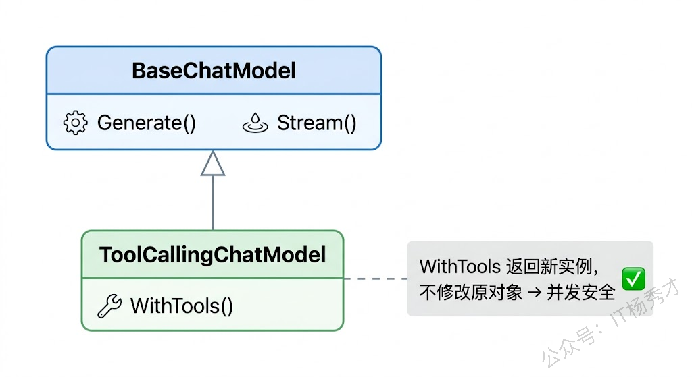
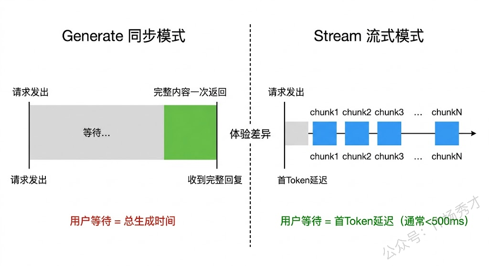
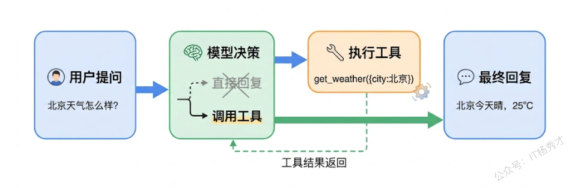
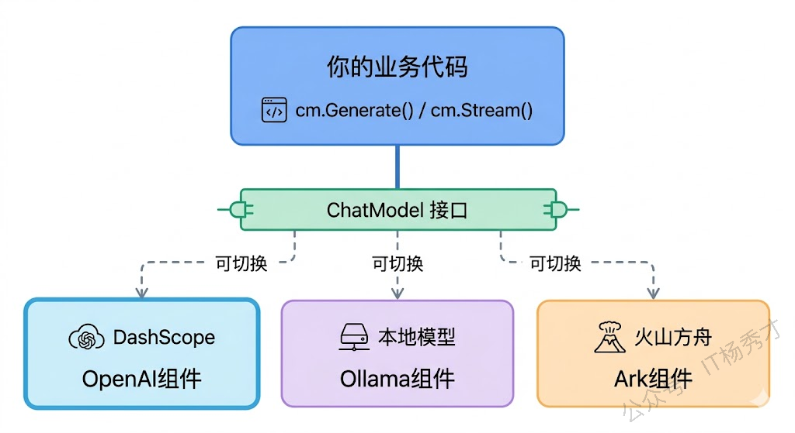

ChatModel 是 Eino 框架里最核心的组件，没有之一。不管你后面要做 Agent、RAG 还是复杂的多步骤编排，底层都绕不开 ChatModel——它就是你的程序和大模型之间的那座桥。快速上手篇里我们已经用过 ChatModel 的 `Generate` 和 `Stream` 方法，但那只是冰山一角。这篇文章会把 ChatModel 组件从接口定义到实际使用全部拆解清楚：两个核心接口是怎么设计的、Generate 和 Stream 两种模式各自适合什么场景、调用参数怎么灵活配置、怎么给模型绑定工具来实现 Function Calling，以及如何在不同模型之间切换。

## **1. 接口设计**

Eino 的 ChatModel 体系由两个接口组成，定义在 `github.com/cloudwego/eino/components/model` 包里。理解这两个接口是用好 Eino 的基础。

### **1.1 BaseChatModel**

`BaseChatModel` 是最基础的模型接口，只定义了两个方法：

```go
type BaseChatModel interface {
    Generate(ctx context.Context, input []*schema.Message, opts ...Option) (
        *schema.Message, error)
    Stream(ctx context.Context, input []*schema.Message, opts ...Option) (
        *schema.StreamReader[*schema.Message], error)
}
```

`Generate` 是同步调用——传入消息列表，等模型生成完毕，一次性拿到完整的回复消息。`Stream` 是流式调用——同样传入消息列表，但返回一个 `StreamReader`，你可以逐块读取模型正在生成的内容。两个方法的入参格式完全一样，都是 `[]*schema.Message` 加上可变的 `Option` 参数，区别只在返回值。

这里有个设计上的细节值得注意：**Eino 要求所有 ChatModel 实现都必须支持 Stream 方法**。这和有些框架不同——有的框架把 Stream 当作可选能力。Eino 这么做的理由很实际：在编排场景中，框架需要统一的流式处理管线来做流的拆分、合并和转发，如果某个组件不支持流式，整个管线就断了。

### **1.2 ToolCallingChatModel**

在 Agent 场景中，模型不仅要能聊天，还要能调用工具。`ToolCallingChatModel` 就是为此而生的，它在 `BaseChatModel` 基础上加了一个 `WithTools` 方法：

```go
type ToolCallingChatModel interface {
    BaseChatModel

    WithTools(tools []*schema.ToolInfo) (ToolCallingChatModel, error)
}
```

`WithTools` 方法接收一组工具描述信息（`[]*schema.ToolInfo`），返回一个**新的** `ToolCallingChatModel` 实例。这里"新的"两个字很关键——`WithTools` 不会修改原来的实例，而是创建一个绑定了工具的副本返回。这个设计是为了并发安全：在实际项目中，你可能有一个全局的 ChatModel 实例，不同的请求需要绑定不同的工具集，如果 `WithTools` 修改了原实例，并发场景下就会出问题。



Eino 的 OpenAI 兼容组件（`eino-ext/components/model/openai`）返回的就是 `ToolCallingChatModel` 接口，所以你可以直接用它来做工具绑定。通义千问的 `qwen-plus` 和 `qwen-max` 模型都支持 Function Calling，配合 Eino 的工具系统用起来非常顺畅。

## **2. Generate 和 Stream**

虽然快速上手篇已经演示过这两种调用方式，但这里需要更深入地聊一聊它们的适用场景和内部机制。

### **2.1 Generate 的使用场景**

`Generate` 适合那些你需要拿到完整回复才能继续处理的场景。比如在一个 Agent 的推理循环里，模型需要决定调用哪个工具——你得等模型完整输出后才能解析出工具调用指令，中间的流式片段是不完整的 JSON 结构，拿到了也没法直接用。再比如在编排管线的中间节点，下游节点依赖上游的完整输出，这时候用 `Generate` 更合适。

```go
package main

import (
        "context"
        "fmt"
        "log"
        "os"

        "github.com/cloudwego/eino-ext/components/model/openai"
        "github.com/cloudwego/eino/components/model"
        "github.com/cloudwego/eino/schema"
)

func main() {
        ctx := context.Background()

        cm, err := openai.NewChatModel(ctx, &openai.ChatModelConfig{
                BaseURL: "https://dashscope.aliyuncs.com/compatible-mode/v1",
                APIKey:  os.Getenv("DASHSCOPE_API_KEY"),
                Model:   "qwen-plus",
        })
        if err != nil {
                log.Fatal(err)
        }

        messages := []*schema.Message{
                schema.SystemMessage("你是一个JSON生成器，只输出合法的JSON，不要输出其他内容。"),
                schema.UserMessage("生成一个包含name、age、city三个字段的用户信息JSON"),
        }

        // Generate 适合需要完整输出的场景，比如解析 JSON
        resp, err := cm.Generate(ctx, messages, model.WithTemperature(0))
        if err != nil {
                log.Fatal(err)
        }

        fmt.Println("模型输出的 JSON：")
        fmt.Println(resp.Content)

        // resp.ResponseMeta 包含 Token 用量等元信息
        if resp.ResponseMeta != nil && resp.ResponseMeta.Usage != nil {
                fmt.Printf("\nToken 用量 - 输入: %d, 输出: %d, 总计: %d\n",
                        resp.ResponseMeta.Usage.PromptTokens,
                        resp.ResponseMeta.Usage.CompletionTokens,
                        resp.ResponseMeta.Usage.TotalTokens)
        }
}
```

运行结果：

```plain&#x20;text
模型输出的 JSON：
{
  "name": "张三",
  "age": 28,
  "city": "北京"
}

Token 用量 - 输入: 44, 输出: 25, 总计: 69
```

这段代码里除了基础的 Generate 调用，还展示了一个之前没提到的东西——`resp.ResponseMeta`。Eino 的 `schema.Message` 不只有 `Content` 字段，它还带了一个 `ResponseMeta` 字段，里面包含了这次调用的元信息，最常用的就是 `Usage`（Token 用量统计）。在生产环境中，Token 用量直接关系到成本，监控这个数据非常有必要。

### **2.2 Stream 的使用场景**

`Stream` 适合面向终端用户的交互场景——用户发了个问题，你希望模型的回复能即时呈现，而不是等几秒钟才一次性蹦出来。另外在一些长文本生成的场景（比如让模型写文章或者代码），流式输出能显著改善用户的等待体验。

流式模式还有一个不太直觉但很实用的优势：**降低首 Token 延迟**。在同步模式下，你需要等模型完全生成结束才能拿到响应；在流式模式下，模型产出第一个 Token 你就能收到了。对于对响应速度敏感的应用（比如实时客服），这个差异很明显。

```go
package main

import (
        "context"
        "errors"
        "fmt"
        "io"
        "log"
        "os"
        "time"

        "github.com/cloudwego/eino-ext/components/model/openai"
        "github.com/cloudwego/eino/schema"
)

func main() {
        ctx := context.Background()

        cm, err := openai.NewChatModel(ctx, &openai.ChatModelConfig{
                BaseURL: "https://dashscope.aliyuncs.com/compatible-mode/v1",
                APIKey:  os.Getenv("DASHSCOPE_API_KEY"),
                Model:   "qwen-plus",
        })
        if err != nil {
                log.Fatal(err)
        }

        messages := []*schema.Message{
                schema.SystemMessage("你是一个技术博主，文风活泼。"),
                schema.UserMessage("用100字介绍 Go 的错误处理机制"),
        }

        start := time.Now()

        stream, err := cm.Stream(ctx, messages)
        if err != nil {
                log.Fatal(err)
        }
        defer stream.Close()

        firstChunk := true
        for {
                chunk, err := stream.Recv()
                if errors.Is(err, io.EOF) {
                        break
                }
                if err != nil {
                        log.Fatal(err)
                }

                if firstChunk {
                        fmt.Printf("[首 Token 延迟: %dms]\n", time.Since(start).Milliseconds())
                        firstChunk = false
                }
                fmt.Print(chunk.Content)
        }

        fmt.Printf("\n[总耗时: %dms]\n", time.Since(start).Milliseconds())
}
```

运行结果：

```plain&#x20;text
[首 Token 延迟: 506ms]
Go 没有 try-catch！它用「显式错误返回」贯彻“错误是值”的哲学——函数常以 `error` 类型作为最后一个返回值（如 `val, err := doSomething()`）。开发者必须主动检查 `if err != nil`，拒绝忽略错误。标准库提供 `errors.New()` 和 `fmt.Errorf()` 创建错误，1.13+ 支持链式错误（`%w`）和 `errors.Is/As` 判断。简洁、透明、强制处理——写 Go，先想错误怎么兜住 😉
[总耗时: 3749ms]
```

可以看到，首 Token 只用了不到 500 多毫秒就到了，而完整生成用了近 3秒多。如果用 `Generate` 同步调用，用户就得干等 3秒才能看到任何内容。



## **3. 调用参数**

Eino 的 ChatModel 有两个层面的参数控制：一是创建实例时通过 `ChatModelConfig` 设置的**默认参数**，二是每次调用时通过 `Option` 传入的**临时参数**。临时参数会覆盖默认参数。

### **3.1 通过 Config 设置默认参数**

创建 ChatModel 时设置的参数会对这个实例的所有后续调用生效：

```go
cm, err := openai.NewChatModel(ctx, &openai.ChatModelConfig{
    BaseURL:     "https://dashscope.aliyuncs.com/compatible-mode/v1",
    APIKey:      os.Getenv("DASHSCOPE_API_KEY"),
    Model:       "qwen-plus",     // 默认模型
    Temperature: ptr(float32(0.7)), // 默认温度
    MaxTokens:   ptr(2048),        // 默认最大 Token 数
    TopP:        ptr(float32(0.9)), // 默认 Top-P
    Timeout:     30 * time.Second,  // 请求超时时间
})

// 辅助函数，快速创建指针
func ptr[T any](v T) *T { return &v }
```

`Temperature`、`MaxTokens`、`TopP` 这三个参数在大模型基础篇里已经详细讲过，这里简单回顾一下它们在实际开发中的取值建议：

| 参数          | 含义     | Agent 场景建议值  | 创意生成建议值    |
| ----------- | ------ | ------------ | ---------- |
| Temperature | 输出随机性  | 0 \~ 0.3     | 0.7 \~ 1.0 |
| MaxTokens   | 最大生成长度 | 1024 \~ 2048 | 4096+      |
| TopP        | 核采样阈值  | 0.8 \~ 0.95  | 0.9 \~ 1.0 |

Agent 场景要求模型输出稳定、格式可预测（比如严格的 JSON 或工具调用指令），所以 Temperature 要低。创意生成（写文章、编故事）反过来，需要多样性，Temperature 可以高一些。

### **3.2 通过 Option 动态覆盖**

有时候同一个 ChatModel 实例在不同场景下需要不同的参数。比如你的 Agent 在分析阶段需要低 Temperature（稳定输出），但在生成最终回答时需要稍高的 Temperature（更自然的表达）。这时候可以在调用时传入 Option 来临时覆盖：

```go
package main

import (
        "context"
        "fmt"
        "log"
        "os"

        "github.com/cloudwego/eino-ext/components/model/openai"
        "github.com/cloudwego/eino/components/model"
        "github.com/cloudwego/eino/schema"
)

func main() {
        ctx := context.Background()

        cm, err := openai.NewChatModel(ctx, &openai.ChatModelConfig{
                BaseURL: "https://dashscope.aliyuncs.com/compatible-mode/v1",
                APIKey:  os.Getenv("DASHSCOPE_API_KEY"),
                Model:   "qwen-plus",
        })
        if err != nil {
                log.Fatal(err)
        }

        messages := []*schema.Message{
                schema.UserMessage("用一句话描述春天"),
        }

        // 低 Temperature：输出稳定、确定性高
        fmt.Println("Temperature=0（确定性输出）：")
        for i := 0; i < 3; i++ {
                resp, _ := cm.Generate(ctx, messages, model.WithTemperature(0))
                fmt.Printf("  第%d次: %s\n", i+1, resp.Content)
        }

        // 高 Temperature：输出多样、有创意
        fmt.Println("\nTemperature=1.0（多样性输出）：")
        for i := 0; i < 3; i++ {
                resp, _ := cm.Generate(ctx, messages, model.WithTemperature(1.0))
                fmt.Printf("  第%d次: %s\n", i+1, resp.Content)
        }

        // 动态切换模型：用 qwen-turbo 来做轻量快速的任务
        fmt.Println("\n用 qwen-turbo 模型：")
        resp, _ := cm.Generate(ctx, messages, model.WithModel("qwen-turbo"))
        fmt.Printf("  %s\n", resp.Content)
}
```

运行结果：

```plain&#x20;text
Temperature=0（确定性输出）：
  第1次: 春天是万物复苏、生机盎然的季节。
  第2次: 春天是万物复苏、生机盎然的季节。
  第3次: 春天是万物复苏、生机盎然的季节。

Temperature=1.0（多样性输出）：
  第1次: 春天是大地从沉睡中醒来，用花朵和绿叶重新书写生命故事的季节。
  第2次: 春风拂面，万物吐新，春天是一场不请自来的温柔革命。
  第3次: 春天像一把钥匙，打开了冬日里封存的所有色彩与声音。

用 qwen-turbo 模型：
  春天是万物苏醒、百花盛开的美好季节。
```

注意 `model.WithModel("qwen-turbo")` 这个用法——你可以在运行时动态切换模型，不需要创建新的 ChatModel 实例。这在某些场景下非常实用，比如简单的意图分类用 `qwen-turbo`（便宜且快），复杂的推理任务用 `qwen-max`（能力更强但贵一些）。

> 注意：这里即使设置Temperature=1.0，也可能得到三次一样的结果。因为通义千问 API 的有一个行为特点，qwen-plus 模型即使设置 temperature=1.0，对于"用一句话描述春天"这种短输出、高确定性的简单任务，模型的 top token 概率本身就非常集中，temperature 调高也很难改变结果。    &#x20;

## **4. 工具绑定**

ChatModel 的另一个重要能力是工具绑定——也就是告诉模型"你有哪些工具可以用"。模型在生成回复时，如果判断需要调用某个工具，就会在回复中输出工具调用的指令（而不是直接给出文本答案）。这就是 Function Calling 的核心机制，也是 Agent 能力的基石。

### **4.1 WithTools 的使用方式**

`WithTools` 方法接收工具描述列表，返回一个绑定了工具的新 ChatModel 实例：

```go
package main

import (
    "context"
    "fmt"
    "log"
    "os"

    "github.com/cloudwego/eino-ext/components/model/openai"
    "github.com/cloudwego/eino/schema"
)

func main() {
    ctx := context.Background()

    cm, err := openai.NewChatModel(ctx, &openai.ChatModelConfig{
       BaseURL: "https://dashscope.aliyuncs.com/compatible-mode/v1",
       APIKey:  os.Getenv("DASHSCOPE_API_KEY"),
       Model:   "qwen-plus",
    })
    if err != nil {
       log.Fatal(err)
    }

    // 定义工具描述信息
    weatherTool := &schema.ToolInfo{
       Name: "get_weather",
       Desc: "查询指定城市的当前天气",
       ParamsOneOf: schema.NewParamsOneOfByParams(map[string]*schema.ParameterInfo{
          "city": {
             Type:     "string",
             Desc:     "城市名称，如：北京、上海",
             Required: true,
          },
       }),
    }

    // 用 WithTools 绑定工具，返回新实例
    cmWithTools, err := cm.WithTools([]*schema.ToolInfo{weatherTool})
    if err != nil {
       log.Fatal(err)
    }

    // 用绑定了工具的实例来调用
    messages := []*schema.Message{
       schema.SystemMessage("你是一个天气助手。你必须通过调用工具来查询天气，如果没有可用的工具，请直接告诉用户你无法查询实时天气信息，不要编造任何天气数据。"),
       schema.UserMessage("北京今天天气怎么样？"),
    }

    resp, err := cmWithTools.Generate(ctx, messages)
    if err != nil {
       log.Fatal(err)
    }

    // 检查模型是否发起了工具调用
    if len(resp.ToolCalls) > 0 {
       fmt.Println("模型请求调用工具：")
       for _, tc := range resp.ToolCalls {
          fmt.Printf("  工具名: %s\n", tc.Function.Name)
          fmt.Printf("  参数: %s\n", tc.Function.Arguments)
       }
    } else {
       fmt.Println("模型直接回复：", resp.Content)
    }

    // 原始的 cm 没有绑定工具，不受影响
    // 使用不同的 messages，明确告知模型它没有任何工具可用
    messagesNoTool := []*schema.Message{
       schema.SystemMessage("你是一个天气助手，但你没有任何工具可以使用。当用户询问天气时，你如果不知道，就要回答不知道，绝对不能编造天气信息。"),
       schema.UserMessage("北京今天天气怎么样？"),
    }
    resp2, _ := cm.Generate(ctx, messagesNoTool)
    fmt.Println("\n未绑定工具的实例回复：", resp2.Content)
}
```

运行结果：

```plain&#x20;text
模型请求调用工具：
  工具名: get_weather
  参数: {"city": "北京"}

未绑定工具的实例回复： 我不知道北京今天的天气情况。建议您查看权威天气预报平台或使用天气应用获取最新信息。
```

这段代码清楚地展示了两个关键点。第一，绑定了工具的 `cmWithTools` 实例知道自己有 `get_weather` 这个工具可用，所以当用户问天气时，它选择输出一个工具调用请求而不是直接文本回复。第二，原始的 `cm` 实例没有绑定工具，所以它只能老老实实告诉你"我查不了天气"。这就是 `WithTools` 返回新实例的好处——两个实例互不干扰。

### **4.2 Message 中的 ToolCalls**

模型发起工具调用时，回复消息的 `ToolCalls` 字段会包含具体的调用信息。每个 `ToolCall` 的结构是这样的：

```go
type ToolCall struct {
    ID       string    // 本次调用的唯一标识
    Function Function  // 具体的函数信息
}

type Function struct {
    Name      string // 工具名称
    Arguments string // 参数（JSON 字符串）
}
```

在一个完整的 Agent 工作流中，拿到 `ToolCalls` 后你需要做三件事：解析参数、执行对应的工具函数、把工具的执行结果构造成 `schema.Message` 返回给模型让它继续推理。这个完整的闭环我们会在后面的"工具定义与使用"和"ReAct Agent 实战"两篇文章里详细展开，这里先理解 ChatModel 层面的工具调用输出格式就够了。



## **5. 多模型切换**

实际项目中你很可能需要对接不同的模型提供商——开发调试用本地的 Ollama 免费模型，生产环境用通义千问的 API。Eino 的组件化设计让这种切换变得很简单：**所有模型实现都满足同一个接口，你的业务代码不需要改任何东西**。

### **5.1 切换到 Ollama 本地模型**

Ollama 是一个非常方便的本地大模型运行工具，支持 Llama、Qwen、Mistral 等一众开源模型。Eino 的 `eino-ext` 仓库提供了 Ollama 的 ChatModel 实现。

先确保你本地装好了 Ollama 并拉取了一个模型：

```bash
# 安装 Ollama（macOS）
brew install ollama

# 启动 Ollama 服务
ollama serve

# 拉取 qwen2.5 模型（约 4GB）
ollama pull qwen2.5:7b     # 另起一个终端
```

安装 Eino 的 Ollama 组件：

```bash
go get github.com/cloudwego/eino-ext/components/model/ollama
```

然后在代码里切换模型提供商：

```go
package main

import (
        "context"
        "fmt"
        "log"

        "github.com/cloudwego/eino-ext/components/model/ollama"
        "github.com/cloudwego/eino/components/model"
        "github.com/cloudwego/eino/schema"
)

func main() {
        ctx := context.Background()

        // 创建 Ollama ChatModel，连接本地服务
        cm, err := ollama.NewChatModel(ctx, &ollama.ChatModelConfig{
                BaseURL: "http://localhost:11434", // Ollama 默认地址
                Model:   "qwen2.5:7b",
        })
        if err != nil {
                log.Fatal(err)
        }

        // 后续代码和用通义千问时完全一样
        messages := []*schema.Message{
                schema.SystemMessage("你是一个Go语言助手，回答简洁。"),
                schema.UserMessage("Go的interface是隐式实现的，这有什么好处？"),
        }

        resp, err := cm.Generate(ctx, messages)
        if err != nil {
                log.Fatal(err)
        }

        fmt.Println(resp.Content)
}
```

运行结果：

```shell
隐式实现接口意味着不需要显式声明某个类型实现了某个接口，只要该类型的值满足接口定义的方法集即可自动实现接口。这样可以提高代码灵活性和减少冗余代码，方便快速开发和原型设计。
```

注意看，从 `openai.NewChatModel` 切换到 `ollama.NewChatModel`，除了 import 路径和 Config 结构不同，后面的 Generate/Stream 调用代码完全不用改。这就是面向接口编程的好处。

### **5.2 工厂函数封装**

在实际项目中，一个常见的做法是写一个工厂函数，根据配置或环境变量来决定用哪个模型提供商，这样切换模型只需要改一个环境变量：

```go
package main

import (
        "context"
        "fmt"
        "log"
        "os"

        eino_openai "github.com/cloudwego/eino-ext/components/model/openai"
        "github.com/cloudwego/eino/components/model"
        "github.com/cloudwego/eino/schema"
)

// NewChatModel 根据环境变量创建对应的 ChatModel
func NewChatModel(ctx context.Context) model.ToolCallingChatModel {
        provider := os.Getenv("LLM_PROVIDER") // "dashscope" 或 "ollama"

        switch provider {
        case "ollama":
                // 如果要用 Ollama，需要额外 import ollama 包
                // cm, err := ollama.NewChatModel(ctx, &ollama.ChatModelConfig{...})
                log.Fatal("请取消注释 ollama 相关代码")
                return nil
        default:
                // 默认使用通义千问 DashScope
                cm, err := eino_openai.NewChatModel(ctx, &eino_openai.ChatModelConfig{
                        BaseURL: "https://dashscope.aliyuncs.com/compatible-mode/v1",
                        APIKey:  os.Getenv("DASHSCOPE_API_KEY"),
                        Model:   os.Getenv("LLM_MODEL"), // 通过环境变量指定模型
                })
                if err != nil {
                        log.Fatalf("创建 ChatModel 失败: %v", err)
                }
                return cm
        }
}

func main() {
        ctx := context.Background()
        cm := NewChatModel(ctx)

        resp, err := cm.Generate(ctx, []*schema.Message{
                schema.UserMessage("你好，你是谁？"),
        })
        if err != nil {
                log.Fatal(err)
        }
        fmt.Println(resp.Content)
}
```

```bash
# 用通义千问
LLM_PROVIDER=dashscope LLM_MODEL=qwen-plus go run main.go

# 用 Ollama 本地模型（需要取消注释对应代码）
LLM_PROVIDER=ollama go run main.go
```

这种模式在真实项目里很常见——开发时用免费的本地 Ollama 调试，上线时切换到通义千问的 API，整个切换过程只是改个环境变量的事。



## **6. schema.Message 详解**

前面我们一直在用 `schema.Message`，但只用到了 `Content` 和 `ToolCalls` 两个字段。实际上 Message 还有好几个重要的字段，在 Agent 开发中会频繁用到。

`Role` 字段标识消息的角色，Eino 定义了四个标准角色：`schema.System`（系统提示词）、`schema.User`（用户输入）、`schema.Assistant`（模型回复）、`schema.Tool`（工具执行结果）。在多轮对话和 Agent 推理循环中，你需要正确设置每条消息的角色，模型才能理解对话的结构。

`ToolCalls` 字段我们刚才已经见过了，它是模型请求调用工具时的输出。与之对应的是 `ToolCallID` 字段——当你把工具执行结果返回给模型时，需要在消息里带上 `ToolCallID`，这样模型才知道这个结果是对应哪次工具调用的。

`ResponseMeta` 字段只存在于模型返回的消息中，包含 Token 用量（`Usage`）等元信息。在流式模式下，通常只有最后一个 chunk 的 `ResponseMeta` 里才有完整的 Token 用量统计。

Eino 还提供了几个便捷的消息构造函数，省去了手动设置 Role 的麻烦：

```go
// 这三种写法是等价的
msg1 := schema.UserMessage("你好")
msg2 := &schema.Message{Role: schema.User, Content: "你好"}

// 工具结果消息
toolResult := &schema.Message{
    Role:       schema.Tool,
    Content:    `{"temperature": 25, "weather": "晴"}`,
    ToolCallID: "call_abc123", // 对应之前的 ToolCall.ID
}
```

## **7. 小结**

ChatModel 的接口只有三个方法，但它承载的能力却撑起了 Eino 的半壁江山。`Generate` 和 `Stream` 解决的是"怎么和模型对话"的问题，`WithTools` 解决的是"怎么让模型用工具"的问题，而面向接口的设计则保证了你的代码不会被某个具体的模型提供商绑死。理解了这些，后面要做 Prompt 模板、工具编排还是 Agent 构建，你都知道底下跑的到底是什么。

<div style="background-color: #f0f9eb; padding: 10px 15px; border-radius: 4px; border-left: 5px solid #67c23a; margin: 20px 0; color:rgb(64, 147, 255);">

<span style="color: #006400; font-size: 28px;"><strong>关注秀才公众号：</strong></span><span style="color: red; font-size: 28px;"><strong>IT杨秀才</strong></span><span style="color: #006400; font-size: 28px;"><strong>，回复：</strong></span><span style="color: red; font-size: 28px;"><strong>面试</strong></span>

<div style="text-align: center;"><span style="color: #006400; font-size: 28px;"><strong>领取后端/AI面试题库PDF</strong></span></div>


</div> 

