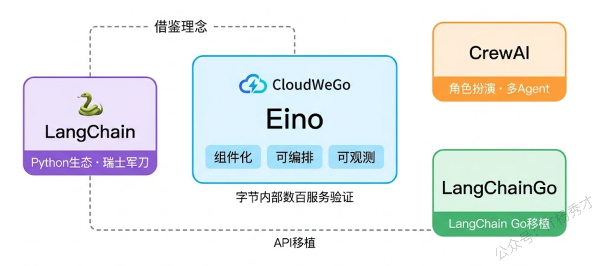
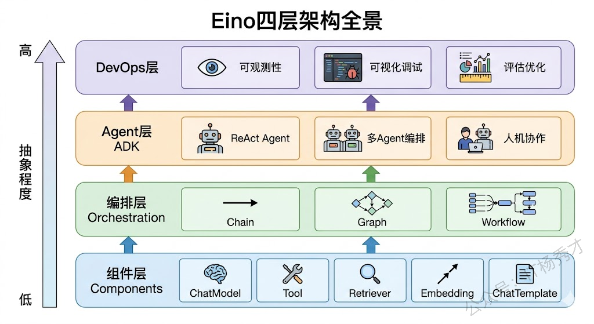
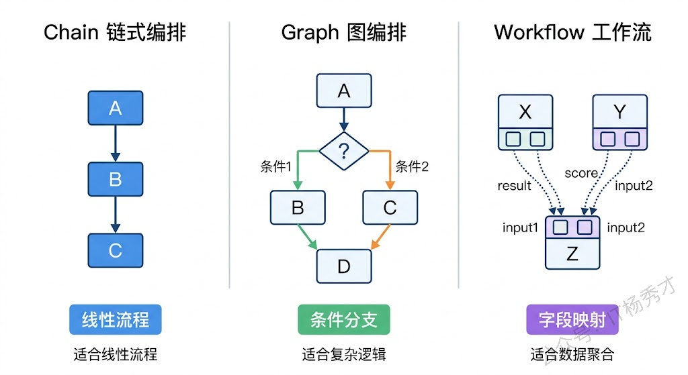
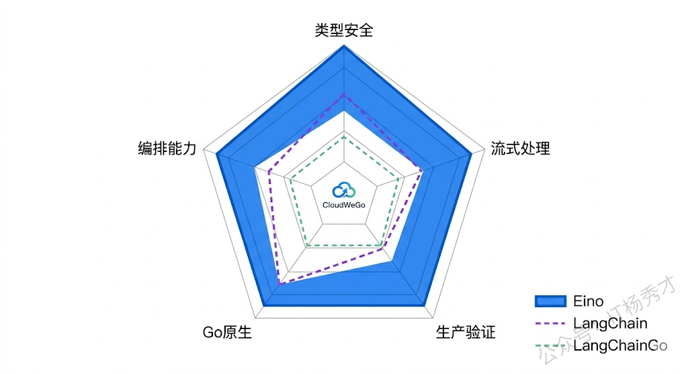
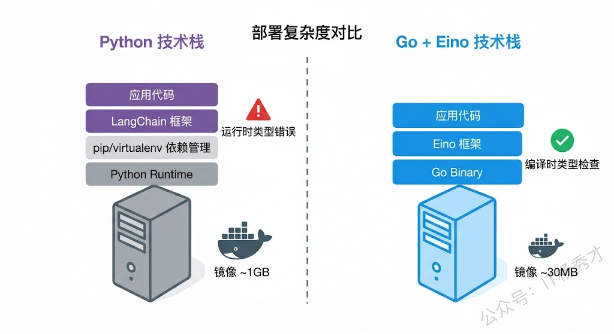

从这篇开始，我们正式进入 Eino 框架入门阶段。Eino 是字节跳动开源的一个 Go 语言大模型应用开发框架，隶属于 CloudWeGo 开源体系。和市面上那些 Python 为主的框架不同，Eino 从第一行代码就是为 Go 开发者设计的，而且它不是某个实验室的玩具——在开源之前，Eino 已经在字节内部经过半年多的迭代打磨，豆包、抖音、扣子等多条业务线、数百个服务都在用它。可以说，Eino已经是一个经过了大量实战检验的Agent框架了。

## **1. Eino 是什么**

Eino 是 CloudWeGo 团队开源的一套 Go 语言 LLM 应用开发框架，目标是成为 Go 生态下构建大模型应用的首选方案。它的 GitHub 仓库地址是 `github.com/cloudwego/eino`，配套的扩展库是 `github.com/cloudwego/eino-ext`。

说到 LLM 应用开发框架，大家第一反应可能是 Python 圈的 LangChain。确实，LangChain 是这个领域的先行者，生态也非常成熟。但 Eino 并不是 LangChain 的 Go 翻译版——它借鉴了 LangChain、Google ADK 等框架的设计理念，但整个架构是按照 Go 的惯例从头设计的。比如用接口来抽象组件、用强类型来做编排时的类型检查、用 goroutine 来实现并行编排——这些都是 Go 语言本身的优势，而不是硬套 Python 的设计模式。

用一句话概括 Eino 的定位：**它是一个组件化、可编排、可观测的 Go 语言 LLM 应用开发框架**。"组件化"意味着你可以像搭积木一样组合各种能力，"可编排"意味着你可以用 Chain、Graph、Workflow 三种方式把组件串联起来，"可观测"意味着从日志到链路追踪，框架层面就帮你解决了。

## **2. 字节内部实战背景**

很多开源框架的问题是"实验室出品"——Demo 跑得很漂亮，但一到生产环境就各种水土不服。Eino 的一大优势恰恰在于它是从生产环境中长出来的。

在正式开源之前，Eino 已经在字节跳动内部运行了半年多。豆包（字节的 AI 助手产品）、抖音的智能交互、扣子（Coze，字节的 Agent 开发平台）等多条核心业务线都在用它构建大模型应用。根据官方公布的数据，字节内部有数百个服务接入了 Eino。这意味着什么？意味着 Eino 经历过真实的高并发场景、复杂的多 Agent 协作需求、严苛的性能要求，以及各种你想得到想不到的边界情况。

这种"先内部验证，再开源"的路线给 Eino 带来了几个好处。第一是稳定性——大部分该踩的坑已经踩过了，你不太会碰到那种"一用就崩"的低级问题。第二是设计的合理性——框架的 API 不是拍脑袋想出来的，而是在大量真实业务场景中反复打磨的结果。第三是性能——字节的业务体量决定了这个框架必须能扛住高 QPS，流式处理、并发编排这些能力不是附加功能而是核心需求。

## **3. 核心架构**

Eino 的整体架构可以拆分成四个层次：**组件层**、**编排层**、**Agent 层**和**DevOps 层**。这四个层次从底到顶，越往上抽象程度越高，使用起来也越简单。

### **3.1 组件层**

组件是 Eino 的基石。Eino 把大模型应用中常用的能力抽象成了一组标准接口，每个接口就是一种"组件类型"。最核心的几个组件包括：

**ChatModel** 是最基础的组件，负责和大模型交互。你给它一组消息，它返回模型的回复。Eino 定义了 `model.ChatModel` 接口，不管你底层用的是通义千问、GPT 还是 Claude，只要实现了这个接口就能无缝切换。`eino-ext` 仓库里已经提供了 OpenAI 兼容接口、Ollama、Ark（字节火山方舟）等多种实现。

**Tool** 是工具组件，对应 Agent 里的 Function Calling 能力。Eino 定义了 `tool.InvokableTool` 和 `tool.StreamableTool` 两个接口，前者用于普通的请求-响应式工具调用，后者用于流式输出的工具。你可以用 `utils.NewTool` 这个辅助函数快速把一个 Go 函数包装成工具。

**Retriever** 是检索组件，主要用在 RAG 场景。它负责根据查询条件从知识库中检索相关文档。Embedding 组件则负责把文本转换成向量，通常和 Retriever 配合使用。

**ChatTemplate** 是提示词模板组件，帮你管理复杂的 Prompt 构建逻辑，支持变量替换、消息占位符等功能。

这里的关键设计理念是**面向接口编程**。Eino 不是把所有功能写死在框架里，而是定义好接口契约，让社区和用户自由实现。这和 Go 语言 `io.Reader`、`io.Writer` 的设计哲学一脉相承——你只要满足接口定义，框架就能帮你把一切串联起来。

### **3.2 编排层**

有了组件之后，下一个问题就是怎么把它们串联起来。一个真实的大模型应用往往不是"调一下模型就完了"，而是需要经过 Prompt 构建 → 模型调用 → 工具执行 → 结果整合这样的多步骤流程。Eino 提供了三种编排方式来应对不同复杂度的场景。

**Chain** 是最简单的编排方式，就是把组件像流水线一样一个接一个串起来。上一个组件的输出就是下一个组件的输入，中间没有分支也没有条件判断。如果你的业务逻辑是线性的——比如"拼 Prompt → 调模型 → 解析结果"，用 Chain 就够了。

**Graph** 是功能最强大的编排方式，它把组件当作"节点"，用"边"来定义节点之间的连接关系，支持条件分支、并行执行和循环。你可以在图中加入 `Branch` 节点，根据上一个节点的输出决定走哪条路。Graph 的威力在于它几乎能表达任何业务流程，而且 Eino 在 `Compile` 阶段会做完整的类型检查——如果上游节点的输出类型和下游节点的输入类型不匹配，编译时就报错，不用等到运行时才发现问题。

**Workflow** 和 Graph 很像，区别在于它支持"字段级别的数据映射"。Graph 里节点之间传递的是完整的数据对象，而 Workflow 允许你把上游节点输出的某个字段映射到下游节点输入的某个字段。这在数据流比较复杂、多个节点输出需要合并成一个输入的场景下特别有用。

### **3.3 Agent 层**

编排层已经能搞定大部分流程化的需求了，但 Agent 场景有个特殊之处：Agent 的行为不是预先确定的，而是由大模型在运行时动态决策的——模型自己决定调用哪个工具、什么时候停止。为了让 Agent 开发更简单，Eino 在编排层之上提供了一套 ADK（Agent Development Kit）。

注意这里的 ADK 是 Eino 框架自带的一个模块（`github.com/cloudwego/eino/adk`），不是 Google 的那个 ADK。Eino 的 ADK 提供了几种开箱即用的 Agent 模式：

**ChatModelAgent** 是最基础的 Agent 类型，内部实现了 ReAct 模式——模型接收输入后，自行决定是否调用工具，拿到工具结果后再决定下一步，直到得出最终答案。你只需要配置模型和工具列表，Agent 的推理循环由框架自动管理。

**SequentialAgent** 把多个 Agent 串联成一条流水线，前一个 Agent 的输出自动作为后一个 Agent 的输入。适合"分析 → 总结 → 生成报告"这种分阶段处理的场景。

**ParallelAgent** 让多个 Agent 同时执行，适合"从多个角度同时分析同一个问题"的场景，比如同时做技术分析、商业分析和安全分析。

**LoopAgent** 让一个 Agent 反复执行直到满足某个退出条件，适合需要自我迭代优化的场景。

这些 Agent 模式可以任意嵌套组合。比如你可以创建一个 `SequentialAgent`，第一步是一个单独的`ChatModelAgent` 做分析，第二步是一个 ParallelAgent 同时从多个角度生成内容，第三步再是一个 `ChatModelAgent` 做汇总——这种灵活的组合能力是 Eino ADK 的核心优势。

### **3.4 DevOps 层**

框架好不好用，调试体验占了很大比重。Eino 的 DevOps 层提供了两个关键能力。

第一是**回调机制**。Eino 内置了 `callbacks.HandlerBuilder`，允许你在组件执行的各个阶段注入自定义逻辑——`OnStart`（执行前）、`OnEnd`（执行后）、`OnError`（出错时），以及对应的流式版本。你可以用它来记录每次模型调用的耗时和 Token 用量，追踪工具调用的输入输出，或者接入 OpenTelemetry 做分布式链路追踪。

第二是**可视化调试**。`eino-ext/devops` 模块提供了可视化开发和调试界面，让你能直观地看到 Graph 的执行流程、每个节点的输入输出、以及数据在节点间的流转情况。

## **4. 框架对比**

既然市面上已经有了 LangChain、LangChainGo、CrewAI 这些选择，为什么还要用 Eino？这个问题值得认真聊一聊。

先说 **LangChain**。它是 Python 圈 LLM 应用开发的事实标准，生态极其丰富，几乎你能想到的任何 LLM 相关功能都有现成的集成。但问题也很明显：第一，它是 Python 的，如果你的后端技术栈是 Go，引入 Python 意味着额外的运维成本和技术栈割裂；第二，LangChain 的抽象层次很多，有时候你只是想调个模型加个工具，却要理解一大堆概念；第三，Python 作为动态语言，类型检查弱，很多错误要到运行时才能发现。

再说 **LangChainGo**（`github.com/tmc/langchaingo`）。这是社区做的 LangChain Go 语言移植版，API 设计基本对标 LangChain Python。它的优点是如果你熟悉 LangChain，上手几乎零成本。但缺点也很明显——它本质上是在"翻译" Python 的设计思路到 Go，有些地方为了兼容 LangChain 的 API 风格，写出来的 Go 代码不够地道。而且作为社区项目，维护力度和稳定性不如有大厂背书的框架。

**CrewAI** 聚焦在多 Agent 角色扮演协作，适合那种"把任务分配给不同角色的 Agent 协作完成"的场景。思路很有意思，但它是纯 Python 的，而且应用范围比较窄。

Eino 的差异化优势在于几个方面。首先是**Go 原生设计**——接口抽象、类型检查、并发处理这些都是按 Go 的方式来的，写出来的代码就是正常的 Go 代码，用 GoLand 或者 VS Code 的 Go 插件就能享受完整的代码补全和类型检查。其次是**编译时类型安全**——Graph 编排在 `Compile` 阶段就会检查上下游节点的类型是否匹配，不像动态语言框架那样等运行到某个节点才报 "type mismatch" 错误。然后是**生产环境验证**——字节内部数百个服务在跑，这个可靠性背书是很多开源框架没有的。最后是**流式处理的第一优先级**——大模型的输出天然是流式的，Eino 在编排层就自动处理了流的拼接、拆分、复制和合并，你不需要自己操心这些麻烦事。

下面用一张表格做个直观的对比：

| 维度       | Eino                 | LangChain     | LangChainGo   |
| -------- | -------------------- | ------------- | ------------- |
| 语言       | Go（原生设计）             | Python        | Go（移植自Python） |
| 类型安全     | 编译时检查                | 运行时检查         | 部分编译时检查       |
| 流式支持     | 框架层自动处理              | 需要手动处理        | 基础支持          |
| Agent 能力 | ADK 多模式 Agent        | AgentExecutor | 基础 Agent      |
| 编排方式     | Chain/Graph/Workflow | Chain/Graph   | Chain         |
| 生产验证     | 字节内部数百服务             | 大量社区项目        | 社区项目          |
| 生态丰富度    | 在建设中                 | 非常成熟          | 中等            |
| 中文社区     | 友好（国内团队）             | 一般            | 一般            |

需要说明的一点是，Eino 目前的生态丰富度还不如 LangChain。LangChain 有海量的社区集成和第三方插件，而 Eino 作为一个相对年轻的开源项目，第三方集成还在持续建设中。但 `eino-ext` 仓库已经覆盖了最常用的组件实现（OpenAI 兼容模型、Ollama、向量数据库等），对于大多数项目来说完全够用了。

## **5. 为什么用 Go 写 Agent 应用**

最后聊一个更根本的问题：为什么要用 Go 来做大模型应用开发？这个领域明明 Python 一家独大。

第一个理由是**性能和资源效率**。Go 是编译型语言，运行时性能远超 Python。在 Agent 应用中，模型推理的耗时是大头，这一点 Go 和 Python 没区别（都是调远程 API）。但在模型调用之外的逻辑——比如工具执行、数据处理、结果聚合、并发请求——Go 的性能优势就非常明显了。特别是当你的 Agent 需要同时调用多个工具或者并行执行多个子任务时，Go 的 goroutine 比 Python 的 asyncio 写起来简单得多、性能也好得多。

第二个理由是**部署的简洁性**。Go 编译出来的是一个静态链接的二进制文件，不依赖任何运行时环境。你不需要在生产服务器上装 Python、管理 virtualenv、处理依赖冲突——直接把二进制文件丢上去就能跑。对于需要容器化部署的场景，Go 应用的 Docker 镜像可以做到几十 MB，而 Python 应用动辄几百 MB 甚至上 GB。

第三个理由是**类型安全**。大模型应用的一个痛点是数据格式不确定——模型可能返回非预期的 JSON 结构、工具的输入输出可能不匹配、消息格式在不同组件之间传递时可能丢失字段。Go 的静态类型系统加上 Eino 编排层的编译时检查，能在开发阶段就把这些问题揪出来，而不是等线上出了 bug 再去排查。

第四个理由是**团队技术栈统一**。如果你的后端服务已经是 Go 写的（国内不少公司都是如此），用 Go 来做 Agent 应用意味着团队不需要多学一门语言、不需要多维护一套技术栈、不需要在 Go 服务和 Python 服务之间搞进程间通信。代码审查、部署流程、监控体系全都复用现有的。

当然，选 Go 不是没有代价的。Go 生态下的 AI/ML 相关库远不如 Python 丰富，如果你的项目需要大量的数据科学处理（比如在本地做模型微调、数据清洗），Python 仍然是更好的选择。但如果你的场景是"调用远程大模型 API + 工具编排 + 生产化部署"这种典型的 Agent 应用，Go + Eino 是一个非常务实的组合。

## **6. Eino 的仓库结构**

最后， Eino 有几个相关的 GitHub 仓库，后面写代码的时候会经常和它们打交道。

**eino**（`github.com/cloudwego/eino`）是核心仓库，包含所有的类型定义、组件接口、编排引擎（Chain/Graph/Workflow）、ADK Agent 实现、回调机制和流式处理。你写的每一行 Eino 代码都离不开这个仓库。

**eino-ext**（`github.com/cloudwego/eino-ext`）是扩展仓库，包含各种组件接口的具体实现。比如 OpenAI 兼容的 ChatModel 实现在 `eino-ext/components/model/openai`，Ollama 的实现在 `eino-ext/components/model/ollama`，还有各种 Retriever、Embedding、Callback Handler 的实现。DevOps 可视化调试工具也在这个仓库里。

**eino-examples**（`github.com/cloudwego/eino-examples`）是示例仓库，包含各种使用场景的完整代码示例。刚上手的时候多翻翻这个仓库，比看文档更直观。

简单来说：**eino 定义"能做什么"，eino-ext 实现"怎么做"，eino-examples 展示"怎么用"**。

## **7. 小结**

选框架这件事，说到底是在选一套思维方式。Eino 带来的不只是一堆 API，而是一种"用 Go 的方式构建大模型应用"的方法论——组件化抽象让你不被具体实现绑架，分层编排让你的业务逻辑既有灵活性又有可控性，而编译时的类型安全则像一张隐形的安全网，帮你在代码跑起来之前就过滤掉一大类低级错误。再加上字节内部真实业务的打磨，这套框架的可靠性不是 README 上的承诺，而是生产流量验证过的事实。接下来的几篇文章，我们会从环境搭建开始，一步一步把 Eino 的每个核心模块都摸个透。

<strong>关注秀才公众号：</strong><strong>IT杨秀才</strong><strong>，回复：</strong><strong>面试</strong>

<strong>领取后端/AI面试题库PDF</strong>

 

