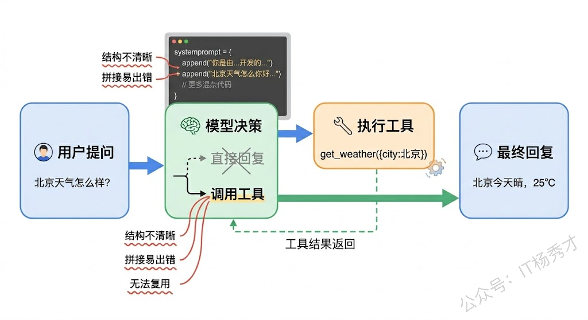
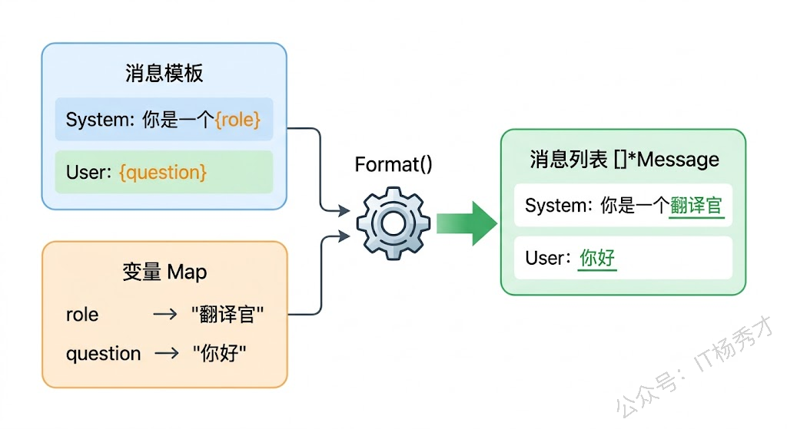
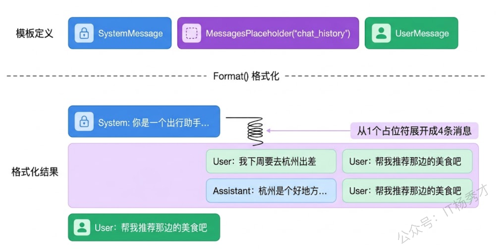
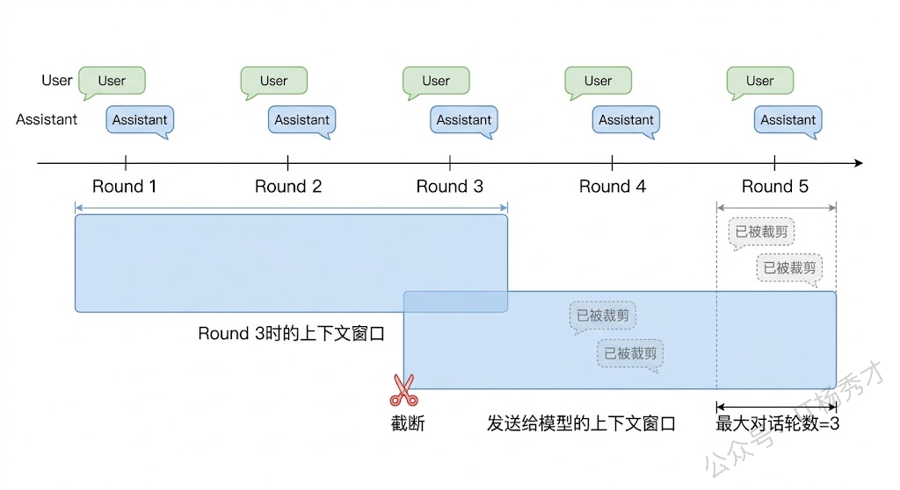
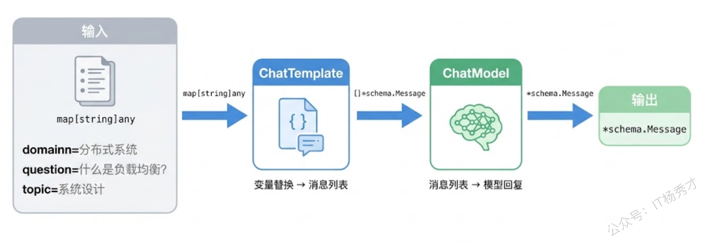

写过几个 Eino 程序之后你会发现一个问题：每次调用模型，消息列表都是在代码里硬编码的。System Prompt 写死了，用户输入写死了，如果要改一个字就得改代码重新编译。更麻烦的是，当你想在不同的业务场景中复用同一套 Prompt 结构（只是具体内容不同），硬编码就变成了复制粘贴——这在工程上是不可接受的。

Eino 的 `ChatTemplate` 就是用来解决这个问题的。它把消息列表变成了一个模板，里面可以放变量占位符，运行时再填入实际值。更巧妙的是，它还支持 `MessagesPlaceholder`——你可以在模板的某个位置"留一个插槽"，运行时往里塞一组动态消息，比如历史对话记录。这两个能力组合起来，就让你的 Prompt 从"硬编码的字符串"变成了"可复用、可配置的结构化模板"。

## **1. 为什么需要 Prompt 模板**

先看一个没用模板的典型代码：

```go
func buildMessages(userName string, question string, history []*schema.Message) []*schema.Message {
    messages := make([]*schema.Message, 0)
    messages = append(messages, schema.SystemMessage("你是"+userName+"的专属AI助手，请用友好的语气回答问题。"))
    messages = append(messages, history...)
    messages = append(messages, schema.UserMessage(question))
    return messages
}
```

这段代码能用，但有几个明显的问题。首先，Prompt 的结构和业务逻辑混在一起了——你要读懂整个函数才知道消息列表的结构是"System + 历史记录 + 用户问题"。其次，字符串拼接既丑又容易出错，比如忘了空格或者引号嵌套。最后，如果要把这个 Prompt 结构用在另一个场景（比如不同的 System Prompt 但结构一样），就得把整个函数复制一份改 System 内容。

用 `ChatTemplate` 之后，这些问题全部消失。Prompt 的结构在模板定义时就确定了，变量在运行时填充，历史消息通过 `MessagesPlaceholder` 动态插入。代码更清晰，也更容易维护。



## **2. ChatTemplate 基础用法**

`ChatTemplate` 定义在 `github.com/cloudwego/eino/components/prompt` 包里，核心接口只有一个方法：

```go
type ChatTemplate interface {
    Format(ctx context.Context, vs map[string]any, opts ...Option) ([]*schema.Message, error)
}
```

`Format` 方法接收一个变量 map，返回填充好的消息列表。Eino 提供了一个开箱即用的实现——`prompt.FromMessages`，用它来创建模板非常方便。

### **2.1 创建第一个模板**

```go
package main

import (
        "context"
        "fmt"
        "log"

        "github.com/cloudwego/eino/components/prompt"
        "github.com/cloudwego/eino/schema"
)

func main() {
        ctx := context.Background()

        // 创建模板：System 消息里有 {role} 变量，User 消息里有 {question} 变量
        template := prompt.FromMessages(schema.FString,
                schema.SystemMessage("你是一个{role}，请用专业且易懂的语言回答问题。"),
                schema.UserMessage("{question}"),
        )

        // 准备变量
        variables := map[string]any{
                "role":     "Go语言技术顾问",
                "question": "goroutine 和线程有什么区别？",
        }

        // 格式化模板，生成消息列表
        messages, err := template.Format(ctx, variables)
        if err != nil {
                log.Fatal(err)
        }

        // 查看生成的消息
        for _, msg := range messages {
                fmt.Printf("[%s] %s\n", msg.Role, msg.Content)
        }
}
```

运行结果：

```plain&#x20;text
[system] 你是一个Go语言技术顾问，请用专业且易懂的语言回答问题。
[user] goroutine 和线程有什么区别？
```

`prompt.FromMessages` 的第一个参数 `schema.FString` 指定了变量替换的格式——`FString` 是 Python f-string 风格的花括号语法，`{变量名}` 会被替换成 `variables` map 中对应的值。后面的参数就是消息模板列表，里面可以包含变量占位符的消息。

这里有个细节要注意：**变量名必须和 map 中的 key 完全匹配**。如果模板里用了 `{role}` 但 map 里没有 `role` 这个 key，`Format` 会返回错误。反过来，map 里有多余的 key 不会报错，会被忽略。

### **2.2 模板格式化与模型调用结合**

模板本身只负责生成消息列表，要让模型真正回答，还得把生成的消息喂给 ChatModel。下面这个例子展示了完整的流程：

```go
package main

import (
        "context"
        "fmt"
        "log"
        "os"

        "github.com/cloudwego/eino-ext/components/model/openai"
        "github.com/cloudwego/eino/components/prompt"
        "github.com/cloudwego/eino/schema"
)

func main() {
        ctx := context.Background()

        // 创建 ChatModel
        cm, err := openai.NewChatModel(ctx, &openai.ChatModelConfig{
                BaseURL: "https://dashscope.aliyuncs.com/compatible-mode/v1",
                APIKey:  os.Getenv("DASHSCOPE_API_KEY"),
                Model:   "qwen-plus",
        })
        if err != nil {
                log.Fatal(err)
        }

        // 定义一个翻译模板
        template := prompt.FromMessages(schema.FString,
                schema.SystemMessage("你是一个专业的{src_lang}到{dst_lang}翻译官，只输出翻译结果，不做解释。"),
                schema.UserMessage("请翻译：{text}"),
        )

        // 场景一：中译英
        messages, _ := template.Format(ctx, map[string]any{
                "src_lang": "中文",
                "dst_lang": "英文",
                "text":     "今天天气真好，适合写代码。",
        })
        resp, _ := cm.Generate(ctx, messages)
        fmt.Println("中译英:", resp.Content)

        // 场景二：英译日（同一个模板，不同的变量）
        messages, _ = template.Format(ctx, map[string]any{
                "src_lang": "English",
                "dst_lang": "日本語",
                "text":     "Go is a statically typed, compiled language.",
        })
        resp, _ = cm.Generate(ctx, messages)
        fmt.Println("英译日:", resp.Content)
}
```

运行结果：

```plain&#x20;text
中译英: The weather is great today—perfect for coding.
英译日: Goは静的型付けのコンパイル言語です。
```

同一个模板，换了变量就变成了两个完全不同的翻译任务。这就是模板的价值——**结构定义一次，内容随时替换**。如果你的应用需要支持多种语言翻译、多种角色切换，或者不同业务场景的 Prompt，用模板比硬编码优雅得多。



## **3. MessagesPlaceholder**

FString 变量替换解决的是"单条消息内容动态化"的问题，但还有一类更常见的需求：**在消息列表的某个位置动态插入一组消息**。最典型的场景就是多轮对话——模板的结构是"System + 历史记录 + 当前问题"，但历史记录的条数是动态的，可能是 0 条也可能是 20 条。

`MessagesPlaceholder` 就是干这个的。它在模板中"占一个位置"，运行时把这个位置替换成一组消息。

### **3.1 插入历史对话**

```go
package main

import (
        "context"
        "fmt"
        "log"

        "github.com/cloudwego/eino/components/prompt"
        "github.com/cloudwego/eino/schema"
)

func main() {
        ctx := context.Background()

        // 创建模板，用 MessagesPlaceholder 为历史对话留一个插槽
        template := prompt.FromMessages(schema.FString,
                schema.SystemMessage("你是一个记忆力很好的助手，会参考之前的对话来回答问题。"),
                // 第二个参数 false 表示这个 placeholder 是可选的（没有对应变量时不报错，当作空列表处理）
                schema.MessagesPlaceholder("chat_history", false),
                schema.UserMessage("{question}"),
        )

        // 模拟一段历史对话
        history := []*schema.Message{
                schema.UserMessage("我叫张三"),
                schema.AssistantMessage("你好张三！很高兴认识你。", nil),
                schema.UserMessage("我最喜欢的编程语言是Go"),
                schema.AssistantMessage("Go语言确实很棒，简洁高效！", nil),
        }

        // 格式化模板
        messages, err := template.Format(ctx, map[string]any{
                "chat_history": history,
                "question":     "你还记得我叫什么名字吗？我最喜欢什么语言？",
        })
        if err != nil {
                log.Fatal(err)
        }

        fmt.Printf("生成了 %d 条消息：\n", len(messages))
        for i, msg := range messages {
                content := msg.Content
                if len(content) > 40 {
                        content = content[:40] + "..."
                }
                fmt.Printf("  [%d] %s: %s\n", i, msg.Role, content)
        }
}
```

运行结果：

```plain&#x20;text
生成了 6 条消息：
  [0] system: 你是一个记忆力很好的助手，�...
  [1] user: 我叫张三
  [2] assistant: 你好张三！很高兴认识你。
  [3] user: 我最喜欢的编程语言是Go
  [4] assistant: Go语言确实很棒，简洁高效！
  [5] user: 你还记得我叫什么名字吗？我是...
```

可以看到，`MessagesPlaceholder("chat_history", false)` 这个占位符在格式化时被替换成了 4 条历史对话消息。最终的消息列表结构清清楚楚：System Prompt 在最前面，中间是历史对话，最后是当前用户问题。

`MessagesPlaceholder` 的第二个参数是 `optional` 标志。设成 `false` 表示这个占位符是可选的——如果 variables map 里没有 `chat_history` 这个 key，就当作空列表处理，不会报错。如果设成 `true`，表示这个占位符是必填的，缺少对应变量时 `Format` 会返回错误。这个命名有点反直觉（`true` 表示必填），记住就好。

### **3.2 把模板接入模型**

光生成消息列表还不够，我们把上面的模板接到 ChatModel，看看模型能不能利用历史对话来回答问题：

```go
package main

import (
        "context"
        "fmt"
        "log"
        "os"

        "github.com/cloudwego/eino-ext/components/model/openai"
        "github.com/cloudwego/eino/components/prompt"
        "github.com/cloudwego/eino/schema"
)

func main() {
        ctx := context.Background()

        cm, err := openai.NewChatModel(ctx, &openai.ChatModelConfig{
                BaseURL: "https://dashscope.aliyuncs.com/compatible-mode/v1",
                APIKey:  os.Getenv("DASHSCOPE_API_KEY"),
                Model:   "qwen-plus",
        })
        if err != nil {
                log.Fatal(err)
        }

        template := prompt.FromMessages(schema.FString,
                schema.SystemMessage("你是一个{role}，请根据对话历史准确回答用户的问题。"),
                schema.MessagesPlaceholder("chat_history", false),
                schema.UserMessage("{question}"),
        )

        // 模拟历史对话
        history := []*schema.Message{
                schema.UserMessage("我下周要去杭州出差"),
                schema.AssistantMessage("杭州是个好地方！出差顺利的话还可以抽空逛逛西湖。需要我帮你推荐什么吗？", nil),
        }

        messages, _ := template.Format(ctx, map[string]any{
                "role":         "出行助手",
                "chat_history": history,
                "question":     "帮我推荐那边的美食吧",
        })

        resp, err := cm.Generate(ctx, messages)
        if err != nil {
                log.Fatal(err)
        }

        fmt.Println(resp.Content)
}
```

运行结果：

```plain&#x20;text
当然可以！杭州美食融合了江南的清雅与本帮的精致，讲究“清淡鲜嫩、原汁原味”。以下是一些经典又适合出差人士的推荐（兼顾地道性、便利性和体验感）：

🍜 **必尝杭帮菜**  
- **西湖醋鱼**：草鱼现杀，酸甜微辣，醋香清亮（推荐老字号：楼外楼、知味观·味庄）  
- **东坡肉**：肥而不腻、酥烂入味，用黄酒慢炖——建议选小份或两人分享  
- **龙井虾仁**：清明前后的龙井新茶配河虾仁，清香爽口（很多餐厅现点现炒，很适合商务简餐）  

🥢 **接地气又方便的小吃/轻食**  
- **片儿川**（雪菜笋片肉片面）：杭州人最爱的早餐/简餐，汤头鲜、面韧，知味观、菊英面店口碑好  
- **葱包桧**：薄面饼裹油条+小葱，铁板压烤至焦脆，街头常见，5元一份，边走边吃很方便  
- **定胜糕**：粉红松软的糯米糕，寓意吉祥，适合带一点当伴手礼（推荐「方老大」或南宋御街老店）

☕️ **商务小憩推荐**  
- 湖滨银泰in77或西溪湿地附近的茶馆（如“大茗”“青藤茶馆”），点一壶明前龙井，配一碟桂花糕，谈事或整理材料都很惬意。

需要我根据你的：
✅ 出差地点（比如在钱江新城？西溪？城站附近？）  
✅ 餐饮偏好（是否忌口？预算范围？想体验高端/快节奏/本地烟火气？）  
✅ 时间安排（比如第一天晚上想轻松吃一顿，还是需要推荐午餐速食？）  
帮你定制一份【3天2晚杭州出差美食清单】吗？ 😊
```

注意用户说的是"那边的美食"，"那边"指的是哪里？是上一轮对话里提到的"杭州"。模型通过历史对话拿到了上下文，所以能正确理解"那边"就是杭州。如果没有历史对话，模型根本不知道"那边"指的是哪个城市。这就是 `MessagesPlaceholder` 在多轮对话中的价值。



## **4. 多轮对话管理**

理解了 ChatTemplate 和 MessagesPlaceholder 的基础用法，现在来看一个更完整的场景：基于模板的多轮对话管理。在实际的对话应用中，你需要不断地把新的对话追加到历史记录里，然后用模板格式化成消息列表发给模型。

### **4.1 对话管理器**

下面是一个完整的多轮对话示例，用一个简单的 slice 来维护对话历史：

```go
package main

import (
        "bufio"
        "context"
        "fmt"
        "log"
        "os"
        "strings"

        "github.com/cloudwego/eino-ext/components/model/openai"
        "github.com/cloudwego/eino/components/prompt"
        "github.com/cloudwego/eino/schema"
)

func main() {
        ctx := context.Background()

        cm, err := openai.NewChatModel(ctx, &openai.ChatModelConfig{
                BaseURL: "https://dashscope.aliyuncs.com/compatible-mode/v1",
                APIKey:  os.Getenv("DASHSCOPE_API_KEY"),
                Model:   "qwen-plus",
        })
        if err != nil {
                log.Fatal(err)
        }

        // 定义对话模板
        template := prompt.FromMessages(schema.FString,
                schema.SystemMessage("你是一个友好的AI助手，名叫小秀。回答简洁，不超过100字。"),
                schema.MessagesPlaceholder("history", false),
                schema.UserMessage("{input}"),
        )

        // 对话历史
        history := make([]*schema.Message, 0)

        scanner := bufio.NewScanner(os.Stdin)
        fmt.Println("开始对话（输入 quit 退出）：")

        for {
                fmt.Print("\n你: ")
                if !scanner.Scan() {
                        break
                }
                input := strings.TrimSpace(scanner.Text())
                if input == "quit" {
                        fmt.Println("再见！")
                        break
                }

                // 用模板生成消息列表
                messages, err := template.Format(ctx, map[string]any{
                        "history": history,
                        "input":   input,
                })
                if err != nil {
                        log.Printf("格式化模板失败: %v", err)
                        continue
                }

                // 调用模型
                resp, err := cm.Generate(ctx, messages)
                if err != nil {
                        log.Printf("模型调用失败: %v", err)
                        continue
                }

                fmt.Printf("小秀: %s\n", resp.Content)

                // 把这一轮对话追加到历史记录
                history = append(history, schema.UserMessage(input))
                history = append(history, schema.AssistantMessage(resp.Content, nil))
        }
}
```

运行结果：

```shell
开始对话（输入 quit 退出）：

你: 你好
小秀: 你好呀！我是小秀，很高兴见到你～😊 有什么想聊的或需要帮忙的吗？

你: 你熟悉go语言吗
小秀: 熟悉！Go语言简洁高效，擅长并发（goroutine）、微服务和CLI工具开发～  
有具体问题（如语法、Gin框架、性能优化）欢迎随时问！😄

你: 暂时不需要，再见
小秀: 好的～再见！👋 有需要随时回来找小秀哦～ 😊

你: quit
再见！
```

运行这段代码后，你可以在终端里和"小秀"进行多轮对话。每一轮的用户输入和模型回复都会被追加到 `history` 里，下一轮对话时通过 `MessagesPlaceholder` 注入模板，这样模型就能"记住"之前聊过的内容。

这个实现有一个潜在问题：`history` 会无限增长。聊个几十轮下来，消息列表可能就超出模型的上下文窗口了。在 Agent 认知篇的"记忆机制"那篇文章里我们讲过这个问题——短期记忆的核心挑战就是上下文窗口有限。解决思路有滑动窗口、对话摘要、Token 缓冲区等，这里我们用最简单的滑动窗口来兜底。

### **4.2 滑动窗口控制历史长度**

```go
package main

import (
        "context"
        "fmt"
        "log"
        "os"

        "github.com/cloudwego/eino-ext/components/model/openai"
        "github.com/cloudwego/eino/components/prompt"
        "github.com/cloudwego/eino/schema"
)

// 保留最近 maxRounds 轮对话（每轮 = 1条用户消息 + 1条助手消息）
func trimHistory(history []*schema.Message, maxRounds int) []*schema.Message {
        maxMessages := maxRounds * 2
        if len(history) <= maxMessages {
                return history
        }
        return history[len(history)-maxMessages:]
}

func main() {
        ctx := context.Background()

        cm, err := openai.NewChatModel(ctx, &openai.ChatModelConfig{
                BaseURL: "https://dashscope.aliyuncs.com/compatible-mode/v1",
                APIKey:  os.Getenv("DASHSCOPE_API_KEY"),
                Model:   "qwen-plus",
        })
        if err != nil {
                log.Fatal(err)
        }

        template := prompt.FromMessages(schema.FString,
                schema.SystemMessage("你是一个Go语言教学助手。回答简洁明了。"),
                schema.MessagesPlaceholder("history", false),
                schema.UserMessage("{input}"),
        )

        // 模拟多轮对话
        conversations := []string{
                "什么是 goroutine？",
                "它和线程有什么区别？",
                "那 channel 呢？",
                "channel 有缓冲和无缓冲的区别是什么？",
                "前面说的 goroutine 调度器是怎么工作的？",
        }

        history := make([]*schema.Message, 0)

        for _, input := range conversations {
                // 只保留最近 3 轮对话
                trimmed := trimHistory(history, 3)

                messages, _ := template.Format(ctx, map[string]any{
                        "history": trimmed,
                        "input":   input,
                })

                resp, err := cm.Generate(ctx, messages)
                if err != nil {
                        log.Printf("调用失败: %v", err)
                        continue
                }

                fmt.Printf("用户: %s\n", input)
                fmt.Printf("助手: %s\n\n", resp.Content)

                history = append(history, schema.UserMessage(input))
                history = append(history, schema.AssistantMessage(resp.Content, nil))
        }

        fmt.Printf("实际历史消息数: %d，发送给模型的最多: %d\n", len(history), 3*2)
}
```

运行结果（模型回复每次可能不同，这里只展示结构）：

```plain&#x20;text
用户: 什么是 goroutine？
助手: goroutine 是 Go 语言中的轻量级并发执行单元，通过 go 关键字启动，由 Go 运行时的调度器管理，创建成本极低（初始栈仅几KB）。

用户: 它和线程有什么区别？
助手: goroutine 由 Go 运行时调度，初始栈只有几KB且可动态扩缩；OS线程由内核调度，栈固定1-8MB。Go用M:N模型将大量goroutine映射到少量线程上，上下文切换开销远小于线程。

用户: 那 channel 呢？
助手: channel 是 Go 中 goroutine 之间通信的管道，遵循 CSP 模型。通过 make(chan Type) 创建，用 <- 操作符发送和接收数据，天然保证并发安全。

用户: channel 有缓冲和无缓冲的区别是什么？
助手: 无缓冲 channel 发送和接收必须同时就绪，否则阻塞，适合同步协调。有缓冲 channel 在缓冲区未满时发送不阻塞，适合生产者-消费者模式削峰。

用户: 前面说的 goroutine 调度器是怎么工作的？
助手: Go 调度器采用 GMP 模型：G 是 goroutine，M 是系统线程，P 是逻辑处理器。每个P维护一个本地队列，M从P的队列取G执行。当G阻塞时M释放P，空闲M会"偷"其他P的G来执行。

实际历史消息数: 10，发送给模型的最多: 6
```

`trimHistory` 函数确保发送给模型的历史对话不超过 3 轮（6条消息）。当对话超过 3 轮后，最早的对话会被裁掉。这是最简单的滑动窗口策略——牺牲了早期上下文，但保证不会超出模型的上下文窗口。



## **5. 模板在 Chain 中的使用**

前面的例子都是手动调用 `template.Format()` 再把结果传给 `cm.Generate()`，两步操作。在 Eino 的编排体系中，`ChatTemplate` 是一等公民——你可以直接把它嵌入 Chain 或 Graph 中，让编排引擎自动完成"模板格式化 → 模型调用"的流程。

```go
package main

import (
        "context"
        "fmt"
        "log"
        "os"

        "github.com/cloudwego/eino-ext/components/model/openai"
        "github.com/cloudwego/eino/compose"
        "github.com/cloudwego/eino/components/prompt"
        "github.com/cloudwego/eino/schema"
)

func main() {
        ctx := context.Background()

        cm, err := openai.NewChatModel(ctx, &openai.ChatModelConfig{
                BaseURL: "https://dashscope.aliyuncs.com/compatible-mode/v1",
                APIKey:  os.Getenv("DASHSCOPE_API_KEY"),
                Model:   "qwen-plus",
        })
        if err != nil {
                log.Fatal(err)
        }

        // 定义模板
        template := prompt.FromMessages(schema.FString,
                schema.SystemMessage("你是一个{domain}领域的专家，请用一句话回答。"),
                schema.UserMessage("{question}"),
        )

        // 创建 Chain：模板 → 模型
        chain := compose.NewChain[map[string]any, *schema.Message]()
        chain.AppendChatTemplate(template)
        chain.AppendChatModel(cm)

        // 编译
        runnable, err := chain.Compile(ctx)
        if err != nil {
                log.Fatal(err)
        }

        // 运行：直接传入变量 map，Chain 会自动完成模板格式化和模型调用
        resp, err := runnable.Invoke(ctx, map[string]any{
                "domain":   "分布式系统",
                "question": "CAP 定理是什么？",
        })
        if err != nil {
                log.Fatal(err)
        }

        fmt.Println(resp.Content)
}
```

运行结果：

```plain&#x20;text
CAP 定理指出：在分布式系统中，**一致性（Consistency）、可用性（Availability）、分区容错性（Partition tolerance）三者不可兼得，最多只能同时满足其中两项**；由于网络分区（P）在分布式系统中不可避免，实际系统设计必须在 **CP（强一致 + 分区容错）** 和 **AP（高可用 + 分区容错）** 之间权衡。
```

这段代码的亮点在 Chain 的类型签名上。`compose.NewChain[map[string]any, *schema.Message]()` 声明了这条 Chain 的输入类型是 `map[string]any`（变量 map），输出类型是 `*schema.Message`（模型回复）。`AppendChatTemplate` 把模板加入链条，它会把输入的 `map[string]any` 转换成 `[]*schema.Message`；`AppendChatModel` 把模型加入链条，它接收 `[]*schema.Message` 输出 `*schema.Message`。两个组件的输入输出类型刚好衔接，形成了一个完整的管线。

在后面的 Chain 与 Graph 编排篇中，你会看到更复杂的编排场景——比如把 ChatTemplate、ChatModel、Tool 和 Lambda 函数组合成一个多步骤的处理流程。现在只需要知道 ChatTemplate 可以无缝嵌入 Eino 的编排体系就够了。



## **6. 实用模板模式**

掌握了 ChatTemplate 的基础用法之后，来看几个在实际项目中经常会用到的模板模式。

### **6.1 角色切换模板**

很多应用需要根据不同场景切换 AI 的角色和行为。比如一个客服系统，有"售前咨询"和"售后支持"两种模式，两个模式的 System Prompt 完全不同，但对话结构是一样的。与其写两套代码，不如定义一个通用模板，用变量来控制角色：

```go
package main

import (
    "context"
    "fmt"
    "log"
    "os"

    "github.com/cloudwego/eino-ext/components/model/openai"
    "github.com/cloudwego/eino/components/prompt"
    "github.com/cloudwego/eino/schema"
)

func main() {
    ctx := context.Background()

    cm, err := openai.NewChatModel(ctx, &openai.ChatModelConfig{
       BaseURL: "https://dashscope.aliyuncs.com/compatible-mode/v1",
       APIKey:  os.Getenv("DASHSCOPE_API_KEY"),
       Model:   "qwen-plus",
    })
    if err != nil {
       log.Fatal(err)
    }

    // 通用客服模板
    template := prompt.FromMessages(schema.FString,
       schema.SystemMessage(
          "你是{company}的{role}。\n"+
             "你的职责：{duty}\n"+
             "语气要求：{tone}\n"+
             "如果遇到无法解决的问题，请引导用户联系人工客服。",
       ),
       schema.MessagesPlaceholder("history", false),
       schema.UserMessage("{question}"),
    )

    // 场景一：售前咨询
    preSaleVars := map[string]any{
       "company":  "秀才科技",
       "role":     "售前咨询顾问",
       "duty":     "介绍产品功能和优势，解答价格疑问，引导用户下单",
       "tone":     "热情主动，善于挖掘需求",
       "question": "你们的Go语言课程包含哪些内容？",
       "history":  []*schema.Message{},
    }

    messages, err := template.Format(ctx, preSaleVars)
    if err != nil {
       log.Fatal("模板格式化失败:", err)
    }
    resp, err := cm.Generate(ctx, messages)
    if err != nil {
       log.Fatal("售前咨询生成失败:", err)
    }
    fmt.Println("【售前咨询】")
    fmt.Println(resp.Content)

    // 场景二：售后支持
    afterSaleVars := map[string]any{
       "company":  "秀才科技",
       "role":     "售后技术支持",
       "duty":     "解决用户使用中遇到的技术问题，提供排查思路和解决方案",
       "tone":     "耐心细致，逻辑清晰",
       "question": "我的代码运行时报 'nil pointer dereference' 错误怎么办？",
       "history":  []*schema.Message{},
    }

    messages, err = template.Format(ctx, afterSaleVars)
    if err != nil {
       log.Fatal("模板格式化失败:", err)
    }
    resp, err = cm.Generate(ctx, messages)
    if err != nil {
       log.Fatal("售后支持生成失败:", err)
    }
    fmt.Println("\n【售后支持】")
    fmt.Println(resp.Content)
}
```

运行结果：

```plain&#x20;text
【售前咨询】
您好！非常感谢您关注秀才科技的Go语言课程～😊

我们的《Go语言全栈开发实战课》是专为零基础到进阶开发者设计的体系化课程，不仅教语法，更聚焦“学了就能用、用了就见效”的实战能力。以下是核心内容亮点：

✅ **基础夯实阶段**  
- Go语言核心语法（变量、函数、结构体、接口、并发模型goroutine & channel）  
- 内存管理与GC机制解析（告别“黑盒”，理解底层逻辑）  
- Go Modules依赖管理 + VS Code/GoLand高效开发环境搭建  

✅ **工程实战进阶**  
- 高性能Web服务开发：用 Gin/Echo 构建RESTful API（含JWT鉴权、中间件封装、日志/错误统一处理）  
- 数据库实战：GORM操作MySQL/PostgreSQL + Redis缓存策略设计（缓存穿透/雪崩应对）  
- 微服务初探：gRPC服务通信 + Protobuf协议定义 + 简易服务注册发现  

✅ **项目驱动学习（3个真实场景项目）**  
🔹「短链生成系统」——高并发场景下的ID生成、缓存优化、分布式限流  
🔹「轻量级博客后台API」——前后端分离架构、文件上传（MinIO）、单元测试覆盖率提升  
🔹「企业级配置中心雏形」——基于etcd实现动态配置热更新，打通DevOps思维  

✨ **额外增值**：  
✔️ 每节课配套可运行代码+详细注释（GitHub私有仓库权限）  
✔️ 专属答疑群（讲师&助教48小时内响应）  
✔️ 简历优化指导 + Go岗位高频面试题精讲（含字节、腾讯等大厂真题）  
✔️ 结业颁发【秀才科技×Linux基金会联合认证】电子证书（支持官网查验）

💡想问问您：  
目前是刚接触编程，还是已有其他语言基础（比如Java/Python）？  
未来更倾向走Web后端、云原生方向，还是想快速接单/跳槽提薪？  
我可以帮您匹配最适合的学习路径和班型哦～

也欢迎随时告诉我您的时间安排，我来为您推荐【直播小班】或【录播+1v1辅导】等不同方案 😊  
期待助您高效拿下Go高薪Offer！🚀
```

同一个模板，填入不同的角色参数，AI 的行为风格完全不同。售前版本热情主动、主动挖掘需求，售后版本耐心细致、提供排查步骤。这就是模板的威力——**行为可配置、风格可切换**。

### **6.2 Few-shot 示例模板**

在 Prompt Engineering 篇里我们讲过 Few-shot 的概念——通过在 Prompt 中给模型几个示例，引导它按照特定格式输出。用 ChatTemplate 来实现 Few-shot 模板特别优雅：

```go
package main

import (
        "context"
        "fmt"
        "log"
        "os"

        "github.com/cloudwego/eino-ext/components/model/openai"
        "github.com/cloudwego/eino/components/prompt"
        "github.com/cloudwego/eino/schema"
)

func main() {
        ctx := context.Background()

        cm, err := openai.NewChatModel(ctx, &openai.ChatModelConfig{
                BaseURL: "https://dashscope.aliyuncs.com/compatible-mode/v1",
                APIKey:  os.Getenv("DASHSCOPE_API_KEY"),
                Model:   "qwen-plus",
        })
        if err != nil {
                log.Fatal(err)
        }

        // Few-shot 模板：通过示例教模型输出格式
        template := prompt.FromMessages(schema.FString,
                schema.SystemMessage("你是一个情感分析助手。对用户输入的文本进行情感分析，按固定格式输出。"),
                // 用 MessagesPlaceholder 插入 few-shot 示例
                schema.MessagesPlaceholder("examples", false),
                schema.UserMessage("{text}"),
        )

        // 准备 few-shot 示例
        examples := []*schema.Message{
                schema.UserMessage("这家餐厅的菜真好吃，服务也很周到！"),
                schema.AssistantMessage("情感: 正面\n置信度: 0.95\n关键词: 好吃, 周到", nil),
                schema.UserMessage("快递太慢了，等了一个星期还没到。"),
                schema.AssistantMessage("情感: 负面\n置信度: 0.90\n关键词: 太慢, 一个星期", nil),
                schema.UserMessage("这个手机还行吧，没什么特别的感觉。"),
                schema.AssistantMessage("情感: 中性\n置信度: 0.75\n关键词: 还行, 没什么特别", nil),
        }

        // 分析新文本
        messages, _ := template.Format(ctx, map[string]any{
                "examples": examples,
                "text":     "Go语言写起来太爽了，编译速度快，并发模型优雅，就是错误处理有点啰嗦。",
        })

        resp, _ := cm.Generate(ctx, messages)
        fmt.Println(resp.Content)
}
```

运行结果：

```plain&#x20;text
情感: 正面  
置信度: 0.85  
关键词: 太爽了, 编译速度快, 并发模型优雅, 错误处理有点啰嗦
```

这里用 `MessagesPlaceholder` 来注入 few-shot 示例是一个很灵活的做法——你可以根据不同的分析任务动态替换示例内容，而不用改模板结构。比如做商品评价分析时用电商领域的示例，做社交媒体分析时换成微博风格的示例，模板本身不用动。

## **7. 小结**

从硬编码的字符串拼接到结构化的 ChatTemplate，看似只是换了一种写法，实际上背后的思维方式变了。硬编码时你关注的是"这次要发什么消息给模型"，而用模板时你关注的是"我的 Prompt 结构是什么样的"——前者是面向过程的，后者是面向结构的。`FString` 变量替换让单条消息的内容动态化，`MessagesPlaceholder` 让消息列表的构成动态化，两者组合起来就覆盖了绝大多数 Prompt 管理场景。再加上 ChatTemplate 可以直接嵌入 Chain 和 Graph 编排，模板就不只是一个工具函数，而是 Eino 组件体系中的一等公民。当你的项目规模增长到有几十个不同的 Prompt 需要管理时，这种结构化的方式会帮你省下大量的维护成本。

<div style="background-color: #f0f9eb; padding: 10px 15px; border-radius: 4px; border-left: 5px solid #67c23a; margin: 20px 0; color:rgb(64, 147, 255);">

<span style="color: #006400; font-size: 28px;"><strong>关注秀才公众号：</strong></span><span style="color: red; font-size: 28px;"><strong>IT杨秀才</strong></span><span style="color: #006400; font-size: 28px;"><strong>，回复：</strong></span><span style="color: red; font-size: 28px;"><strong>面试</strong></span>

<div style="text-align: center;"><span style="color: #006400; font-size: 28px;"><strong>领取后端/AI面试题库PDF</strong></span></div>


</div> 