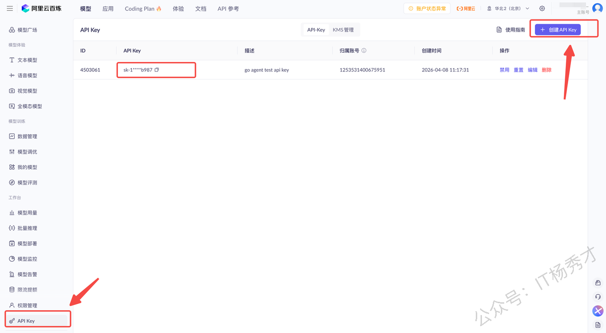
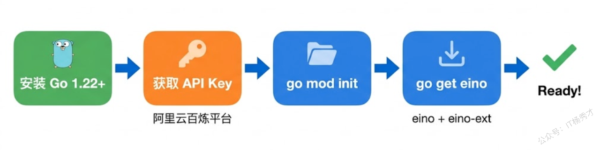
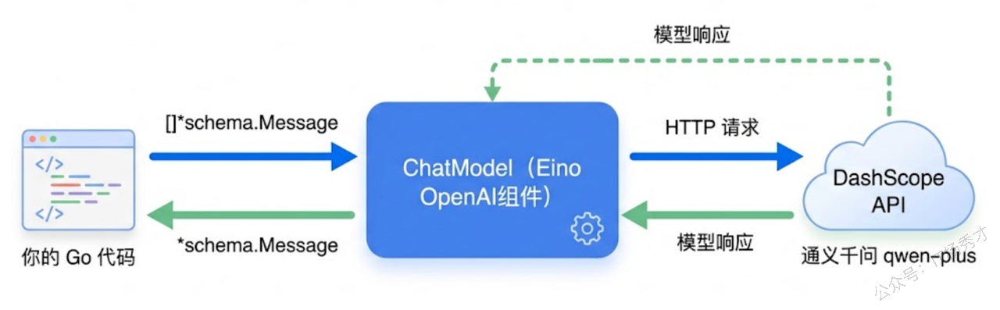
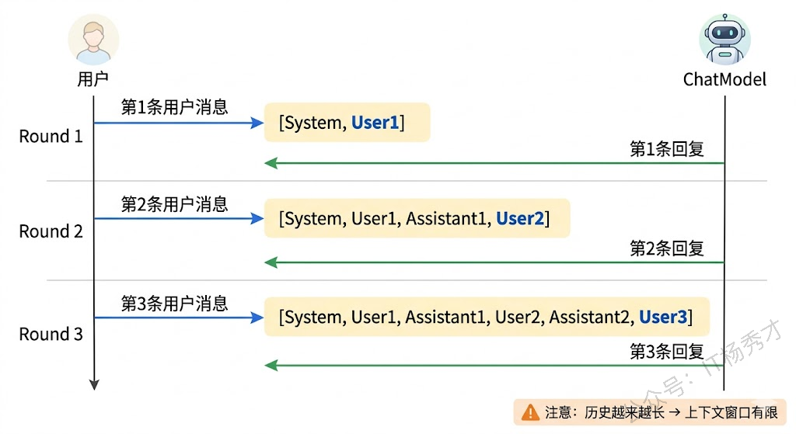

这篇文章我们就快速上手Eino框架，从搭建 Eino 开发环境开始，然后用通义千问的 DashScope API 作为底层大模型，写出第一个 Eino 程序，并且分别体验同步调用、流式输出和多轮对话三种模式。文章里的每一段代码都是完整可运行的，跟着做就能跑通。

## **1. 环境准备**

### **1.1 Go 环境**

Eino 要求 Go 1.22 及以上版本（因为框架内部用到了一些较新的泛型特性和 `iter` 包）。如果你还没装 Go，去 [Go 官网](https://go.dev/dl/) 下载安装即可。装好后确认一下版本：

```bash
go version
# 输出类似：go version go1.23.0 darwin/arm64
```

### **1.2 获取通义千问 API Key**

我们这个系列教程统一使用阿里云通义千问（DashScope）作为底层大模型，它提供了和 OpenAI 兼容的 API 接口，Eino 的 OpenAI 组件可以直接对接。

申请步骤很简单：

1. 打开 [阿里云百炼平台](https://bailian.console.aliyun.com/)，用你的阿里云账号登录（没有的话注册一个）


* 进入控制台后，在左侧导航找到"API Key 管理"，点击"创建 API Key"



3. 复制生成的 Key，设置到环境变量里

```bash
# macOS / Linux
export DASHSCOPE_API_KEY="sk-your-api-key-here"

# Windows PowerShell
$env:DASHSCOPE_API_KEY="sk-your-api-key-here"
```

通义千问对新用户有免费额度，用来跟着教程学习完全够用，不用担心费用问题。

### **1.3 初始化项目**

创建一个新的 Go 项目：

```bash
mkdir eino-quickstart && cd eino-quickstart
go mod init eino-quickstart
```

安装 Eino 核心库和 OpenAI 兼容的模型组件：

```bash
go get github.com/cloudwego/eino@latest
go get github.com/cloudwego/eino-ext/components/model/openai@latest
```

第一个包是 Eino 的核心框架，第二个包是 OpenAI 兼容接口的 ChatModel 实现。通义千问的 DashScope API 兼容 OpenAI 的接口协议，所以我们直接用这个组件就行，不需要额外的 SDK。



## **2. 第一个 ChatModel&#x20;**

环境准备好了，现在来写第一个 Eino 程序，在eino-quickstart目录下创建一个main.go，完成以下程序。我们先从最简单的场景开始——发送一条消息给大模型，拿到它的回复。

```go
package main

import (
        "context"
        "fmt"
        "log"
        "os"

        "github.com/cloudwego/eino-ext/components/model/openai"
        "github.com/cloudwego/eino/schema"
)

func main() {
        ctx := context.Background()

        // 创建 ChatModel 实例，接入通义千问 DashScope API
        chatModel, err := openai.NewChatModel(ctx, &openai.ChatModelConfig{
                BaseURL: "https://dashscope.aliyuncs.com/compatible-mode/v1",
                APIKey:  os.Getenv("DASHSCOPE_API_KEY"),
                Model:   "qwen-plus",
        })
        if err != nil {
                log.Fatalf("创建 ChatModel 失败: %v", err)
        }

        // 构建消息列表
        messages := []*schema.Message{
                schema.SystemMessage("你是一个专业的Go语言技术顾问，回答简洁准确。"),
                schema.UserMessage("用一句话解释什么是 goroutine"),
        }

        // 调用 Generate 方法，同步获取完整回复
        response, err := chatModel.Generate(ctx, messages)
        if err != nil {
                log.Fatalf("调用模型失败: %v", err)
        }

        fmt.Println("模型回复：")
        fmt.Println(response.Content)
}
```

运行结果：

```plain&#x20;text
模型回复：
Goroutine 是 Go 语言中由运行时（runtime）管理的轻量级线程，通过 `go` 关键字启动，具有极小的初始栈空间（约 2KB），可高效并发执行函数。
```

这段代码做了三件事。第一步是创建 ChatModel 实例，通过 `openai.NewChatModel` 函数，传入 `ChatModelConfig` 配置，其中 `BaseURL` 指向通义千问的 DashScope API 地址，`APIKey` 从环境变量读取，`Model` 指定用 `qwen-plus` 模型。因为 DashScope 的接口协议兼容 OpenAI，所以 Eino 的 OpenAI 组件可以无缝对接，不需要任何额外适配。

第二步是构建消息列表。Eino 的消息类型定义在 `schema` 包里，`schema.SystemMessage` 创建系统提示词消息，`schema.UserMessage` 创建用户消息。这和 OpenAI 的 Chat Completion API 是同样的消息结构——System 消息定义 AI 的角色和行为规范，User 消息是用户的具体问题。

第三步是调用 `chatModel.Generate` 方法。这是一个同步调用，程序会阻塞等待模型生成完整回复后才返回。返回值 `response` 是一个 `*schema.Message`，里面的 `Content` 字段就是模型的文本回复。



## **3. 流式输出**

上面的 `Generate` 方法要等模型把所有内容生成完才返回，如果模型回复比较长（比如写一篇文章或者一大段代码），用户就得干等着，体验不好。流式输出就是为了解决这个问题——模型一边生成一边往回传，你这边一边接收一边展示，就像 ChatGPT 那样一个字一个字地蹦出来。

Eino 的 ChatModel 都必须实现 `Stream` 方法，用法也很直观：

```go
package main

import (
        "context"
        "errors"
        "fmt"
        "io"
        "log"
        "os"

        "github.com/cloudwego/eino-ext/components/model/openai"
        "github.com/cloudwego/eino/schema"
)

func main() {
        ctx := context.Background()

        chatModel, err := openai.NewChatModel(ctx, &openai.ChatModelConfig{
                BaseURL: "https://dashscope.aliyuncs.com/compatible-mode/v1",
                APIKey:  os.Getenv("DASHSCOPE_API_KEY"),
                Model:   "qwen-plus",
        })
        if err != nil {
                log.Fatalf("创建 ChatModel 失败: %v", err)
        }

        messages := []*schema.Message{
                schema.SystemMessage("你是一个Go语言专家，擅长深入浅出地讲解技术概念。"),
                schema.UserMessage("请用200字左右解释 Go 语言的 channel 是什么，以及它在并发编程中的作用。"),
        }

        // 调用 Stream 方法，获取流式读取器
        stream, err := chatModel.Stream(ctx, messages)
        if err != nil {
                log.Fatalf("调用流式接口失败: %v", err)
        }
        defer stream.Close()

        fmt.Println("模型回复（流式）：")

        // 循环读取流式数据块
        for {
                chunk, err := stream.Recv()
                if errors.Is(err, io.EOF) {
                        // 流结束
                        break
                }
                if err != nil {
                        log.Fatalf("读取流数据失败: %v", err)
                }
                // 每收到一块就立即输出，不换行
                fmt.Print(chunk.Content)
        }

        fmt.Println() // 最后换行
}
```

运行结果（逐字输出效果）：

```plain&#x20;text
模型回复（流式）：
Go 语言的 `channel` 是一种类型安全的通信管道，用于在 goroutine 之间安全地传递数据（如 `chan int`）。它基于 CSP（Communicating Sequential Processes）模型，强调“通过通信共享内存”，而非“通过共享内存通信”。Channel 支持发送（`ch <- v`）、接收（`v := <-ch`）和关闭（`close(ch)`），默认为同步（阻塞式）：发送和接收必须配对才能继续执行，天然实现 goroutine 间的同步与协调。配合 `select` 语句可实现多路复用，支持超时、非阻塞操作等。Channel 是 Go 并发编程的核心原语，使开发者能以简洁、直观的方式构建高可靠、低竞争的并发程序，避免传统锁机制的复杂性与风险。（约200字）
```

`Stream` 方法返回的是一个 `*schema.StreamReader[*schema.Message]`。这个 StreamReader 是 Eino 框架里的核心流式数据类型，你通过反复调用它的 `Recv()` 方法来逐块读取数据。每次 `Recv()` 返回一个 `*schema.Message`，里面的 `Content` 是模型新生成的一小段文本。当模型生成结束时，`Recv()` 会返回 `io.EOF` 错误，这就是流结束的信号。

有个细节需要注意：**用完 StreamReader 一定要调用 `Close()`**。这里我们用 `defer stream.Close()` 来确保无论正常结束还是中途出错都能释放资源。如果忘了 Close，可能会导致底层的 HTTP 连接不被回收。

## **4. 模型参数配置**

前面的例子里我们只配了 `BaseURL`、`APIKey` 和 `Model` 三个必填项。实际开发中你可能还需要调整一些模型参数来控制输出的行为。`ChatModelConfig` 里有几个常用的配置字段：

```go
chatModel, err := openai.NewChatModel(ctx, &openai.ChatModelConfig{
    BaseURL:     "https://dashscope.aliyuncs.com/compatible-mode/v1",
    APIKey:      os.Getenv("DASHSCOPE_API_KEY"),
    Model:       "qwen-plus",
    Temperature: gptr.Of(float32(0.7)), // 控制输出的随机性，0~2，越高越随机
    MaxTokens:   gptr.Of(2048),         // 最大生成 Token 数
    TopP:        gptr.Of(float32(0.9)), // 核采样参数，与 Temperature 二选一调节即可
})
```

这里用到了一个 `gptr.Of` 辅助函数来创建指针值，因为这几个参数在 Eino 里都是指针类型（用指针是为了区分"没设置"和"设置为零值"）。你可以自己写一个简单的泛型函数来代替：

```go
func ptr[T any](v T) *T {
    return &v
}
```

也可以直接用 Eino 示例里的 `gptr` 包。不过最简单的做法是自己写个 `ptr` 函数放在项目里，就两行代码的事，不值得为此引入额外依赖。

关于 `Temperature` 参数再补充一点：前面在大模型基础篇里我们讲过，Temperature 控制输出的随机性，值越低回复越确定、越"保守"，值越高回复越多样、越"有创意"。在 Agent 场景中，通常建议把 Temperature 设低一些（比如 0.3\~0.7），因为你需要模型稳定地按照预期格式输出，太随机的话可能会生成不符合工具调用格式的内容。

除了在创建 ChatModel 时通过 Config 设置参数，Eino 还支持在每次调用时动态覆盖参数：

```go
import "github.com/cloudwego/eino/components/model"

// 这次调用临时用 Temperature 0.3，不影响 ChatModel 的默认配置
response, err := chatModel.Generate(ctx, messages, model.WithTemperature(0.3))
```

`model.WithTemperature`、`model.WithMaxTokens`、`model.WithModel` 这些都是 Eino 提供的调用选项，可以在每次 Generate 或 Stream 调用时按需传入，非常灵活。

## **5. 多轮对话**

到目前为止我们的例子都是单轮问答——发一条消息、拿一个回复，没有上下文。但真实的对话场景中，你需要模型记住之前聊了什么。实现多轮对话的原理很简单：**把历史消息都放到消息列表里一起发给模型**。

```go
package main

import (
        "bufio"
        "context"
        "errors"
        "fmt"
        "io"
        "log"
        "os"
        "strings"

        "github.com/cloudwego/eino-ext/components/model/openai"
        "github.com/cloudwego/eino/schema"
)

func main() {
        ctx := context.Background()

        chatModel, err := openai.NewChatModel(ctx, &openai.ChatModelConfig{
                BaseURL: "https://dashscope.aliyuncs.com/compatible-mode/v1",
                APIKey:  os.Getenv("DASHSCOPE_API_KEY"),
                Model:   "qwen-plus",
        })
        if err != nil {
                log.Fatalf("创建 ChatModel 失败: %v", err)
        }

        // 消息历史列表，先放入系统消息
        history := []*schema.Message{
                schema.SystemMessage("你是一个友好的Go语言助手，回答简洁，每次不超过100字。"),
        }

        scanner := bufio.NewScanner(os.Stdin)
        fmt.Println("开始对话（输入 quit 退出）：")

        for {
                fmt.Print("\n你: ")
                if !scanner.Scan() {
                        break
                }
                input := strings.TrimSpace(scanner.Text())
                if input == "quit" {
                        fmt.Println("再见！")
                        break
                }
                if input == "" {
                        continue
                }

                // 将用户消息追加到历史
                history = append(history, schema.UserMessage(input))

                // 用完整的历史消息列表调用模型
                stream, err := chatModel.Stream(ctx, history)
                if err != nil {
                        log.Printf("调用失败: %v", err)
                        continue
                }

                fmt.Print("助手: ")
                var reply strings.Builder

                for {
                        chunk, err := stream.Recv()
                        if errors.Is(err, io.EOF) {
                                break
                        }
                        if err != nil {
                                log.Printf("读取失败: %v", err)
                                break
                        }
                        fmt.Print(chunk.Content)
                        reply.WriteString(chunk.Content)
                }
                stream.Close()
                fmt.Println()

                // 将模型回复追加到历史，下一轮对话就能带上这次的上下文
                history = append(history, &schema.Message{
                        Role:    schema.Assistant,
                        Content: reply.String(),
                })
        }
}
```

运行效果：

```plain&#x20;text
开始对话（输入 quit 退出）：

你: Go的map是并发安全的吗
助手: 不是。Go 的 `map` 本身**不支持并发读写**，多 goroutine 同时读写会 panic（fatal error: concurrent map read and map write）。

如需并发安全，可用：
- `sync.Map`（适合读多写少场景）
- `sync.RWMutex` + 普通 map（更灵活，通用性强）

注意：`sync.Map` 不是万能替代，性能和语义与普通 map 有差异。

你: 那 sync.Map 适合什么场景
助手: `sync.Map` 适合**读多写少、键生命周期较长、且不需遍历或 len() 的并发场景**（如缓存、配置映射）。

优点：无锁读、高并发读性能好。  
缺点：不支持遍历、len() 不精确、内存占用高、写入开销大。

普通 map + `RWMutex` 更通用，适合需要遍历、精确长度或写较频繁的场景。

你: quit
再见！
```

这段代码的核心思路就是维护一个 `history` 切片，每次对话都把用户消息和模型回复都追加进去，下次调用模型时把整个 history 传进去。模型看到完整的对话历史，自然就能理解上下文了。

这里有个要注意的地方：history 会越来越长，而大模型的上下文窗口是有限的。qwen-plus 支持 128K 的上下文长度，日常对话足够用了，但如果是长时间运行的对话场景（比如客服系统），你需要考虑对历史消息做裁剪或摘要，这个我们在后面的篇章会深入讨论。



## **6. 完整项目结构**

到这里我们已经写了好几个示例了，实际项目中你可能想把它们组织得更清晰一些。下面给一个建议的项目结构供参考：

```shell
eino-quickstart/
├── main.go          // 主程序入口，选择运行哪个示例
├── go.mod
├── go.sum
└── examples/
    ├── basic.go     // 基础同步调用
    ├── stream.go    // 流式输出
    └── chat.go      // 多轮对话
```

运行基础示例

```json
go run main.go
```

不过在这个入门阶段，建议把每个示例都放在单独的目录里作为独立的 `main` 包来运行，避免多个 `main` 函数冲突的问题：

```shell
├── examples
│   ├── basic
│   │   └── basic.go   // 基础同步调用示例
│   ├── chat
│   │   └── chat.go    // 流式输出
│   └── stream
│       └── stream.go  // 流式输出
├── go.mod
├── go.sum
└── main.go
```

然后进入到对应目录去运行对应的示例

```bash
cd examples/basic && go run .
```

## **7. 常见问题排查**

在实际操作过程中，有几个常见的坑值得提前说一下。

第一个是**API Key 未设置**。如果你看到类似 `401 Unauthorized` 的错误，八成是环境变量没设对。用 `echo $DASHSCOPE_API_KEY` 检查一下环境变量是否生效。需要注意的是 `export` 命令只在当前终端会话有效，如果你开了新终端窗口需要重新 export，或者把它写到 `.bashrc` / `.zshrc` 里。

第二个是**模型名称错误**。通义千问的模型名称是 `qwen-plus`、`qwen-turbo`、`qwen-max` 这种格式，如果写成了 `qwen_plus`（下划线）或者其他格式就会报错。具体支持哪些模型可以查看 [通义千问模型列表](https://help.aliyun.com/zh/model-studio/getting-started/models)。

第三个是 **Go 版本太低**。如果 `go get` 的时候报泛型相关的编译错误，大概率是 Go 版本低于 1.22。用 `go version` 确认一下，不够的话升级就好。

第四个是**网络问题**。如果你在公司内网，可能需要配置代理才能访问 DashScope API。Go 程序默认会使用 `HTTP_PROXY` / `HTTPS_PROXY` 环境变量，设置好就行。

## **8. 小结**

从零搭环境到跑通三种调用模式，整个过程其实并不复杂——Eino 的 ChatModel 组件把底层的 HTTP 通信、消息序列化、流式数据解析这些脏活累活全包了，留给你的就是"构建消息 → 调用方法 → 处理结果"这三步。而通义千问的 OpenAI 兼容接口让我们不需要引入额外的 SDK，一个 `eino-ext/components/model/openai` 组件就搞定了模型接入。这套组合后面还会反复出现在更复杂的场景里——工具调用、Agent 编排、RAG 检索——它们的底层都离不开 ChatModel 这个最基础的积/木。

<div style="background-color: #f0f9eb; padding: 10px 15px; border-radius: 4px; border-left: 5px solid #67c23a; margin: 20px 0; color:rgb(64, 147, 255);">

<span style="color: #006400; font-size: 28px;"><strong>关注秀才公众号：</strong></span><span style="color: red; font-size: 28px;"><strong>IT杨秀才</strong></span><span style="color: #006400; font-size: 28px;"><strong>，回复：</strong></span><span style="color: red; font-size: 28px;"><strong>面试</strong></span>

<div style="text-align: center;"><span style="color: #006400; font-size: 28px;"><strong>领取后端/AI面试题库PDF</strong></span></div>


</div> 

