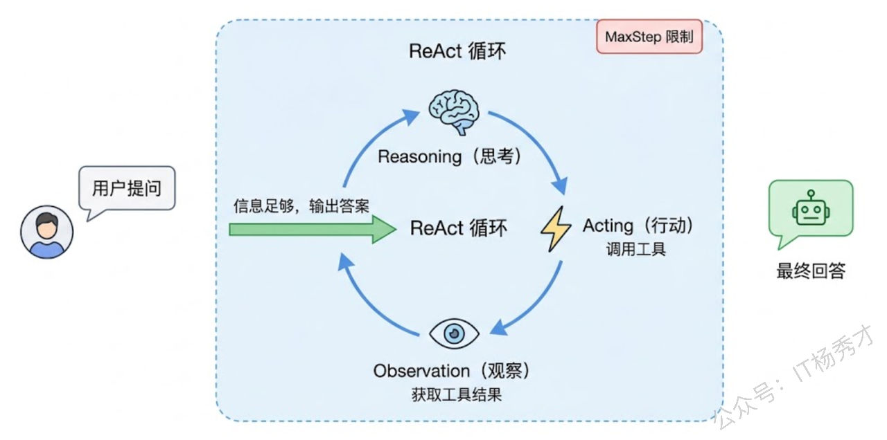
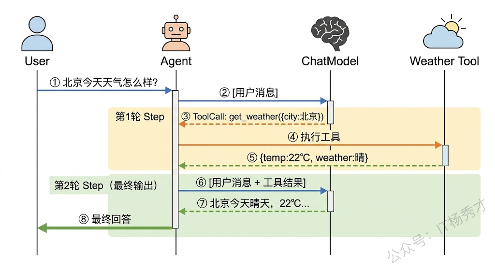
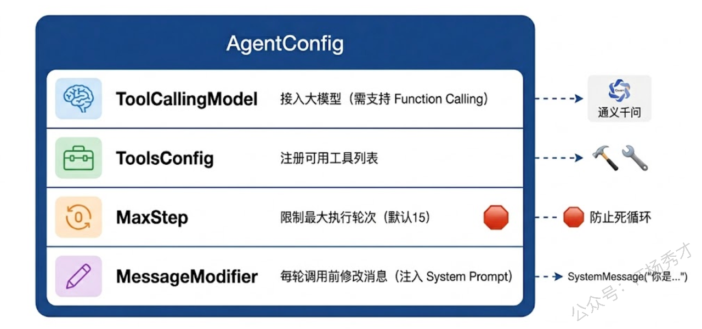
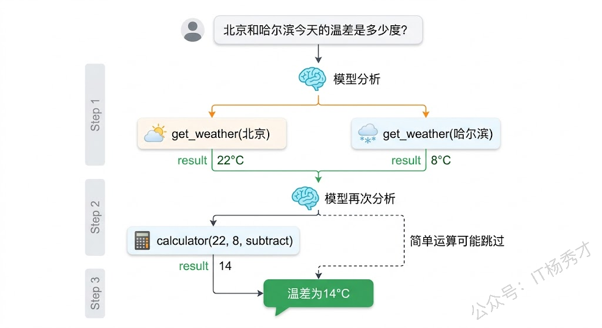
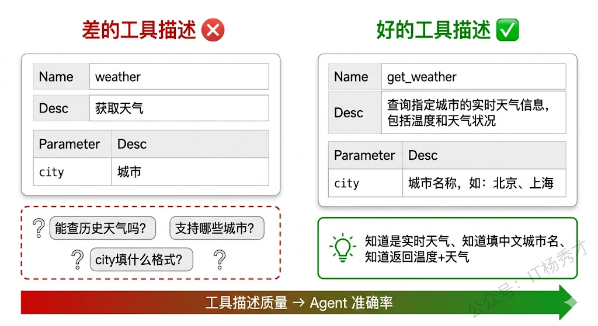

前面几篇文章，我们从 ChatModel 到 Prompt 模板再到工具定义，我们了解了Eino 的核心组件。但到目前为止，这些组件还是各管各的——模型只会聊天，工具只能手动调用，两者之间并没有真正串起来。这篇文章要做的，就是把它们全部组装在一起，构建一个真正的 ReAct Agent。

所谓 ReAct，是 Reasoning + Acting 的缩写。它不是什么复杂的理论，核心思想就一句话：**让模型先想清楚再动手，动完手再看看结果，然后接着想、接着干，直到任务完成。** 这跟我们人类做事的方式一模一样——遇到问题先分析，想到思路就行动，看到结果再调整。Eino 的 `react.NewAgent` 把这个循环封装得很干净，你只需要告诉它"用哪个模型、有哪些工具"，剩下的推理-调用-反馈循环它帮你搞定。

## **1. ReAct 模式回顾**

在 Agent 认知篇里我们从理论层面聊过 ReAct，这里快速回顾一下它在代码层面的运作流程，帮你建立直觉。

一个 ReAct Agent 的执行过程是这样的：用户提了一个问题，Agent 把问题交给大模型；模型分析之后，如果觉得自己能直接回答，就输出最终答案，流程结束。但如果模型判断需要借助外部信息，比如查天气、算数学、搜数据库，它就不会直接给答案，而是生成一个工具调用请求——"我要调 get\_weather 这个工具，参数是 city=北京"。Agent 框架收到这个请求后，去执行对应的工具函数，拿到结果，再把结果塞回给模型。模型看了工具返回的数据，可能就能给出最终答案了；也可能觉得还不够，于是再调另一个工具。如此循环，直到模型认为信息足够，输出最终回答。

这个"思考 → 行动 → 观察 → 再思考"的循环，就是 ReAct 的精髓。Eino 的实现里，每一轮循环叫一个 Step，你可以通过 `MaxStep` 来限制最多循环多少次，防止 Agent 陷入死循环。



## **2. 创建第一个 ReAct Agent**

理论讲完，直接上手。我们来创建一个能查天气的 ReAct Agent——用户问天气，Agent 自动调用天气工具获取信息，然后组织语言回答用户。

```go
package main

import (
    "context"
    "fmt"
    "log"
    "os"

    "github.com/cloudwego/eino-ext/components/model/openai"
    "github.com/cloudwego/eino/components/tool"
    "github.com/cloudwego/eino/components/tool/utils"
    "github.com/cloudwego/eino/compose"
    "github.com/cloudwego/eino/flow/agent/react"
    "github.com/cloudwego/eino/schema"
)

// 天气查询的入参
type WeatherRequest struct {
    City string `json:"city"`
}

// 天气查询的返回
type WeatherResponse struct {
    City    string `json:"city"`
    Temp    string `json:"temp"`
    Weather string `json:"weather"`
}

func getWeather(ctx context.Context, req *WeatherRequest) (*WeatherResponse, error) {
    // 模拟天气数据，实际项目中替换为真实 API 调用
    mockData := map[string]WeatherResponse{
       "北京": {City: "北京", Temp: "22°C", Weather: "晴"},
       "上海": {City: "上海", Temp: "26°C", Weather: "多云"},
       "深圳": {City: "深圳", Temp: "30°C", Weather: "阵雨"},
    }
    if data, ok := mockData[req.City]; ok {
       return &data, nil
    }
    return &WeatherResponse{City: req.City, Temp: "未知", Weather: "未知"}, nil
}

func main() {
    ctx := context.Background()

    // 1. 创建 ChatModel（接入通义千问）
    chatModel, err := openai.NewChatModel(ctx, &openai.ChatModelConfig{
       BaseURL: "https://dashscope.aliyuncs.com/compatible-mode/v1",
       APIKey:  os.Getenv("DASHSCOPE_API_KEY"),
       Model:   "qwen-plus",
    })
    if err != nil {
       log.Fatalf("创建 ChatModel 失败: %v", err)
    }

    // 2. 创建天气查询工具
    weatherTool := utils.NewTool(
       &schema.ToolInfo{
          Name: "get_weather",
          Desc: "查询指定城市的实时天气信息，包括温度和天气状况",
          ParamsOneOf: schema.NewParamsOneOfByParams(map[string]*schema.ParameterInfo{
             "city": {
                Type:     schema.String,
                Desc:     "要查询天气的城市名称，如：北京、上海、深圳",
                Required: true,
             },
          }),
       },
       getWeather,
    )

    // 3. 创建 ReAct Agent
    agent, err := react.NewAgent(ctx, &react.AgentConfig{
       ToolCallingModel: chatModel,
       ToolsConfig: compose.ToolsNodeConfig{
          Tools: []tool.BaseTool{weatherTool},
       },
    })
    if err != nil {
       log.Fatalf("创建 Agent 失败: %v", err)
    }

    // 4. 向 Agent 提问
    answer, err := agent.Generate(ctx, []*schema.Message{
       schema.UserMessage("北京今天天气怎么样？"),
    })
    if err != nil {
       log.Fatalf("Agent 执行失败: %v", err)
    }

    fmt.Println("Agent 回答:", answer.Content)
}
```

运行结果：

```plain&#x20;text
Agent 回答: 北京今天天气晴朗，温度为22°C。
```

这段代码做了四件事：创建模型、创建工具、组装 Agent、发起提问。关键在第三步——`react.NewAgent` 把模型和工具组装成了一个完整的 Agent。你不需要手动写"先调模型→解析工具调用→执行工具→把结果塞回去→再调模型"这套逻辑，`Agent` 内部全帮你处理了。

调用 `agent.Generate` 时，Agent 内部实际发生了这些事：先把用户消息发给模型，模型分析后决定调用 `get_weather` 工具，Agent 执行工具拿到天气数据，再把工具结果返回给模型，模型最终组织了一段自然语言回答。整个过程对你来说就是一个函数调用。

注意 import 里需要引入 `"github.com/cloudwego/eino/components/tool"`，因为代码中用到了 `tool.InvokableTool` 类型。完整的 import 列表在上面的代码中没有列全，实际运行时 IDE 会帮你自动补全。



## **3. AgentConfig 配置详解**

`react.AgentConfig` 是 ReAct Agent 的配置核心，前面的示例只用了最基础的两个字段。实际开发中你可能需要更多控制，下面逐个拆解。

### **3.1 ToolCallingModel**

这个字段传入一个支持工具调用的 ChatModel。注意不是所有模型都支持 Function Calling——如果你传入一个不支持工具调用的模型，Agent 在运行时会报错。通义千问的 `qwen-plus` 和 `qwen-max` 都支持工具调用，`qwen-turbo` 也支持但效果相对差一些。

### **3.2 ToolsConfig**

工具配置，类型是 `compose.ToolsNodeConfig`。它有两个主要字段：`InvokableTools` 放同步工具，`StreamableTools` 放流式工具。绝大多数情况下你只会用到 `InvokableTools`。工具数量不是越多越好，一般控制在 10 个以内效果最好——工具太多会让模型在选择时犯迷糊，反而降低准确率。

### **3.3 MaxStep**

最大执行步数，默认值是 15。每一个 Step 包含一次模型调用和可能的一次工具执行。设置这个值是为了防止 Agent 陷入无限循环——比如模型反复调用同一个工具却得不到想要的结果，或者在多个工具之间来回跳。实际项目中，大多数任务在 3-5 个 Step 内就能完成，设置 10-15 是比较安全的上限。

### **3.4 MessageModifier**

消息修改器，它是一个函数，在每次调用模型之前对消息列表进行处理。最常见的用途是注入 System Prompt：

```go
agent, err := react.NewAgent(ctx, &react.AgentConfig{
        ToolCallingModel: chatModel,
        ToolsConfig: compose.ToolsNodeConfig{
                InvokableTools: []tool.InvokableTool{weatherTool},
        },
        MaxStep: 10,
        MessageModifier: func(ctx context.Context, input []*schema.Message) []*schema.Message {
                // 在消息列表最前面加上系统提示
                messages := make([]*schema.Message, 0, len(input)+1)
                messages = append(messages, schema.SystemMessage(
                        "你是一个专业的天气助手，回答要简洁友好。如果用户问的城市没有天气数据，建议用户换个城市试试。",
                ))
                messages = append(messages, input...)
                return messages
        },
})
```

`MessageModifier` 的参数是当前的完整消息列表（包括用户消息、历史的工具调用记录等），你可以在里面做任何修改——加系统提示、过滤历史消息、注入额外上下文。返回的消息列表会被发送给模型。

为什么不直接在 `agent.Generate` 的入参里加 System Prompt？因为 ReAct Agent 内部会多轮调用模型，每一轮都需要这个 System Prompt，如果你只在最开始加了一次，第二轮循环时它就丢了。`MessageModifier` 保证每一轮模型调用前都会执行，系统提示不会丢失。

下面这个示例把上面的配置组合起来，构建一个有性格的天气助手：

```go
package main

import (
    "context"
    "fmt"
    "log"
    "os"

    "github.com/cloudwego/eino-ext/components/model/openai"
    "github.com/cloudwego/eino/components/tool"
    "github.com/cloudwego/eino/components/tool/utils"
    "github.com/cloudwego/eino/compose"
    "github.com/cloudwego/eino/flow/agent/react"
    "github.com/cloudwego/eino/schema"
)

type WeatherRequest struct {
    City string `json:"city"`
}

type WeatherResponse struct {
    City    string `json:"city"`
    Temp    string `json:"temp"`
    Weather string `json:"weather"`
    Wind    string `json:"wind"`
}

func getWeather(ctx context.Context, req *WeatherRequest) (*WeatherResponse, error) {
    mockData := map[string]WeatherResponse{
       "北京": {City: "北京", Temp: "22°C", Weather: "晴", Wind: "北风3级"},
       "上海": {City: "上海", Temp: "26°C", Weather: "多云", Wind: "东南风2级"},
       "深圳": {City: "深圳", Temp: "30°C", Weather: "阵雨", Wind: "南风4级"},
       "杭州": {City: "杭州", Temp: "24°C", Weather: "晴转多云", Wind: "西风1级"},
    }
    if data, ok := mockData[req.City]; ok {
       return &data, nil
    }
    return &WeatherResponse{City: req.City, Temp: "暂无数据", Weather: "暂无数据", Wind: "暂无数据"}, nil
}

func main() {
    ctx := context.Background()

    chatModel, err := openai.NewChatModel(ctx, &openai.ChatModelConfig{
       BaseURL: "https://dashscope.aliyuncs.com/compatible-mode/v1",
       APIKey:  os.Getenv("DASHSCOPE_API_KEY"),
       Model:   "qwen-plus",
    })
    if err != nil {
       log.Fatalf("创建 ChatModel 失败: %v", err)
    }

    weatherTool := utils.NewTool(
       &schema.ToolInfo{
          Name: "get_weather",
          Desc: "查询指定城市的实时天气信息，包括温度、天气状况和风力",
          ParamsOneOf: schema.NewParamsOneOfByParams(map[string]*schema.ParameterInfo{
             "city": {
                Type:     schema.String,
                Desc:     "要查询天气的城市名称，如：北京、上海、深圳、杭州",
                Required: true,
             },
          }),
       },
       getWeather,
    )

    agent, err := react.NewAgent(ctx, &react.AgentConfig{
       ToolCallingModel: chatModel,
       ToolsConfig: compose.ToolsNodeConfig{
          Tools: []tool.BaseTool{weatherTool},
       },
       MaxStep: 10,
       MessageModifier: func(ctx context.Context, input []*schema.Message) []*schema.Message {
          messages := make([]*schema.Message, 0, len(input)+1)
          messages = append(messages, schema.SystemMessage(
             "你是一个热情的天气助手，回答简洁但有温度。天气好就鼓励用户出去玩，天气不好就贴心提醒带伞或注意防晒。",
          ))
          messages = append(messages, input...)
          return messages
       },
    })
    if err != nil {
       log.Fatalf("创建 Agent 失败: %v", err)
    }

    answer, err := agent.Generate(ctx, []*schema.Message{
       schema.UserMessage("深圳今天天气怎么样？需要带伞吗？"),
    })
    if err != nil {
       log.Fatalf("Agent 执行失败: %v", err)
    }

    fmt.Println("Agent 回答:", answer.Content)
}
```

运行结果：

```plain&#x20;text
Agent 回答: 深圳今天30°C，有阵雨，南风4级～🌧️  
建议带伞出门，以防突然下雨，同时注意防晒和防风哦！需要我帮你看看其他城市吗？😊
```

和之前的示例对比，这个 Agent 多了 `MaxStep` 限制和 `MessageModifier` 注入的系统人设。模型的回答风格明显受到了 System Prompt 的影响——不再是干巴巴的天气数据播报，而是带上了关心用户的语气。



## **4. 流式输出**

`agent.Generate` 是等 Agent 完全执行完毕后一次性返回结果。如果 Agent 需要多轮工具调用，用户可能要等很久才看到回答。`agent.Stream` 提供了流式输出能力——模型边生成边返回，用户可以实时看到回答内容逐字出现。

```go
package main

import (
    "context"
    "errors"
    "fmt"
    "io"
    "log"
    "os"

    "github.com/cloudwego/eino-ext/components/model/openai"
    "github.com/cloudwego/eino/components/tool"
    "github.com/cloudwego/eino/components/tool/utils"
    "github.com/cloudwego/eino/compose"
    "github.com/cloudwego/eino/flow/agent/react"
    "github.com/cloudwego/eino/schema"
)

type WeatherRequest struct {
    City string `json:"city"`
}

type WeatherResponse struct {
    City    string `json:"city"`
    Temp    string `json:"temp"`
    Weather string `json:"weather"`
}

func getWeather(ctx context.Context, req *WeatherRequest) (*WeatherResponse, error) {
    mockData := map[string]WeatherResponse{
       "北京": {City: "北京", Temp: "22°C", Weather: "晴"},
       "上海": {City: "上海", Temp: "26°C", Weather: "多云"},
    }
    if data, ok := mockData[req.City]; ok {
       return &data, nil
    }
    return &WeatherResponse{City: req.City, Temp: "未知", Weather: "未知"}, nil
}

func main() {
    ctx := context.Background()

    chatModel, err := openai.NewChatModel(ctx, &openai.ChatModelConfig{
       BaseURL: "https://dashscope.aliyuncs.com/compatible-mode/v1",
       APIKey:  os.Getenv("DASHSCOPE_API_KEY"),
       Model:   "qwen-plus",
    })
    if err != nil {
       log.Fatalf("创建 ChatModel 失败: %v", err)
    }

    weatherTool := utils.NewTool(
       &schema.ToolInfo{
          Name: "get_weather",
          Desc: "查询指定城市的实时天气信息",
          ParamsOneOf: schema.NewParamsOneOfByParams(map[string]*schema.ParameterInfo{
             "city": {
                Type:     schema.String,
                Desc:     "城市名称，如：北京、上海",
                Required: true,
             },
          }),
       },
       getWeather,
    )

    agent, err := react.NewAgent(ctx, &react.AgentConfig{
       ToolCallingModel: chatModel,
       ToolsConfig: compose.ToolsNodeConfig{
          Tools: []tool.BaseTool{weatherTool},
       },
    })
    if err != nil {
       log.Fatalf("创建 Agent 失败: %v", err)
    }

    // 使用 Stream 方法获取流式输出
    reader, err := agent.Stream(ctx, []*schema.Message{
       schema.UserMessage("上海今天天气如何？"),
    })
    if err != nil {
       log.Fatalf("Agent Stream 失败: %v", err)
    }

    fmt.Print("Agent 回答: ")
    for {
       msg, err := reader.Recv()
       if err != nil {
          if errors.Is(err, io.EOF) {
             break // 流结束
          }
          log.Fatalf("读取流失败: %v", err)
       }
       fmt.Print(msg.Content) // 逐块输出内容
    }
    fmt.Println()
}
```

运行结果（内容逐字打印出来）：

```plain&#x20;text
Agent 回答: 上海今天的天气是多云，气温为26°C。
```

`agent.Stream` 返回的是一个 `*schema.StreamReader[*schema.Message]`，你通过不断调用 `Recv()` 来接收消息片段。每个片段的 `Content` 可能只有几个字，拼接起来就是完整的回答。当 `Recv()` 返回 `io.EOF` 时表示流结束。

有一个细节值得注意：在流式模式下，Agent 内部的工具调用阶段不会产生流式输出——工具调用和执行是在后台同步完成的。你通过 `Recv()` 收到的流式内容，只有最终那轮模型生成回答时的逐字输出。换句话说，如果 Agent 先调了两次工具再回答，前两个 Step 的过程用户看不到，只有最终回答是流式的。

这在大多数场景下是合理的——用户关心的是最终答案，不需要看到中间的工具调用过程。如果你希望展示中间步骤（比如做一个调试界面），可以通过 Eino 的回调机制（Callback）来监听每个 Step 的开始和结束事件，这个在 Eino 进阶篇会详细讲。

## **5. 多工具协作**

一个只有一个工具的 Agent 能做的事很有限。真实场景中，Agent 往往需要多个工具配合才能完成任务。比如用户问"北京和上海哪个更热？"，Agent 需要分别查两个城市的天气，然后做对比。再比如用户问"帮我算一下北京气温和上海气温的差"，Agent 需要先查天气再算数学。

下面这个示例给 Agent 配备了三个工具：天气查询、数学计算、时间查询。

```go
package main

import (
    "context"
    "fmt"
    "log"
    "math"
    "os"
    "time"

    "github.com/cloudwego/eino-ext/components/model/openai"
    "github.com/cloudwego/eino/components/tool"
    "github.com/cloudwego/eino/components/tool/utils"
    "github.com/cloudwego/eino/compose"
    "github.com/cloudwego/eino/flow/agent/react"
    "github.com/cloudwego/eino/schema"
)

// ========== 天气查询工具 ==========

type WeatherRequest struct {
    City string `json:"city"`
}

type WeatherResponse struct {
    City    string  `json:"city"`
    Temp    float64 `json:"temp"`
    Weather string  `json:"weather"`
}

func getWeather(ctx context.Context, req *WeatherRequest) (*WeatherResponse, error) {
    mockData := map[string]WeatherResponse{
       "北京":  {City: "北京", Temp: 22, Weather: "晴"},
       "上海":  {City: "上海", Temp: 26, Weather: "多云"},
       "深圳":  {City: "深圳", Temp: 30, Weather: "阵雨"},
       "哈尔滨": {City: "哈尔滨", Temp: 8, Weather: "小雪"},
    }
    if data, ok := mockData[req.City]; ok {
       return &data, nil
    }
    return &WeatherResponse{City: req.City, Temp: 0, Weather: "暂无数据"}, nil
}

// ========== 数学计算工具 ==========

type CalcRequest struct {
    A  float64 `json:"a"`
    B  float64 `json:"b"`
    Op string  `json:"op"`
}

type CalcResponse struct {
    Expression string  `json:"expression"`
    Result     float64 `json:"result"`
}

func calculate(ctx context.Context, req *CalcRequest) (*CalcResponse, error) {
    var result float64
    switch req.Op {
    case "add":
       result = req.A + req.B
    case "subtract":
       result = req.A - req.B
    case "multiply":
       result = req.A * req.B
    case "divide":
       if req.B == 0 {
          return nil, fmt.Errorf("除数不能为零")
       }
       result = req.A / req.B
    default:
       return nil, fmt.Errorf("不支持的运算: %s", req.Op)
    }
    return &CalcResponse{
       Expression: fmt.Sprintf("%.1f %s %.1f", req.A, req.Op, req.B),
       Result:     math.Round(result*100) / 100,
    }, nil
}

// ========== 时间查询工具 ==========

type TimeRequest struct {
    Timezone string `json:"timezone"`
}

type TimeResponse struct {
    Timezone    string `json:"timezone"`
    CurrentTime string `json:"current_time"`
    Date        string `json:"date"`
}

func getCurrentTime(ctx context.Context, req *TimeRequest) (*TimeResponse, error) {
    tz := req.Timezone
    if tz == "" {
       tz = "Asia/Shanghai"
    }
    loc, err := time.LoadLocation(tz)
    if err != nil {
       loc = time.FixedZone("CST", 8*3600)
    }
    now := time.Now().In(loc)
    return &TimeResponse{
       Timezone:    tz,
       CurrentTime: now.Format("15:04:05"),
       Date:        now.Format("2006-01-02"),
    }, nil
}

func main() {
    ctx := context.Background()

    chatModel, err := openai.NewChatModel(ctx, &openai.ChatModelConfig{
       BaseURL: "https://dashscope.aliyuncs.com/compatible-mode/v1",
       APIKey:  os.Getenv("DASHSCOPE_API_KEY"),
       Model:   "qwen-plus",
    })
    if err != nil {
       log.Fatalf("创建 ChatModel 失败: %v", err)
    }

    // 创建三个工具
    weatherTool := utils.NewTool(
       &schema.ToolInfo{
          Name: "get_weather",
          Desc: "查询指定城市的实时天气信息，返回温度（数值）和天气状况",
          ParamsOneOf: schema.NewParamsOneOfByParams(map[string]*schema.ParameterInfo{
             "city": {
                Type:     schema.String,
                Desc:     "城市名称，如：北京、上海、深圳、哈尔滨",
                Required: true,
             },
          }),
       },
       getWeather,
    )

    calcTool := utils.NewTool(
       &schema.ToolInfo{
          Name: "calculator",
          Desc: "对两个数字执行四则运算，返回计算结果",
          ParamsOneOf: schema.NewParamsOneOfByParams(map[string]*schema.ParameterInfo{
             "a":  {Type: schema.Number, Desc: "第一个数字", Required: true},
             "b":  {Type: schema.Number, Desc: "第二个数字", Required: true},
             "op": {Type: schema.String, Desc: "运算类型", Required: true, Enum: []string{"add", "subtract", "multiply", "divide"}},
          }),
       },
       calculate,
    )

    timeTool := utils.NewTool(
       &schema.ToolInfo{
          Name: "get_current_time",
          Desc: "获取当前时间和日期",
          ParamsOneOf: schema.NewParamsOneOfByParams(map[string]*schema.ParameterInfo{
             "timezone": {
                Type: schema.String,
                Desc: "时区，如 Asia/Shanghai、America/New_York，默认为中国时区",
             },
          }),
       },
       getCurrentTime,
    )

    // 组装 Agent，注册三个工具
    agent, err := react.NewAgent(ctx, &react.AgentConfig{
       ToolCallingModel: chatModel,
       ToolsConfig: compose.ToolsNodeConfig{
          Tools: []tool.BaseTool{weatherTool, calcTool, timeTool},
       },
       MaxStep: 10,
       MessageModifier: func(ctx context.Context, input []*schema.Message) []*schema.Message {
          messages := make([]*schema.Message, 0, len(input)+1)
          messages = append(messages, schema.SystemMessage(
             "你是一个多功能助手，可以查天气、做计算、查时间。回答要准确简洁。",
          ))
          messages = append(messages, input...)
          return messages
       },
    })
    if err != nil {
       log.Fatalf("创建 Agent 失败: %v", err)
    }

    // 测试1：需要多次工具调用的问题
    fmt.Println("===== 测试1：多城市天气对比 =====")
    answer1, err := agent.Generate(ctx, []*schema.Message{
       schema.UserMessage("北京和哈尔滨今天的温差是多少度？"),
    })
    if err != nil {
       log.Fatalf("执行失败: %v", err)
    }
    fmt.Println("回答:", answer1.Content)

    // 测试2：需要组合使用工具
    fmt.Println("\n===== 测试2：综合查询 =====")
    answer2, err := agent.Generate(ctx, []*schema.Message{
       schema.UserMessage("现在几点了？另外帮我查一下上海的天气。"),
    })
    if err != nil {
       log.Fatalf("执行失败: %v", err)
    }
    fmt.Println("回答:", answer2.Content)
}
```

运行结果：

```plain&#x20;text
===== 测试1：多城市天气对比 =====
回答: 北京今天的温度是22℃，哈尔滨今天的温度是8℃，温差为：  
22 - 8 = 14℃。

===== 测试2：综合查询 =====
回答: 现在是北京时间 11:36:17，日期是 2026年4月16日。  
上海当前天气：26℃，多云。
```

测试1 是一个很典型的多工具协作场景。Agent 需要先分别查北京和哈尔滨的天气拿到温度数值，然后可能再调计算器算温差（也可能模型自己算，22减8这种简单运算模型通常能直接算对）。整个过程中，Agent 自主决定调用哪些工具、按什么顺序调用、调用几次，你完全不需要干预。

测试2 展示了另一种模式：用户一句话里包含两个独立的需求，Agent 需要分别调用时间工具和天气工具，然后把两个结果合并成一个完整的回答。这种能力不需要你写任何特殊逻辑，模型在 ReAct 循环中自然就能处理。



## **6. 多轮对话**

前面的示例都是单轮交互——问一句答一句。实际应用中，Agent 往往需要维护对话上下文，让用户可以连续追问。实现方式很直接：把历史消息一起传给 `Generate` 或 `Stream` 就行。

```go
package main

import (
    "context"
    "fmt"
    "log"
    "os"

    "github.com/cloudwego/eino-ext/components/model/openai"
    "github.com/cloudwego/eino/components/tool"
    "github.com/cloudwego/eino/components/tool/utils"
    "github.com/cloudwego/eino/compose"
    "github.com/cloudwego/eino/flow/agent/react"
    "github.com/cloudwego/eino/schema"
)

type WeatherRequest struct {
    City string `json:"city"`
}

type WeatherResponse struct {
    City    string `json:"city"`
    Temp    string `json:"temp"`
    Weather string `json:"weather"`
}

func getWeather(ctx context.Context, req *WeatherRequest) (*WeatherResponse, error) {
    mockData := map[string]WeatherResponse{
       "北京": {City: "北京", Temp: "22°C", Weather: "晴"},
       "上海": {City: "上海", Temp: "26°C", Weather: "多云"},
    }
    if data, ok := mockData[req.City]; ok {
       return &data, nil
    }
    return &WeatherResponse{City: req.City, Temp: "未知", Weather: "未知"}, nil
}

func main() {
    ctx := context.Background()

    chatModel, err := openai.NewChatModel(ctx, &openai.ChatModelConfig{
       BaseURL: "https://dashscope.aliyuncs.com/compatible-mode/v1",
       APIKey:     os.Getenv("DASHSCOPE_API_KEY"),
       Model:   "qwen-plus",
    })
    if err != nil {
       log.Fatalf("创建 ChatModel 失败: %v", err)
    }

    weatherTool := utils.NewTool(
       &schema.ToolInfo{
          Name: "get_weather",
          Desc: "查询指定城市的实时天气信息",
          ParamsOneOf: schema.NewParamsOneOfByParams(map[string]*schema.ParameterInfo{
             "city": {Type: schema.String, Desc: "城市名称", Required: true},
          }),
       },
       getWeather,
    )

    agent, err := react.NewAgent(ctx, &react.AgentConfig{
       ToolCallingModel: chatModel,
       ToolsConfig: compose.ToolsNodeConfig{
          Tools: []tool.BaseTool{weatherTool},
       },
       MessageModifier: func(ctx context.Context, input []*schema.Message) []*schema.Message {
          messages := make([]*schema.Message, 0, len(input)+1)
          messages = append(messages, schema.SystemMessage("你是一个天气助手，回答简洁。"))
          messages = append(messages, input...)
          return messages
       },
    })
    if err != nil {
       log.Fatalf("创建 Agent 失败: %v", err)
    }

    // 维护对话历史
    history := make([]*schema.Message, 0)

    // 第一轮对话
    history = append(history, schema.UserMessage("北京天气怎么样？"))
    answer1, err := agent.Generate(ctx, history)
    if err != nil {
       log.Fatalf("执行失败: %v", err)
    }
    fmt.Println("第一轮回答:", answer1.Content)
    history = append(history, answer1) // 把 Agent 的回答也加入历史

    // 第二轮对话——追问，不需要重复说城市
    history = append(history, schema.UserMessage("那上海呢？"))
    answer2, err := agent.Generate(ctx, history)
    if err != nil {
       log.Fatalf("执行失败: %v", err)
    }
    fmt.Println("第二轮回答:", answer2.Content)
    history = append(history, answer2)

    // 第三轮对话——基于前两轮的对比问题
    history = append(history, schema.UserMessage("哪个城市更热？"))
    answer3, err := agent.Generate(ctx, history)
    if err != nil {
       log.Fatalf("执行失败: %v", err)
    }
    fmt.Println("第三轮回答:", answer3.Content)
}
```

运行结果：

```plain&#x20;text
第一轮回答: 北京当前天气晴，气温22°C。
第二轮回答: 上海当前天气多云，气温26°C。
第三轮回答: 上海更热，气温26°C，比北京的22°C高4°C。
```

关键在 `history` 这个切片——它充当了 Agent 的"短期记忆"。每一轮对话结束后，我们把用户消息和 Agent 回答都追加到 history 里，下一轮调用时把完整的历史传进去。这样 Agent 就能理解"那上海呢"里的"那"指的是天气，"哪个城市更热"指的是前面提到的北京和上海。

这种手动管理历史消息的方式虽然原始，但胜在灵活——你可以自由决定保留多少轮历史、是否需要压缩或摘要。随着对话越来越长，历史消息会占用更多 Token，这时候你可能需要做一些截断策略，只保留最近 N 轮对话，或者用 LLM 把早期对话压缩成摘要。这些高级的记忆管理策略在后续 Agent 记忆相关的文章里会详细展开。

## **7. 实战注意事项**

到这里你已经能用 Eino 构建一个功能完备的 ReAct Agent 了。在实际项目中落地之前，有几个容易踩坑的地方值得提前了解。



**工具描述决定了 Agent 的智商。** 这一点怎么强调都不过分。模型是根据工具的 `Name` 和 `Desc` 来决定何时调用哪个工具的。如果你的工具描述含糊不清，模型就可能在不该调用时调用、该调用时不调用，或者调用了错误的工具。好的工具描述应该准确说明工具的功能边界，最好带上使用场景的暗示。比如"查询指定城市的实时天气信息"就比"获取天气"要好得多——后者太模糊了，模型不知道它能处理"昨天的天气"还是"未来一周的天气预报"。

**参数的 Desc 和 Enum 同样重要。** 很多人只关注工具整体描述，忽略了参数级别的描述。一个典型的坑：你定义了一个 `language` 参数，只写了 Desc 是"语言"，模型可能填 "中文"、"Chinese"、"zh-CN"、"zh" 等各种格式。如果你加上 `Enum: []string{"zh", "en"}`，模型就只会从这两个值里选，大幅降低参数格式错误的概率。

**MaxStep 要根据业务合理设置。** 默认15步对大多数场景来说足够了，但如果你的工具可能产生"误导性结果"导致模型反复重试，15步可能不够也可能太多（浪费 Token）。一般来说，简单的工具调用场景设 5-8 就够了，复杂的多步骤任务可以设到 15-20。

**错误处理要优雅。** 当工具执行出错时（比如外部 API 超时），Eino 会把错误信息以 Tool Message 的形式返回给模型。模型看到错误后通常会尝试换一种方式调用，或者直接告诉用户"抱歉，xx 服务暂时不可用"。你在工具函数里返回的 error 信息要对"模型"友好——不要返回一堆堆栈信息，而是返回一段模型能理解的错误描述，比如 `fmt.Errorf("城市 %s 的天气数据查询失败，请稍后重试", city)`。

## **8. 小结**

ReAct Agent 看起来智能，拆开来其实就是一个循环——模型想一想要不要用工具，用了就把结果拿回来再想一想，如此往复直到能给出答案。Eino 的 `react.NewAgent` 替你打理了这个循环的所有细节，你要做的就是准备好模型和工具，然后把问题丢给它。真正决定一个 Agent 好不好用的，往往不在框架代码上，而在那些看似不起眼的地方——工具描述写得清不清楚、System Prompt 定位准不准确、MaxStep 限制合不合理。把这些基本功做扎实了，一个简单的 ReAct Agent 就已经能处理相当多的实际任务了。


