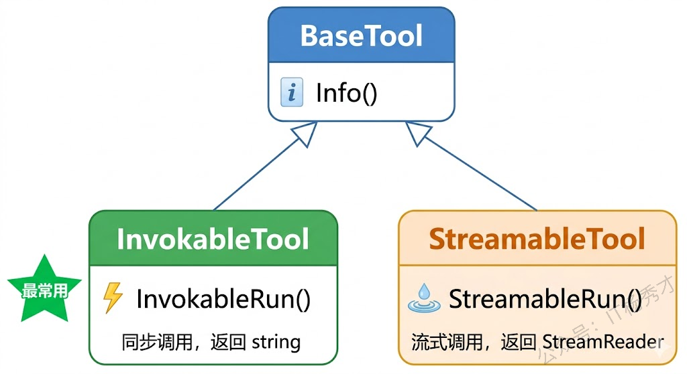
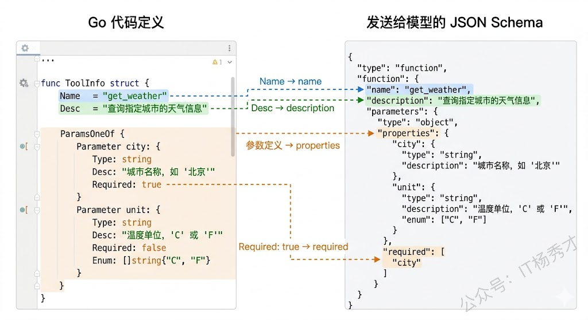
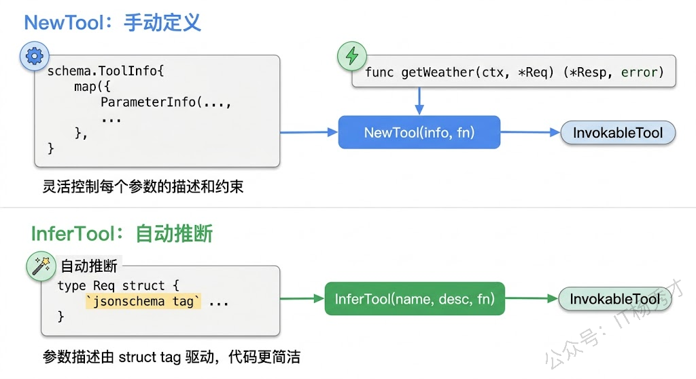
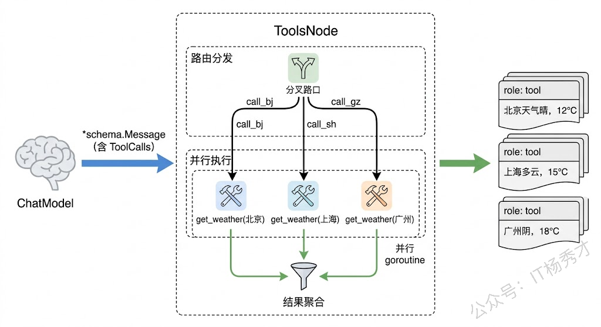
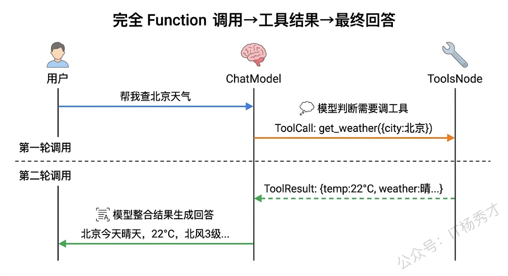

在 ChatModel 那篇文章里，我们提到过 `ToolCallingChatModel` 接口——它让模型具备了"调用工具"的能力。只是蜻蜓点水地带过了 `WithTools` 方法，并没有展开讲工具本身是怎么定义的、怎么被执行的。这篇文章就来把工具系统从头到尾拆解清楚。

所谓"工具"，说白了就是你写的一个 Go 函数，但它被包装成了一种大模型能理解的格式。你告诉模型"这里有一个叫 get\_weather 的函数，它接收城市名，返回天气信息"，模型在对话过程中如果觉得需要查天气，就会生成一个调用请求，然后由你的程序去实际执行这个函数、把结果返回给模型。这就是 Function Calling 的基本流程。Eino 的工具系统就是围绕这个流程设计的：工具怎么描述、怎么创建、怎么执行。

## **1. 工具接口体系**

Eino 的工具系统定义在 `github.com/cloudwego/eino/components/tool` 包里，由三个接口组成，层次很清晰。最底层是 `BaseTool`，只有一个方法：

```go
type BaseTool interface {
    Info(ctx context.Context, opts ...Option) (*schema.ToolInfo, error)
}
```

`Info` 方法返回工具的描述信息——工具叫什么名字、干什么用、接收什么参数。这些信息最终会被发送给大模型，模型根据这些描述来判断什么时候该调用哪个工具。

在 `BaseTool` 之上是 `InvokableTool`，它加了一个 `InvokableRun` 方法：

```go
type InvokableRun func(ctx context.Context, arguments string, opts ...Option) (string, error)

type InvokableTool interface {
    BaseTool
    InvokableRun(opts ...Option) InvokableRun
}
```

`InvokableRun` 返回的是一个函数，这个函数接收 JSON 格式的参数字符串，返回字符串结果。它就是工具的实际执行逻辑。为什么参数是 JSON 字符串而不是结构体？因为大模型生成的工具调用参数本身就是 JSON 格式的文本，Eino 在底层帮你做了 JSON 解析和类型转换（后面用 `NewTool` 创建工具时你就能感受到了），但接口层面保留了最通用的字符串形式。

还有一个 `StreamableTool` 接口，和 `InvokableTool` 类似，只是返回的是流式结果：

```go
type StreamableRun func(ctx context.Context, arguments string, opts ...Option) (*schema.StreamReader[string], error)

type StreamableTool interface {
    BaseTool
    StreamableRun(opts ...Option) StreamableRun
}
```

绝大多数场景下你用 `InvokableTool` 就够了——查天气、查数据库、调 API，这些操作都是一次性返回结果的。`StreamableTool` 适合那些需要逐步输出结果的场景，比如工具内部调用了另一个大模型做文本生成，需要把生成过程流式返回。



## **2. ToolInfo 工具描述**

工具接口定义了"工具长什么样"，而 `schema.ToolInfo` 则定义了"怎么告诉模型这个工具是什么"。它是整个工具系统的核心数据结构：

```go
type ToolInfo struct {
    Name        string
    Desc        string
    ParamsOneOf schema.ParamsOneOf
}
```

`Name` 是工具的唯一标识，模型在生成工具调用请求时会用这个名字来指定调用哪个工具。`Desc` 是工具的功能描述，模型靠这段文字来判断什么时候该调用这个工具——所以描述写得越清晰准确，模型的工具选择就越精准。`ParamsOneOf` 描述了工具接收的参数结构。

参数描述有两种方式。第一种是用 `schema.NewParamsOneOfByParams` 手动定义每个参数：

```go
paramsOneOf := schema.NewParamsOneOfByParams(map[string]*schema.ParameterInfo{
    "city": {
        Type:     schema.String,
        Desc:     "城市名称，如：北京、上海",
        Required: true,
    },
    "unit": {
        Type: schema.String,
        Desc: "温度单位",
        Enum: []string{"celsius", "fahrenheit"},
    },
})
```

每个参数用 `schema.ParameterInfo` 描述，包含类型（`schema.String`、`schema.Integer`、`schema.Number`、`schema.Boolean` 等）、描述、是否必填、枚举值等信息。这些信息会按照 JSON Schema 格式发送给模型，模型在生成工具调用参数时会严格按照这个 Schema 来构造 JSON。

第二种方式更省事——直接从 Go 结构体自动推断参数 Schema。这个后面讲 `InferTool` 时会详细展开。

参数描述对工具调用的准确率有很大影响。`Desc` 字段不是给人看的文档，而是给模型看的"说明书"，你需要用简洁但准确的语言告诉模型每个参数是什么含义、该填什么值。如果描述太模糊（比如只写"城市"），模型可能不知道该填城市名还是城市代码；如果描述带上示例（比如"城市名称，如：北京、上海"），模型的理解就会准确得多。



## **3. 用 NewTool 创建工具**

理解了接口和数据结构，该动手创建工具了。Eino 提供了 `utils.NewTool` 这个辅助函数，它能把一个普通的 Go 函数包装成 `InvokableTool` 接口的实现。

先来一个最基础的例子——创建一个查天气的工具：

```go
package main

import (
    "context"
    "encoding/json"
    "fmt"
    "log"

    "github.com/cloudwego/eino/components/tool/utils"
    "github.com/cloudwego/eino/schema"
)

// 工具的入参结构体
type WeatherRequest struct {
    City string `json:"city"`
}

// 工具的返回结构体
type WeatherResponse struct {
    City    string `json:"city"`
    Temp    string `json:"temp"`
    Weather string `json:"weather"`
}

// 工具的实际执行逻辑
func getWeather(ctx context.Context, req *WeatherRequest) (*WeatherResponse, error) {
    // 这里用硬编码模拟，实际项目中你会去调天气 API
    mockData := map[string]WeatherResponse{
       "北京": {City: "北京", Temp: "22°C", Weather: "晴"},
       "上海": {City: "上海", Temp: "26°C", Weather: "多云"},
       "深圳": {City: "深圳", Temp: "30°C", Weather: "阵雨"},
    }

    if data, ok := mockData[req.City]; ok {
       return &data, nil
    }
    return &WeatherResponse{City: req.City, Temp: "未知", Weather: "未知"}, nil
}

func main() {
    ctx := context.Background()

    // 用 NewTool 创建 InvokableTool
    weatherTool := utils.NewTool(
       &schema.ToolInfo{
          Name: "get_weather",
          Desc: "查询指定城市的实时天气信息，包括温度和天气状况",
          ParamsOneOf: schema.NewParamsOneOfByParams(map[string]*schema.ParameterInfo{
             "city": {
                Type:     schema.String,
                Desc:     "要查询天气的城市名称，如：北京、上海、深圳",
                Required: true,
             },
          }),
       },
       getWeather,
    )

    // 验证工具信息
    info, _ := weatherTool.Info(ctx)
    fmt.Printf("工具名: %s\n", info.Name)
    fmt.Printf("工具描述: %s\n", info.Desc)

    // 模拟模型生成的工具调用参数（JSON 字符串）
    args := `{"city": "北京"}`

    // 执行工具
    result, err := weatherTool.InvokableRun(ctx, args)
    if err != nil {
       log.Fatal(err)
    }

    fmt.Printf("执行结果: %s\n", result)

    // 解析结果
    var resp WeatherResponse
    json.Unmarshal([]byte(result), &resp)
    fmt.Printf("城市: %s, 温度: %s, 天气: %s\n", resp.City, resp.Temp, resp.Weather)
}
```

运行结果：

```plain&#x20;text
工具名: get_weather
工具描述: 查询指定城市的实时天气信息，包括温度和天气状况
执行结果: {"city":"北京","temp":"22°C","weather":"晴"}
城市: 北京, 温度: 22°C, 天气: 晴
```

`utils.NewTool` 接收两个参数：一个 `*schema.ToolInfo` 描述工具的元信息，一个函数作为工具的执行逻辑。这个函数的签名有严格要求——第一个参数必须是 `context.Context`，第二个参数是一个指向结构体的指针（工具的输入参数），返回值是一个指向结构体的指针（工具的输出）和 error。

`NewTool` 在内部帮你做了两件事：一是把模型生成的 JSON 字符串反序列化成你定义的入参结构体，二是把你返回的出参结构体序列化成 JSON 字符串。所以你写工具函数时完全不用操心 JSON 解析，就像写一个普通的业务函数一样，用结构体收参数、返结果就行了。

### **3.1 多参数工具**

再来一个参数稍复杂的例子——一个计算器工具，支持两个数字的四则运算：

```go
package main

import (
    "context"
    "fmt"
    "log"
    "math"

    "github.com/cloudwego/eino/components/tool/utils"
    "github.com/cloudwego/eino/schema"
)

type CalcRequest struct {
    A  float64 `json:"a"`
    B  float64 `json:"b"`
    Op string  `json:"op"`
}

type CalcResponse struct {
    Expression string  `json:"expression"`
    Result     float64 `json:"result"`
}

func calculate(ctx context.Context, req *CalcRequest) (*CalcResponse, error) {
    var result float64
    switch req.Op {
    case "add":
       result = req.A + req.B
    case "subtract":
       result = req.A - req.B
    case "multiply":
       result = req.A * req.B
    case "divide":
       if req.B == 0 {
          return nil, fmt.Errorf("除数不能为零")
       }
       result = req.A / req.B
    default:
       return nil, fmt.Errorf("不支持的运算: %s", req.Op)
    }

    return &CalcResponse{
       Expression: fmt.Sprintf("%.2f %s %.2f", req.A, req.Op, req.B),
       Result:     math.Round(result*100) / 100,
    }, nil
}

func main() {
    ctx := context.Background()

    calcTool := utils.NewTool(
       &schema.ToolInfo{
          Name: "calculator",
          Desc: "对两个数字执行四则运算",
          ParamsOneOf: schema.NewParamsOneOfByParams(map[string]*schema.ParameterInfo{
             "a": {
                Type:     schema.Number,
                Desc:     "第一个数字",
                Required: true,
             },
             "b": {
                Type:     schema.Number,
                Desc:     "第二个数字",
                Required: true,
             },
             "op": {
                Type:     schema.String,
                Desc:     "运算类型",
                Required: true,
                Enum:     []string{"add", "subtract", "multiply", "divide"},
             },
          }),
       },
       calculate,
    )

    // 模拟调用
    result, err := calcTool.InvokableRun(ctx, `{"a": 12.5, "b": 3.7, "op": "multiply"}`)
    if err != nil {
       log.Fatal(err)
    }
    fmt.Println(result)
}
```

运行结果：

```plain&#x20;text
{"expression":"12.50 multiply 3.70","result":46.25}
```

注意 `op` 参数用了 `Enum` 字段限定了四个可选值。这会告诉模型只能从这四个选项里选，不会生成 "plus" 或 "加法" 这种非法值。善用 `Enum` 能显著提高工具调用的准确率。

## **4. 用 InferTool 自动推断**

手动定义 `ToolInfo` 的参数列表虽然灵活，但参数一多就有点啰嗦——你需要在结构体里写一遍字段，又在 `ParameterInfo` map 里再描述一遍。Eino 提供了 `utils.InferTool`，它能直接从 Go 结构体的 tag 自动推断出参数 Schema，省去重复劳动。

```go
package main

import (
    "context"
    "encoding/json"
    "fmt"
    "log"
    "strings"
    "time"

    "github.com/cloudwego/eino/components/tool/utils"
)

// 通过 struct tag 定义参数的描述、约束
type SearchRequest struct {
    Query    string `json:"query" jsonschema:"required" jsonschema_description:"搜索关键词"`
    MaxCount int    `json:"max_count" jsonschema_description:"最多返回的结果数量，默认5"`
    Language string `json:"language" jsonschema:"enum=zh,enum=en" jsonschema_description:"结果语言，zh为中文，en为英文"`
}

type SearchResult struct {
    Items []SearchItem `json:"items"`
    Total int          `json:"total"`
}

type SearchItem struct {
    Title   string `json:"title"`
    URL     string `json:"url"`
    Summary string `json:"summary"`
}

func searchWeb(ctx context.Context, req *SearchRequest) (*SearchResult, error) {
    // 模拟搜索逻辑
    maxCount := req.MaxCount
    if maxCount <= 0 {
       maxCount = 5
    }

    items := []SearchItem{
       {Title: "Go语言官方文档", URL: "https://go.dev/doc/", Summary: "Go编程语言官方文档和教程"},
       {Title: "Eino框架指南", URL: "https://cloudwego.io/docs/eino", Summary: "字节跳动开源的Go语言LLM应用开发框架"},
       {Title: "Go并发编程实战", URL: "https://example.com/go-concurrency", Summary: "深入讲解goroutine和channel的用法"},
    }

    // 简单过滤
    filtered := make([]SearchItem, 0)
    for _, item := range items {
       if strings.Contains(strings.ToLower(item.Title+item.Summary), strings.ToLower(req.Query)) {
          filtered = append(filtered, item)
       }
       if len(filtered) >= maxCount {
          break
       }
    }

    return &SearchResult{Items: filtered, Total: len(filtered)}, nil
}

func main() {
    // InferTool 从函数签名和 struct tag 自动推断工具信息
    searchTool, err := utils.InferTool("web_search", "搜索互联网上的信息，返回相关网页的标题、链接和摘要", searchWeb)
    if err != nil {
       log.Fatal(err)
    }

    ctx := context.Background()

    // 查看自动推断出的工具信息
    info, _ := searchTool.Info(ctx)
    infoJSON, _ := json.MarshalIndent(info, "", "  ")
    fmt.Println("自动推断的工具信息：")
    fmt.Println(string(infoJSON))

    fmt.Println()

    // 执行工具
    _ = time.Now() // 占位，实际项目中可能用于日志
    result, err := searchTool.InvokableRun(ctx, `{"query": "Go", "max_count": 2, "language": "zh"}`)
    if err != nil {
       log.Fatal(err)
    }
    fmt.Println("搜索结果：")
    fmt.Println(result)
}
```

运行结果：

```plain&#x20;text
自动推断的工具信息：
{
  "Name": "web_search",
  "Desc": "搜索互联网上的信息，返回相关网页的标题、链接和摘要",
  "Extra": null
}

搜索结果：
{"items":[{"title":"Go语言官方文档","url":"https://go.dev/doc/","summary":"Go编程语言官方文档和教程"},{"title":"Eino框架指南","url":"https://cloudwego.io/docs/eino","summary":"字节跳动开源的Go语言LLM应用开发框架"}],"total":2}
```

`InferTool` 接收三个参数：工具名、工具描述、执行函数。参数 Schema 则从执行函数的入参结构体的 tag 自动推断。关键的 tag 有三个：

`json` tag 决定参数名——模型生成的 JSON 里会用这个名字作为 key，所以 `json:"query"` 就意味着模型会生成 `{"query": "..."}` 这样的参数。

`jsonschema_description` tag 生成参数描述——和手动定义 `ParameterInfo` 里的 `Desc` 字段等价，是给模型看的参数说明。

`jsonschema` tag 定义约束——`required` 表示必填，`enum=value1,enum=value2` 表示枚举值。多个约束之间用逗号分隔。

什么时候用 `NewTool`，什么时候用 `InferTool`？如果你的工具参数比较简单（两三个字段），两种方式差别不大，随便选。如果参数较多或者结构体已经定义好了（比如接入现有业务代码），`InferTool` 明显更方便——一行代码就搞定，不用手动维护一大坨 `ParameterInfo` map。不过 `InferTool` 的参数描述全靠 struct tag，灵活性不如 `NewTool`——比如你想给某个参数加一段很长的描述或者动态生成参数列表，就只能用 `NewTool` 了。



## **5. ToolsNode 工具执行节点**

工具创建好了，谁来执行它？答案是 `ToolsNode`。

在 Eino 的设计中，模型（ChatModel）负责决定"要不要调工具、调哪个工具、传什么参数"，而 `ToolsNode` 负责"拿到模型的调用请求，找到对应的工具，执行它，返回结果"。两者各司其职。

用 `compose.NewToolNode` 来创建 ToolsNode：

```go
package main

import (
        "context"
        "fmt"
        "log"

        "github.com/cloudwego/eino/components/tool"
        "github.com/cloudwego/eino/components/tool/utils"
        "github.com/cloudwego/eino/compose"
        "github.com/cloudwego/eino/schema"
)

type CityTimeRequest struct {
        City string `json:"city" jsonschema:"required" jsonschema_description:"城市名称"`
}

type CityTimeResponse struct {
        City string `json:"city"`
        Time string `json:"time"`
        Zone string `json:"zone"`
}

func getCityTime(ctx context.Context, req *CityTimeRequest) (*CityTimeResponse, error) {
        zones := map[string]string{
                "北京": "Asia/Shanghai (UTC+8)",
                "东京": "Asia/Tokyo (UTC+9)",
                "伦敦": "Europe/London (UTC+0)",
                "纽约": "America/New_York (UTC-5)",
        }
        zone := zones[req.City]
        if zone == "" {
                zone = "未知时区"
        }
        return &CityTimeResponse{
                City: req.City,
                Time: "2025-06-01 14:30:00",
                Zone: zone,
        }, nil
}

func main() {
        ctx := context.Background()

        // 创建工具
        timeTool, _ := utils.InferTool("get_city_time", "查询指定城市的当前时间和时区信息", getCityTime)

        // 创建 ToolsNode
        toolsNode, err := compose.NewToolNode(ctx, &compose.ToolsNodeConfig{
                Tools: []tool.BaseTool{timeTool},
        })
        if err != nil {
                log.Fatal(err)
        }

        // 模拟模型返回了一条带有工具调用请求的消息
        modelOutput := &schema.Message{
                Role: schema.Assistant,
                ToolCalls: []schema.ToolCall{
                        {
                                ID: "call_001",
                                Function: schema.FunctionCall{
                                        Name:      "get_city_time",
                                        Arguments: `{"city": "东京"}`,
                                },
                        },
                },
        }

        // ToolsNode 执行工具调用
        results, err := toolsNode.Invoke(ctx, modelOutput)
        if err != nil {
                log.Fatal(err)
        }

        for _, msg := range results {
                fmt.Printf("角色: %s\n", msg.Role)
                fmt.Printf("工具调用ID: %s\n", msg.ToolCallID)
                fmt.Printf("结果: %s\n", msg.Content)
        }
}
```

运行结果：

```plain&#x20;text
角色: tool
工具调用ID: call_001
结果: {"city":"东京","time":"2025-06-01 14:30:00","zone":"Asia/Tokyo (UTC+9)"}
```

这段代码展示了 ToolsNode 的核心工作流程。它接收一条模型输出的消息（`*schema.Message`），这条消息里带有 `ToolCalls` 字段，记录了模型请求调用的工具名和参数。ToolsNode 根据工具名找到对应的工具实现，执行它，然后返回一组 `[]*schema.Message`，每条消息的角色是 `tool`，携带工具调用 ID 和执行结果。

### **5.1 ToolsNodeConfig 配置项**

`ToolsNodeConfig` 除了 `Tools` 之外，还有几个实用的配置项值得了解：

```go
type ToolsNodeConfig struct {
    // 工具列表
    Tools []tool.BaseTool

    // 模型幻觉处理：当模型调用了一个不存在的工具时怎么办
    UnknownToolsHandler func(ctx context.Context, name, input string) (string, error)

    // 是否按顺序执行工具（默认并行执行）
    ExecuteSequentially bool

    // 工具参数预处理
    ToolArgumentsHandler func(ctx context.Context, name, arguments string) (string, error)
}
```

`ExecuteSequentially` 控制多个工具的执行顺序。默认情况下，如果模型一次请求调用了多个工具（比如同时查北京和上海的天气），ToolsNode 会并行执行它们，提高效率。如果你的工具之间有依赖关系（比如第二个工具的参数依赖第一个工具的结果），就需要设为 `true` 让它们按顺序执行。

`UnknownToolsHandler` 用来兜底模型的"幻觉"。大模型偶尔会编造一个不存在的工具名来调用——如果你不设这个 handler，ToolsNode 会直接报错；设了之后可以优雅地返回一个提示信息，告诉模型"这个工具不存在"，让它换个思路。

`ToolArgumentsHandler` 可以在工具执行前对参数做预处理。比如模型有时候会把数字写成字符串、日期格式不统一，你可以在这里做一次清洗和标准化。

### **5.2 多工具并行执行**

来看一个模型同时调用多个工具的例子：

```go
package main

import (
        "context"
        "fmt"
        "log"

        "github.com/cloudwego/eino/components/tool"
        "github.com/cloudwego/eino/components/tool/utils"
        "github.com/cloudwego/eino/compose"
        "github.com/cloudwego/eino/schema"
)

type WeatherReq struct {
        City string `json:"city" jsonschema:"required" jsonschema_description:"城市名称"`
}

type WeatherResp struct {
        City    string `json:"city"`
        Temp    string `json:"temp"`
        Weather string `json:"weather"`
}

func queryWeather(ctx context.Context, req *WeatherReq) (*WeatherResp, error) {
        data := map[string]WeatherResp{
                "北京": {City: "北京", Temp: "22°C", Weather: "晴"},
                "上海": {City: "上海", Temp: "26°C", Weather: "多云"},
                "广州": {City: "广州", Temp: "32°C", Weather: "雷阵雨"},
        }
        if r, ok := data[req.City]; ok {
                return &r, nil
        }
        return &WeatherResp{City: req.City, Temp: "N/A", Weather: "N/A"}, nil
}

func main() {
        ctx := context.Background()

        weatherTool, _ := utils.InferTool("get_weather", "查询城市天气", queryWeather)

        toolsNode, err := compose.NewToolNode(ctx, &compose.ToolsNodeConfig{
                Tools: []tool.BaseTool{weatherTool},
                // 默认并行执行，这里不设 ExecuteSequentially
        })
        if err != nil {
                log.Fatal(err)
        }

        // 模型一次请求调用三个城市的天气
        modelOutput := &schema.Message{
                Role: schema.Assistant,
                ToolCalls: []schema.ToolCall{
                        {
                                ID:       "call_bj",
                                Function: schema.FunctionCall{Name: "get_weather", Arguments: `{"city":"北京"}`},
                        },
                        {
                                ID:       "call_sh",
                                Function: schema.FunctionCall{Name: "get_weather", Arguments: `{"city":"上海"}`},
                        },
                        {
                                ID:       "call_gz",
                                Function: schema.FunctionCall{Name: "get_weather", Arguments: `{"city":"广州"}`},
                        },
                },
        }

        results, err := toolsNode.Invoke(ctx, modelOutput)
        if err != nil {
                log.Fatal(err)
        }

        fmt.Printf("共返回 %d 条工具结果：\n", len(results))
        for _, msg := range results {
                fmt.Printf("  [%s] %s\n", msg.ToolCallID, msg.Content)
        }
}
```

运行结果：

```plain&#x20;text
共返回 3 条工具结果：
  [call_bj] {"city":"北京","temp":"22°C","weather":"晴"}
  [call_sh] {"city":"上海","temp":"26°C","weather":"多云"}
  [call_gz] {"city":"广州","temp":"32°C","weather":"雷阵雨"}
```

三个工具调用被并行执行，每个调用都有独立的 `ToolCallID`，结果按调用顺序返回。这在实际场景中很常见——用户问"北京、上海、广州这周末天气怎么样"，模型会一次性生成三个工具调用请求。



## **6. 完整实战**

前面都是单独测试工具的创建和执行。真正用起来的时候，工具需要和 ChatModel 配合——模型决定调不调工具，ToolsNode 执行工具，执行结果再喂回模型让它生成最终回答。下面用一个完整的例子来串起整个流程。

```go
package main

import (
        "context"
        "fmt"
        "log"
        "os"

        "github.com/cloudwego/eino-ext/components/model/openai"
        "github.com/cloudwego/eino/components/tool"
        "github.com/cloudwego/eino/components/tool/utils"
        "github.com/cloudwego/eino/compose"
        "github.com/cloudwego/eino/schema"
)

// ========== 工具定义 ==========

type WeatherInput struct {
        City string `json:"city" jsonschema:"required" jsonschema_description:"城市名称，如北京、上海"`
}

type WeatherOutput struct {
        City    string `json:"city"`
        Temp    int    `json:"temp"`
        Weather string `json:"weather"`
        Wind    string `json:"wind"`
}

func getWeather(ctx context.Context, input *WeatherInput) (*WeatherOutput, error) {
        data := map[string]WeatherOutput{
                "北京": {City: "北京", Temp: 22, Weather: "晴", Wind: "北风3级"},
                "上海": {City: "上海", Temp: 26, Weather: "多云", Wind: "东南风2级"},
                "成都": {City: "成都", Temp: 28, Weather: "阴", Wind: "微风"},
        }
        if w, ok := data[input.City]; ok {
                return &w, nil
        }
        return &WeatherOutput{City: input.City, Temp: 0, Weather: "暂无数据", Wind: "暂无数据"}, nil
}

type TranslateInput struct {
        Text     string `json:"text" jsonschema:"required" jsonschema_description:"要翻译的文本"`
        TargetLang string `json:"target_lang" jsonschema:"required,enum=en,enum=ja,enum=ko" jsonschema_description:"目标语言：en英语，ja日语，ko韩语"`
}

type TranslateOutput struct {
        Original   string `json:"original"`
        Translated string `json:"translated"`
        Lang       string `json:"lang"`
}

func translateText(ctx context.Context, input *TranslateInput) (*TranslateOutput, error) {
        // 模拟翻译
        translations := map[string]string{
                "en": "Hello, today's weather is great!",
                "ja": "こんにちは、今日の天気はいいですね！",
                "ko": "안녕하세요, 오늘 날씨가 좋네요!",
        }
        result := translations[input.TargetLang]
        if result == "" {
                result = "[Translation not available]"
        }
        return &TranslateOutput{
                Original:   input.Text,
                Translated: result,
                Lang:       input.TargetLang,
        }, nil
}

func main() {
        ctx := context.Background()

        // 1. 创建 ChatModel
        cm, err := openai.NewChatModel(ctx, &openai.ChatModelConfig{
                BaseURL: "https://dashscope.aliyuncs.com/compatible-mode/v1",
                APIKey:  os.Getenv("DASHSCOPE_API_KEY"),
                Model:   "qwen-plus",
        })
        if err != nil {
                log.Fatal(err)
        }

        // 2. 创建工具
        weatherTool, _ := utils.InferTool("get_weather", "查询指定城市的实时天气，返回温度、天气状况和风力信息", getWeather)
        translateTool, _ := utils.InferTool("translate", "将文本翻译成指定的目标语言", translateText)

        // 3. 获取工具信息，绑定到模型
        weatherInfo, _ := weatherTool.Info(ctx)
        translateInfo, _ := translateTool.Info(ctx)
        toolInfos := []*schema.ToolInfo{weatherInfo, translateInfo}

        chatModel, err := cm.WithTools(toolInfos)
        if err != nil {
                log.Fatal(err)
        }

        // 4. 创建 ToolsNode
        toolsNode, err := compose.NewToolNode(ctx, &compose.ToolsNodeConfig{
                Tools: []tool.BaseTool{weatherTool, translateTool},
        })
        if err != nil {
                log.Fatal(err)
        }

        // 5. 构建对话消息
        messages := []*schema.Message{
                schema.SystemMessage("你是一个多功能助手，可以查询天气和翻译文本。请根据用户需求选择合适的工具。"),
                schema.UserMessage("帮我查一下北京今天的天气"),
        }

        fmt.Println("用户: 帮我查一下北京今天的天气")
        fmt.Println()

        // 6. 第一轮：模型决定调用工具
        resp, err := chatModel.Generate(ctx, messages)
        if err != nil {
                log.Fatal(err)
        }

        if len(resp.ToolCalls) > 0 {
                fmt.Printf("模型决定调用工具: %s\n", resp.ToolCalls[0].Function.Name)
                fmt.Printf("调用参数: %s\n\n", resp.ToolCalls[0].Function.Arguments)

                // 7. ToolsNode 执行工具
                toolResults, err := toolsNode.Invoke(ctx, resp)
                if err != nil {
                        log.Fatal(err)
                }

                fmt.Printf("工具返回: %s\n\n", toolResults[0].Content)

                // 8. 把模型的工具调用请求和工具结果追加到消息历史
                messages = append(messages, resp)          // 模型的工具调用消息
                messages = append(messages, toolResults...) // 工具执行结果

                // 9. 第二轮：模型根据工具结果生成最终回答
                finalResp, err := chatModel.Generate(ctx, messages)
                if err != nil {
                        log.Fatal(err)
                }

                fmt.Printf("助手: %s\n", finalResp.Content)
        } else {
                fmt.Printf("助手: %s\n", resp.Content)
        }
}
```

运行结果：

```plain&#x20;text
用户: 帮我查一下北京今天的天气

模型决定调用工具: get_weather
调用参数: {"city": "北京"}

工具返回: {"city":"北京","temp":22,"weather":"晴","wind":"北风3级"}

助手: 北京今天的天气是晴，温度为22°C，风向为北风，风力3级。
```

这个例子完整演示了 Function Calling 的整个生命周期。第一轮调用模型时，模型分析用户意图后发现需要查天气，于是生成了一个工具调用请求（`ToolCalls`），而不是直接回答。我们把这个请求交给 ToolsNode 执行，拿到天气数据后，把工具调用消息和结果一起追加到消息历史里，再发起第二轮模型调用。这时模型看到了工具返回的实际数据，就能据此生成一段自然语言的天气播报。

注意代码中的消息追加顺序：先追加模型返回的工具调用消息（`resp`），再追加工具执行结果（`toolResults`）。这个顺序不能反——模型需要看到自己之前发出的调用请求和对应的结果才能正确理解上下文。



## **7. 小结**

Eino 的工具系统设计得很简单——`BaseTool` 提供描述，`InvokableTool` 提供执行，`ToolInfo` 把工具翻译成模型能理解的 JSON Schema，`ToolsNode` 承担路由和执行的脏活累活。作为开发者，我们要写的只有两样东西：一个结构体定义参数，一个函数实现逻辑。`NewTool` 和 `InferTool` 把剩下的代码全包了。工具是 Agent 区别于普通聊天机器人的关键能力，有了工具，模型就不再只是会聊天，而是真的能去查数据、调接口、操作系统。

<div style="background-color: #f0f9eb; padding: 10px 15px; border-radius: 4px; border-left: 5px solid #67c23a; margin: 20px 0; color:rgb(64, 147, 255);">

<span style="color: #006400; font-size: 28px;"><strong>关注秀才公众号：</strong></span><span style="color: red; font-size: 28px;"><strong>IT杨秀才</strong></span><span style="color: #006400; font-size: 28px;"><strong>，回复：</strong></span><span style="color: red; font-size: 28px;"><strong>面试</strong></span>

<div style="text-align: center;"><span style="color: #006400; font-size: 28px;"><strong>领取后端/AI面试题库PDF</strong></span></div>


</div> 

