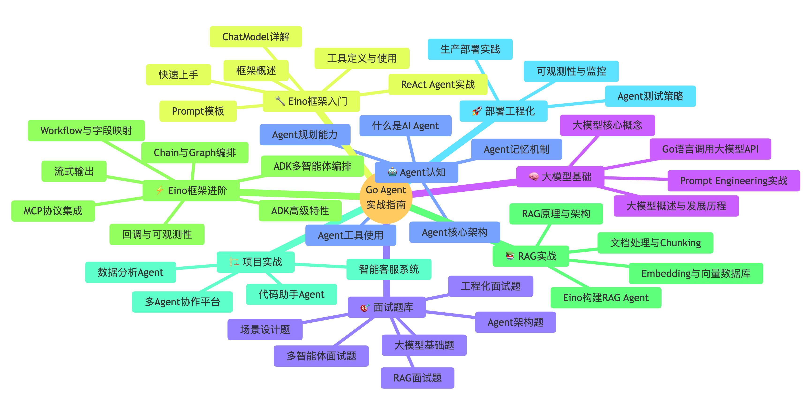
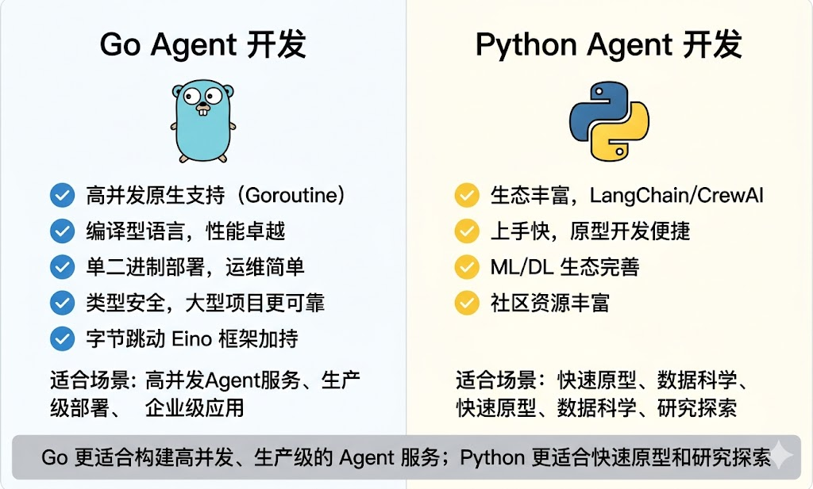
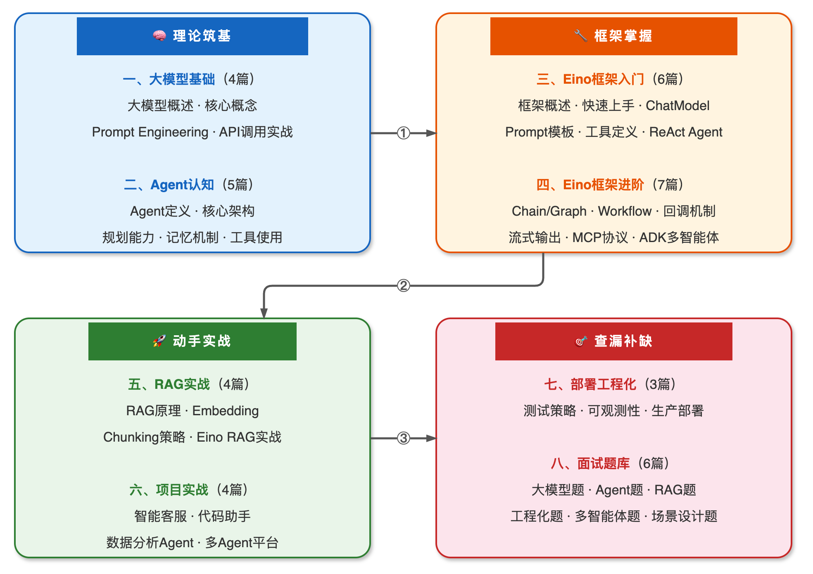
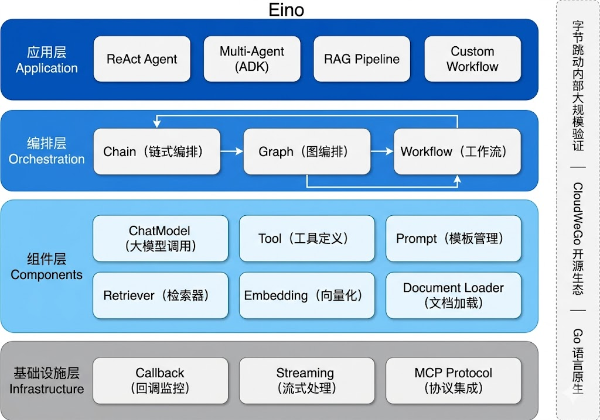

# **Go Agent实战指南 — 前言**

大家好，我是秀才，是这个《Go Agent实战指南》系列的作者。

2024年被称为 **AI Agent 元年**，大模型从能聊天进化到了能干活。Agent 不再是论文里的概念，而是真正在改变软件开发的方式——自动写代码、智能客服、数据分析、多系统协作……**AI Agent 正在成为每个开发者的必备技能。**

但是，当你兴致勃勃地想要入门 Agent 开发时，可能会发现：

- 市面上的教程几乎都是 Python + LangChain，Go 开发者怎么办？
- Agent 的概念太多太杂，ReAct、CoT、RAG、MCP……一头雾水，不知道从哪里看起
- 想用 Go 写 Agent，但不知道该选什么框架、怎么开始

**这就是我写《Go Agent实战指南》的原因。**

虽然现在AI已经很强大了，基本上你所有的知识问题，他都可以解答。但是知识是碎片化的，我们无法做到系统化的学习。这份《Go Agent实战指南》就完美解决了这个问题。

这是一份**专为 Go 开发者打造的 AI Agent 学习路径**，从大模型基础到 Agent 架构认知，从框架入门到进阶实战，从 RAG 检索增强到面试题库，一站式帮你掌握用 Go 构建 AI Agent 的全部技能。



## **为什么要学 Agent？**

在回答这个问题之前，我们先来看一组数据：

> - 2025年，**超过 70% 的科技公司**已经在内部使用或规划 AI Agent 系统
> - Agent 相关岗位的薪资比传统后端开发**高出 30%-50%**
> - 字节跳动、阿里、腾讯等大厂纷纷开源 Agent 框架，**Go 生态正在快速成熟**

简单来说，**Agent 是 AI 落地的最后一公里**。大模型再强大，如果不能与外部世界交互、不能自主完成任务，就只是一个高级聊天机器人。而 Agent 赋予了大模型**感知、规划、行动**的能力，让 AI 真正变成你的数字员工。

作为开发者，掌握 Agent 开发能力意味着：
- 你能构建**真正智能的应用**，而不只是套壳 ChatGPT
- 你在技术面试中拥有**差异化竞争力**
- 你能跟上 AI 时代的技术浪潮，**不被淘汰**

## **为什么用 Go？**

你可能会问：Agent 开发不都是 Python 的天下吗？为什么要用 Go？

<!-- 
==========================================================
📸 图片占位：Go vs Python Agent 开发对比图
----------------------------------------------------------
Nano Banana 提示词：

一张清晰的对比信息图，左右两栏对比 Go 和 Python 在 Agent 开发中的特点。
整体风格：简洁专业，白色背景，卡片式布局。

左侧（Go语言，蓝色主题色）：
- 标题：Go Agent 开发
- 图标：Go 语言 Gopher 吉祥物的简笔画形象
- 优势列表（打勾图标）：
  ✅ 高并发原生支持（Goroutine）
  ✅ 编译型语言，性能卓越
  ✅ 单二进制部署，运维简单
  ✅ 类型安全，大型项目更可靠
  ✅ 字节跳动 Eino 框架加持
- 适用场景：高并发Agent服务、生产级部署、企业级应用

右侧（Python，黄色主题色）：
- 标题：Python Agent 开发
- 图标：Python logo 简笔画
- 优势列表（打勾图标）：
  ✅ 生态丰富，LangChain/CrewAI
  ✅ 上手快，原型开发便捷
  ✅ ML/DL 生态完善
  ✅ 社区资源丰富
- 适用场景：快速原型、数据科学、研究探索

底部总结栏（灰色背景）：
"Go 更适合构建高并发、生产级的 Agent 服务；Python 更适合快速原型和研究探索"

尺寸：1000x600px，高清。
==========================================================
-->



答案很简单：**Go 是构建生产级 Agent 服务的绝佳选择。**

| 特性 | Go | Python |
|------|------|--------|
| **并发能力** | Goroutine 原生高并发 | 受 GIL 限制 |
| **性能** | 编译型，速度快 | 解释型，相对慢 |
| **部署** | 单二进制，零依赖 | 需要虚拟环境和依赖管理 |
| **类型安全** | 静态类型，编译期检查 | 动态类型，运行时报错 |
| **框架支持** | 字节 Eino（生产验证） | LangChain（生态丰富） |

当然，Python 在快速原型和数据科学领域有天然优势。但如果你的目标是**构建高并发、高可用、可落地生产的 Agent 服务**，Go 是更好的选择。而且，字节跳动开源的 **Eino 框架**已经在字节内部大规模使用，是经过生产验证的 Go Agent 开发框架。

## **适合什么群体？**

《Go Agent实战指南》面向所有想要掌握 AI Agent 开发的技术人员，特别适合以下群体：

- 🤖 **Go 后端开发者**：已有 Go 语言基础，想要拓展 AI Agent 开发技能的工程师
- 🚀 **全栈/后端工程师**：想要掌握 Agent 开发，提升技术竞争力的开发者
- 🎯 **求职面试者**：准备 AI 方向技术面试，需要系统掌握 Agent 知识的求职者
- 💡 **AI 应用开发者**：正在用 Python 做 Agent 开发，想了解 Go 方案的技术人员
- 📚 **技术管理者**：需要了解 Agent 技术架构和落地方案的技术负责人

<span style="color:rgb(74, 99, 255); font-weight: bold;">**简单来说，只要你对 AI Agent 感兴趣，想用 Go 语言构建真正能落地的智能应用，这个系列就是为你准备的。**</span>

如果你还不熟悉 Go 语言，建议先学习秀才的另一个系列 [《Go语言进阶之路》](/go_series/introduction.md)，打好 Go 语言基础后再来学习本系列，效果更佳。

## **要怎么阅读？**

《Go Agent实战指南》采用**渐进式学习路径**，从理论到实战、从入门到进阶，建议按照左侧目录顺序阅读。整个系列共 **`26篇`** 深度文章，涵盖 **8大模块**，每篇都配有完整可运行的 Go 代码示例。



### **一、大模型基础（4篇）** 👇
> 🧠 理论筑基 — 建立大模型的基础认知

| 文章 | 内容简介 |
|------|----------|
| [大模型概述与发展历程](./llm_base/llm_overview.md) | 从GPT到Claude的发展脉络，开源vs闭源生态 |
| [大模型核心概念](./llm_base/llm_core_concepts.md) | Token、Prompt、Temperature、上下文窗口等核心概念 |
| [Prompt Engineering实战](./llm_base/prompt_engineering.md) | Zero-shot/Few-shot、思维链、Prompt设计最佳实践 |
| [Go语言调用大模型API实战](./llm_base/llm_api_practice.md) | 用Go调用通义千问API、流式输出、错误处理 |

### **二、Agent认知篇（5篇）** 👇
> 🤖 理论筑基 — 深入理解 Agent 的本质与核心能力

| 文章 | 内容简介 |
|------|----------|
| [什么是AI Agent](./agent_concepts/agent_definition.md) | Agent定义、与ChatBot的区别、核心能力与应用场景 |
| [Agent核心架构](./agent_concepts/agent_architecture.md) | 感知-思考-行动循环、ReAct框架、系统组成 |
| [Agent的规划能力](./agent_concepts/agent_planning.md) | 任务分解、Plan-and-Execute、Tree of Thoughts |
| [Agent的记忆机制](./agent_concepts/agent_memory.md) | 短期记忆、长期记忆、工作记忆、Session管理 |
| [Agent的工具使用](./agent_concepts/agent_tool_use.md) | Function Calling原理、工具调用链、MCP协议 |

### **三、Eino框架入门（6篇）** 👇
> 🔧 框架掌握 — 掌握字节 Eino 框架的核心用法

| 文章 | 内容简介 |
|------|----------|
| [Eino框架概述](./eino_basic/eino_overview.md) | Eino架构、字节内部实战背景、与LangChain对比 |
| [Eino快速上手](./eino_basic/eino_quickstart.md) | 环境搭建、第一个ChatModel调用、通义千问接入 |
| [ChatModel详解](./eino_basic/eino_chatmodel.md) | 接口定义、Generate/Stream调用、多模型切换 |
| [Prompt模板与消息管理](./eino_basic/eino_prompt.md) | 消息类型、模板引擎、多轮对话构建 |
| [工具定义与使用](./eino_basic/eino_tool.md) | 工具接口、快速定义工具、参数与返回值 |
| [ReAct Agent实战](./eino_basic/eino_react_agent.md) | 创建ReAct Agent、配置、完整工具调用示例 |

### **四、Eino框架进阶（7篇）** 👇
> ⚡ 框架掌握 — 深入 Eino 高级特性与编排系统

| 文章 | 内容简介 |
|------|----------|
| [Chain与Graph编排](./eino_advanced/eino_chain_graph.md) | 链式编排、图编排、条件路由、编译与运行 |
| [Workflow与字段映射](./eino_advanced/eino_workflow.md) | Workflow编排、字段级数据映射、复杂数据流 |
| [回调与可观测性](./eino_advanced/eino_callback.md) | 回调机制、日志追踪与调试、全局与局部回调 |
| [流式输出与事件处理](./eino_advanced/eino_streaming.md) | StreamReader/Writer、流式响应、SSE实时输出 |
| [MCP协议集成](./eino_advanced/eino_mcp.md) | MCP Server/Client、跨系统工具调用、与Eino Tool桥接 |
| [ADK多智能体编排](./eino_advanced/eino_adk_agent.md) | 顺序/并行/循环Agent、Runner运行器 |
| [ADK高级特性](./eino_advanced/eino_adk_advanced.md) | 人机协作、重试策略、Agent State管理 |

### **五、RAG实战篇（4篇）** 👇
> 📚 动手实战 — 用 Go + Eino 构建知识检索增强 Agent

| 文章 | 内容简介 |
|------|----------|
| [RAG原理与架构](./rag/rag_overview.md) | 检索增强生成原理、RAG vs 微调、架构设计 |
| [Embedding与向量数据库](./rag/rag_embedding.md) | 文本向量化、向量数据库Go客户端实战 |
| [文档处理与Chunking策略](./rag/rag_chunking.md) | 分块策略、元数据提取、Go实现 |
| [基于Eino构建RAG Agent](./rag/rag_eino_practice.md) | Retriever组件、检索工具封装、效果优化 |

### **六、大模型面试题（36题）** 👇
> 🎯 查漏补缺 — 覆盖 Agent 开发领域的高频面试题

涵盖 Transformer与注意力机制、Agent架构与原理、RAG检索增强、Prompt工程、多智能体协作等 **36 道**深度面试题解析，每题都有详细的技术分析和面试参考回答。

| 面试题 | 核心考点 |
|--------|----------|
| [Transformer自注意力机制](/backend_series/llm_interview/transform_attention.md) | 自注意力的工作原理、为什么比RNN更适合长序列 |
| [LLM Gateway设计实现](/backend_series/llm_interview/llm_gateway.md) | 大模型网关的架构设计、限流、路由与成本控制 |
| [Agent定义与核心组件](/backend_series/llm_interview/agent_definition.md) | 基于LLM的智能体定义、核心组件构成 |
| [ReAct框架详解](/backend_series/llm_interview/react_definition.md) | 思维链与行动结合、ReAct如何完成复杂任务 |
| [Agent规划能力实现方法](/backend_series/llm_interview/agent_planning.md) | Plan-and-Execute、ToT等主流规划策略 |
| [位置编码原理与实现](/backend_series/llm_interview/position_code.md) | 位置编码的必要性、RoPE等实现方式对比 |
| [Agent短期记忆与长期记忆设计](/backend_series/llm_interview/agent_memory.md) | 记忆系统架构、外部工具与技术选型 |
| [Agent记忆覆盖问题](/backend_series/llm_interview/agent_memory_cover.md) | 记忆冲突与覆盖的成因、解决方案 |
| [构建复杂Agent的挑战](/backend_series/llm_interview/agent_challenge.md) | 幻觉、工具调用失败、规划偏差等核心难题 |
| [多Agent系统协同](/backend_series/llm_interview/multi_agent.md) | 多Agent优势、协作模式与引入的新复杂性 |
| [Agent框架选型与评价](/backend_series/llm_interview/agent_frame.md) | 框架使用经验、选型依据与评价指标 |
| [Tool Use与外部工具调用](/backend_series/llm_interview/agent_tool.md) | LLM如何学会调用API、Function Calling原理 |
| [Agent安全性与对齐](/backend_series/llm_interview/agent_safety.md) | 行为安全、可控性保障与人类意图对齐方法 |
| [Agent框架对比](/backend_series/llm_interview/agent_frame_compare.md) | LangChain vs LlamaIndex核心定位差异 |
| [Agent记忆模块设计](/backend_series/llm_interview/agent_memory_design.md) | 记忆模块的架构设计思路与实现方案 |
| [多轮对话Agent设计](/backend_series/llm_interview/agent_dialogue_design.md) | 上下文管理、意图识别、状态维护 |
| [多Agent协调与分工](/backend_series/llm_interview/agent_cooperation.md) | 协调机制、任务分配、通信协议 |
| [高并发RAG Agent延迟优化](/backend_series/llm_interview/agent_optimization.md) | 召回与生成阶段的延迟优化策略 |
| [RAG工作原理与优势](/backend_series/llm_interview/rag.md) | 检索增强生成原理、与微调的对比分析 |
| [文本切块策略选择](/backend_series/llm_interview/chunk.md) | 切块大小、重叠长度的选择与背后考量 |
| [Embedding模型选择与评估](/backend_series/llm_interview/embedding.md) | 嵌入模型选型、评估指标与基准测试 |
| [RAG检索质量提升技术](/backend_series/llm_interview/rag_optimization.md) | 混合检索、查询扩展等进阶检索技术 |
| [RAG系统性能评估](/backend_series/llm_interview/rag_evaluate.md) | 检索与生成两阶段的评估指标体系 |
| [知识图谱与图数据库增强检索](/backend_series/llm_interview/knowledge_graph.md) | 知识图谱增强RAG的场景与实现 |
| [RAG系统部署挑战](/backend_series/llm_interview/rag_deploy.md) | 向量库运维、索引更新、冷启动等实际问题 |
| [RAG范式：自适应与多次检索](/backend_series/llm_interview/rag_search.md) | 生成过程中多次检索、自适应检索策略 |
| [提高RAG检索正确率](/backend_series/llm_interview/rag_search_improve.md) | 查询改写、HyDE、多路召回等提升方法 |
| [Agent微调与数据集收集](/backend_series/llm_interview/fine_tuning.md) | 微调Agent能力的方法、数据集构建策略 |
| [RAG检索问题定位与排查](/backend_series/llm_interview/rag_ops.md) | 检索不到时的排查思路与定位方法 |
| [RAGAS评估框架](/backend_series/llm_interview/ragas.md) | 评估指标、流程与评估数据的获取构造 |
| [RAG语义鸿沟问题](/backend_series/llm_interview/rag_semantic_gaps.md) | 用户提问与向量库语义不匹配的解决方案 |
| [LangChain与LangGraph对比](/backend_series/llm_interview/langchain_langgraph.md) | 架构差异、各自适用场景分析 |
| [RAG中的Rerank](/backend_series/llm_interview/rag_rerank.md) | 重排序原理、常用Rerank模型与实践方法 |
| [RAG存储架构设计](/backend_series/llm_interview/rag_store.md) | 向量库、文档库、元数据的存储架构方案 |
| [Prompt注入攻击与防护](/backend_series/llm_interview/prompt_injection.md) | 攻击方式分类、防护策略与安全实践 |
| [RAG Query改写与Prompt构建](/backend_series/llm_interview/rag_query.md) | 查询改写方法、基于检索结果的Prompt构建 |

## **核心框架：字节跳动 Eino**

本系列的核心实战框架是字节跳动开源的 **Eino**（CloudWeGo 生态），这是目前 Go 语言生态中最成熟的 AI Agent 开发框架。

<!-- 
==========================================================
📸 图片占位：Eino 框架架构概览图
----------------------------------------------------------
Nano Banana 提示词：

一张 Eino 框架的架构概览图，展示其核心组件和层次关系。
整体风格：技术架构图风格，白色背景，蓝色和灰色为主色调，圆角矩形卡片。

自上而下分为4层：

第一层（顶部，深蓝色）——「应用层 Application」
- ReAct Agent
- Multi-Agent (ADK)
- RAG Pipeline
- Custom Workflow

第二层（中蓝色）——「编排层 Orchestration」
- Chain（链式编排）
- Graph（图编排）
- Workflow（工作流）
- 箭头表示数据流动方向

第三层（浅蓝色）——「组件层 Components」
- ChatModel（大模型调用）
- Tool（工具定义）
- Prompt（模板管理）
- Retriever（检索器）
- Embedding（向量化）
- Document Loader（文档加载）

第四层（灰色）——「基础设施层 Infrastructure」
- Callback（回调监控）
- Streaming（流式处理）
- MCP Protocol（协议集成）

右侧标注：字节跳动内部大规模验证 | CloudWeGo 开源生态 | Go 语言原生

尺寸：1000x700px，高清。
==========================================================
-->



选择 Eino 的理由：

- **字节内部大规模验证**：在字节跳动内部经过了海量请求的考验
- **Go 语言原生**：专为 Go 开发者设计，API 风格地道
- **功能完整**：ChatModel、Tool、RAG、Agent、多Agent编排一应俱全
- **CloudWeGo 开源生态**：背靠 CloudWeGo 社区，持续活跃更新

## **学习建议**

根据你的背景和目标，可以选择不同的学习路径：

### **🎯 零基础入门路径**
```
大模型基础（4篇） → Agent认知（5篇） → Eino入门（6篇） → 动手写第一个Agent
```
适合：对 AI 和 Agent 完全没有概念的开发者。建议每篇文章都跟着敲代码。

### **🚀 快速上手路径**
```
大模型核心概念（1篇） → Agent核心架构（1篇） → Eino快速上手（1篇） → ReAct Agent实战（1篇）
```
适合：有一定 AI 基础，想快速用 Go 写出 Agent 的开发者。只看核心篇目，快速出活。

### **⚡ 进阶提升路径**
```
Eino进阶（7篇） → RAG实战（4篇） → 项目实战 → 面试题库
```
适合：已经会用 Eino 基础功能，想深入掌握编排、RAG、多Agent协作的开发者。

### **📚 面试突击路径**
```
Agent认知（5篇） → RAG原理（1篇） → 面试题库（35+题）
```
适合：准备 AI 方向技术面试的求职者。重点理解原理，刷面试题。

## **质量如何？**

秀才写的 Agent 教程有三大特色：

**1. Go 语言视角** — 市面上唯一一份系统的 Go Agent 开发教程，不是 Python 翻译版，而是从 Go 开发者的思维出发。

**2. 实战为王** — 每篇文章 60% 以上是代码实战，所有代码都可以直接复制运行，不是伪代码。

**3. 体系化学习** — 从理论到框架到实战到面试，形成完整闭环，不是零散的知识碎片。

相信你在学习的过程中，心里的感受会是：

- 「原来 Agent 不是什么玄学，架构设计就是这么回事」
- 「Go 写 Agent 居然这么丝滑，Eino 框架太好用了」
- 「终于理解 RAG 是怎么回事了，之前看 Python 版本的始终不得要领」
- 「面试的时候聊 Agent，面试官都觉得我很懂」

## **有错误怎么办？**

如果你在学习的过程中，**发现有任何错误或者疑惑的地方，欢迎通过以下方式给我反馈**：

- 到对应文章底部评论留言
- 到GitHub提交issue或PR
- 微信群内直接交流，下面有学习交流群的加入方式

秀才会及时修正和完善内容，让这份学习资料越来越好！

## **关于作者**

秀才，资深Go开发工程师，有多年互联网后端开发经验，专注于Go语言生态和 AI Agent 应用开发。

**一个人的学习是孤独的，但是一群人的学习是快乐的。欢迎加入我们的学习交流群，一起学习，一起进步！扫描下方二维码，回复<span style="color:rgb(71, 99, 255);">「加群」</span>，拉你进入百人学习交流群。回复<span style="color:rgb(74, 71, 255);">「面试」</span>，领取面试题库PDF。**


相信通过《Go Agent实战指南》的学习，你一定能够：
- ✅ 系统理解大模型和 AI Agent 的核心原理
- ✅ 熟练使用字节 Eino 框架构建各类 Agent 应用
- ✅ 掌握 RAG 检索增强和多Agent协作等高级技能
- ✅ 在 AI 方向的技术面试中游刃有余

让我们一起用 Go 构建 AI Agent，拥抱智能时代！🚀

---

*最新内容会持续更新，建议收藏本页面随时查看最新进展*
