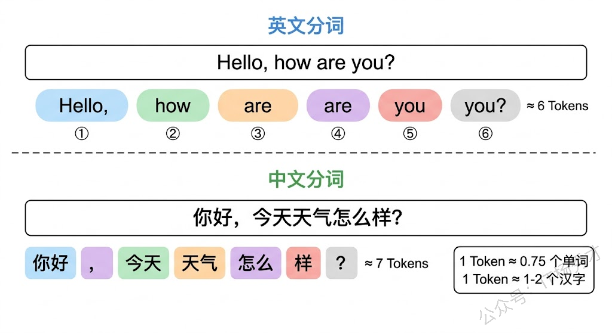
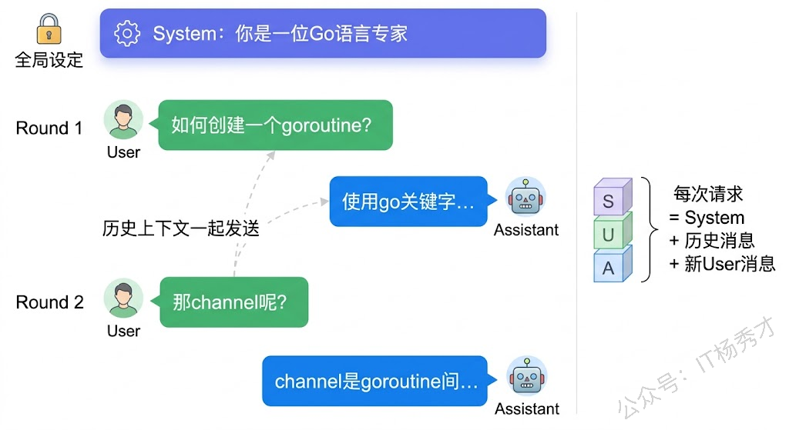
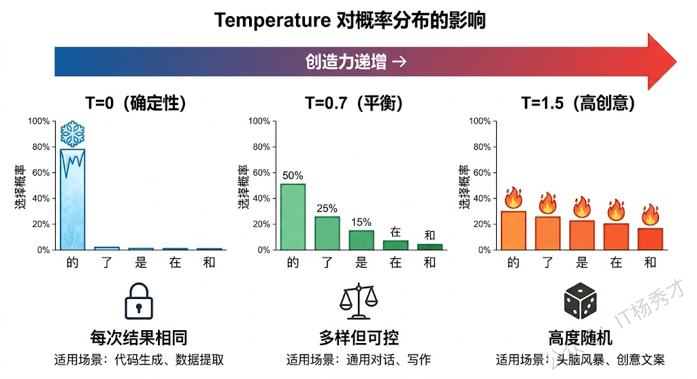
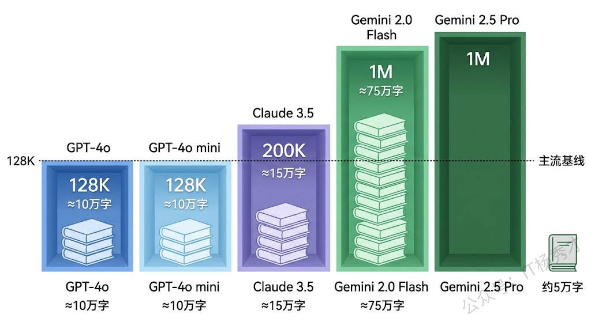
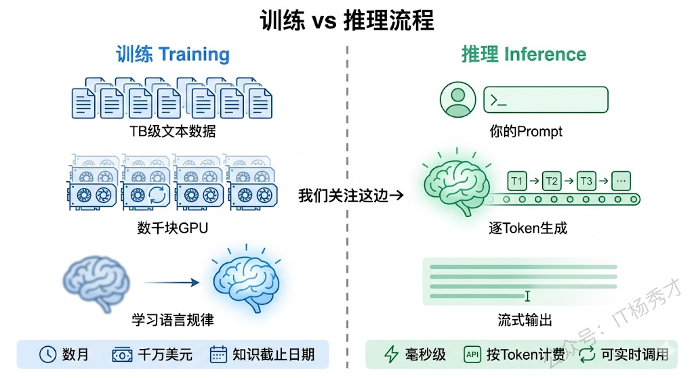
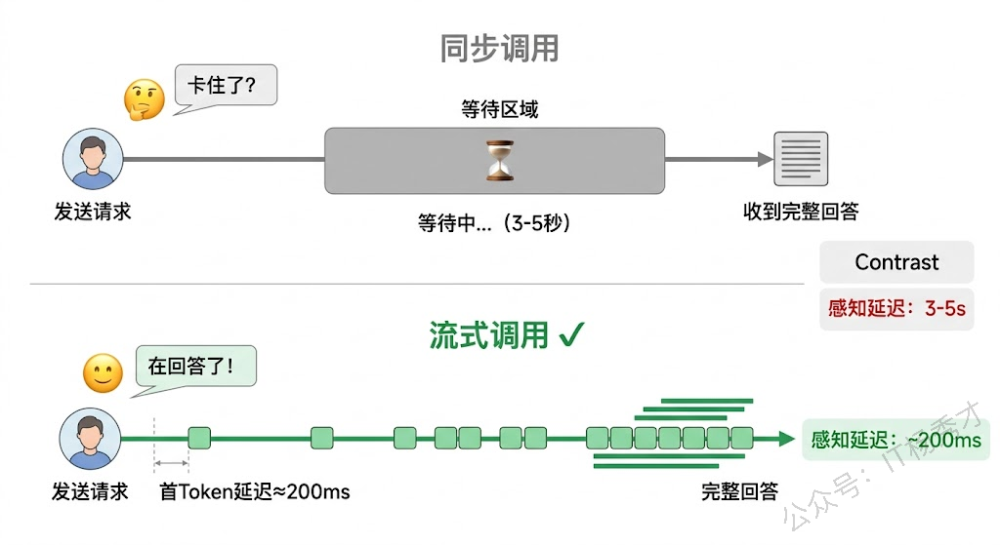
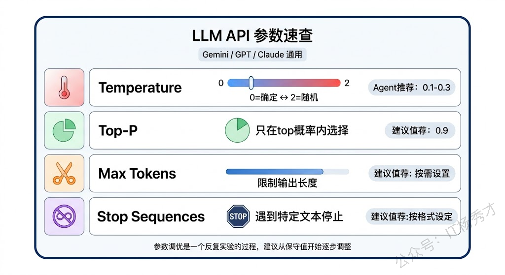

要用好大模型，光知道它"很聪明"是不够的。你得搞清楚跟它打交道时涉及的每一个关键概念——Token 是怎么算的？Prompt 该怎么组织？Temperature 设成 0 和设成 1 有什么区别？上下文窗口到底有多大？这些概念看似琐碎，但在实际开发 Agent 应用时，它们直接决定了你的应用效果好不好、成本高不高、响应快不快。

## **1. Token**

### **1.1 什么是 Token**

跟大模型打交道，你听到频率最高的词大概就是 Token 了。简单来说，**Token 是大模型处理文本的最小单位**。大模型不像人类一样按"字"或"词"来理解文本，而是把文本切分成一个个 Token 来处理。

Token 既不完全等于一个字，也不完全等于一个词，它是一种介于字符和词之间的"亚词"单位。英文中一个 Token 大约是 3-4 个字符，或者说大约 0.75 个英文单词；中文中一个 Token 通常对应 1-2 个汉字，具体取决于模型使用的分词器（Tokenizer）。

举个具体的例子。英文句子 "Hello, how are you?" 通常会被切分成大约 6 个 Token：`Hello`、`,`、` how`、` are`、` you`、`?`。而中文句子"你好，今天天气怎么样？"大约会被切分成 7-9 个 Token，因为一些常见词（如"今天"、"天气"）可能被当作一个 Token，而不那么常见的组合就会被拆成单字。



### **1.2 为什么 Token 这么重要**

Token 之所以重要，是因为大模型的几乎所有"尺度"都是用 Token 来衡量的。

**首先是计费**。无论是 OpenAI、Google 还是 Anthropic，API 调用的费用都按 Token 数量计算。而且输入 Token 和输出 Token 的价格通常不一样——输出 Token 往往更贵，因为生成文本比理解文本需要更多的计算资源。以 Gemini 2.5 Pro 为例，输入 Token 的价格是每百万 Token $1.25，而输出 Token 是每百万 $10，差了 8 倍。所以在实际开发中，控制输出长度比控制输入长度在成本上更有杠杆。

**其次是上下文窗口**。大模型能处理的最大文本量也是用 Token 来衡量的。GPT-4o 的上下文窗口是 128K Token，Claude 3.5 是 200K Token，Gemini 2.5 Pro 更是达到了 1M Token。超过这个限制，模型就"看不到"前面的内容了。

**最后是响应速度**。大模型的响应时间和生成的 Token 数量成正比——你要求它生成 100 个 Token 和 1000 个 Token，时间差距可能在 10 倍以上。如果你的 Agent 需要快速响应（比如实时对话场景），控制输出 Token 数量就很关键。

### **1.3 用 Go 代码来感受 Token**

为了让你对 Token 有更直观的感受，我们来写一段简单的 Go 代码，用 OpenAI 的 tiktoken 库来看看文本会被切成多少个 Token：

> **需要先安装依赖**：`go get github.com/pkoukk/tiktoken-go`

```go
package main

import (
        "fmt"

        "github.com/pkoukk/tiktoken-go"
)

func main() {
        // 使用 GPT-4 的编码方式
        enc, err := tiktoken.EncodingForModel("gpt-4")
        if err != nil {
                panic(err)
        }

        texts := []string{
                "Hello, how are you?",
                "你好，今天天气怎么样？",
                "Go is an open-source programming language.",
                "大语言模型的核心概念包括Token、Prompt和Temperature。",
        }

        for _, text := range texts {
                tokens := enc.Encode(text, nil, nil)
                fmt.Printf("文本: %s\n", text)
                fmt.Printf("Token数: %d\n", len(tokens))
                fmt.Printf("Token IDs: %v\n\n", tokens)
        }
}
```

运行结果：

```go
文本: Hello, how are you?
Token数: 6
Token IDs: [9906 11 1268 527 499 30]

文本: 你好，今天天气怎么样？
Token数: 13
Token IDs: [57668 53901 3922 37271 36827 36827 30320 242 17486 236 82696 91985 11571]

文本: Go is an open-source programming language.
Token数: 8
Token IDs: [11087 374 459 1825 31874 15840 4221 13]

文本: 大语言模型的核心概念包括Token、Prompt和Temperature。
Token数: 21
Token IDs: [27384 73981 78244 54872 25287 9554 72237 64209 162 25451 26203 113 68379 26955 105 3404 5486 55715 34208 41790 1811]
```

可以看到，同样长度的中文文本，Token 数量通常比英文多——这意味着用中文跟大模型对话，同等内容的成本会比英文稍高一些。这是一个在实际开发中需要注意的细节。

## **2. Prompt**

### **2.1 Prompt 到底是什么**

Prompt 直译过来是"提示"，在大模型的语境下，**Prompt 就是你发给模型的全部输入信息**。模型根据 Prompt 来理解你的意图、上下文和要求，然后生成回答。

你可能觉得这不就是"问问题"吗？其实没那么简单。Prompt 的质量直接决定了模型回答的质量。同样是让模型写一个函数，"写个排序函数"和"用 Go 写一个通用的快排函数，支持任意类型的切片排序，使用泛型实现，并附上单元测试"——这两个 Prompt 得到的结果天差地别。

### **2.2 消息角色**

在调用大模型 API 时，Prompt 不是一个简单的字符串，而是一组 **消息（Messages）**，每条消息都有一个角色标识。主流大模型 API 普遍采用三种角色：

**System（系统消息）** 用来设定模型的行为准则和角色定位。比如"你是一位资深的 Go 语言专家，请用简洁专业的语言回答问题"。System 消息只在对话开头设置一次，模型会在整个对话过程中遵循这个设定。你可以把 System 消息理解为给模型装了一个"人设"——就像一个演员拿到了角色说明，后面的所有表演都会基于这个角色来演。

**User（用户消息）** 就是用户的实际输入——你的问题、指令或者需要处理的内容。每一次用户发言都是一条 User 消息。

**Assistant（助手消息）** 是模型生成的回复。在多轮对话中，之前的 Assistant 消息会作为历史上下文一起发给模型，这样模型才知道之前聊了什么。



来看一段 Go 代码，感受一下这三个角色在实际 API 调用中是怎么使用的：

> **安装依赖**：`go get github.com/sashabaranov/go-openai`
>
> 本系列的代码示例统一使用通义千问（DashScope）的 OpenAI 兼容接口。你需要在 [阿里云百炼平台](https://bailian.console.aliyun.com/) 创建 API Key，然后设置环境变量：`export DASHSCOPE_API_KEY="你的API Key`

```go
package main

import (
        "context"
        "fmt"
        "log"
        "os"

        openai "github.com/sashabaranov/go-openai"
)

func main() {
        // 使用通义千问的 OpenAI 兼容接口
        cfg := openai.DefaultConfig(os.Getenv("DASHSCOPE_API_KEY"))
        cfg.BaseURL = "https://dashscope.aliyuncs.com/compatible-mode/v1"
        client := openai.NewClientWithConfig(cfg)

        // 构建多轮对话：System、User、Assistant 消息
        resp, err := client.CreateChatCompletion(
                context.Background(),
                openai.ChatCompletionRequest{
                        Model: "qwen-plus", // 通义千问模型
                        Messages: []openai.ChatCompletionMessage{
                                // System 消息：设定模型的角色和行为
                                {
                                        Role:    openai.ChatMessageRoleSystem,
                                        Content: "你是一位资深Go语言专家，回答简洁专业，代码示例使用Go语言。",
                                },
                                // 第一轮：用户提问
                                {
                                        Role:    openai.ChatMessageRoleUser,
                                        Content: "如何创建一个goroutine？",
                                },
                                // 第一轮：模型回复（历史记录）
                                {
                                        Role:    openai.ChatMessageRoleAssistant,
                                        Content: "使用go关键字即可启动一个goroutine，例如：go func() { fmt.Println(\"hello\") }()",
                                },
                                // 第二轮：用户追问（基于上下文）
                                {
                                        Role:    openai.ChatMessageRoleUser,
                                        Content: "那如何在两个goroutine之间传递数据？",
                                },
                        },
                },
        )
        if err != nil {
                log.Fatal(err)
        }

        fmt.Println(resp.Choices[0].Message.Content)
}
```

程序输出：

````go
在 Go 中，**goroutine 之间推荐通过 channel（通道）传递数据**，这是 Go 的核心并发模型（“不要通过共享内存来通信，而应通过通信来共享内存”）。

### ✅ 正确方式：使用 channel
```go
package main

import "fmt"

func main() {
    ch := make(chan string, 1) // 创建带缓冲的 channel

    // 启动 goroutine 发送数据
    go func() {
        ch <- "hello from goroutine"
    }()

    // 主 goroutine 接收数据（同步等待）
    msg := <-ch
    fmt.Println(msg) // 输出：hello from goroutine
}
```

### 🔑 关键要点：
- `make(chan T)` 创建无缓冲 channel（发送/接收会阻塞直到配对）；
- `make(chan T, N)` 创建容量为 N 的**有缓冲 channel**（可暂存 N 个值）；
- `<-ch` 是接收操作（从 channel 读），`ch <- value` 是发送操作（向 channel 写）；
- channel 是类型安全、并发安全的，无需额外加锁。

### ⚠️ 不推荐的方式（避免）：
- ❌ 直接共享变量 + mutex：易出错、违背 Go 并发哲学；
- ❌ 全局变量 + sleep 轮询：低效且不可靠。

### 💡 进阶提示：
- 使用 `close(ch)` 表示不再发送，配合 `for range ch` 消费；
- 使用 `select` 实现多 channel 复用或超时控制；
- 避免 goroutine 泄漏：确保 channel 有接收者（或合理关闭）。

需要示例（如生产者-消费者、带超时、关闭 channel）可随时告诉我 👍
````

注意看代码中的结构：System 消息、User 消息和 Assistant 消息统一放在 `Messages` 数组中，各自通过 `Role` 字段区分。这里我们使用的是通义千问提供的 OpenAI 兼容接口，大多数国内外大模型都支持这套接口标准，所以学会了这种调用方式，切换其他模型的成本非常低。第二轮提问时，第一轮的对话历史也一起发送，这样模型才知道"那如何在两个 goroutine 之间传递数据？"这个问题的上下文是关于 goroutine 的。

### **2.3 Prompt 的好坏差距有多大**

有人可能觉得 Prompt 不就是打字提问嘛，能有多大区别？那我们来做个对比实验。假设我们要让模型帮我们写一个 HTTP 中间件：

**普通 Prompt**：`"写个HTTP中间件"`，模型大概率会返回一个不知道什么语言、功能不明确的示例代码。

**优质 Prompt**：

```plain&#x20;text
用Go语言编写一个HTTP中间件，要求：
1. 记录每个请求的方法、路径、状态码和耗时
2. 使用slog库输出结构化日志
3. 兼容标准库net/http的HandlerFunc
4. 请给出完整可运行的示例，包含一个简单的HTTP服务器来演示效果
```

得到的代码质量完全不在一个级别上。Prompt Engineering 本身是一门很深的学问，我们在下一篇会专门讲。这里你只需要记住一个核心原则：**给模型的信息越具体、越清晰，它的输出就越靠谱。**

## **3. Temperature 和 Top-P**

### **3.1 Temperature**

Temperature（温度）是大模型中最重要的生成参数之一，它控制的是模型输出的 **随机性和创造性**。

要理解 Temperature，你需要知道大模型生成文本的底层逻辑。模型在生成每个 Token 时，并不是直接选一个"最佳答案"，而是先计算出所有候选 Token 的概率分布，然后根据概率来"抽样"选择下一个 Token。Temperature 控制的就是这个抽样过程的"锐度"。

**Temperature = 0** 时，模型变成完全确定性的——每次都选概率最高的那个 Token。这意味着同样的输入，永远得到同样的输出。适合需要稳定、一致结果的场景，比如代码生成、数据提取、分类任务。

**Temperature = 1** 时，模型按照原始概率分布进行抽样。概率高的 Token 仍然更容易被选中，但概率低的 Token 也有机会。结果会更加多样和有创意。

**Temperature > 1** 时，概率分布会变得更加"平坦"，小概率的 Token 被选中的机会大大增加。输出会非常有创意，但也可能变得不连贯甚至胡言乱语。



打一个通俗的比方：想象你要去一家餐厅吃饭。Temperature = 0 就是你每次都点那道最爱吃的菜，稳定可靠不出错。Temperature = 0.7 就是你大部分时候还是点熟悉的菜，偶尔也会尝试一下新品。Temperature = 1.5 就是你闭着眼睛在菜单上随便指一道，结果完全不可预测——可能惊喜，也可能踩雷。

### **3.2 Top-P**

Top-P 是另一个控制生成多样性的参数，它和 Temperature 的目标相似但机制不同。

Top-P 的工作方式是：模型先把所有候选 Token 按概率从高到低排序，然后累加概率直到总和达到 P 值，只在这个"核心集合"内进行抽样。比如 Top-P = 0.9，意味着模型只在累计概率达到 90% 的那些高概率 Token 中选择，直接忽略那些概率极低的"尾部"Token。

用一个更生活化的比方来理解：假设你在看一份点评排行榜上的餐厅推荐。Top-P = 0.9 就是说"只看排名覆盖了 90% 好评的那些餐厅"——排名靠后、评价极低的餐厅直接不考虑了。这样既保留了一定的选择多样性（不是只去第一名），又过滤掉了明显不靠谱的选项。

Top-P = 1.0 时相当于不做任何过滤，所有 Token 都有机会被选中；Top-P 值越小，可选范围越窄，输出越保守。

### **3.3 Temperature 和 Top-P 的配合使用**

在实际开发中，Temperature 和 Top-P 通常配合使用。不同的应用场景需要不同的参数组合：

| 场景       | Temperature | Top-P | 说明           |
| -------- | ----------- | ----- | ------------ |
| 代码生成     | 0 - 0.2     | 0.95  | 需要精确、稳定的输出   |
| Agent 规划 | 0.1 - 0.3   | 0.9   | 推理要准确，但允许灵活度 |
| 通用对话     | 0.5 - 0.7   | 0.9   | 自然流畅，有适度变化   |
| 创意写作     | 0.8 - 1.0   | 0.95  | 鼓励多样化表达      |
| 头脑风暴     | 1.0 - 1.5   | 1.0   | 最大化创意，接受不确定  |

对于 Agent 应用来说，一般建议使用较低的 Temperature（0.1-0.3）。因为 Agent 需要做出准确的判断——调用哪个工具、传什么参数、按什么顺序执行——这些环节容不得太多"创意发挥"。如果 Temperature 设太高，Agent 可能会"脑洞大开"地调用一个根本不该调的工具，或者生成不正确的参数。

来看一段 Go 代码，演示 Temperature 对输出的影响：

```go
package main

import (
    "context"
    "fmt"
    "log"
    "os"

    openai "github.com/sashabaranov/go-openai"
)

func generateWithTemperature(client *openai.Client, temp float32) {
    prompt := "用一句话描述Go语言的特点。"

    fmt.Printf("\n--- Temperature = %.1f ---\n", temp)
    // 生成3次，观察输出的差异
    for i := 1; i <= 3; i++ {
       resp, err := client.CreateChatCompletion(
          context.Background(),
          openai.ChatCompletionRequest{
             Model:       "qwen-plus",
             Temperature: temp,
             MaxTokens:   100,
             Messages: []openai.ChatCompletionMessage{
                {Role: openai.ChatMessageRoleUser, Content: prompt},
             },
          },
       )
       if err != nil {
          log.Printf("第%d次生成失败: %v", i, err)
          continue
       }
       fmt.Printf("第%d次: %s\n", i, resp.Choices[0].Message.Content)
    }
}

func main() {
    cfg := openai.DefaultConfig(os.Getenv("DASHSCOPE_API_KEY"))
    cfg.BaseURL = "https://dashscope.aliyuncs.com/compatible-mode/v1"
    client := openai.NewClientWithConfig(cfg)

    // 分别用不同的Temperature生成
    generateWithTemperature(client, 0.0)
    generateWithTemperature(client, 0.7)
    generateWithTemperature(client, 1.5)
}
```

运行结果（每次可能不同，这里是一个示例）：

```go
--- Temperature = 0.0 ---
第1次: Go语言是一门简洁、高效、并发安全的静态编译型编程语言，以内存安全、原生支持轻量级协程（goroutine）、快速启动、强类型与类型推导兼顾、以及“所写即所得”的可预测性能而著称。
第2次: Go语言是一门简洁、高效、并发安全的静态类型编译型语言，以内置轻量级协程（goroutine）、基于CSP模型的通道（channel）通信、快速编译、垃圾回收和强工程化设计（如统一代码风格、内置测试/工具链）为显著特点，专为现代分布式系统和云原生开发而优化。
第3次: Go语言是一门简洁、高效、并发安全的静态编译型编程语言，以内存安全、原生支持轻量级协程（goroutine）、快速启动、强类型与类型推导兼顾、以及“所写即所得”的可预测性能而著称。

--- Temperature = 0.7 ---
第1次: Go语言是一门简洁、高效、并发安全的静态编译型编程语言，以内存安全、原生支持轻量级协程（goroutine）、快速启动、强类型与类型推导兼顾、以及“所写即所得”的可预测性能而著称。
第2次: Go语言是一门简洁、高效、并发安全的静态类型编译型编程语言，以内置goroutine和channel原生支持轻量级并发、快速编译、垃圾回收和强类型系统为显著特点，专为现代云原生与高并发场景而设计。
第3次: Go语言是一门简洁、高效、并发安全的静态类型编译型语言，以内置轻量级协程（goroutine）、基于CSP模型的通道（channel）通信、快速编译、垃圾回收和强工程化设计（如统一代码风格、内置测试/工具链）为显著特点，专为现代分布式系统和云原生开发而优化。

--- Temperature = 1.5 ---
第1次: Go语言是一门简洁、高效、内置并发支持（goroutine + channel）、强调工程实践（如强制格式化、单一构建系统）和快速编译的静态类型编程语言，专为现代云原生与分布式系统开发而设计。
第2次: Go语言是一门简洁、高效、内置并发支持（goroutine + channel）、具备静态类型与自动垃圾回收的编译型编程语言，强调可读性、快速构建和云原生场景下的高生产力。
第3次: Go语言是一门简洁、高效、内置并发支持（goroutine + channel）、强调工程实践（如强制格式化、单一构建系统）和快速编译的静态类型编程语言，专为现代云原生与分布式系统开发而设计。
```

观察一下输出就能看到：Temperature = 0 时三次结果完全一样；0.7 时内容有变化但主题一致；1.5 时输出非常有创意，甚至用上了比喻——但这种"创意"在需要准确输出的 Agent 场景中反而是灾难。

## **4. 上下文窗口**

### **4.1 什么是上下文窗口**

上下文窗口（Context Window）是大模型一次能"看到"和处理的最大 Token 数量。你可以把它理解为大模型的"工作台"——工作台有多大，它就能同时摆多少材料来工作。

这是一个非常关键的概念，因为大模型 **没有真正的记忆**。它不会"记住"你昨天跟它说过什么，也不会"记住"这轮对话中超出上下文窗口的内容。每次你调用 API，模型看到的就是你这次发送的全部内容——System 消息、历史对话记录、当前提问——这些全部加起来不能超过上下文窗口的大小。

当前主流大模型的上下文窗口差异很大：

| 模型                | 上下文窗口      | 约等于      |
| ----------------- | ---------- | -------- |
| GPT-4o            | 128K Token | \~10万字中文 |
| GPT-4o mini       | 128K Token | \~10万字中文 |
| Claude 3.5 Sonnet | 200K Token | \~15万字中文 |
| Gemini 2.0 Flash  | 1M Token   | \~75万字中文 |
| Gemini 2.5 Pro    | 1M Token   | \~75万字中文 |



### **4.2 上下文窗口对 Agent 开发的影响**

上下文窗口的大小直接影响 Agent 应用的设计。

一个 Agent 在执行任务时，上下文中通常要包含这些内容：System Prompt（定义 Agent 的角色和能力）、可用工具列表及其描述（Function Calling 需要）、对话历史（多轮交互的记录）、当前用户输入、工具调用的返回结果——这些全部要塞进上下文窗口里。

如果上下文窗口不够用，就会出现所谓的"上下文溢出"问题。最直接的后果是 Agent "忘记"了前面的对话内容或任务指令，导致行为不一致或答非所问。这在复杂的多步任务中尤其明显——比如一个数据分析 Agent 先查询了数据库、又做了几步数据处理，每一步的结果都会占用上下文空间。如果中途上下文满了，Agent 可能就忘了最初的分析目标是什么。

所以在设计 Agent 应用时，你需要有意识地"管理"上下文。常用的策略包括：对过长的对话历史做摘要压缩（只保留关键信息）、工具调用结果只保留核心数据而不是完整原始输出、使用滑动窗口机制只保留最近 N 轮对话。

来看一段 Go 代码，演示如何在实际应用中估算和管理上下文用量：

```go
package main

import (
        "fmt"

        "github.com/pkoukk/tiktoken-go"
)

// ContextManager 上下文管理器
type ContextManager struct {
        maxTokens    int
        encoder      *tiktoken.Tiktoken
        systemPrompt string
        messages     []Message
}

type Message struct {
        Role    string
        Content string
}

func NewContextManager(maxTokens int, systemPrompt string) *ContextManager {
        enc, _ := tiktoken.EncodingForModel("gpt-4")
        return &ContextManager{
                maxTokens:    maxTokens,
                encoder:      enc,
                systemPrompt: systemPrompt,
                messages:     make([]Message, 0),
        }
}

// countTokens 计算文本的Token数量
func (cm *ContextManager) countTokens(text string) int {
        return len(cm.encoder.Encode(text, nil, nil))
}

// totalTokens 计算当前上下文的总Token数
func (cm *ContextManager) totalTokens() int {
        total := cm.countTokens(cm.systemPrompt)
        for _, msg := range cm.messages {
                // 每条消息额外有角色标记等开销，大约4个Token
                total += cm.countTokens(msg.Content) + 4
        }
        return total
}

// AddMessage 添加消息，如果超出限制则自动裁剪历史
func (cm *ContextManager) AddMessage(role, content string) {
        cm.messages = append(cm.messages, Message{Role: role, Content: content})

        // 保留20%的空间给模型生成回复
        limit := int(float64(cm.maxTokens) * 0.8)
        for cm.totalTokens() > limit && len(cm.messages) > 2 {
                // 移除最早的一轮对话（保留最近的消息）
                cm.messages = cm.messages[2:]
                fmt.Println("[上下文管理] 历史消息过多，裁剪最早一轮对话")
        }
}

// Stats 输出上下文使用情况
func (cm *ContextManager) Stats() {
        used := cm.totalTokens()
        pct := float64(used) / float64(cm.maxTokens) * 100
        fmt.Printf("上下文使用: %d / %d Token (%.1f%%)\n", used, cm.maxTokens, pct)
        fmt.Printf("对话轮数: %d 条消息\n", len(cm.messages))
}

func main() {
        // 假设使用一个 4K 上下文窗口的模型来演示裁剪效果
        cm := NewContextManager(4096, "你是一位Go语言专家，请简洁回答问题。")

        // 模拟多轮对话
        conversations := []struct{ question, answer string }{
                {"Go的goroutine和线程有什么区别？", "goroutine是Go运行时管理的轻量级线程，初始栈只有几KB，一个程序可以轻松创建数十万个goroutine。而操作系统线程的栈通常是MB级别，创建数量受限。goroutine由Go调度器进行M:N调度，效率远高于系统线程。"},
                {"channel有哪些类型？", "channel分为无缓冲channel和有缓冲channel。无缓冲channel要求发送和接收操作同步进行，有缓冲channel允许在缓冲区未满时异步发送。此外还有单向channel，分为只读和只写两种。"},
                {"context包怎么用？", "context包用于控制goroutine的生命周期。主要有四个创建函数：context.Background()作为根上下文，WithCancel用于手动取消，WithTimeout和WithDeadline用于超时控制。在HTTP服务器和数据库操作中广泛使用。"},
                {"sync.Mutex和sync.RWMutex的区别？", "Mutex是互斥锁，同一时间只允许一个goroutine持有。RWMutex是读写锁，允许多个goroutine同时读，但写操作独占。在读多写少的场景下，RWMutex性能更好。"},
                {"Go的GC机制是什么？", "Go使用三色标记清除算法进行垃圾回收。对象被分为白色（待回收）、灰色（待扫描）和黑色（已扫描）。GC过程中使用写屏障技术实现并发标记，减少STW时间。Go 1.19+还支持通过GOMEMLIMIT控制内存上限。"},
        }

        for _, conv := range conversations {
                fmt.Printf("\n用户: %s\n", conv.question)
                cm.AddMessage("user", conv.question)
                cm.AddMessage("assistant", conv.answer)
                cm.Stats()
        }
}
```

运行结果：

```plain&#x20;text
用户: Go的goroutine和线程有什么区别？
上下文使用: 125 / 4096 Token (3.1%)
对话轮数: 2 条消息

用户: channel有哪些类型？
上下文使用: 216 / 4096 Token (5.3%)
对话轮数: 4 条消息

用户: context包怎么用？
上下文使用: 296 / 4096 Token (7.2%)
对话轮数: 6 条消息

用户: sync.Mutex和sync.RWMutex的区别？
上下文使用: 385 / 4096 Token (9.4%)
对话轮数: 8 条消息

用户: Go的GC机制是什么？
上下文使用: 504 / 4096 Token (12.3%)
对话轮数: 10 条消息
```

这段代码演示了一个简单的上下文管理器。在实际的 Agent 应用中，你通常需要比这更精细的策略——比如按重要性而不是时间顺序裁剪，或者用模型对历史消息做摘要后再保留。

## **5. 训练与推理**

### **5.1 训练**

训练是"造"模型的过程。简单来说就是把海量的文本数据喂给神经网络，让它从中学习语言的规律和知识。这个过程需要巨大的算力投入——GPT-4 级别的模型训练一次可能花费数千万美元的计算成本，动用数千甚至上万块 GPU，耗时几个月。

训练过程对我们应用开发者来说是"黑盒"的——我们不需要关心模型是怎么训练出来的，就像你用 MySQL 不需要了解 B+ 树是怎么实现的（当然了解更好）。但你需要知道一个关键事实：**模型的知识截止于训练数据**。如果模型是用截止到 2024 年 6 月的数据训练的，它就不知道 2024 年 6 月以后发生的事情。这也是为什么 Agent 需要工具调用能力——通过搜索引擎等工具来获取实时信息。

### **5.2 推理**

推理就是"用"模型的过程——你给模型一段输入（Prompt），模型根据训练学到的知识生成输出。我们每次调 API 做的就是推理。

推理的过程是 **逐 Token 生成** 的。模型不是一次性"想好"整个回答然后输出，而是一个 Token 一个 Token 地生成——先生成第一个 Token，然后把它拼到输入后面，再生成第二个 Token……如此往复，直到生成结束标记（End of Sequence）或达到最大长度限制。

这就是为什么大模型的流式输出看起来像"打字机效果"——它确实是在一个字一个字地"打"出来的。而且这也解释了为什么生成长文本比短文本慢，因为每多生成一个 Token 都要经过一次完整的模型前向计算。



### **5.3 微调**

除了训练和推理，还有一个介于两者之间的概念——微调。微调是在已训练好的模型基础上，用少量的领域特定数据继续训练，让模型在某个垂直领域表现更好。

打个比方：训练好的大模型就像一个通才，什么都懂一点；微调后的模型就像一个专科医生，在通才的基础上对某个领域有了更深入的理解。

微调的成本远低于从头训练，通常几百到几千条高质量数据就够了，用一张 GPU 几个小时就能完成。对于 Agent 开发者来说，微调通常不是首选方案——因为通过 Prompt Engineering 和 RAG（检索增强生成）就能解决大部分问题。只有当这两种方式都不够用，且你有足够的领域数据时，才考虑微调。

## **6. API 调用模式**

### **6.1 同步调用**

同步调用是最基础的 API 调用方式——发送请求，等待模型生成完所有内容后，一次性返回完整结果。就像你在餐厅点了一桌菜，等全部做好了一起端上来。

同步调用的优点是简单直观，处理逻辑不复杂。缺点是用户体验不好——如果模型要生成很长的回答，用户需要等待很久才能看到任何内容。在生成 500 个 Token 的回答时，用户可能需要等待 3-5 秒甚至更久，这段时间内页面完全没有反馈。可以运行以下例子简单测试下：

```go
package main

import (
    "context"
    "fmt"
    "log"
    "os"
    "time"

    openai "github.com/sashabaranov/go-openai"
)

func main() {
    cfg := openai.DefaultConfig(os.Getenv("DASHSCOPE_API_KEY"))
    cfg.BaseURL = "https://dashscope.aliyuncs.com/compatible-mode/v1"
    client := openai.NewClientWithConfig(cfg)

    prompt := "用Go语言写一个简单的HTTP服务器，包含健康检查接口。"

    start := time.Now()
    fmt.Println("等待模型响应...")

    // 同步调用：等模型完全生成后才返回
    resp, err := client.CreateChatCompletion(
       context.Background(),
       openai.ChatCompletionRequest{
          Model: "qwen-plus",
          Messages: []openai.ChatCompletionMessage{
             {Role: openai.ChatMessageRoleUser, Content: prompt},
          },
       },
    )
    if err != nil {
       log.Fatal(err)
    }

    elapsed := time.Since(start)
    fmt.Printf("总耗时: %v\n", elapsed)
    fmt.Printf("回答:\n%s\n", resp.Choices[0].Message.Content)
}
```

### **6.2 流式调用**

流式调用则是让模型 **一边生成一边返回**——每生成一小段内容就立刻推送给客户端。就像一道一道上菜，第一道菜好了就先端上来，不用等全部做好。

流式调用极大地提升了用户体验。用户几乎在发送请求后的几百毫秒内就能看到模型开始"打字"，心理等待感大大降低。这也是为什么 ChatGPT、Claude 等产品都默认使用流式输出——那种逐字生成的效果不仅降低了感知延迟，还给用户一种"模型正在思考"的即时反馈。



```go
package main

import (
    "context"
    "fmt"
    "log"
    "os"
    "time"

    openai "github.com/sashabaranov/go-openai"
)

func main() {
    cfg := openai.DefaultConfig(os.Getenv("DASHSCOPE_API_KEY"))
    cfg.BaseURL = "https://dashscope.aliyuncs.com/compatible-mode/v1"
    client := openai.NewClientWithConfig(cfg)

    prompt := "用Go语言写一个简单的HTTP服务器，包含健康检查接口。"

    start := time.Now()
    firstToken := true

    // 流式调用：逐步接收模型输出
    stream, err := client.CreateChatCompletionStream(
       context.Background(),
       openai.ChatCompletionRequest{
          Model: "qwen-plus",
          Messages: []openai.ChatCompletionMessage{
             {Role: openai.ChatMessageRoleUser, Content: prompt},
          },
          Stream: true,
       },
    )
    if err != nil {
       log.Fatal(err)
    }
    defer stream.Close()

    for {
       resp, err := stream.Recv()
       if err != nil {
          break // io.EOF 表示流结束
       }

       if firstToken {
          fmt.Printf("首Token延迟: %v\n", time.Since(start))
          firstToken = false
       }

       // 逐块输出，用户可以实时看到内容
       if len(resp.Choices) > 0 {
          fmt.Print(resp.Choices[0].Delta.Content)
       }
    }

    fmt.Printf("\n\n总耗时: %v\n", time.Since(start))
}
```

运行这段代码你会看到，模型的回答是一小段一小段"蹦"出来的，而不是等半天突然出现一大段。首个 Token 通常在 200-500ms 内就能返回，而同步模式可能需要等 3-5 秒才能看到完整回答。

### **6.3 在 Agent 应用中如何选择**

对于 Agent 应用，流式调用几乎是必选项。原因有两个方面：一是用户体验，Agent 执行复杂任务可能需要较长时间，流式输出能让用户实时看到 Agent 的"思考过程"，而不是对着空白屏幕干等；二是中间结果处理，在流式模式下，你可以在收到模型的工具调用请求后立即开始执行工具，而不用等模型把所有内容都生成完——这在多工具调用的场景中能显著降低端到端延迟。

Google ADK 框架默认就是使用流式模式的，这也是我们后续实战中会深入讲解的内容。

## **7. 其他重要参数**

除了 Temperature 和 Top-P，在调用大模型 API 时还有几个常用参数值得了解。

### **7.1 Max Output Tokens**

顾名思义，这个参数限制模型最多生成多少个 Token。设置这个参数的主要目的是 **控制成本和响应时间**。如果你只需要模型回答"是"或"否"，那把 Max Output Tokens 设成 10 就够了，没必要让它长篇大论浪费钱。

在 Agent 场景中，这个参数需要谨慎设置。设得太小，模型可能在输出工具调用的 JSON 参数时被截断，导致调用失败；设得太大又浪费资源。一般建议根据具体任务动态调整——工具调用环节设小一点（500-1000），文本生成环节放宽一些（2000-4000）。

### **7.2 Stop Sequences**

停止序列是告诉模型"遇到这些字符就停止生成"的信号。比如你可以设置 `stop: ["\n\n"]`，让模型在生成两个连续换行时就停下来，不继续往下写。

这在 Agent 开发中有一个巧妙的用法：如果你的 Agent 需要按特定格式输出（比如先输出"思考过程"再输出"最终回答"），你可以用 Stop Sequences 来精确控制生成的边界。

### **7.3 Frequency Penalty 和 Presence Penalty**

这两个参数用来减少模型"翻来覆去说同一句话"的问题。Frequency Penalty 对已经出现过的 Token 施加惩罚，出现次数越多惩罚越大；Presence Penalty 则是只要出现过就施加固定惩罚，不管出现了几次。

在实际 Agent 开发中，这两个参数通常用默认值（0）就够了。只有当你发现模型的输出总是重复啰嗦时，才需要调高它们。



来看一段完整的 Go 代码，把这些参数组合使用：

```go
package main

import (
        "context"
        "fmt"
        "log"
        "os"

        openai "github.com/sashabaranov/go-openai"
)

func main() {
        cfg := openai.DefaultConfig(os.Getenv("DASHSCOPE_API_KEY"))
        cfg.BaseURL = "https://dashscope.aliyuncs.com/compatible-mode/v1"
        client := openai.NewClientWithConfig(cfg)

        // 为Agent场景配置最佳参数组合
        resp, err := client.CreateChatCompletion(
                context.Background(),
                openai.ChatCompletionRequest{
                        Model: "qwen-plus",
                        Messages: []openai.ChatCompletionMessage{
                                // System消息：设定Agent角色
                                {
                                        Role:    openai.ChatMessageRoleSystem,
                                        Content: "你是一位Go语言技术顾问。回答要简洁准确，优先给出代码示例。",
                                },
                                {
                                        Role:    openai.ChatMessageRoleUser,
                                        Content: "请用3句话解释Go语言的error处理哲学。",
                                },
                        },
                        // Temperature低一些，保证输出稳定
                        Temperature: 0.2,
                        // Top-P稍微收紧
                        TopP: 0.9,
                        // 限制最大输出长度
                        MaxTokens: 1024,
                        // 停止序列：遇到连续分隔线就停
                        Stop: []string{"---"},
                },
        )
        if err != nil {
                log.Fatal(err)
        }

        fmt.Println(resp.Choices[0].Message.Content)

        // 查看Token使用情况
        fmt.Printf("\n--- Token 使用统计 ---\n")
        fmt.Printf("输入Token: %d\n", resp.Usage.PromptTokens)
        fmt.Printf("输出Token: %d\n", resp.Usage.CompletionTokens)
        fmt.Printf("总Token: %d\n", resp.Usage.TotalTokens)
}
```


运行结果：


```plain&#x20;text
Go 语言主张“显式错误处理”，要求调用者必须显式检查和处理每个可能的错误，而非依赖异常机制。  
错误被视为普通值（`error` 接口），通常作为函数最后一个返回值，鼓励开发者直面错误场景并做出明确决策。  
Go 不提倡忽略错误（如 `_, _ = fn()`），而推荐使用 `if err != nil` 立即处理，或通过包装（`fmt.Errorf("...: %w", err)`）保留原始错误链。

--- Token 使用统计 ---
输入Token: 43
输出Token: 112
总Token: 155
```

注意最后的 Token 使用统计——在实际项目中，你应该记录每次 API 调用的 Token 消耗，这对成本监控和优化至关重要。

## **8. 小结**

Token、Prompt、Temperature、上下文文窗口、同步与流式……这些概念构成了你和大模型之间的"通信协议"。每一个概念背后都对应着实际开发中的关键决策：Token 影响成本和性能，Prompt 的结构决定了模型能否准确理解你的意图，Temperature 的选择决定了 Agent 是严谨可靠还是天马行空，上下文窗口的限制决定了 Agent 能"记住"多少东西，而同步或流式的选择则直接影响用户体验。

这些概念不是孤立的知识点，它们共同构成了大模型应用开发的基础设施。就像 Go 开发者需要理解 goroutine、channel、context 这套并发基础设施一样，Agent 开发者需要把这套"大模型基础设施"内化于心。当你在后续的实战中遇到"Agent 回答不稳定"、"API 调用成本太高"、"响应太慢"之类的问题时，回过头来看这些概念，答案往往就在其中。

<div style="background-color: #f0f9eb; padding: 10px 15px; border-radius: 4px; border-left: 5px solid #67c23a; margin: 20px 0; color:rgb(64, 147, 255);">

<span style="color: #006400; font-size: 28px;"><strong>关注秀才公众号：</strong></span><span style="color: red; font-size: 28px;"><strong>IT杨秀才</strong></span><span style="color: #006400; font-size: 28px;"><strong>，回复：</strong></span><span style="color: red; font-size: 28px;"><strong>面试</strong></span>

<div style="text-align: center;"><span style="color: #006400; font-size: 28px;"><strong>领取后端/AI面试题库PDF</strong></span></div>


</div> 