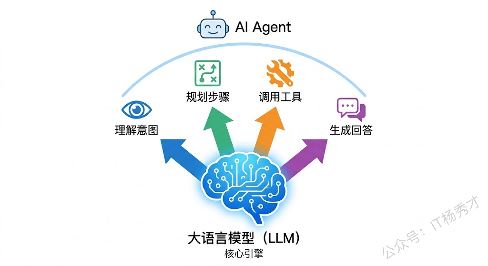
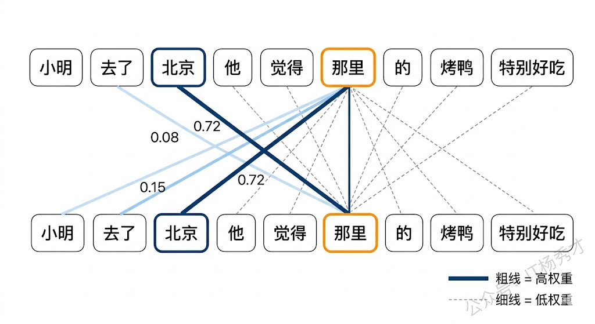
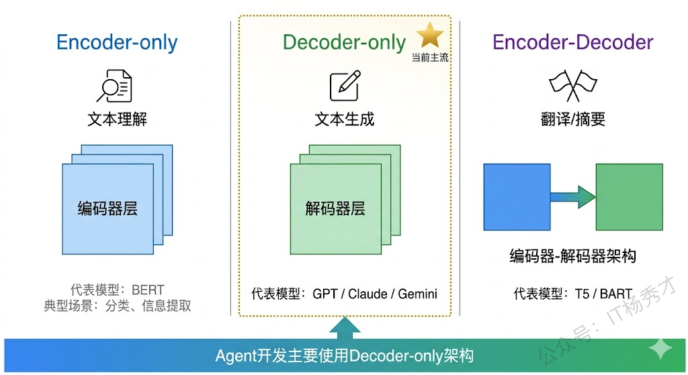
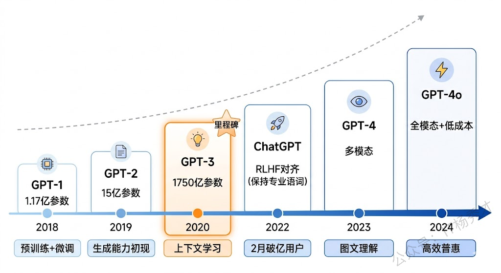
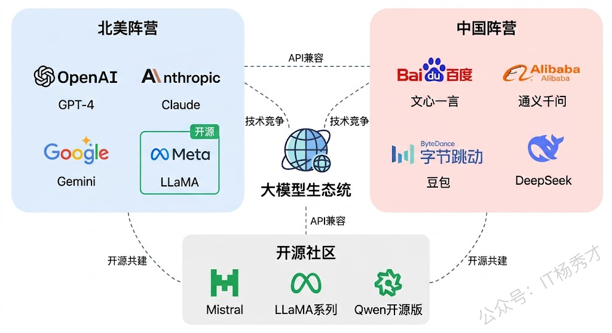
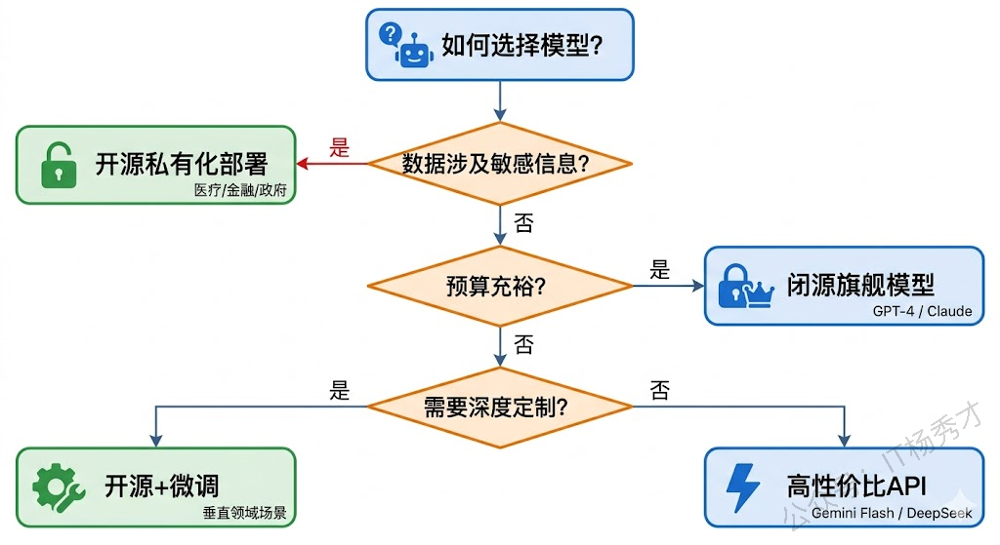
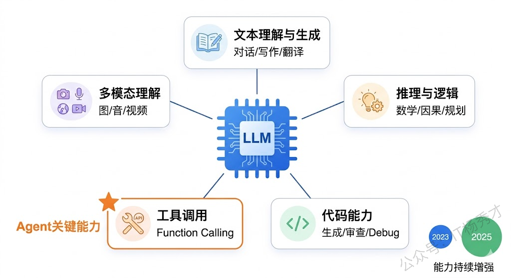
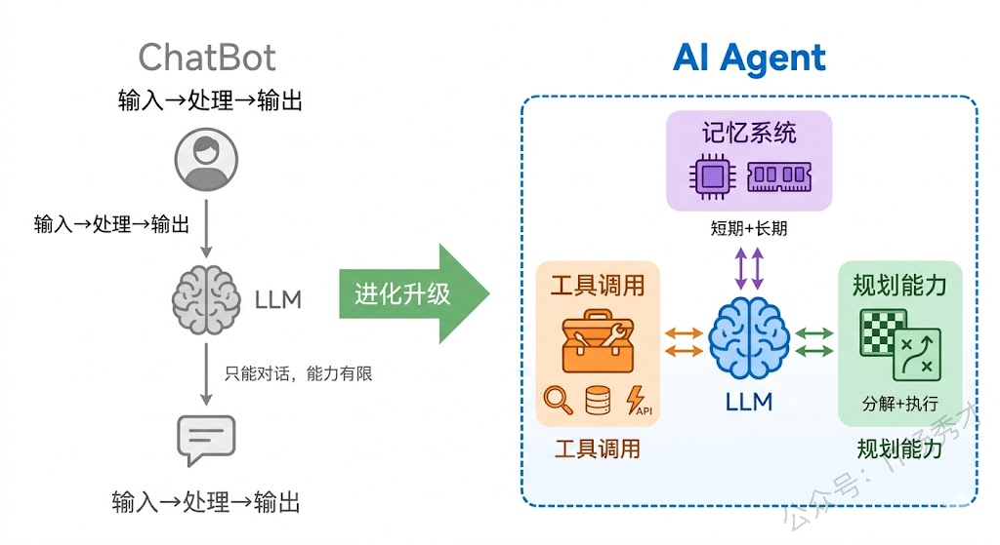

欢迎来到《Go Agent 实战指南》的第一篇。在正式动手写 Agent 代码之前，我们需要先搞清楚一件事：**大模型到底是什么？它是怎么一步步走到今天的？**&#x8981;开发 AI Agent 应用，你首先得理解它的"发动机"——大语言模型（Large Language Model，简称 LLM）。

## **1. 为什么要了解大模型？**

你可能会问：我是 Go 语言开发者，直接学怎么调 API、怎么写 Agent 不就行了？为什么还要了解大模型本身？

答案其实很简单——**因为大模型就是 Agent 的大脑**。

Agent 的所有智能行为——理解用户意图、规划执行步骤、选择合适的工具、生成最终回答——全都依赖大模型来完成。如果你不了解大模型的能力边界和工作原理，写出来的 Agent 应用就容易出各种问题。比如明明是个简单任务，你却用了最贵的旗舰模型，成本蹭蹭往上涨；或者一个需要复杂推理的场景，你用了个小模型，效果惨不忍睹。再比如 Temperature 该设多少、上下文窗口够不够用，这些参数如果你对模型没有基本认知，根本调不好。更头疼的是，当 Agent 返回了不靠谱的结果时，你分不清到底是 Prompt 写得不好、模型能力不够，还是工具调用环节出了问题。

所以，磨刀不误砍柴工。先花一点时间建立对大模型的整体认知，后面的学习会事半功倍。

## **2.** **大模型的前世今生**

大模型不是凭空出现的，它的诞生经历了几十年的技术积累。我们来简单回顾这段历程，了解它是如何一步步走到今天这个"无所不能"的地步。

### **2.1 早期探索**

最早的自然语言处理（NLP）是基于规则的——人工编写语法规则，让机器按规则理解语言。你可以想象成教一个老外说中文，你给他一本厚厚的语法书，让他逐条查阅。效果嘛……你懂的，语言太灵活了，规则根本写不完。

后来，统计方法登场了。研究者们开始用大量文本数据训练模型，让机器从数据中自动"学习"语言的规律。这就像那个老外不用语法书了，而是天天泡在中国人堆里，听多了自然就会说了。

这一时期有两个代表性技术值得一提。一个是 2013 年 Google 提出的 **Word2Vec**，它是第一个让机器能够理解词与词之间语义关系的模型——比如它能理解"国王 - 男人 + 女人 ≈ 女王"这样的关系，这在当时是非常惊艳的。另一个是 **RNN/LSTM**（循环神经网络），它擅长处理序列数据，但有个致命问题——处理长文本时，前面的信息容易被"遗忘"。

这些技术虽然有进步，但离真正的"智能"还差得很远。直到 2017 年，一篇改变历史的论文出现了。

### **2.2 Transformer**

2017 年，Google 的研究团队发表了那篇著名的论文——《Attention Is All You Need》。这篇论文提出了 **Transformer** 架构，从此彻底改变了 NLP 甚至整个 AI 领域的走向。

Transformer 的核心创新是 **自注意力机制（Self-Attention）**。

用一个通俗的例子来解释：假设你在读一段话——"小明去了北京，他觉得那里的烤鸭特别好吃"。当你读到"那里"的时候，你的大脑会自动把注意力回溯到"北京"，而不是"小明"。这就是注意力机制做的事情——让模型在处理每个词的时候，能够"关注"到句子中最相关的其他词。

**为什么 Transformer 这么厉害？** 相比之前的 RNN/LSTM，它有三个关键优势。

> 首先是**并行计算**。RNN 必须逐词处理，像排队过安检一样一个一个来；而 Transformer 可以同时处理所有词，像高铁站多通道安检，速度快了几个数量级。
>
> 其次是**长距离依赖**，RNN 处理长文本时，前面的信息容易"忘掉"；Transformer 通过注意力机制，即使相隔很远的词也能直接建立联系。
>
> 最后是**可扩展性**，Transformer 的结构天然适合"堆参数"——模型越大，效果越好，这直接催生了后来的"大力出奇迹"路线。

Transformer 本身包含两个核心部分：**编码器（Encoder）** 和 **解码器（Decoder）**。后来的大模型基本都是在这个架构上做变体：

| 架构类型                     | 代表模型                | 适用场景         |
| ------------------------ | ------------------- | ------------ |
| 仅编码器（Encoder-only）       | BERT                | 文本理解、分类、信息提取 |
| 仅解码器（Decoder-only）       | GPT系列、Claude、Gemini | 文本生成、对话、代码编写 |
| 编码器-解码器（Encoder-Decoder） | T5、BART             | 翻译、摘要、问答     |

目前主流的大语言模型基本都采用 **Decoder-only** 架构，因为它在文本生成任务上表现最好，而 Agent 应用恰恰是以生成为核心的。

### **2.3 GPT 系列**

Transformer 提出之后，OpenAI 率先在这个架构上押下重注，走出了一条"大力出奇迹"的路线。

**GPT-1（2018年6月）**——第一个试水的版本。1.17 亿参数，在无监督文本上预训练，然后在下游任务上微调。当时的效果还比较一般，但证明了一个关键思路：**先在大规模文本上预训练，再在特定任务上微调**，这条路是走得通的。

**GPT-2（2019年2月）**——参数量提升到 15 亿，模型开始展现出令人惊讶的文本生成能力。OpenAI 当时以"担心被滥用"为由，没有立即发布完整模型，这反而让 GPT-2 获得了巨大的媒体关注。不过说实话，GPT-2 的实际能力还是比较有限的。

**GPT-3（2020年6月）**——这是一个真正的里程碑。参数量暴涨到 **1750 亿**，比 GPT-2 大了 100 多倍。更重要的是，GPT-3 展现出了一种全新的能力——**In-Context Learning（上下文学习）**。你不需要微调模型，只需要在 Prompt 里给几个例子，模型就能理解你想让它做什么。这个能力直接催生了后来的 Prompt Engineering。

**GPT-3.5 / ChatGPT（2022年11月）**——在 GPT-3 的基础上，通过 **RLHF（基于人类反馈的强化学习）** 技术进行对齐训练，让模型的回答更符合人类期望。ChatGPT 的发布直接引爆了全球的 AI 热潮——两个月内用户突破 1 亿，创造了互联网产品增长的历史记录。

**GPT-4（2023年3月）**——多模态模型，不仅能处理文本，还能理解图片。推理能力大幅提升，在各种专业考试中都能达到人类前 10% 的水平。GPT-4 的出现让很多人第一次真正感受到：AI 可能真的要改变世界了。

**GPT-4o / GPT-4o mini（2024年）**——"o"代表"omni"（全能），进一步增强了多模态能力，支持文本、图像、音频的统一理解和生成，同时大幅降低了使用成本和延迟。

## **3. 主流大模型全景**

GPT 点燃了大模型的军备竞赛之后，各大科技巨头纷纷入场。一下就是一些主流玩家：

### **3.1 Anthropic Claude 系列**

Claude 是由 Anthropic 公司开发的大模型，Anthropic 的创始团队很多来自 OpenAI。Claude 系列的特点是特别强调 **安全性和可靠性**，在长文本处理和代码生成方面表现出色。目前主要有几个版本：Claude 3.5 Sonnet 性价比极高，速度快效果好，是很多开发者的首选；Claude 3.5 Opus 是旗舰级模型，复杂推理能力更强；到了 2025 年推出的 Claude 4 系列，推理能力和工具使用能力又有了大幅提升。

Claude 系列还有一个很大的优势——上下文窗口可以达到 200K Token，这意味着你可以一次性给它几十万字的文档让它处理，这在 RAG 和长文档分析场景下非常有用。

### **3.2 Google Gemini 系列**

Gemini 是 Google DeepMind 推出的多模态大模型，从设计之初就是面向多模态的——不是在文本模型上"加装"图片能力，而是原生支持文本、图像、音频、视频的联合理解。目前 Gemini 2.0 Flash 主打速度快、成本低，适合大规模应用；而 Gemini 2.5 Pro 是旗舰级模型，推理能力强大，上下文窗口更是高达 1M Token。

Gemini 对我们这个系列特别重要，因为 **Google ADK（Agent Development Kit）默认使用 Gemini 作为底层模型**。后续的实战代码中，我们会大量使用 Gemini API。

### **3.3 国内大模型生态**

国内的大模型发展也非常迅速：

| 模型          | 公司       | 特点              |
| ----------- | -------- | --------------- |
| 文心一言（ERNIE） | 百度       | 中文理解能力强，生态完善    |
| 通义千问（Qwen）  | 阿里       | 开源版本表现出色，支持多语言  |
| DeepSeek    | DeepSeek | 代码和推理能力突出，性价比极高 |
| 豆包（Doubao）  | 字节跳动     | 多模态能力强，接入场景丰富   |
| GLM         | 智谱AI     | 中英双语，开源生态活跃     |

对于国内开发者来说，这些模型各有优势，在实际项目中可以根据需求灵活选择。好消息是，大多数模型的 API 接口都兼容 OpenAI 的格式，切换模型的成本很低。

## **4. 开源 vs 闭源**

在大模型领域，有一个绕不开的话题：**开源还是闭源？**

### **4.1 闭源模型**

以 GPT-4、Claude、Gemini 为代表，这些模型不公开权重和训练细节，用户只能通过 API 调用。

闭源模型最大的优势在于模型能力通常是最强的——毕竟背后有最多的资金和算力投入。而且使用起来非常简单，调个 API 就行，不需要自己搞部署和运维，模型提供商还会持续迭代更新，用户自动就能享受到最新能力。

但凡事有两面，闭源模型的问题也很明显：你的数据需要发送到外部服务器，这在一些对数据安全敏感的场景（比如金融、医疗）中是个硬伤。另外你完全受限于 API 提供商的定价策略，没法根据自己的特定需求对模型做深度定制。

### **4.2 开源模型**

以 Meta 的 LLaMA 系列、阿里的 Qwen 系列、Mistral 为代表，这些模型公开了权重，你可以自由下载、部署、甚至修改。

开源模型走的是另一条路。最好一点是数据不出本地，隐私安全有保障，这对很多企业来说是刚需。同时你可以根据自己的业务需求对模型进行微调定制，社区生态也非常活跃，各种工具链应有尽有。

当然，开源模型也有它的短板——顶级能力通常还是不如最强的闭源模型，而且你得自己准备 GPU 资源来部署，运维和性能优化也需要一定的技术功底。简单来说，闭源模型是"花钱买省心"，开源模型是"多花精力换自由度"。

### **4.3 实际开发中怎么选？**

对于 Agent 开发者来说，不需要非此即彼。实际项目中，很多团队采用的是 **混合策略**：在开发调试阶段，用闭源模型（如 Gemini、GPT-4）快速验证想法，因为效果好、接入快；到了生产部署阶段，再根据实际情况做选择——如果数据涉及隐私，就用开源模型做私有化部署；如果对效果要求极高，就继续用闭源模型的 API；如果追求性价比，DeepSeek 和 Gemini Flash 这类方案会是不错的选择。

## **5. 大模型的核心能力**

了解了大模型的历史和格局之后，我们来看看大模型到底能做什么。对于 Agent 开发者来说，理解模型的核心能力非常关键，因为 **Agent 的能力上限本质上取决于底层模型的能力**。

### **5.1 文本理解与生成**

这是大模型最基础也是最核心的能力。模型能够理解你输入的自然语言，并生成连贯、有逻辑的回答。这个能力是所有 Agent 应用的基石。

### **5.2 推理与逻辑分析**

现代大模型具备了相当强的推理能力，能够进行逻辑推导、数学计算、因果分析。特别是 GPT-4、Claude 3.5、Gemini 2.5 Pro 等旗舰模型，在复杂推理任务上已经达到了很高的水平。

这种推理能力对 Agent 至关重要——Agent 需要理解用户意图、拆解复杂任务、规划执行步骤，这些都依赖模型的推理能力。

### **5.3 代码理解与生成**

大模型在代码领域的能力已经非常强大，能够理解代码逻辑、生成功能代码、Debug 排错、解释代码含义。对于我们 Go 开发者来说，这意味着大模型不仅是我们要集成的对象，也是我们开发过程中的得力助手。

### **5.4 工具调用**

这是大模型近年来最重要的能力突破之一。模型不仅能生成文本，还能 **识别何时需要调用外部工具，并生成正确的调用参数**。

举个例子：用户问"北京今天天气怎么样？"，模型知道自己没有实时天气数据，于是生成一个工具调用请求：`get_weather(city="北京")`。系统执行这个调用，拿到实时天气数据，再交给模型组织成自然语言回复。

这个能力是 **Agent 区别于普通 ChatBot 的关键所在**，我们会在后续的 Agent 认知篇中深入讲解。

### **5.5 多模态理解**

最新一代的大模型已经不局限于处理文本，还能理解图片、音频甚至视频。这为 Agent 的应用场景打开了更广阔的空间——比如一个客服 Agent 可以直接看用户上传的产品故障图片来判断问题。

## **6. 从大模型到 Agent**

到这里，你可能已经发现了——大模型虽然很强，但它本质上还是一个 **"输入文本 → 输出文本"** 的系统。它不能主动获取信息，不能执行操作，不能记住上一次对话的内容（除非你把历史记录塞进去）。而 Agent，就是要解决这些问题。

> **Agent = 大模型 + 工具调用 + 记忆系统 + 规划能力**

简单来说，大模型是 Agent 的"大脑"，而 Agent 在大脑的基础上，给它装上了"手"（工具调用）、"记忆"（短期/长期记忆）和"规划能力"（任务分解与执行策略）。

这就是为什么我们要先学大模型基础——因为大脑是一切能力的起点。在下一篇中，我们将深入学习大模型的核心概念：Token、Prompt、Temperature 等，理解和模型交互时的每一个关键参数。

## **7. 小结**

大模型并不神秘，它本质上就是一个在海量文本上训练出来的超大规模神经网络。Transformer 架构赋予了它理解语言和生成文本的能力，而随着参数规模的增长和训练方法的演进，这种能力已经强大到可以进行复杂推理、编写代码、甚至主动调用外部工具——这些能力叠加在一起，就构成了 AI Agent 最核心的"大脑"。

对于我们 Go 开发者来说，理解大模型就像理解数据库一样——你不需要自己去实现一个 MySQL，但你得知道索引怎么工作、事务怎么回事，这样才能写出高效的数据库应用。同样的道理，你不需要自己训练大模型，但你得知道它能做什么、不能做什么、不同模型之间有什么差异，这样才能在构建 Agent 应用时做出正确的技术决策。

<strong>关注秀才公众号：</strong><strong>IT杨秀才</strong><strong>，回复：</strong><strong>面试</strong>

<strong>领取后端/AI面试题库PDF</strong>

 

