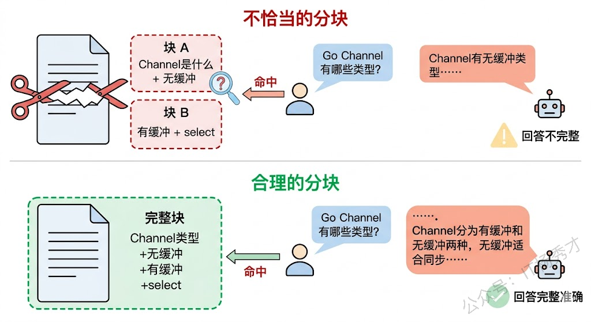
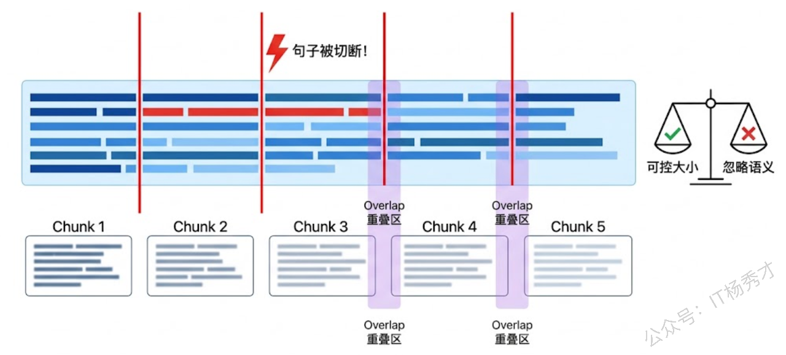
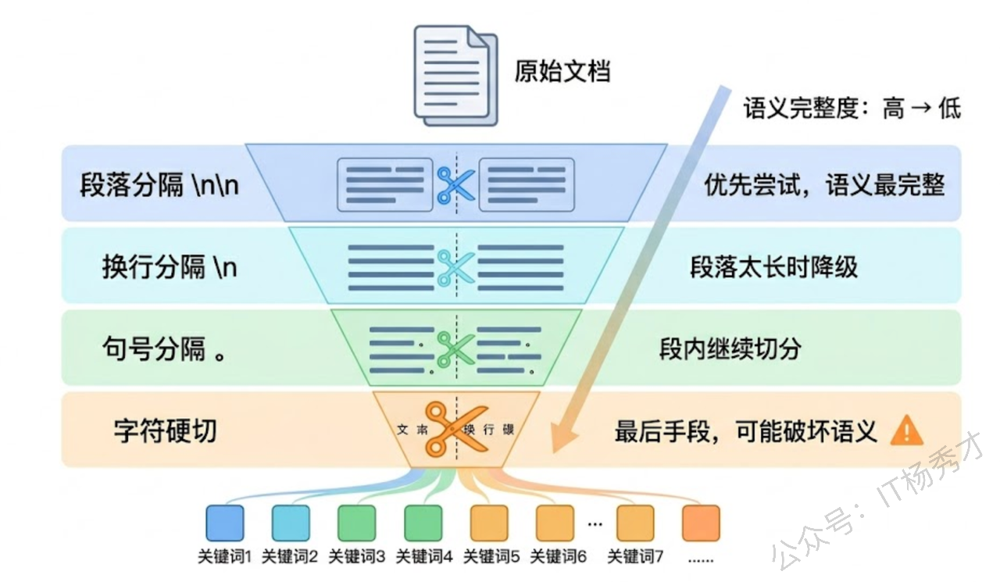
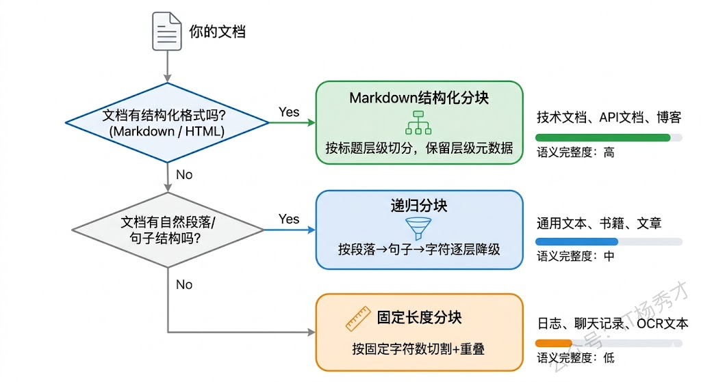
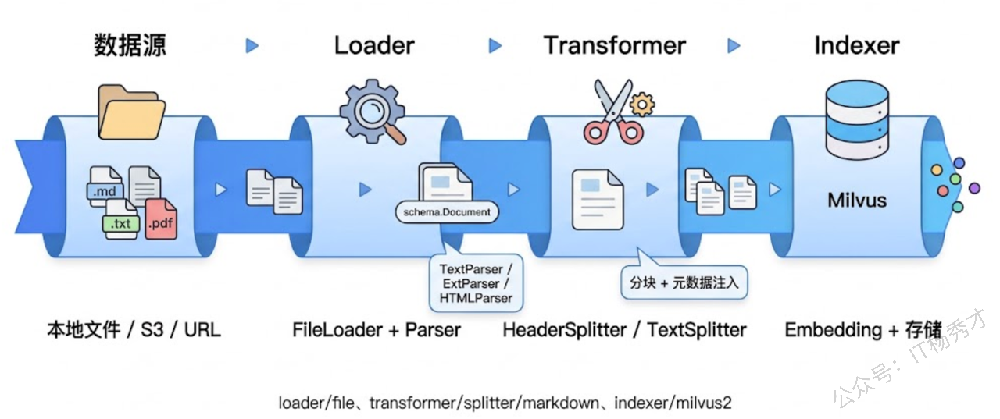
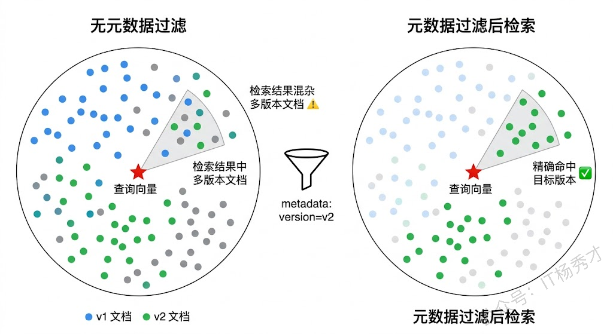

上一篇我们搞定了 Embedding 和向量数据库，RAG 管道的"存"和"检"都通了。但如果你仔细回想一下之前的代码示例，会发现我们每条"文档"都只有一两句话，直接就丢进去做 Embedding 了。现实世界的文档可不是这样的。一篇技术博客几千字，一份产品手册几万字，一个 API 文档可能十几万字。你不可能把一整篇文档直接喂给 Embedding 模型，原因有两个：第一，Embedding 模型有输入长度限制（比如 text-embedding-v3 最大支持 8192 Token）；第二，即使模型能吃下整篇文档，生成的向量也是对全文的"模糊概括"，检索时很难精确匹配到用户关心的具体段落。

所以在 Embedding 之前，还有一个关键步骤——把长文档切成一个个小块（Chunk）。这个过程叫 Chunking，也叫文档分块或者文本分割。别小看这一步，Chunking 策略的好坏直接决定了 RAG 的检索质量。切得太粗，一个 Chunk 里混了好几个主题，检索出来答非所问；切得太细，上下文信息被割裂，模型拿到的参考资料支离破碎，回答也好不到哪去。

这篇文章我们就来系统地解决这个问题。先搞清楚为什么需要 Chunking 以及怎么评估分块质量，然后逐一实现三种主流的分块策略——固定长度分块、递归分块、Markdown 结构化分块，最后用 Eino 框架的 Document Loader 和 Transformer 组件把"文档加载 → 分块 → 元数据提取"串成一条完整的预处理管道。

## **1. 为什么 Chunking 这么重要**

要理解 Chunking 的重要性，得从 RAG 的检索环节说起。用户问一个问题，系统会把问题向量化，然后去向量数据库里找最相似的文档块。注意，找的是"最相似的块"，不是"最相似的文档"。这意味着你的分块方式直接决定了检索的候选集——如果一个关键信息被拆到了两个块里，那这两个块单独拿出来可能都不够完整，检索到了也没法给模型提供有效的参考。

举个具体的例子。假设你有一段关于 Go Channel 的文档：

```plain&#x20;text
Go语言的Channel是goroutine之间通信的桥梁。Channel分为有缓冲和无缓冲两种。
无缓冲Channel在发送和接收时都会阻塞，直到对端准备好。
有缓冲Channel在缓冲区满之前不会阻塞发送操作。
使用select语句可以同时监听多个Channel的读写事件。
```

如果你在第二行中间把它切开，前半块讲了"Channel 是什么 + 无缓冲 Channel"，后半块讲了"有缓冲 Channel + select"。当用户问"Go Channel 有哪些类型"时，前半块只包含无缓冲的信息，后半块只包含有缓冲的信息，两个块各自都不完整。模型拿到其中一个块作为参考，给出的回答就会有遗漏。

但如果你把整段话作为一个块保留，检索到它之后模型就能看到完整的 Channel 类型信息，回答的质量自然高得多。



所以 Chunking 本质上是在做一道平衡题：块太大，语义模糊，检索精度低；块太小，上下文丢失，回答碎片化。理想的分块应该做到每个块语义自包含（讲清楚一件事）、大小适中（既不超出 Embedding 模型的输入限制，也不太短以至于信息量不够）。

那什么样的块大小比较合适？这没有一个放之四海而皆准的答案，但业界有一些经验值可以参考。对于通用的技术文档场景，每个块 200-500 个 Token（大约 300-800 个中文字符）是一个比较好的起点。如果你的文档结构化程度高（比如 Markdown、HTML），可以按标题层级来切，块大小可以更灵活一些。

## **2. 固定长度分块**

固定长度分块是最直观的策略——设定一个最大长度（比如 500 个字符），然后从头到尾按这个长度把文本切成一段一段的。为了避免上下文被硬切断，通常还会设置一个"重叠区"（Overlap），让相邻的两个块之间有一部分内容是重复的。

这种策略的优点是实现简单、行为可预测——你能精确控制每个块的大小，不用担心出现特别大或特别小的块。缺点也很明显：它完全不管语义，可能把一句话从中间劈开，也可能把两个毫不相关的段落拼在一起。

我们先用纯 Go 代码手写一个固定长度分块器，搞清楚原理之后再看 Eino 框架是怎么封装的。

```go
package main

import (
        "fmt"
        "strings"
)

// FixedSplitter 固定长度分块器
type FixedSplitter struct {
        ChunkSize int // 每个块的最大字符数
        Overlap   int // 相邻块之间的重叠字符数
}

// Split 将文本按固定长度分块
func (s *FixedSplitter) Split(text string) []string {
        runes := []rune(text)
        if len(runes) <= s.ChunkSize {
                return []string{text}
        }

        var chunks []string
        start := 0
        for start < len(runes) {
                end := start + s.ChunkSize
                if end > len(runes) {
                        end = len(runes)
                }

                chunk := strings.TrimSpace(string(runes[start:end]))
                if chunk != "" {
                        chunks = append(chunks, chunk)
                }

                // 下一个块的起始位置 = 当前起始 + 块大小 - 重叠
                start += s.ChunkSize - s.Overlap
        }

        return chunks
}

func main() {
        doc := `Go语言的Channel是goroutine之间通信的桥梁。Channel分为有缓冲和无缓冲两种。
无缓冲Channel在发送和接收时都会阻塞，直到对端准备好。这种同步特性使得无缓冲Channel非常适合做goroutine之间的握手信号。
有缓冲Channel在缓冲区满之前不会阻塞发送操作。你可以把它想象成一个固定大小的队列，生产者往里放数据，消费者从里取数据。
使用select语句可以同时监听多个Channel的读写事件，配合default分支还能实现非阻塞的Channel操作。
当所有Channel都没有就绪时，select会随机选择一个可用的case执行。`

        splitter := &FixedSplitter{
                ChunkSize: 80,
                Overlap:   20,
        }

        chunks := splitter.Split(doc)
        for i, chunk := range chunks {
                fmt.Printf("=== 块 %d（%d 字符）===\n%s\n\n", i+1, len([]rune(chunk)), chunk)
        }
}
```

运行结果：

```plain&#x20;text
=== 块 1（80 字符）===
Go语言的Channel是goroutine之间通信的桥梁。Channel分为有缓冲和无缓冲两种。
无缓冲Channel在发送和接收时都会阻塞，直到对端准备好。

=== 块 2（80 字符）===
在发送和接收时都会阻塞，直到对端准备好。这种同步特性使得无缓冲Channel非常适合做goroutine之间的握手信号。
有缓冲Channel在缓冲区满之前不会

=== 块 3（79 字符）===
有缓冲Channel在缓冲区满之前不会阻塞发送操作。你可以把它想象成一个固定大小的队列，生产者往里放数据，消费者从里取数据。
使用select语句可以同时监听

=== 块 4（80 字符）===
数据。
使用select语句可以同时监听多个Channel的读写事件，配合default分支还能实现非阻塞的Channel操作。
当所有Channel都没有就绪

=== 块 5（45 字符）===
l操作。
当所有Channel都没有就绪时，select会随机选择一个可用的case执行。
```

可以看到，固定长度分块确实把文本按 80 个字符一段切开了，每两个相邻块之间有 20 个字符的重叠（你可以对比块 1 的末尾和块 2 的开头，有一部分内容是重复的）。重叠区的作用是保证跨越切割边界的语义信息不会完全丢失——如果某句关键信息恰好在切割点附近，重叠区能让它在前后两个块中都出现一次。

但问题也很明显：块 2 的开头"时都会阻塞"，这半句话从上下文中被撕裂了出来，读起来莫名其妙。块 3 的结尾"消费者从"也是戛然而止。这就是固定长度分块的先天缺陷——它不认识句子边界，不认识段落边界，只认字符数。



## **3. 递归分块**

固定长度分块的核心问题是不尊重文本的自然边界。递归分块就是为了解决这个问题而生的——它不是简单地按字符数切割，而是按照文本的自然结构逐层尝试分割。

递归分块的思路是这样的：你给它一组分隔符，按优先级排列，比如 `["\n\n", "\n", "。", "，", " "]`。它先尝试用最高优先级的分隔符（双换行，也就是段落分隔）来切，如果切出来的块大小合适就直接用。如果某个块切完还是太大，就用下一级分隔符（单换行）继续切。以此类推，直到所有块都在规定的大小范围内。

这个策略的精妙之处在于它尽量按段落切，段落太长就按句子切，句子太长就按逗号切——每一层都优先选择语义最完整的切割方式。只有当所有自然分隔符都用尽了，才退化为按字符硬切。

```go
package main

import (
        "fmt"
        "strings"
)

// RecursiveSplitter 递归分块器
type RecursiveSplitter struct {
        ChunkSize  int      // 每个块的最大字符数
        Overlap    int      // 相邻块之间的重叠字符数
        Separators []string // 分隔符列表，按优先级从高到低排列
}

// Split 递归分块
func (s *RecursiveSplitter) Split(text string) []string {
        return s.splitRecursive(text, 0)
}

func (s *RecursiveSplitter) splitRecursive(text string, sepIdx int) []string {
        runes := []rune(text)
        // 如果文本长度已经在限制内，直接返回
        if len(runes) <= s.ChunkSize {
                trimmed := strings.TrimSpace(text)
                if trimmed == "" {
                        return nil
                }
                return []string{trimmed}
        }

        // 如果所有分隔符都试完了，按字符硬切
        if sepIdx >= len(s.Separators) {
                return s.hardSplit(text)
        }

        sep := s.Separators[sepIdx]
        parts := strings.Split(text, sep)

        var chunks []string
        currentChunk := ""

        for _, part := range parts {
                candidate := currentChunk
                if candidate != "" {
                        candidate += sep
                }
                candidate += part

                if len([]rune(candidate)) <= s.ChunkSize {
                        currentChunk = candidate
                } else {
                        // 先把之前积累的内容作为一个块
                        if currentChunk != "" {
                                chunks = append(chunks, strings.TrimSpace(currentChunk))
                        }
                        // 当前 part 本身可能还是太长，递归用下一级分隔符切
                        if len([]rune(part)) > s.ChunkSize {
                                subChunks := s.splitRecursive(part, sepIdx+1)
                                chunks = append(chunks, subChunks...)
                                currentChunk = ""
                        } else {
                                currentChunk = part
                        }
                }
        }

        if strings.TrimSpace(currentChunk) != "" {
                chunks = append(chunks, strings.TrimSpace(currentChunk))
        }

        return chunks
}

// hardSplit 硬切：当所有分隔符都无法满足时，按字符数切
func (s *RecursiveSplitter) hardSplit(text string) []string {
        runes := []rune(text)
        var chunks []string
        start := 0
        for start < len(runes) {
                end := start + s.ChunkSize
                if end > len(runes) {
                        end = len(runes)
                }
                chunk := strings.TrimSpace(string(runes[start:end]))
                if chunk != "" {
                        chunks = append(chunks, chunk)
                }
                start += s.ChunkSize - s.Overlap
        }
        return chunks
}

func main() {
        doc := `Go语言的Channel是goroutine之间通信的桥梁。Channel分为有缓冲和无缓冲两种。

无缓冲Channel在发送和接收时都会阻塞，直到对端准备好。这种同步特性使得无缓冲Channel非常适合做goroutine之间的握手信号。

有缓冲Channel在缓冲区满之前不会阻塞发送操作。你可以把它想象成一个固定大小的队列，生产者往里放数据，消费者从里取数据。

使用select语句可以同时监听多个Channel的读写事件，配合default分支还能实现非阻塞的Channel操作。当所有Channel都没有就绪时，select会随机选择一个可用的case执行。`

        splitter := &RecursiveSplitter{
                ChunkSize:  100,
                Overlap:    0,
                Separators: []string{"\n\n", "\n", "。", "，", " "},
        }

        chunks := splitter.Split(doc)
        for i, chunk := range chunks {
                fmt.Printf("=== 块 %d（%d 字符）===\n%s\n\n", i+1, len([]rune(chunk)), chunk)
        }
}
```

运行结果：

```plain&#x20;text
=== 块 1（49 字符）===
Go语言的Channel是goroutine之间通信的桥梁。Channel分为有缓冲和无缓冲两种。

=== 块 2（70 字符）===
无缓冲Channel在发送和接收时都会阻塞，直到对端准备好。这种同步特性使得无缓冲Channel非常适合做goroutine之间的握手信号。

=== 块 3（62 字符）===
有缓冲Channel在缓冲区满之前不会阻塞发送操作。你可以把它想象成一个固定大小的队列，生产者往里放数据，消费者从里取数据。

=== 块 4（100 字符）===
使用select语句可以同时监听多个Channel的读写事件，配合default分支还能实现非阻塞的Channel操作。当所有Channel都没有就绪时，select会随机选择一个可用的cas
```

效果好多了。递归分块器优先按段落（双换行 `\n\n`）来切，恰好每个段落都没超过 100 字符的限制，所以就直接按段落分块了。每个块都是一个完整的段落，语义自包含，没有被从中间截断的句子。

如果某个段落特别长超过了 100 字符呢？分块器会自动降级——先按句号切，句号切完还超就按逗号切，最后实在不行才按字符硬切。这就是"递归"的含义：逐层降级、逐层细化，尽最大努力保持语义完整性。



递归分块是目前业界用得最多的通用分块策略。LangChain 的 `RecursiveCharacterTextSplitter` 用的就是这个思路，Eino 框架中也有对应的实现。它在"保持语义完整"和"控制块大小"之间取得了一个不错的平衡，适用于绝大多数纯文本场景。

## **4. Markdown 结构化分块**

如果你的文档是 Markdown 格式（技术文档、API 文档、博客文章大多是 Markdown），还有一种比递归分块更聪明的策略——按 Markdown 的标题层级来分块。

Markdown 文档天然就有清晰的层级结构：`#` 是一级标题，`##` 是二级标题，`###` 是三级标题……每个标题下面的内容通常围绕一个主题展开。按标题切分，每个块天然就是一个语义完整的知识单元。而且标题本身就是这个块内容的摘要，可以作为元数据保留下来，后续检索时很有用。

```go
package main

import (
        "fmt"
        "strings"
)

// MarkdownChunk 一个 Markdown 分块，包含内容和标题层级信息
type MarkdownChunk struct {
        Content  string            // 块内容
        Metadata map[string]string // 元数据（包含各级标题）
}

// MarkdownSplitter 按 Markdown 标题层级分块
type MarkdownSplitter struct {
        Headers []HeaderLevel // 要识别的标题层级
}

// HeaderLevel 标题层级定义
type HeaderLevel struct {
        Prefix string // 标题前缀，如 "##"
        Name   string // 元数据中的 key，如 "h2"
}

// Split 按标题层级分块
func (s *MarkdownSplitter) Split(text string) []MarkdownChunk {
        lines := strings.Split(text, "\n")

        var chunks []MarkdownChunk
        currentHeaders := make(map[string]string) // 当前生效的各级标题
        var currentContent []string

        for _, line := range lines {
                matched := false
                for i, header := range s.Headers {
                        prefix := header.Prefix + " "
                        if strings.HasPrefix(line, prefix) {
                                // 遇到了一个标题行，先把之前积累的内容保存为一个块
                                if len(currentContent) > 0 {
                                        content := strings.TrimSpace(strings.Join(currentContent, "\n"))
                                        if content != "" {
                                                chunks = append(chunks, MarkdownChunk{
                                                        Content:  content,
                                                        Metadata: copyMap(currentHeaders),
                                                })
                                        }
                                        currentContent = nil
                                }

                                // 更新当前标题，并清除所有更低层级的标题
                                titleText := strings.TrimPrefix(line, prefix)
                                currentHeaders[header.Name] = strings.TrimSpace(titleText)
                                for j := i + 1; j < len(s.Headers); j++ {
                                        delete(currentHeaders, s.Headers[j].Name)
                                }

                                matched = true
                                break
                        }
                }

                if !matched {
                        currentContent = append(currentContent, line)
                }
        }

        // 处理最后一段内容
        if len(currentContent) > 0 {
                content := strings.TrimSpace(strings.Join(currentContent, "\n"))
                if content != "" {
                        chunks = append(chunks, MarkdownChunk{
                                Content:  content,
                                Metadata: copyMap(currentHeaders),
                        })
                }
        }

        return chunks
}

func copyMap(m map[string]string) map[string]string {
        cp := make(map[string]string, len(m))
        for k, v := range m {
                cp[k] = v
        }
        return cp
}

func main() {
        doc := `# Go并发编程

## Channel基础

Channel是Go语言中goroutine之间通信的管道。它是类型安全的，一个chan int类型的Channel只能传输int类型的数据。Channel的零值是nil，必须用make函数初始化后才能使用。

## 有缓冲与无缓冲

### 无缓冲Channel

无缓冲Channel的发送和接收操作是同步的。发送方会阻塞，直到接收方从Channel中取走数据。这种特性常被用来做goroutine之间的同步信号。

### 有缓冲Channel

有缓冲Channel内部维护了一个固定大小的队列。只要队列没满，发送操作就不会阻塞。当队列满了之后，发送方会阻塞等待，直到接收方取走一个元素腾出空间。

## Select多路复用

select语句让你可以同时等待多个Channel操作。它的语法和switch很像，但每个case必须是一个Channel的读或写操作。当多个case同时就绪时，Go运行时会随机选择一个执行，这个设计是为了避免饥饿问题。`

        splitter := &MarkdownSplitter{
                Headers: []HeaderLevel{
                        {Prefix: "#", Name: "h1"},
                        {Prefix: "##", Name: "h2"},
                        {Prefix: "###", Name: "h3"},
                },
        }

        chunks := splitter.Split(doc)
        for i, chunk := range chunks {
                fmt.Printf("=== 块 %d ===\n", i+1)
                fmt.Printf("元数据: %v\n", chunk.Metadata)
                fmt.Printf("内容: %s\n\n", chunk.Content)
        }
}
```

运行结果：

```plain&#x20;text
=== 块 1 ===
元数据: map[h1:Go并发编程 h2:Channel基础]
内容: Channel是Go语言中goroutine之间通信的管道。它是类型安全的，一个chan int类型的Channel只能传输int类型的数据。Channel的零值是nil，必须用make函数初始化后才能使用。

=== 块 2 ===
元数据: map[h1:Go并发编程 h2:有缓冲与无缓冲 h3:无缓冲Channel]
内容: 无缓冲Channel的发送和接收操作是同步的。发送方会阻塞，直到接收方从Channel中取走数据。这种特性常被用来做goroutine之间的同步信号。

=== 块 3 ===
元数据: map[h1:Go并发编程 h2:有缓冲与无缓冲 h3:有缓冲Channel]
内容: 有缓冲Channel内部维护了一个固定大小的队列。只要队列没满，发送操作就不会阻塞。当队列满了之后，发送方会阻塞等待，直到接收方取走一个元素腾出空间。

=== 块 4 ===
元数据: map[h1:Go并发编程 h2:Select多路复用]
内容: select语句让你可以同时等待多个Channel操作。它的语法和switch很像，但每个case必须是一个Channel的读或写操作。当多个case同时就绪时，Go运行时会随机选择一个执行，这个设计是为了避免饥饿问题。
```

Markdown 分块的效果非常漂亮。每个块都是一个完整的知识段落，而且自动携带了标题层级元数据。比如块 2 的元数据告诉你，这段内容属于"Go并发编程 > 有缓冲与无缓冲 > 无缓冲Channel"这个层级路径。这个元数据在检索时很有价值——你可以把标题路径和正文内容拼在一起做 Embedding，这样即使正文中没有出现"Channel"这个词，标题中的信息也能帮助提高检索召回率。

不过 Markdown 分块也不是完美的。如果某个标题下面的内容特别长（比如一整节有几千字），这个块就会很大，超出 Embedding 模型的输入限制。实际项目中通常会把 Markdown 分块和递归分块结合使用——先按标题切成大块，如果某个块还是太长，再用递归分块把它切小。

## **5. 三种策略对比**

到这里我们已经实现了三种分块策略，它们各有适用场景，实际选型时需要根据文档特点来决定。

固定长度分块适合那些没有明显结构的纯文本，比如聊天记录、日志文件、OCR 识别出来的扫描件内容。这类文本没有段落、没有标题，用结构化分块也分不出什么有意义的块来，还不如固定长度来得简单可控。

递归分块是最通用的选择。它能处理绝大多数文本格式，通过分隔符的优先级设计兼顾了语义完整性和块大小控制。如果你不确定用什么策略，选递归分块基本不会错。

Markdown 分块专门针对结构化文档。如果你的知识库是 Markdown、HTML 或者 RST 格式的技术文档，优先用结构化分块，效果会比通用的递归分块好很多。原因很简单：文档作者在写的时候就用标题把内容组织成了一个个语义单元，我们只要顺着作者的思路来切就行了。



## **6. 用 Eino 框架构建文档处理管道**

前面我们手写了分块逻辑来理解原理，实际项目中应该用框架封装好的组件来做。Eino 框架把文档处理抽象成了三个核心组件：**Loader**（文档加载）、**Transformer**（文档转换/分块）、**Indexer**（文档入库）。这三个组件串起来就是一条完整的文档预处理管道：从文件系统加载文档 → 分块 → 存入向量数据库。

### **6.1 Eino 的文档处理架构**

Eino 对文档处理的设计遵循了和其他组件一样的接口抽象思路。`Loader` 接口负责从各种数据源（本地文件、S3、Web URL）读取文档，返回标准化的 `[]*schema.Document`。`Transformer` 接口负责对文档做变换——分块是最常见的变换，但也可以做过滤、合并等操作。

```go
// Loader 接口：加载文档
type Loader interface {
    Load(ctx context.Context, src Source, opts ...LoaderOption) ([]*schema.Document, error)
}

// Transformer 接口：转换文档（分块、过滤等）
type Transformer interface {
    Transform(ctx context.Context, src []*schema.Document, opts ...TransformerOption) ([]*schema.Document, error)
}
```

`Loader` 的实现通过 Parser（解析器）来处理不同格式的文件。Eino 内置了 `TextParser`（纯文本）和 `ExtParser`（根据文件扩展名自动选择解析器），`eino-ext` 扩展包还提供了 HTML、PDF 等格式的解析器。

`Transformer` 的实现中与分块相关的有三种：`markdown.HeaderSplitter`（按 Markdown 标题分块）、文本分块器（按长度或分隔符分块）、以及文档过滤器。我们前面手写的三种分块策略，在 Eino 中都有对应的封装。



### **6.2 完整代码示例**

下面用 Eino 的 FileLoader 和 Markdown HeaderSplitter 构建一条完整的文档处理管道。我们会从本地文件加载一个 Markdown 文档，按标题分块，给每个块注入元数据，最后打印出分块结果。

先准备一个测试用的 Markdown 文件。在项目目录下创建 `testdata/go_channel.md`：

```markdown
# Go Channel 完全指南

## 什么是Channel

Channel是Go语言中用于goroutine间通信的核心机制。它基于CSP（Communicating Sequential Processes）理论设计，提供了一种类型安全的数据传输通道。Channel的设计哲学是"不要通过共享内存来通信，而要通过通信来共享内存"。

## Channel的创建与使用

### 声明与初始化

Channel使用make函数创建，语法为make(chan Type, bufferSize)。第二个参数是可选的，指定缓冲区大小。不指定缓冲区大小时创建的是无缓冲Channel。Channel的零值是nil，向nil Channel发送或接收数据会永久阻塞。

### 发送与接收

使用<-操作符进行Channel的发送和接收。ch <- value是发送操作，value := <-ch是接收操作。Channel支持单向声明：chan<- int表示只能发送，<-chan int表示只能接收。这种单向Channel常用于函数参数，限制调用方的操作权限。

## Select多路复用

select语句允许goroutine同时等待多个Channel操作。每个case分支对应一个Channel的读或写操作。当多个case同时满足条件时，Go运行时会随机选择一个执行。加上default分支可以实现非阻塞的Channel操作，常用于实现超时控制和定时任务。
```

项目需要安装以下依赖：

```bash
go get github.com/cloudwego/eino@latest
go get github.com/cloudwego/eino-ext/components/document/loader/file@latest
go get github.com/cloudwego/eino-ext/components/document/transformer/splitter/markdown@latest
```

```go
package main

import (
        "context"
        "fmt"
        "log"

        "github.com/cloudwego/eino-ext/components/document/loader/file"
        "github.com/cloudwego/eino-ext/components/document/transformer/splitter/markdown"
        "github.com/cloudwego/eino/components/document"
        "github.com/cloudwego/eino/components/document/parser"
)

func main() {
        ctx := context.Background()

        // ====== 1. 创建 FileLoader ======
        loader, err := file.NewFileLoader(ctx, &file.FileLoaderConfig{
                UseNameAsID: true,
                Parser:      &parser.TextParser{},
        })
        if err != nil {
                log.Fatalf("创建 FileLoader 失败: %v", err)
        }

        // ====== 2. 加载文档 ======
        docs, err := loader.Load(ctx, document.Source{
                URI: "testdata/go_channel.md",
        })
        if err != nil {
                log.Fatalf("加载文档失败: %v", err)
        }
        fmt.Printf("✅ 加载了 %d 篇文档，内容长度: %d 字符\n\n", len(docs), len([]rune(docs[0].Content)))

        // ====== 3. 创建 Markdown HeaderSplitter ======
        splitter, err := markdown.NewHeaderSplitter(ctx, &markdown.HeaderConfig{
                Headers: map[string]string{
                        "#":   "h1",
                        "##":  "h2",
                        "###": "h3",
                },
        })
        if err != nil {
                log.Fatalf("创建 Splitter 失败: %v", err)
        }

        // ====== 4. 执行分块 ======
        chunks, err := splitter.Transform(ctx, docs)
        if err != nil {
                log.Fatalf("分块失败: %v", err)
        }

        fmt.Printf("✅ 分块完成，共 %d 个块\n\n", len(chunks))

        // ====== 5. 查看分块结果 ======
        for i, chunk := range chunks {
                fmt.Printf("=== 块 %d ===\n", i+1)

                // 打印元数据中的标题层级
                if h1, ok := chunk.MetaData["h1"]; ok {
                        fmt.Printf("  H1: %v\n", h1)
                }
                if h2, ok := chunk.MetaData["h2"]; ok {
                        fmt.Printf("  H2: %v\n", h2)
                }
                if h3, ok := chunk.MetaData["h3"]; ok {
                        fmt.Printf("  H3: %v\n", h3)
                }

                // 截取前 80 个字符显示
                content := []rune(chunk.Content)
                preview := string(content)
                if len(content) > 80 {
                        preview = string(content[:80]) + "..."
                }
                fmt.Printf("  内容: %s\n", preview)
                fmt.Printf("  字符数: %d\n\n", len(content))
        }
}
```

运行结果：

```plain&#x20;text
✅ 加载了 1 篇文档，内容长度: 635 字符

✅ 分块完成，共 6 个块

=== 块 1 ===
  H1: Go Channel 完全指南
  内容: # Go Channel 完全指南
  字符数: 17

=== 块 2 ===
  H1: Go Channel 完全指南
  H2: 什么是Channel
  内容: ## 什么是Channel
Channel是Go语言中用于goroutine间通信的核心机制。它基于CSP（Communicating Sequential P...
  字符数: 150

=== 块 3 ===
  H1: Go Channel 完全指南
  H2: Channel的创建与使用
  内容: ## Channel的创建与使用
  字符数: 16

=== 块 4 ===
  H1: Go Channel 完全指南
  H2: Channel的创建与使用
  H3: 声明与初始化
  内容: ### 声明与初始化
Channel使用make函数创建，语法为make(chan Type, bufferSize)。第二个参数是可选的，指定缓冲区大小。不指...
  字符数: 142

=== 块 5 ===
  H1: Go Channel 完全指南
  H2: Channel的创建与使用
  H3: 发送与接收
  内容: ### 发送与接收
使用<-操作符进行Channel的发送和接收。ch <- value是发送操作，value := <-ch是接收操作。Channel支持单向...
  字符数: 147

=== 块 6 ===
  H1: Go Channel 完全指南
  H2: Select多路复用
  内容: ## Select多路复用
select语句允许goroutine同时等待多个Channel操作。每个case分支对应一个Channel的读或写操作。当多个ca...
  字符数: 149
```

Eino 的 FileLoader + HeaderSplitter 组合用起来非常简洁。`FileLoader` 接收一个文件路径，通过 `TextParser` 把文件内容读取成 `schema.Document`。`HeaderSplitter` 接收一个标题层级映射（`#` 对应 `h1`，`##` 对应 `h2`），按标题切分后自动把标题信息写入每个块的 `MetaData`。

### **6.3 结合 Indexer 存入向量数据库**

分块完成后，下一步就是把块存入向量数据库。这一步我们在上一篇已经很熟悉了——用 Eino 的 Indexer 组件，一行 `Store` 搞定。把 Loader → Splitter → Indexer 串起来，就是一条完整的 RAG 数据预处理管道。

```go
package main

import (
    "context"
    "fmt"
    "log"
    "os"

    "github.com/cloudwego/eino-ext/components/document/loader/file"
    "github.com/cloudwego/eino-ext/components/document/transformer/splitter/markdown"
    einoOpenAI "github.com/cloudwego/eino-ext/components/embedding/openai"
    einoIndexer "github.com/cloudwego/eino-ext/components/indexer/milvus2"
    "github.com/cloudwego/eino/components/document"
    "github.com/cloudwego/eino/components/document/parser"
    "github.com/milvus-io/milvus/client/v2/milvusclient"
)

func main() {
    ctx := context.Background()

    // ====== 1. 加载文档 ======
    loader, err := file.NewFileLoader(ctx, &file.FileLoaderConfig{
       UseNameAsID: true,
       Parser:      &parser.TextParser{},
    })
    if err != nil {
       log.Fatalf("创建 FileLoader 失败: %v", err)
    }

    docs, err := loader.Load(ctx, document.Source{URI: "testdata/go_channel.md"})
    if err != nil {
       log.Fatalf("加载文档失败: %v", err)
    }
    fmt.Printf("✅ 加载了 %d 篇文档\n", len(docs))

    // ====== 2. Markdown 分块 ======
    splitter, err := markdown.NewHeaderSplitter(ctx, &markdown.HeaderConfig{
       Headers: map[string]string{
          "#":   "h1",
          "##":  "h2",
          "###": "h3",
       },
    })
    if err != nil {
       log.Fatalf("创建 Splitter 失败: %v", err)
    }

    chunks, err := splitter.Transform(ctx, docs)
    if err != nil {
       log.Fatalf("分块失败: %v", err)
    }
    fmt.Printf("✅ 分块完成，共 %d 个块\n", len(chunks))

    // 把标题信息拼接到内容前面，提高检索效果
    for _, chunk := range chunks {
       var titlePrefix string
       if h1, ok := chunk.MetaData["h1"].(string); ok {
          titlePrefix += h1
       }
       if h2, ok := chunk.MetaData["h2"].(string); ok {
          titlePrefix += " > " + h2
       }
       if h3, ok := chunk.MetaData["h3"].(string); ok {
          titlePrefix += " > " + h3
       }
       if titlePrefix != "" {
          chunk.Content = titlePrefix + "\n\n" + chunk.Content
       }
    }

    // ====== 3. 初始化 Embedding ======
    dim := 1024
    embedder, err := einoOpenAI.NewEmbedder(ctx, &einoOpenAI.EmbeddingConfig{
       APIKey:     os.Getenv("DASHSCOPE_API_KEY"),
       BaseURL:    "https://dashscope.aliyuncs.com/compatible-mode/v1",
       Model:      "text-embedding-v3",
       Dimensions: &dim,
    })
    if err != nil {
       log.Fatalf("创建 Embedder 失败: %v", err)
    }

    // ====== 4. 存入向量数据库 ======
    indexer, err := einoIndexer.NewIndexer(ctx, &einoIndexer.IndexerConfig{
       ClientConfig: &milvusclient.ClientConfig{Address: "localhost:19530"},
       Collection: "go_docs_chunked",
       Vector: &einoIndexer.VectorConfig{
          Dimension:    1024,
          MetricType:   einoIndexer.COSINE,
          IndexBuilder: einoIndexer.NewHNSWIndexBuilder().WithM(16).WithEfConstruction(200),
       },
       Embedding: embedder,
    })
    if err != nil {
       log.Fatalf("创建 Indexer 失败: %v", err)
    }

    ids, err := indexer.Store(ctx, chunks)
    if err != nil {
       log.Fatalf("存储失败: %v", err)
    }
    fmt.Printf("✅ 成功存入 %d 个文档块，ID: %v\n", len(ids), ids)
}
```

运行结果：

```plain&#x20;text
✅ 加载了 1 篇文档
✅ 分块完成，共 6 个块
✅ 成功存入 6 个文档块，ID: [go_channel.md go_channel.md go_channel.md go_channel.md go_channel.md go_channel.md]
```

代码中有一个值得注意的技巧：在存入向量数据库之前，我们把标题层级路径拼接到了内容前面（比如"Go Channel 完全指南 > Channel的创建与使用 > 声明与初始化"），然后整体做 Embedding。这样做的好处是 Embedding 向量不仅编码了正文内容的语义，还编码了标题上下文的语义。当用户搜索"Channel 怎么初始化"时，即使某个块的正文中恰好没有"初始化"这个词，标题层级路径中的"声明与初始化"也能帮助提高这个块的匹配分数。这是一个简单但非常实用的检索优化手段。

## **7. 分块的实践技巧**

在实际项目中做 Chunking，除了选对策略，还有一些细节会影响最终的检索效果。

### **7.1 块大小的选择**

块大小是影响 RAG 效果的最关键参数之一。块太大，Embedding 向量会过于"泛化"，失去对具体细节的区分能力，而且检索出来的大块文本中可能只有一小部分是相关的，剩下的都是噪声。块太小，上下文信息不完整，模型看到的是零碎的片段，回答质量也上不去。

一个经验法则是从 300-500 个 Token 开始调。如果你发现检索结果经常"答非所问"（检索到的块和查询相关但不够精确），说明块太大了，应该减小。如果发现检索到的块信息太少、模型经常说"信息不足"，说明块太小了，应该增大。实际调优时最好准备一组测试 Query，分别用不同的块大小做分块，然后对比检索结果的相关性。

### **7.2 重叠区的设置**

重叠区（Overlap）是固定长度分块和递归分块都会用到的参数。它的作用是让跨越切割边界的信息在前后两个块中都出现，减少信息丢失。

重叠区通常设置为块大小的 10%-20%。比如块大小是 500 个字符，重叠区可以设为 50-100 个字符。设太小了没什么效果，设太大了会导致大量内容重复，既浪费存储空间也会影响检索结果（同一段信息在多个块中出现，可能导致检索结果中出现大量高度相似的块）。

### **7.3 元数据的价值**

分块时注入的元数据在检索和回答阶段都很有价值。除了标题层级信息之外，常见的有用元数据包括：文档来源（哪个文件、哪个 URL）、文档类型（技术文档、FAQ、公告等）、创建或更新时间、所属产品或模块。

这些元数据在检索时可以用来做过滤。比如用户问"v2 版本的部署流程"，你可以先用元数据过滤出 version=v2 的文档块，再做语义检索，比在全量文档中检索准确得多。Milvus 等向量数据库都支持在向量检索的同时做标量过滤，Eino 的 Retriever 也支持传入过滤条件。



### **7.4 混合分块策略**

实际项目中的知识库往往不是只有一种格式的文档。你可能同时有 Markdown 写的技术文档、纯文本的 FAQ、JSON 格式的 API 文档、甚至 PDF 扫描件。对不同格式的文档使用不同的分块策略，效果会比"一刀切"好很多。

一个实用的做法是写一个分块调度器，根据文件扩展名或文档的 MIME 类型自动选择分块策略：

```go
func chunkDocument(ctx context.Context, doc *schema.Document) ([]*schema.Document, error) {
        source := doc.MetaData["source"].(string)

        switch {
        case strings.HasSuffix(source, ".md"):
                // Markdown 文档用标题分块
                splitter, _ := markdown.NewHeaderSplitter(ctx, &markdown.HeaderConfig{
                        Headers: map[string]string{"##": "h2", "###": "h3"},
                })
                return splitter.Transform(ctx, []*schema.Document{doc})

        default:
                // 其他文档用递归分块
                // 使用自定义的递归分块器或 Eino 的文本分块组件
                return recursiveSplit(doc, 500, 50), nil
        }
}
```

这段代码展示的是思路而不是完整实现——实际使用时你需要根据自己知识库的文档类型来设计分块调度逻辑。核心思想是：了解你的数据，针对不同类型的数据选择最适合的分块方式。

## **8. 小结**

Chunking 这件事看起来不起眼，但它是 RAG 管道中真正决定检索质量的那个环节。一个好的分块策略让每个文档块都是一个语义完整、大小适中的知识单元，检索时能精确匹配到用户需要的信息；一个糟糕的分块策略会把有用的信息撕碎或者和无关内容混在一起，后面的 Embedding 和检索做得再好也没用。

三种分块策略——固定长度、递归分块、Markdown 结构化分块——不是互相替代的关系，而是各有适用场景。选策略的关键是看你的文档长什么样：有标题层级的用结构化分块，有段落结构的用递归分块，什么结构都没有的才用固定长度兜底。实际项目中往往需要混合使用，甚至在结构化分块之后再套一层递归分块处理过长的段落。块大小、重叠区、元数据注入这些参数没有标准答案，需要你根据实际的文档特点和测试 Query 来调优。RAG 的效果调优本质上是一个工程问题，而 Chunking 是这个工程问题中最值得花时间的第一步。

<div style="background-color: #f0f9eb; padding: 10px 15px; border-radius: 4px; border-left: 5px solid #67c23a; margin: 20px 0; color:rgb(64, 147, 255);">

<span style="color: #006400; font-size: 28px;"><strong>关注秀才公众号：</strong></span><span style="color: red; font-size: 28px;"><strong>IT杨秀才</strong></span><span style="color: #006400; font-size: 28px;"><strong>，回复：</strong></span><span style="color: red; font-size: 28px;"><strong>面试</strong></span>

<div style="text-align: center;"><span style="color: #006400; font-size: 28px;"><strong>领取后端/AI面试题库PDF</strong></span></div>


</div> 

