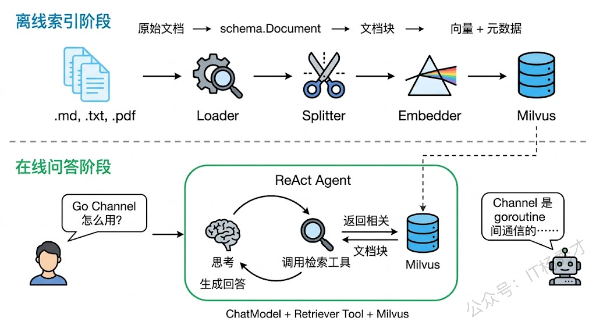
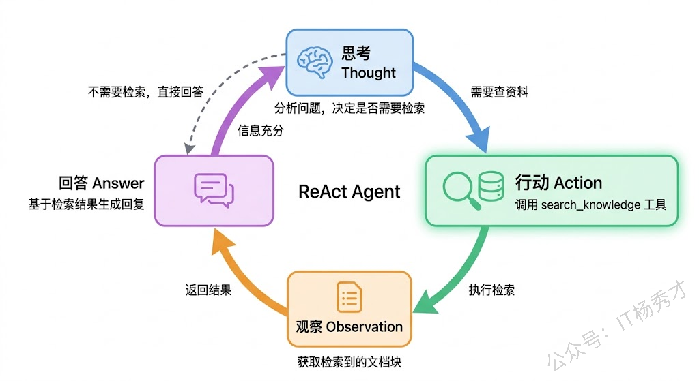
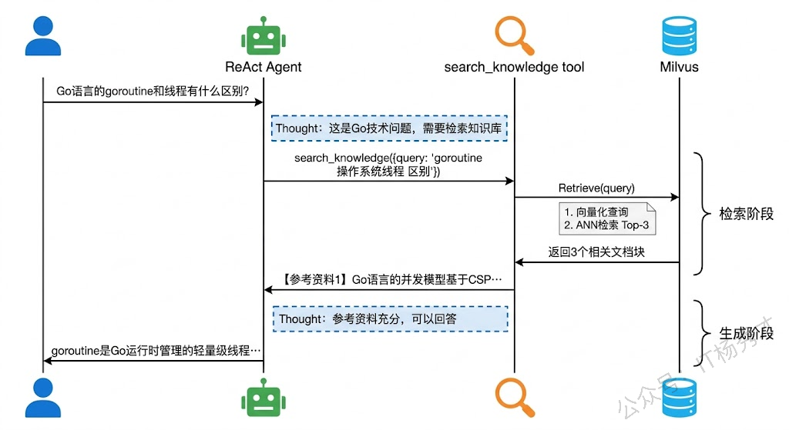
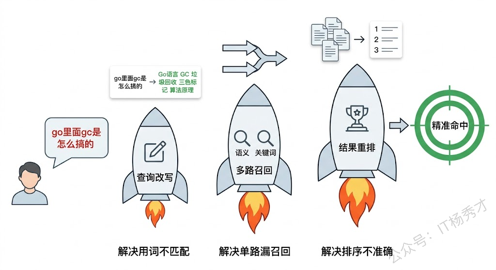
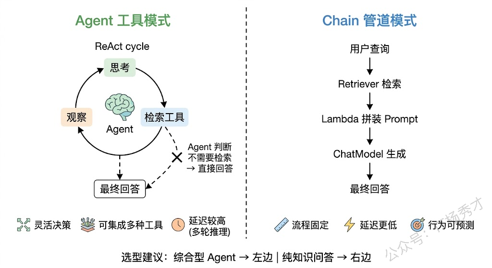

前面三篇文章我们分别搞定了 RAG 的三大基础模块：理解了 RAG 的原理和架构，学会了用 Embedding 和 Milvus 做语义检索，掌握了文档分块的各种策略。但这些模块到目前为止都是各自为战——你得手动写代码把文档灌进向量数据库，手动调 Retriever 检索，手动拼 Prompt 再调模型生成回答。这整个过程如果都是人在串联，那就只是一个"RAG 脚本"，不是一个"RAG Agent"。

这篇文章要做的事情，就是把前面学到的所有零件组装成一个真正的 RAG Agent。我们会用 Eino 框架把文档处理、向量存储、语义检索和大模型问答串成一条完整的管道，然后把检索能力封装成 Agent 工具，让 ReAct Agent 自己决定什么时候需要查知识库、查什么、查到的信息怎么用。最终的效果是：你给 Agent 一个问题，它自动去知识库里找资料，带着资料回答你，整个过程不需要你操心。

## **1. RAG Agent 的整体架构**

在动手写代码之前，先在脑子里把整个系统的架构理清楚。一个完整的 RAG Agent 系统分为两个阶段：**离线索引阶段**和**在线问答阶段**。

离线索引阶段是提前做好的数据准备工作。你把知识库的原始文档（Markdown、文本文件等）通过 Loader 加载进来，用 Splitter 切成合适大小的块，然后通过 Indexer 把这些块向量化并存入 Milvus。这个阶段可能跑一次就够了，或者在知识库更新时重新跑一遍，它不参与实时的用户交互。

在线问答阶段是用户提问时实时执行的。用户问了一个问题，ReAct Agent 接收到问题后判断需要查知识库，于是调用检索工具。检索工具在后台调 Retriever 从 Milvus 中找到最相关的文档块，把这些块的内容返回给 Agent。Agent 拿到检索结果后，把它们和用户问题一起组织成 Prompt，交给大模型生成最终的回答。



这个架构设计的核心思想是**关注点分离**。离线阶段专注于数据质量——文档怎么切、向量怎么存，这些决定了检索效果的上限。在线阶段专注于智能决策——Agent 什么时候检索、检索结果怎么用，这些决定了回答质量的下限。两个阶段各司其职，通过向量数据库这个"中间件"连接起来。

接下来我们就按照这个架构，一步一步地把代码写出来。

## **2. 搭建知识库索引管道**

第一步是离线索引——把知识库文档处理好存进 Milvus。这部分用到的组件在前两篇文章里都详细讲过了，这里我们把它们串成一条完整的管道，并且把知识库内容换成更贴近实际的技术文档。

### **2.1 准备知识库文档**

为了让示例足够贴近真实场景，我们准备一份关于 Go 语言核心特性的知识库文档。在项目目录下创建 `testdata/go_knowledge.md`：

```markdown
# Go语言核心知识库

## Goroutine与并发

Go语言的并发模型基于CSP（Communicating Sequential Processes）理论。goroutine是Go运行时管理的轻量级线程，创建一个goroutine只需要大约2KB的栈空间，而操作系统线程通常需要1-8MB。goroutine的调度由Go运行时的GMP调度器负责，G代表goroutine，M代表操作系统线程，P代表逻辑处理器。调度器会把大量的goroutine复用到少量的操作系统线程上执行，实现了高效的并发。启动一个goroutine非常简单，只需要在函数调用前加上go关键字。

## Channel通信

Channel是goroutine之间通信的管道，它是类型安全的。Go语言的设计哲学是"不要通过共享内存来通信，而要通过通信来共享内存"。Channel分为无缓冲Channel和有缓冲Channel两种。无缓冲Channel的发送和接收操作是同步的，发送方会阻塞直到接收方准备好；有缓冲Channel内部有一个队列，只要队列没满发送就不会阻塞。使用select语句可以同时监听多个Channel的读写事件。Channel在关闭后仍然可以读取，读取到的是零值，可以通过v, ok := <-ch的方式判断Channel是否已关闭。

## 接口与多态

Go语言的接口是隐式实现的，不需要像Java那样显式声明implements。只要一个类型实现了接口定义的所有方法，它就自动满足该接口。这种设计让Go的接口非常灵活——你可以为第三方库的类型定义新接口，而不需要修改它的源代码。空接口interface{}（Go 1.18之后可以写成any）可以接收任何类型的值，常用于需要处理未知类型的场景。接口的底层实现由两个指针组成：一个指向类型信息（itab），一个指向实际数据。

## 错误处理

Go语言采用显式的错误返回机制，函数通过返回error类型的值来表示执行是否成功。这和Java/Python的try-catch异常机制完全不同。Go社区推崇"errors are values"的理念，把错误当作普通的值来传递和处理。errors.New和fmt.Errorf用于创建错误，errors.Is用于判断错误链中是否包含特定错误，errors.As用于从错误链中提取特定类型的错误。Go 1.13引入的%w格式化动词可以包装错误，形成错误链，方便在上层代码中追溯根因。panic/recover机制用于处理真正不可恢复的异常情况，不应该用于常规的错误处理。

## Context上下文

context包是Go并发编程中不可或缺的组件。它的核心作用是在goroutine之间传递取消信号、超时控制和请求级别的值。context.Background()和context.TODO()是两个根Context。context.WithCancel创建一个可以手动取消的Context，context.WithTimeout和context.WithDeadline创建带超时的Context，context.WithValue在Context中存储键值对。Context的设计原则是：它应该作为函数的第一个参数传递，不应该存储在结构体中；Context的取消是级联的，父Context取消后所有子Context也会被取消。在HTTP服务、数据库操作、RPC调用等场景中，Context是控制超时和取消的标准方式。

## Go Module依赖管理

Go Module是Go官方的依赖管理方案，从Go 1.11开始引入，Go 1.16成为默认模式。go.mod文件记录了模块路径和所有依赖的版本号，go.sum文件保存了每个依赖的哈希校验值，用于验证依赖的完整性。go mod init初始化一个新模块，go mod tidy自动添加缺失的依赖并移除不需要的依赖，go get用于添加或更新特定依赖。Go Module采用语义化版本控制（Semantic Versioning），v2及以上的大版本需要在模块路径中加上版本后缀。replace指令可以用本地路径替代远程依赖，常用于本地开发调试。

## GC垃圾回收

Go语言的垃圾回收器采用并发的三色标记清除算法。三种颜色分别代表：白色是未被扫描的对象（GC结束后会被回收），灰色是已被扫描但其引用的对象还未全部扫描的对象，黑色是已被扫描且其引用的对象也已全部扫描的对象。GC的触发条件包括：堆内存增长达到GOGC设定的比例（默认100%，即翻倍时触发）、手动调用runtime.GC()、或者距离上次GC超过2分钟。从Go 1.5开始，GC的STW（Stop The World）时间已经控制在毫秒级。Go 1.19引入了GOMEMLIMIT环境变量，可以设置软内存上限来更精细地控制GC行为。
```

这份文档覆盖了 Go 语言的 7 个核心知识点，每个知识点都有足够的细节，后面测试检索效果时可以用各种角度的问题来验证。

### **2.2 索引管道代码**

下面这段代码实现了完整的离线索引管道：加载文档 → Markdown 分块 → 标题注入 → 存入 Milvus。

项目结构：

```plain&#x20;text
rag_agent/
├── index/
│   └── main.go          // 离线索引管道
├── agent/
│   └── main.go          // RAG Agent（下一节实现）
├── testdata/
│   └── go_knowledge.md  // 知识库文档
└── go.mod
```

项目需要安装以下依赖：

```bash
go get github.com/cloudwego/eino@latest
go get github.com/cloudwego/eino-ext/components/model/openai@latest
go get github.com/cloudwego/eino-ext/components/embedding/openai@latest
go get github.com/cloudwego/eino-ext/components/indexer/milvus2@latest
go get github.com/cloudwego/eino-ext/components/retriever/milvus2@latest
go get github.com/cloudwego/eino-ext/components/document/loader/file@latest
go get github.com/cloudwego/eino-ext/components/document/transformer/splitter/markdown@latest
```

同时确保 Milvus 已经启动（参照第24篇的 Docker 启动方式），以及 `DASHSCOPE_API_KEY` 环境变量已配置。然后在index/main.go编辑如下代码

```go
// index/main.go
package main

import (
    "context"
    "fmt"
    "log"
    "os"

    "github.com/cloudwego/eino-ext/components/document/loader/file"
    "github.com/cloudwego/eino-ext/components/document/transformer/splitter/markdown"
    einoOpenAI "github.com/cloudwego/eino-ext/components/embedding/openai"
    einoIndexer "github.com/cloudwego/eino-ext/components/indexer/milvus2"
    "github.com/cloudwego/eino/components/document"
    "github.com/cloudwego/eino/components/document/parser"
    "github.com/milvus-io/milvus/client/v2/milvusclient"
)

const (
    collectionName = "go_knowledge_rag"
    embeddingDim   = 1024
)

func main() {
    ctx := context.Background()

    // ====== 1. 加载文档 ======
    loader, err := file.NewFileLoader(ctx, &file.FileLoaderConfig{
       UseNameAsID: true,
       Parser:      &parser.TextParser{},
    })
    if err != nil {
       log.Fatalf("创建 FileLoader 失败: %v", err)
    }

    docs, err := loader.Load(ctx, document.Source{URI: "testdata/go_knowledge.md"})
    if err != nil {
       log.Fatalf("加载文档失败: %v", err)
    }
    fmt.Printf("✅ 加载了 %d 篇文档，总长度: %d 字符\n", len(docs), len([]rune(docs[0].Content)))

    // ====== 2. Markdown 分块 ======
    splitter, err := markdown.NewHeaderSplitter(ctx, &markdown.HeaderConfig{
       Headers: map[string]string{
          "#":  "h1",
          "##": "h2",
       },
    })
    if err != nil {
       log.Fatalf("创建 Splitter 失败: %v", err)
    }

    chunks, err := splitter.Transform(ctx, docs)
    if err != nil {
       log.Fatalf("分块失败: %v", err)
    }
    fmt.Printf("✅ 分块完成，共 %d 个块\n", len(chunks))

    // 将标题信息拼接到内容前面，提升检索效果
    for _, chunk := range chunks {
       var titlePrefix string
       if h1, ok := chunk.MetaData["h1"].(string); ok {
          titlePrefix += h1
       }
       if h2, ok := chunk.MetaData["h2"].(string); ok {
          titlePrefix += " > " + h2
       }
       if titlePrefix != "" {
          chunk.Content = titlePrefix + "\n\n" + chunk.Content
       }
    }

    // 打印分块结果预览
    for i, chunk := range chunks {
       content := []rune(chunk.Content)
       preview := string(content)
       if len(content) > 60 {
          preview = string(content[:60]) + "..."
       }
       fmt.Printf("  块 %d: %s\n", i+1, preview)
    }

    // ====== 3. 初始化 Embedding ======
    dim := embeddingDim
    embedder, err := einoOpenAI.NewEmbedder(ctx, &einoOpenAI.EmbeddingConfig{
       APIKey:     os.Getenv("DASHSCOPE_API_KEY"),
       BaseURL:    "https://dashscope.aliyuncs.com/compatible-mode/v1",
       Model:      "text-embedding-v3",
       Dimensions: &dim,
    })
    if err != nil {
       log.Fatalf("创建 Embedder 失败: %v", err)
    }

    // ====== 4. 存入 Milvus ======
    indexer, err := einoIndexer.NewIndexer(ctx, &einoIndexer.IndexerConfig{
       ClientConfig: &milvusclient.ClientConfig{Address: "localhost:19530"},
       Collection:   collectionName,
       Vector: &einoIndexer.VectorConfig{
          Dimension:    embeddingDim,
          MetricType:   einoIndexer.COSINE,
          IndexBuilder: einoIndexer.NewHNSWIndexBuilder().WithM(16).WithEfConstruction(200),
       },
       Embedding: embedder,
    })
    if err != nil {
       log.Fatalf("创建 Indexer 失败: %v", err)
    }

    ids, err := indexer.Store(ctx, chunks)
    if err != nil {
       log.Fatalf("存储文档失败: %v", err)
    }
    fmt.Printf("\n✅ 成功存入 %d 个文档块到 Milvus，Collection: %s\n", len(ids), collectionName)
    fmt.Println("索引构建完成，可以启动 RAG Agent 了！")
}
```

运行结果：

```plain&#x20;text
✅ 加载了 1 篇文档，总长度: 2032 字符
✅ 分块完成，共 8 个块
  块 1: Go语言核心知识库

# Go语言核心知识库
  块 2: Go语言核心知识库 > Goroutine与并发

## Goroutine与并发
Go语言的并发模型基于CSP（Com...
  块 3: Go语言核心知识库 > Channel通信

## Channel通信
Channel是goroutine之间通信的管道...
  块 4: Go语言核心知识库 > 接口与多态

## 接口与多态
Go语言的接口是隐式实现的，不需要像Java那样显式声明impl...
  块 5: Go语言核心知识库 > 错误处理

## 错误处理
Go语言采用显式的错误返回机制，函数通过返回error类型的值来表示...
  块 6: Go语言核心知识库 > Context上下文

## Context上下文
context包是Go并发编程中不可或缺的组...
  块 7: Go语言核心知识库 > Go Module依赖管理

## Go Module依赖管理
Go Module是Go官方的依...
  块 8: Go语言核心知识库 > GC垃圾回收

## GC垃圾回收
Go语言的垃圾回收器采用并发的三色标记清除算法。三种颜色分别...

✅ 成功存入 8 个文档块到 Milvus，Collection: go_knowledge_rag
索引构建完成，可以启动 RAG Agent 了！
```

这段代码的逻辑和前两篇文章的内容完全一致，只不过这次我们把整个管道串在了一起。Markdown 分块器按二级标题（`##`）切分，每个 Go 知识点恰好是一个独立的块。标题路径拼接到内容前面这个技巧，我们在上一篇里讲过了——它能显著提升检索的召回率。

## **3. 将检索封装为 Agent 工具**

知识库建好了，接下来要解决一个关键问题：怎么让 ReAct Agent 用上这个知识库？

回忆一下 Eino 入门篇里讲的工具定义——Agent 通过 Function Calling 机制调用工具，每个工具需要有名字、描述、参数定义和执行函数。我们要做的，就是把"从 Milvus 检索文档"这件事包装成一个 Agent 工具。Agent 判断需要查知识库时，调用这个工具，工具内部执行向量检索，把检索到的文档内容返回给 Agent。

这里有一个设计上的取舍值得聊一聊。你可能会问：为什么不直接在 Prompt 里塞进所有知识库内容，而要用工具调用的方式？原因有两个。第一，知识库可能很大，全塞进 Prompt 会超出上下文窗口限制，而且大量无关信息会干扰模型的注意力（还记得"Lost in the Middle"问题吗）。第二，用工具的方式更灵活——Agent 可以根据问题的性质决定是否需要检索，对于不需要查资料就能回答的问题（比如"1+1等于几"），它可以直接回答，省掉不必要的检索开销。



工具的代码实现如下：

```go
// 知识库检索请求参数
type SearchRequest struct {
        Query string `json:"query" jsonschema:"description=用于检索知识库的查询文本"`
}

// 知识库检索结果
type SearchResponse struct {
        Results string `json:"results"`
        Count   int    `json:"count"`
}
```

这两个结构体定义了工具的输入和输出。`SearchRequest` 很简单，只有一个 `Query` 字段——Agent 把它想搜的问题填进去就行。`SearchResponse` 返回检索到的文档内容和数量。注意 `jsonschema` 标签，它会被 Eino 解析后告诉大模型这个参数是干什么的，模型才知道怎么填。

工具的核心执行逻辑是调用 Retriever 做检索，然后把结果拼成一段文本返回。为什么要拼成文本？因为 Agent 工具的返回值最终会被序列化成字符串塞进消息里给大模型看，大模型看到的是文本，不是 Go 的结构体。

## **4. 构建完整的 RAG Agent**

现在进入最激动人心的环节——把所有组件组装起来，构建一个完整的 RAG Agent。这个 Agent 能接收用户的自然语言问题，自动决定是否需要检索知识库，检索到相关文档后基于这些文档给出准确的回答。

在agent/main.go编辑如下代码

```go
// agent/main.go
package main

import (
        "context"
        "fmt"
        "log"
        "os"
        "strings"

        einoOpenAI "github.com/cloudwego/eino-ext/components/embedding/openai"
        "github.com/cloudwego/eino-ext/components/model/openai"
        einoRetriever "github.com/cloudwego/eino-ext/components/retriever/milvus2"
        "github.com/cloudwego/eino-ext/components/retriever/milvus2/search_mode"
        "github.com/cloudwego/eino/components/tool"
        "github.com/cloudwego/eino/components/tool/utils"
        "github.com/cloudwego/eino/compose"
        "github.com/cloudwego/eino/flow/agent/react"
        "github.com/cloudwego/eino/schema"
        "github.com/milvus-io/milvus/client/v2/milvusclient"
)

const (
        collectionName = "go_knowledge_rag"
        embeddingDim   = 1024
)

// 知识库检索请求
type SearchRequest struct {
        Query string `json:"query" jsonschema:"description=用于检索知识库的查询文本，应该是一个清晰的问题或关键词短语"`
}

// 知识库检索结果
type SearchResponse struct {
        Results string `json:"results"`
        Count   int    `json:"count"`
}

func main() {
        ctx := context.Background()

        // ====== 1. 初始化 Embedding（给 Retriever 用） ======
        dim := embeddingDim
        embedder, err := einoOpenAI.NewEmbedder(ctx, &einoOpenAI.EmbeddingConfig{
                APIKey:     os.Getenv("DASHSCOPE_API_KEY"),
                BaseURL:    "https://dashscope.aliyuncs.com/compatible-mode/v1",
                Model:      "text-embedding-v3",
                Dimensions: &dim,
        })
        if err != nil {
                log.Fatalf("创建 Embedder 失败: %v", err)
        }

        // ====== 2. 初始化 Retriever ======
        retriever, err := einoRetriever.NewRetriever(ctx, &einoRetriever.RetrieverConfig{
                ClientConfig: &milvusclient.ClientConfig{Address: "localhost:19530"},
                Collection:   collectionName,
                TopK:         3,
                SearchMode:   search_mode.NewApproximate(einoRetriever.COSINE),
                Embedding:    embedder,
        })
        if err != nil {
                log.Fatalf("创建 Retriever 失败: %v", err)
        }

        // ====== 3. 创建检索工具 ======
        searchFn := func(ctx context.Context, req *SearchRequest) (*SearchResponse, error) {
                docs, err := retriever.Retrieve(ctx, req.Query)
                if err != nil {
                        return nil, fmt.Errorf("知识库检索失败: %w", err)
                }

                if len(docs) == 0 {
                        return &SearchResponse{
                                Results: "未检索到相关内容",
                                Count:   0,
                        }, nil
                }

                // 把检索到的文档块拼成一段格式化的文本
                var sb strings.Builder
                for i, doc := range docs {
                        score := doc.MetaData["score"]
                        sb.WriteString(fmt.Sprintf("【参考资料 %d】（相似度: %v）\n", i+1, score))
                        sb.WriteString(doc.Content)
                        sb.WriteString("\n\n")
                }

                return &SearchResponse{
                        Results: sb.String(),
                        Count:   len(docs),
                }, nil
        }

        searchTool := utils.NewTool(
                &schema.ToolInfo{
                        Name: "search_knowledge",
                        Desc: "从Go语言知识库中检索与查询相关的技术文档。当用户提问关于Go语言的技术问题时，使用此工具检索相关知识。",
                        ParamsOneOf: schema.NewParamsOneOfByParams(map[string]*schema.ParameterInfo{
                                "query": {
                                        Type:     schema.String,
                                        Desc:     "检索查询文本，应该是清晰的问题或关键词",
                                        Required: true,
                                },
                        }),
                },
                searchFn,
        )

        // ====== 4. 创建 ChatModel ======
        chatModel, err := openai.NewChatModel(ctx, &openai.ChatModelConfig{
                BaseURL: "https://dashscope.aliyuncs.com/compatible-mode/v1",
                APIKey:  os.Getenv("DASHSCOPE_API_KEY"),
                Model:   "qwen-plus",
        })
        if err != nil {
                log.Fatalf("创建 ChatModel 失败: %v", err)
        }

        // ====== 5. 创建 ReAct Agent ======
        agent, err := react.NewAgent(ctx, &react.AgentConfig{
                ToolCallingModel: chatModel,
                ToolsConfig: compose.ToolsNodeConfig{
                        Tools: []tool.BaseTool{searchTool},
                },
                MaxStep: 5,
                MessageModifier: func(ctx context.Context, input []*schema.Message) []*schema.Message {
                        systemPrompt := `你是一个专业的Go语言技术助手，负责回答用户关于Go语言的技术问题。

你有一个知识库检索工具 search_knowledge，当用户提出Go语言相关的技术问题时，你应该：
1. 先使用 search_knowledge 工具检索相关知识
2. 基于检索到的参考资料来回答问题
3. 回答要准确、详细，并结合参考资料中的具体信息
4. 如果检索结果不包含足够的信息，坦诚告知用户

回答风格要求：
- 用中文回答
- 讲解清晰、深入浅出
- 如果涉及代码概念，给出简要说明`

                        messages := make([]*schema.Message, 0, len(input)+1)
                        messages = append(messages, schema.SystemMessage(systemPrompt))
                        messages = append(messages, input...)
                        return messages
                },
        })
        if err != nil {
                log.Fatalf("创建 Agent 失败: %v", err)
        }

        // ====== 6. 测试问答 ======
        questions := []string{
                "Go语言的goroutine和操作系统线程有什么区别？",
                "Go里面怎么处理错误？和Java的异常机制有什么不同？",
                "什么是Context？在什么场景下会用到？",
        }

        for _, question := range questions {
                fmt.Printf("\n🙋 用户提问: %s\n", question)
                fmt.Println(strings.Repeat("-", 60))

                answer, err := agent.Generate(ctx, []*schema.Message{
                        schema.UserMessage(question),
                })
                if err != nil {
                        fmt.Printf("❌ Agent 执行失败: %v\n", err)
                        continue
                }

                fmt.Printf("🤖 Agent 回答:\n%s\n", answer.Content)
                fmt.Println(strings.Repeat("=", 60))
        }
}
```

运行结果：

```plain&#x20;text
🙋 用户提问: Go语言的goroutine和操作系统线程有什么区别？
------------------------------------------------------------
🤖 Agent 回答:
Go语言的goroutine和操作系统线程有几个关键区别：

1. **内存占用**：goroutine创建时只需要大约2KB的栈空间，而操作系统线程通常需要1-8MB。这意味着在相同的内存下，你可以创建远多于线程数量的goroutine。

2. **调度方式**：goroutine由Go运行时的GMP调度器负责调度，而不是由操作系统内核调度。GMP模型中，G代表goroutine，M代表操作系统线程，P代表逻辑处理器。调度器会把大量的goroutine复用到少量的操作系统线程上执行。

3. **创建成本**：启动一个goroutine非常轻量，只需要在函数调用前加上go关键字。创建操作系统线程的开销则大得多，涉及到系统调用和更多的资源分配。

4. **通信方式**：Go语言的并发模型基于CSP理论，goroutine之间推荐使用Channel来通信，遵循"不要通过共享内存来通信，而要通过通信来共享内存"的设计哲学。

总结来说，goroutine是Go运行时管理的用户态轻量级线程，相比操作系统线程更轻量、创建更快、调度更高效。
============================================================

🙋 用户提问: Go里面怎么处理错误？和Java的异常机制有什么不同？
------------------------------------------------------------
🤖 Agent 回答:
Go语言的错误处理和Java的异常机制有本质的不同。

Go采用的是显式的错误返回机制。函数通过返回error类型的值来表示执行是否成功。调用方需要主动检查这个返回值来判断是否发生了错误。Go社区推崇"errors are values"的理念，把错误当作普通的值来传递和处理，而不是像Java那样用try-catch来"捕获"异常。

在具体的工具函数方面，errors.New和fmt.Errorf用于创建错误，errors.Is用于判断错误链中是否包含特定错误，errors.As用于从错误链中提取特定类型的错误。Go 1.13引入的%w格式化动词可以包装错误形成错误链，方便上层代码追溯根因。

Go也有panic/recover机制，但它是为真正不可恢复的异常情况准备的（比如数组越界、空指针），不应该用于常规的错误处理流程。这一点和Java的Exception体系完全不同——Java鼓励用异常来处理各种错误情况，包括业务逻辑中的预期错误。

简单来说，Go的哲学是"错误是预期的，应该被显式处理"，而Java的哲学是"异常是意外的，应该被捕获和恢复"。
============================================================

🙋 用户提问: 什么是Context？在什么场景下会用到？
------------------------------------------------------------
🤖 Agent 回答:
context包是Go并发编程中非常重要的组件，主要用于在goroutine之间传递三类信息：取消信号、超时控制和请求级别的值。

Context有几种创建方式：context.Background()和context.TODO()是两个根Context，通常作为最顶层的起点。context.WithCancel可以创建一个手动取消的Context，context.WithTimeout和context.WithDeadline创建带超时的Context，context.WithValue用于在Context中存储键值对。

Context最常用的场景包括：
- **HTTP服务**：每个请求都会带一个Context，当客户端断开连接时可以自动取消后续的处理逻辑
- **数据库操作**：通过Context设置查询超时，防止慢查询占用连接
- **RPC调用**：跨服务调用时传递超时和取消信号

使用Context有一些设计原则需要注意：它应该作为函数的第一个参数传递，不应该存储在结构体中。Context的取消是级联的，也就是说父Context取消后所有子Context都会自动被取消，这个特性让超时控制在复杂的goroutine树中非常好用。
============================================================
```

这段代码是整篇文章的核心。我们来看看几个关键设计决策。

**检索工具的描述（Desc）很重要。** 大模型靠这段描述来决定什么时候使用这个工具。如果描述太模糊（比如"搜索工具"），模型可能在不该调用的时候乱调；如果描述太窄（比如"只搜索 goroutine 相关知识"），模型可能在该调用的时候不调。我们的描述明确说了"从Go语言知识库中检索与查询相关的技术文档"，既点明了工具的用途，又限定了知识领域。

**System Prompt 引导 Agent 的行为模式。** 通过 `MessageModifier` 注入的系统提示词，告诉 Agent 遇到 Go 技术问题时要先检索再回答，而且要基于检索到的参考资料来回答。这个引导很关键——没有它的话，Agent 可能会跳过检索直接用自己的"内部知识"来回答，那 RAG 的意义就没了。

**检索结果的格式化也有讲究。** 我们给每个检索结果加了编号和相似度分数标注。编号让模型能区分不同的参考资料，相似度分数让模型能判断参考资料的可靠程度——如果所有结果的相似度都很低，模型应该更谨慎地使用这些信息。



## **5. 多轮对话支持**

上面的示例每次只问一个问题，Agent 没有"记忆"，不知道之前聊过什么。在实际应用中，用户往往会追问——比如先问"goroutine 是什么"，接着问"那它的调度器怎么工作的"。第二个问题里的"它"指的是 goroutine，如果 Agent 不知道上下文，就没法理解这个指代关系。

实现多轮对话其实不复杂，核心思路就是维护一个消息列表，每轮对话结束后把用户的问题和 Agent 的回答都追加进去，下一轮对话时把完整的历史消息传给 Agent。

```go
package main

import (
        "bufio"
        "context"
        "fmt"
        "log"
        "os"
        "strings"

        einoOpenAI "github.com/cloudwego/eino-ext/components/embedding/openai"
        "github.com/cloudwego/eino-ext/components/model/openai"
        einoRetriever "github.com/cloudwego/eino-ext/components/retriever/milvus2"
        "github.com/cloudwego/eino-ext/components/retriever/milvus2/search_mode"
        "github.com/cloudwego/eino/components/tool"
        "github.com/cloudwego/eino/components/tool/utils"
        "github.com/cloudwego/eino/compose"
        "github.com/cloudwego/eino/flow/agent/react"
        "github.com/cloudwego/eino/schema"
        "github.com/milvus-io/milvus/client/v2/milvusclient"
)

const (
        collectionName = "go_knowledge_rag"
        embeddingDim   = 1024
)

type SearchRequest struct {
        Query string `json:"query" jsonschema:"description=用于检索知识库的查询文本"`
}

type SearchResponse struct {
        Results string `json:"results"`
        Count   int    `json:"count"`
}

func main() {
        ctx := context.Background()

        // 初始化组件（与上一节相同，这里合并写）
        dim := embeddingDim
        embedder, err := einoOpenAI.NewEmbedder(ctx, &einoOpenAI.EmbeddingConfig{
                APIKey:     os.Getenv("DASHSCOPE_API_KEY"),
                BaseURL:    "https://dashscope.aliyuncs.com/compatible-mode/v1",
                Model:      "text-embedding-v3",
                Dimensions: &dim,
        })
        if err != nil {
                log.Fatalf("创建 Embedder 失败: %v", err)
        }

        retriever, err := einoRetriever.NewRetriever(ctx, &einoRetriever.RetrieverConfig{
                ClientConfig: &milvusclient.ClientConfig{Address: "localhost:19530"},
                Collection:   collectionName,
                TopK:         3,
                SearchMode:   search_mode.NewApproximate(einoRetriever.COSINE),
                Embedding:    embedder,
        })
        if err != nil {
                log.Fatalf("创建 Retriever 失败: %v", err)
        }

        searchFn := func(ctx context.Context, req *SearchRequest) (*SearchResponse, error) {
                docs, err := retriever.Retrieve(ctx, req.Query)
                if err != nil {
                        return nil, fmt.Errorf("检索失败: %w", err)
                }
                if len(docs) == 0 {
                        return &SearchResponse{Results: "未检索到相关内容", Count: 0}, nil
                }
                var sb strings.Builder
                for i, doc := range docs {
                        score := doc.MetaData["score"]
                        sb.WriteString(fmt.Sprintf("【参考资料 %d】（相似度: %v）\n%s\n\n", i+1, score, doc.Content))
                }
                return &SearchResponse{Results: sb.String(), Count: len(docs)}, nil
        }

        searchTool := utils.NewTool(
                &schema.ToolInfo{
                        Name: "search_knowledge",
                        Desc: "从Go语言知识库中检索与查询相关的技术文档",
                        ParamsOneOf: schema.NewParamsOneOfByParams(map[string]*schema.ParameterInfo{
                                "query": {Type: schema.String, Desc: "检索查询文本", Required: true},
                        }),
                },
                searchFn,
        )

        chatModel, err := openai.NewChatModel(ctx, &openai.ChatModelConfig{
                BaseURL: "https://dashscope.aliyuncs.com/compatible-mode/v1",
                APIKey:  os.Getenv("DASHSCOPE_API_KEY"),
                Model:   "qwen-plus",
        })
        if err != nil {
                log.Fatalf("创建 ChatModel 失败: %v", err)
        }

        agent, err := react.NewAgent(ctx, &react.AgentConfig{
                ToolCallingModel: chatModel,
                ToolsConfig: compose.ToolsNodeConfig{
                        Tools: []tool.BaseTool{searchTool},
                },
                MaxStep: 5,
                MessageModifier: func(ctx context.Context, input []*schema.Message) []*schema.Message {
                        systemPrompt := `你是一个专业的Go语言技术助手。当用户提出Go技术问题时，先用search_knowledge工具检索知识库，再基于检索结果回答。回答用中文，要准确详细。`
                        messages := make([]*schema.Message, 0, len(input)+1)
                        messages = append(messages, schema.SystemMessage(systemPrompt))
                        messages = append(messages, input...)
                        return messages
                },
        })
        if err != nil {
                log.Fatalf("创建 Agent 失败: %v", err)
        }

        // ====== 多轮对话循环 ======
        fmt.Println("🤖 Go语言知识库助手已启动，输入问题开始对话（输入 quit 退出）")
        fmt.Println(strings.Repeat("=", 60))

        var history []*schema.Message
        scanner := bufio.NewScanner(os.Stdin)

        for {
                fmt.Print("\n🙋 你: ")
                if !scanner.Scan() {
                        break
                }
                input := strings.TrimSpace(scanner.Text())
                if input == "" {
                        continue
                }
                if input == "quit" || input == "exit" {
                        fmt.Println("👋 再见！")
                        break
                }

                // 把用户消息追加到历史
                history = append(history, schema.UserMessage(input))

                // 用完整历史调用 Agent
                answer, err := agent.Generate(ctx, history)
                if err != nil {
                        fmt.Printf("❌ 出错了: %v\n", err)
                        continue
                }

                fmt.Printf("\n🤖 助手: %s\n", answer.Content)

                // 把 Agent 回答追加到历史
                history = append(history, schema.AssistantMessage(answer.Content, nil))
        }
}
```

运行效果（模拟交互）：

```plain&#x20;text
🤖 Go语言知识库助手已启动，输入问题开始对话（输入 quit 退出）
============================================================

🙋 你: goroutine是什么？

🤖 助手: goroutine是Go运行时管理的轻量级线程。它基于CSP并发模型，创建时
只需要大约2KB的栈空间，远小于操作系统线程的1-8MB。Go运行时通过GMP调度器
（G代表goroutine，M代表操作系统线程，P代表逻辑处理器）把大量goroutine复用
到少量操作系统线程上执行，实现高效并发。启动方式也很简单，在函数调用前加上
go关键字就行。

🙋 你: 它们之间怎么通信？

🤖 助手: goroutine之间主要通过Channel来通信。Channel是一个类型安全的管道，
Go的设计哲学是"不要通过共享内存来通信，而要通过通信来共享内存"。Channel有
两种类型：无缓冲Channel（发送和接收同步阻塞）和有缓冲Channel（缓冲区满前
不阻塞发送）。你还可以用select语句同时监听多个Channel的读写事件。Channel
关闭后仍然可以读取到零值，用v, ok := <-ch的方式可以判断Channel是否已关闭。

🙋 你: quit
👋 再见！
```

多轮对话的关键在于 `history` 这个消息列表的维护。每一轮，用户的问题和 Agent 的回答都会追加到 `history` 中，下一轮调用 `agent.Generate` 时传入完整的 `history`。这样 Agent 就能看到之前的对话上下文，理解"它们"指的是 goroutine，知道应该去检索 Channel 相关的知识。

需要注意的是，随着对话轮次增加，`history` 会越来越长，最终可能超出模型的上下文窗口限制。在生产环境中，你需要对 `history` 做长度控制——比如只保留最近 10 轮对话，或者用我们在 Agent 记忆机制那篇文章里讲过的对话摘要技术来压缩历史消息。

## **6. 检索效果优化**

到这里你已经有了一个能跑起来的 RAG Agent。但在实际场景中，"能跑"和"好用"之间还有很大的差距。检索效果的优化是 RAG 系统最核心的工程挑战，也是决定你的 Agent 是"智能助手"还是"智障助手"的关键因素。这一节我们聊几个最实用的优化手段。

### **6.1 查询改写**

用户提问的方式五花八门，很多时候原始问题直接拿去做检索效果并不理想。比如用户问"go 里面 gc 是怎么搞的"，这句口语化的表达和知识库里"Go语言的垃圾回收器采用并发的三色标记清除算法"这句严谨的描述，在语义空间中的距离可能比预期的要大。

查询改写的思路是：在检索之前，先让大模型把用户的问题改写成更适合检索的形式。改写后的查询通常更专业、更具体，能更好地匹配知识库中的文档。

```go
// 查询改写函数
func rewriteQuery(ctx context.Context, chatModel model.ChatModel, originalQuery string) (string, error) {
        prompt := fmt.Sprintf(`请将以下用户问题改写为更适合在技术知识库中检索的查询语句。
要求：
- 使用专业术语替换口语化表达
- 提取核心关键词
- 保持原始语义不变
- 只输出改写后的查询，不要其他内容

用户问题：%s`, originalQuery)

        resp, err := chatModel.Generate(ctx, []*schema.Message{
                schema.UserMessage(prompt),
        })
        if err != nil {
                return originalQuery, err // 改写失败就用原始查询
        }
        return resp.Content, nil
}
```

然后在检索工具中加入改写逻辑：

```go
searchFn := func(ctx context.Context, req *SearchRequest) (*SearchResponse, error) {
        // 先改写查询
        rewrittenQuery, err := rewriteQuery(ctx, chatModel, req.Query)
        if err == nil && rewrittenQuery != "" {
                fmt.Printf("  📝 查询改写: %s → %s\n", req.Query, rewrittenQuery)
                req.Query = rewrittenQuery
        }

        // 再执行检索
        docs, err := retriever.Retrieve(ctx, req.Query)
        // ... 后续处理同前
}
```

查询改写的代价是多了一次大模型调用，会增加一些延迟。在对延迟不敏感的场景（比如离线分析、内部知识库问答）中可以放心使用。如果延迟很关键，可以考虑用更轻量的模型（比如 `qwen-turbo`）来做改写，或者只对模型判定为"口语化"的查询做改写。

### **6.2 多路召回**

单一的向量检索有时候会漏掉一些相关文档。比如用户问"Go 1.13 的 %w 是什么"，向量检索可能找到了"错误处理"的文档块，但因为这个块里关于 `%w` 的描述只有一句话，它的相似度分数可能不是最高的，被排在了后面。

多路召回的策略是：用多种不同的方式分别检索，然后把结果合并去重。最常见的组合是"向量检索 + 关键词检索"。向量检索擅长捕捉语义相似性（"错误处理"和"异常机制"虽然用词不同但语义接近），关键词检索擅长精确匹配特定术语（`%w`、`GOGC` 这类专有名词）。

```go
// 多路召回：向量检索 + 关键词过滤
func hybridSearch(ctx context.Context, retriever retriever.Retriever, query string) ([]*schema.Document, error) {
        // 第一路：向量语义检索
        semanticDocs, err := retriever.Retrieve(ctx, query)
        if err != nil {
                return nil, err
        }

        // 第二路：提取关键词后再检索一次
        // 用不同的角度检索，可以召回更多相关文档
        keywords := extractKeywords(query)
        if keywords != "" && keywords != query {
                keywordDocs, err := retriever.Retrieve(ctx, keywords)
                if err == nil {
                        semanticDocs = mergeAndDeduplicate(semanticDocs, keywordDocs)
                }
        }

        return semanticDocs, nil
}

// 简单的关键词提取（实际项目中可以用 NLP 工具或大模型提取）
func extractKeywords(query string) string {
        // 去掉常见的疑问词和语气词，保留核心概念
        stopWords := []string{"什么是", "怎么", "如何", "是什么", "有什么", "为什么", "吗", "呢", "的", "了"}
        result := query
        for _, word := range stopWords {
                result = strings.ReplaceAll(result, word, "")
        }
        return strings.TrimSpace(result)
}

// 合并去重
func mergeAndDeduplicate(docs1, docs2 []*schema.Document) []*schema.Document {
        seen := make(map[string]bool)
        var merged []*schema.Document

        for _, doc := range docs1 {
                if !seen[doc.ID] {
                        seen[doc.ID] = true
                        merged = append(merged, doc)
                }
        }
        for _, doc := range docs2 {
                if !seen[doc.ID] {
                        seen[doc.ID] = true
                        merged = append(merged, doc)
                }
        }
        return merged
}
```

### **6.3 结果重排序**

向量检索返回的 Top-K 结果是按相似度分数排序的，但相似度高不一定意味着和用户问题最相关。举个例子，用户问"Channel 关闭后还能读吗"，检索到的 Top-3 结果可能是：第一名是讲 Channel 创建和类型的段落（因为整体都在讲 Channel，向量相似度高），第二名才是讲 Channel 关闭后行为的段落（虽然更精确回答了问题，但因为内容更短，向量表示可能没有第一名"丰富"）。

重排序的思路是：用大模型对检索到的 Top-K 结果做一次精细化评分，把和问题最相关的结果排到前面。

```go
// 用大模型对检索结果做重排序
func rerankResults(ctx context.Context, chatModel model.ChatModel, query string, docs []*schema.Document) []*schema.Document {
        if len(docs) <= 1 {
                return docs
        }

        // 构建评分 Prompt
        var sb strings.Builder
        sb.WriteString(fmt.Sprintf("用户问题：%s\n\n", query))
        sb.WriteString("请对以下检索结果按照与用户问题的相关性从高到低排序，只输出序号，用逗号分隔。\n\n")
        for i, doc := range docs {
                content := doc.Content
                if len([]rune(content)) > 200 {
                        content = string([]rune(content)[:200]) + "..."
                }
                sb.WriteString(fmt.Sprintf("【%d】%s\n\n", i+1, content))
        }

        resp, err := chatModel.Generate(ctx, []*schema.Message{
                schema.UserMessage(sb.String()),
        })
        if err != nil {
                return docs // 重排序失败就用原始排序
        }

        // 解析排序结果，重新组织文档顺序
        reranked := parseRerankOrder(resp.Content, docs)
        if len(reranked) > 0 {
                return reranked
        }
        return docs
}
```

重排序和查询改写一样，增加了一次大模型调用。在实际项目中，你需要权衡效果提升和延迟增加之间的关系。一个折中的方案是只在向量检索的 Top-1 结果相似度分数低于某个阈值时才触发重排序——说明模型对检索结果不够自信，需要更精细的判断。



### **6.4 相似度阈值过滤**

并不是每次检索都能找到真正相关的文档。如果知识库里根本没有用户问的那个话题的内容，向量检索还是会返回 Top-K 个结果——只不过这些结果的相似度都很低，根本不相关。如果把这些低质量的结果喂给大模型，模型反而可能被误导，给出一个基于不相关信息的错误回答。

解决办法是设一个相似度阈值，低于阈值的结果直接过滤掉。

```go
searchFn := func(ctx context.Context, req *SearchRequest) (*SearchResponse, error) {
        docs, err := retriever.Retrieve(ctx, req.Query)
        if err != nil {
                return nil, fmt.Errorf("检索失败: %w", err)
        }

        // 过滤低相似度的结果
        const minScore = 0.5
        var filtered []*schema.Document
        for _, doc := range docs {
                if score, ok := doc.MetaData["score"].(float64); ok && score >= minScore {
                        filtered = append(filtered, doc)
                }
        }

        if len(filtered) == 0 {
                return &SearchResponse{
                        Results: "知识库中未找到与此问题高度相关的内容，建议换个角度提问或补充更多细节。",
                        Count:   0,
                }, nil
        }

        // 使用过滤后的结果
        var sb strings.Builder
        for i, doc := range filtered {
                score := doc.MetaData["score"]
                sb.WriteString(fmt.Sprintf("【参考资料 %d】（相似度: %v）\n%s\n\n", i+1, score, doc.Content))
        }
        return &SearchResponse{Results: sb.String(), Count: len(filtered)}, nil
}
```

阈值设多少合适？这取决于你的 Embedding 模型和数据特点。一般来说，余弦相似度 0.7 以上表示高度相关，0.5-0.7 表示有一定相关性，0.5 以下基本可以认为不相关。建议从 0.5 开始调，用一组测试 Query 验证效果后再微调。

## **7. 用 Chain 编排 RAG 管道**

前面我们是把检索逻辑封装成 Agent 工具，让 ReAct Agent 自主决定何时调用。还有另一种常见的 RAG 实现方式——用 Eino 的 Chain 编排直接把"检索 → Prompt 拼装 → 模型生成"串成一条固定管道。这种方式不依赖 Agent 的自主决策，每次问答都会执行检索，适合那些确定每个问题都需要查知识库的场景（比如企业内部知识库问答系统）。

两种方式各有适用场景。Agent 工具方式更灵活，Agent 可以决定是否检索、检索几次、用什么关键词，适合需要多种能力（不只是知识问答）的综合型 Agent。Chain 管道方式更简单直接，没有"Agent 决策"这个环节，延迟更低，行为更可预测，适合纯粹的知识库问答场景。

```go
package main

import (
        "context"
        "fmt"
        "log"
        "os"
        "strings"

        einoOpenAI "github.com/cloudwego/eino-ext/components/embedding/openai"
        "github.com/cloudwego/eino-ext/components/model/openai"
        einoRetriever "github.com/cloudwego/eino-ext/components/retriever/milvus2"
        "github.com/cloudwego/eino-ext/components/retriever/milvus2/search_mode"
        "github.com/cloudwego/eino/compose"
        "github.com/cloudwego/eino/schema"
        "github.com/milvus-io/milvus/client/v2/milvusclient"
)

func main() {
        ctx := context.Background()

        // 初始化组件
        dim := 1024
        embedder, err := einoOpenAI.NewEmbedder(ctx, &einoOpenAI.EmbeddingConfig{
                APIKey:     os.Getenv("DASHSCOPE_API_KEY"),
                BaseURL:    "https://dashscope.aliyuncs.com/compatible-mode/v1",
                Model:      "text-embedding-v3",
                Dimensions: &dim,
        })
        if err != nil {
                log.Fatalf("创建 Embedder 失败: %v", err)
        }

        retriever, err := einoRetriever.NewRetriever(ctx, &einoRetriever.RetrieverConfig{
                ClientConfig: &milvusclient.ClientConfig{Address: "localhost:19530"},
                Collection:   "go_knowledge_rag",
                TopK:         3,
                SearchMode:   search_mode.NewApproximate(einoRetriever.COSINE),
                Embedding:    embedder,
        })
        if err != nil {
                log.Fatalf("创建 Retriever 失败: %v", err)
        }

        chatModel, err := openai.NewChatModel(ctx, &openai.ChatModelConfig{
                BaseURL: "https://dashscope.aliyuncs.com/compatible-mode/v1",
                APIKey:  os.Getenv("DASHSCOPE_API_KEY"),
                Model:   "qwen-plus",
        })
        if err != nil {
                log.Fatalf("创建 ChatModel 失败: %v", err)
        }

        // 构建 RAG Chain
        // Chain 编排：查询 → 检索文档 → 拼装 Prompt → 模型生成
        chain := compose.NewChain[string, *schema.Message]()

        // 第一步：检索文档（Retriever 接收 string 返回 []*schema.Document）
        chain.AppendRetriever(retriever)

        // 第二步：把检索结果拼成 Prompt（Lambda 节点做数据转换）
        chain.AppendLambda(compose.InvokableLambda(func(ctx context.Context, docs []*schema.Document) ([]*schema.Message, error) {
                // 拼接检索到的文档作为参考资料
                var context strings.Builder
                for i, doc := range docs {
                        context.WriteString(fmt.Sprintf("【参考资料 %d】\n%s\n\n", i+1, doc.Content))
                }

                // 从 compose 上下文中获取原始查询
                query := compose.GetInputFromContext[string](ctx)

                messages := []*schema.Message{
                        schema.SystemMessage("你是一个Go语言技术助手。请基于以下参考资料回答用户问题。如果参考资料不包含相关信息，坦诚告知。"),
                        schema.UserMessage(fmt.Sprintf("参考资料：\n%s\n\n用户问题：%s", context.String(), query)),
                }
                return messages, nil
        }))

        // 第三步：调用大模型生成回答
        chain.AppendChatModel(chatModel)

        // 编译 Chain
        runnable, err := chain.Compile(ctx)
        if err != nil {
                log.Fatalf("编译 Chain 失败: %v", err)
        }

        // 执行问答
        query := "Go语言的GC什么时候会被触发？"
        fmt.Printf("🙋 提问: %s\n\n", query)

        answer, err := runnable.Invoke(ctx, query)
        if err != nil {
                log.Fatalf("执行失败: %v", err)
        }

        fmt.Printf("🤖 回答:\n%s\n", answer.Content)
}
```

运行结果：

```plain&#x20;text
🙋 提问: Go语言的GC什么时候会被触发？

🤖 回答:
Go语言的垃圾回收（GC）会在以下几种情况下被触发：

1. **堆内存增长达到 `GOGC` 设定的比例**（默认为 100%）：  
   当新分配的堆内存大小相对于上一次GC后存活的堆内存增长了 `GOGC` 指定的百分比时，触发GC。例如，默认 `GOGC=100` 表示：当“当前存活堆大小 × 2”被分配（即增长100%）时，启动下一次GC。

2. **手动调用 `runtime.GC()`**：  
   程序可显式调用该函数强制触发一次完整的GC（会短暂STW，但仍是受控的），通常用于调试或特殊场景（如内存敏感任务前的清理）。

3. **距离上次GC超过2分钟（120秒）**：  
   这是一个兜底机制，防止因内存分配极少（如长期空闲服务）导致GC长时间不运行、内存持续累积。即使堆增长未达 `GOGC` 阈值，超时也会触发GC。

✅ 补充说明（来自Go 1.19+）：  
- 若设置了 `GOMEMLIMIT`（软内存上限），当估算的Go程序内存用量（含堆、栈、运行时开销等）接近该限制时，GC会更激进地提前触发，以避免突破限制——这是对传统 `GOGC` 触发逻辑的重要补充和增强。

⚠️ 注意：  
- GC是**并发执行**的（大部分工作与用户代码并行），STW仅发生在初始标记（mark start）和终止标记（mark termination）两个极短阶段，自Go 1.5起已优化至**毫秒级甚至亚毫秒级**。
- `GOGC` 和 `GOMEMLIMIT` 可通过环境变量或 `debug.SetGCPercent()` / `debug.SetMemoryLimit()` 动态调整。

如需进一步了解如何调优GC行为（如降低延迟、控制内存峰值），可继续提问。
```

Chain 编排的代码比 Agent 方式简洁不少。`compose.NewChain` 把三个步骤串成一条管道：Retriever 负责检索，Lambda 负责数据转换（把文档拼成 Prompt），ChatModel 负责生成回答。整个流程是固定的、可预测的，没有 Agent 的"思考-行动"循环。



## **8. 小结**

从最开始知道 RAG 是"先检索再生成"，到现在真正用 Eino 框架跑通了一个完整的 RAG Agent，这中间经历了不少步骤——文档加载、分块、向量化、存储、检索、工具封装、Agent 集成、多轮对话、效果优化。这些步骤看起来多，但每一步都有它存在的道理，跳过任何一步都会在最终效果上留下明显的短板。

RAG 看起来是一个检索问题，实际上是一个系统工程问题。文档怎么切决定了检索能找到什么，检索怎么做决定了模型能看到什么，Prompt 怎么写决定了模型怎么用这些信息。这三个环节环环相扣，优化 RAG 的过程本质上就是在这三个环节之间来回调校、找到平衡点的过程。没有放之四海皆准的最优配置，你得根据自己的数据特点、业务需求和延迟要求来找到那个最适合的组合。

<div style="background-color: #f0f9eb; padding: 10px 15px; border-radius: 4px; border-left: 5px solid #67c23a; margin: 20px 0; color:rgb(64, 147, 255);">

<span style="color: #006400; font-size: 28px;"><strong>关注秀才公众号：</strong></span><span style="color: red; font-size: 28px;"><strong>IT杨秀才</strong></span><span style="color: #006400; font-size: 28px;"><strong>，回复：</strong></span><span style="color: red; font-size: 28px;"><strong>面试</strong></span>

<div style="text-align: center;"><span style="color: #006400; font-size: 28px;"><strong>领取后端/AI面试题库PDF</strong></span></div>


</div> 
