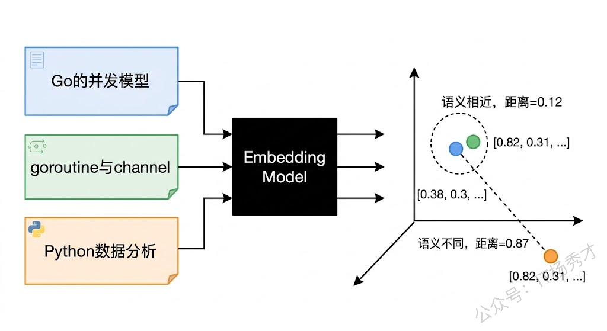
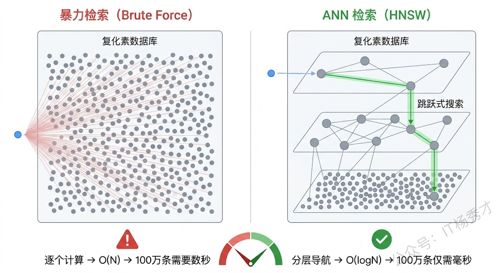
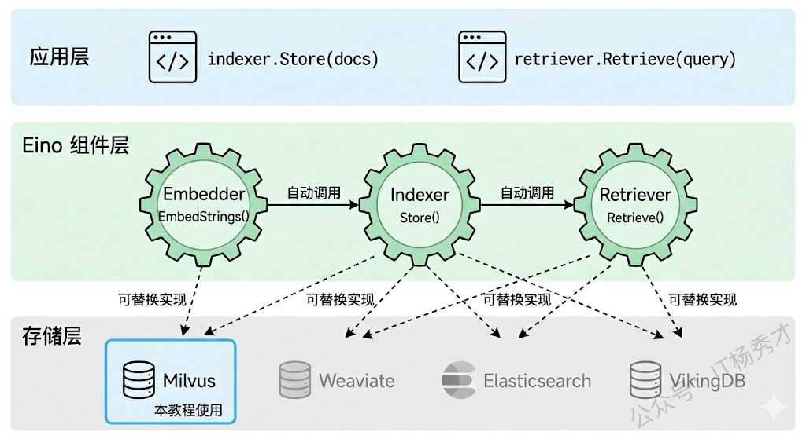
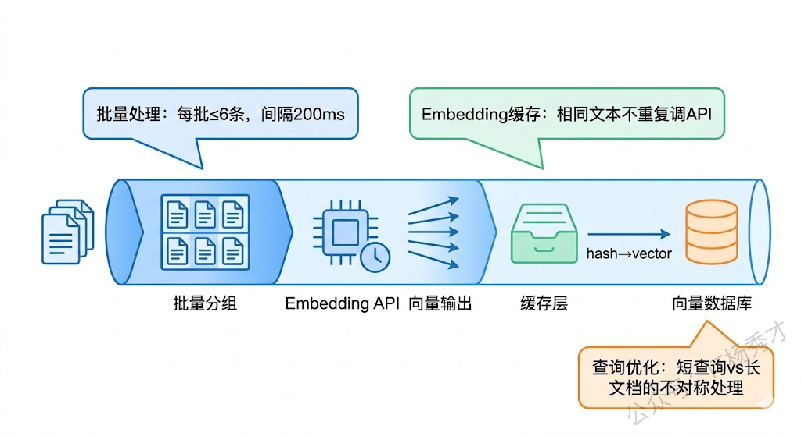

# **Embedding与向量数据库**

上一篇我们聊了 RAG 的整体架构，知道了"先检索，再生成"的核心思路。但当时的代码示例有个明显的偷懒——我们把文档向量存在内存里，用暴力遍历计算相似度。这在 5 条文档的玩具场景下能跑，但如果你的知识库有 10 万篇文档呢？内存存不下，暴力遍历也慢得没法用。

要让 RAG 在真实场景中跑起来，需要解决两个基础问题：怎么把文本变成向量（Embedding），以及怎么高效存储和检索这些向量（向量数据库）。这两样东西是 RAG 系统的基础设施，就像 Web 应用离不开 MySQL 一样，RAG 应用离不开 Embedding 模型和向量数据库。

这篇文章我们就来逐个攻破。先搞清楚 Embedding 的原理和选型，再上手 Milvus 向量数据库，最后用 Eino 框架把它们串起来，跑通一个完整的"文档入库 → 语义检索"流程。

## **1. 文本 Embedding 是怎么回事**

### **1.1 从文字到向量**

计算机不认识文字，它只认识数字。要让计算机理解"Go 语言的并发模型"和"goroutine 与 channel 的使用"这两句话意思相近，就得把文字转换成一种数字表示，让计算机能够用数学方法来计算它们之间的"距离"。

Embedding（嵌入）就是干这个事的。它把一段文本映射成一个固定维度的浮点数数组——也就是向量。比如一个 1024 维的 Embedding 模型，会把任意一段文本变成一个包含 1024 个浮点数的数组 `[0.023, -0.156, 0.891, ...]`。这个数组就像文本的"指纹"，它把文本的语义信息编码成了一组数值。

关键在于，Embedding 模型不是随便生成数字的。它经过了海量文本数据的训练，学会了一种映射关系：语义相近的文本，生成的向量在空间中距离也近；语义不相关的文本，向量距离就远。"Go 的并发编程"和"goroutine 的用法"会被映射到向量空间中非常接近的位置，而"Go 的并发编程"和"Python 的数据分析"则会离得比较远。



### **1.2 向量相似度计算**

有了向量之后，怎么判断两段文本的语义是否接近？靠计算向量之间的相似度。最常用的有两种方法。

**余弦相似度（Cosine Similarity）** 计算的是两个向量之间的夹角。值域是 [-1, 1]，1 表示方向完全一致（语义最相似），0 表示正交（语义无关），-1 表示方向完全相反。余弦相似度只关心方向不关心长度，所以即使两个向量的模长差异很大，只要方向一致，相似度就高。这个特性使得它在文本相似度计算中非常好用，因为不同长度的文本向量的模长可能差很大，但我们真正关心的是语义方向。

**欧氏距离（Euclidean Distance）** 计算的是两个向量之间的直线距离。值越小越相似，0 表示完全相同。欧氏距离同时考虑方向和长度，适合需要考虑向量"强度"差异的场景。不过在大多数文本检索场景中，余弦相似度用得更多。

还有一种 **内积（Inner Product / Dot Product）**，它是余弦相似度和向量模长的乘积。当向量都做过归一化处理（模长为 1）后，内积和余弦相似度是等价的。很多向量数据库在底层实际上用的就是归一化后的内积来加速计算。

上一篇代码中我们手写了余弦相似度的计算函数，实际项目中这个计算是由向量数据库在底层完成的，不需要你自己实现。

### **1.3 Embedding 模型选型**

市面上的 Embedding 模型有很多，选哪个取决于你的场景和预算。

通义千问的 **text-embedding-v3** 是国内用起来最方便的选择。它支持最大 8192 Token 的输入，输出维度默认 1024（也支持 512 和 768），在中英文语义检索任务上表现很不错，而且通过 DashScope API 调用非常方便，价格也便宜。我们这个系列的教程统一使用它。

OpenAI 的 **text-embedding-3-small** 和 **text-embedding-3-large** 是业界标杆。small 版本输出 1536 维，large 版本最高 3072 维，两个版本都支持自定义维度（Matryoshka Embedding 技术）。如果你的用户主要是英文场景，并且能访问 OpenAI API，这是效果最好的选择之一。

开源方面，**bge-large-zh-v1.5**（智源研究院）在中文场景下效果很好，支持本地部署不依赖外部 API。**e5-large-v2**（微软）在英文场景表现出色。如果你对数据隐私要求很高（比如政务、金融场景），不想把文本发到外部 API，可以考虑本地部署这些开源模型。

选型时需要关注几个指标：**维度**决定了向量的信息容量和存储成本，维度越高表达能力越强但存储和计算开销也越大；**最大输入长度**决定了你的文档分块可以多大；**检索效果**可以参考 MTEB（Massive Text Embedding Benchmark）排行榜上的分数。对于大多数中文场景，text-embedding-v3 是性价比最高的起步选择。

## **2. 为什么需要向量数据库**

有了 Embedding 模型能把文本变成向量，接下来的问题是这些向量存在哪、怎么快速检索。

### **2.1 暴力检索的瓶颈**

最直觉的做法是把所有向量存在内存里，查询时遍历每一条，逐个计算相似度，取 Top-K。上一篇的 Demo 代码就是这么干的。这种暴力检索的时间复杂度是 O(N)——如果知识库有 100 万条文档，每次查询就要计算 100 万次余弦相似度。假设每条向量是 1024 维的 float64，100 万条向量光存储就要约 8GB 内存，计算耗时可能要好几秒。这在生产环境中显然不可接受。

### **2.2 ANN 索引加速**

向量数据库的核心价值就在于它用 **ANN（Approximate Nearest Neighbor，近似最近邻）** 算法来加速检索。ANN 不追求找到绝对最相似的结果，而是在极短时间内找到"足够相似"的结果。这种"用一点精度换大量速度"的策略在实际应用中完全够用——你不需要找到排名第 1 的文档，找到前 10 名中的 8-9 个就已经足够好了。

主流的 ANN 索引算法有几种。**HNSW（Hierarchical Navigable Small World）** 是目前最常用的，它构建一个多层跳表结构，查询时从顶层快速定位到大致区域，然后逐层精细搜索。HNSW 的查询速度极快（微秒到毫秒级），召回率也很高（通常 95% 以上），代价是内存占用较大且构建索引比较慢。**IVF（Inverted File Index）** 先用聚类把向量分成若干组，查询时只在最相关的几组中搜索，适合数据量特别大且对内存敏感的场景。还有 **ScaNN**（Google 开源的）、**DiskANN**（微软的）等更新的算法，各有擅长的场景。



### **2.3 主流向量数据库**

目前市面上向量数据库的选择很多，这里介绍几个主流的。

**Milvus** 是开源向量数据库中功能最全面的，由 Zilliz 公司开发维护。它支持多种 ANN 索引（HNSW、IVF_FLAT、IVF_SQ8 等），支持标量过滤（比如"只在 category=技术 的文档中检索"），有完善的 Go SDK，而且 Eino 框架官方提供了 Milvus 的 Indexer 和 Retriever 适配。社区活跃，文档丰富，是 Go 开发者做 RAG 的首选。

**Weaviate** 是另一个流行的开源选项，用 Go 语言开发，天然对 Go 生态友好。它内置了向量化功能（可以自动调用 Embedding 模型），支持 GraphQL 查询接口，学习曲线相对平缓。

**Qdrant** 用 Rust 编写，性能出色，API 设计简洁。**Pinecone** 是纯云服务，不需要自己运维，适合小团队快速上手但成本较高。**Chroma** 轻量级，适合本地开发和小规模场景。

我们这个系列选择 **Milvus** 作为主力向量数据库，原因有三：开源免费、Go SDK 成熟、Eino 框架官方支持。

## **3. Milvus 上手实战**

理论讲完，开始动手。这一节我们先不用 Eino 框架，直接用 Milvus 的 Go SDK 来操作，把向量数据库的基本概念搞清楚。

### **3.1 环境准备**

用 Docker 启动 Milvus 最简单。Milvus 提供了一个名为 milvus-standalone 的单机版镜像，开发和学习阶段用它就够了。

```bash
# 下载 Milvus 的 docker-compose 配置
wget https://github.com/milvus-io/milvus/releases/download/v2.5.4/milvus-standalone-docker-compose.yml -O docker-compose.yml

# 启动 Milvus
docker compose up -d

# 验证是否启动成功（看到三个容器都是 running 就对了）
docker compose ps
```

启动后 Milvus 默认监听 19530 端口（gRPC）和 9091 端口（HTTP 健康检查）。可以用 curl 验证一下：

```bash
curl http://localhost:9091/healthz
# 返回 "OK" 表示服务正常
```

安装 Go SDK：

```bash
go get github.com/milvus-io/milvus/client/v2
```

### **3.2 核心概念**

在写代码之前，先理解 Milvus 的几个核心概念，不然代码看起来会一头雾水。

Milvus 的数据组织方式和传统数据库类似，但多了"向量"这个维度。**Collection** 相当于关系数据库中的"表"，一个 Collection 存储一类数据。**Field** 相当于"列"，每个 Collection 至少需要三种 Field：一个主键 Field（ID）、一个向量 Field（存储 Embedding 向量）、以及若干标量 Field（存储文本内容、元数据等）。**Index** 是在向量 Field 上建的索引，决定了使用哪种 ANN 算法来加速检索。

打个比方，如果你要存一批技术文档，可以这样设计 Collection：ID 字段用来唯一标识每个文档块，content 字段存文档的原始文本，embedding 字段存文本的向量表示，category 字段存文档分类（比如"Go语言"、"Python"等）。查询时，你可以用向量检索找到语义最相关的文档，同时用标量过滤限定类别。

### **3.3 完整代码示例**

下面这个示例完整演示了 Milvus 的核心操作流程：创建 Collection、插入向量数据、建索引、执行检索。我们用通义千问的 Embedding API 来生成向量。

```go
package main

import (
	"context"
	"fmt"
	"os"

	openai "github.com/sashabaranov/go-openai"

	"github.com/milvus-io/milvus/client/v2"
	"github.com/milvus-io/milvus/client/v2/entity"
	"github.com/milvus-io/milvus/client/v2/index"
)

const (
	collectionName = "go_knowledge"
	embeddingDim   = 1024 // text-embedding-v3 默认输出 1024 维
)

// 知识库文档
var documents = []string{
	"Go语言的并发模型基于CSP理论，goroutine是轻量级协程，初始栈空间仅2KB，通过channel进行类型安全的通信。",
	"Go语言的GC采用三色标记清除算法，从1.5版本开始STW时间控制在毫秒级，可通过GOGC环境变量调整触发频率。",
	"Go语言的接口是隐式实现的，只要类型实现了接口的所有方法就自动满足该接口，空接口interface{}可用any代替。",
	"Go Module是官方依赖管理方案，go.mod记录模块路径和依赖版本，go.sum保存哈希校验值，go mod tidy清理依赖。",
	"Go语言的错误处理采用显式返回error的方式，errors.Is和errors.As用于判断错误类型，支持%w格式化动词包装错误。",
}

func main() {
	ctx := context.Background()

	// ====== 1. 初始化客户端 ======
	// 初始化 Milvus 客户端
	milvusClient, err := milvusclient.New(ctx, &milvusclient.ClientConfig{
		Address: "localhost:19530",
	})
	if err != nil {
		fmt.Printf("连接 Milvus 失败: %v\n", err)
		return
	}
	defer milvusClient.Close(ctx)

	// 初始化通义千问客户端（用于 Embedding）
	aiConfig := openai.DefaultConfig(os.Getenv("DASHSCOPE_API_KEY"))
	aiConfig.BaseURL = "https://dashscope.aliyuncs.com/compatible-mode/v1"
	aiClient := openai.NewClientWithConfig(aiConfig)

	// ====== 2. 创建 Collection ======
	// 先检查是否已存在，存在则删除（方便反复测试）
	has, _ := milvusClient.HasCollection(ctx, milvusclient.NewHasCollectionOption(collectionName))
	if has {
		milvusClient.DropCollection(ctx, milvusclient.NewDropCollectionOption(collectionName))
	}

	// 定义 Collection 的 Schema
	schema := entity.NewSchema().WithName(collectionName).WithDescription("Go语言知识库")
	schema.WithField(entity.NewField().WithName("id").WithDataType(entity.FieldTypeInt64).WithIsPrimaryKey(true).WithIsAutoID(true)).
		WithField(entity.NewField().WithName("content").WithDataType(entity.FieldTypeVarChar).WithMaxLength(2000)).
		WithField(entity.NewField().WithName("embedding").WithDataType(entity.FieldTypeFloatVector).WithDim(embeddingDim))

	// 创建 Collection
	err = milvusClient.CreateCollection(ctx, milvusclient.NewCreateCollectionOption(collectionName, schema))
	if err != nil {
		fmt.Printf("创建 Collection 失败: %v\n", err)
		return
	}
	fmt.Println("✅ Collection 创建成功")

	// ====== 3. 生成 Embedding 并插入数据 ======
	fmt.Println("\n📚 正在向量化文档并插入...")
	contents := make([]string, len(documents))
	embeddings := make([][]float32, len(documents))

	for i, doc := range documents {
		contents[i] = doc
		emb, err := getEmbedding(ctx, aiClient, doc)
		if err != nil {
			fmt.Printf("文档 %d 向量化失败: %v\n", i, err)
			return
		}
		embeddings[i] = emb
		fmt.Printf("  文档 %d 已向量化（%d 维）\n", i+1, len(emb))
	}

	// 批量插入
	contentColumn := entity.NewColumnVarChar("content", contents)
	embeddingColumn := entity.NewColumnFloatVector("embedding", embeddingDim, embeddings)

	_, err = milvusClient.Insert(ctx, milvusclient.NewColumnBasedInsertOption(collectionName).
		WithColumns(contentColumn, embeddingColumn))
	if err != nil {
		fmt.Printf("插入数据失败: %v\n", err)
		return
	}
	fmt.Printf("✅ 成功插入 %d 条文档\n", len(documents))

	// ====== 4. 创建索引 ======
	// 在 embedding 字段上创建 HNSW 索引
	hnswIndex := index.NewHNSWIndex(entity.COSINE, 16, 200)
	createIndexTask, err := milvusClient.CreateIndex(ctx, milvusclient.NewCreateIndexOption(collectionName, "embedding", hnswIndex))
	if err != nil {
		fmt.Printf("创建索引失败: %v\n", err)
		return
	}
	createIndexTask.Await(ctx)
	fmt.Println("✅ HNSW 索引创建成功")

	// ====== 5. 加载 Collection 到内存 ======
	loadTask, err := milvusClient.LoadCollection(ctx, milvusclient.NewLoadCollectionOption(collectionName))
	if err != nil {
		fmt.Printf("加载 Collection 失败: %v\n", err)
		return
	}
	loadTask.Await(ctx)
	fmt.Println("✅ Collection 已加载到内存")

	// ====== 6. 执行向量检索 ======
	query := "Go语言怎么做并发编程？"
	fmt.Printf("\n🔍 查询: %s\n\n", query)

	queryEmbedding, err := getEmbedding(ctx, aiClient, query)
	if err != nil {
		fmt.Printf("查询向量化失败: %v\n", err)
		return
	}

	// 搜索 Top-3
	searchResult, err := milvusClient.Search(ctx, milvusclient.NewSearchOption(collectionName, 3,
		[]entity.Vector{entity.FloatVector(queryEmbedding)}).
		WithOutputFields("content"))
	if err != nil {
		fmt.Printf("检索失败: %v\n", err)
		return
	}

	fmt.Println("📋 检索结果:")
	for _, result := range searchResult {
		for i := 0; i < result.ResultCount; i++ {
			content, _ := result.Fields.GetColumn("content").GetAsString(i)
			score := result.Scores[i]
			fmt.Printf("  [%d] 相似度: %.4f\n      内容: %s\n\n", i+1, score, content)
		}
	}
}

func getEmbedding(ctx context.Context, client *openai.Client, text string) ([]float32, error) {
	resp, err := client.CreateEmbeddings(ctx, openai.EmbeddingRequest{
		Model: openai.EmbeddingModel("text-embedding-v3"),
		Input: []string{text},
	})
	if err != nil {
		return nil, err
	}
	return resp.Data[0].Embedding, nil
}
```

运行结果：

```
✅ Collection 创建成功

📚 正在向量化文档并插入...
  文档 1 已向量化（1024 维）
  文档 2 已向量化（1024 维）
  文档 3 已向量化（1024 维）
  文档 4 已向量化（1024 维）
  文档 5 已向量化（1024 维）
✅ 成功插入 5 条文档
✅ HNSW 索引创建成功
✅ Collection 已加载到内存

🔍 查询: Go语言怎么做并发编程？

📋 检索结果:
  [1] 相似度: 0.8391
      内容: Go语言的并发模型基于CSP理论，goroutine是轻量级协程，初始栈空间仅2KB，通过channel进行类型安全的通信。

  [2] 相似度: 0.6234
      内容: Go语言的GC采用三色标记清除算法，从1.5版本开始STW时间控制在毫秒级，可通过GOGC环境变量调整触发频率。

  [3] 相似度: 0.5987
      内容: Go语言的接口是隐式实现的，只要类型实现了接口的所有方法就自动满足该接口，空接口interface{}可用any代替。
```

代码的整体流程和上一篇的纯内存版本是一样的，但关键区别在于向量的存储和检索交给了 Milvus。你不再需要自己写余弦相似度计算，也不用担心数据量大了内存撑不住——Milvus 的 HNSW 索引可以在百万级向量中毫秒级返回结果。

有几个细节值得注意。创建索引时的两个参数 `M=16` 和 `efConstruction=200` 是 HNSW 的超参数：M 控制每个节点的最大连接数，越大索引越精确但占用内存越多；efConstruction 控制构建时的搜索范围，越大构建越慢但索引质量越高。对于大多数场景，M=16、efConstruction=200 是一个不错的起点。另外，Milvus 需要先把 Collection 加载到内存才能执行检索（`LoadCollection`），这个设计是为了保证检索性能。

## **4. 用 Eino 框架集成 Embedding 和向量数据库**

直接用 Milvus SDK 操作虽然灵活，但代码比较啰嗦。Eino 框架把 Embedding、文档存储（Indexer）和文档检索（Retriever）抽象成了标准组件，让你可以用统一的接口操作不同的向量数据库，而且能轻松嵌入到 Chain 或 Graph 编排中。

### **4.1 Eino 的 Embedding 组件**

Eino 定义了一个统一的 Embedder 接口：

```go
type Embedder interface {
    EmbedStrings(ctx context.Context, texts []string, opts ...Option) ([][]float64, error)
}
```

不管底层用的是通义千问、OpenAI 还是本地部署的开源模型，对上层代码来说调用方式完全一样，只是初始化配置不同。这种面向接口的设计在 Go 生态中再自然不过了。

Eino 的 Embedding 组件通过 `eino-ext` 扩展包提供具体实现。对于通义千问，使用 OpenAI 兼容的 Embedding 组件，配置 BaseURL 指向 DashScope 即可。

### **4.2 Indexer 和 Retriever 组件**

**Indexer** 负责把文档存进向量数据库。它接收一组 `schema.Document`，自动调用 Embedding 模型把文档内容向量化，然后存入数据库。你不再需要手动调用 Embedding API、手动拼装数据列、手动调用 Insert——Indexer 把这些步骤全部封装好了。

**Retriever** 负责从向量数据库中检索文档。你给它一个查询文本，它自动向量化查询、执行 ANN 搜索、返回最相关的文档列表。返回的文档带有原始内容和相似度分数，可以直接拿去拼装 RAG 的 Prompt。

这两个组件的 Milvus 实现在 `github.com/cloudwego/eino-ext/components/indexer/milvus2` 和 `github.com/cloudwego/eino-ext/components/retriever/milvus2` 包中。



### **4.3 完整代码示例**

下面用 Eino 的 Embedding + Indexer + Retriever 组件重写上一节的功能。你会发现代码量少了不少，而且更容易理解。

项目需要安装以下依赖：

```bash
go get github.com/cloudwego/eino@latest
go get github.com/cloudwego/eino-ext/components/embedding/openai@latest
go get github.com/cloudwego/eino-ext/components/indexer/milvus2@latest
go get github.com/cloudwego/eino-ext/components/retriever/milvus2@latest
```

```go
package main

import (
	"context"
	"fmt"
	"os"

	einoOpenAI "github.com/cloudwego/eino-ext/components/embedding/openai"
	einoIndexer "github.com/cloudwego/eino-ext/components/indexer/milvus2"
	einoRetriever "github.com/cloudwego/eino-ext/components/retriever/milvus2"
	"github.com/cloudwego/eino-ext/components/retriever/milvus2/search_mode"
	"github.com/cloudwego/eino/schema"
	"github.com/milvus-io/milvus/client/v2/entity"
	"github.com/milvus-io/milvus/client/v2/milvusclient"
)

const (
	collectionName = "eino_knowledge"
	embeddingDim   = 1024
)

var documents = []*schema.Document{
	{ID: "doc_1", Content: "Go语言的并发模型基于CSP理论，goroutine是轻量级协程，初始栈空间仅2KB，通过channel进行类型安全的通信。"},
	{ID: "doc_2", Content: "Go语言的GC采用三色标记清除算法，从1.5版本开始STW时间控制在毫秒级，可通过GOGC环境变量调整触发频率。"},
	{ID: "doc_3", Content: "Go语言的接口是隐式实现的，只要类型实现了接口的所有方法就自动满足该接口，空接口interface{}可用any代替。"},
	{ID: "doc_4", Content: "Go Module是官方依赖管理方案，go.mod记录模块路径和依赖版本，go.sum保存哈希校验值，go mod tidy清理依赖。"},
	{ID: "doc_5", Content: "Go语言的错误处理采用显式返回error的方式，errors.Is和errors.As用于判断错误类型，支持%w格式化动词包装错误。"},
}

func main() {
	ctx := context.Background()

	// ====== 1. 创建 Eino Embedding 组件 ======
	dim := embeddingDim
	embedder, err := einoOpenAI.NewEmbedder(ctx, &einoOpenAI.EmbeddingConfig{
		APIKey:     os.Getenv("DASHSCOPE_API_KEY"),
		BaseURL:    "https://dashscope.aliyuncs.com/compatible-mode/v1",
		Model:      "text-embedding-v3",
		Dimensions: &dim,
	})
	if err != nil {
		fmt.Printf("创建 Embedder 失败: %v\n", err)
		return
	}
	fmt.Println("✅ Embedder 初始化成功")

	// 测试一下 Embedding 功能
	vectors, err := embedder.EmbedStrings(ctx, []string{"Hello, Go Agent!"})
	if err != nil {
		fmt.Printf("Embedding 测试失败: %v\n", err)
		return
	}
	fmt.Printf("  测试文本向量维度: %d\n\n", len(vectors[0]))

	// ====== 2. 创建 Indexer（文档入库组件） ======
	milvusClientConfig := &milvusclient.ClientConfig{
		Address: "localhost:19530",
	}

	indexer, err := einoIndexer.NewIndexer(ctx, &einoIndexer.IndexerConfig{
		ClientConfig: milvusClientConfig,
		Collection:   collectionName,
		Dimension:    embeddingDim,
		MetricType:   einoIndexer.COSINE,
		IndexBuilder: einoIndexer.NewHNSWIndexBuilder().WithM(16).WithEfConstruction(200),
		Embedding:    embedder,
	})
	if err != nil {
		fmt.Printf("创建 Indexer 失败: %v\n", err)
		return
	}
	fmt.Println("✅ Indexer 初始化成功")

	// ====== 3. 存储文档 ======
	fmt.Println("\n📚 正在存储文档...")
	ids, err := indexer.Store(ctx, documents)
	if err != nil {
		fmt.Printf("存储文档失败: %v\n", err)
		return
	}
	fmt.Printf("✅ 成功存储 %d 篇文档，ID: %v\n", len(ids), ids)

	// ====== 4. 创建 Retriever（文档检索组件） ======
	retriever, err := einoRetriever.NewRetriever(ctx, &einoRetriever.RetrieverConfig{
		ClientConfig: milvusClientConfig,
		Collection:   collectionName,
		TopK:         3,
		SearchMode:   search_mode.NewApproximate(einoRetriever.COSINE),
		Embedding:    embedder,
	})
	if err != nil {
		fmt.Printf("创建 Retriever 失败: %v\n", err)
		return
	}
	fmt.Println("✅ Retriever 初始化成功")

	// ====== 5. 执行语义检索 ======
	queries := []string{
		"Go语言怎么做并发编程？",
		"Go的垃圾回收机制是怎样的？",
		"怎么管理Go项目的依赖？",
	}

	for _, query := range queries {
		fmt.Printf("\n🔍 查询: %s\n", query)
		docs, err := retriever.Retrieve(ctx, query)
		if err != nil {
			fmt.Printf("  检索失败: %v\n", err)
			continue
		}

		for i, doc := range docs {
			score := doc.MetaData["score"]
			fmt.Printf("  [%d] 相似度: %v\n      内容: %s\n", i+1, score, doc.Content)
		}
	}
}
```

运行结果：

```
✅ Embedder 初始化成功
  测试文本向量维度: 1024

✅ Indexer 初始化成功

📚 正在存储文档...
✅ 成功存储 5 篇文档，ID: [doc_1 doc_2 doc_3 doc_4 doc_5]
✅ Retriever 初始化成功

🔍 查询: Go语言怎么做并发编程？
  [1] 相似度: 0.8391
      内容: Go语言的并发模型基于CSP理论，goroutine是轻量级协程，初始栈空间仅2KB，通过channel进行类型安全的通信。
  [2] 相似度: 0.6234
      内容: Go语言的GC采用三色标记清除算法，从1.5版本开始STW时间控制在毫秒级，可通过GOGC环境变量调整触发频率。
  [3] 相似度: 0.5987
      内容: Go语言的接口是隐式实现的，只要类型实现了接口的所有方法就自动满足该接口，空接口interface{}可用any代替。

🔍 查询: Go的垃圾回收机制是怎样的？
  [1] 相似度: 0.8156
      内容: Go语言的GC采用三色标记清除算法，从1.5版本开始STW时间控制在毫秒级，可通过GOGC环境变量调整触发频率。
  [2] 相似度: 0.5892
      内容: Go语言的并发模型基于CSP理论，goroutine是轻量级协程，初始栈空间仅2KB，通过channel进行类型安全的通信。
  [3] 相似度: 0.5634
      内容: Go语言的错误处理采用显式返回error的方式，errors.Is和errors.As用于判断错误类型，支持%w格式化动词包装错误。

🔍 查询: 怎么管理Go项目的依赖？
  [1] 相似度: 0.7823
      内容: Go Module是官方依赖管理方案，go.mod记录模块路径和依赖版本，go.sum保存哈希校验值，go mod tidy清理依赖。
  [2] 相似度: 0.5412
      内容: Go语言的错误处理采用显式返回error的方式，errors.Is和errors.As用于判断错误类型，支持%w格式化动词包装错误。
  [3] 相似度: 0.5201
      内容: Go语言的接口是隐式实现的，只要类型实现了接口的所有方法就自动满足该接口，空接口interface{}可用any代替。
```

对比一下前面直接用 Milvus SDK 的版本，你会发现 Eino 帮你省掉了很多繁琐的工作。创建 Collection、定义 Schema、生成 Embedding、拼装数据列、创建索引、加载 Collection——这些步骤 Indexer 内部全帮你做了，你只需要调一个 `Store(ctx, docs)` 就搞定。检索也一样，Retriever 把"查询向量化 → ANN 搜索 → 结果组装"打包成了一个 `Retrieve(ctx, query)` 调用。

更重要的是，Eino 的 Indexer 和 Retriever 都是标准组件，可以直接嵌入到 Chain 或 Graph 编排中。比如你后面要做一个 RAG Chain，可以这样写：

```go
chain := compose.NewChain[string, []*schema.Document]()
chain.AppendRetriever(retriever)
```

这行代码就把检索环节嵌进了编排管道。后续章节构建完整的 RAG Agent 时，你会看到这种组件化编排的威力。

## **5. Embedding 的实践技巧**

在实际项目中用 Embedding 会遇到一些细节问题，这里提几个实用的技巧。

### **5.1 批量处理与速率控制**

Embedding API 通常有速率限制（比如通义千问的 DashScope 对免费用户有 QPS 限制）。如果你要一次性导入大量文档，需要做批量处理和速率控制，不能一股脑地把所有请求都打过去。

一个简单的策略是把文档分批，每批调用一次 Embedding API（大多数 Embedding API 支持单次传入多条文本），两批之间加一个短暂的间隔。通义千问的 text-embedding-v3 单次最多支持 6 条文本输入，所以每批控制在 6 条以内。

```go
// 批量 Embedding 示例
func batchEmbed(ctx context.Context, embedder embedding.Embedder, texts []string, batchSize int) ([][]float64, error) {
	var allVectors [][]float64

	for i := 0; i < len(texts); i += batchSize {
		end := i + batchSize
		if end > len(texts) {
			end = len(texts)
		}

		batch := texts[i:end]
		vectors, err := embedder.EmbedStrings(ctx, batch)
		if err != nil {
			return nil, fmt.Errorf("batch %d 失败: %w", i/batchSize, err)
		}
		allVectors = append(allVectors, vectors...)

		// 简单的速率控制
		if end < len(texts) {
			time.Sleep(200 * time.Millisecond)
		}
	}

	return allVectors, nil
}
```

### **5.2 Embedding 缓存**

同一段文本反复调用 Embedding API 是浪费钱。如果你的知识库更新不频繁，可以在本地缓存文本和向量的映射关系，只对新增或修改的文档调用 API。最简单的做法是用文本的哈希值作为缓存 Key，向量作为 Value，存在本地文件或 Redis 中。

### **5.3 查询文本和文档文本的不对称性**

用户的查询通常很短（"Go 怎么做并发"），而知识库的文档通常比较长（一整段技术描述）。这种长短不一的情况可能影响检索效果。一些 Embedding 模型针对这种不对称场景做了专门优化，比如给查询文本和文档文本加不同的前缀指令。text-embedding-v3 在这方面处理得比较好，一般不需要额外操作。但如果你发现检索效果不理想，可以尝试在查询前加上"查询："前缀、在文档前加上"文档："前缀。



## **6. 小结**

Embedding 和向量数据库是 RAG 的地基。Embedding 模型把人类的语言翻译成了机器能计算距离的数字，向量数据库则让这种计算在海量数据上依然快得飞起。理解了这两样东西的工作原理，RAG 管道的检索环节就没有什么神秘的了——本质上就是"把文本变成向量，存进去，查的时候算距离取最近的"。

Eino 框架在这件事上帮了大忙。它把 Embedding、Indexer、Retriever 都抽象成了标准接口，你不需要关心 Milvus SDK 的 Schema 定义、数据列拼装、索引创建这些底层细节，一个 `Store` 存文档、一个 `Retrieve` 查文档，整个检索管道三行代码就能搭起来。当你以后想把 Milvus 换成 Weaviate 或者 Elasticsearch 的时候，上层代码几乎不用改，换一个配置就行。这就是面向接口编程带来的好处，Go 开发者对此应该再熟悉不过了。

<div style="background-color: #f0f9eb; padding: 10px 15px; border-radius: 4px; border-left: 5px solid #67c23a; margin: 20px 0; color:rgb(64, 147, 255);">

<span style="color: #006400; font-size: 28px;"><strong>关注秀才公众号：</strong></span><span style="color: red; font-size: 28px;"><strong>IT杨秀才</strong></span><span style="color: #006400; font-size: 28px;"><strong>，回复：</strong></span><span style="color: red; font-size: 28px;"><strong>面试</strong></span>

<div style="text-align: center;"><span style="color: #006400; font-size: 28px;"><strong>领取后端/AI面试题库PDF</strong></span></div>


</div> 
