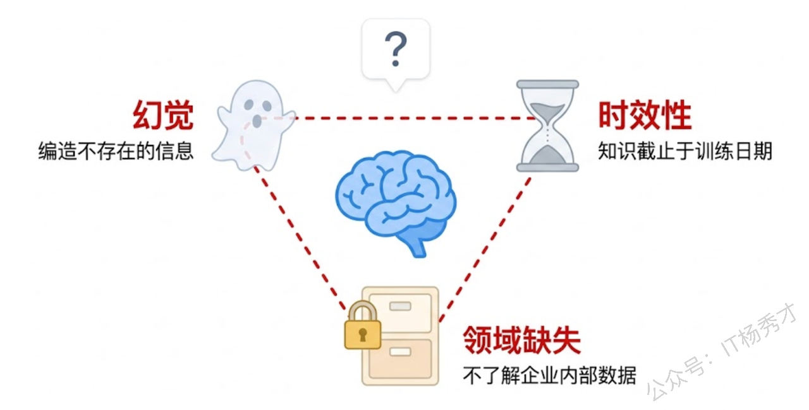
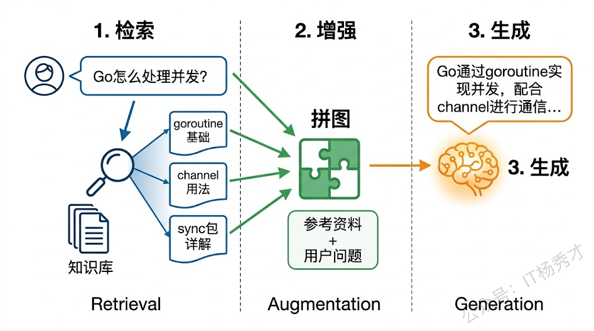
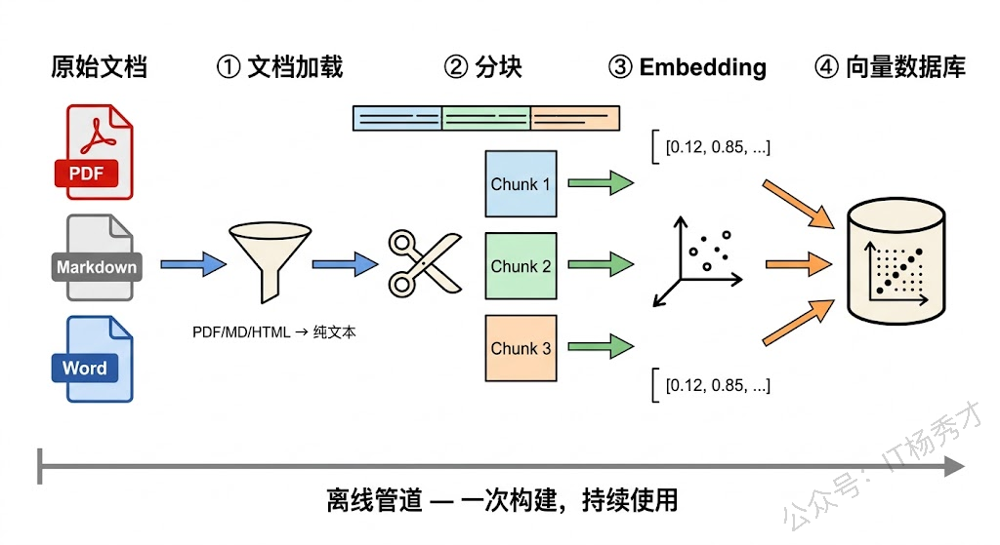
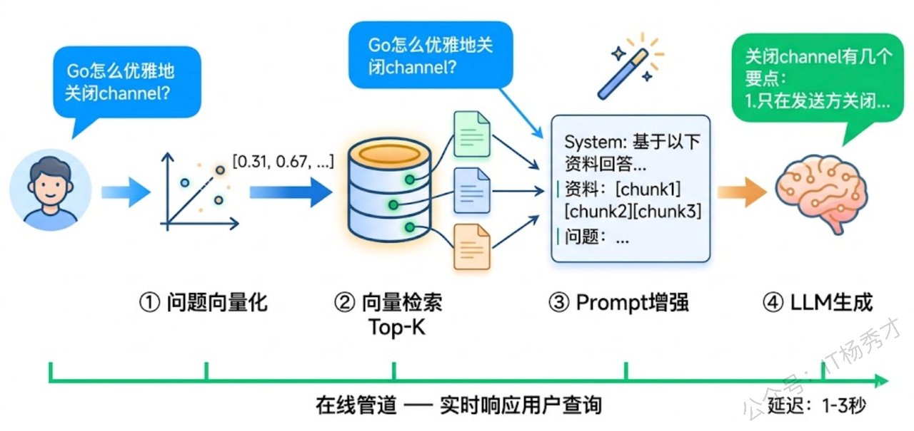
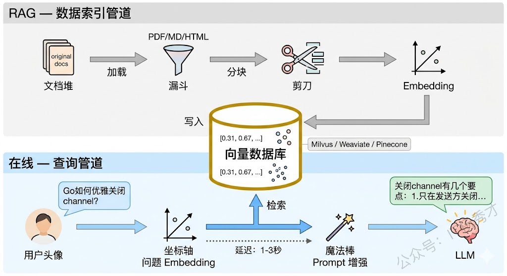
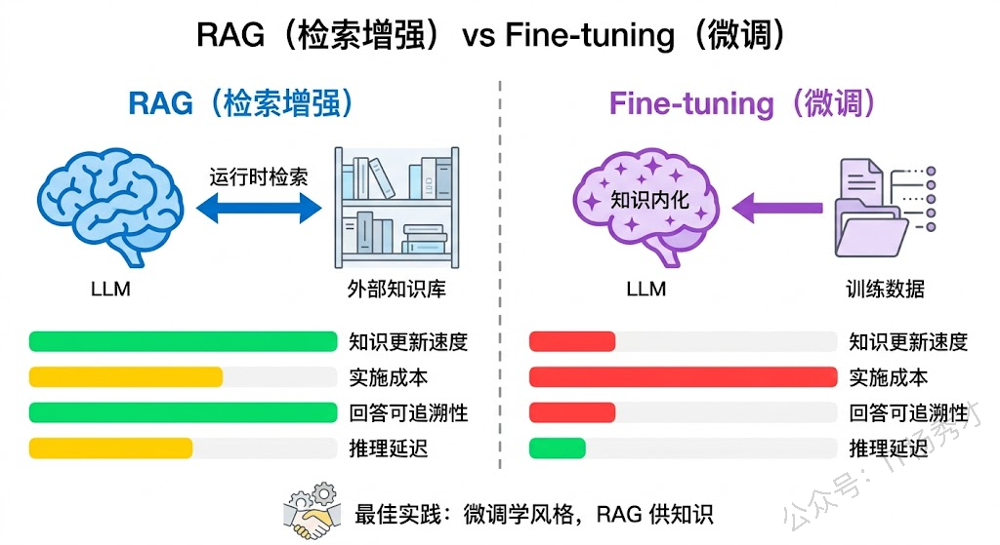
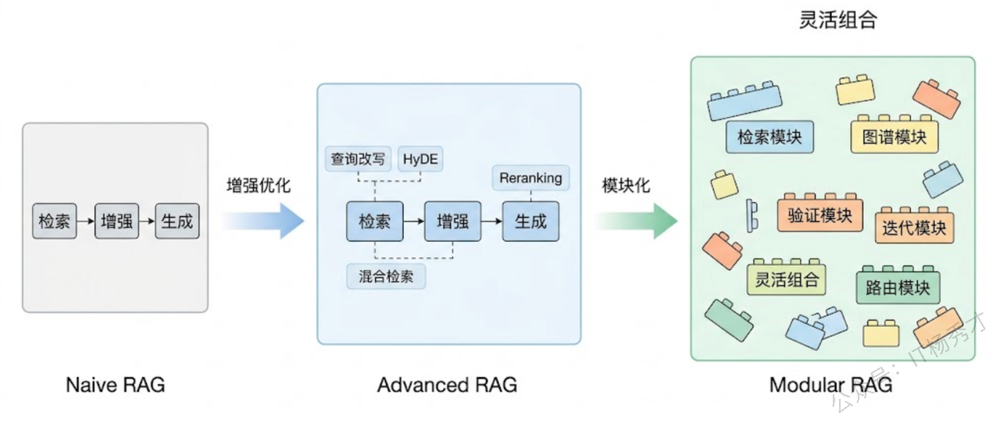
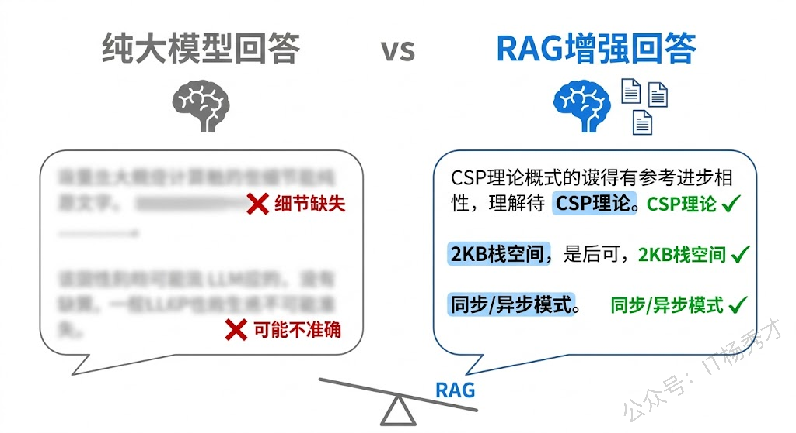

大模型很强，但它有一个致命的短板——它不知道你公司内部的业务知识。你问 ChatGPT"我们公司的退货政策是什么"，它只能编一个看起来像模像样但完全不靠谱的答案。这就是大模型的"幻觉"问题，也是大模型落地企业场景时最大的障碍。

RAG（Retrieval-Augmented Generation，检索增强生成）就是为解决这个问题而生的。它的核心思路很简单：大模型回答问题之前，先从你的知识库里检索出相关资料，把这些资料塞进 Prompt 里，让模型"带着参考资料作答"。这样模型的回答就有据可依了，不用再靠编。

这篇文章是 RAG 实战篇的开篇，会从大模型的局限性讲起，搞清楚为什么需要 RAG，然后深入理解 RAG 的核心架构和工作流程，最后和微调做个对比帮你做技术选型。文章末尾还会用 Go 代码跑一个最基础的 RAG 演示，让你对整个流程有个直观的感受。

## **1. 大模型的知识困境**

在讨论 RAG 之前，我们得先搞清楚大模型在知识层面到底有哪些问题，这样才能理解 RAG 为什么是目前最主流的解决方案。

### **1.1 幻觉问题**

大模型生成文本的本质是"根据上文预测下一个最可能的 Token"。这意味着它并不真正"理解"事实，而是在做概率推断。当模型对某个话题的训练数据不足时，它不会说"我不知道"，而是会根据已有的语言模式"编造"一个听起来很合理的答案。

举个例子，你问模型"Go 1.23 有什么新特性"，如果它的训练数据截止到 Go 1.22 发布之前，它大概率会给你生成一些似是而非的内容——比如把 Go 1.22 的特性张冠李戴说成 1.23 的，或者干脆凭空编造一个根本不存在的语法特性。更麻烦的是，这种编造出来的内容表述流畅、逻辑自洽，如果你不是专家根本看不出问题。

幻觉问题在企业场景中尤其危险。想象一下，一个客服机器人告诉客户"我们支持无条件 90 天退货"，而实际公司政策是 30 天——这种错误可能直接导致法律纠纷和经济损失。

### **1.2 知识时效性**

大模型的训练是有截止日期的。模型训练完成之后，它的知识库就被冻结了。这之后发生的任何事情——新发布的框架版本、最新的安全漏洞、昨天刚更新的公司政策——模型一概不知。

这个问题靠重新训练能解决吗？理论上可以，但代价极高。训练一个大模型需要数千张 GPU 跑几周甚至几个月，成本动辄几百万美元。而且即使你训练完了，第二天又有新知识产生了，难道再训一遍？这显然不现实。

### **1.3 领域知识缺失**

大模型是在互联网公开数据上训练的，这意味着它对公开的、通用的知识掌握得不错，但对以下这些知识基本是两眼一抹黑：

企业内部知识是最典型的缺失领域。你公司的产品文档、API 接口说明、内部研发规范、客户合同条款——这些信息从来没有出现在模型的训练数据中，模型自然一无所知。还有一些垂直行业的专业知识，比如某种罕见疾病的最新临床指南、某个地区特有的税务法规细则、某个小众技术框架的配置方法等，模型训练数据中这类信息的覆盖度也很有限。



这三个问题加在一起，构成了大模型在企业落地时的核心障碍。你不能让一个不知道公司政策、只会编答案、知识还过时的模型去服务真实用户。那怎么办？最直觉的思路是把你的知识喂给模型，让它在回答时有据可依。RAG 就是实现这个思路的最佳方案。

## **2. RAG 是什么**

RAG 的全称是 Retrieval-Augmented Generation（检索增强生成），最早由 Facebook AI Research 在 2020 年提出。它的核心理念用一句话就能说清楚：**先检索，再生成**。在大模型回答问题之前，先从外部知识库中检索出与问题相关的文档片段，然后把这些片段和用户问题一起拼成 Prompt 交给大模型，让模型基于这些"参考资料"来生成回答。

你可以把它类比成开卷考试。闭卷考试（纯大模型）时你只能靠记忆作答，记不住就得瞎编。开卷考试（RAG）允许你翻书，虽然答题的还是你（大模型），但有了参考资料，答案的准确性就大大提高了。

### **2.1 RAG 的三个阶段**

一个完整的 RAG 流程分为三个阶段：检索（Retrieval）、增强（Augmentation）、生成（Generation）。

**检索阶段**是 RAG 的情报搜集环节。用户提出一个问题后，系统需要从知识库中找到与这个问题最相关的文档片段。这里的找到不是传统的关键词匹配（虽然关键词检索也可以用），而是更多依赖语义检索——通过 Embedding 模型把问题和文档都转换成向量，然后在向量空间中计算相似度，找出语义上最接近的文档。比如用户问"Go 怎么处理并发"，即使知识库里的文档写的是"goroutine 和 channel 的使用方法"，语义检索也能找到它，因为这两句话在向量空间中的距离很近。

**增强阶段**是组装 Prompt的环节。检索到相关文档后，系统把这些文档片段和用户的原始问题拼接在一起，构造一个增强版的 Prompt。一个典型的增强 Prompt 长这样：

```plain&#x20;text
请根据以下参考资料回答用户问题。如果参考资料中没有相关信息，请明确告知用户。

参考资料：
[文档片段1]
[文档片段2]
[文档片段3]

用户问题：Go语言怎么实现并发？
```

这个阶段看起来简单，但其实有很多细节值得推敲：检索回来的文档片段怎么排序？放多少个片段合适？片段之间有重叠怎么处理？超出模型上下文窗口怎么办？这些问题在后续的实战篇中会逐一展开。

**生成阶段**就是把增强后的 Prompt 交给大模型，让它基于参考资料来生成回答。由于 Prompt 中已经包含了相关的知识片段，模型不再需要依赖自己记忆中可能不准确的信息，而是可以"引用"这些片段来组织回答。这大大降低了幻觉发生的概率——模型有了"证据"，就不需要"编造"了。



### **2.2 RAG 为什么有效**

RAG 能解决前面提到的三个知识困境，逻辑很清楚。

针对幻觉问题，RAG 给模型提供了"证据"。模型不再需要从自己可能不靠谱的"记忆"中搜刮信息，而是可以直接引用检索到的文档内容来回答。如果检索结果中没有相关信息，我们还可以在 Prompt 中指示模型说"我不知道"而不是胡编。当然，RAG 不能 100% 消除幻觉——模型有时候还是会忽略参考资料自己发挥——但幻觉率会大幅下降。

针对时效性问题，RAG 把"更新知识"这件事从"重新训练模型"变成了"更新知识库"。你公司的退货政策改了？在知识库里把旧文档替换成新文档就行了，不需要重新训练模型。新版本的框架发布了？把新文档导入知识库，RAG 下次检索就能找到最新的内容。知识更新的成本从"百万美元级"降到了"几乎为零"。

针对领域知识缺失问题，RAG 允许你把任何私有数据导入知识库。企业内部文档、产品手册、会议记录、代码仓库——只要能转成文本，就能被 RAG 检索到。模型不需要"学会"这些知识，只需要能"读懂"检索结果并据此回答就行了。

## **3. RAG 系统架构**

一个生产级的 RAG 系统不只是"检索+生成"这么简单。它由两条相对独立的管道（Pipeline）组成：离线的数据索引管道和在线的查询管道。

### **3.1 数据索引管道**

数据索引管道是 RAG 的"备考"阶段——在用户提问之前，先把知识库里的文档处理好、存好，让后续的检索能快速找到相关内容。这条管道通常是离线运行的（或者定时运行），主要包含四个步骤。

第一步是**文档加载**。把各种格式的原始文档读取进来——PDF、Word、Markdown、HTML 网页、数据库记录、API 返回结果等等。不同格式的文档需要不同的解析器，比如 PDF 需要提取文字（有些 PDF 是扫描图片，还需要 OCR），HTML 需要剥离标签保留正文。这一步的目标是把非结构化的原始文档转换成干净的纯文本。

第二步是**文档分块（Chunking）**。一篇完整的文档可能有几千甚至几万字，直接塞进 Prompt 既浪费 Token 又可能超出上下文窗口限制。而且一篇文档通常覆盖多个主题，用户问的问题往往只涉及其中一小部分。所以我们需要把文档切成小块（Chunk），每一块聚焦一个相对独立的知识点。分块策略有很多种——按固定字数切、按段落切、按语义边界切——每种策略各有优劣，我们在后续文章中会详细讨论。

第三步是**向量化（Embedding）**。把每个文档块通过 Embedding 模型转换成一个高维向量（通常是 768 维或 1536 维的浮点数数组）。Embedding 模型的能力在于：语义相近的文本，转换出来的向量在空间中的距离也近。比如"goroutine 是 Go 的轻量级线程"和"Go 语言的并发原语"这两句话虽然用词完全不同，但它们的向量会非常接近。这就是语义检索能够工作的基础。

第四步是**存储入库**。把文档块的原始文本和对应的向量一起存进向量数据库（如 Milvus、Weaviate、Pinecone 等）。向量数据库专门为高维向量的近似最近邻（ANN）搜索做了优化，能在百万甚至千万级的向量中快速找到最相似的几条，查询延迟通常在毫秒级。



### **3.2 查询管道**

查询管道是 RAG 的"答题"阶段——用户提出问题后，实时执行检索、增强、生成三个步骤返回答案。这条管道是在线运行的，对延迟有要求。

第一步是**问题向量化**。用户输入一个自然语言问题，系统用同一个 Embedding 模型把问题转换成向量。注意这里必须用和索引阶段相同的 Embedding 模型，否则问题向量和文档向量不在同一个向量空间里，检索结果会毫无意义。

第二步是**向量检索**。拿着问题向量去向量数据库中做近似最近邻搜索，找到与问题向量最相似的 Top-K 个文档块。K 的取值通常在 3-10 之间，取决于文档块的大小和模型的上下文窗口。检索结果按相似度分数排序，分数越高越相关。

第三步是**Prompt 增强**。把检索到的文档块按相关度排序后，和用户问题一起拼装成一个完整的 Prompt。这一步需要设计好 Prompt 模板——告诉模型它收到的参考资料是什么、应该怎么使用这些资料、如果资料中没有答案该怎么办。好的 Prompt 模板能显著提升 RAG 的回答质量。

第四步是**大模型生成**。把增强后的 Prompt 交给大模型生成最终回答。模型会综合参考资料和自身能力来组织答案。在理想情况下，回答中的每个关键信息点都能在参考资料中找到出处。



### **3.3 完整架构全景**

把两条管道合在一起看，RAG 系统的完整架构就很清晰了。离线管道负责把知识"存进去"，在线管道负责把知识"取出来"并用于生成。向量数据库是连接两条管道的核心枢纽——索引管道往里写，查询管道从里读。

这种"存算分离"的架构有一个非常大的优势：知识更新和查询服务完全解耦。你可以在后台持续更新知识库（新增文档、删除过时内容、更新已有文档），而在线查询服务不需要停机，下一次检索自然就能拿到最新的知识。这比重新训练模型要灵活太多了。



## **4. RAG vs 微调**

搞清楚 RAG 是什么之后，你可能会问：我为什么不直接把领域知识通过微调（Fine-tuning）训练进模型里？这确实是一个合理的想法，而且在某些场景下微调确实比 RAG 更合适。但在大多数企业知识问答场景中，RAG 是更优的选择。

微调的核心思路是用你的领域数据继续训练模型，让模型的参数"记住"这些知识。这种方式的好处是推理时不需要额外的检索步骤，回答速度快，而且模型能学到领域特有的语言风格和表达习惯。但坏处也很明显：微调成本高（需要 GPU、需要准备训练数据、需要调参）、知识更新慢（每次更新都要重新微调）、而且微调后模型可能在通用能力上出现退化（所谓的"灾难性遗忘"）。

RAG 的思路完全不同——模型参数不动，把新知识放在外部知识库里，运行时动态检索。这意味着知识更新只需要更新文档，不需要碰模型；知识来源可追溯（你能明确看到回答是基于哪个文档片段生成的）；而且 RAG 不会影响模型的通用能力，因为模型本身没有被改过。

当然，RAG 也不是完美的。它依赖检索质量——如果检索不到相关文档，或者检索到了错误的文档，回答质量就会下降。它还增加了系统复杂度（需要维护向量数据库、Embedding 模型、文档更新流程等），而且检索步骤会增加 1-3 秒的额外延迟。

实际项目中，RAG 和微调并不是非此即彼的关系。一种常见的组合方案是：先用微调让模型学习领域的语言风格和基础概念，再用 RAG 提供具体的、实时更新的知识细节。比如给一个医疗问答系统做微调让它学会"用专业但通俗的方式解释医学概念"，同时用 RAG 提供最新的用药指南和临床数据。



简单总结一下选型建议：如果你的知识库需要频繁更新、需要知道答案出自哪个文档、或者不想承担微调成本，选 RAG。如果你的知识相对固定、需要模型深度理解领域术语和风格、而且预算充足，可以考虑微调。大多数情况下，RAG 是优先选择。

## **5. RAG 的进阶形态**

前面介绍的是 RAG 最基础的形态——Naive RAG（基础 RAG），也就是"检索-增强-生成"的单次管道。但实际生产中，这种基础形态往往不够用。学术界和工业界在此基础上发展出了一系列改进方案。

### **5.1 Advanced RAG**

Advanced RAG（高级 RAG）在基础 RAG 的三个阶段都做了优化。

在检索之前（Pre-retrieval），可以对用户的问题做改写和扩展。比如用户问了一个很短的问题"Go channel"，直接拿去检索可能效果不好，因为太笼统了。Advanced RAG 会先用大模型把问题扩展成"Go 语言中 channel 的使用方法和最佳实践"，然后再拿扩展后的问题去检索，检索效果会好很多。还有一种叫 HyDE（Hypothetical Document Embeddings）的技巧——先让大模型生成一个"假想的回答"，再用这个假想回答的向量去检索，往往比用问题本身的向量检索效果更好。

在检索过程中，可以使用混合检索（Hybrid Search）——同时用向量检索和关键词检索，然后把两种结果融合。向量检索擅长找语义相近的内容，但有时候对精确的专有名词匹配不好（比如你搜"BM25"，向量检索可能会返回"TF-IDF"相关的内容，因为语义相近）；关键词检索在精确匹配上很强，但不懂语义。混合检索结合两者的优势，效果通常比单独使用任何一种都好。

在检索之后（Post-retrieval），可以对检索结果做重排序（Reranking）。向量检索返回的 Top-K 结果中，排在前面的不一定是最相关的——向量相似度只是一个粗略的指标。通过一个专门的 Reranker 模型对这些结果做精细排序，可以把最相关的文档推到最前面，进一步提高生成质量。

### **5.2 Modular RAG**

Modular RAG（模块化 RAG）把 RAG 的各个环节拆成独立的、可插拔的模块。你可以根据具体场景自由组合：需要多轮检索就加一个"迭代检索"模块；需要从知识图谱中获取结构化知识就加一个"图检索"模块；需要对生成结果做事实校验就加一个"验证"模块。这种模块化设计让 RAG 系统可以像搭积木一样灵活配置，而不是被绑死在"检索→增强→生成"的固定流程上。



这些进阶形态我们在后续文章中会结合 Eino 框架做具体实现，这里先有个全局认知就好。

## **6. 用 Go 感受一次 RAG 流程**

理论讲了这么多，来动手感受一下。我们用 Go 代码模拟一个最基础的 RAG 流程——不接真正的向量数据库（那是下一篇的事），而是用内存中的简单相似度计算来模拟检索过程。目的是让你直观理解"检索→增强→生成"这三步到底在干什么。

### **环境准备**

本节代码需要用到通义千问的 API 来做文本生成和 Embedding。如果你跟着前面的系列走过来，应该已经有 API Key 了。如果没有，去阿里云百炼平台（bailian.console.aliyun.com）注册并开通 DashScope 服务，获取 API Key 后设置环境变量：

```bash
export DASHSCOPE_API_KEY="你的API Key"
```

安装依赖：

```bash
go get github.com/sashabaranov/go-openai
```

### **完整代码**

```go
package main

import (
        "context"
        "fmt"
        "math"
        "os"
        "strings"

        openai "github.com/sashabaranov/go-openai"
)

// 知识库中的文档块
type Chunk struct {
        Content   string    // 原始文本
        Embedding []float32 // 向量表示
}

// 模拟的知识库——几条关于 Go 语言的知识
var knowledgeBase = []string{
        "Go语言的并发模型基于CSP（Communicating Sequential Processes）理论。goroutine是Go的轻量级协程，初始栈空间仅2KB，可以轻松创建数十万个。goroutine之间通过channel进行通信，channel是类型安全的管道，支持同步和异步两种模式。",
        "Go语言的垃圾回收器（GC）采用三色标记清除算法，并发执行以减少STW（Stop The World）时间。从Go 1.5开始，GC延迟已经控制在毫秒级。可以通过GOGC环境变量调整GC的触发频率，默认值100表示堆内存增长100%时触发GC。",
        "Go语言的接口是隐式实现的，不需要显式声明implements。只要一个类型实现了接口定义的所有方法，它就自动满足该接口。这种设计鼓励面向接口编程，降低了模块间的耦合度。空接口interface{}可以表示任意类型，在Go 1.18之后可以用any代替。",
        "Go Module是Go语言的官方依赖管理方案，从Go 1.11开始引入，Go 1.16成为默认模式。go.mod文件记录模块路径和依赖版本，go.sum文件保存依赖的哈希校验值。常用命令包括go mod init初始化模块、go mod tidy清理依赖、go get添加或更新依赖。",
        "Go语言的错误处理采用显式返回error的方式，而不是try-catch异常机制。errors.New和fmt.Errorf用于创建错误，errors.Is和errors.As用于判断错误类型。Go 1.13引入了错误包装（Error Wrapping），通过%w格式化动词可以包装底层错误，形成错误链。",
}

func main() {
        ctx := context.Background()

        // 初始化 OpenAI 兼容客户端（接入通义千问 DashScope）
        config := openai.DefaultConfig(os.Getenv("DASHSCOPE_API_KEY"))
        config.BaseURL = "https://dashscope.aliyuncs.com/compatible-mode/v1"
        client := openai.NewClientWithConfig(config)

        // ========== 第一步：离线索引 — 将知识库中的文档块向量化 ==========
        fmt.Println("📚 正在构建知识库索引...")
        chunks := make([]Chunk, len(knowledgeBase))
        for i, content := range knowledgeBase {
                embedding, err := getEmbedding(ctx, client, content)
                if err != nil {
                        fmt.Printf("  文档块 %d 向量化失败: %v\n", i, err)
                        return
                }
                chunks[i] = Chunk{Content: content, Embedding: embedding}
                fmt.Printf("  ✅ 文档块 %d 已索引（%d 维向量）\n", i+1, len(embedding))
        }
        fmt.Println()

        // ========== 第二步：在线查询 — 模拟用户提问 ==========
        question := "Go语言是怎么处理并发的？goroutine和channel怎么配合使用？"
        fmt.Printf("❓ 用户问题: %s\n\n", question)

        // 2.1 将问题向量化
        questionEmbedding, err := getEmbedding(ctx, client, question)
        if err != nil {
                fmt.Printf("问题向量化失败: %v\n", err)
                return
        }

        // 2.2 检索最相关的 Top-3 文档块
        type SearchResult struct {
                Index      int
                Score      float64
                Content    string
        }

        results := make([]SearchResult, len(chunks))
        for i, chunk := range chunks {
                score := cosineSimilarity(questionEmbedding, chunk.Embedding)
                results[i] = SearchResult{Index: i, Score: score, Content: chunk.Content}
        }

        // 按相似度降序排序
        for i := 0; i < len(results); i++ {
                for j := i + 1; j < len(results); j++ {
                        if results[j].Score > results[i].Score {
                                results[i], results[j] = results[j], results[i]
                        }
                }
        }

        topK := 3
        fmt.Println("🔍 检索结果（Top-3）:")
        for i := 0; i < topK && i < len(results); i++ {
                fmt.Printf("  [%d] 相似度: %.4f\n      内容: %s\n\n",
                        i+1, results[i].Score, truncate(results[i].Content, 80))
        }

        // ========== 第三步：增强 Prompt — 将检索结果注入 Prompt ==========
        var contextParts []string
        for i := 0; i < topK && i < len(results); i++ {
                contextParts = append(contextParts, fmt.Sprintf("参考资料%d：%s", i+1, results[i].Content))
        }
        contextText := strings.Join(contextParts, "\n\n")

        augmentedPrompt := fmt.Sprintf(`请根据以下参考资料回答用户的问题。
要求：
1. 回答必须基于参考资料中的信息
2. 如果参考资料中没有相关信息，请明确告知
3. 用通俗易懂的语言回答

%s

用户问题：%s`, contextText, question)

        // ========== 第四步：大模型生成 — 基于增强 Prompt 生成回答 ==========
        fmt.Println("🤖 正在生成回答...")
        resp, err := client.CreateChatCompletion(ctx, openai.ChatCompletionRequest{
                Model: "qwen-plus",
                Messages: []openai.ChatCompletionMessage{
                        {Role: openai.ChatMessageRoleSystem, Content: "你是一个专业的Go语言技术顾问。请基于提供的参考资料准确回答问题。"},
                        {Role: openai.ChatMessageRoleUser, Content: augmentedPrompt},
                },
        })
        if err != nil {
                fmt.Printf("生成回答失败: %v\n", err)
                return
        }

        fmt.Printf("\n💡 RAG 回答:\n%s\n", resp.Choices[0].Message.Content)

        // ========== 对比：不使用 RAG 的纯模型回答 ==========
        fmt.Println("\n" + strings.Repeat("=", 60))
        fmt.Println("📊 对比：不使用 RAG 的纯模型回答")
        fmt.Println(strings.Repeat("=", 60))

        pureResp, err := client.CreateChatCompletion(ctx, openai.ChatCompletionRequest{
                Model: "qwen-plus",
                Messages: []openai.ChatCompletionMessage{
                        {Role: openai.ChatMessageRoleSystem, Content: "你是一个专业的Go语言技术顾问。"},
                        {Role: openai.ChatMessageRoleUser, Content: question},
                },
        })
        if err != nil {
                fmt.Printf("纯模型回答失败: %v\n", err)
                return
        }

        fmt.Printf("\n💬 纯模型回答:\n%s\n", pureResp.Choices[0].Message.Content)
}

// getEmbedding 调用 Embedding API 将文本转换为向量
func getEmbedding(ctx context.Context, client *openai.Client, text string) ([]float32, error) {
        resp, err := client.CreateEmbeddings(ctx, openai.EmbeddingRequest{
                Model: openai.EmbeddingModel("text-embedding-v3"),
                Input: []string{text},
        })
        if err != nil {
                return nil, err
        }
        return resp.Data[0].Embedding, nil
}

// cosineSimilarity 计算两个向量的余弦相似度
func cosineSimilarity(a, b []float32) float64 {
        if len(a) != len(b) {
                return 0
        }
        var dotProduct, normA, normB float64
        for i := range a {
                dotProduct += float64(a[i]) * float64(b[i])
                normA += float64(a[i]) * float64(a[i])
                normB += float64(b[i]) * float64(b[i])
        }
        if normA == 0 || normB == 0 {
                return 0
        }
        return dotProduct / (math.Sqrt(normA) * math.Sqrt(normB))
}

// truncate 截断字符串到指定长度
func truncate(s string, maxLen int) string {
        runes := []rune(s)
        if len(runes) <= maxLen {
                return s
        }
        return string(runes[:maxLen]) + "..."
}
```

运行结果：

```plain&#x20;text
📚 正在构建知识库索引...
  ✅ 文档块 1 已索引（1024 维向量）
  ✅ 文档块 2 已索引（1024 维向量）
  ✅ 文档块 3 已索引（1024 维向量）
  ✅ 文档块 4 已索引（1024 维向量）
  ✅ 文档块 5 已索引（1024 维向量）

❓ 用户问题: Go语言是怎么处理并发的？goroutine和channel怎么配合使用？

🔍 检索结果（Top-3）:
  [1] 相似度: 0.8234
      内容: Go语言的并发模型基于CSP（Communicating Sequential Processes）理论。goroutine是Go的轻量...

  [2] 相似度: 0.6512
      内容: Go语言的接口是隐式实现的，不需要显式声明implements。只要一个类型实现了接口定义的所有方法，它就自动满足该接...

  [3] 相似度: 0.6103
      内容: Go语言的垃圾回收器（GC）采用三色标记清除算法，并发执行以减少STW（Stop The World）时间。从Go 1...

🤖 正在生成回答...

💡 RAG 回答:
Go语言的并发处理基于CSP（Communicating Sequential Processes）理论，主要通过goroutine和channel两个核心机制来实现。

goroutine是Go的轻量级协程，它的初始栈空间仅有2KB，所以你可以轻松创建数十万个goroutine而不用担心内存问题。启动一个goroutine非常简单，只需要在函数调用前加上go关键字就行了。

goroutine之间的协作靠channel来完成。channel是一种类型安全的管道，你可以把它想象成一条传送带——一个goroutine往里放数据，另一个goroutine从里面取数据。channel支持两种模式：同步模式（无缓冲channel）下，发送和接收必须同时就绪；异步模式（有缓冲channel）下，发送方可以先把数据放进缓冲区，不用等接收方。

这种"goroutine负责执行、channel负责通信"的组合，就是Go并发编程的核心范式。

============================================================
📊 对比：不使用 RAG 的纯模型回答
============================================================

💬 纯模型回答:
Go语言通过goroutine和channel来处理并发编程...（内容更泛化，可能缺少CSP理论、2KB栈空间等具体细节）
```

这段代码虽然简单，但完整地展示了 RAG 的四个核心步骤。离线阶段，我们把 5 条知识文档通过 Embedding API 转成向量存在内存里。在线阶段，用户提问后，我们把问题也转成向量，然后计算它和每条知识文档向量的余弦相似度，取 Top-3 最相关的文档。接着把这 3 条文档塞进 Prompt 模板里，连同用户问题一起交给大模型生成最终回答。

代码最后还做了一个对比：同样的问题，RAG 增强后的回答和纯模型回答放在一起看。你会发现 RAG 的回答能精准引用知识库中的细节（比如"初始栈空间仅 2KB"、"基于 CSP 理论"），而纯模型的回答虽然大方向正确，但在细节的准确性和丰富度上会差一截。

当然，这个 Demo 有很多简化的地方：用内存代替了向量数据库、用暴力遍历代替了 ANN 索引、没有做分块处理。在接下来的三篇文章中，我们会把这些都补上——下一篇讲 Embedding 与向量数据库，然后讲文档分块策略，最后用 Eino 框架搭建一个完整的 RAG Agent。



## **7. 小结**

RAG 的本质其实非常朴直——给大模型一个"开卷考试"的机会。模型本身的能力没有变，变的是它在回答问题时手边多了一摞参考资料。这个思路简单到有些不起眼，但它带来的效果却是实实在在的：回答有了事实依据，知识可以随时更新，私有数据也能参与进来。两条管道各司其职，离线管道把知识存好，在线管道把知识用好，向量数据库在中间做连接。这套架构既灵活又实用，大多数企业级大模型应用的知识问答能力都是靠它撑起来的。

接下来三篇文章，我们会逐一攻克 RAG 的每个关键环节——Embedding 和向量数据库、文档分块策略、以及基于 Eino 的完整 RAG Agent 实现。每一篇都是在这个架构蓝图上填充具体实现，最终拼成一个完整的、可以跑在生产环境中的知识库问答系统。

<div style="background-color: #f0f9eb; padding: 10px 15px; border-radius: 4px; border-left: 5px solid #67c23a; margin: 20px 0; color:rgb(64, 147, 255);">

<span style="color: #006400; font-size: 28px;"><strong>关注秀才公众号：</strong></span><span style="color: red; font-size: 28px;"><strong>IT杨秀才</strong></span><span style="color: #006400; font-size: 28px;"><strong>，回复：</strong></span><span style="color: red; font-size: 28px;"><strong>面试</strong></span>

<div style="text-align: center;"><span style="color: #006400; font-size: 28px;"><strong>领取后端/AI面试题库PDF</strong></span></div>


</div> 