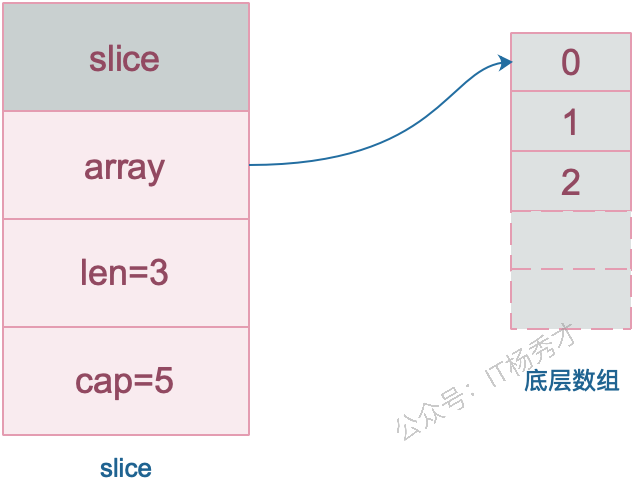
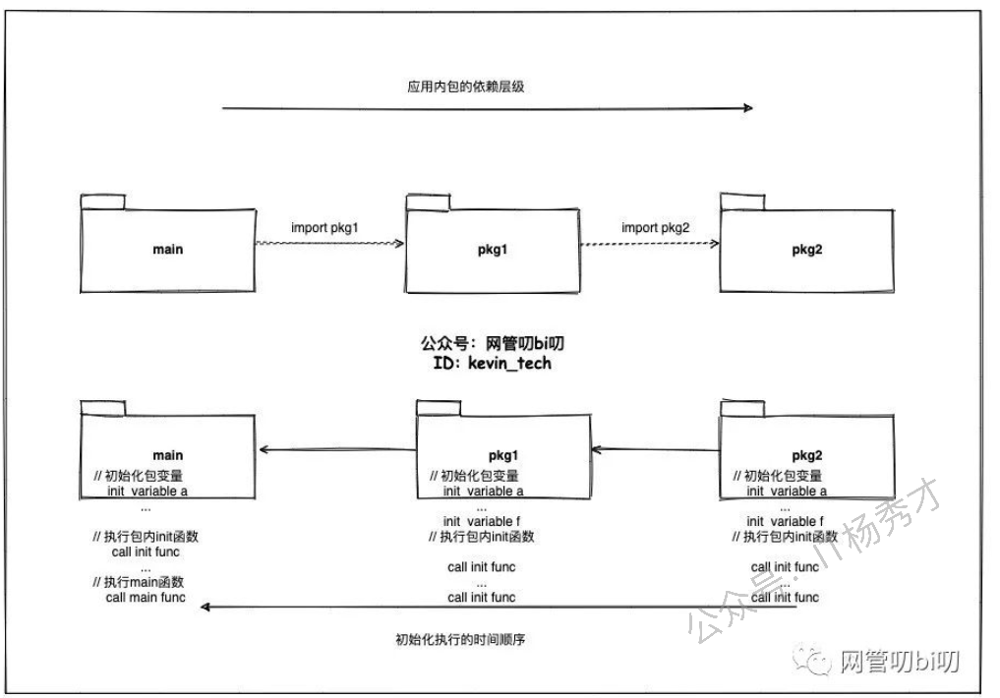
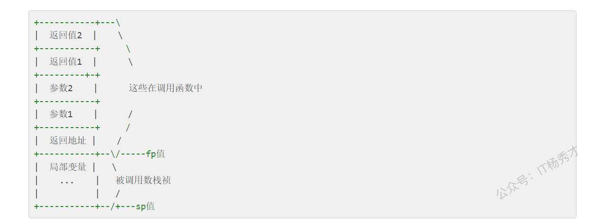

---
tags:
  - Go
  - golang
  - go语言基础
  - 面试题
  - 基础面试题
---

# 基础面试题

## 1. 与其他语言相比，使用 Go 有什么好处?

* 与其他语言不同，Go 代码的设计是务实的，Go的语法更简洁。每个功能和语法决策都旨在让程序员的开发效率更高

* Golang 针对并发进行了优化，支持协程，并且实现了高效的GMP调度模型。

* 由于单一的标准代码格式，Golang 通常被认为比其他语言更具可读性。

* 有高效的垃圾回收机制，支持并行垃圾回收，垃圾回收效率比比 Java 或 Python 更高

## 2. 什么是协程？

协程是用户态轻量级线程，它是线程调度的基本单位。通常在函数前加上go关键字就能实现并发。一个Goroutine会以一个很小的栈启动2KB或4KB，当遇到栈空间不足时，栈会自动伸缩， 因此可以轻易实现成千上万个goroutine同时启动。

## 3. 协程和线程和进程的区别？

* 进程:进程是具有一定独立功能的程序，进程是系统资源分配和调度的最小单位。 每个进程都有自己的独立内存空间，不同进程通过进程间通信来通信。由于进程比较重量，占据独立的内存，所以上下文进程间的切换开销（栈、寄存器、虚拟内存、文件句柄等）比较大，但相对比较稳定安全。

* 线程:线程是进程的一个实体,线程是内核态,而且是 CPU 调度和分派的基本单位,它是比进程更小的能独立运行的基本单位。线程间通信主要通过共享内存，上下文切换很快，资源开销较少，但相比进程不够稳定容易丢失数据。

* 协程:协程是一种用户态的轻量级线程，协程的调度完全是由用户来控制的。协程拥有自己的寄存器上下文和栈。 协程调度切换时，将寄存器上下文和栈保存到其他地方，在切回来的时候，恢复先前保存的寄存器上下文和栈，直接操作栈则基本没有内核切换的开销，可以不加锁的访问全局变量，所以上下文的切换非常快。

## 4. Golang 中 make 和 new 的区别？

**回答：**

`make` 和 `new` 都是用于内存分配的内建函数，但它们的使用场景和功能有所不同：

1. **`make`**：

   * 用于初始化并分配内存，只能用于创建 `slice`、`map` 和 `channel` 三种类型。

   * 返回的是初始化后的数据结构，而不是指针。

2. **`new`**：

   * 用于分配内存，但不初始化，返回的是指向该内存的指针。

   * 可以用于任何类型的内存分配。

**分析：**

```go
// 使用 make 创建 slice
s := make([]int, 5) // 创建一个长度为 5 的 slice
fmt.Println(s)      // 输出: [0 0 0 0 0]// 使用 new 创建 int 指针
p := new(int)       // 分配内存给 int 类型
fmt.Println(*p)     // 输出: 0 (初始值)
```

`make` 函数创建的是数据结构（`slice`、`map`、`channel`）本身，且返回初始化后的值。而`new` 函数创建的是可以指向任意类型的指针，返回指向未初始化零值的内存地址。

## 5. Golang 中数组和切片的区别？

**数组:&#x20;**

数组固定长度。数组长度是数组类型的一部分，所以\[3]int 和\[4]int 是两种不 同的数组类型数组需要指定大小，不指定也会根据初始化，自动推算出大小， 大小不可改变。数组是通过值传递的
**切片:&#x20;**

切片可以改变长度。切片是轻量级的数据结构，三个属性，指针，长度，容量 不需要指定大小切片是地址传递(引用传递)可以通过数组来初始化，也可以通过内置函数 make()来初始化，初始化的时候 len=cap，然后进行扩容&#x20;

**分析：**

slice 的底层数据其实也是数组，slice 是对数组的封装，它描述一个数组的片段。slice 实际上是一个结构体，包含三个字段：长度、容量、底层数组。

```go
// runtime/slice.go
type slice struct {
        array unsafe.Pointer // 元素指针
        len   int // 长度 
        cap   int // 容量
}
```



## 6. 使用for range 的时候，它的地址会发生变化吗？

在Go1.22之前，对于 `for range` 循环中的迭代变量，其内存地址是不会发生变化的。但是，Go1.22之后的地址是临时的，是变化的，不一样的，不再是共享内存了

**分析：**

Go1.22之前：

```go
for index, value := range collection {
    // ...
}
```

这里 `value` 是一个**副本**。在每次迭代中，`collection` 中的当前元素值会被**复制**到 `value` 这个变量中。Go 编译器通常会为 `value` 分配一块固定的内存地址，然后在每次迭代时，将当前元素的值覆盖到这块内存中。所以，当你打印 `&value` 时，你会发现它的内存地址在整个循环过程中都是保持不变的。

但是在Go1.23及以后，使用 `for range` 遍历一个集合时，**迭代变量的地址会发生变化**。这是因为 `for range` 每次迭代时都会重新生成迭代变量（如 `value`），这些变量在内存中是不同的地址

## 7. 如何高效地拼接字符串？

拼接字符串的方式有：`+` , `fmt.Sprintf` , [`strings.Builder`](https://zhida.zhihu.com/search?content_id=192906787\&content_type=Article\&match_order=1\&q=strings.Builder\&zhida_source=entity), [`bytes.Buffer`](https://zhida.zhihu.com/search?content_id=192906787\&content_type=Article\&match_order=1\&q=bytes.Buffer\&zhida_source=entity), `strings.Join`

1. &#x20;"+"

使用`+`操作符进行拼接时，会对字符串进行遍历，计算并开辟一个新的空间来存储原来的两个字符串。

2. &#x20;fmt.Sprintf

由于采用了接口参数，必须要用反射获取值，因此有性能损耗。

3. strings.Builder：

用WriteString()进行拼接，内部实现是指针+切片，同时String()返回拼接后的字符串，它是直接把\[]byte转换为string，从而避免变量拷贝。

4. bytes.Buffer

`bytes.Buffer`是一个一个缓冲`byte`类型的缓冲器，这个缓冲器里存放着都是`byte`，

`bytes.buffer`底层也是一个`[]byte`切片。

5.  strings.join

`strings.join`也是基于`strings.builder`来实现的,并且可以自定义分隔符，在join方法内调用了b.Grow(n)方法，这个是进行初步的容量分配，而前面计算的n的长度就是我们要拼接的slice的长度，因为我们传入切片长度固定，所以提前进行容量分配可以减少内存分配，很高效。

**性能比较：**

strings.Join ≈ strings.Builder > bytes.Buffer > "+" > fmt.Sprintf

5种拼接方法的实例代码

```go
func main(){
        a := []string{"a", "b", "c"}
        //方式1：+
        ret := a[0] + a[1] + a[2]
        //方式2：fmt.Sprintf
        ret := fmt.Sprintf("%s%s%s", a[0],a[1],a[2])
        //方式3：strings.Builder
        var sb strings.Builder
        sb.WriteString(a[0])
        sb.WriteString(a[1])
        sb.WriteString(a[2])
        ret := sb.String()
        //方式4：bytes.Buffer
        buf := new(bytes.Buffer)
        buf.Write(a[0])
        buf.Write(a[1])
        buf.Write(a[2])
        ret := buf.String()
        //方式5：strings.Join
        ret := strings.Join(a,"")
}
```

## 8.  defer 的执行顺序是怎样的？defer 的作用或者使用场景是什么?&#x20;

defer执行顺序和调用顺序相反，类似于栈后进先出(LIFO)

defer 的作用是：当 defer 语句被执行时，跟在 defer 后面的函数会被延迟执行。直到 包含该 defer 语句的函数执行完毕时，defer 后的函数才会被执行，不论包含 defer 语句的函数是通过 return 正常结束，还是由于 panic 导致的异常结束。 你可以在一个函数中执行多条 defer 语句，它们的执行顺序与声明顺序相反。&#x20;

defer 的常用场景:&#x20;

* defer语句经常被用于处理成对的操作，如打开、关闭、连接、断开连接、 加锁、释放锁。&#x20;

* 通过defer机制，不论函数逻辑多复杂，都能保证在任何执行路径下，资 源被释放。&#x20;

* 释放资源的defer应该直接跟在请求资源的语句后。&#x20;

**分析：**

```go
func test() int {
        i := 0
        defer func() {
                fmt.Println("defer1")
        }()
        defer func() {
                i += 1
                fmt.Println("defer2")
        }()
        return i
}

func main() {
        fmt.Println("return", test())
}

// 输出：
// defer2
// defer1
// return 0
```

上面这个例子中，test返回值并没有修改，这是由于Go的返回机制决定的，执行Return语句后，Go会创建一个临时变量保存返回值。如果是有名返回（也就是指明返回值`func test() (i int)`）

```go
func test() (i int) {
        i = 0
        defer func() {
                i += 1
                fmt.Println("defer2")
        }()
        return i
}

func main() {
        fmt.Println("return", test())
}
// 输出：
// defer2
// return 1

```

这个例子中，返回值被修改了。对于有名返回值的函数，执行 return 语句时，并不会再创建临时变量保存，因此，defer 语句修改了 i，即对返回值产生了影响。

## 9. 什么是 rune 类型？

Go 语言的字符有以下两种：

* uint8 类型，或者叫 byte 型，代表了 ASCII 码的一个字符。

* rune 类型，代表一个 UTF-8 字符，当需要处理中文、日文或者其他复合字符时，则需要用到 rune 类型。rune 类型等价于 int32 类型。

```go
package main
import "fmt"

func main() {
    var str = "hello 你好" //思考下 len(str) 的长度是多少？
    
    //golang中string底层是通过byte数组实现的，直接求len 实际是在按字节长度计算  
    //所以一个汉字占3个字节算了3个长度
    fmt.Println("len(str):", len(str))  // len(str): 12

    //通过rune类型处理unicode字符
    fmt.Println("rune:", len([]rune(str))) //rune: 8
}
```

## 10. Go 语言 tag 有什么用？

tag可以为结构体成员提供属性。常见的：

1. json序列化或反序列化时字段的名称

2. db: sqlx模块中对应的数据库字段名

3. form: gin框架中对应的前端的数据字段名

4. binding: 搭配 form 使用, 默认如果没查找到结构体中的某个字段则不报错值为空, binding为 required 代表没找到返回错误给前端

## 11. go 打印时 %v %+v %#v 的区别？

* %v 只输出所有的值；

* %+v 先输出字段名字，再输出该字段的值；

* %#v 先输出结构体名字值，再输出结构体（字段名字+字段的值）；

```go
package main
import "fmt"
 
type student struct {
  id   int32
  name string
}
 
func main() {
  a := &student{id: 1, name: "微客鸟窝"}

  fmt.Printf("a=%v  \n", a) // a=&{1 微客鸟窝}  
  fmt.Printf("a=%+v  \n", a) // a=&{id:1 name:微客鸟窝}  
  fmt.Printf("a=%#v  \n", a) // a=&main.student{id:1, name:"微客鸟窝"}
}
```

## 12. Go语言中空 struct{} 占用空间么？

可以使用 unsafe.Sizeof 计算出一个数据类型实例需要占用的字节数，空struct{}不占用任何空间

```go
package main

import (
  "fmt"
  "unsafe"
)

func main() {
  fmt.Println(unsafe.Sizeof(struct{}{}))  //0
}
```

## 13. Go语言中，空 struct{} 有什么用？

* 用map模拟一个set，那么就要把值置为struct{}，struct{}本身不占任何空间，可以避免任何多余的内存分配。

```go
type Set map[string]struct{}

func main() {
        set := make(Set)

        for _, item := range []string{"A", "A", "B", "C"} {
                set[item] = struct{}{}
        }
        fmt.Println(len(set)) // 3
        if _, ok := set["A"]; ok {
                fmt.Println("A exists") // A exists
        }
}
```

* 有时候给通道发送一个空结构体,channel<-struct{}{}，可以节省空间

```go
func main() {
        ch := make(chan struct{}, 1)
        go func() {
                <-ch
                // do something
        }()
        ch <- struct{}{}
        // ...
}
```

* 表示仅有方法的结构体

```go
type Lamp struct{}
```

## 14. init() 函数是什么时候执行的？

**简答：** 在main函数之前执行。

**详细：**&#x69;nit()函数是go初始化的一部分，由runtime初始化每个导入的包，初始化不是按照从上到下的导入顺序，而是按照解析的依赖关系，没有依赖的包最先初始化。

每个包首先初始化包作用域的常量和变量（常量优先于变量），然后执行包的`init()`函数。同一个包，甚至是同一个源文件可以有多个`init()`函数。`init()`函数没有入参和返回值，不能被其他函数调用，同一个包内多个`init()`函数的执行顺序不作保证。

执行顺序：import –> const –> var –>`init()`–>`main()`

一个文件可以有多个`init()`函数！



## 15. 2 个 interface 可以比较吗 ？

Go 语言中，interface 的内部实现包含了 2 个字段，类型 `T` 和 值 `V`，interface 可以使用 `==` 或 `!=` 比较。2 个 interface 相等有以下 2 种情况

1. 两个 interface 均等于 nil（此时 V 和 T 都处于 unset 状态）

2. 类型 T 相同，且对应的值 V 相等。

```go
type Stu struct {
     Name string
}

type StuInt interface{}

func main() {
     var stu1, stu2 StuInt = &Stu{"Tom"}, &Stu{"Tom"}
     var stu3, stu4 StuInt = Stu{"Tom"}, Stu{"Tom"}
     fmt.Println(stu1 == stu2) // false
     fmt.Println(stu3 == stu4) // true
}
```

`stu1` 和 `stu2` 对应的类型是 `*Stu`，值是 Stu 结构体的地址，两个地址不同，因此结果为 false。
`stu3` 和 `stu4` 对应的类型是 `Stu`，值是 Stu 结构体，且各字段相等，因此结果为 true。

## 16. 2 个 nil 可能不相等吗？

可能不等。interface在运行时绑定值，只有值为nil接口值才为nil，但是与指针的nil不相等。举个例子：

```go
var p *int = nil
var i interface{} = nil
if(p == i){
        fmt.Println("Equal")
}
```

两者并不相同。总结：两个nil只有在类型相同时才相等。

## 17. Go 语言函数传参是值类型还是引用类型？

* 在 Go 语言中只存在值传递，要么是值的副本，要么是指针的副本。无论是值类型的变量还是引用类型的变量亦或是指针类型的变量作为参数传递都会发生值拷贝，开辟新的内存空间。

* 另外值传递、引用传递和值类型、引用类型是两个不同的概念，不要混淆了。引用类型作为变量传递可以影响到函数外部是因为发生值拷贝后新旧变量指向了相同的内存地址。

# 18. 如何知道一个对象是分配在栈上还是堆上？

Go和C++不同，Go局部变量会进行逃逸分析。如果变量离开作用域后没有被引用，则优先分配到栈上，否则分配到堆上。那么如何判断是否发生了逃逸呢？

`go build -gcflags '-m -m -l' xxx.go`.

关于逃逸的可能情况：变量大小不确定，变量类型不确定，变量分配的内存超过用户栈最大值，暴露给了外部指针。

## 19. Go语言的多返回值是如何实现的？

Go 语言的多返回值是通过在函数调用栈帧上预留空间并进行**值复制**来实现的。在函数调用发生时，Go 编译器会计算出函数所有返回值的总大小。在为该函数创建**栈帧**时，就会在调用方（caller）的栈帧上，为这些返回值预留出连续的内存空间。

当函数执行到 `return` 语句时，它会将其要返回的各个值**复制**到这些预留好的栈空间中。函数执行完毕后，控制权返回给调用方。此时，调用方可以直接从它自己的栈帧上（即之前为返回值预留的空间）获取这些返回的值。



## 20. Go语言中"\_"的作用

1. 忽略多返回值：在 Go 语言中，函数可以返回多个值。如果你只关心其中的一部分返回值，而不需要使用其余的，就可以用 `_` 来忽略它们，从而避免编译器报错

2. 当你导入一个包时，通常会使用它的某个功能。但有时你可能只想执行包的 `init()` 函数（例如，注册驱动、初始化全局变量等），而不需要直接使用包中的任何导出成员。这时，你就可以使用 `_` 来进行**匿名导入**

示例：

```go
package main

import (
        "fmt"
        _ "net/http/pprof" // 导入 pprof 包，只为了执行其 init 函数注册 profiling 接口
)

func main() {
        fmt.Println("Application started. Profiling tools are likely registered.")
        // 实际应用中，你可能还会启动一个 HTTP 服务器来暴露 pprof 接口
        // go func() {
        //         log.Println(http.ListenAndServe("localhost:6060", nil))
        // }()
}
```

## 21. Go语言普通指针和unsafe.Pointer有什么区别？

普通指针比如`*int`、`*string`，它们有明确的类型信息，编译器会进行类型检查和垃圾回收跟踪。不同类型的指针之间不能直接转换，这是Go类型安全的体现。

而**unsafe.Pointer**是Go的通用指针类型，可以理解为C语言中的`void*`，它绕过了Go的类型系统。unsafe.Pointer可以与任意类型的指针相互转换，也可以与uintptr进行转换来做指针运算。

另外，通指针受GC管理和类型约束，unsafe.Pointer不受类型约束但仍受GC跟踪

## 22. unsafe.Pointer与uintptr有什么区别和联系

unsafe.Pointer和uintptr可以相互转换，这是Go提供的唯一合法的指针运算方式。典型用法是先将unsafe.Pointer转为uintptr做算术运算，然后再转回unsafe.Pointer使用。

最关键的区别在于**GC跟踪**。unsafe.Pointer会被垃圾回收器跟踪，它指向的内存不会被错误回收；而uintptr只是一个普通整数，GC完全不知道它指向什么，如果没有其他引用，对应内存可能随时被回收。

所以记住：unsafe.Pointer有GC保护，uintptr没有，这是它们最本质的区别。
