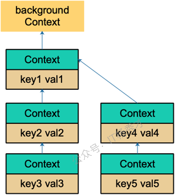
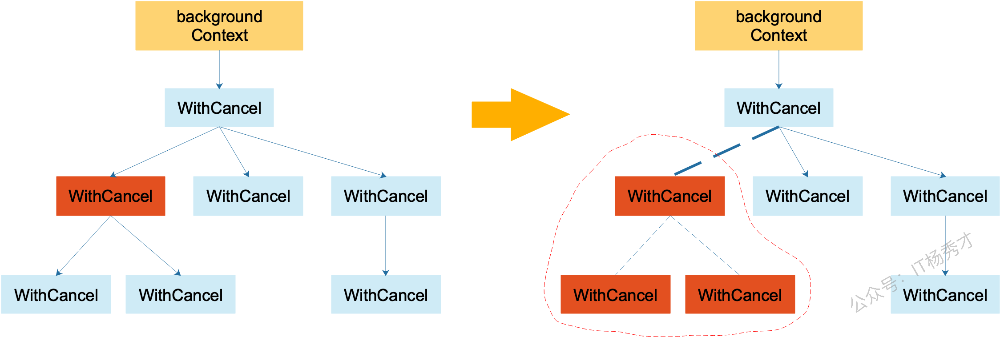

---
tags:
  - Go
  - golang
  - context
  - 面试题
  - context面试题
---

# Context面试题

## 1. Go语言里的Context是什么？

go语言里的context实际上是一个接口，提供了Deadline()，Done()，Err()以及Value()四种方法。它在Go 1.7 标准库被引入。

它本质上是一个**信号传递和范围控制的工具**。它的核心作用是在一个请求处理链路中（跨越多个函数和goroutine），优雅地传递**取消信号（cancellation）、超时（timeout）和截止日期（deadline）**，并能携带一些范围内的键值对数据。

**分析**

```go
type Context interface {
    Deadline() (deadline time.Time, ok bool)  // Deadline方法的第一个返回值表示还有多久到            期， 第二个返回值代表是否被超时时间控制
    Done() <-chan struct{}  // Done() 返回一个 只读channel，当这个channel被关闭时，说明这个            context被取消
    Err() error // Err() 返回一个错误，表示channel被关闭的原因，例如是被取消，还是超时关闭
    Value(key interface{}) interface{}) // value方法返回指定key对应的value，这是context携带           的值
}
```

这个接口定义了四个核心方法，它们共同构成了一套关于**截止时间、取消信号和请求范围值**的协定：

* `Deadline()` - 返回一个时间点，告知任务何时应该被取消。

* `Done()` - 返回一个channel，当`Context`被取消或超时，这个channel会被关闭。这是goroutine监听取消信号的核心。

* `Err()` - 在`Done()`的channel关闭后，它会解释关闭的原因，是主动取消（`Canceled`）还是超时（`DeadlineExceeded`）。

* `Value()` - 允许`Context`在调用链中携带请求范围的键值对数据。

## 2. Go语言的Context有什么作用？

Go的Context主要解决三个核心问题：**超时控制、取消信号传播和请求级数据传递**

在实际项目中，我们最常用的是超时控制。比如一个HTTP请求需要调用多个下游服务，我们通过`context.WithTimeout`设置整体超时时间，当超时发生时，所有子操作都会收到取消信号并立即退出，避免资源浪费。取消信号的传播是通过Context的层级结构实现的，父Context取消时，所有子Context都会自动取消。

另外Context还能传递请求级的元数据，比如用户ID、请求ID等，这在分布式链路追踪中特别有用。需要注意的是，Context应该作为函数的第一个参数传递，不要存储在结构体中，并且传递的数据应该是请求级别的，不要滥用。


## 3. Context.Value的查找过程是怎样的

Context.Value的查找过程是一个**链式递归查找的过程**，从当前Context开始，沿着父Context链一直向上查找直到找到对应的key或者到达根Context。

具体流程是：当调用`ctx.Value(key)`时，首先检查当前Context是否包含这个key，如果当前层没有，就会调用`parent.Value(key)`继续向上查找。这个过程会一直递归下去，直到找到匹配的key返回对应的value，或者查找到根Context返回nil。



## 4. Context如何被取消

Context的取消是通过**channel关闭信号**实现的，主要有三种取消方式。

首先是**主动取消**，通过`context.WithCancel`创建的Context会返回一个cancel函数，调用这个函数就会关闭内部的done channel，所有监听这个Context的goroutine都能通过`ctx.Done()`收到取消信号。

其次是**超时取消**，`context.WithTimeout`和`context.WithDeadline`会启动一个定时器，到达指定时间后自动调用cancel函数触发取消。

最后是**级联取消**，当父Context被取消时，所有子Context会自动被取消，这是通过Context树的结构实现的。



<div style="background-color: #f0f9eb; padding: 10px 15px; border-radius: 4px; border-left: 5px solid #67c23a; margin: 20px 0; color:rgb(64, 147, 255);">

<h1><span style="color: #006400;"><strong>关注秀才公众号：</strong></span><span style="color: red;"><strong>IT杨秀才</strong></span><span style="color: #006400;"><strong>，领取精品学习资料</strong></span></h1>

<div style="color: #333; font-family: 'Microsoft YaHei', Arial, sans-serif; font-size: 14px;">
<ul>
<li><strong><span style="color: #006400;">公众号后台回复：</span><span style="color: red;">Go面试</span><span style="color: #006400;">，领取Go面试题库PDF</span></strong></li>
<li><strong><span style="color: #006400;">公众号后台回复：</span><span style="color: red;">Go学习</span><span style="color: #006400;">，领取Go必看书籍</span></strong></li>
<li><strong><span style="color: #006400;">公众号后台回复：</span><span style="color: red;">大模型</span><span style="color: #006400;">，领取大模型学习资料</span></strong></li>
<li><strong><span style="color: #006400;">公众号后台回复：</span><span style="color: red;">111</span><span style="color: #006400;">，领取架构学习资料</span></strong></li>
<li><strong><span style="color: #006400;">公众号后台回复：</span><span style="color: red;">26届秋招</span><span style="color: #006400;">，领取26届秋招企业汇总表</span></strong></li>
</ul>
</div>


</div> 