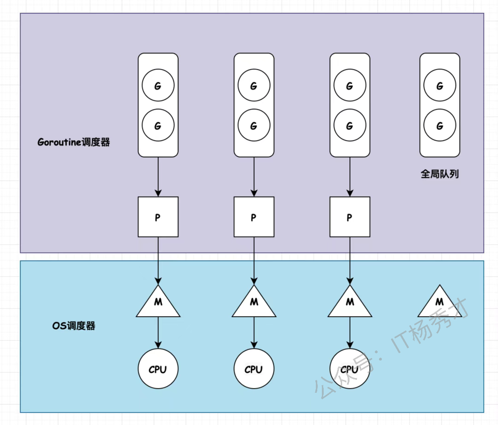
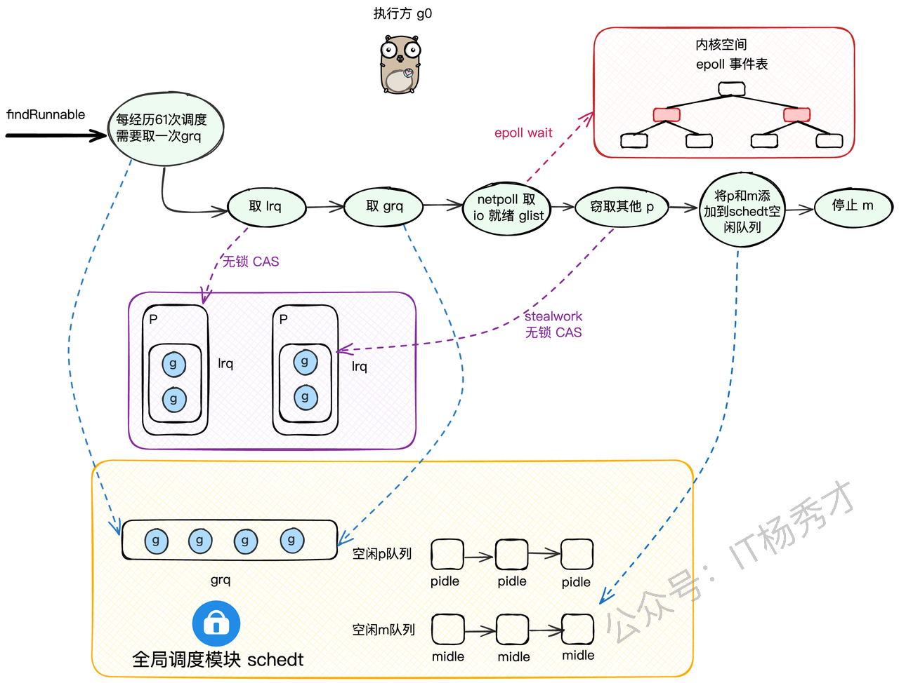

---
tags:
  - Go
  - golang
  - GMP
  - 面试题
  - GMP面试题
---

# GMP面试题

## 1. Go语言的GMP模型是什么？

GMP是Go运行时的核心调度模型

**GMP含义**：G是goroutine协程；M是machine系统线程，真正干活的；P是processor，逻辑处理器，它是G和M之间的桥梁。它负责调度G

调度逻辑是这样的，M必须绑定P才能执行G。每个P维护一个自己的本地G队列（长度256），M从P的本地队列取G执行。当本地队列空时，M会按优先级从**全局队列、网络轮询器、其他P队列**中窃取goroutine，这是work-stealing机制。

就是这个模型让Go能在少量线程上调度海量goroutine，是Go高并发的基础。



## 2. 什么是Go scheduler

Go scheduler就是Go运行时的**协程调度器**，负责在系统线程上调度执行goroutine。它 是 Go runtime 的一部分，它内嵌在 Go 程序里，和 Go 程序一起运行。它的主要工作是决定哪个goroutine在哪个线程上运行，以及何时进行上下文切换。scheduler的核心是`schedule()`函数，它在无限循环中寻找可运行的goroutine。当找到后通过`execute()`函数切换到goroutine执行，goroutine主动让出或被抢占时再回到调度循环。

## 3. Go语言在进行goroutine调度的时候，调度策略是怎样的？

Go语言采用的是抢占式调度策略。Go 会启动一个线程，一直运行着“sysmon”函数，sysmon 运行在 M上，且不需要P。当 sysmon 发现 M 已运行同一个 G（Goroutine）10ms 以上时，它会将该 G 的内部参数 `preempt` 设置为 true，表示需要被抢占，让出CPU了。只是在Go 1.14之前和Go 1.14之后有所不同

**Go 1.14之前**：调度策略是“协作式”抢占调度，这种调度方式主要是通过函数调用来实现的，在编译期，编译器会在几乎所有的函数调用的入口处，插入一小段检查代码。这段代码会检查当前goroutine是否已经被标记为需要被抢占。如果是，当 G 进行函数调用时，G 会检查自己的 `preempt` 标志，如果它为 true，则它将自己与 M 分离并推入goroutine的全局队列，抢占完成。但这种模式有个明显的缺陷：如果一个goroutine执行了一个不包含任何函数调用的**超大循环**，那么调度器的“抢占”标记就永远得不到检查，这个goroutine就会一直霸占着M，导致同一个P队列里的其他G全都没机会执行，造成**调度延迟**。

**Go 1.14之后**：调度策略**基于信号的异步抢占**机制，sysmon 会检测到运行了 10ms 以上的 G（goroutine）。然后，sysmon 向运行 G 的 M发送信号（SIGURG）。Go 的信号处理程序会调用M上的一个叫作 gsignal 的 goroutine 来处理该信号，并使其检查该信号。gsignal 看到抢占信号，停止正在运行的 G。

## 4. 发生调度的时机有哪些？

* 等待读取或写入未缓冲的通道

* 由于 time.Sleep() 而等待

* 等待互斥量释放

* 发生系统调用

## 5. M寻找可运行G的过程是怎样的？

**M会优先检查本地队列（LRQ）**：从当前P的LRQ里`runqget`一个G。（无锁CAS），如果本地队列没有可运行G，**再次检查全局队列（GRQ）**&#x53BB;全局队列里`globrunqget`找。（需要加锁）；如果还没有，就**检查网络轮询器（netpoll），**&#x5C31;去`netpoll`里看看有没有因为网络IO就绪的G。（非阻塞模式），依然没有获取到可运行G，则会**从别的P偷（steal work），这个偷的过程是**随机找一个别的P，从它的LRQ里偷一半的G过来。



## 6. GMP能不能去掉P层？会怎么样？

GMP中的P层理论上可以去掉，但会带来严重的性能问题。

**掉P的后果**：如果直接变成GM模型，所有M都需要从**全局队列**中获取goroutine，这就需要全局锁保护。在高并发场景下，大量M争抢同一把锁会造成严重的**锁竞争**，CPU大部分时间都浪费在等锁上，调度效率急剧下降。

**P层的价值**：P的存在实现了**无锁的本地调度**。每个P维护独立的本地队列，M绑定P后可以直接从本地队列取G执行，大部分情况下都不需要全局锁。只有本地队列空了才去偷取，这大大减少了锁竞争。

## 7. P和M在什么时候会被创建？

**P的创建时机**：P在调度器初始化时**一次性创建**。在`schedinit()`函数中会调用`procresize()`，根据`GOMAXPROCS`值创建对应数量的P对象，存储在全局的`allp`数组中。之后P的数量基本固定，只有在调用`runtime.GOMAXPROCS()`动态调整时才会重新分配P。

**M的创建时机**：M采用**按需创建**策略。初始只有m0存在，当出现以下情况时会创建新的M：

* 所有现有M都在执行阻塞的系统调用，但还有可运行的goroutine需要执行

* 通过`startm()`函数发现没有空闲M可以绑定P执行goroutine

* M的数量受`GOMAXTHREADS`限制，默认10000个

**创建流程**：新M通过`newm()`函数创建，它会调用`newosproc()`创建新的系统线程，并为这个M分配独立的g0。创建完成后，新M会进入`mstart()`开始调度循环。

## 8. m0是什么，有什么用

m0是在Go启动时创建的第一个M，m0对应程序启动时的主系统线程，它在Go程序的整个生命周期中都存在。与其他通过`runtime.newm()`动态创建的M不同，m0是在程序初始化阶段静态分配的，有专门的全局变量存储。

m0主要负责执行Go程序的**启动流程**，包括调度器初始化、内存管理器初始化、垃圾回收器设置等。它会创建并运行第一个用户goroutine来执行`main.main`函数。在程序运行期间，m0也参与正常的goroutine调度，和其他M没有本质区别。m0在程序退出时还负责处理清理工作，比如等待其他goroutine结束、执行defer函数等。


## 9. g0是一个怎样的协程，有什么用？

g0是一个特殊的goroutine，不是普通的用户协程，而是**调度协程**，每个M都有自己的g0。它使用系统线程的原始栈空间，而不是像普通goroutine那样使用可增长的分段栈。g0的栈大小通常是8KB，比普通goroutine的2KB初始栈要大。

**核心作用**：g0专门负责**执行调度逻辑**，包括goroutine的创建、销毁、调度决策等。当M需要进行调度时，会从当前运行的用户goroutine切换到g0上执行`schedule()`函数。g0还负责处理垃圾回收、栈扫描、信号处理等运行时操作。

**运行机制**：正常情况下M在用户goroutine上运行用户代码，当发生调度事件时（如goroutine阻塞、抢占、系统调用返回等），M会切换到g0执行调度器代码，选出下一个要运行的goroutine后再切换过去。

**为什么需要g0**：因为调度器代码不能在普通goroutine的栈上执行，那样会有栈空间冲突和递归调度的问题。g0提供了一个独立的执行环境，确保调度器能安全稳定地工作。

## 10. g0栈和用户栈是如何进行切换的？

g0和用户goroutine之间的栈切换，本质是**SP寄存器和栈指针的切换。**&#x5F53;用户goroutine需要调度时，通过`mcall()`函数切换到g0。这个过程会保存当前用户goroutine的PC、SP等寄存器到其gobuf中，然后将SP指向g0的栈，PC指向传入的调度函数。调度完成后，通过`gogo()`函数从g0切换回用户goroutine，恢复其保存的寄存器状态。

切换逻辑在汇编文件中实现，比如`runtime·mcall`和`runtime·gogo`。这些函数直接操作CPU寄存器，确保切换的原子性和高效性。切换过程中会更新g.sched字段记录goroutine状态。

**分析：**

goroutine的结构如下：

```go
structG
{
    uintptr    stackguard;    // 分段栈的可用空间下界
    uintptr    stackbase;     // 分段栈的栈基址
    Gobuf    sched;           //协程切换时，利用sched域来保存上下文
    uintptr    stack0; 
    FuncVal*    fnstart;        // goroutine运行的函数void*    param;        // 用于传递参数，睡眠时其它goroutine设置param，唤醒时此goroutine可以获取
    int16    status;          // 状态    Gidle,Grunnable,Grunning,Gsyscall,Gwaiting,Gdead
    int64    goid;            // goroutine的id号
    G*    schedlink;
    M*    m;                  // for debuggers, but offset not hard-coded
    M*    lockedm;            // G被锁定只能在这个m上运行
    uintptr    gopc;          // 创建这个goroutine的go表达式的pc...
 };
```

<div style="background-color: #f0f9eb; padding: 10px 15px; border-radius: 4px; border-left: 5px solid #67c23a; margin: 20px 0; color:rgb(64, 147, 255);">

<h1><span style="color: #006400;"><strong>关注秀才公众号：</strong></span><span style="color: red;"><strong>IT杨秀才</strong></span><span style="color: #006400;"><strong>，领取精品学习资料</strong></span></h1>

<div style="color: #333; font-family: 'Microsoft YaHei', Arial, sans-serif; font-size: 14px;">
<ul>
<li><strong><span style="color: #006400;">公众号后台回复：</span><span style="color: red;">Go面试</span><span style="color: #006400;">，领取Go面试题库PDF</span></strong></li>
<li><strong><span style="color: #006400;">公众号后台回复：</span><span style="color: red;">Go学习</span><span style="color: #006400;">，领取Go必看书籍</span></strong></li>
<li><strong><span style="color: #006400;">公众号后台回复：</span><span style="color: red;">大模型</span><span style="color: #006400;">，领取大模型学习资料</span></strong></li>
<li><strong><span style="color: #006400;">公众号后台回复：</span><span style="color: red;">111</span><span style="color: #006400;">，领取架构学习资料</span></strong></li>
<li><strong><span style="color: #006400;">公众号后台回复：</span><span style="color: red;">26届秋招</span><span style="color: #006400;">，领取26届秋招企业汇总表</span></strong></li>
</ul>
</div>


</div> 