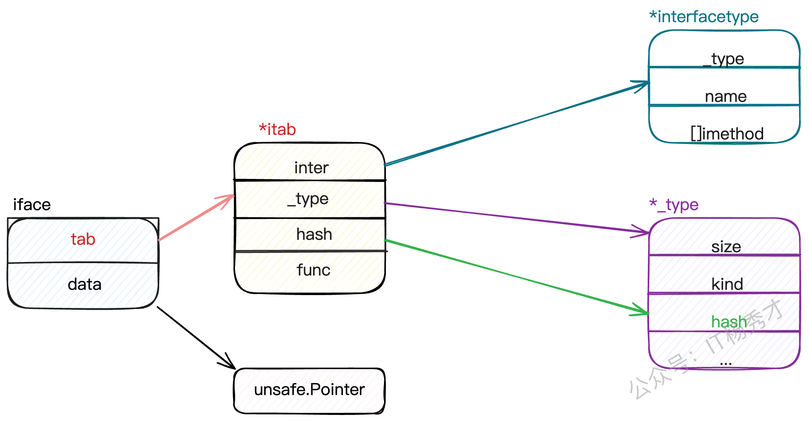

---
tags:
  - Go
  - golang
  - interface
  - 面试题
  - interface面试题
---

# Interface面试题

## 1. Go语言中，interface的底层原理是怎样的？

Go的interface底层有两种数据结构：**eface和iface**。

**eface是空interface{}的实现**，只包含两个指针：`_type`指向类型信息，`data`指向实际数据。这就是为什么空接口能存储任意类型值的原因，通过类型指针来标识具体类型，通过数据指针来访问实际值。

**iface是带方法的interface实现**，包含`itab`和`data`两部分。`itab`是核心，它存储了接口类型、具体类型，以及方法表。方法表是个函数指针数组，保存了该类型实现的所有接口方法的地址。

**分析：**

eface定义：

```go
type eface struct {
   _type *_type
   data  unsafe.Pointer
}
```


iface定义：

```go
type iface struct {
   tab  *itab
   data unsafe.Pointer
}
```

其中itab的结构定义如下：

```go
type itab struct {
   inter *interfacetype
   _type *_type
   hash  uint32 // copy of _type.hash. Used for type switches.
   _     [4]byte
   fun   [1]uintptr // variable sized. fun[0]==0 means _type does not implement inter.
}
```



## 2. iface和eface的区别是什么？

iface和eface的核心区别在于是否包含方法信息。

eface是空接口interface{}的底层实现，结构非常简单，只有两个字段：`_type`指向类型信息，`data`指向实际数据。因为空接口没有方法约束，所以不需要存储方法相关信息。

iface是非空接口的底层实现，结构相对复杂，包含`itab`和`data`。关键是这个`itab`，它不仅包含类型信息，还包含了一个方法表，存储着该类型实现的所有接口方法的函数指针。

## 3. 类型转换和断言的区别是什么？

`类型转换`、`类型断言`本质都是把一个类型转换成另外一个类型。不同之处在于，类型断言是对接口变量进行的操作。对于**类型转换**而言，类型转换是在编译期确定的强制转换，转换前后的两个类型要相互兼容才行，语法是`T(value)`。而**类型断言**是运行期的动态检查，专门用于从接口类型中提取具体类型，语法是`value.(T)`

**安全性差别很大**：类型转换在编译期保证安全性，而类型断言可能在运行时失败。所以实际开发中更常用安全版本的类型断言`value, ok := x.(string)`，通过ok判断是否成功。

**使用场景不同**：类型转换主要解决数值类型、字符串、切片等之间的转换问题；类型断言主要用于接口编程，当你拿到一个interface{}需要还原成具体类型时使用。

**底层实现也不同**：类型转换通常是简单的内存重新解释或者数据格式调整；类型断言需要检查接口的底层类型信息，涉及到runtime的类型系统。

## 4. Go语言interface有哪些应用场景

Go语言的interface主要有几个核心应用场景：

1. **依赖注入和解耦**。通过定义接口抽象，让高层模块不依赖具体实现，比如定义一个`UserRepo`接口，具体可以是MySQL、Redis或者Mock实现。这样代码更容易测试和维护，也符合SOLID原则。

2. **多态实现**。比如定义一个`Shape`接口包含`Area()`方法，不同的图形结构体实现这个接口，就能用统一的方式处理各种图形。这让代码更加灵活和可扩展。

3. **标准库中大量使用interface来提供统一API**。像`io.Reader`、`io.Writer`让文件、网络连接、字符串等都能用统一的方式操作；`sort.Interface`让任意类型都能使用标准库的排序算法。

4. **还有类型断言和反射的配合使用**，比如JSON解析、ORM映射等场景，先用`interface{}`接收任意类型，再通过类型断言或反射处理具体逻辑。

5. **插件化架构也heavily依赖interface**。比如Web框架的中间件、数据库驱动、日志组件等，都通过接口定义规范，让第三方能够轻松扩展功能。

## 5. 接口之间可以相互比较吗？

1. 接口值之间可以使用 `==`和 `!＝`来进行比较。两个接口值相等仅当它们都是nil值，或者它们的动态类型相同并且动态值也根据这个动态类型的==操作相等。如果两个接口值的动态类型相同，但是这个动态类型是不可比较的（比如切片），将它们进行比较就会失败并且panic。

2. 接口值在与非接口值比较时，Go会先将非接口值尝试转换为接口值，再比较。

3. 接口值很特别，其它类型要么是可比较类型（如基本类型和指针）要么是不可比较类型（如切片，映射类型，和函数），但是接口值视具体的类型和值，可能会报出潜在的panic。

**分析：**

接口类型和 `nil` 作比较

接口值的零值是指`动态类型`和`动态值`都为 `nil`。当仅且当这两部分的值都为 `nil` 的情况下，这个接口值就才会被认为 `接口值 == nil`。

```go
package main

import "fmt"

type Coder interface {
        code()
}

type Gopher struct {
        name string
}

func (g Gopher) code() {
        fmt.Printf("%s is coding\n", g.name)
}

func main() {
        var c Coder
        fmt.Println(c == nil)
        fmt.Printf("c: %T, %v\n", c, c)

        var g *Gopher
        fmt.Println(g == nil)

        c = g
        fmt.Println(c == nil)
        fmt.Printf("c: %T, %v\n", c, c)
}

```

程序输出：

```go
true
c: <nil>, <nil>
true
false
c: *main.Gopher, <nil>
```

一开始，`c` 的 动态类型和动态值都为 `nil`，`g` 也为 `nil`，当把 `g` 赋值给 `c` 后，`c` 的动态类型变成了 `*main.Gopher`，仅管 `c` 的动态值仍为 `nil`，但是当 `c` 和 `nil` 作比较的时候，结果就是 `false` 了。

<div style="background-color: #f0f9eb; padding: 10px 15px; border-radius: 4px; border-left: 5px solid #67c23a; margin: 20px 0; color:rgb(64, 147, 255);">

<h1><span style="color: #006400;"><strong>关注秀才公众号：</strong></span><span style="color: red;"><strong>IT杨秀才</strong></span><span style="color: #006400;"><strong>，领取精品学习资料</strong></span></h1>

<div style="color: #333; font-family: 'Microsoft YaHei', Arial, sans-serif; font-size: 14px;">
<ul>
<li><strong><span style="color: #006400;">公众号后台回复：</span><span style="color: red;">Go面试</span><span style="color: #006400;">，领取Go面试题库PDF</span></strong></li>
<li><strong><span style="color: #006400;">公众号后台回复：</span><span style="color: red;">Go学习</span><span style="color: #006400;">，领取Go必看书籍</span></strong></li>
<li><strong><span style="color: #006400;">公众号后台回复：</span><span style="color: red;">大模型</span><span style="color: #006400;">，领取大模型学习资料</span></strong></li>
<li><strong><span style="color: #006400;">公众号后台回复：</span><span style="color: red;">111</span><span style="color: #006400;">，领取架构学习资料</span></strong></li>
<li><strong><span style="color: #006400;">公众号后台回复：</span><span style="color: red;">26届秋招</span><span style="color: #006400;">，领取26届秋招企业汇总表</span></strong></li>
</ul>
</div>


</div> 