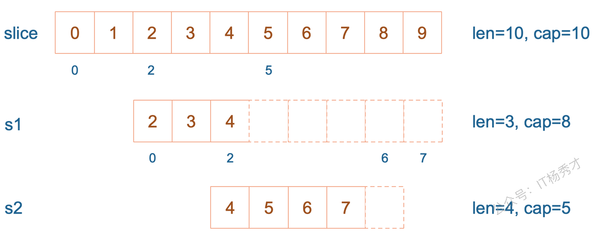
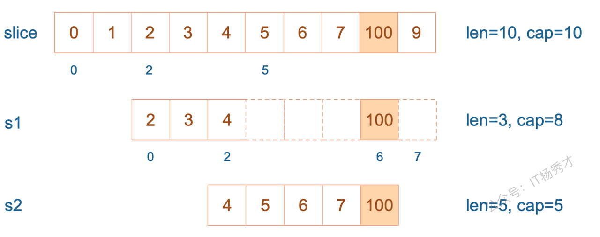
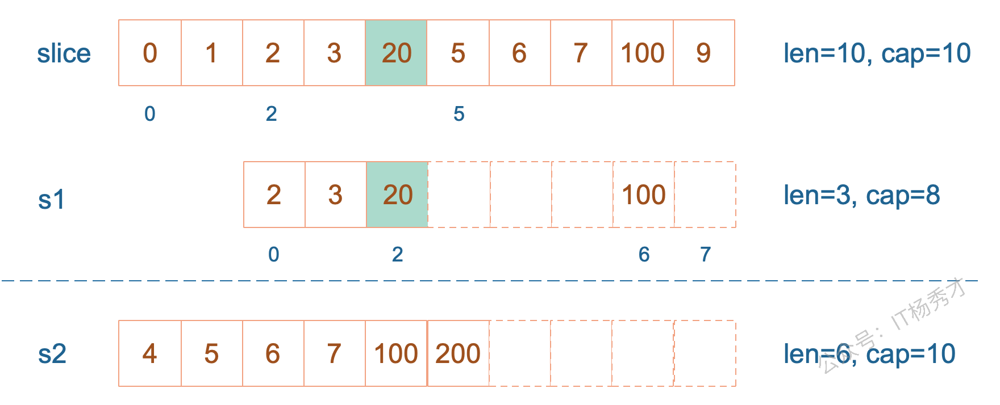

---
tags:
  - Go
  - golang
  - 切片
  - 面试题
  - slice面试题
---

# Slice面试题

## 1. slice的底层结构是怎样的？

slice 的底层数据其实也是数组，slice 是对数组的封装，它描述一个数组的片段。slice 实际上是一个结构体，包含三个字段：长度、容量、底层数组。


```go
// runtime/slice.go
type slice struct {
        array unsafe.Pointer // 元素指针
        len   int // 长度 
        cap   int // 容量
}
```


## 2. Go语言里slice是怎么扩容的？

1.17及以前

1. 如果期望容量大于当前容量的两倍就会使用期望容量；

2. 如果当前切片的长度小于 1024 就会将容量翻倍；

3. 如果当前切片的长度大于 1024 就会每次增加 25% 的容量，直到新容量大于期望容量；

Go1.18及以后，引入了新的扩容规则：

当原slice容量(oldcap)小于256的时候，新slice(newcap)容量为原来的2倍；原slice容量超过256，新slice容量newcap = oldcap+(oldcap+3\*256)/4

## 3. 从一个切片截取出另一个切片，修改新切片的值会影响原来的切片内容吗

在截取完之后，如果新切片没有触发扩容，则修改切片元素会影响原切片，如果触发了扩容则不会。

示例：

```go
package main

import "fmt"func main() {
        slice := []int{0, 1, 2, 3, 4, 5, 6, 7, 8, 9}
        s1 := slice[2:5]
        s2 := s1[2:6:7]

        s2 = append(s2, 100)
        s2 = append(s2, 200)

        s1[2] = 20

        fmt.Println(s1)
        fmt.Println(s2)
        fmt.Println(slice)
}
```

运行结果：

```shell
[2 3 20]
[4 5 6 7 100 200]
[0 1 2 3 20 5 6 7 100 9]
```

`s1` 从 `slice` 索引2（闭区间）到索引5（开区间，元素真正取到索引4），长度为3，容量默认到数组结尾，为8。 `s2` 从 `s1` 的索引2（闭区间）到索引6（开区间，元素真正取到索引5），容量到索引7（开区间，真正到索引6），为5。



接着，向 `s2` 尾部追加一个元素 100：

```go
s2 = append(s2, 100)
```

`s2` 容量刚好够，直接追加。不过，这会修改原始数组对应位置的元素。这一改动，数组和 `s1` 都可以看得到。



再次向 `s2` 追加元素200

```go
s2 = append(s2, 200)
```

这时，`s2` 的容量不够用，该扩容了。于是，`s2` 另起炉灶，将原来的元素复制新的位置，扩大自己的容量。并且为了应对未来可能的 `append` 带来的再一次扩容，`s2` 会在此次扩容的时候多留一些 `buffer`，将新的容量将扩大为原始容量的2倍，也就是10了。


最后，修改 `s1` 索引为2位置的元素：

```go
s1[2] = 20
```

这次只会影响原始数组相应位置的元素。它影响不到 `s2` 了，人家已经远走高飞了。



再提一点，打印 `s1` 的时候，只会打印出 `s1` 长度以内的元素。所以，只会打印出3个元素，虽然它的底层数组不止3个元素。

## 4. slice作为函数参数传递，会改变原slice吗？

当 slice 作为函数参数时，因为会拷贝一份新的slice作为实参，所以原来的 slice 结构并不会被函数中的操作改变，也就是说，slice 其实是一个结构体，包含了三个成员：len, cap, array并不会变化。但是需要注意的是，尽管slice结构不会变，但是其底层数组的数据如果有修改的话，则会发生变化。若传的是 slice 的指针，则原 slice 结构会变，底层数组的数据也会变。

示例：

```go
package main

func main() {
        s := []int{1, 1, 1}
        f(s)
        fmt.Println(s)
}

func f(s []int) {
        // i只是一个副本，不能改变s中元素的值
        /*for _, i := range s {
                i++
        }
        */

        for i := range s {
                s[i] += 1
        }
}

```

程序输出：

```go
[2 2 2]
```

果真改变了原始 slice 的底层数据。这里传递的是一个 slice 的副本，在 `f` 函数中，`s` 只是 `main` 函数中 `s` 的一个拷贝。在`f` 函数内部，对 `s` 的作用并不会改变外层 `main` 函数的 `s`的结构。

要想真的改变外层 `slice`，只有将返回的新的 slice 赋值到原始 slice，或者向函数传递一个指向 slice 的指针。我们再来看一个例子：

```go
package main

import "fmt"

func myAppend(s []int) []int {
        // 这里 s 虽然改变了，但并不会影响外层函数的 s
        s = append(s, 100)
        return s
}

func myAppendPtr(s *[]int) {
        // 会改变外层 s 本身
        *s = append(*s, 100)
        return
}

func main() {
        s := []int{1, 1, 1}
        newS := myAppend(s)

        fmt.Println(s)
        fmt.Println(newS)

        s = newS

        myAppendPtr(&s)
        fmt.Println(s)
}

```

程序输出

```go
[1 1 1]
[1 1 1 100]
[1 1 1 100 100]
```

`myAppend` 函数里，虽然改变了 `s`，但它只是一个值传递，并不会影响外层的 `s`，因此第一行打印出来的结果仍然是 `[1 1 1]`。

而 `newS` 是一个新的 `slice`，它是基于 `s` 得到的。因此它打印的是追加了一个 `100` 之后的结果： `[1 1 1 100]`。

最后，将 `newS` 赋值给了 `s`，`s` 这时才真正变成了一个新的slice。之后，再给 `myAppendPtr` 函数传入一个 `s 指针`，这回它真的被改变了：`[1 1 1 100 100]`
