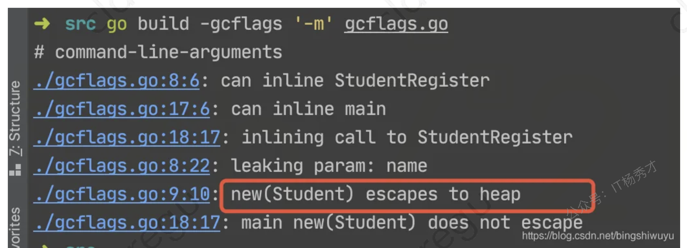
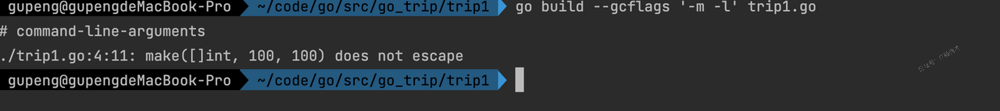
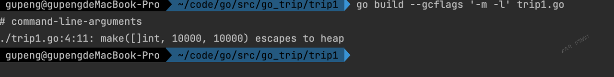
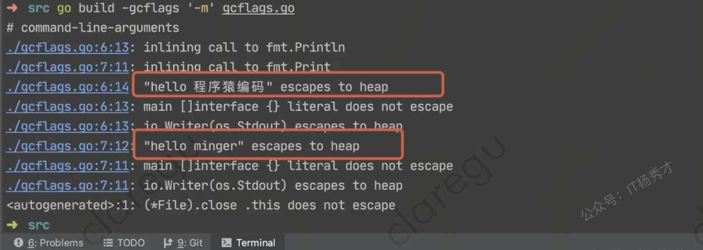
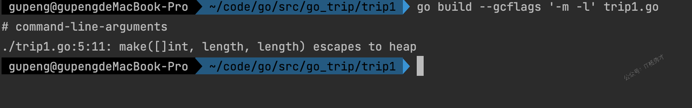

# **逃逸分析**

## **什么是逃逸**

> **`逃逸分析是编译器用于决定变量分配到堆上还是栈上的一种行为。`**

函数的运行都是在栈上面运行的，在栈上面声明临时变量，分配内存，函数运行完毕之后，回收内存，每个函数的栈空间都是独立的，其他函数是无法进行访问，但是在某些情况下栈上面的数据需要在函数结束之后还能被访问，这时候就会设计到内存逃逸了，什么是逃逸，就是抓不住

如果变量从栈上面逃逸，会跑到堆上面，栈上面的变量在函数结束的时候回自动回收，回收代价比较小，栈的内存分配和使用一般只需要两个CPU指令"PUSH"和"RELEASE"，分配和释放，而堆分配内存，则是首先需要找到一块大小合适的内存，之后通过GC回收才能释放，对于这种情况，频繁的使用垃圾回收，则会占用比较大的系统开销，所以尽量分配内存到栈上面，减少gc的压力，提高程序运行速度

## **逃逸分析过程**

Go语言最基本的逃逸分析原则：如果一个函数返回一个对变量的引用，那么它就会发生逃逸。

在任何情况下，如果一个值被分配到了栈之外的地方，那么一定是到了堆上面。简而概之：编译器会分析代码的特征和代码生命周期，Go中的变量只有在编译器可以证明在函数返回后不会再被引用的，才分配到栈上，其他情况下都是分配到堆上

Go语言里面没有一个关键字或者函数可以直接让变量被编译器分配到堆上，相反，编译器是通过分析代码来决定将变量分配到何处。

简单来说，编译器会根据变量是否被外部引用来决定是否逃逸：

如果函数外部没有引用，则优先放到栈中；
如果函数外部存在引用，则必定放到堆中；

## **指针逃逸**

我们知道传递指针可以减少底层值的拷贝，可以提高效率，但是如果拷贝的数据量小，由于指针传递会产生逃逸，可能会使用堆，也可能会增加GC的负担，所以传递指针不一定是高效的。

如下实例

```go
package main

type Student struct {
    Name string
    Age  int
}

func StudentRegister(name string, age int) *Student {
    s := new(Student) //局部变量s逃逸到堆

    s.Name = name
    s.Age = age

    return s
}

func main() {
    StudentRegister("Jim", 18)
}
```

虽然在函数 StudentRegister() 内部 s 为局部变量，其值通过函数返回值返回，s 本身为一指针，其指向的内存地址不会是栈而是堆，这就是典型的逃逸案例。

> **使用命令 go build -gcflags '-m -l' main.go**




"escapes to heap"，代表该行内存分配发生了逃逸现象。

## **栈空间不足**

```go
package main

func MakeSlice() {
 s := make([]int, 100, 100)

 for index, _ := range s {
  s[index] = index
 }
}

func main() {
 MakeSlice()
}
```

执行

```go
go build --gcflags '-m -l' trip.go
```

分析结果：



此时栈空间充足，slice分配在栈上，未发生逃逸，假设将slice扩大100倍，再看一下

```go
package main

func MakeSlice() {
    s := make([]int, 10000, 10000)

    for index, _ := range s {
       s[index] = index
    }
}

func main() {
    MakeSlice()
}
```



此时，分配的slice容量太大，当栈空间不足以存放当前对象时或无法判断当前切片长度时会将对象分配到堆中

## **动态类型逃逸**

很多函数参数为interface类型。比如：

```go
func Printf(format string, a ...interface{}) (n int, err error)
func Sprintf(format string, a ...interface{}) string
func Fprint(w io.Writer, a ...interface{}) (n int, err error)
func Print(a ...interface{}) (n int, err error)
func Println(a ...interface{}) (n int, err error)
```

编译期间很难确定其参数的具体类型，也能产生逃逸。



## **变量大小不确定**

在创建切片的时候，初始化切片容量的时候，传入一个变量来指定其大小，由于变量的值不能在编译器确定，所以就不能确定其占用空间的大小，直接将对象分配在堆上

```go
package main

func MakeSlice() {
    length := 1
    a := make([]int, length, length)
    for i := 0; i < length; i++ {
       a[i] = i
    }
}

func main() {
    MakeSlice()
}
```



## **逃逸常见情况**

1. 指针逃逸，函数内部返回一个局部变量指针

2. 分配大对象，导致栈空间不足，不得不分配到堆上

3. 调用接口类型的方法。接口类型的方法调用是动态调度 - 实际使用的具体实现只能在运行时确定。考虑一个接口类型为 io.Reader 的变量 r。对 r.Read(b) 的调用将导致 r 的值和字节片b的后续转义并因此分配到堆上。

4. 尽管能够符合分配到栈的场景，但是其大小不能够在在编译时候确定的情况，也会分配到堆上

## **如何避免**

1. go 中的接口类型的方法调用是动态调度，因此不能够在编译阶段确定，所有类型结构转换成接口的过程会涉及到内存逃逸的情况发生。如果对于性能要求比较高且访问频次比较高的函数调用，应该尽量避免使用接口类型

2. 由于切片一般都是使用在函数传递的场景下，而且切片在 append 的时候可能会涉及到重新分配内存，如果切片在编译期间的大小不能够确认或者大小超出栈的限制，多数情况下都会分配到堆上

## **总结**

1. 堆上动态分配内存比栈上静态分配内存，开销大很多。

2. 变量分配在栈上需要能在编译期确定它的作用域，否则会分配到堆上。

3. Go编译器会在编译期对考察变量的作用域，并作一系列检查，如果它的作用域在运行期间对编译器一直是可知的，那么就会分配到栈上。简单来说，编译器会根据变量是否被外部引用来决定是否逃逸。

4. 对于Go程序员来说，编译器的这些逃逸分析规则不需要掌握，我们只需通过go build -gcflags '-m'命令来观察变量逃逸情况就行了

5. 不要盲目使用变量的指针作为函数参数，虽然它会减少复制操作。但其实当参数为变量自身的时候，复制是在栈上完成的操作，开销远比变量逃逸后动态地在堆上分配内存少的多。

<div style="background-color: #f0f9eb; padding: 10px 15px; border-radius: 4px; border-left: 5px solid #67c23a; margin: 20px 0; color:rgb(64, 147, 255);">

<h1><span style="color: #006400;"><strong>关注秀才公众号：</strong></span><span style="color: red;"><strong>IT杨秀才</strong></span><span style="color: #006400;"><strong>，领取精品学习资料</strong></span></h1>

<div style="color: #333; font-family: 'Microsoft YaHei', Arial, sans-serif; font-size: 14px;">
<ul>
<li><strong><span style="color: #006400;">公众号后台回复：</span><span style="color: red;">Go面试</span><span style="color: #006400;">，领取Go面试题库PDF</span></strong></li>
<li><strong><span style="color: #006400;">公众号后台回复：</span><span style="color: red;">Go学习</span><span style="color: #006400;">，领取Go必看书籍</span></strong></li>
<li><strong><span style="color: #006400;">公众号后台回复：</span><span style="color: red;">大模型</span><span style="color: #006400;">，领取大模型学习资料</span></strong></li>
<li><strong><span style="color: #006400;">公众号后台回复：</span><span style="color: red;">111</span><span style="color: #006400;">，领取架构学习资料</span></strong></li>
<li><strong><span style="color: #006400;">公众号后台回复：</span><span style="color: red;">26届秋招</span><span style="color: #006400;">，领取26届秋招企业汇总表</span></strong></li>
</ul>
</div>


</div> 