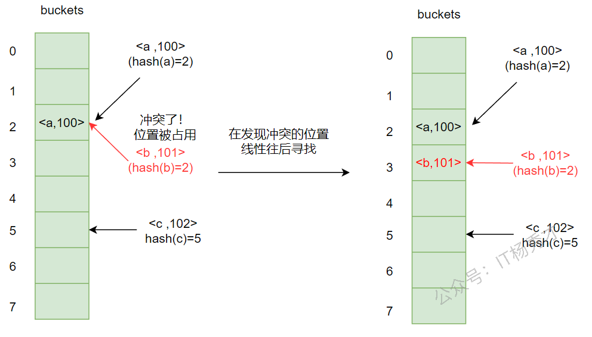
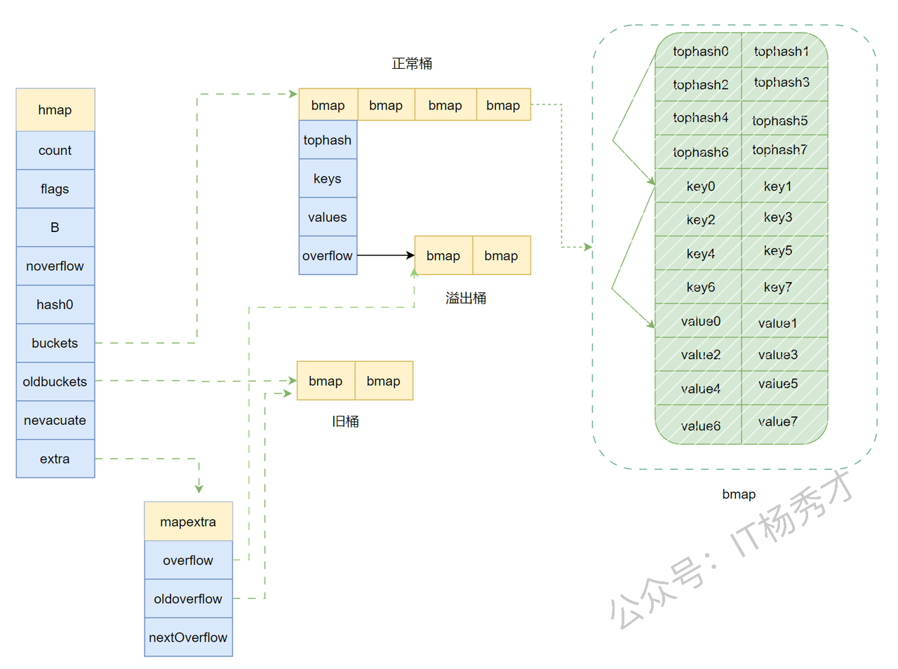
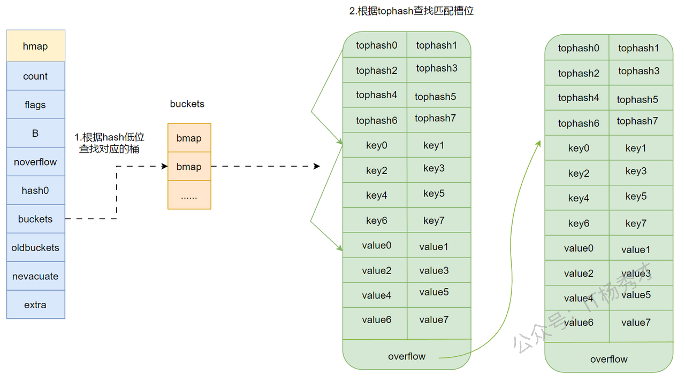
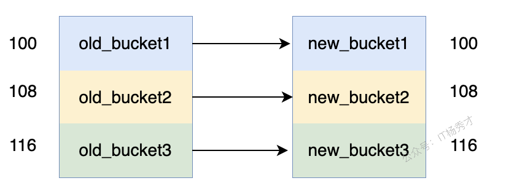
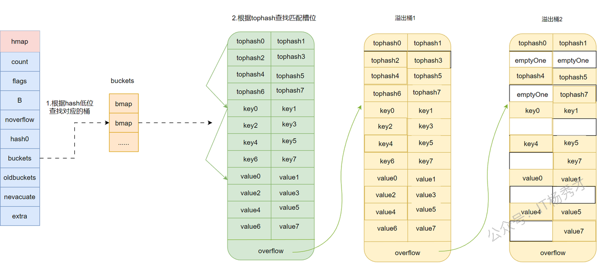

# **map原理**

## **map是什么**

map就是一个key/value键值对的集合，可以根据key在O(1)的时间复杂度内取到value，有点类似与我们常用的数组或者切片结构，可以把数组看作是一种特殊的map，数组的key为数组的下标，而map的key可以为任意的可比较结构。在map中key不允许重复且要能够比较。

在go语言中，map的底层采用hash表，用变种拉链法来解决hash冲突问题。

## **哈希冲突**

哈希表的原理是将多个k-v键值对散列的存储在buckets中，buckets可以理解为一个连续的数组，所以给定一个key/value键值对，我们要将其存储到合适的位置需要经过两步骤：

1. 计算hash值：`hash = hashFunc(key)`

2. 计算索引位置: `index = hash % len(buckets)`

第一步是根据hash函数将key转化为一个hash值

第二步用hash值对 桶的数量 取模得到一个索引值，这样就得到了我们要插入的键值对的位置。

但是这里会出现一个问题，比如我们有两个键值对`key1/value1`和`key2/value2`，经过哈希函数 hashFunc的计算得到的哈希值`hash1`和`hash2`相同，那么这两个hash值的索引也必然相同，那将会存放到同一个位置，那这样怎么处理呢？丢弃后来的键值对？或者是覆盖之前的键值对？

但是这都是不可取的，因为`key1`和`key2`是不同的。他们就是两个不同的键值对，理论上都应该被存储，那应该怎么存储呢？这就是我们所说的哈希碰撞问题。

解决哈希碰撞一般有两种方式；拉链法和开放寻址法

### **拉链法**

拉链法是一种最常见的解决哈希冲突的方法，很多语言都是用拉链法哈希冲突。拉链法的主要实现是底层不直接使用连续数组来直接存储数据元素，而是使用通过数组和链表组合连使用，数组里存储的其实是一个指针，指向一个链表。当出现两个`key`比如`key1`和`key2`的哈希值相同的情况，就将数据链接到链表上，如果没有发现有冲突的`key`，显然链表上就只有一个元素。拉链法处理冲突简单，可以动态的申请内存，删除增加节点都很方便，当冲突严重，链表长度过长的时候也⽀持更多的优化策略，**⽐如⽤红⿊树代替链表。**

拉链法结构如下图：


左边为一个连续数组，数组每个元素存储一个指针，指向一个链表，链表里每个节点存储的是发生hash冲突的数据

### **开放地址法**

开放地址法是另外一种非常常用的解决哈希冲突的策略，与拉链法不同，开放地址法是将具体的数据元素存储在数组桶中，在要插入新元素时，先根据哈希函数算出hash值，根据hash值计算索引，如果发现冲突了，计算出的数组索引位置已经有数据了，就继续向后探测，直到找到未使用的数据槽为止。哈希函数可以简单地理解为：

`hash(key)=(hash1(key)+i)%len(buckets)`

开放地址法结构如下图



在存储键值对`<b,101>`的时候，经过hash计算，发现原本应该存放在数组下标为2的位置已经有值了，存放了`<a,100>`,就继续向后探测，发现数组下标为3的位置是空槽，未被使用，就将`<b,101>`存放在这个位置。

## **go语言map的底层结构**

go语言中的map其实就是一个指向`hmap`的指针，占用8个字节。所以map底层结构就是`hmap`，`hmap`包含多个结构为`bmap`的`bucket`数组，当发生冲突的时候，会到正常桶里面的overflow指针所指向的溢出桶里面去找，Go语言中溢出桶也是一个动态数组形式，它是根据需要动态创建的。Go语言中处理冲突其实是采用了优化的拉链法，链表中每个节点存储的不是一个键值对，而是8个键值对。其整体的结构如下图：



看一下hmap的结构体定义：

```go
// A header for a Go map.
type hmap struct {
   // Note: the format of the hmap is also encoded in cmd/compile/internal/reflectdata/reflect.go.
   // Make sure this stays in sync with the compiler's definition.
   count     int // ## live cells == size of map.  Must be first (used by len() builtin)
   flags     uint8
   B         uint8  // log_2 of ## of buckets (can hold up to loadFactor * 2^B items)
   noverflow uint16 // approximate number of overflow buckets; see incrnoverflow for details
   hash0     uint32 // hash seed

   buckets    unsafe.Pointer // array of 2^B Buckets. may be nil if count==0.
   oldbuckets unsafe.Pointer // previous bucket array of half the size, non-nil only when growing
   nevacuate  uintptr        // progress counter for evacuation (buckets less than this have been evacuated)

   extra *mapextra // optional fields
}
```

字段含义：

| 字段          | 释义                                                                                   |
| ----------- | ------------------------------------------------------------------------------------ |
| count       | map中元素个数，对应于len(map)的值                                                               |
| flags       | 状态标志位，标记map的一些状态                                                                     |
| B           | 桶数以2为底的对数，即B=log\_2(len(buckets))，比如B=3，那么桶数为2^3=8                                   |
| noverflow   | 溢出桶数量近似值                                                                             |
| hash0       | 哈希种子                                                                                 |
| buckets     | 指向buckets数组的指针，buckets数组的元素为bmap，如果数组元素个数为0，其值为nil                                   |
| oldbuckets  | 是一个指向buckets数组的指针，在扩容时，oldbuckets 指向老的buckets数组(大小为新buckets数组的一半)，非扩容时，oldbuckets 为空 |
| nevacuate   | 表示扩容进度的一个计数器，小于该值的桶已经完成迁移                                                            |
| extra       | 指向mapextra 结构的指针，mapextra 存储map中的溢出桶                                                 |

mapextra 结构定义如下：

```go
// mapextra holds fields that are not present on all maps.
type mapextra struct {
   // If both key and elem do not contain pointers and are inline, then we mark bucket
   // type as containing no pointers. This avoids scanning such maps.
   // However, bmap.overflow is a pointer. In order to keep overflow buckets
   // alive, we store pointers to all overflow buckets in hmap.extra.overflow and hmap.extra.oldoverflow.
   // overflow and oldoverflow are only used if key and elem do not contain pointers.
   // overflow contains overflow buckets for hmap.buckets.
   // oldoverflow contains overflow buckets for hmap.oldbuckets.
   // The indirection allows to store a pointer to the slice in hiter.
   overflow    *[]*bmap
   oldoverflow *[]*bmap

   // nextOverflow holds a pointer to a free overflow bucket.
   nextOverflow *bmap
}
```

| 字段            | 释义         |
| ------------- | ---------- |
| overflow      | 溢出桶链表地址    |
| oldoverflow   | 老的溢出桶链表地址  |
| nextOverflow  | 下一个空闲溢出桶地址 |

`hmap`中真正用于存储数据的是`buckets`指向的这个`bmap`(桶)数组，每一个 `bmap` 都能存储 8 个键值对，当map中的数据过多，`bmap`数组存不下的时候就会存储到extra指向的溢出bucket(桶)里面

下面看一下bmap的结构定义：

```go
type bmap struct {
    topbits  [8]uint8
    keys     [8]keytype
    values   [8]valuetype
    overflow uintptr
}
```

| 字段          | 释义                                                |
| ----------- | ------------------------------------------------- |
| topbits     | 存储了bmap里8个key/value键值对的每个key根据哈希函数计算出的hash值的高 8 位 |
| keys        | 存储了bmap里8个key/value键值对的key                        |
| values      | 存储了bmap里8个key/value键值对的value                      |
| overflow    | 指向溢出桶的指针                                          |

再解释一下这个`tophash`，go语言的`map`会根据每一个key计算出一个`hash`值，有意思的是，对这个`hash`值的使用，go语言并不是一次性使用的，而是分开使用的，在使用中，把求得的这个`hash`值按照用途一分为二：高位和低位


假设我们对一个`key`做`hash`计算得到了一个hash值如图所示，蓝色就是这个hash值的高8位，红色就是这个hash值的低8位。而每个bmap中其实存储的就是8个这个蓝色的数字。

通过上图map的底层结构图我们可以看到，bmap的结构，bmap显示存储了8个`tohash`值，然后存储了8个键值对，注意，这8个键值对并不是按照`key/value`这样`key`和`value`放在一起存储的，而是先连续存完8个`key`，之后再连续存储8个`value`这样，当键值对不够8个时，对应位置就留空。这样存储的好处是可以消除字节对齐带来的空间浪费。

### **map的访问原理**

对map的访问有两种方式：

```go
v     := map[key]    // 当map中没有对应的key时，会返回value对应类型的零值
v, ok := map[key]    // 当map中没有对应的key时，除了会返回value对应类型的零值,还会返回一个值存不存在的布尔值
```

虽然这两种方法在返回值上很接近，后者只是多出了一个key存不存在的布尔值，但是在运行时调用的方法却不一样。

源码链接：[ Map 源码梳理](https://ls8sck0zrg.feishu.cn/docx/XJfDdQ6pgoYIjqxzgpJcFycTn1d##YHtod9JyPoVyNbxrbKhc78m9nCm)&##x20;

大致原理如下图所示：



这里梳理一下步骤：

1. 判断map是否为空或者无数据，若为空或者无数据返回对应的空值

2. map写检测，如果正处于写状态，表示此时不能进行操作，报fatal error

3. 计算出hash值和掩码

4. 判断当前map是否处于扩容状态，如果在扩容执行下面步骤：

   * 根据状态位算判断当前桶是否被迁移

   * 如果迁移，在新桶中查找

   * 未被迁移，在旧桶中查找

   * 根据掩码找到的位置

5. 依次遍历桶以及溢出桶来查找key

   * 遍历桶内的8个槽位

   * 比较该槽位的tophash和当前key的tophash是否相等

     * 相同，继续比较key是否相同，相同则直接返回对应value

     * 不相同，查看这个槽位的状态位是否为"后继空状态"

       * 是，key在以后的槽中也没有，这个key不存在，直接返回零值

       * 否，遍历下一个槽位

6. &##x20;当前桶没有找到，则遍历溢出桶，用同样的方式查找

### **map的赋值原理**

map的赋值操作很简单

```go
map[key] = value
```

原`map`中存在`key`是，则更新对应的值为`value`，若`map`中不存在`key`时，则插入键值对`key/value`。

但是有两点需要注意：

1. 在对map进行赋值操作的时候，map一定要先进行初始化，否则会panic

```go
var m map[int]int
m[1] = 1
```

m只是做了声明为一个map，并未初始化，所以程序会panic

* map是非线程安全的，不支持并发读写操作。当有其他线程正在读写map时，执行map的赋值会报为并发读写错误

```go
package main

import (
   "fmt"
)

func main() {
   m := make(map[int]int)
   go func() {
      for {
         m[1] = 1
      }
   }()
   go func() {
      for {
         v := m[1]
         fmt.Printf("v=%d\n", v)
      }
   }()
   select {}
}
```

运行结果：

```go
fatal error: concurrent map read and map write
```

源码链接：[ Map 源码梳理](https://ls8sck0zrg.feishu.cn/docx/XJfDdQ6pgoYIjqxzgpJcFycTn1d##VELzdF4BRo12UHxeEZGckzJ9nXc)&##x20;

大致流程：

1. map写检测，如果正处于写状态，表示此时不能进行读取，报fatal error

2. 计算出hash值，将map置为写状态

3. 判断同数组是否为空，若为空，初始化桶数组

4. 目标桶查找

   1. 根据hash值找到桶的位置

   2. 判断该当前是否处于扩容：

      1. 若正在扩容：迁移这个桶，并且还另外帮忙多迁移一个桶以及它的溢出桶

   3. 获取目标桶的指针，计算出tophash，开始后面的key查找过程

5. key查找

   1. 遍历桶和它的溢出桶的每个槽位，按下述方式查找

   2. 判断槽位的tophash和目标tophash

      1. 不相等

         1. 槽位tophash为空，标记这个位置为侯选位置

         2. 槽位tophash的标志位为"后继空状态"，说明这个key之前没有被插入过，插入key/value

         3. tophash标志位不为空，说明存储着其他key，说明当前槽的tophash不符合，继续遍历下一个槽

      2. 相等

         1. 判断当前槽位的key与目标key是否相等

            1. 不相等，继续遍历下一个槽位

            2. 相等，找到了目标key的位置，原来已存在键值对，则修改key对应的value，然后执行收尾程

6. key插入

   1. 若map中既没有找到key，且根据这个key找到的桶及其这个桶的溢出桶中没有空的槽位了，要申请一个新的溢出桶，在新申请的桶里插入

   2. 否则在找到的位置插入

7. 收尾程序

   1. 再次判断map的写状态

   2. 清除map的写状态

这里需要注意一点：申请一个新的溢出桶的时候并不会一开始就创建一个溢出桶，因为map在初始化的时候会提前创建好一些溢出桶存储在extra\*mapextra字段，样当出现溢出现象时候，这些下溢出桶会优先被使用，只有预分配的溢出桶使用完了，才会新建溢出桶。

### **map的扩容**

在上面介绍map的写入操作的时候，其实忽略了一个点，那就是随着不断地往map里写入元素，会导致map的数据量变得很大，hash性能会逐渐变差，而且溢出桶会越来越多，导致查找的性能变得很差。所以，需要更多的桶和更大的内存保证哈希的读写性能，这时map会自动触发扩容，在[`runtime.mapassign`](https://draveness.me/golang/tree/runtime.mapassign) 可以看到这条语句：

```go
func mapassign(t *maptype, h *hmap, key unsafe.Pointer) unsafe.Pointer {
   ...
   if !h.growing() && (overLoadFactor(h.count+1, h.B) || tooManyOverflowBuckets(h.noverflow, h.B)) {
      hashGrow(t, h)
      goto again
   }
   ...
}
```

可以看到map会在两种情况下触发扩容：

* **map的负载因子已经超过 6.5**

* **溢出桶的数量过多**

在扩容的时候还有一个条件`!h.growing()`，这是因为map的扩容并不是一个原子操作不是一次性完成的，所以需要判断一下，当前map是否正处于扩容状态，避免二次扩容造成混乱。

而这两种情况下，扩容策略是不同的

* 负载因子已经超过 6.5： 双倍扩容

* 溢出桶的数量过多：等量扩容(一般认为溢出桶数量接近正常桶数量时)

什么是负载因子？

```plain&##x20;text
负载因子 = 哈希表中的元素数量 / 桶的数量 
```

**为什么负载因子是6.5？**

源码里对负载因子的定义是6.5，是经过测试后取出的一个比较合理的值，

每个 bucket 有 8 个空位，假设map里所有的数组桶都装满元素，没有一个数组有溢出桶，那么这时的负载因子刚好是8。而负载因子是6.5的时候，说明数组桶快要用完了，存在溢出的情况下，查找一个key很可能要去遍历溢出桶，会造成查找性能下降，所以有必要扩容了

**溢出桶的数量过多？**

可以想象一下这种情况，先往一个map插入很多元素，然后再删除很多元素？再插入很多元素。会造成什么问题？

由于插入了很多元素，在不是完全理想的情况下，肯定会创建一些溢出桶，但是，又由于没有达到负载因子的临界值，所以不会触发扩容，在删除很多元素，这个时候负载因子又会减小，再插入很多元素，会继续创建更多的溢出桶，导致查找元素的时候要去遍历很多的溢出桶链表，性能下降，所以在这种情况下要进行扩容，新建一个桶数组，把原来的数据拷贝到里面，这样数据排列更紧密，查找性能更快。

##### **扩容过程**

扩容过程中大概需要用到两个函数，**hashGrow()和growWork()。**

扩容函数：

```go
func hashGrow(t *maptype, h *hmap) {
   // If we've hit the load factor, get bigger.
   // Otherwise, there are too many overflow buckets,
   // so keep the same number of buckets and "grow" laterally.
   bigger := uint8(1)
   if !overLoadFactor(h.count+1, h.B) {
      bigger = 0
      h.flags |= sameSizeGrow
   }
   oldbuckets := h.buckets
   newbuckets, nextOverflow := makeBucketArray(t, h.B+bigger, nil)

   flags := h.flags &^ (iterator | oldIterator)
   if h.flags&iterator != 0 {
      flags |= oldIterator
   }
   // commit the grow (atomic wrt gc)
   h.B += bigger
   h.flags = flags
   h.oldbuckets = oldbuckets
   h.buckets = newbuckets
   h.nevacuate = 0
   h.noverflow = 0

   if h.extra != nil && h.extra.overflow != nil {
      // Promote current overflow buckets to the old generation.
      if h.extra.oldoverflow != nil {
         throw("oldoverflow is not nil")
      }
      h.extra.oldoverflow = h.extra.overflow
      h.extra.overflow = nil
   }
   if nextOverflow != nil {
      if h.extra == nil {
         h.extra = new(mapextra)
      }
      h.extra.nextOverflow = nextOverflow
   }

   // the actual copying of the hash table data is done incrementally
   // by growWork() and evacuate().
}
```

go语言在对map进行过扩容的时候，并不是一次性将map的所有数据从旧的桶搬到新的桶，如果map的数据量很大，会非常影响性能，而是采用一种"渐进式"的数据转移技术，遵循写时复制（copy on write）的规则，每次只对使用到的数据做迁移。

简单分析一下扩容过程：

通过代码分析，`hashGrow()`函数是在mapassign函数中被调用，所以，扩容过程会发生在map的赋值操作，在满足上述两个扩容条件时触发。

扩容过程中大概需要用到两个函数，**`hashGrow()`和`growWork()`。**&##x5176;中hashGrow()函数只是分配新的 buckets，并将老的 buckets 挂到了 oldbuckets 字段上，并未参与真正的数据迁移，而数据迁移的功能是由growWork()函数完成的。

##### **迁移时机**

**`growWork()`** 函数会在 `mapassign `和 `mapdelete `函数中被调用，所以数据的迁移过程一般发生在插入或修改、删除 key 的时候。在扩容完毕后（预分配内存），不会马上就进行迁移。而是采取**写时复制**的方式，当有访问到具体 bukcet 时，才会逐渐的将 oldbucket 迁移到 新bucket中。

**`growWork()`函数定义如下：**

```go
func growWork(t *maptype, h *hmap, bucket uintptr) {
   // 首先把需要操作的bucket迁移
   evacuate(t, h, bucket&h.oldbucketmask())
   // 再顺带迁移一个bucket
   if h.growing() {
      evacuate(t, h, h.nevacuate)
   }
}
```

下面分析一下`evacuate`函数，大致迁移过程如下：

```go
 b := (*bmap)(add(h.oldbuckets, oldbucket*uintptr(t.bucketsize)))
   newbit := h.noldbuckets()
   // 判断旧桶是否已经被迁移了
   if !evacuated(b) {
       do...  // 做转移操作
   }
```

1. `evacuated`函数直接通过tophash中第一个hash值判断当前bucket是否被转移

```go
func evacuated(b *bmap) bool {
   h := b.tophash[0]
   return h > emptyOne && h < minTopHash
}
```

* 数据迁移时，根据扩容规则，可能是迁移到大小相同的buckets上，也可能迁移到2倍大的buckets上。

如果迁移到等量数组上，则迁移完的目标桶位置还是在原先的位置上的，如果是双倍扩容迁移到2倍桶数组上，迁移完的目标桶位置有可能在原位置，也有可能在原位置+偏移量。（偏移量大小为原桶数组的长度）。xy 标记目标迁移位置，x 标识的是迁移到相同的位置，y 标识的是迁移到2倍桶数组上的位置。

解释一下：

```go
var xy [2]evacDst
x := &xy[0]
x.b = (*bmap)(add(h.buckets, oldbucket*uintptr(t.bucketsize)))
x.k = add(unsafe.Pointer(x.b), dataOffset)
x.e = add(x.k, bucketCnt*uintptr(t.keysize))

if !h.sameSizeGrow() {
   // Only calculate y pointers if we're growing bigger.
   // Otherwise GC can see bad pointers.
   y := &xy[1]
   y.b = (*bmap)(add(h.buckets, (oldbucket+newbit)*uintptr(t.bucketsize)))
   y.k = add(unsafe.Pointer(y.b), dataOffset)
   y.e = add(y.k, bucketCnt*uintptr(t.keysize))
}
```

evacDst结构如下：

```go
type evacDst struct {
   b *bmap          // 迁移桶
   i int            // 迁移桶槽下标
   k unsafe.Pointer // 迁移桶Key指针
   e unsafe.Pointer // 迁移桶Val指针
}
```

* 确定完bucket之后，就会按照bucket内的槽位逐条迁移key/value键值对。

* 迁移完一个桶后，迁移标记位nevacuate+1，当nevacuate等于旧桶数组大小时，迁移完成，释放*旧的桶数组和旧的溢出桶数组*

扩容过程大概如下图所示：



等量扩容

等量扩容，目标桶再扩容后还在原位置处


双倍扩容

双倍扩容，目标桶扩容后的位置可能在原位置也可能在原位置+偏移量处。

### **map的删除原理**

map的delete原理很简单，其核心代码位于`runtime.mapdelete函`数中，这里就不贴完整函数了，删除动作前整体逻辑和前面map的访问差不多，也是map的写检测，以及寻找bucket和key的过程。

清空key/value的核心代码如下：

```go
for {
   b.tophash[i] = emptyRest
   if i == 0 {
      if b == bOrig {
         break // beginning of initial bucket, we're done.
      }
      // Find previous bucket, continue at its last entry.
      c := b
      for b = bOrig; b.overflow(t) != c; b = b.overflow(t) {
      }
      i = bucketCnt - 1
   } else {
      i--
   }
   if b.tophash[i] != emptyOne {
      break
   }
}
```

如果在找到了目标key，则把当前桶该槽位对应的key和value删除，将该槽位的tophash置为emptyOne，如果发现当前槽位后面没有元素，则将tophash设置为emptyRest，并循环向前检查前一个元素，若前一个元素也为空，槽位状态为emptyOne，则将前一个元素的tophash也设置为emptyRest。这样做的目的是将emptyRest状态尽可能地向前面的槽推进，这样做是为了增加效率，因为在查找的时候发现了emptyRest状态就不用继续往后找了，因为后面没有元素了。

举个例子：

假设当前map的状态如下图所示，溢出桶2后面没有在接溢出桶，或者是溢出桶2后面接的溢出桶中没有数据，溢出桶2中有三个空槽，即第2，3，6处为emptyOne，



在删除了溢出桶1的key2和key4，以及溢出桶2的key7之后，对应map状态如下：


从delete map单个key/value的原理可以看出，当我们删除一个键值对的时候，这个键值对在桶中的内存并不会被释放，所以对与map的频繁写入和删除可能会造成内存泄漏。

### **map的遍历**

go语言中map的遍历尤其要引起注意，因为每次遍历的数据顺序都是不同的。这是因为go在每次开始遍历前，都会随机选择一个桶下标，一个桶内遍历的起点槽下标，遍历的时候从这个桶开始，在遍历每个桶的时候，都从这个槽下标开始

go语言为什么要用这种随机开始的位置开始遍历呢？

一方面：因为go的扩容不是一个原子操作，是渐进式的，所以在遍历map的时候，可能发生扩容，一旦发生扩容，key 的位置就发生了重大的变化，下次遍历map的时候结果就不可能按原来的顺序了。

另一方面：hash 表中数据每次插入的位置是变化的，同一个 map 变量内，数据删除再添加的位置也有可能变化，因为在同一个桶及溢出链表中数据的位置不分先后

所以理论上，map的遍历结果就是不同的，所以Go防止用户错误的依赖于每次迭代的顺序，索性每次遍历时，搜是随机选取的一个遍历开始位置。

##### **遍历过程**

###### **迭代器**

运行时，map的遍历是依靠一个迭代器来完成的，迭代器的代码定义如下：

```go
type hiter struct {
   key         unsafe.Pointer // Must be in first position.  Write nil to indicate iteration end (see cmd/compile/internal/walk/range.go).
   elem        unsafe.Pointer // Must be in second position (see cmd/compile/internal/walk/range.go).
   t           *maptype
   h           *hmap
   buckets     unsafe.Pointer // bucket ptr at hash_iter initialization time
   bptr        *bmap          // current bucket
   overflow    *[]*bmap       // keeps overflow buckets of hmap.buckets alive
   oldoverflow *[]*bmap       // keeps overflow buckets of hmap.oldbuckets alive
   startBucket uintptr        // bucket iteration started at
   offset      uint8          // intra-bucket offset to start from during iteration (should be big enough to hold bucketCnt-1)
   wrapped     bool           // already wrapped around from end of bucket array to beginning
   B           uint8
   i           uint8
   bucket      uintptr
   checkBucket uintptr
}
```

字段释义：

| 字段           | 释义                                                             |
| ------------ | -------------------------------------------------------------- |
| key          | 键值对的键，键必须放置在第一个字段，key为空指针nil说明遍历结束                             |
| elem         | 键值对的值，值放置在第二个字段                                                |
| buckets      | 桶数组指针，指向迭代器初始化之后要遍历的桶数组                                        |
| h            | map的地址                                                         |
| t            | map的类型信息                                                       |
| bptr         | 指向当前遍历到的桶的指针                                                   |
| overflow     | hmap中正常桶的溢出桶指针                                                 |
| oldoverflow  | 发生扩容时，hmap中旧桶的溢出桶指针                                            |
| startBucket  | 开始遍历时，初始化的桶下标                                                  |
| offset       | 开始遍历时，初始化的槽位下标                                                 |
| wrapped      | 表示是否遍历完了，true表示遍历完了                                            |
| B            | 初始化迭代器时，h.B                                                    |
| i            | 当前桶已经遍历的键值对数量，i=0时，开始遍历当前桶的第一个槽位，i=8时，当前桶已经遍历完，将 it.bptr指向下一个桶 |
| bucket       | 当前遍历桶的偏移量                                                      |
| checkBucket  | 桶状桶状态标记位，如果不是noCheck，则表明当前桶还没有迁移，                              |

整个遍历的过程大致可以分为两步

1. 初始化迭代器

2. 开始一轮遍历

初始化迭代器的工作主要在函数`mapiterinit(t `*`maptype, h `*`hmap, it *hiter)`中完成，源代码如下：

```go
// mapiterinit initializes the hiter struct used for ranging over maps.
// The hiter struct pointed to by 'it' is allocated on the stack
// by the compilers order pass or on the heap by reflect_mapiterinit.
// Both need to have zeroed hiter since the struct contains pointers.
func mapiterinit(t *maptype, h *hmap, it *hiter) {
   if raceenabled && h != nil {
      callerpc := getcallerpc()
      racereadpc(unsafe.Pointer(h), callerpc, abi.FuncPCABIInternal(mapiterinit))
   }

   it.t = t
   if h == nil || h.count == 0 {
      return
   }

   if unsafe.Sizeof(hiter{})/goarch.PtrSize != 12 {
      throw("hash_iter size incorrect") // see cmd/compile/internal/reflectdata/reflect.go
   }
   it.h = h

   // grab snapshot of bucket state
   it.B = h.B
   it.buckets = h.buckets
   if t.bucket.ptrdata == 0 {
      // Allocate the current slice and remember pointers to both current and old.
      // This preserves all relevant overflow buckets alive even if
      // the table grows and/or overflow buckets are added to the table
      // while we are iterating.
      h.createOverflow()
      it.overflow = h.extra.overflow
      it.oldoverflow = h.extra.oldoverflow
   }

   // decide where to start
   r := uintptr(fastrand())
   if h.B > 31-bucketCntBits {
      r += uintptr(fastrand()) << 31
   }
   it.startBucket = r & bucketMask(h.B)
   it.offset = uint8(r >> h.B & (bucketCnt - 1))

   // iterator state
   it.bucket = it.startBucket

   // Remember we have an iterator.
   // Can run concurrently with another mapiterinit().
   if old := h.flags; old&(iterator|oldIterator) != iterator|oldIterator {
      atomic.Or8(&h.flags, iterator|oldIterator)
   }

   mapiternext(it)  // 进行单次遍历
}
```

主要工作分为以下几步：

1. 判断map是否为空

2. 随机一个开始遍历的起始桶下标

3. 随机一个槽位下标，后续每个桶内的遍历都从这个槽位开始

4. 把map置为遍历状态

5. 开始执行一次遍历过程

单次遍历的工作主要在`mapiternext(it *hiter)`函数中完成，源代码如下：

```go
func mapiternext(it *hiter) {
   h := it.h
   if raceenabled {
      callerpc := getcallerpc()
      racereadpc(unsafe.Pointer(h), callerpc, abi.FuncPCABIInternal(mapiternext))
   }
   if h.flags&hashWriting != 0 { // map的并发写判断
      throw("concurrent map iteration and map write")
   }
   t := it.t  // 获取上次迭代进度
   bucket := it.bucket
   b := it.bptr
   i := it.i
   checkBucket := it.checkBucket

next:  // 开始一次迭代
   if b == nil { // 遍历未开始或者当前正常桶(桶数组中的桶)的溢出桶（同数组的溢出表链表中的桶）经遍历完了，开始遍历下一个正常桶
      if bucket == it.startBucket && it.wrapped { // 遍历位置是起始桶，并且wrapped为true，说明遍历完了，直接返回
         // end of iteration
         it.key = nil
         it.elem = nil
         return
      }
      // 如果map正在扩容，判断当前遍历的桶数据是否已经迁移完，迁移完了则使用新桶，否则使用旧桶
      if h.growing() && it.B == h.B {
         // Iterator was started in the middle of a grow, and the grow isn't done yet.
         // If the bucket we're looking at hasn't been filled in yet (i.e. the old
         // bucket hasn't been evacuated) then we need to iterate through the old
         // bucket and only return the ones that will be migrated to this bucket.
         oldbucket := bucket & it.h.oldbucketmask()
         b = (*bmap)(add(h.oldbuckets, oldbucket*uintptr(t.bucketsize)))
         if !evacuated(b) {
            checkBucket = bucket
         } else {
            b = (*bmap)(add(it.buckets, bucket*uintptr(t.bucketsize)))
            checkBucket = noCheck
         }
      } else {
         b = (*bmap)(add(it.buckets, bucket*uintptr(t.bucketsize)))
         checkBucket = noCheck
      }
      bucket++
      if bucket == bucketShift(it.B) {  // 遍历到了数组最后，从头开始继续遍历
         bucket = 0
         it.wrapped = true
      }
      i = 0
   }
   for ; i < bucketCnt; i++ {  // 遍历当前桶和当前桶的溢出桶里的数据
      offi := (i + it.offset) & (bucketCnt - 1)  // 通过初始化的槽位下表确定将要遍历的槽位的tophash
      if isEmpty(b.tophash[offi]) || b.tophash[offi] == evacuatedEmpty {
         // TODO: emptyRest is hard to use here, as we start iterating
         // in the middle of a bucket. It's feasible, just tricky.
         continue
      }
      k := add(unsafe.Pointer(b), dataOffset+uintptr(offi)*uintptr(t.keysize)) // 根据偏移量i确定key和value的地址
      if t.indirectkey() {
         k = *((*unsafe.Pointer)(k))
      }
      e := add(unsafe.Pointer(b), dataOffset+bucketCnt*uintptr(t.keysize)+uintptr(offi)*uintptr(t.elemsize))
      if checkBucket != noCheck && !h.sameSizeGrow() {
         // Special case: iterator was started during a grow to a larger size
         // and the grow is not done yet. We're working on a bucket whose
         // oldbucket has not been evacuated yet. Or at least, it wasn't
         // evacuated when we started the bucket. So we're iterating
         // through the oldbucket, skipping any keys that will go
         // to the other new bucket (each oldbucket expands to two
         // buckets during a grow).
         // 这里处于增量扩容，需要进一步判断
         // 如果数据还没有从旧桶迁移到新桶，需要计算这个key重新hash计算后是否与oldbucket的索引一致，不一致则跳过
         if t.reflexivekey() || t.key.equal(k, k) {
            // If the item in the oldbucket is not destined for
            // the current new bucket in the iteration, skip it.
            hash := t.hasher(k, uintptr(h.hash0))
            if hash&bucketMask(it.B) != checkBucket {
               continue
            }
         } else {
            // Hash isn't repeatable if k != k (NaNs).  We need a
            // repeatable and randomish choice of which direction
            // to send NaNs during evacuation. We'll use the low
            // bit of tophash to decide which way NaNs go.
            // NOTE: this case is why we need two evacuate tophash
            // values, evacuatedX and evacuatedY, that differ in
            // their low bit.
            if checkBucket>>(it.B-1) != uintptr(b.tophash[offi]&1) {
               continue
            }
         }
      }
      if (b.tophash[offi] != evacuatedX && b.tophash[offi] != evacuatedY) ||
         !(t.reflexivekey() || t.key.equal(k, k)) {  // 这里的数据没有处在扩容中，直接使用
         // This is the golden data, we can return it.
         // OR
         // key!=key, so the entry can't be deleted or updated, so we can just return it.
         // That's lucky for us because when key!=key we can't look it up successfully.
         it.key = k
         if t.indirectelem() {
            e = *((*unsafe.Pointer)(e))
         }
         it.elem = e
      } else {
         // The hash table has grown since the iterator was started.
         // The golden data for this key is now somewhere else.
         // Check the current hash table for the data.
         // This code handles the case where the key
         // has been deleted, updated, or deleted and reinserted.
         // NOTE: we need to regrab the key as it has potentially been
         // updated to an equal() but not identical key (e.g. +0.0 vs -0.0).
         rk, re := mapaccessK(t, h, k)   // 走到这里，表明这条数据已经被迁移或者删除，使用mapaccessK去找回这部分的数据
         if rk == nil {
            continue // key has been deleted 数据没找到，说明已经删除
         }
         it.key = rk
         it.elem = re
      }
      it.bucket = bucket  // 记录本次遍历进度
      if it.bptr != b { // avoid unnecessary write barrier; see issue 14921
         it.bptr = b
      }
      it.i = i + 1
      it.checkBucket = checkBucket
      return
   }
   b = b.overflow(t)   // 遍历溢出桶链表：继续遍历下一个溢出桶
   i = 0
   goto next
}
```

遍历的流程大致是以下几个步骤：

1. map的并发写检测，判断map是否处于并发写状态，是则panic

2. 判断是否已经遍历完了，遍历完了直接退出

3. 开始遍历

4. 首选确定一个随机开始遍历的起始桶下标作为startBucket，然后确定一个随机的槽位下标作为offset

5. 根据startBucket和offset开始遍历当前桶和当前桶的溢出桶，如果当前桶正在扩容，则进行步骤6，否则进行步骤7

6. 在遍历处于扩容状态的bucket的时候，因为当前bucket正在扩容，我们并不会遍历这个桶，而是会找到这个桶的旧桶old\_bucket，遍历旧桶中的一部分key，这些key重新hash计算后能够散列到bucket中，对那些key经过重新hash计算不散列到bucket中的key，则跳过

7. 根据遍历初始化的时候选定的随机槽位开始遍历桶内的各个key/value

8. 继续遍历bucket溢出指针指向的溢出链表中的溢出桶

9. 假如遍历到了起始桶startBucket，则说明遍历完了，结束遍历


