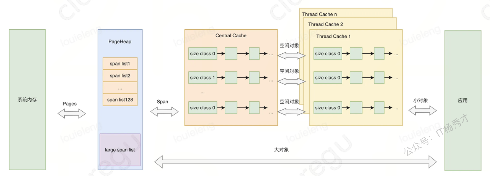
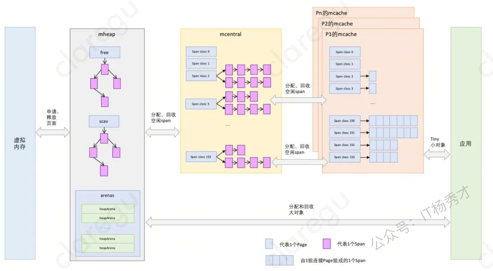
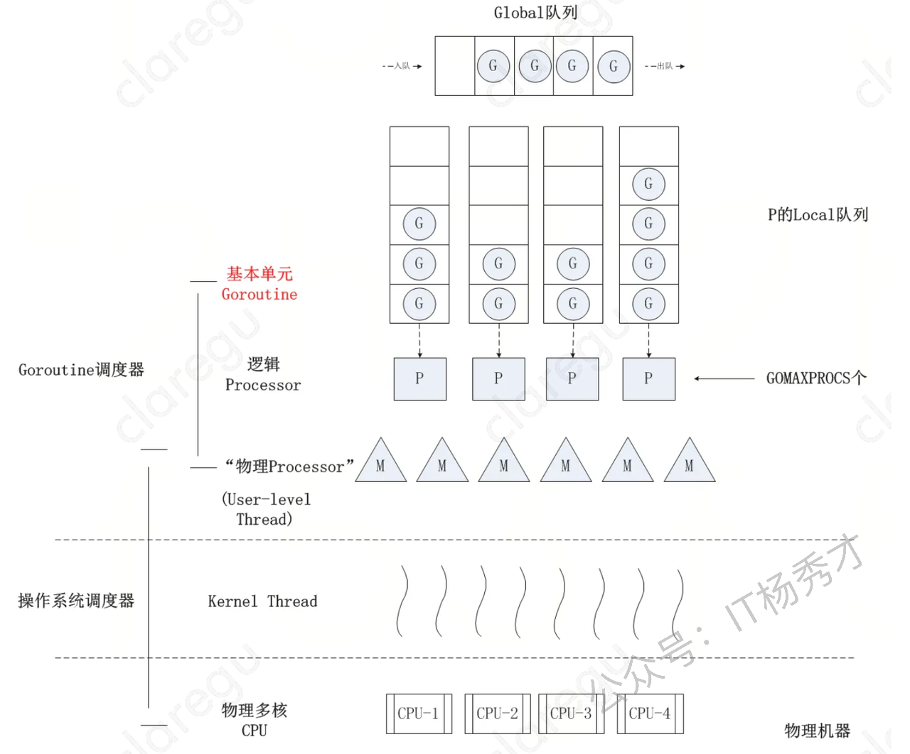
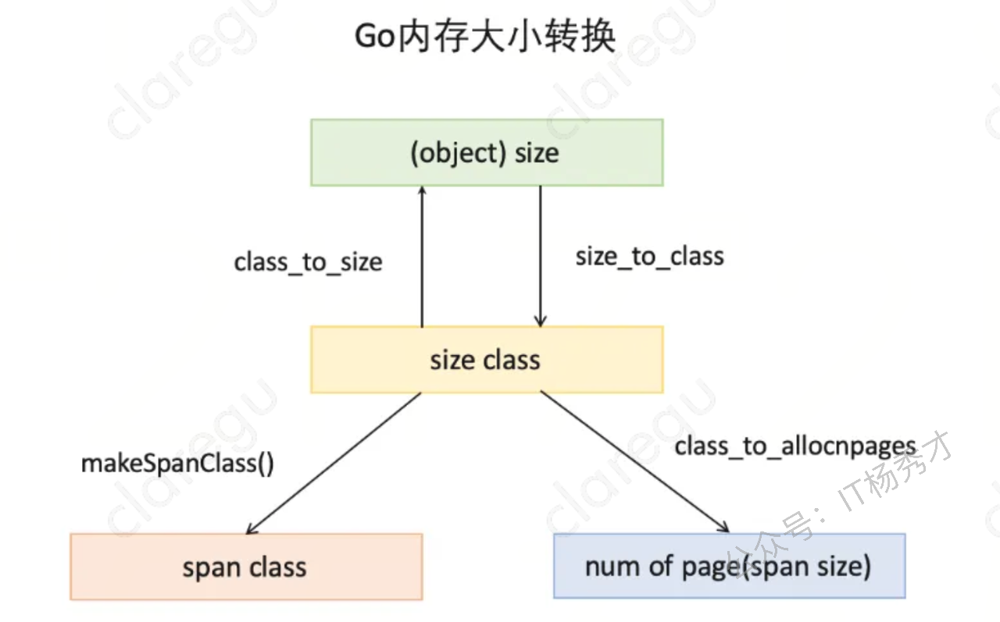

# **内存管理**

关于go堆栈内存不是很清楚可先看这篇文章：https://juejin.cn/post/7135670650353483783

> **| 导语现代高级编程语言管理内存的方式分自动和手动两种。手动管理内存的典型代表是C和C++，编写代码过程中需要主动申请或者释放内存；而Java 和Go等语言使用自动的内存管理系统，由内存分配器和垃圾收集器来代为分配和回收内存，开发者只需关注业务代码而无需关注底层内存分配和回收，虽然语言帮我们处理了这部分但是还是有必要去了解一下底层的架构设计和执行逻辑，这样可以更好的掌握一门语言，本文主要以go内存管理为切入点再到go垃圾回收，系统的讲解一下go自动内存管理系统的设计和原理，由于篇幅有限略去了go垃圾回收三色标记屏障技术这一块，有兴趣的推荐去看下《go语言设计和实现》。此文目的是抛砖引玉，欢迎各位交流探讨。**

## **1. TCMalloc**

go内存管理是借鉴了TCMalloc的设计思想，TCMalloc全称Thead-Caching Malloc，是google开发的内存分配器，为了方便理解下面的go内存管理，有必要要先熟悉一下TCMalloc。&#x20;



### **1.1 Page**

操作系统对内存管理以页为单位，TCMalloc也是这样，只不过TCMalloc里的Page大小与操作系统里的大小并不一定相等，而是倍数关系。

### **1.2 Span**

一组连续的Page被称为Span，比如可以有4个页大小的Span，也可以有8个页大小的Span，Span比Page高一个层级，是为了方便管理一定大小的内存区域，Span是TCMalloc中内存管理的基本单位。

### **1.3 ThreadCache**

每个线程各自的Cache，一个Cache包含多个空闲内存块链表，每个链表连接的都是内存块，同一个链表上内存块的大小是相同的，也可以说按内存块大小，给内存块分了个类，这样可以根据申请的内存大小，快速从合适的链表选择空闲内存块。由于每个线程有自己的ThreadCache，所以ThreadCache访问是无锁的。

### **1.4 CentralCache**

是所有线程共享的缓存，也是保存的空闲内存块链表，链表的数量与ThreadCache中链表数量相同，当ThreadCache内存块不足时，可以从CentralCache取，当ThreadCache内存块多时，可以放回CentralCache。由于CentralCache是共享的，所以它的访问是要加锁的。

### **1.5 PageHeap**

PageHeap是堆内存的抽象，PageHeap存的也是若干链表，链表保存的是Span，当CentralCache没有内存的时，会从PageHeap取，把1个Span拆成若干内存块，添加到对应大小的链表中，当CentralCache内存多的时候，会放回PageHeap

### **1.6 TCMalloc对象分配**

小对象直接从ThreadCache分配，若ThreadCache不够则从CentralCache中获取内存，CentralCache内存不够时会再从PageHeap获取内存，大对象在PageHeap中选择合适的页组成span用于存储数据。

## **2. Go内存管理**

经过上一节对TCMalloc内存管理的描述，对接下来理解go的内存管理会有大致架构的熟悉，go内存管理架构取之TCMalloc不过在细节上有些出入，先来看一张go内存管理的架构图



### **2.1 Page**

和TCMalloc中page相同，上图中最下方浅蓝色长方形代表一个page

### **2.2 Span**

与TCMalloc中的Span相同，Span是go内存管理的基本单位，代码中为 `mspan` ，一组连续的Page组成1个Span，所以上图一组连续的浅蓝色长方形代表的是一组Page组成的1个Span，另外，1个淡紫色长方形为1个Span。

### **2.3 mcache**

mcache与TCMalloc中的ThreadCache类似，mcache保存的是各种大小的Span，并按Span class分类，小对象直接从mcache分配内存，它起到了缓存的作用，并且可以无锁访问。 但mcache与ThreadCache也有不同点，TCMalloc中是每个线程1个ThreadCache，Go中是每个P拥有1个mcach，因为在Go程序中，当前最多有GOMAXPROCS个线程在运行，所以最多需要GOMAXPROCS个mcache就可以保证各线程对mcache的无锁访问，下图是G，P，M三者之间的关系&#x20;



### **2.4 mcentral**

mcentral与TCMalloc中的CentralCache类似，是所有线程共享的缓存，需要加锁访问，它按Span class对Span分类，串联成链表，当mcache的某个级别Span的内存被分配光时，它会向mcentral申请1个当前级别的Span。 但mcentral与CentralCache也有不同点，CentralCache是每个级别的Span有1个链表，mcache是每个级别的Span有2个链表。

### **2.5 mheap**

mheap与TCMalloc中的PageHeap类似，它是堆内存的抽象，把从OS（系统）申请出的内存页组织成Span，并保存起来。当mcentral的Span不够用时会向mheap申请，mheap的Span不够用时会向OS申请，向OS的内存申请是按页来的，然后把申请来的内存页生成Span组织起来，同样也是需要加锁访问的。 但mheap与PageHeap也有不同点：mheap把Span组织成了树结构，而不是链表，并且还是2棵树，然后把Span分配到heapArena进行管理，它包含地址映射和span是否包含指针等位图，这样做的主要原因是为了更高效的利用内存：分配、回收和再利用。

### **2.6 内存分配**

Go中的内存分类并不像TCMalloc那样分成小、中、大对象，但是它的小对象里又细分了一个Tiny对象，Tiny对象指大小在1Byte到16Byte之间并且不包含指针的对象。小对象和大对象只用大小划定，无其他区分，其中小对象大小在16Byte到32KB之间，大对象大小大于32KB。 **span规格分类** 上面说到go的内存管理基本单位是span，且span有不同的规格，要想区分出不同的的span，我们必须要有一个标识，每个span通过spanclass标识属于哪种规格的span，golang的span规格一共有67种，具体如下：

```go
//from runtime.gosizeclasses.go

// class  bytes/obj  bytes/span  objects  tail waste  max waste
//     1          8        8192     1024           0     87.50%
//     2         16        8192      512           0     43.75%
//     3         32        8192      256           0     46.88%
//     4         48        8192      170          32     31.52%
//     5         64        8192      128           0     23.44%
//     6         80        8192      102          32     19.07%
//     7         96        8192       85          32     15.95%
//     8        112        8192       73          16     13.56%
//     9        128        8192       64           0     11.72%
//    10        144        8192       56         128     11.82%
//    11        160        8192       51          32      9.73%
//    12        176        8192       46          96      9.59%
//    13        192        8192       42         128      9.25%
//    14        208        8192       39          80      8.12%
//    15        224        8192       36         128      8.15%
//    16        240        8192       34          32      6.62%
//    17        256        8192       32           0      5.86%
//    18        288        8192       28         128     12.16%
//    19        320        8192       25         192     11.80%
//    20        352        8192       23          96      9.88%
//    21        384        8192       21         128      9.51%
//    22        416        8192       19         288     10.71%
//    23        448        8192       18         128      8.37%
//    24        480        8192       17          32      6.82%
//    25        512        8192       16           0      6.05%
//    26        576        8192       14         128     12.33%
//    27        640        8192       12         512     15.48%
//    28        704        8192       11         448     13.93%
//    29        768        8192       10         512     13.94%
//    30        896        8192        9         128     15.52%
//    31       1024        8192        8           0     12.40%
//    32       1152        8192        7         128     12.41%
//    33       1280        8192        6         512     15.55%
//    34       1408       16384       11         896     14.00%
//    35       1536        8192        5         512     14.00%
//    36       1792       16384        9         256     15.57%
//    37       2048        8192        4           0     12.45%
//    38       2304       16384        7         256     12.46%
//    39       2688        8192        3         128     15.59%
//    40       3072       24576        8           0     12.47%
//    41       3200       16384        5         384      6.22%
//    42       3456       24576        7         384      8.83%
//    43       4096        8192        2           0     15.60%
//    44       4864       24576        5         256     16.65%
//    45       5376       16384        3         256     10.92%
//    46       6144       24576        4           0     12.48%
//    47       6528       32768        5         128      6.23%
//    48       6784       40960        6         256      4.36%
//    49       6912       49152        7         768      3.37%
//    50       8192        8192        1           0     15.61%
//    51       9472       57344        6         512     14.28%
//    52       9728       49152        5         512      3.64%
//    53      10240       40960        4           0      4.99%
//    54      10880       32768        3         128      6.24%
//    55      12288       24576        2           0     11.45%
//    56      13568       40960        3         256      9.99%
//    57      14336       57344        4           0      5.35%
//    58      16384       16384        1           0     12.49%
//    59      18432       73728        4           0     11.11%
//    60      19072       57344        3         128      3.57%
//    61      20480       40960        2           0      6.87%
//    62      21760       65536        3         256      6.25%
//    63      24576       24576        1           0     11.45%
//    64      27264       81920        3         128     10.00%
//    65      28672       57344        2           0      4.91%
//    66      32768       32768        1           0     12.50%
```

由上表可见最大的对象是32KB大小，超过32KB大小的由特殊的class表示，该class ID为0，每个class只包含一个对象。所以上面只有列出了1-66。 **内存大小转换** 下面还要三个数组，分别是：`class_to_size` ，`size_to_class` 和 `class_to_allocnpages`3个数组，对应下图上的3个箭头：



以第一列为例，类别1的对象大小是8bytes，所以 `class_to_size[1]=8` ；span大小是8KB，为1页，所以 `class_to_allocnpages[1]=1`，下为go源码中大小转换数组。

```go
// size  class to obj size (byte)
var class_to_size = [_NumSizeClasses]uint16{0, 8, 16, 24, 32, 48, 64, 80, 96, 112, 128, 144, 160, 176, 192, 208, 224,
   240, 256, 288, 320, 352, 384, 416, 448, 480, 512, 576, 640, 704, 768, 896, 1024, 1152, 1280, 1408, 1536, 1792,
   2048, 2304, 2688, 3072, 3200, 3456, 4096, 4864, 5376, 6144, 6528, 6784, 6912, 8192, 9472, 9728, 10240, 10880,
   12288, 13568, 14336, 16384, 18432, 19072, 20480, 21760, 24576, 27264, 28672, 32768}

// siez class to pages  (page)
var class_to_allocnpages = [_NumSizeClasses]uint8{0, 1, 1, 1, 1, 1, 1, 1, 1, 1, 1, 1, 1, 1, 1, 1, 1, 1, 1, 1, 1, 1, 1,
   1, 1, 1, 1, 1, 1, 1, 1, 1, 1, 1, 1, 2, 1, 2, 1, 2, 1, 3, 2, 3, 1, 3, 2, 3, 4, 5, 6, 1, 7, 6, 5, 4, 3, 5, 7, 2, 9,
   7, 5, 8, 3, 10, 7, 4}

// obj size to size class
var size_to_class8 = [smallSizeMax/smallSizeDiv + 1]uint8{0, 1, 2, 3, 4, 5, 5, 6, 6, 7, 7, 8, 8, 9, 9, 10, 10, 11, 11,
   12, 12, 13, 13, 14, 14, 15, 15, 16, 16, 17, 17, 18, 18, 19, 19, 19, 19, 20, 20, 20, 20, 21, 21, 21, 21, 22, 22, 22,
   22, 23, 23, 23, 23, 24, 24, 24, 24, 25, 25, 25, 25, 26, 26, 26, 26, 27, 27, 27, 27, 27, 27, 27, 27, 28, 28, 28, 28,
   28, 28, 28, 28, 29, 29, 29, 29, 29, 29, 29, 29, 30, 30, 30, 30, 30, 30, 30, 30, 31, 31, 31, 31, 31, 31, 31, 31, 31,
   31, 31, 31, 31, 31, 31, 31, 32, 32, 32, 32, 32, 32, 32, 32, 32, 32, 32, 32, 32, 32, 32, 32}
var size_to_class128 = [(_MaxSmallSize-smallSizeMax)/largeSizeDiv + 1]uint8{32, 33, 34, 35, 36, 37, 37, 38, 38, 39, 39,
   40, 40, 40, 41, 41, 41, 42, 43, 43, 44, 44, 44, 44, 44, 45, 45, 45, 45, 45, 45, 46, 46, 46, 46, 47, 47, 47, 47, 47,
   47, 48, 48, 48, 49, 49, 50, 51, 51, 51, 51, 51, 51, 51, 51, 51, 51, 52, 52, 52, 52, 52, 52, 52, 52, 52, 52, 53, 53,
   54, 54, 54, 54, 55, 55, 55, 55, 55, 56, 56, 56, 56, 56, 56, 56, 56, 56, 56, 56, 57, 57, 57, 57, 57, 57, 57, 57, 57,
   57, 58, 58, 58, 58, 58, 58, 59, 59, 59, 59, 59, 59, 59, 59, 59, 59, 59, 59, 59, 59, 59, 59, 60, 60, 60, 60, 60, 60,
   60, 60, 60, 60, 60, 60, 60, 60, 60, 60, 61, 61, 61, 61, 61, 62, 62, 62, 62, 62, 62, 62, 62, 62, 62, 62, 63, 63, 63,
   63, 63, 63, 63, 63, 63, 63, 64, 64, 64, 64, 64, 64, 64, 64, 64, 64, 64, 64, 64, 64, 64, 64, 64, 64, 64, 64, 64, 64,
   65, 65, 65, 65, 65, 65, 65, 65, 65, 65, 65, 65, 65, 65, 65, 65, 65, 65, 65, 65, 65, 66, 66, 66, 66, 66, 66, 66, 66,
   66, 66, 66, 67, 67, 67, 67, 67, 67, 67, 67, 67, 67, 67, 67, 67, 67, 67, 67, 67, 67, 67, 67, 67, 67, 67, 67, 67, 67,
   67, 67, 67, 67, 67, 67}
```

**为对象寻找span** 寻找span的流程如下：

1. 计算对象所需内存大小size

2. 根据size到size class映射，计算出所需的size class

3. 根据size class和对象是否包含指针计算出span class

4. 获取该span class指向的span

&#x20;以分配一个包含指针大小为20Byte的对象为例，根据映射表：

```go
// class  bytes/obj  bytes/span  objects  tail waste  max waste
//     1          8        8192     1024           0     87.50%
//     2         16        8192      512           0     43.75%
//     3         32        8192      256           0     46.88%
```

size class 3，它的对象大小范围是(16,32]Byte，20Byte刚好在此区间，所以此对象的size class为3，Size class到span class的计算如下：

```go
// noscan为false代表对象包含指针
func makeSpanClass(sizeclass uint8, noscan bool) spanClass {
    return spanClass(sizeclass<<1) | spanClass(bool2int(noscan))
}
```

所以，对应的span class为：

```go
span class = 3 << 1 | 0 = 6
```

所以该对象需要的是span class 6指向的span，自此，小对象内存分配完成。

```go
//from runtime.gomalloc.go

var sizeclass uint8
//step1: 确定规格sizeClass
if size <= smallSizeMax-8 {
    sizeclass = size_to_class8[divRoundUp(size, smallSizeDiv)]
} else {
    sizeclass = size_to_class128[divRoundUp(size-smallSizeMax, largeSizeDiv)]
}
size = uintptr(class_to_size[sizeclass])
// size class到span class
spc := makeSpanClass(sizeclass, noscan)
//step2: 分配对应spanClass 的 span
span = c.alloc[spc]
v := nextFreeFast(span)
if v == 0 {
    v, span, shouldhelpgc = c.nextFree(spc)
}
x = unsafe.Pointer(v)
if needzero && span.needzero != 0 {
    memclrNoHeapPointers(unsafe.Pointer(v), size)
}
```

大对象(>32KB)的分配则简单多了，直接在 mheap 上进行分配，首先计算出需要的内存页数和span class级别，然后优先从 `free` 中搜索可用的span，如果没有找到，会从 `scav` 中搜索可用的span，如果还没有找到，则向OS申请内存，再重新搜索2棵树，必然能找到span。如果找到的span比需求的span大，则把span进行分割成2个span，其中1个刚好是需求大小，把剩下的span再加入到 `free` 中去。

<div style="background-color: #f0f9eb; padding: 10px 15px; border-radius: 4px; border-left: 5px solid #67c23a; margin: 20px 0; color:rgb(64, 147, 255);">

<h1><span style="color: #006400;"><strong>关注秀才公众号：</strong></span><span style="color: red;"><strong>IT杨秀才</strong></span><span style="color: #006400;"><strong>，领取精品学习资料</strong></span></h1>

<div style="color: #333; font-family: 'Microsoft YaHei', Arial, sans-serif; font-size: 14px;">
<ul>
<li><strong><span style="color: #006400;">公众号后台回复：</span><span style="color: red;">Go面试</span><span style="color: #006400;">，领取Go面试题库PDF</span></strong></li>
<li><strong><span style="color: #006400;">公众号后台回复：</span><span style="color: red;">Go学习</span><span style="color: #006400;">，领取Go必看书籍</span></strong></li>
<li><strong><span style="color: #006400;">公众号后台回复：</span><span style="color: red;">大模型</span><span style="color: #006400;">，领取大模型学习资料</span></strong></li>
<li><strong><span style="color: #006400;">公众号后台回复：</span><span style="color: red;">111</span><span style="color: #006400;">，领取架构学习资料</span></strong></li>
<li><strong><span style="color: #006400;">公众号后台回复：</span><span style="color: red;">26届秋招</span><span style="color: #006400;">，领取26届秋招企业汇总表</span></strong></li>
</ul>
</div>


</div> 