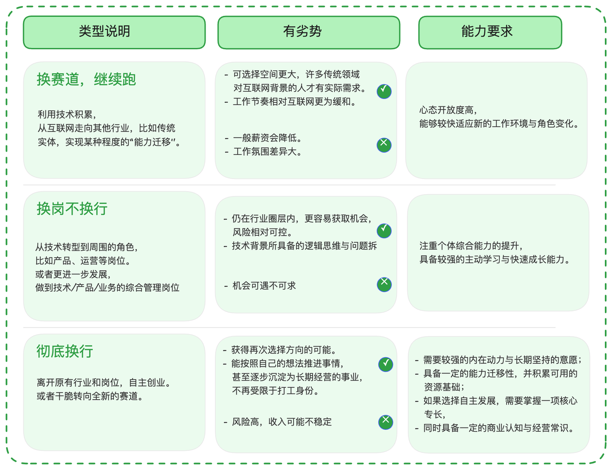
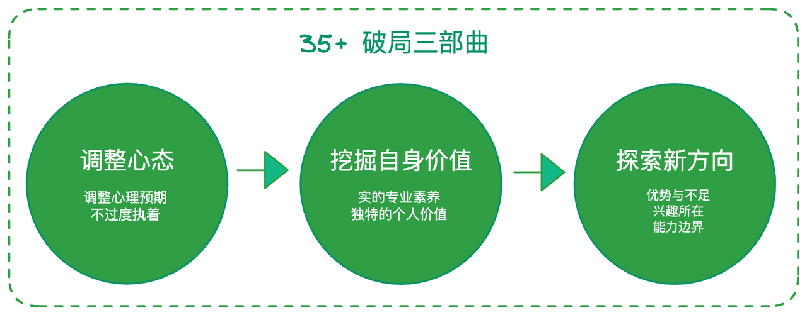

<a href="https://golangstar.cn/life_series/35.html" target="_blank">
  
</a >

新年第一天上班，祝大家开工大吉！今天不聊技术，也不聊面试。跟大家聊聊程序员的职业发展吧。大环境+AI的冲击下，以及在日益见长的年岁面前，值此深夜，秀才也焦虑，迷茫了......。但是路总要一步一步往下走，毕竟后面还有几十年要走呢？今天就先聊聊咱们程序员届的年龄红线“35”。

在程序员的世界里，“35岁”已经默认成为了职业生涯的终点了。无论你现在是意气风发的职场新人，还是已经在代码堆里摸爬滚打了五六年的中坚力量，只要你打开社交软件，那种扑面而来的“中年焦虑”大概率已经让你提前感受到了职业生涯的暮色。大家早已心照不宣：过了这个坎儿，技术人的路就到头了。

前两天，我的一位在大厂卷了十年的老友在深夜发来消息。他感叹说，现在的职场晋升，哪里是职级跳跃啊？那简直就是一场生死战。升上去了，也只是在裁员的浪潮里暂时抓到了一块浮木，能让你在岸上再多喘两口匀气儿；要是原地踏步，哪怕你还是那个兢兢业业的码农，也随时可能被列入下一波“优化”的名单。

这种焦虑，其实源自两个冷冰冰的现实：一个是招聘端那道心照不宣的年龄红线，很多一线开发岗只要“35岁以下”；另一个是企业内部那套严苛的对标逻辑——如果你到了某个岁数还没坐上总监的位置，似乎就意味着你这辈子在技术这条路上已经“报废”了。

但我想告诉你的是，技术人的职业版图，远比你想象的要辽阔。所谓的“35岁危机”，其实只是因为我们太久没抬头看路了。那些消失在大家视线里的老程序员们，并没有真的“谢幕”，他们只是在不同的赛道上，开启了更有生命力的下半场。

## **1. 五种截然不同的人生样本**

很多人好奇，那些没能在互联网大厂里一直待下去的人，最后都去干嘛了？是送外卖了，还是回老家考公了？其实，大部分人依然在自己的专业领域里精进，只是他们学会了如何把积累了十年的技术底蕴，转化成更具爆发力的个人资产。

这里有五个真实的故事，他们曾和你一样，在深夜的写字楼里怀疑人生。

* **样本A：逃离百万年薪的牢笼，在“慢行业”里降维打击。** 他今年37岁，曾是某知名电商平台的资深架构师。那几年，他拿着令人眼红的高薪，却也过着“非人”的生活：每天凌晨一点到家，满脑子都是服务器崩溃和高并发，连女儿叫他一声爸爸都成了奢侈。 去年，他做了一个震惊朋友圈的决定——主动降薪50%，去了一家深耕智能农机装备的实业公司。周围人都说他疯了，但他却说，这是他十年来最清醒的一次。现在的他，把互联网那一套敏捷开发和数字化架构带进了传统的工厂，不仅成了公司的技术定海神针，更重要的是，他终于能在这个“慢节奏”的行业里，重新找回了陪家人吃晚饭的权利。

* **样本B：从“纯技术”进化为“跨界大佬”，成了企业的香饽饽** 。这位42岁的大哥，职业轨迹非常有意思。他在大厂带过团队，也参与过核心业务的从零到一。在40岁那年，他意识到纯技术的溢价正在消失，于是他主动跨界，去钻研产品逻辑和商业模式。 现在的他，是一家出海社交平台的联合创始人。他不再只关心代码写得优不优雅，更关心用户留存和商业闭环。在这个全球化的时代，这种既懂技术底层、又懂商业玩法的“复合型人才”，简直是资本市场的宠儿，很多正在出海的传统企业都想重金邀他加盟。

* **样本C：脱离大厂的内卷，靠“利基市场”成了自由技术侠。** 他今年34岁，曾是某大厂的资深前端。长期的熬夜让他的颈椎和肠胃亮起了红灯。离职后，他没有急着找下一份工作，而是通过以前积攒的技术口碑，专门为几家垂直行业的银行做系统安全维护。 现在他手里攥着几个长期的合作合同，收入不仅没缩水，反而因为省去了大厂那些无效的会议和内耗，效率提升了一大截。他笑称自己现在是“技术个体户”，赚的是专业手艺的钱，拿回的是对生命的掌控权。

* **样本D：在起起落落中寻找“格局”的连续创业者。** 40岁的他，从大厂出来已经快五年了。中间经历过两次创业失败，最惨的时候甚至考虑过卖房。但他却说，这五年让他从一个“螺丝钉”变成了一个“全能战士”。 去年的新项目——一个基于AI的社区服务SaaS终于走上了正轨。我问他后悔离开大厂吗？他指了指窗外的夜色说：“在大厂，我只是在看老板画的蓝图；出来后，我是在亲手绘制自己的世界。这种开阔眼界的感觉，哪怕再苦也值了。”

* **样本E：在北欧的静谧中，重拾纯粹的代码之光。** 43岁的他，因为对那种“35岁必淘汰”的环境感到倦怠，全家迁往了北欧。在那边，他发现40多岁的程序员简直是正当年，甚至有些白发苍苍的老爷爷还在快乐地优化算法。在那边，没有人会因为你的年龄而质疑你的产出，他重新找回了那种初次接触计算机时的纯粹快乐，他觉得，写代码这件事，他能干到80岁。

## **2. 下半场的三条主干道**

透过这些真实的样本，我们可以清晰地看到，35岁以后的路其实可以归纳为这三种逻辑。

1. **“降维打击”模式（换行不换岗）：** 带着互联网的先进生产力和高效率逻辑，去赋能那些数字化程度还不高的传统实业。这是最稳妥的转型，虽然薪酬可能会经历一段阵痛，但你的职场寿命会极大地延长。

2. **“复合增长”模式（换岗不换行）：** 在你熟悉的领域里横向扩展。别只盯着那几行代码，试着去懂一点产品，懂一点市场，甚至懂一点法律。当你的技术背景叠加了商业洞察力，你就会从一个“昂贵的工具人”变成一个不可替代的“业务合伙人”。

3. **“职业重组”模式（大转型）：** 也就是像那些创业者一样，把过往十年的技术积累、项目管理经验和人脉资源进行彻底的排列组合。这需要你有一颗敢于推倒重来的心，也需要你持续学习的动力。

为了帮大家做更直观的选择，我总结了一份对比清单：

## **3. 35+危机的破局心法**

看清了这些可能性，你或许会松一口气，但可能还是会问：那我现在该怎么准备？我也曾被这种问题深深困扰。在选择告别大厂、成为一名自由职业者的探索中，我有三点心得想分享给你。

### **3.1 调整心态**

我们必须承认，互联网的“黄金时代”正在谢幕。就像几十年前的基建潮或电信潮一样，行业在回归常态。现在的跳槽，可能真的不再会有动辄50%的涨幅，甚至降薪入场会成为常态。我们要调整预期：如果一个岗位能给你带来长期的复利和更广阔的视野，眼前的降薪其实是一种“跨期套利”。

还有一个必修的心态，我称之为**警惕“成年人的贪婪”**。 很多人的焦虑，其实是想把所有好事占尽：既想要大厂的平台和高薪，又想要弹性自由的时间，还想要绝对的职业安全感。这在现实中几乎是不存在的。每一项选择背后都有其代价。如果你选择了高薪，就要接受随之而来的高压和内卷；如果你选择了探索第二曲线，就要接受短期内收入的跌落。想通了这一点，你才能真正从纠结中解脱出来。

### **3.2 挖掘自身价值**

想要在变动的环境里活下来，你得先证明自己比别人更有价值。

前阵子，有个工作不到五年的年轻人来咨询我，说他快30了，每天都在想以后被裁了怎么办。我一聊发现，他当前的工作其实干得很出色，完全是陷入了那种“预支焦虑”。

其实，企业的生存逻辑很简单：**只要你给公司创造的价值，扣除掉你的工资后，依然有巨大的盈余，你就一直有竞争力。**

在这个阶段，与其盲目地去搞什么副业，不如把当下的技术深度扎下去。你能不能成为组里那个对底层架构最了如指掌的人？你能不能成为那个业务逻辑理解最透彻的人？当你能解决那些别人解决不了的“诡异Bug”，或者能把繁杂的业务梳理得清清楚楚，你就在团队里建立了自己的“护城河”。这种独特价值，才是你应对危机最硬的底牌。

### **3.3 积极探索新方向**

如果你已经厌倦了现在的生活，或者发现现在的岗位已经出现了结构性的瓶颈，那你得提前开始寻找属于你的“下半场”了。

我建议你尝试回答这三个问题，它们能帮你认清自己：

1. **你的“超能力”是什么？** 做哪些事让你觉得如鱼得水，甚至不用怎么发力就能拿到比别人好的结果？

2. **你的“原动力”是什么？** 哪些事是你就算没人付钱，也会在周末主动去钻研、去思考的？

3. **你的“能力边界”在哪里？** 结合你过去的经验，你到底能解决哪类核心问题？

我们需要花费很长的时间去自我对话。意识到自身的强点在哪里，兴趣在哪里。而不要再去死磕哪些底层原理了。尤其是在AI高度发达的今天，更应该如此。要把我们自身擅长的点和兴趣点结合到自身的职业发展上来。慢慢走出属于自己的一条人生路径。

最重要的，是**大胆破圈，去见众生**。

很多技术人的世界太小了，每天除了代码就是各种自媒体贩卖的焦虑。我们习惯了把自己锁在“茧房”里，以为周围的人就是全部的世界。 要想破局，就得去和不同行业的人聊天，去看看真实的世界在发生什么。我的一位朋友，发现自己喜欢分享，就坚持参加公司的内训师计划，一做就是七八年。现在的她，既懂研发又懂培训，35岁以后的路比谁都宽。

哪怕是去报个兴趣班，或者找那个行业的资深人士吃顿饭，这种低成本的探索，能让你看到原来世界还有这么多种活法。35岁危机，想，永远全是困难；干，才有生路。

## **4. 写在最后**

总结一下，那些能优雅跨越35岁周期的技术人，身上通常都刻着这三个基因：心态极度开放、自我认知极度清晰、以及对未来有着极度的耐心。

我知道，读到这里，你可能还是会对未来感到一丝迷茫。但我这儿有一个能给你底气的“硬核事实”。根据最新的数据推算，如果你现在35岁，身处像北京这样的一线城市，你大概率能活到80岁以上。也就是说，在漫长的人生马拉松里，你才刚刚跑完了三分之一。

**35岁，对于很多人来说只是“下半场”的入场口。既然未来还有整整60年，既然路还那么长，咱们又有什么好慌的呢？**

**职场碎碎念：** 你理想中的35岁以后的工作状态是什么样的？为了达到那个状态，现在的你正在往自己的百宝箱里放什么样的筹码？欢迎在评论区，咱们一起深度聊聊。

如果你觉得这篇文章戳中了你的痛点，也请分享给身边那些还在深夜焦虑的小伙伴。程序员的职业规划，咱们要稳扎稳打，心里有谱，脚下才有力。

## **学习交流**

> 如果您觉得文章有帮助，可以关注下秀才的<strong style="color: red;">公众号：IT杨秀才</strong>，后续更多优质的文章都会在公众号第一时间发布，不一定会及时同步到网站。点个关注👇，优质内容不错过

