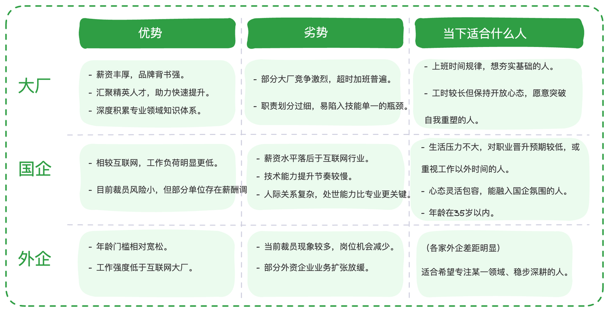

<a href="https://golangstar.cn/life_series/company.html" target="_blank">
  
</a >

最近跟朋友，同事吃饭聚会的时候，我发现“上岸”这个词出现的频率高得惊人。以前大家聚在一起聊的是年终奖几倍、股票怎么分；现在大家私下碰头，问的最多的一句话是：“兄弟，你上岸了吗？”

前阵子，有个前公司的朋友找我聊天，他的经历很有代表性。这个老哥硕士毕业五年，三十而立，是个正儿八经的 Java 资深开发者。他职场的起点不高，从几十人的草台班子，一路杀到了千人规模的中型企业。本想着趁着三十岁这把火，往一线大厂冲一冲，把薪资再往上顶一顶。

可事与愿违，他看着大厂此起彼伏的“毕业典礼”，心虚了。这时候，身边的声音开始诱惑他：“去什么大厂啊？现在这行情，赶紧找个国企或者外企躲躲吧。那里没裁员，也没什么 35 岁危机，那才是真正的‘上岸’。”

大厂、国企、外企，这似乎成了当下技术人面前的三岔路口。但这真的只是一个简单的选择题吗？并不是这么简单，这本质上是一道**技术人职业路径的底层逻辑题**。想要选对，我们得先把这三个方向的“围城”看透。

## **1. 大厂的“卷”，到底在卷什么？**

我在大厂待了10年，从滴滴到华为，再到腾讯。很多人只看到了大厂的累，却没看清大厂背后的价值。在我看来，如果你能在大厂扎根，你拿到的不仅仅是高薪，更是三样“硬通货”：

1. **高浓度的知识沉淀**：大厂就像一个巨大的图书馆。比如阿里的 ATA，那是无数大咖真刀真枪拼出来的实战经验。这些东西在外面看都要“脱敏”，但在内部，你可以顺着文档直接找到作者去请教。

2. **精英圈子的入场券**：在大厂，你身边的人都很优秀。这种“密度”会潜移默化地影响你的思维。即便以后离职了，这些前同事、前 Leader 形成的内推圈子，依然是你最强的职场护城河。

3. **领先行业的领域视野**：大厂处理的是亿级流量，解决的是行业最尖端、最复杂的难题。在这种环境下养出来的眼界，是你未来创造自己事业的起点。

**但大厂的阴影也同样明显：**

**一是“为了讲故事而内卷”**。当蛋糕不再变大时，大家就开始互切蛋糕。 比如测试岗，现在谁还单纯看业务质量？大家都在卷平台、卷工具。哪怕是冗余的工具，只要故事讲得漂亮，就能拿高绩效、拿晋升。而务实干活的人，反而容易被边缘化。

**二是“螺丝钉陷阱”**。分工太细，导致你只盯着自己那一亩三分地。 后端不懂前端，前端不懂运维，管理层担心离开团队就成了“废人”。这种危机感，让很多大厂人像被困在黄金囚牢里。

**什么样的适合去大厂？** 要么是工作五年内，需要去大厂镀金、建立规范体系的新人；要么是工作多年，但敢于“打碎自己再重塑”的资深大牛。

## **2. 国企的“稳”，真的是铁饭碗吗？**

很多人觉得国企就是“养老”，但我接触过多位国企的朋友后发现，事实并非如此。

有个老哥在一家大型国银做了十多年。他告诉我，这两年压力激增。 “国产化翻新”项目一个接一个，领导带头鼓励加班。想晋升？不仅要熬资历，还得看绩效，甚至要接受一年以上的外派。在这个系统里，如果你太有“互联网思维”去质疑方案，反而会显得格格不入。

另一位国企朋友，降薪 30% 进了国字号科技公司。 他本以为能每天 5 点半回家吃完饭，看看新闻联播，结果发现单位开始考核“系统营收”，还要重新定级、变相降薪。他感慨道：**“国企难的不是做事，而是做人。”** 在国企，你的用户是小兵，你的客户是老板，处理错综复杂的总部、子公司关系，比写 Bug 难多了。

**国企生存的真相：**

1. **没有绝对的稳定**：降薪、变相卷、上升通道狭窄，这些问题国企同样存在。

2. **人情世故大于技术逻辑**：这对内向的技术人来说，往往是巨大的挑战。

3. **技术基建滞后**：如果你是个技术迷，在这里可能会觉得“武功尽失”。

## **3. 外企的“香”，是不是没有保质期？**

外企一度被神化为“人间天堂”，提倡 WLB（工作生活平衡），没有年龄限制。

确实，很多欧美企业氛围人性化。一位前民企员工去外企后说，他终于觉得自己“年轻”了，因为周围多的是四十多岁写代码的人。但现实也很骨感。 不少老牌外企面临增长停滞，核心技术不在国内。更重要的是，现在外企也在“瘦身”。不少 500 强外企关停了国内城市的分支。机会在变少，而且从大厂跳过去，大概率要接受降薪。

更重要的是，现在IT的大环境不好，不只是中国，海外更严重，近两年各知名大厂大裁员的消息也是屡见不鲜。像微软，IBM这些全球头部的IT公司都在大裁员，哪还有什么稳定性可言呢？

## **4. 剥掉标签，你到底在选什么？**

我们往往容易陷入一种“标签化思维”：大厂 = 内卷，国企 = 躺平，外企 = 养老。但实际上，每家企业都是一个复杂的多面体。

《远见》这本书里有个观点：**职业生涯是一场长达 45 年的马拉松。** 大多数人只盯着下周二的升职加薪，却不想想自己在四五十岁时，是否还有选择权。

回到开头那位做选择题的老哥。他 30 岁，处于技术人的黄金“发展期”。 如果他所在的池塘已经成了死水，那即便大厂再卷，他也应该去。因为大厂能让他去“大海”里游一游，建立专业壁垒。大厂不一定是终点，但它是他职业下半场最好的基石。

那么，到底什么是真正的“上岸”？

## **5. 终极上岸：拥有“U 盘化”的自由**

我认识的另一个朋友，大厂十年，两年前出来创业。 他坦言现在虽然累，但心里比在大厂时踏实。因为他不再是平台上的螺丝钉，而是真正看到了商业的闭环。这个时代，指望在一家公司干到退休已经不现实了。 **真正的上岸，不是找到一个避风港，而是拥有一种“工作自由”。**&#x4E5F;就是罗振宇老师提过的“U 盘化生存”：**自带信息，不装系统，随时插拔，自由协作。**

这需要你具备两个特质：

1. **有一项可持续变现的专业专长。**

2. **脱离平台，你依然是一个独立的战斗单元。**

就像现在很多的技术自媒体，AI博主，他们拥有技术以外的专长，有写作能力，有获取粉丝的能力，有运营能力，他们已经是一个拥有多项能力的社会多面体了，而不再是一个知识懂点技术的码农。哪怕不依赖任何公司，不依赖任何平台，也能为他人提供价值，有自己的一份收入。我们所需要的正是这种会随着年龄增长而增值的能力，它才不会受 35 岁的限制。

## **6. 写在最后**

职业选择，本质上是你在做人生的“尽职调查”。不要在电脑前空想，要去真实的世界里实验。 大厂的薪资、国企的节奏、外企的氛围，你最看重哪一个？这个答案只有你自己能给。

荣格说：“真正的人生从四十岁才刚刚开始，在那之前你只是在做调研而已。”勇敢地去调研你的人生吧。每一步弯路，其实都是在为你未来的“上岸”积攒航行的动力。

***

**今日互动：** 你现在是在“围城”里，还是在寻找“岸”？你目前最看重的职场价值是什么？欢迎在留言区和我聊聊。

如果你觉得这篇文章对你有启发，欢迎转发给身边同样迷茫的朋友。

## **学习交流**

> 如果您觉得文章有帮助，可以关注下秀才的<strong style="color: red;">公众号：IT杨秀才</strong>，后续更多优质的文章都会在公众号第一时间发布，不一定会及时同步到网站。点个关注👇，优质内容不错过

