[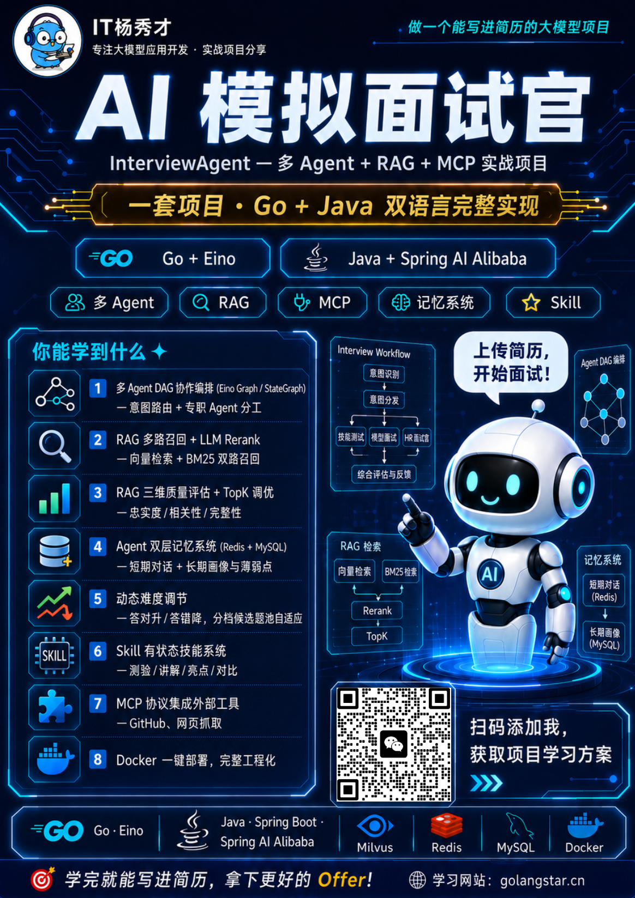](/projects/interview-agent.md)

**AI 模拟面试官（InterviewAgent）** 是一个精心打磨的大模型应用开发实战项目。

而且它还有个**重磅升级**：这个项目用 **Go（Eino 框架）和 Java（Spring Boot + Spring AI Alibaba 框架）两种语言各做了一套完整实现**。同一套架构、同一套能力，Go 开发者和 Java 开发者都能用最熟悉的技术栈直接上手——这在面试里还是个隐藏加分项：**能体现你跨语言、跨框架落地同一个 AI 系统的架构能力**。

先说结论：这不是一个调 API 套壳的玩具项目，而是一个涵盖**多 Agent 协作、RAG 多路召回、MCP 协议、记忆系统、Skill 技能系统、RAG 评估体系**的完整工程级 AI 应用。配套深度教程，从需求分析到方案设计到代码实现到简历面试，手把手带你从零搭建。

更关键的是——**学完之后你可以 Docker 一键部署，直接当成自己的 AI 面试教练用**，辅助你真正的面试准备。学技术、用工具、攒项目经历，一举多得。

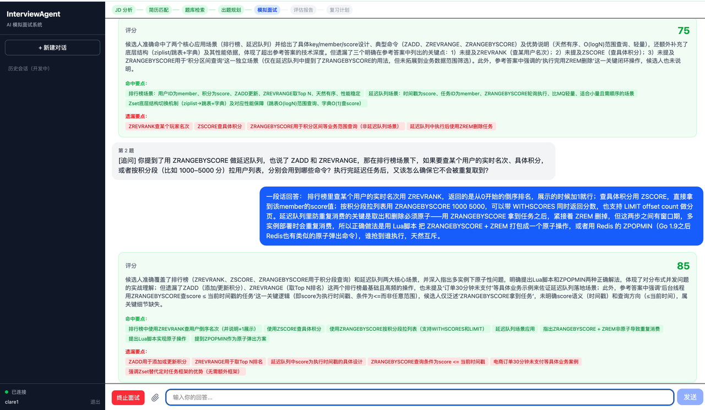

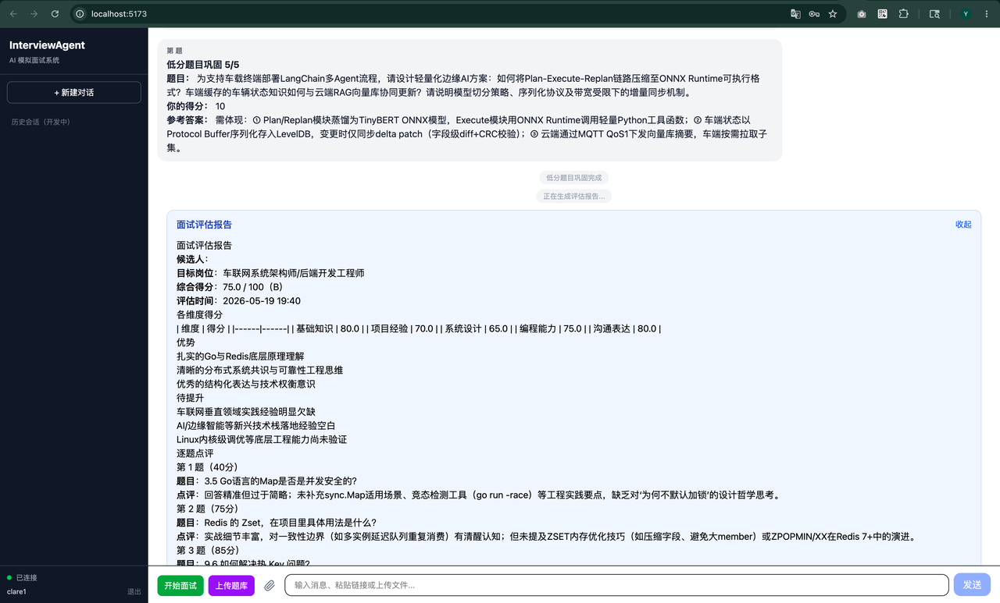

***

## **项目做了什么**

一句话：**上传简历 + 输入岗位 JD → AI 自动做一场完整的模拟面试 → 给你打分、出报告、制定复习计划。**

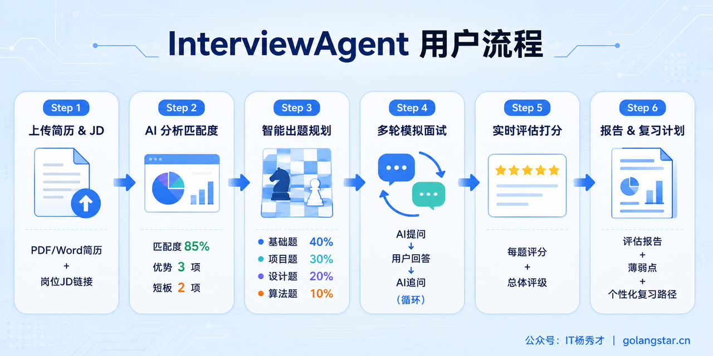

完整流程覆盖面试准备的每一个环节：

1. **JD 智能解析**：粘贴岗位 JD 或招聘链接，AI 自动提取技术栈、职级要求、核心能力项

2. **简历深度匹配**：上传 PDF/Word 简历，AI 分析匹配度，找出你的优势和短板

3) **智能出题规划**：根据 JD + 简历 + RAG 题库检索，自动规划题目类型和难度分布

4) **多轮模拟面试**：AI 面试官逐题提问，根据你的回答实时追问深挖，模拟真实面试节奏

5. **实时评估打分**：每题即时评分，面试结束生成多维度评估报告

6. **个性化复习计划**：基于薄弱点生成复习路径，MCP 推荐 GitHub 开源学习资源

***

## **系统架构：一套架构，两种语言落地**

市面上大量所谓的 AI 项目，本质上就是套了一层 Prompt 的 API 转发，面试官一问就穿帮。这个项目不一样——它是一个**真正的多 Agent 系统**：7 个 Agent 协作、RAG 检索增强、双层记忆、可插拔技能模块、三维评估体系，每个模块都有完整的设计文档和工程实现。

而且**这套架构在 Go 和 Java 里各完整落地了一遍**：

| 能力            | Go 实现                                    | Java 实现                             |
| ------------- | ---------------------------------------- | ----------------------------------- |
| Agent 编排      | Eino Graph DAG                           | Spring AI Alibaba Graph（StateGraph） |
| 工具调用          | Eino ReAct                               | Spring AI Alibaba ReactAgent        |
| 向量检索          | Milvus（Eino 组件）                          | Milvus（milvus-sdk-java）             |
| 大模型/Embedding | 通义千问 DashScope / text-embedding-v3（两版一致） | 同左                                  |
| 存储            | Redis + MySQL                            | Redis + MySQL（Spring Data）          |
| 部署            | Docker Compose                           | Docker Compose                      |

**Go版 · 架构图**

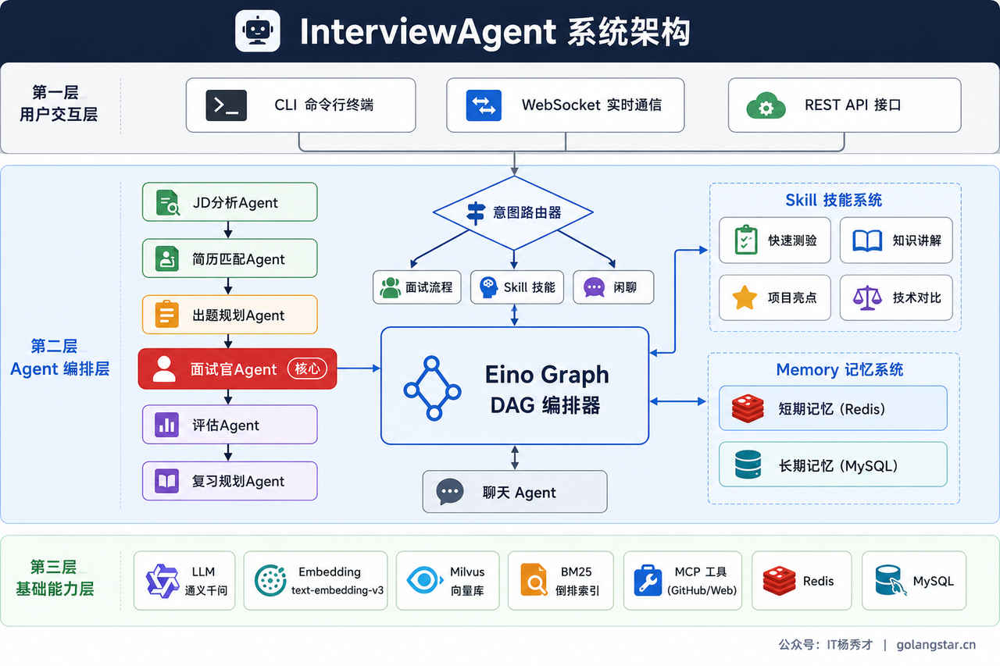

**Java版 · 架构图**

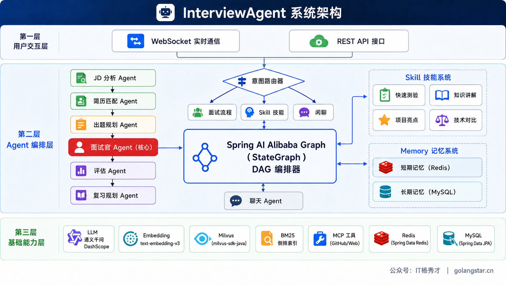

整个系统分为三层：

* **用户交互层**：支持 WebSocket 实时通信、REST API、（Go 版另含 CLI）等接入方式，满足前端对接、API 集成等场景。

* **Agent 编排层（核心）**：所有用户请求先经过**意图路由器**，智能判断是面试、技能练习还是闲聊。面试流程由 6 个专职 Agent 通过 **DAG 编排**串联——JD 分析 → 简历匹配 → 出题规划 → 面试官 → 评估 → 复习规划，每个 Agent 职责单一、可独立测试。编排层还挂载了 **Skill 技能系统**和 **Memory 记忆系统**（短期 Redis + 长期 MySQL）。

* **基础能力层**：大模型（通义千问）、Embedding、向量库（Milvus）、关键词索引（BM25）、MCP 外部工具、存储引擎（Redis + MySQL）。

这套三层架构的好处是**层与层之间职责清晰、耦合度低**——也正因为如此，我们才能把它干净地在 Go 和 Java 两套技术栈上各实现一遍，架构图几乎一模一样。

***

## **八大核心技术亮点**

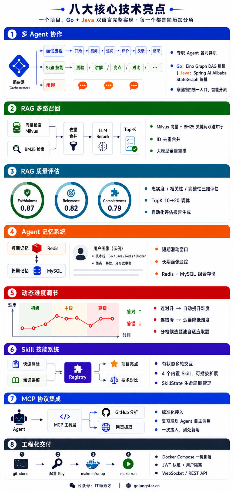

每一个亮点都是简历上的加分项，也是面试官最爱追问的技术方向。下面每一点我都标出 **Go 和 Java 各自怎么落地**——这正是双实现的价值所在：

1. **多 Agent DAG 协作编排** —— 不是一个 Prompt 走天下，而是 7 个 Agent 各司其职、通过有向无环图编排协作。**Go 用字节跳动 Eino 框架的 Graph DAG，Java 用 Spring AI Alibaba 的 StateGraph**：同一套"中心编排器按固定 DAG 串联 Agent"的思路，在两个主流框架上各实现一遍——面试时这就是实打实的框架落地能力。

2. **RAG 多路召回 + LLM Rerank** —— 向量检索（Milvus）+ BM25 关键词检索双路并行，去重合并后由大模型做全量重排精排，不是简单调一个向量库就完事。**两版召回逻辑完全一致**：Go 用 Eino 的 Retriever 组件 + 自研 BM25，Java 用 milvus-sdk-java + 自研内存 BM25 倒排索引；另各带一个 RRF 融合器作为备选。

3) **RAG 质量评估体系** —— 做 RAG 不做评估等于闭着眼开车。项目实现了 Faithfulness/Relevance/Completeness 三维评估 + TopK 调优实验，用数据说话。**Go / Java 各自带一条离线评估命令行流水线**，指标口径一致，换了分词或 TopK 跑一遍就能看出效果变化。

4) **Agent 记忆系统** —— 短期记忆管理当前对话上下文，长期记忆持久化用户画像和薄弱点，下次面试时 AI 记得你之前哪里薄弱、会重点考察。Redis（热数据）+ MySQL（持久化）双引擎。**Go 用 go-redis + 原生 SQL，Java 用 Spring Data Redis + Spring Data JPA**，存储模型一致。

5. **动态难度调节** —— 连续答对自动加难度，连续答错自动降难度；通过预生成的**分档候选题池 + 阶段化自适应取题**让难度真正调得动。**两版用的是同一套难度状态机算法**，模拟真实面试官的提问策略。

6. **Skill 技能系统** —— 区别于无状态的 Tool 调用，Skill 是**有状态的多轮交互能力模块**：快速测验、知识讲解、项目亮点提炼、技术对比 4 个内置技能，可插拔扩展。**两版都用 SkillRegistry 注册中心 + SkillState 管理多轮状态与生命周期。**

7) **MCP 协议集成** —— 接入 **GitHub 项目搜索、网页抓取**等外部工具，由复习规划 Agent 自主决定调用、推荐真实开源学习资源。**Go 用 Eino 的工具机制，Java 用 Spring AI 的 FunctionToolCallback 注册工具 + ReactAgent 自主调用**——同一个 ReAct 思路、两种框架实现。

8) **完整工程化交付** —— Docker Compose 一键部署，**只需一个 API Key**。**Go 版 `make run` 跑 Go 程序；Java 版 `make run` 跑 `mvn spring-boot:run`，并集成 spring-dotenv 自动读 `.env`，开箱即用**。JWT 认证、用户隔离、WebSocket 实时通信，两版一应俱全。

下面逐一拆解，每一个亮点都是简历上的加分项。

***

## **配套深度教程：双语言、5 大篇章**

项目不是丢给你一堆代码让你自己啃，而是配套了 **5 大篇章的深度教程**，覆盖从零到面试的完整路径，而且 **Go 版和 Java 版各成体系**——你想学哪门语言就跟哪套，知识点路线完全对齐。

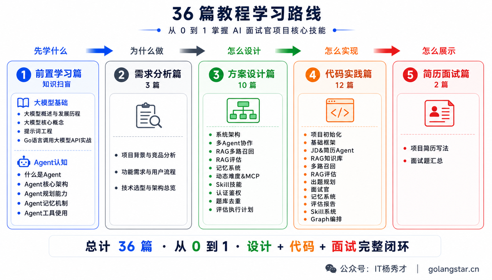

* **篇章一：前置学习篇** —— 先学什么。大模型基础 + Agent 认知，零基础也能跟上。

* **篇章二：需求分析篇** —— 为什么做。项目背景与竞品分析、功能需求与用户流程、技术选型与架构总览。

* **篇章三：方案设计篇** —— 怎么设计。系统架构、多 Agent 协作、RAG 多路召回、RAG 评估、记忆系统、动态难度\&MCP、Skill 技能系统、认证鉴权、题库去重等每个模块的设计方案。

* **篇章四：代码实践篇** —— 怎么实现。从零一步步实现，每篇对应一个独立可运行的阶段，**所有代码忠于真实项目实现，不杜撰**。

* **篇章五：简历面试篇** —— 怎么展示。项目简历写法（三段式 + 精简版模板）+ 项目面试题汇总（40 道高频题 + 参考回答）。

**项目目录：**

**部分项目文档截图：**

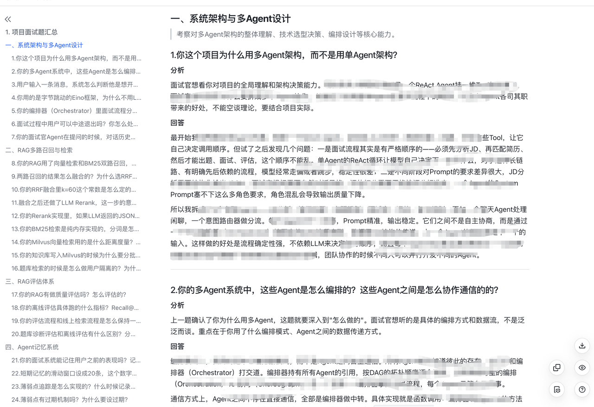

***

## **这个项目适合谁？**

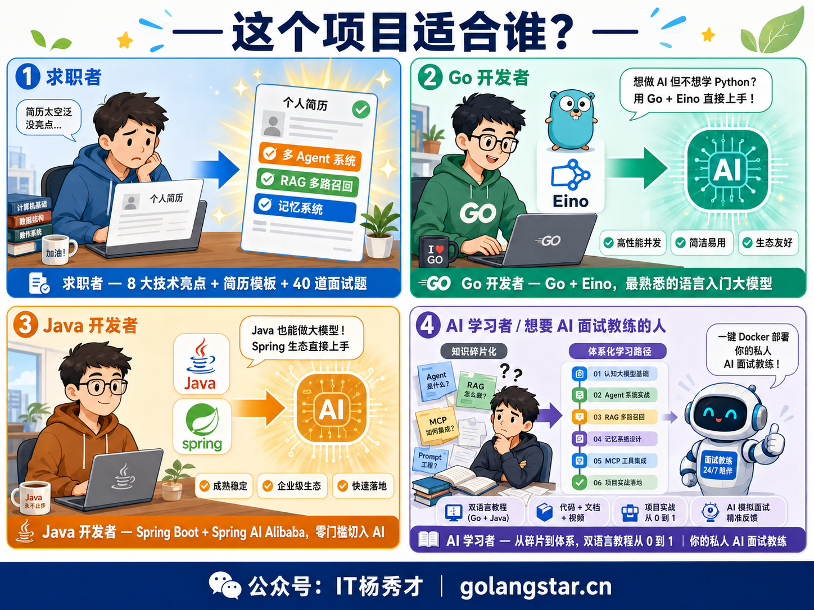

* **准备面试的求职者**：简历上缺一个有深度的大模型项目？8 大技术亮点随便拿 2-3 个就能撑起一段项目经历。配套简历写法 + 40 道面试题及参考回答。

* **想转 AI 方向的 Go 开发者**：不用学 Python，用最熟悉的 Go 语言入门大模型应用开发，基于字节跳动 Eino 框架，Go 生态最前沿。

* **做 AI 应用的 Java 开发者**：这是为你专门补的一套！基于 **Spring Boot 3.4 + Spring AI Alibaba**，Spring 全家桶的依赖注入、自动装配、数据访问你都熟，**几乎零门槛切入大模型应用开发**，还能落地 StateGraph 编排、ReactAgent 工具调用这些前沿能力。

* **学了理论想落地的 AI 学习者**：看了一堆 Agent/RAG 文章但从没完整实现过？双语言教程从 0 到 1，每个模块都有设计文档 + 代码实现 + 面试话术。

* **想要 AI 面试教练的任何人**：学完 Docker 一键部署，就是你的私人面试教练。上传简历、输入 JD，随时模拟面试，AI 实时反馈。

***

## **学完你能收获什么？**

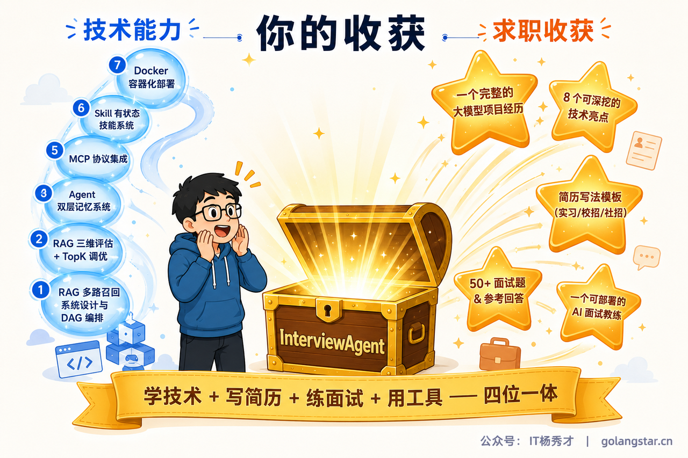

**学技术 + 写简历 + 练面试 + 用工具 —— 四位一体**，而且这次还多一份「**双语言实现**」的硬通货。

***

## **如何获取**

**项目价格** **「299」**，**Go + Java 双语言完整源码 + 全套深度教程**一次到手。[【AI模拟面试官】](/projects/interview-agent.md)、[【DevSupport AI】](/projects/dev-support.md)两个项目打包价只要**499**。购买「AI模拟面试官项目」之后会解锁这些权益：

* ✅ 详细的全套项目文档资料学习（文档永久可看）

* ✅ 完整的项目 **Java + Go**（+ Python）源码 —— 多语言实现都能学习

* ✅ 文档答疑解惑和专属项目交流群（飞书+微信）

* ✅ 现成 2 种简历写法（项目亮点和难点全都有），直接拿去面试

* ✅ 项目 50+ 相关面试题（全都是项目高频面试题，后续还会持续增加）

* ✅一个随时随地检验你学习成果，给你模拟面试和指导建议的AI面试教练

感兴趣直接添加项目导师微信，备注【项目咨询】即可

更多学习教程请访问学习网站：**[https://golangstar.cn](https://golangstar.cn/)**

