[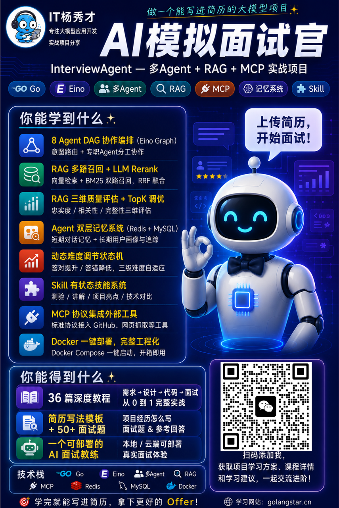](/projects/interview-agent.md)

这是秀才精心打磨的**大模型应用开发实战项目** —— **AI 模拟面试官（InterviewAgent）**。

先说结论：这不是一个调 API 套壳的玩具项目，而是一个涵盖**多 Agent 协作、RAG 多路召回、MCP 协议、记忆系统、Skill 技能系统、RAG 评估体系**的完整工程级 AI 应用。配套 **31 篇深度教程**，从需求分析到方案设计到代码实现到简历面试，手把手带你从零搭建。

更关键的是——**学完之后你可以 Docker 一键部署，直接当成自己的 AI 面试教练用，辅助你真正的面试准备**。学技术和用工具，一举两得。

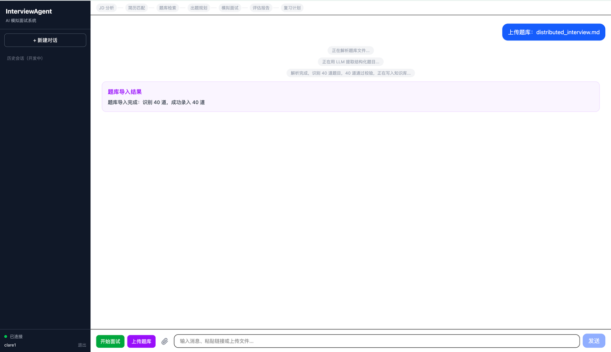

***

## **项目做了什么**

一句话：**上传简历 + 输入岗位 JD → AI 自动做一场完整的模拟面试 → 给你打分出报告制定复习计划。**

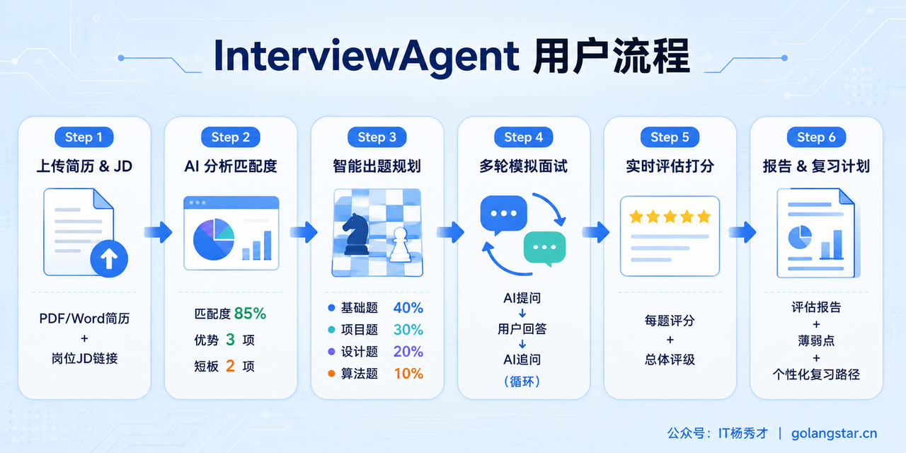

完整流程覆盖面试准备的每一个环节：

1. **JD 智能解析**：粘贴岗位 JD 或招聘链接，AI 自动提取技术栈、职级要求、核心能力项

2. **简历深度匹配**：上传 PDF/Word 简历，AI 分析匹配度，找出你的优势和短板

3. **智能出题规划**：根据 JD + 简历 + RAG 题库检索，自动规划题目类型和难度分布

4. **多轮模拟面试**：AI 面试官逐题提问，根据你的回答实时追问深挖，模拟真实面试节奏

5. **实时评估打分**：每题即时评分，面试结束生成多维度评估报告

6. **个性化复习计划**：基于薄弱点生成复习路径，MCP 推荐 GitHub 开源学习资源

***

## **系统架构**

市面上大量所谓的AI 项目，本质上就是套了一层 Prompt 的 API 转发，面试官一问就穿帮。这个项目不一样——它是一个**真正的多 Agent 系统**，8 个 Agent 协作、RAG 检索增强、双层记忆、可插拔技能模块、三维评估体系，每个模块都有完整的设计文档和工程实现。

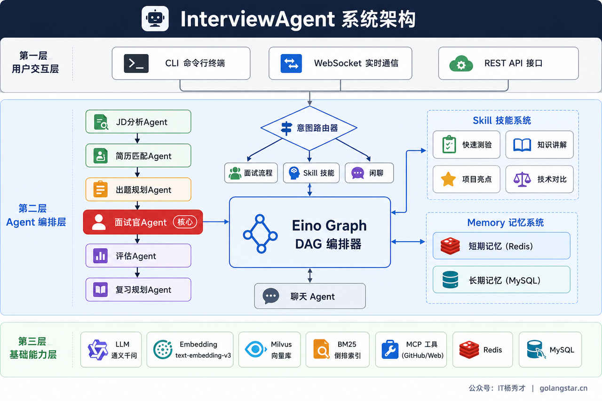

整个系统分为三层：

**用户交互层**：支持 CLI 命令行、WebSocket、REST API 三种接入方式，满足本地调试、前端对接、API 集成等不同场景。

**Agent 编排层**（核心）：所有用户请求先经过**意图路由器**，智能判断是面试、技能练习还是闲聊，分流到对应处理链路。面试流程由 6 个专职 Agent 通过 **Eino Graph DAG** 串联协作——JD 分析 → 简历匹配 → 出题规划 → 面试官 → 评估 → 复习规划，每个 Agent 职责单一、可独立测试。编排层还挂载了 **Skill 技能系统**（4 个可插拔多轮交互模块）和 **Memory 记忆系统**（短期 Redis + 长期 MySQL），为面试过程提供技能扩展和上下文记忆支撑。

**基础能力层**：底层是大模型（通义千问）、Embedding（text-embedding-v3）、向量库（Milvus）、关键词索引（BM25）、MCP 外部工具（GitHub/Web）以及存储引擎（Redis + MySQL），为上层提供 AI 推理、检索、存储等基础服务。

这个三层架构的好处是**层与层之间职责清晰、耦合度低**——换一个大模型只需要改基础层配置，加一个新 Agent 只需要在编排层注册，前端接入只需要对接交互层接口。

***

## **八大核心技术亮点**

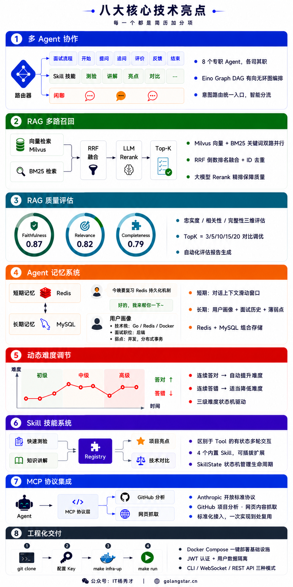

**1. 多 Agent DAG 协作编排** —— 不是 一个 Prompt 走天下，而是 **8 个 Agent 各司其职**（JD 分析、简历匹配、出题规划、面试官、评估、复习规划、聊天、意图路由），通过字节跳动 Eino 框架的 **Graph DAG 有向无环图**编排协作。

**2. RAG 多路召回 + LLM Rerank** —— 向量检索 + BM25 关键词检索双路并行，**RRF 融合去重 + 大模型精排**，不是简单调一个向量库就完事。

**3. RAG 质量评估体系** —— 做 RAG 不做评估等于闭着眼开车。项目实现了 **Faithfulness/Relevance/Completeness 三维评估**，配套 TopK 调优实验，用数据说话。

**4. Agent 记忆系统** —— **短期记忆**管理当前对话上下文，**长期记忆**持久化用户画像和薄弱点。下次面试时 AI 记得你之前哪里薄弱，会重点考察。Redis + MySQL 双引擎存储。

**5. 动态难度调节** —— 连续答对自动加难度，连续答错自动降难度，**三级难度状态机**模拟真实面试官的提问策略。

**6. Skill 技能系统** —— 区别于无状态的 Tool 调用，Skill 是**有状态的多轮交互能力模块**。4 个内置技能：快速测验、知识讲解、项目亮点提炼、技术对比，可插拔扩展。

**7. MCP 协议集成** —— 通过 Model Context Protocol 标准协议接入 **GitHub 项目分析、网页抓取**等外部工具，掌握下一代 AI 工具集成标准。

**8. 完整工程化交付** —— Docker Compose 一键部署，`make infra-up` 搞定 Milvus + Redis + MySQL，**只需一个 API Key，4 步跑通**。JWT 认证、用户隔离、多交互模式（CLI/WebSocket/REST API）一应俱全。

下面逐一拆解，每一个亮点都是简历上的加分项，也是面试官最爱追问的技术方向。

## **配套 36篇深度教程**

项目不是丢给你一堆代码让你自己啃，而是配套了 **5 大篇章、36 篇深度教程**，覆盖从零到面试的完整路径。

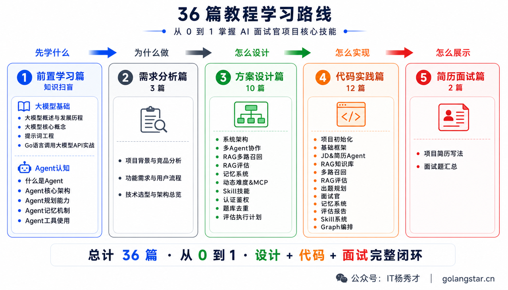

1. **篇章一：前置学习篇（9） —— 先学什么**

知识扫盲，零基础也能跟上后续的项目开发。

* **大模型基础**：大模型概述与发展历程 · 大模型核心概念 · 提示词工程 · Go 语言调用大模型 API 实战

* **Agent 认知**：什么是 Agent · Agent 核心架构 · Agent 规划能力 · Agent 记忆机制 · Agent 工具使用

- **篇章二：需求分析篇（3 篇）—— 为什么做**

明确项目背景、功能需求和技术选型。

* 项目背景与竞品分析

* 功能需求与用户流程

* 技术选型与架构总览

- **篇章三：方案设计篇（9 篇）—— 怎么设计**

详细设计每个模块的方案，看完就知道每行代码为什么这么写

* 系统架构设计 · 多 Agent 协作设计 · RAG 多路召回方案

* RAG 评估体系设计 · RAG 离线评估执行计划

* Agent 记忆系统设计 · 动态难度调节与 MCP 设计

* Skill 技能系统设计 · 认证鉴权设计 · 题库去重与用户隔离设计

- **篇章四：代码实践篇（12 篇）—— 怎么实现**

从零开始一步步实现，每篇对应一个独立可运行的阶段，**所有代码忠于真实项目实现，不杜撰**。

* 项目初始化 → 基础框架 → JD 分析与简历匹配 → RAG 知识库 → 多路召回与 Rerank → RAG 评估 → 出题规划 → 面试官 → 记忆系统 → 评估报告与复习规划 → Skill 系统 → Graph 全局编排

- **篇章五：简历面试篇（2 篇）—— 怎么展示**

把项目转化为简历亮点和面试话术。

* **项目简历写法**：STAR 法则 + 量化指标 + 实习/校招/社招不同级别写法模板

* **面试题汇总**：项目高频问题 + 参考回答，覆盖架构、RAG、Agent、工程化四大方向

**项目目录：**

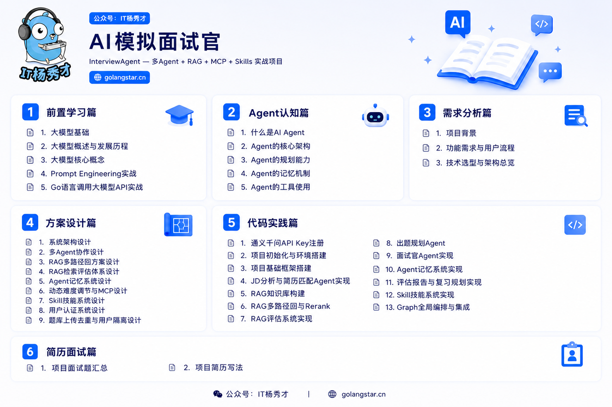

**部分项目文档截图：**

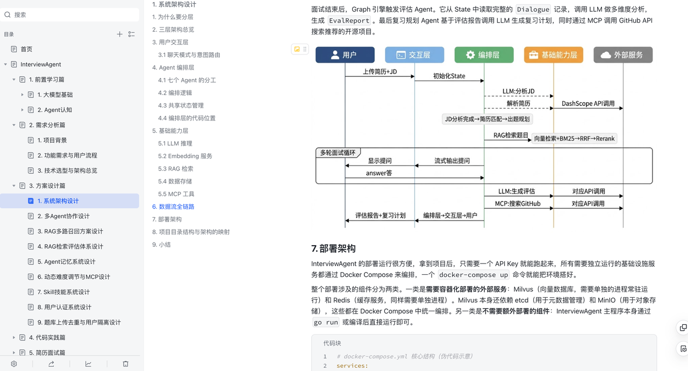

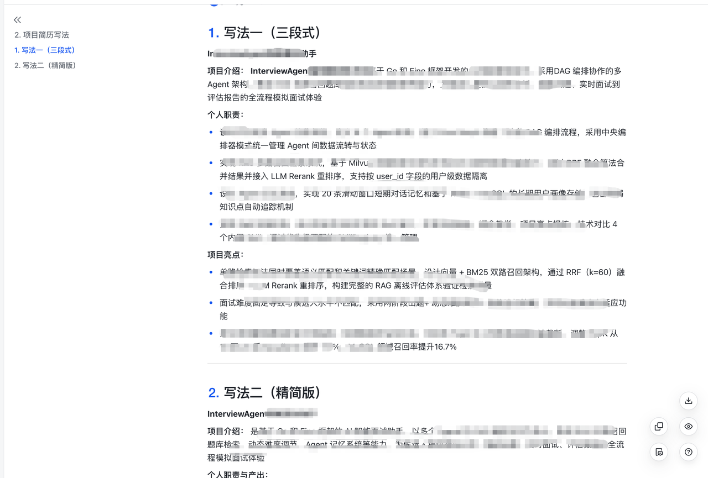

***

## **适合谁？**

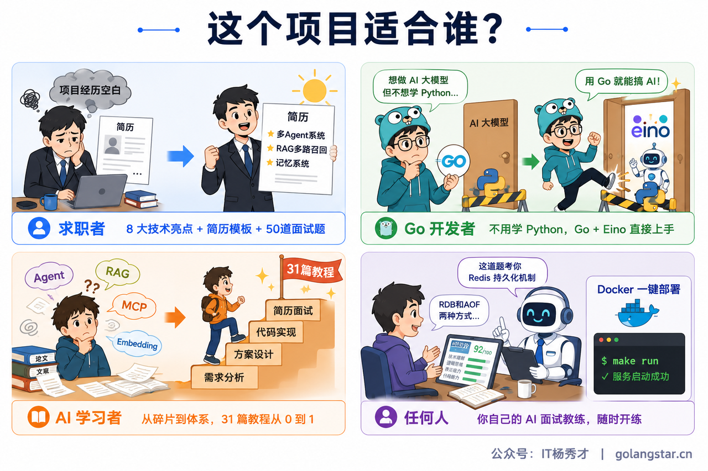

**准备面试的求职者**：简历上缺一个有深度的大模型项目？8 大技术亮点随便拿 2-3 个就能撑起一段项目经历。配套简历写法 + 50+ 面试题及参考回答。

**想转 AI 方向的 Go 开发者**：不用学 Python，用最熟悉的 Go 语言入门大模型应用开发。基于字节跳动 Eino 框架，Go 生态最前沿。

**学了理论想落地的 AI 学习者**：看了一堆 Agent/RAG 文章但从没完整实现过？31 篇教程从 0 到 1，每个模块都有设计文档 + 代码实现 + 面试话术。

**想要 AI 面试教练的任何人**：学完 Docker 一键部署，就是你的私人面试教练。上传简历、输入 JD，随时模拟面试，AI 实时反馈。

***

## **学完你能收获什么？**

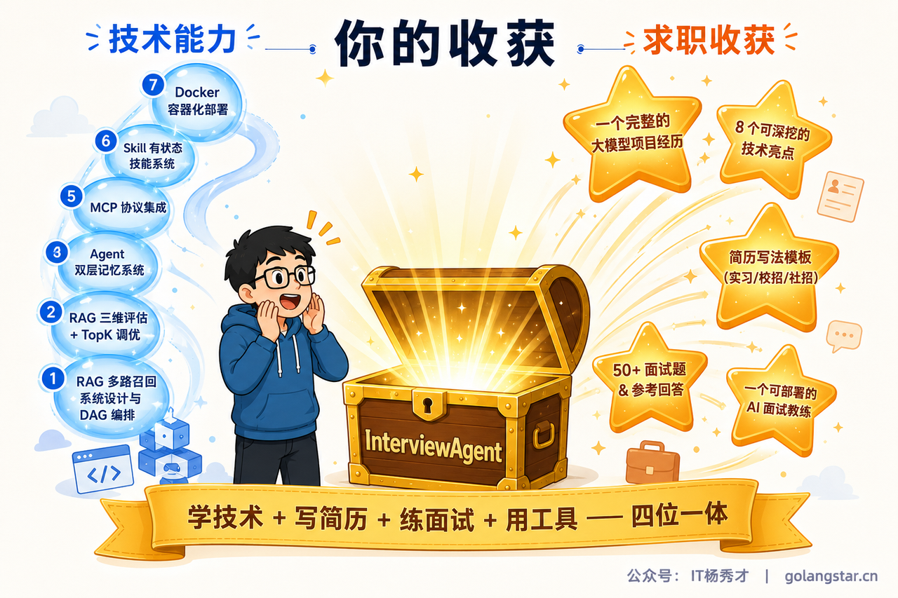

***

## **如何获取**

项目价格 **「299」**，现在市面上小红书，抖音上随便一个项目都是四五百了，这价格也算是白菜价了。而且现在购买还会享受一个早鸟项目福利，秀才后续会持续更新新的项目，新项目出来后，购买多个项目肯定不止这个价格。目前在新项目出来之前，购买InterviewAgent AI模拟面试官项目的话，后续所有更新的新项目免费赠送学习。

购买「**AI模拟面试官项目**」之后会解锁这些权益：

✅详细的全套项目文档资料学习（文档永久可看）

✅完整的项目源码

✅文档答疑解惑和专属项目交流群（飞书+微信）

✅现成2种简历写法（项目亮点和难点全都有），直接拿去面试

✅项目 50+ 相关面试题（全是项目高频面试题，后续还会持续增加）

✅一个随时随地检验你学习成果，给你模拟面试和指导建议的AI面试教练

感兴趣直接添加项目导师微信，备注【项目咨询】即可

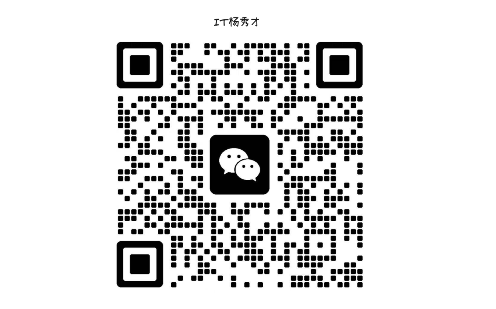

更多学习教程请访问学习网站：**[https://golangstar.cn](https://golangstar.cn/)**
