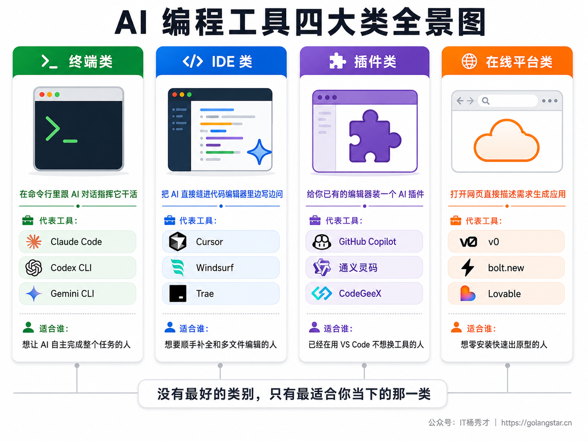
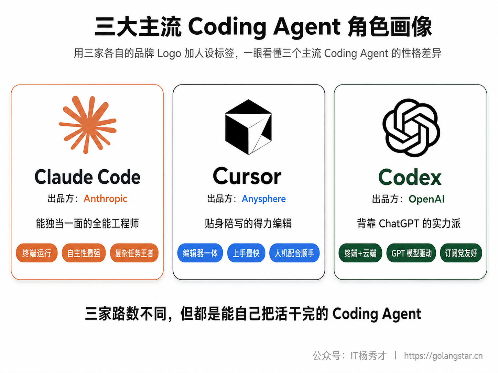
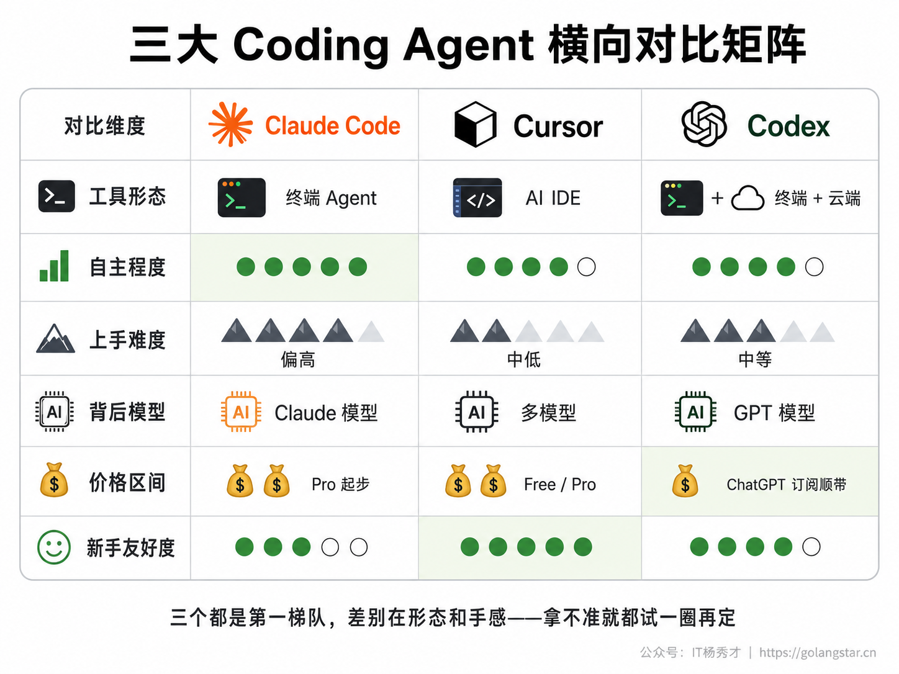
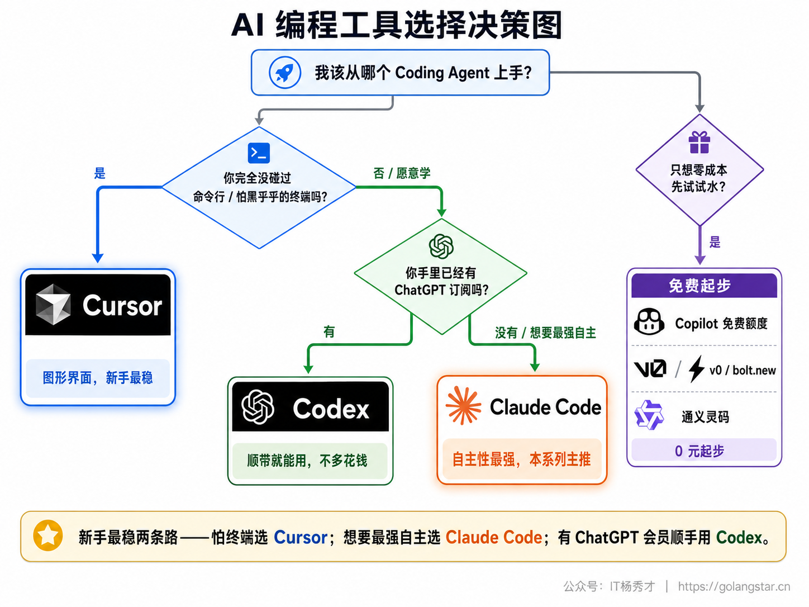
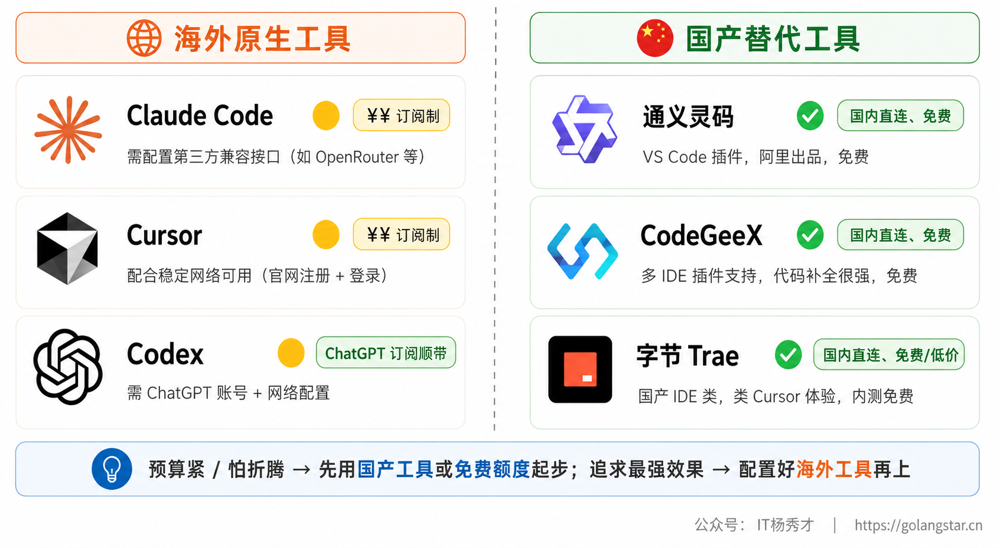

下定决心想玩 Vibe Coding，第一个拦路虎往往不是技术，而是选择。打开各种文章和视频，铺天盖地都是工具名字——Claude Code、Cursor、GitHub Copilot、Windsurf、Trae、v0、bolt.new……每个看起来都很厉害，每个都说自己是"最强 AI 编程工具"。新手一脸懵：这些到底有什么区别？我该装哪个？要不要花钱？会不会装错了走弯路？

这篇就来把这团乱麻理清楚。我不会让你把每个工具都装一遍，那是浪费时间。我会先帮你看懂这些工具大致分成哪几类、各自是什么路数，再把当下最主流的几个拎出来逐一拆解，最后给你一套"对号入座"的选择方法——不管你是完全不懂代码的小白，还是想提效的老手，都能在看完之后清楚地知道：我该从哪个工具开始。

## **1. 先把 AI 编程工具分个类**

工具看着多，但只要按"它长在哪、你怎么跟它打交道"这个角度一分类，立刻就清爽了。市面上的 AI 编程工具，大体可以归成四类。

**终端类**是这几年最火、也是本系列主推的一类。它活在你电脑的命令行（也就是那个黑乎乎、只能打字的窗口）里，你在里面用大白话给 AI 下指令，它能自己读你的项目文件、自己写代码、自己跑命令、自己测试，遇到问题还能自己调试。这一类的代表就是 **Claude Code**，还有 OpenAI 的 Codex CLI、Google 的 Gemini CLI。它的特点是"自主性强"——你交代一个任务，它能从头到尾自己张罗下来，特别适合 Vibe Coding 这种"我说需求、AI 干活"的模式。

**IDE 类**是把 AI 能力直接焊进了一个代码编辑器里。IDE 这个词你可能没听过，它的全称是"集成开发环境"，说人话就是程序员写代码用的那个专业软件，长得有点像加强版的记事本。这一类工具最典型的就是 **Cursor**，它本身就是一个完整的编辑器（基于大家常用的 VS Code 改的），你在里面写代码的时候，AI 随时在旁边待命——能帮你补全下一行、能选中一段代码让它改、也能开一个对话框让它跨多个文件改东西。同类的还有 Windsurf、字节的 Trae。

**插件类**和 IDE 类很像，区别在于它不是一个独立软件，而是一个"插件"，装到你已经在用的编辑器（最常见的是 VS Code）上。最有名的就是 **GitHub Copilot**，它就像给你的编辑器请了个副驾驶，你打字它在旁边猜你下一句想写啥、给你灰色的建议，按一下 Tab 就采纳。国内的通义灵码、CodeGeeX 也属于这一类。它的好处是不用换工具，你原来怎么用编辑器还怎么用，只是多了个 AI 帮手。

**在线平台类**最轻量，连软件都不用装，打开网页就能用。你在网页上用大白话描述想要的应用，它直接在云端帮你生成、还能直接预览效果，做好了点一下就能发布到网上。代表是 Vercel 的 **v0**、StackBlitz 的 **bolt.new**、还有 Lovable。这类工具特别适合快速验证一个想法、做个能演示的原型，缺点是做复杂项目时不如本地工具灵活。

这四类不是互相排斥的，很多人是混着用的——平时用 Claude Code 或 Cursor 干主要的活，想快速搭个页面原型时打开 v0 顺手生成一下。但作为新手，你没必要一上来全都碰，先认准一个主力工具练熟，比什么都重要。

## **2. 三大主流 Coding Agent 重点认识**

前面把工具分了四类，但你最该认真投入精力去掌握的，是这两年真正掀起 Vibe Coding 浪潮的一类——**Coding Agent（编程智能体）**。这个词听着唬人，意思其实很朴素：它不满足于"你写一半它补一半"或者"你问一句它答一句"，而是能自己规划步骤、自己写代码、自己跑命令、自己调试、自己把一整个任务从头办到尾的 AI。打个比方，普通的补全工具像个递工具的学徒，你伸手它递扳手；而 Coding Agent 像一个能接活的师傅，你说"把这台机器修好"，它自己就张罗开了。"你说需求、AI 干活"这种 Vibe Coding 最理想的体验，正是 Coding Agent 带来的。

当下这条赛道上最主流的三个，是 **Claude Code、Cursor 和 Codex**。把这三个搞清楚，你基本就抓住了 Vibe Coding 的七寸，市面上其他工具也大多能触类旁通。

### **2.1 Claude Code**

Claude Code 是 Anthropic 公司（也就是 Claude 这个大模型背后的公司）出的终端类 Coding Agent，也是本系列教程的主线工具。它最大的特点是**自主性极强**。你给它一个任务，比如"帮我做一个带登录功能的待办清单应用"，它会自己规划要建哪些文件、自己一个个写出来、自己在终端里跑命令安装依赖、跑起来发现有 Bug 还能自己定位修复，整个过程你几乎只需要在旁边看着、偶尔点头说"可以"或者提点修改意见。

这种"放手让它干"的体验，正是 Vibe Coding 最理想的样子。它背后用的是 Claude 系列大模型，在写代码这件事上属于第一梯队，尤其擅长理解一个完整项目的来龙去脉、做多步骤的复杂任务。对想认真用 AI 做点东西的人来说，它的上限很高。

它的"门槛"在于活在终端里，对从没用过命令行的纯小白来说，第一眼会有点陌生（不过别担心，本系列后面有专门一篇手把手教你装它、用它）。另外它是付费工具，国内用户使用还需要做一些网络和接口上的配置，这些后面也都会讲到。

### **2.2 Cursor**

Cursor 是目前最受欢迎的 IDE 类工具，可以理解成"一个内置了顶级 AI 的代码编辑器"。它是在 VS Code 的基础上改造的，所以如果你以前用过 VS Code，会感觉无比熟悉；就算没用过，它的界面也比纯终端友好得多——有菜单、有按钮、有文件列表，看得见摸得着。

Cursor 的精髓在于它把 AI 揉进了写代码的每一个动作里。你写代码时它会智能补全（Tab 一下接受），你选中一段代码可以让它解释或修改，而它的 **Agent 模式**则能像 Claude Code 那样，自主跨多个文件完成一整个任务——这正是它也算 Coding Agent 的原因。对很多人来说，Cursor 在"自己写一点 + AI 帮一点"和"完全让 AI 写"之间找到了一个很舒服的平衡点，既能享受 AI 的强大，又随时能自己插手。它对新手相当友好，是除 Claude Code 外我最推荐入门的工具。

### **2.3 Codex**

Codex 是 OpenAI 出的 Coding Agent，你可以把它简单理解成"ChatGPT 那家公司做的 Claude Code 对手"。它走的路数和 Claude Code 很像：能活在终端里，给它一个任务，它自己规划、自己写、自己跑、自己改，自主性是一个量级的；同时它还提供云端和编辑器插件等多种用法，你甚至可以把一个大任务丢给云上的它，过会儿回来收结果。

它背后用的是 OpenAI 专门为写代码优化过的 GPT 系列模型，实力很强。它最大的便利在于"顺带就能用"——如果你本来就是 ChatGPT 的订阅用户（Plus / Pro），那 Codex 基本是订阅里附带的能力，不用再额外掏一笔钱，这对手里已经有 ChatGPT 的人来说相当香。国内使用它和 Claude Code 类似，账号、网络、付费几关都要做点配置。如果你已经习惯了 OpenAI 的生态，Codex 会是非常自然的选择。

至于你可能也常听到的 **GitHub Copilot** 和 **Windsurf**，它们当然也很能打——Copilot 是 2021 年就带火"AI 帮你写代码"的老前辈，胜在补全顺手、生态成熟、还有免费额度；Windsurf 则是体验流畅的 IDE 类新锐。只是单论"放手让 AI 自主把活干完"的 Coding Agent 体验，眼下风头最劲、也最值得新手优先投入的，还是上面这三个，所以本系列的主线就围绕它们来讲。Copilot、Windsurf 以及各类在线平台，想了解的话，后面《其他实用工具》一篇会扫盲式地带你认识一圈。

## **3. 三个 Coding Agent 横向对比**

三个工具单独看都很能打，但放一起对比才能看出门道。我把几个你最该关心的维度——形态、自主程度、上手难度、背后模型、价格、对新手的友好度——整理成下面这张对比图。

把对比图里的关键差异用大白话再说透一点。

**形态**上三家各占一头：Claude Code 和 Codex 都主要活在终端里（Codex 还多一个云端和编辑器插件的用法），Cursor 则是一个完整的图形界面编辑器。这直接决定了它们的"长相"——前两个是打字对话的命令行，后一个是有菜单有按钮的软件。

**自主程度**上三个都很高，毕竟都叫 Coding Agent。Claude Code 在"放手让它独立干完复杂任务"这件事上口碑最稳；Codex 紧随其后，路数几乎一样；Cursor 的 Agent 模式同样能自主干活，但它的设计更鼓励"人机配合"，你随时能停下来自己改两笔。简单说，三个都能当"接活的师傅"，只是 Cursor 更愿意让你站在旁边一起动手。

**上手难度**和形态直接相关。Cursor 是图形界面，有按钮有菜单，新手看着最踏实，上手最平缓；Claude Code 和 Codex 活在终端，对没碰过命令行的人门槛略高一点。不过别被"终端"两个字吓退，它们实际用起来就是打字聊天，跟着教程走半小时就熟了。

**价格**这块大家最关心，单独拎出来在后面细说，这里先记个大概：三个都是付费为主。Cursor 有免费版加每月 20 美元上下的付费版；Claude Code 走 Claude 的订阅或 API 付费；Codex 则包含在 ChatGPT 的订阅里，如果你已经是 ChatGPT 会员，相当于不用多花钱。

## **4. 到底该怎么选**

讲了这么多，落到你自己头上，到底装哪个？别纠结，对号入座就行。选工具最实在的三个角度是：你的经验水平、你的预算、你的主要用途。

**按经验水平选。** 如果你是完全不懂代码的纯小白，又对命令行有点发怵，那从 **Cursor** 入手最稳妥，图形界面让你心里有底，犯了错也看得见在哪。如果你愿意稍微花点心思学，想直接上手体验最接近"我说需求、AI 全包"的爽感，那就直奔 **Claude Code**——它的学习曲线前面陡一点点，但翻过去之后的体验是另一个层次。如果你已经是会写点代码的开发者，那三个随便挑、甚至混着用：复杂的大任务交给 Claude Code 或 Codex，日常顺手改改用 Cursor。

**按预算选。** 手头已经有 **ChatGPT 订阅**的，**Codex** 几乎是白送的能力，先把它用起来最划算。想先零成本试试水的，可以用 **GitHub Copilot 的免费额度**，或者打开 **v0、bolt.new** 这类在线平台白嫖一波，足够你把 Vibe Coding 是什么感觉摸清楚。如果你愿意每月花 20 美元左右认真用，Cursor 的付费版很值；要追求最强效果、把 AI 编程当长期生产力工具，那 Claude Code 的投入也绝对回得了本，它帮你省下的时间远超那点订阅费。

**按用途选。** 如果你主要想快速做网页、搭原型、验证想法，在线平台 v0、bolt.new 出活最快；如果你想做一个像模像样的完整项目，那就用 Claude Code、Codex 或 Cursor 这类能通盘干活的 Coding Agent；如果你已经有自己的项目、只想在熟悉的编辑器里加个 AI 帮手，那 Cursor 或 Copilot 插件最省事。

说到底，选工具这事不用太焦虑。这些工具的免费版或试用额度都够你上手体验，**最好的办法就是花一个周末，把你看中的两三个都装上试一圈，留下手感最顺的那个**。工具是为你服务的，不是用来供着的，适合你的才是最好的。而且 Vibe Coding 的核心能力——把需求说清楚——是跨工具通用的，今天练熟了 Cursor，哪天想换 Claude Code，几乎无缝切换。

## **5. 国内用户的可用性与免费方案**

最后单独说一段中国用户最关心的事：这些工具在国内能不能用、要花多少钱、有没有不花钱的路子。这部分信息很现实，但对你能不能顺利起步至关重要。

先说现实情况。Claude Code、Cursor、Codex 这些都是海外工具，账号注册、网络访问、付费这三关，国内用户多少都会碰到一点门槛。好在这些门槛现在都有比较成熟的解决办法。以 Claude Code 为例，国内有不少第三方提供的"兼容接口"（也叫中转 API），相当于给你搭了一座桥，配置好之后就能正常用上，价格也比官方更亲民，具体怎么配置，本系列环境搭建篇会有一篇专门手把手教。Codex 同样需要 ChatGPT 账号和网络配置，Cursor 这类工具配合稳定的网络环境一般也能正常使用和付费。

如果你暂时不想折腾海外工具的网络和付费，国内也有几个很不错的平替，能让你零门槛先上手。**通义灵码**是阿里出的，VS Code 装个插件就能用，免费，背后是通义千问大模型，补全和对话都够用；**CodeGeeX** 是智谱出的，同样是免费插件路线；字节的 **Trae** 则是一个国产的 IDE 类工具，体验对标 Cursor，国内直连、对新手很友好。这些工具未必有海外顶级工具那么强，但作为入门体验、感受 Vibe Coding 是什么滋味，完全够用，而且省去了一切网络和付费的麻烦。

我的建议是这样：**如果你预算有限或者怕折腾，先用通义灵码、Trae 这类国产工具，或者 Copilot 的免费额度起步，把"用大白话指挥 AI 写代码"这件事先玩明白；等你确认自己真的要在这条路上认真走下去，再花点时间把 Claude Code 这类最强工具的环境配好，体验天花板级别的效果。** 起步阶段，趁手、能跑、没障碍，比工具有多强更重要。

## **6. 小结**

工具的世界永远在变，今天还在风口的明星产品，过一年可能就被新秀超越，这两年 AI 编程工具的迭代速度尤其快。所以与其纠结"哪个工具最强"这种注定没有标准答案、而且答案隔几个月就刷新的问题，不如记住一件更要紧的事：**工具会换，但跟 AI 高效协作的能力是你自己的。** 你越早开始动手，越早把"把需求讲清楚、看懂 AI 的产出、一轮轮迭代逼近目标"这套本事练出来，换什么工具对你来说都只是换个顺手程度的问题。

所以别再被满屏的工具名字晃花了眼。挑一个看着顺眼、用着顺手的，今天就把它装上，写下你的第一句 Prompt。真正的成长，从你跟 AI 的第一次对话开始，而不是从你把所有工具评测看完开始。

<h2><strong>关注秀才公众号：</strong><strong>IT杨秀才</strong><strong>，回复：</strong><strong>面试</strong></h2>

<strong>领取后端/AI面试题库PDF</strong>

🔥 配套实战项目，拆得开、跑得起、能写进简历

多 Agent 编排 + RAG 混合检索 · 31 篇深度教程 + 50+ 面试题

<a href="/projects/dev-support.html" style="display: inline-block; margin-top: 14px; background: #ff7a18; color: #fff; font-size: 18px; font-weight: bold; padding: 10px 28px; border-radius: 24px; text-decoration: none;">点击查看 DevSupport AI 实战项目 →</a>

 

