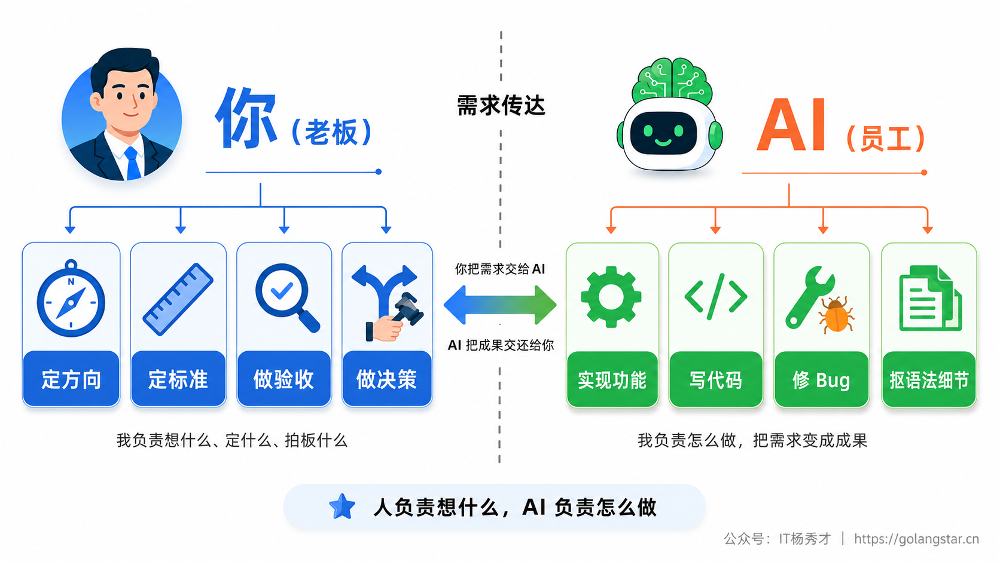
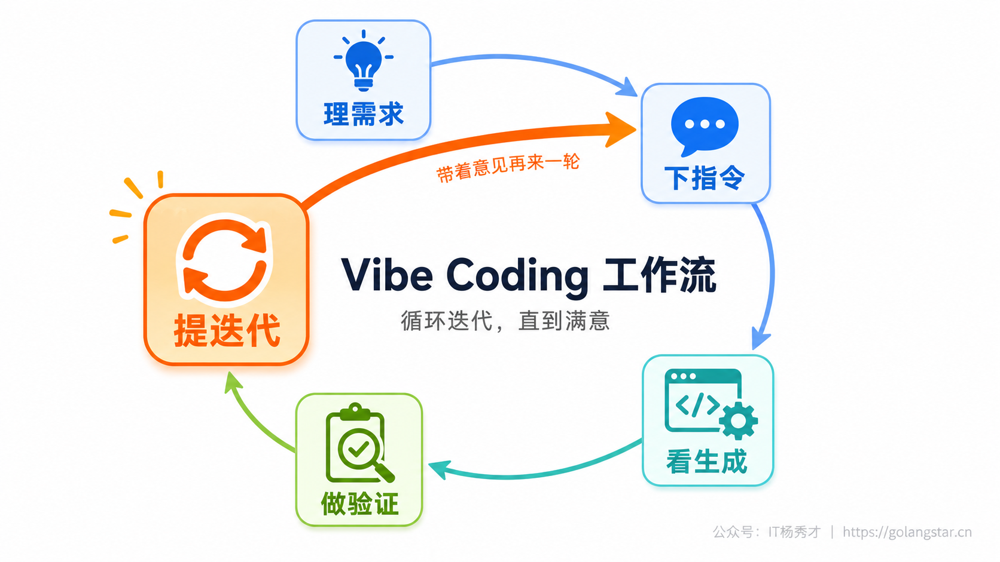
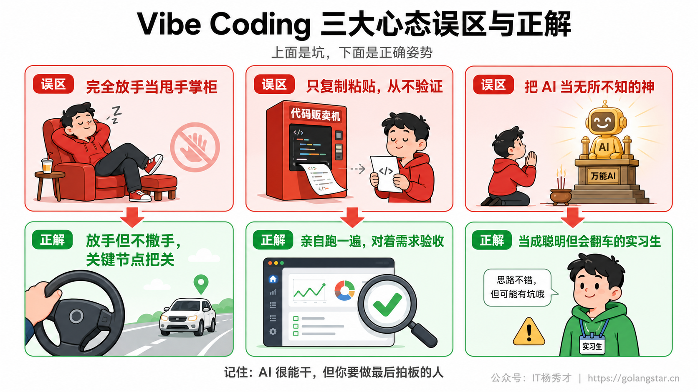
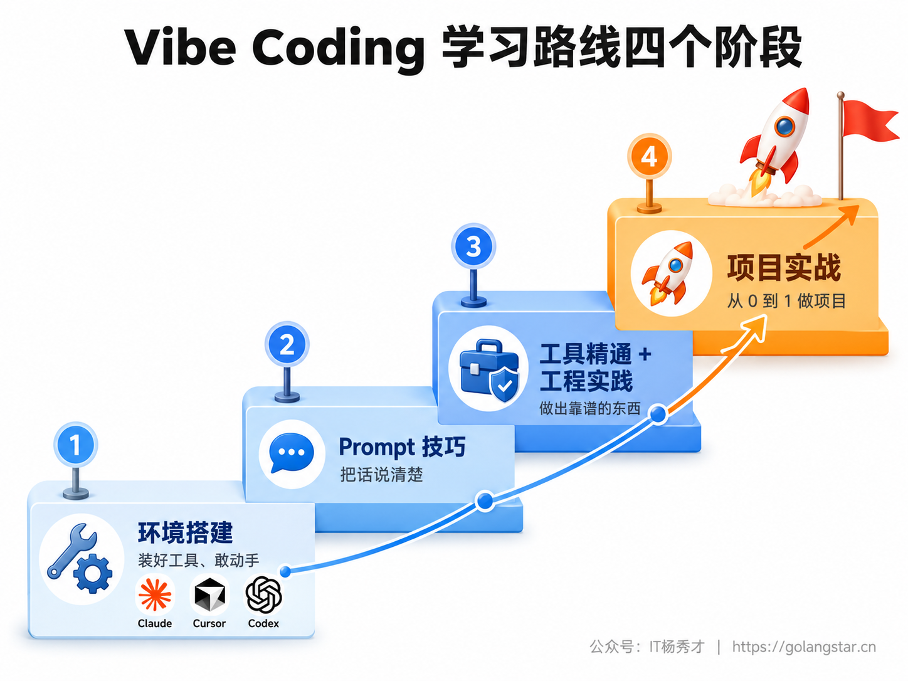

很多人第一次用 Claude Code、Cursor 这类工具，体验是过山车式的：头半小时被惊艳得不行，几句话就生成出一个能跑的网页，觉得自己马上要起飞了；可再用一阵，发现 AI 时不时给你来个 Bug、改着改着把好好的功能改坏、或者一个简单需求来回拉扯半天就是做不对，又开始怀疑是不是这工具被吹过头了。

如果你也有过这种忽上忽下的感觉，那多半不是工具的问题，而是**心态和方法**还没调对。Vibe Coding 表面上是"用大白话指挥 AI 写代码"，但真正决定你能走多远的，不是你掌握了哪个工具的哪个快捷键，而是你有没有摆正自己和 AI 之间的关系、有没有按一套靠谱的节奏来推进。这一篇不讲任何具体工具的操作，只聊一件事：怎么和 AI 高效地搭伙干活。这套心态和工作流是跨工具通用的，越早内化，后面学什么工具都顺。

## **1. 人和 AI 的分工**

上一篇我们反复说"你负责想，AI 负责做"，这话听着像句口号，但它其实是整个 Vibe Coding 的地基。地基没打对，后面所有的技巧都是空中楼阁。所以这一节得把它掰开揉碎讲透。

你可以把 Vibe Coding 想象成你当上了项目老板，雇了一个能力极强但需要你给方向的员工。这个员工——也就是 AI——打字飞快、知识面广、什么编程语言的语法都门儿清、从不喊累也不要加班费。但它有个致命的特点：**它不知道你到底想要什么，除非你说清楚。** 它不会替你拍板"这个功能该不该做"，也不会替你判断"做出来的东西是不是用户真正想要的"。这些事，是老板的活，是你的活。

说得再具体一点，在一次 Vibe Coding 协作里，有四件事始终牢牢攥在你手里，AI 替不了。**第一是定方向**——做什么、不做什么、先做哪个后做哪个，这是需求和优先级的判断。**第二是定标准**——做成什么样才算对、什么样的体验才算好，这把尺子在你心里。**第三是做验收**——AI 交付的东西到底行不行、有没有跑偏，得你来看、来判断。**第四是做决策**——遇到几条路可走的岔口，选哪条，得你来拍板。

而 AI 负责的，是把这四件事框定之后的所有"执行层"工作：具体怎么把功能实现出来、用什么技术、代码怎么组织、语法细节怎么抠、Bug 怎么定位修复。这些又苦又累又需要专业积累的活儿，正是它的主场。

理解了这个分工，你就明白为什么"把需求说清楚"是 Vibe Coding 的头号能力了。因为分工的交接点就在这里：你想得越清楚、标准定得越明确，AI 这个员工就越知道该往哪使劲；反过来，你自己都没想明白要什么，只甩一句"帮我做个好用的东西"，那再强的 AI 也只能凭空猜，猜不中是常态。**AI 的能力上限是固定的，但你的产出上限，取决于你把想法传达清楚的能力。**

这里要特别提醒一句，别走到另一个极端去。"你负责想"不等于你要去想"代码具体怎么写"，那是 AI 的活，你抢过来反而是给自己添堵。你要想的是**产品层面、需求层面**的事：这个东西解决谁的什么问题、要有哪些功能、长什么样、用起来什么感觉。把这条界线划清楚，你和 AI 才能各司其职、配合默契。

## **2. Vibe Coding 的基本工作流**

摆正了分工，接下来看实际干活的节奏。Vibe Coding 不是"说一句话、收一个成品"这么简单粗暴，它是一个有章法的循环。把这个循环跑顺了，你就掌握了和 AI 协作的基本功。整个流程可以拆成五步：**理需求 → 下指令 → 看生成 → 做验证 → 提迭代**，然后带着迭代意见重新下指令，转着圈往前推进，直到满意为止。

### **2.1 理需求**

这是最容易被新手跳过、却最关键的一步。很多人一打开工具就急着敲字，脑子里还是一团浆糊就开始指挥 AI，结果可想而知。理需求不需要你写什么正式文档，但至少要在心里（或者随手记一下）把三个问题想明白：**我要做的这个东西是干嘛的？它最核心的功能是哪一两个？我希望它大概长什么样？**

举个例子，你想做一个"记账小工具"。在动手之前，先问自己：这是给我自己用还是给别人用？最核心的是记录每一笔收支，还是统计分析？我要不要分类、要不要看图表？是做成网页还是手机能用的？这些问题想清楚，哪怕只是个粗略的轮廓，你后面下的指令就会清晰有力得多。这一步花的几分钟，能帮你省下后面来回返工的几十分钟。

### **2.2 下指令**

想清楚了要什么，下一步是把它说给 AI 听。这就是写 Prompt 的环节，也是整个系列后面要重点训练的核心技能。这里先记住一个原则：**说得具体，胜过说得漂亮。** 

"帮我做个记账网页"和"帮我做一个个人记账网页，能记录每笔收入和支出、填金额和备注、按月份汇总、用饼图显示各类支出占比，风格简洁、手机上也能正常用"——这两句话喂给 AI，出来的东西完全是两个世界。后者把功能、展示、风格、适配都交代清楚了，AI 几乎不用猜；前者留给 AI 一大片想象空间，它只能给你一个"它以为你想要"的版本，命中率自然低。怎么把指令写好，后面有一整章专门讲，这里你先建立这个意识就够了。

### **2.3 看生成**

指令发出去，AI 就开始干活了。它会规划步骤、写代码，像 Claude Code、Codex 这类终端工具甚至会自己把命令跑起来、自己安装依赖。这一步你基本是看着的，但"看"也有讲究——别只盯着代码看（你大概率也看不太懂，没关系），更要看它**做出来的东西**：网页渲染出来对不对、功能点不点得动、报没报错。Vibe Coding 的精髓是"效果导向"，能跑、好用，比代码漂不漂亮更要紧。

### **2.4 做验证**

东西生成出来了，关键时刻到了——你得验证它到底行不行。这一步是你作为"老板"和"验收员"最不能偷懒的地方，因为**AI 是会犯错的，而且常常一脸自信地把错的东西交给你**。它可能漏了个功能、可能某个按钮点了没反应、可能算出来的数字是错的、甚至可能编造了一个根本不存在的功能告诉你"已经做好了"。

验证不需要你懂代码，你就当个最挑剔的用户：把它做的东西从头到尾用一遍，对照你最初的需求一条条核对——该有的功能都在吗？用起来顺手吗？有没有哪里怪怪的？发现问题别慌，记下来，这正是下一步迭代的弹药。这种"亲自跑一遍、对着需求验收"的习惯，是区分 Vibe Coding 高手和新手的一道明显分水岭。

### **2.5 提迭代**

几乎没有哪个东西是 AI 一次就能做到完美的，这太正常了，专业程序员自己写也做不到。所以 Vibe Coding 的常态是迭代——你把验证时发现的问题，用大白话反馈给 AI，让它在原来的基础上改。"饼图的颜色太花了，换成同一色系的""金额没做千分位分隔，加上""手机上按钮太小了，点不准，放大一点"，AI 收到这些反馈就会针对性地修。

迭代是 Vibe Coding 真正的灵魂。你不必追求"一句话憋出完美成品"，那既不现实也没必要。真正高效的做法是**先让 AI 快速给出一个能跑的基础版本，再像捏橡皮泥一样，一轮轮地修、一点点地加，让它逐渐逼近你心里那个样子**。能不能享受甚至擅长这个"捏橡皮泥"的过程，很大程度上决定了你用 Vibe Coding 的体验和产出。

## **3. 新手最容易踩的三个心态误区**

工作流讲完了，但光知道"该怎么做"还不够，还得知道"别怎么想"。下面这三个误区，是我见过的新手最常掉进去的坑，每一个都能让你的 Vibe Coding 体验大打折扣。提前认清它们，能帮你少走很多弯路。

### **3.1 完全放手当甩手掌柜**

第一个误区，是把"AI 自主"理解成了"我可以彻底不管"。有些人一看 Claude Code 能自己规划、自己写、自己跑，就以为自己只要丢一句话进去，剩下的翘着二郎腿等收货就行。结果往往是 AI 顺着自己的理解一路狂奔，越跑越偏，等你回过神来，做出来的东西早就不是你想要的了，推倒重来反而更费劲。

正确的姿势是**"放手但不撒手"**。你确实不用盯着每一行代码，但你得在几个关键节点上把好关：需求说清楚了没、生成的方向对不对、阶段性成果合不合格。AI 像一辆自动驾驶的车，能自己开，但方向盘后面得有你这个清醒的人随时准备接管。尤其当 AI 开始往一个你没料到的方向跑时，要及时叫停、纠偏，别等它把整条路都走错了才发现。

### **3.2 只复制粘贴从不验证**

第二个误区，是把 AI 当成一台"代码自动售货机"——它吐出来什么，我就用什么，从来不看、不试、不验证。这是最危险的一种用法。前面反复强调过，AI 会犯错、会有幻觉、会写出带漏洞的代码，如果你闭着眼睛照单全收，等于把自己的项目建在流沙上。

更要命的是，长期这么干，你会越来越依赖、越来越没判断力，最后变成 AI 说什么是什么，连它明显跑偏了都看不出来。正确的做法是**始终保持"验证"这个动作**：东西做出来一定要亲自跑一遍、看一眼效果，对着需求核一核。你不需要看懂每一行代码，但你得对最终的产出负责。记住，**用 AI 的人，永远是为结果兜底的那一个，而不是 AI。**

### **3.3 把 AI 当成万能的神**

第三个误区，是对 AI 的能力有不切实际的期待，把它当成一个永远正确、无所不能的神。一旦抱着这种心态，你就会犯两个错：一是它说什么你都信，连它一本正经胡说八道的时候都信；二是一旦它做不到某件事，你就大失所望，觉得"这工具不行"，转头就放弃了。

得有个清醒的认识：**AI 很强，但它有明确的能力边界，也会出错。** 它擅长那些常见的、有大量先例的任务（做网页、写脚本、改 Bug），但碰到特别新、特别复杂、特别冷门的需求，它也会力不从心。它不是神，是一个能力超强但偶尔会翻车的协作者。带着这个认识去用它，你既不会盲目轻信，也不会因为它偶尔的失误就全盘否定。**把它当成一个聪明的实习生，而不是一个全知的神，你的心态就稳了。**

## **4. 给你一条照着走的学习路线**

心态摆正了、工作流和误区也都清楚了，最后给你规划一条接下来的学习路线，让你知道这个系列该怎么往下学、每一步该练什么。Vibe Coding 这门手艺，说到底是"刻意练习 + 真实项目"练出来的，光看不练永远学不会，但有个清晰的路线能让你少绕弯路。

**第一阶段，先把环境搭起来、工具用起来。** 工欲善其事必先利其器，接下来的环境搭建篇会手把手带你把开发环境配好，再把 Claude Code、Cursor、Codex 这三大主流工具各装一份、各跑通一次。这一阶段你不用追求做出什么大东西，目标就是"能跑起来、敢动手"，消除对工具的陌生感和恐惧感。建议你跟着教程先随手做个能在浏览器里打开的小页面，亲手体验一次"说句话、出个东西"的完整循环，那种成就感会成为你坚持下去的最好动力。

**第二阶段，专攻"把话说清楚"这门核心功夫。** 工具会用了，接下来 Prompt 技巧篇会带你系统地练怎么和 AI 沟通——从模糊想法到精确指令、怎么拆解需求、怎么纠正 AI 的错误。这是 Vibe Coding 最值钱的能力，也是最需要刻意练习的。别小看它，同样一个工具，会写 Prompt 的人和不会写的人，产出的差距是数量级的。

**第三阶段，深入打磨工具、补上工程方法。** 等基本功扎实了，工具精通篇会带你把三大工具的高级能力一个个吃透，工程实践篇则会教你那些让项目"从能跑到好用"的方法——项目怎么规划、代码质量怎么保障、Bug 怎么调、版本怎么管。这一阶段你会从"能做出东西"进阶到"能做出靠谱的东西"。

**第四阶段，用真实项目把所学串起来。** 最后的项目实战篇，会带你从 0 到 1 完整做出几个由简到难的项目——个人主页、待办清单、博客系统、全栈应用。纸上得来终觉浅，前面学的所有东西，都要在真实项目里走一遍才能真正长在你身上。这一阶段做完，你就算是入门了。

这条路线不用赶进度，按自己的节奏走就行。**最重要的不是学得多快，而是每一步都真的动手做了。** Vibe Coding 是一门实践的手艺，看一百篇教程不如自己跑通一个小项目。从下一篇开始，我们就要正式动手了。

## **5. 小结**

聊了这么多，其实归结起来就一句话：**Vibe Coding 玩的不是工具，是协作。** 工具只是放在你面前的趁手家伙，真正决定你能用它做出多少东西的，是你脑子里那套和 AI 打交道的方法和心态——你清不清楚自己要什么，你会不会把需求讲明白，你愿不愿意一轮轮地验证和迭代，你能不能既信任它的能力又看得清它的边界。

这套东西，恰恰是 AI 替你做不了、也是你最该用心去练的。工具一年一变，模型半年一更新，但"想清楚、说明白、验得准、改得动"这套协作的本事，会一直跟着你，换什么工具都不过时。带着这份认知往下走，你会发现 Vibe Coding 不是一项遥不可及的技术，而是一种谁都能上手、越用越顺的新工作方式。

<h2><strong>关注秀才公众号：</strong><strong>IT杨秀才</strong><strong>，回复：</strong><strong>面试</strong></h2>

<strong>领取后端/AI面试题库PDF</strong>

🔥 配套实战项目，拆得开、跑得起、能写进简历

多 Agent 编排 + RAG 混合检索 · 31 篇深度教程 + 50+ 面试题

<a href="/projects/dev-support.html" style="display: inline-block; margin-top: 14px; background: #ff7a18; color: #fff; font-size: 18px; font-weight: bold; padding: 10px 28px; border-radius: 24px; text-decoration: none;">点击查看 DevSupport AI 实战项目 →</a>

