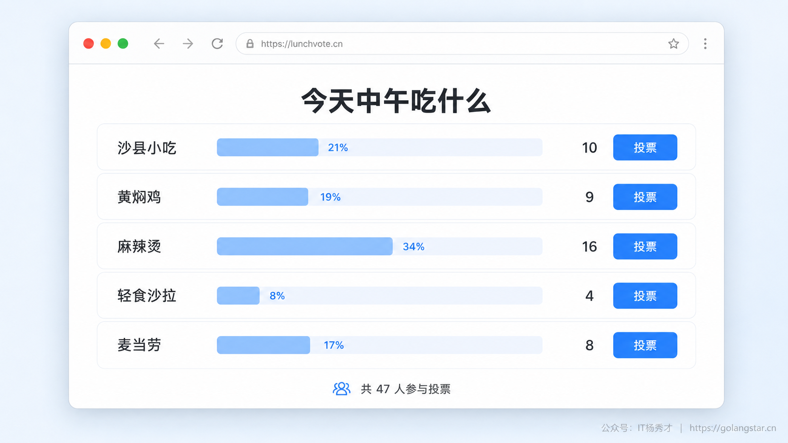
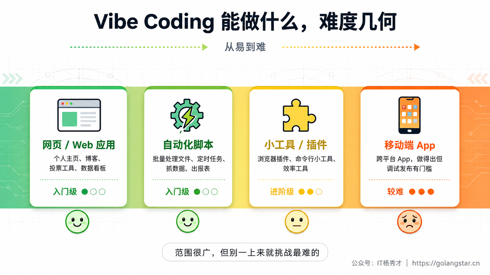
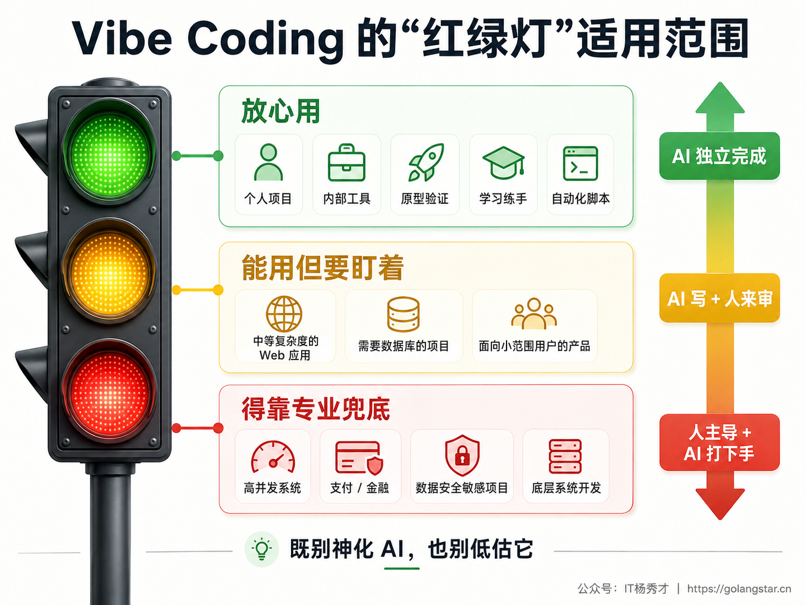

2025 年初，特斯拉前 AI 总监、OpenAI 联合创始人 Andrej Karpathy 发了一条推文。他说自己最近迷上了一种新的写代码方式——不打开文档、不记语法、甚至不怎么看代码，就是对着 AI 用大白话描述想要什么，剩下的交给 AI 去写。他给这种方式起了个名字，叫 **Vibe Coding**，中文一般翻译成"氛围编程"。

这条推文几天之内就传遍了整个技术圈。倒不是因为"AI 能写代码"这件事有多新鲜，而是因为说这话的是 Karpathy——一个站在 AI 和编程金字塔尖的人。连他都开始用"说话"代替"敲代码"了，这件事本身就足够有分量。更重要的是，他描述的那种体验，精准地戳中了一大批人的痛处：手里攥着一个想法，想做个小工具、搭个小网站、把某件烦人的重复劳动自动化，却死死卡在"我不会写代码"这一关上。而 Vibe Coding 似乎在说，这道关卡，正在消失。

## **1. Vibe Coding 到底是什么**

Karpathy 在推文里的原话是这么说的：

> "There's a new kind of coding I call 'vibe coding', where you fully give in to the vibes, embrace exponentials, and forget that the code even exists."
>
> （有一种新的编程方式，我把它叫做 Vibe Coding，你完全沉浸在感觉里，拥抱指数级的变化，甚至忘记代码的存在。）

这话听着有点玄，翻译成人话其实很简单：你不用再去操心代码该怎么写、分号有没有漏、变量起什么名字这些事，你只要把脑子里的想法用人话讲清楚，AI 负责把它变成能跑的程序。你关心的是"我要做什么"，而不是"这东西具体怎么实现"。

打个最直白的比方。传统编程像是你自己下厨做一道菜：你得知道食材怎么切、油温几成下锅、盐放多少克、火候掌握到什么程度，做出来好不好吃，全看你的手艺。而 Vibe Coding 更像你坐在餐厅里点菜——你只要跟服务员说"来一份糖醋排骨，少放糖，微辣，用小排"，后厨自然会把菜做好端上来。你不需要懂怎么腌肉、怎么调糖醋汁，你只需要知道自己想吃什么，以及尝过之后能说出"再咸一点"或者"这个火候老了"。


这个类比虽然简单，但它点出了 Vibe Coding 的核心——**它把编程从"写代码"变成了"表达需求"**。你要练的不再是某门编程语言的语法，而是怎么把脑子里那个模糊的想法，清清楚楚地传达给 AI。在这个领域，这种"把需求说清楚"的能力有个专门的名字，叫 Prompt Engineering（提示工程），它会是贯穿这整个系列的主角。

当然，这绝不意味着 Vibe Coding 就是"随便说两句就行"。还是拿点菜来说，你说"随便上个菜"和你说"来一份糖醋排骨，少糖、微辣、用小排"，端上来的东西天差地别。Vibe Coding 真正的功夫，恰恰在于你能不能把需求描述得足够具体、足够准确——这也是为什么后面会有一整章专门讲怎么写好 Prompt。

## **2. 先看一个真实的例子**

光讲概念太干，来看个具体的。假设你是一个完全不会写代码的产品经理，老板临时丢给你一个活儿：做一个团队内部用的小投票工具，收集大家中午想吃哪家餐厅。

按传统流程，你得找前端、找后端，写需求文档，排期，前后端联调，测试上线，一套走下来怎么也得三五天。而用 Vibe Coding，你打开一个 AI 编程工具（比如 Claude Code），敲下这样一段话：

**Prompt：**
```
帮我做一个团队午餐投票的网页工具，要求：

1. 页面顶部有个标题"今天中午吃什么"
2. 下面列出 5 个餐厅选项：沙县小吃、黄焖鸡、麻辣烫、轻食沙拉、麦当劳
3. 每个选项后面有一个投票按钮，点一下票数加 1
4. 实时显示每个选项的当前票数和占比（用进度条）
5. 页面底部显示总投票人数
6. 风格简洁清爽，用浅蓝色主题

用纯 HTML + CSS + JavaScript 实现，不需要后端，数据存在浏览器本地就行。
```

不到一分钟，AI 就给你吐出一个完整的网页文件。你用浏览器打开，一个能点、能投、能实时更新票数的投票工具就摆在眼前了。



要是你觉得哪里不满意，比如想给每个餐厅配个图标，或者想限制每人只能投一票，根本不用重做，继续用大白话告诉 AI 就行：

**Prompt：**
```
效果不错，再改两个地方：
1. 每个餐厅名字前面加一个对应的 emoji 图标
2. 限制每个人只能投一次，投完之后按钮变成灰色的"已投票"
```

AI 会在原来的代码基础上改，几秒钟后你刷新页面，新功能就生效了。整个过程你一行代码没写，却实实在在做出了一个能用的东西。这就是 Vibe Coding 最迷人的地方——**你负责想，AI 负责做**。你的角色，从"程序员"变成了"出主意的人"加"验收的人"。

## **3. 它和传统编程到底差在哪**

很多人第一次听说 Vibe Coding，心里会冒出一个疑问：这不就是 AI 帮你写代码吗？跟以前那些代码补全工具有啥区别？

区别其实不小。早期的 AI 代码辅助工具，比如最初的 GitHub Copilot，本质上是"你写一半，它帮你补另一半"。你照样得懂编程，得自己搭项目结构，得知道这里该写个什么函数，AI 只是帮你加快了"敲键盘"这一下。这就好比你在写文章，AI 帮你联想下一句话，但整篇文章的立意、结构、思路，依然牢牢攥在你手里。

Vibe Coding 是另一回事。它是"你说需求，AI 从零开始把整个东西给你写出来"。你甚至不需要知道代码长什么样，不需要分得清什么是 HTML、什么是 JavaScript、什么是数据库。你就是个甲方，用大白话描述要什么，AI 这个乙方负责交付。


但这里得说清楚一件容易被误解的事：Vibe Coding **不等于不用动脑子**。恰恰相反。当你不再需要把精力耗在抠语法、查 Bug 上的时候，你反而能把全部注意力放到更要紧的事情上——我这个东西到底要解决什么问题？用户用起来顺不顺手？功能怎么安排才合理？这些"想清楚要做什么"的判断，AI 替不了你。

换句话说，Vibe Coding 消灭的不是编程思维，而是编程语法这道门槛。它让你不必先花几个月啃 Python 或 JavaScript 的语法，就能把想法变成现实。但想法本身靠不靠谱，这事儿还得你自己说了算。

## **4. 哪些人适合玩 Vibe Coding**

Vibe Coding 并不是只给程序员准备的。它对不同背景的人都有用，只是大家的切入点不太一样。


如果你是产品经理、设计师、运营，或者任何一个"满脑子想法但不会写代码"的人，Vibe Coding 大概是你这辈子见过门槛最低的编程入口。以前你想把一个点子变成能跑的原型，要么自己花几个月学编程，要么求开发同事帮忙（还得看人家排期），要么掏钱找外包。现在你可以自己动手，半小时就攒出一个能验证想法的最小可用版本。你不需要懂什么是循环、什么是判断，你只要会清楚地说"我要什么"。

我身边一个做运营的朋友就是活例子。他以前每周要从三个不同的后台导数据，再在 Excel 里拼起来做周报，每次磨蹭两三个小时。后来他用 Vibe Coding 让 AI 给他写了个脚本，自动从三个平台拉数据、合并、出图表，现在每周双击一下、五秒钟出结果。他到现在也不懂 Python，但这不耽误他用 AI 写出一个天天在跑的脚本。

如果你是刚入行的程序员，或者还在读书的计算机专业学生，Vibe Coding 能帮你把学习和开发的节奏整个提起来。传统路子是先啃几个月语法和框架，再花几个月做练手项目，中间卡个 Bug 可能在网上搜半天。有了 Vibe Coding，你可以反过来——先用 AI 快速做出一个能跑的项目，再回头去琢磨 AI 写的代码到底是什么意思。这种"先跑通、再理解"的学法，往往比"先学会、再动手"更高效，因为你手里有了一个完整的上下文，知识不再是一盘散沙。而且 AI 写出来的代码本身就是上好的学习材料，你可以随时问它"这段为什么这么写""这里用的是什么思路""换种写法行不行"，它就像一个 24 小时在线的私教。

至于已经身经百战的资深开发者，你可能心里嘀咕"我自己写挺快的，干嘛用 AI"。这种想法很正常，但真上手试过基本都会改主意。Vibe Coding 对老手最大的价值，不在于帮你写那些你早就会写的代码，而在于**帮你料理那些又无聊又躲不掉的杂活**——写单元测试、补接口文档、配各种配置文件、做代码迁移、敲一堆样板代码。这些事吃掉你大把时间却没多少技术含量，扔给 AI，你就能把脑子腾出来放在架构设计、性能优化、技术选型这些真正需要人来拍板的地方。Karpathy 自己就说，他用 Vibe Coding 写了好几个项目，明明有能力自己写，但交给 AI 让他能把心思花在"这个功能该不该做"上，而不是"这个功能怎么实现"，效率是成倍地往上翻。

## **5. Vibe Coding 现在能做出什么**

讲了这么多理念，你大概想知道：那它现在到底能做出什么样的东西？这里挑几个真实的方向，给你个直观的感受。



**网站和网页应用**是 Vibe Coding 最拿手的领域。小到一个静态的个人主页、博客，大到带交互的 Web 应用——待办清单、投票工具、数据看板，AI 基本都能一条龙帮你搞定。这类项目技术成熟、开源资料海量，AI 在训练时见过大把类似的代码，所以生成质量通常很高，特别适合新手拿来练手、收获第一份成就感。

**自动化脚本**是另一个特别实用的方向。把日常那些重复劳动交给程序去做——批量改文件名、定时发邮件、从网页上扒数据、自动生成报表。这类需求逻辑大多不复杂，难点往往在于"得查不少 API 文档"，而 AI 对各种常用库的用法烂熟于心，正好补上这块。

**小工具和插件**也很常见，比如浏览器插件、命令行小工具。有人用它做了个浏览器插件，一键把网页上的英文翻译成中文还保留原排版；有人做了个命令行工具，能用大白话搜本地文件。这些东西可能就几百行代码，却实实在在解决了一个具体的痛点。

**移动端 App** 现在也做得了，但门槛要高一些。用 React Native、Flutter 这类跨平台框架，AI 能帮你生成一个能跑的 App，可调试和上架发布的环节还是需要一些技术功底。不过随着工具进步，这道门槛也在飞快地降。

当然，也有 Vibe Coding 目前明显玩不转的地方。对性能抠到极致的系统（高频交易、实时音视频处理）、对安全要求极高的场景（金融、支付）、以及需要深厚专业积累的项目（操作系统内核、数据库引擎），这些领域的代码需要极精细的控制和扎实的专业判断，现在 AI 生成的东西还达不到生产标准。但对绝大多数日常需求来说，Vibe Coding 早就够用了。

## **6. Vibe Coding 是怎么运作的**

理解了理念，再来看它实际跑起来是个什么样子。整个过程可以浓缩成一个不断转的圈：**描述需求 → AI 生成 → 查看效果 → 反馈调整**，然后再回到描述需求，直到你满意为止。


第一步是**描述需求**，用大白话告诉 AI 你要什么。这一步最关键，你说得越清楚越具体，结果就越贴近你心里想的。别说"帮我做个好看的网站"，要说"帮我做一个个人主页，包含自我介绍、项目展示、联系方式三块，深蓝色主题，手机电脑都能正常显示"。

第二步是 **AI 生成代码**，它会根据你的描述把完整的代码文件吐出来，通常几秒到一分钟，看复杂度。

第三步是**查看效果**，把生成的东西跑起来看看对不对。网页类的直接浏览器打开就行，脚本类的在终端跑一下。

第四步是**反馈调整**。几乎不可能一次到位——你大概率会觉得颜色不对、布局别扭、少了个功能、或者有个 Bug。这时候你只要用大白话说哪里要改："背景换成浅灰""导航栏固定在顶部""点按钮弹个确认框"，AI 就在原来的基础上改，你再看、再提，转上几圈，东西就成了。

这个循环看着简单，但有几点值得提前记在心里。

一是**别想着一步到位**。新手最容易犯的错，就是憋着在第一条 Prompt 里把所有需求一股脑全写进去，结果写了一大段，AI 反而被绕晕了。更聪明的做法是先把核心功能描述清楚，等 AI 搭出个基础版本，再一点点往上加细节。这跟盖房子一个道理，先把框架立起来，再砌墙、再装修，而不是一上来就纠结沙发摆哪。

二是**学会看 AI 的输出**。你不需要会自己写代码，但至少得能大致看懂 AI 写的东西在干嘛——不是抠每一行的语法，而是能判断"它是不是在按我的意思办事"。这个能力会随着你用得多了自然长出来。

三是**善用版本管理**。AI 改代码的时候偶尔会越改越歪，把原本好好的功能改坏。这时候你需要能退回到上一个好的版本。Git 就是干这个的，哪怕你是零基础，也建议在学 Vibe Coding 的同时顺手学点基本的 Git 操作——这些后面都会专门讲。

## **7. Vibe Coding 不是万能的**

把好处说了一圈，也得泼点冷水，讲讲它的边界，这样你的预期才不会跑偏。

**AI 会犯错，而且犯得特别自信。** 它生成的代码不见得总是对的，有时会写出带 Bug 的东西，却一脸"一切正常"的样子。更让人头疼的是它偶尔会"一本正经地胡说八道"——业内叫"幻觉"，比如编造一个根本不存在的函数或者库，然后理直气壮地告诉你"这么写就行"。所以你不能闭着眼睛信它的输出，一定要跑起来看看，结果不对就把报错丢回去让它改。

**稍微复杂点的项目，得先做规划。** 做个小网页可以边想边做，但要做一个有用户登录、有数据存储、好几个页面的完整应用，你就得先把架子搭好——把项目拆成模块，每个模块再拆成小任务，一步步来。要是没规划就让 AI 直接上手写一个大项目，大概率会写成一坨"意大利面条"，越往后改越乱。这块后面的工程实践篇会细讲。

**安全这道关，得你自己把。** AI 生成的代码可能藏着安全漏洞——SQL 注入、密码明文存储之类的。你要只是做个内部小工具或者学习项目，问题不大；但要把东西放到公网上给真实用户用，安全就马虎不得。你可以让 AI 帮忙检查（"看看这段代码有没有安全隐患"），但别把宝全压在它身上。



还有最后一句忠告：**别把 Vibe Coding 当成"不用学编程"的借口。** 它确实让你不会写代码也能做出东西，但如果你打算长期靠 AI 搞开发，多少懂一点编程基础会让你事半功倍。你不用成为专业程序员，但能看懂 AI 写的代码在做什么、能判断结构合不合理、能揪出明显的 Bug——这些能力会实打实地决定你用 Vibe Coding 的上限。

## **8. 小结**

往大了说，Vibe Coding 是编程史上又一次门槛的下移。几十年来，编程的入口一直在往下走——从机器语言到汇编，从汇编到 C，从 C 到 Python，每一次进化都把更多人请进了"造软件"这间屋子。Vibe Coding 不过是这条路上最新的一步，它把门槛从"学会一门编程语言"一路降到了"会把自己的需求说清楚"。

这并不意味着程序员要失业，就像自动挡的普及没让驾校教练丢饭碗一样。它意味着更多人能参与到"动手造东西"这件事里来，而专业的程序员则可以把精力从"怎么写"挪到"写什么"和"为什么写"上。对每一个手握想法、却苦于没有技术傍身的人来说，眼下正是再好不过的时候——你的想法和它变成现实之间，如今只隔着一段说清楚的话。

<div style="background-color: #f0f9eb; padding: 10px 15px; border-radius: 4px; border-left: 5px solid #67c23a; margin: 20px 0; color:rgb(64, 147, 255);">

<h2><span style="color: #006400;"><strong>关注秀才公众号：</strong></span><span style="color: red;"><strong>IT杨秀才</strong></span><span style="color: #006400;"><strong>，回复：</strong></span><span style="color: red;"><strong>面试</strong></span></h2>

<div style="text-align: center;"><span style="color: #006400; font-size: 28px;"><strong>领取后端/AI面试题库PDF</strong></span></div>


<div style="text-align: center; margin-top: 22px; padding-top: 20px; border-top: 1px solid #c2e7b0;">
<div style="color: #006400; font-size: 20px; font-weight: bold;">🔥 配套实战项目，拆得开、跑得起、能写进简历</div>
<div style="color: red; font-size: 16px; font-weight: bold; margin-top: 8px;">多 Agent 编排 + RAG 混合检索 · 31 篇深度教程 + 50+ 面试题</div>
<a href="/projects/dev-support.html" style="display: inline-block; margin-top: 14px; background: #ff7a18; color: #fff; font-size: 18px; font-weight: bold; padding: 10px 28px; border-radius: 24px; text-decoration: none;">点击查看 DevSupport AI 实战项目 →</a>
</div>
</div>
