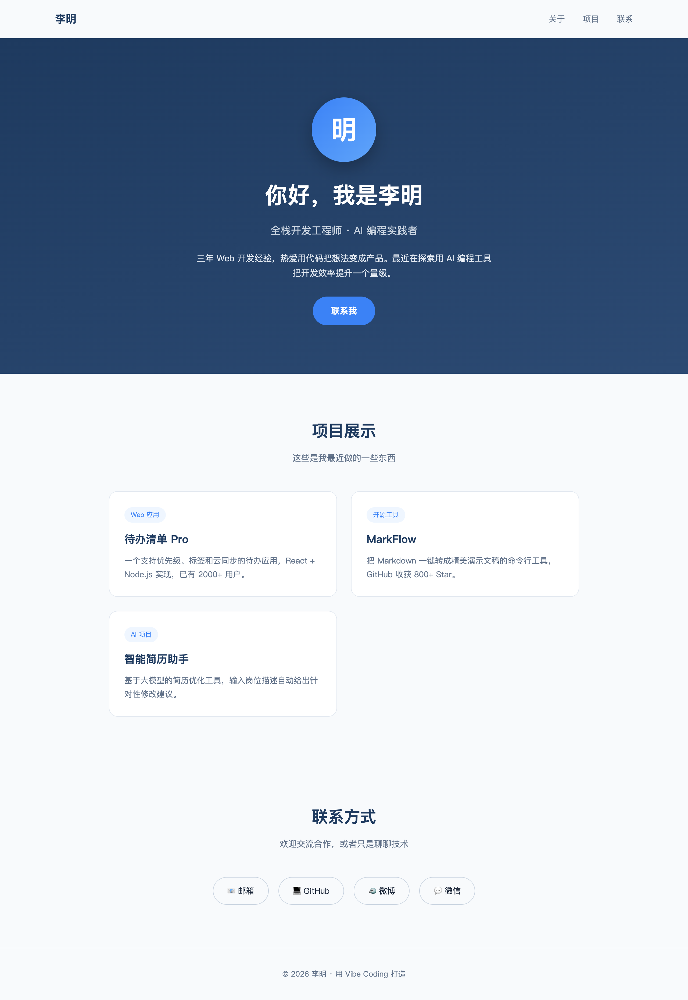
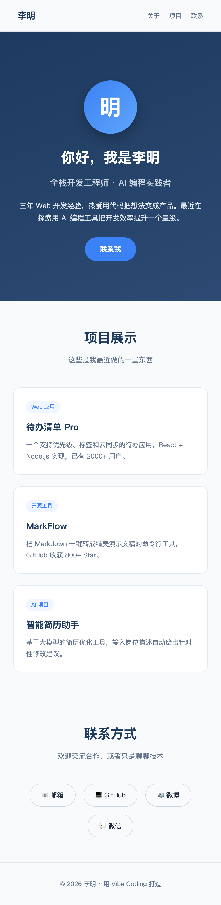

学了这么多概念和技巧，是时候动手做一个真东西了。这一篇我们从零开始，做一个能拿得出手的个人主页——纯前端，不需要任何编程基础，你只要会用 AI 对话就能跟着做出来。它是检验你 Prompt 表达和迭代能力的第一个实战，也是最容易获得成就感的项目：几轮对话下来，一个真实可看、可分享的网页就在你手里了。

下面的每一步都是真实跑出来的：从一句模糊的需求开始，看 AI 给出什么，再一轮轮把它打磨成精致的成品。文中的截图，全部是这个页面真实渲染出来的效果。

## **1. 先想清楚要做什么**

动手前花两分钟想清楚要做什么，这是前面规划篇反复强调的。一个个人主页，核心就三块内容：一段自我介绍（你是谁、做什么）、一个项目展示（你做过什么）、一个联系方式（怎么找到你）。风格上，我想要简洁现代、专业一点，主色调用深蓝色显得稳重。

把这个想清楚，就有了和 AI 沟通的基础。注意这里我没写任何代码，只是把脑子里的想法理成了几句话——这恰恰是 Vibe Coding 的起点：先表达清楚要什么。

## **2. 从一句话起步**

先用一个不算精细的 Prompt 起步，看看 AI 给什么。

**Prompt：**
```
帮我做一个个人主页，包含自我介绍、项目展示、联系方式三个部分。
我叫李明，是全栈开发工程师。用一个 HTML 文件实现。
```

AI 很快给出一个 HTML 文件。把它存成 `index.html` 用浏览器打开，是这个样子：


可以看到，内容结构是对的——自我介绍、项目、联系方式都在，但样子非常朴素，就是浏览器默认的黑白文字，毫无设计感。这很正常：你的 Prompt 没提任何视觉要求，AI 就只把内容堆出来了。这也印证了前面 Prompt 篇的道理——**你说得多具体，它就给得多到位。** 接下来就靠迭代把它变精致。

## **3. 把视觉提上来**

现在把视觉要求说清楚，让它脱胎换骨。

**Prompt：**
```
这个页面太朴素了，帮我重新设计得现代、精美、专业一些，要求：
1. 顶部加一个吸引人的 Hero 区域，深蓝渐变背景，放头像、姓名、一句话定位和一个「联系我」按钮
2. 项目展示用卡片式布局，鼠标悬停有上浮效果
3. 主色调深蓝（#1e3a5f）配亮蓝点缀，整体干净、有呼吸感
4. 加一个顶部导航栏，可以点击跳到各区域
5. 所有样式写在同一个 HTML 文件的 style 标签里
```

这一版的指令具体多了——布局、配色、交互效果、甚至给了确切的色值。AI 据此给出的页面，效果立刻不一样了：



深蓝渐变的 Hero 区、圆形头像、卡片式的项目展示、干净的联系方式区——一个看着专业的主页成型了。对比初版，差别全来自 Prompt 里那些具体的要求。这就是迭代的力量：你不需要一次说全，而是先看到效果、再针对性地提改进。

> 这个效果是真实渲染的——你照着做，得到的页面会和截图一致或更好（AI 每次生成的细节会有差异，但只要 Prompt 的要求一致，方向就稳）。

## **4. 适配手机**

现在它在电脑上很好看，但个人主页很多是用手机点开的，得确保手机上也不乱。让 AI 加上响应式适配。

**Prompt：**
```
让这个页面在手机上也能正常显示：
1. 加上 viewport 设置
2. 屏幕窄时，导航和标题字号自动缩小，项目卡片自动单列排布
3. 各区域的内边距在小屏上适当减小，不要挤
用 CSS 媒体查询实现，不要改动桌面端的样子。
```

加上响应式后，在手机宽度下打开，布局自动调整成适合小屏的样子：



可以看到项目卡片从两列变成了单列、标题字号缩小、整体紧凑而不拥挤——这正是 CSS 媒体查询的作用。至此，一个桌面、手机都好看的个人主页就完成了。

## **5. 看看它生成的代码**

也许你好奇这背后的代码长什么样。不必能写，但读懂个大概有助于你更好地指挥 AI。它生成的是一个自包含的 HTML 文件，结构大致是这样：

```html
<!DOCTYPE html>
<html lang="zh-CN">
<head>
  <meta charset="UTF-8" />
  <meta name="viewport" content="width=device-width, initial-scale=1.0" />
  <style>
    /* 用 CSS 变量统一管理配色，改主题色只改一处 */
    :root { --primary: #1e3a5f; --accent: #3b82f6; ... }
    .hero { background: linear-gradient(160deg, var(--primary), #2c4a73); ... }
    .card:hover { transform: translateY(-6px); ... }  /* 悬停上浮 */
    @media (max-width: 640px) { ... }  /* 手机适配 */
  </style>
</head>
<body>
  <nav class="nav">...</nav>          <!-- 导航 -->
  <header class="hero">...</header>    <!-- Hero 自我介绍 -->
  <section id="projects">...</section> <!-- 项目卡片 -->
  <section id="contact">...</section>  <!-- 联系方式 -->
</body>
</html>
```

几个值得注意的点：它用 CSS 变量（`--primary` 这种）统一管理颜色，所以你想换主题色，只要让 AI 改那一处变量即可；Hero 的渐变、卡片的悬停上浮、媒体查询的手机适配，都对应着你 Prompt 里提的要求。看懂这个对应关系，下次你想改哪里，就知道怎么对 AI 说。

## **6. 继续打磨与上线**

到这里主页已经能用了，你还可以继续让 AI 加东西：换上你真实的头像和项目、加一个深色模式切换、给 Hero 加一点入场动画、把联系方式换成你真实的链接。每一个都是一句 Prompt 的事，照着前面的套路——说清楚要什么、看效果、再调。

做好之后，怎么让别人能访问？这就是部署上线。纯静态的 HTML 页面，可以免费部署到 Vercel、Netlify、GitHub Pages 这类平台——把文件传上去，几分钟就能得到一个公开网址分享出去。具体怎么部署，让 AI 一步步带你做即可（比如「我有一个 index.html，想免费部署到 Vercel，请一步步教我」），它会给你详细指引。

> 🔴待截图4 —— 个人主页部署上线后的公开访问效果
>
> 截图位置：把做好的主页部署到 Vercel / Netlify / GitHub Pages 后，用得到的公开网址在浏览器打开
> 截图内容：通过公开网址访问到的线上主页，地址栏显示真实域名
> 标注要求：用红框框出地址栏的公开网址
> 建议保存为：../../assets/img/vibe_coding/projects/project_landing_page/project_landing_page4.png

## **7. 复盘这次实战**

回头看这个从 0 到 1 的过程，它浓缩了 Vibe Coding 最核心的工作流。

> 【建议配图5 —— 个人主页实战的迭代工作流】
>
> **生图提示词（可直接发给 ChatGPT / 文生图工具）：**
> 画一张干净白底、现代扁平风格的迭代闭环图。中心写「Vibe Coding 迭代」。四个阶段顺时针成环，各配图标、标签和对应的本次实战缩略：①「说清要什么」（对话气泡，绿，标「三块内容+深蓝简洁」）；②「AI 生成」（机器人+代码，蓝）；③「看真实效果」（浏览器页面缩略，橙，标「朴素初版→精修→响应式」三个递进的小页面缩略）；④「针对性提改进」（铅笔+清单，紫，标「太朴素→加视觉→适配手机」）。四阶段用顺时针箭头相连，强调「不必一次说全，看效果再调」。配色语义：绿=表达、蓝=生成、橙=看效果、紫=迭代。图片右下角放置引流信息：公众号：IT杨秀才 ｜ https://golangstar.cn（小字、浅灰、不抢主体）。
>
> 整体目的：把个人主页实战提炼成一张迭代闭环图，让读者记住「说清→生成→看效果→针对性改」的核心节奏。

整个过程你没写一行代码，但做出了一个真实、精美、能分享的网页。关键的几点经验：**第一版别指望完美**——先让 AI 把骨架搭出来，看到效果再迭代，比憋一个超长 Prompt 高效；**视觉要求要具体**——布局、配色、交互说得越细，出来的越接近你想要的；**一次改一个方向**——加视觉、做响应式分开提，每步看效果，别一锅烩。这套节奏，你做后面更复杂的项目时同样适用。

## **8. 小结**

个人主页是 Vibe Coding 的最佳第一课：门槛最低、成就感最快。你从一句模糊的「帮我做个主页」起步，看到朴素的初版；再用具体的视觉要求让它脱胎换骨；最后补上手机适配，得到一个桌面、移动端都精致的成品——全程靠对话，没碰一行代码。

更重要的是，你在这个小项目里完整走了一遍 Vibe Coding 的核心节奏：说清要什么、看真实效果、针对性迭代。把这个节奏练熟，你就握住了用 AI 做东西的钥匙。从这里出发，下一个项目我们做一个有交互的应用，难度上一个台阶，但用的还是这同一套功夫。

<div style="background-color: #f0f9eb; padding: 10px 15px; border-radius: 4px; border-left: 5px solid #67c23a; margin: 20px 0; color:rgb(64, 147, 255);">

<h2><span style="color: #006400;"><strong>关注秀才公众号：</strong></span><span style="color: red;"><strong>IT杨秀才</strong></span><span style="color: #006400;"><strong>，回复：</strong></span><span style="color: red;"><strong>面试</strong></span></h2>

<div style="text-align: center;"><span style="color: #006400; font-size: 28px;"><strong>领取后端/AI面试题库PDF</strong></span></div>


<div style="text-align: center; margin-top: 22px; padding-top: 20px; border-top: 1px solid #c2e7b0;">
<div style="color: #006400; font-size: 20px; font-weight: bold;">🔥 配套实战项目，拆得开、跑得起、能写进简历</div>
<div style="color: red; font-size: 16px; font-weight: bold; margin-top: 8px;">多 Agent 编排 + RAG 混合检索 · 31 篇深度教程 + 50+ 面试题</div>
<a href="/projects/dev-support.html" style="display: inline-block; margin-top: 14px; background: #ff7a18; color: #fff; font-size: 18px; font-weight: bold; padding: 10px 28px; border-radius: 24px; text-decoration: none;">点击查看 DevSupport AI 实战项目 →</a>
</div>
</div>
