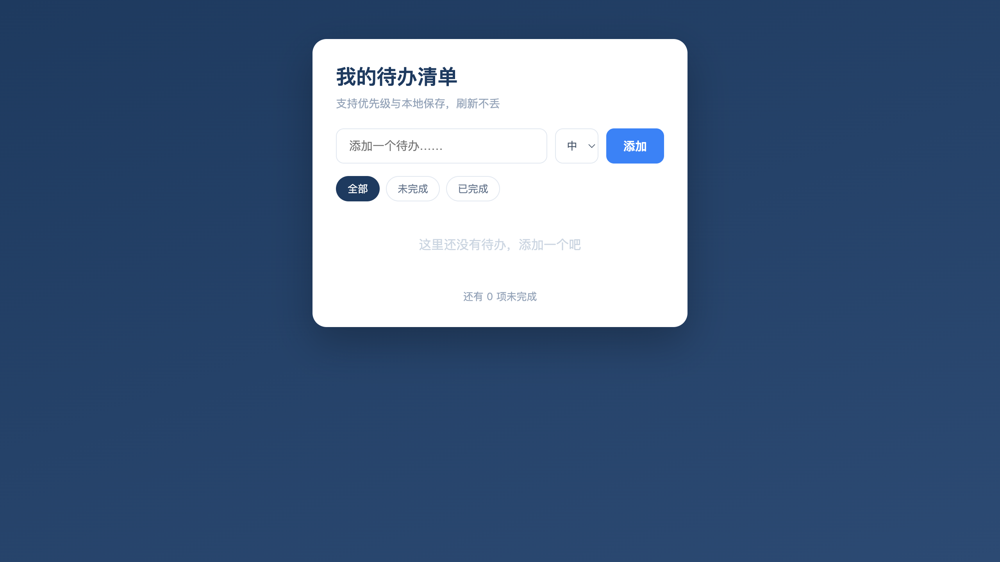
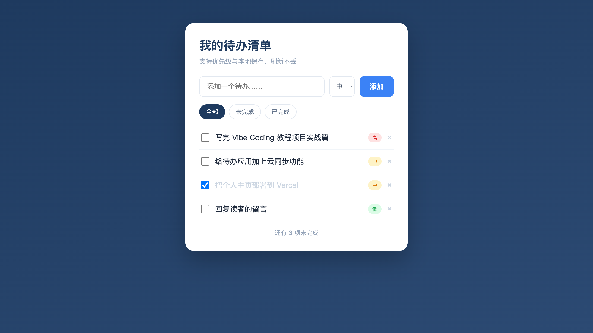

个人主页是静态的——做好就摆在那。这一篇我们上一个台阶，做一个有交互的应用：待办清单。你能添加任务、勾选完成、删除、按优先级排序、还能筛选，而且刷新页面数据不丢。它用 React 实现，是你的第一个真正意义上的「应用」。

别被 React 吓到。你不需要先去学 React，跟着做的过程中，我会把用到的核心概念顺带讲清楚，你照样能做出来。和上一篇一样，下面每一步都是真实跑出来的，截图都是这个应用真实渲染的样子。

## **1. 先规划**

按前面规划篇的习惯，先想清楚要什么。这个待办应用的核心功能：添加任务、标记完成、删除任务、给任务设优先级（高/中/低）并按优先级排序、按状态筛选（全部/未完成/已完成）、数据保存在本地（刷新不丢）。

技术上，用 React 做界面（它最适合做这种有交互、状态会变的应用），用浏览器自带的 localStorage 存数据（不用搭后端，最适合入门）。把这些告诉 AI，让它先帮你把项目搭起来。

## **2. 搭起骨架**

第一步，让 AI 把项目和最基础的功能做出来。

**Prompt：**
```
帮我用 React 做一个待办清单应用，用 Vite 搭项目。先实现最基础的功能：
1. 一个输入框 + 添加按钮，能添加待办
2. 待办列表，每项前面有勾选框，可以标记完成（完成的显示删除线）
3. 每项后面有删除按钮
界面简洁好看，主色调深蓝。先把这个能跑的版本做出来。
```

AI 会帮你创建 Vite 项目、写好组件。按它的指引装好依赖、跑起来（通常是 `npm install` 然后 `npm run dev`），在浏览器打开，一个能用的待办应用就出来了。初始没有数据时是这样：



干净的卡片式界面，输入框、添加按钮都在位。你试着添几条、勾选、删除，基础功能都能用了。这就是骨架——先有个能跑的最小版本，再往上加。

## **3. 理解组件与状态**

往下走前，花一分钟搞懂 React 的两个核心概念，后面和 AI 沟通会顺很多。

**组件**：React 把界面拆成一块块可复用的「组件」。比如整个应用是一个 `App` 组件，每一条待办可以是一个 `TodoItem` 组件。拆组件的好处是各管一摊、清晰好维护——这和前面工程篇讲的「按职责分开」是一个道理。

**状态（state）**：状态就是应用里会变化的数据，比如「当前有哪些待办」。React 的精髓是：状态一变，界面自动跟着更新。你不用手动去改页面上的某个元素，只要改状态（比如往待办列表里加一条），React 自动把界面重新渲染成最新的样子。这就是它特别适合做交互应用的原因。

> 【建议配图3 —— React 的组件与状态】
>
> **生图提示词（可直接发给 ChatGPT / 文生图工具）：**
> 画一张干净白底、现代扁平风格的概念图，分左右两块讲 React 核心。左块「组件」：画一个大框 `App`，里面嵌套几个小框（一个输入区 `InputBar`、一列重复的 `TodoItem`），用积木/嵌套盒子表示「界面拆成可复用的组件块」。右块「状态驱动」：画一个「状态」数据盒（标「todos 列表数据」），一条箭头标「状态一变」指向「界面自动重新渲染」（一个刷新/自动更新图标 + 更新后的列表），强调「你只改数据，界面自动更新」。配色语义：左=组件结构（蓝）、右=状态驱动（绿）。图片右下角放置引流信息：公众号：IT杨秀才 ｜ https://golangstar.cn（小字、浅灰、不抢主体）。
>
> 整体目的：让零基础读者理解 React 的两个核心——界面拆成组件、状态一变界面自动更新，从而更好地指挥 AI。

懂了这两点，你就能更准地对 AI 提需求。比如让它「把每条待办拆成单独的 TodoItem 组件」，或者讨论「这个数据该放在哪个组件的状态里」，沟通在同一个频道上。

## **4. 加优先级与筛选**

骨架有了，现在把它变得真正好用。一次加一组相关功能，看效果再继续。

**Prompt：**
```
在现在的基础上加三个功能：
1. 添加待办时能选优先级（高/中/低），每条待办上用不同颜色的小标签显示优先级（高=红、中=黄、低=绿）
2. 列表按优先级排序，高优先级排在前面
3. 顶部加筛选标签：全部 / 未完成 / 已完成，点击只看对应的待办
底部显示「还有 N 项未完成」。保持界面整洁。
```

加完这些，应用就有模有样了。添几条不同优先级的待办，效果是这样：



可以看到：每条待办带了高/中/低的彩色标签，列表按优先级从高到低排，顶部能切换筛选，已完成的「把个人主页部署到 Vercel」带了删除线，底部显示「还有 3 项未完成」。一个真正能用的待办应用成型了——而你依然没手写一行代码。

## **5. 数据持久化**

现在有个问题：刷新页面，刚添的待办全没了。因为数据只存在内存里，一刷新就清空。要让它「记住」，用 localStorage 把数据存到浏览器本地。

**Prompt：**
```
现在刷新页面待办就没了。用 localStorage 把待办数据保存到浏览器本地：
1. 每次待办变化（增、删、改）就自动存到 localStorage
2. 页面加载时自动从 localStorage 读回来
这样刷新页面数据也不丢。
```

加上之后，刷新页面，待办还在。它背后的关键是 React 的一个机制，AI 生成的代码大致是这样：

```jsx
// 初始化时从 localStorage 读取已存的待办
const [todos, setTodos] = useState(() =>
  JSON.parse(localStorage.getItem('todos') || '[]')
);

// todos 一变化，就自动写回 localStorage
useEffect(() => {
  localStorage.setItem('todos', JSON.stringify(todos));
}, [todos]);
```

这段代码体现了前面讲的状态思想：`todos` 是状态，`useEffect` 监听它的变化、自动存盘。你不用能默写它，但看懂「状态变就自动存」这个意思，下次想加类似的自动行为，就知道怎么跟 AI 说。

## **6. AI 辅助调试**

做交互应用，难免遇到 bug。这正好实战一下前面调试篇的方法。假设你发现：勾选完成一条待办后，它的删除线没出现，但控制台没报错。

这是典型的「不报错但行为不对」。按调试篇的方法，把现象、预期和相关代码喂给 AI：

**Prompt：**
```
勾选待办的复选框后，待办文字应该显示删除线表示完成，但实际没有变化。控制台没报错。
相关代码：@TodoItem.jsx
请帮我定位原因。先说清楚为什么会这样，再给修复。
```

让它先析因，它可能发现：勾选时状态确实变了，但显示删除线的那个 CSS 类没有根据完成状态正确切换。它定位后给出修复，你勾选一下确认删除线出现了。这个小插曲就是 Vibe Coding 的日常——AI 写、你测、发现问题再喂回去让它修，循环往复。记住调试篇那条：喂全信息、让它先析因、改完验证。

## **7. 复盘**

这个项目比个人主页复杂，但用的还是同一套节奏，只是多了「理解一点 React 概念」这一环。

> 【建议配图4 —— 交互应用的搭建路径】
>
> **生图提示词（可直接发给 ChatGPT / 文生图工具）：**
> 画一张干净白底、现代扁平风格的横向阶梯上升图，展示待办应用从骨架到完整的搭建路径。四级台阶，每级一个图标、标签和对应缩略：①「搭骨架」（地基图标，蓝，标「增删改的最小版本」）；②「拆组件、理状态」（积木图标，紫，标「懂 React 核心」）；③「加功能」（拼图块图标，橙，标「优先级+筛选+排序」）；④「持久化+调试」（数据库+扳手图标，绿，标「localStorage 存盘+修 bug」）。台阶逐级上升，旁边一个小人沿台阶往上走。底部小字「一次加一组、看效果再继续」。配色语义：逐级递进分色。图片右下角放置引流信息：公众号：IT杨秀才 ｜ https://golangstar.cn（小字、浅灰、不抢主体）。
>
> 整体目的：把待办应用的搭建提炼成「搭骨架→理概念→加功能→持久化调试」的阶梯路径，让读者掌握做交互应用的节奏。

几点经验：**先骨架后功能**——别一上来要它做全套，先把能跑的最小版本做出来，再一组组加；**理解关键概念能让沟通更准**——不必精通 React，但懂「组件」「状态」这两个核心，你提的需求 AI 就更容易领会；**交互应用更要会调试**——动态行为出 bug 是常态，把调试篇的方法用上，喂全信息让 AI 先析因。这些经验，做后面的全栈项目时会反复用到。

## **8. 小结**

待办清单是你的第一个交互应用，它带你迈过了「静态页面」到「能用的应用」这道坎。你从一个增删改的骨架起步，顺带搞懂了 React 的组件和状态这两个核心，再一组组加上优先级、筛选、排序，用 localStorage 让数据持久化，过程中还实战了一次 AI 辅助调试——全程依然是说清需求、看效果、迭代的老节奏。

它证明了一件事：哪怕用上 React 这样的框架、做有状态有交互的应用，零基础的你照样能借 AI 做出来。关键不在于你会不会写 React，而在于你能不能想清楚要什么、看懂效果、并在出问题时有章法地和 AI 一起解决。带着这套能力，下一个项目我们做一个能部署上线的全栈博客，再上一个台阶。

<div style="background-color: #f0f9eb; padding: 10px 15px; border-radius: 4px; border-left: 5px solid #67c23a; margin: 20px 0; color:rgb(64, 147, 255);">

<h2><span style="color: #006400;"><strong>关注秀才公众号：</strong></span><span style="color: red;"><strong>IT杨秀才</strong></span><span style="color: #006400;"><strong>，回复：</strong></span><span style="color: red;"><strong>面试</strong></span></h2>

<div style="text-align: center;"><span style="color: #006400; font-size: 28px;"><strong>领取后端/AI面试题库PDF</strong></span></div>


<div style="text-align: center; margin-top: 22px; padding-top: 20px; border-top: 1px solid #c2e7b0;">
<div style="color: #006400; font-size: 20px; font-weight: bold;">🔥 配套实战项目，拆得开、跑得起、能写进简历</div>
<div style="color: red; font-size: 16px; font-weight: bold; margin-top: 8px;">多 Agent 编排 + RAG 混合检索 · 31 篇深度教程 + 50+ 面试题</div>
<a href="/projects/dev-support.html" style="display: inline-block; margin-top: 14px; background: #ff7a18; color: #fff; font-size: 18px; font-weight: bold; padding: 10px 28px; border-radius: 24px; text-decoration: none;">点击查看 DevSupport AI 实战项目 →</a>
</div>
</div>
