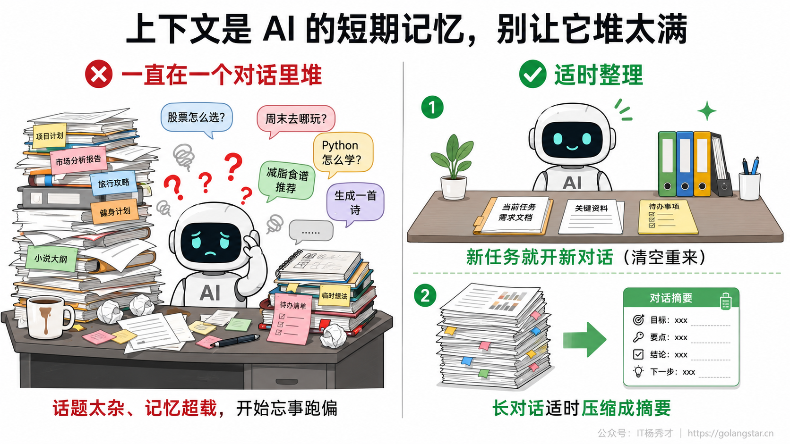
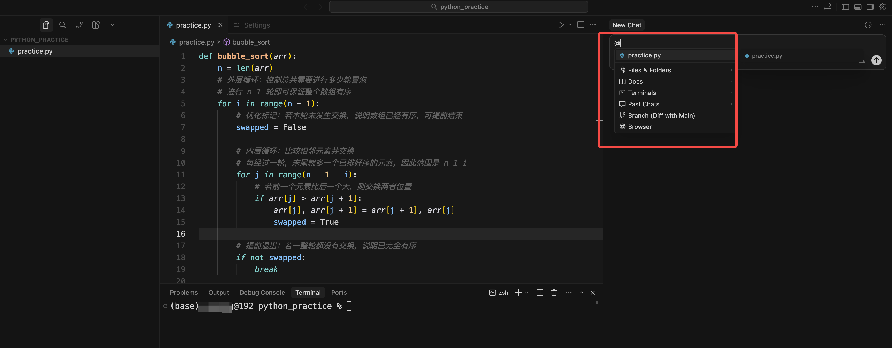
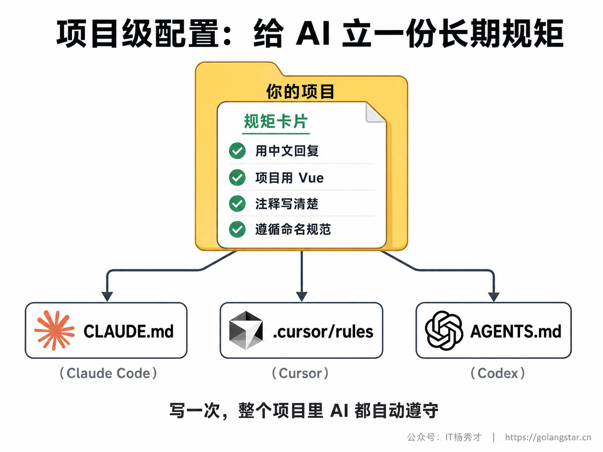
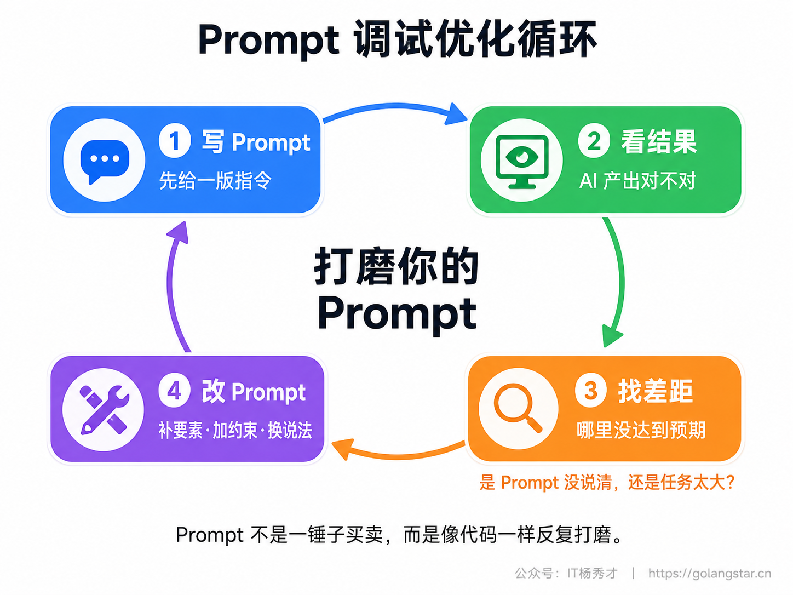
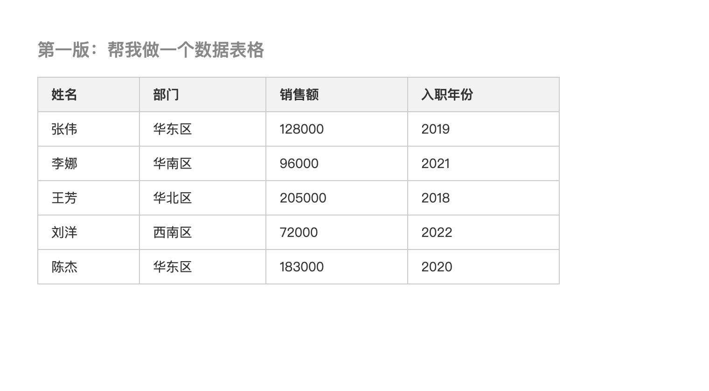
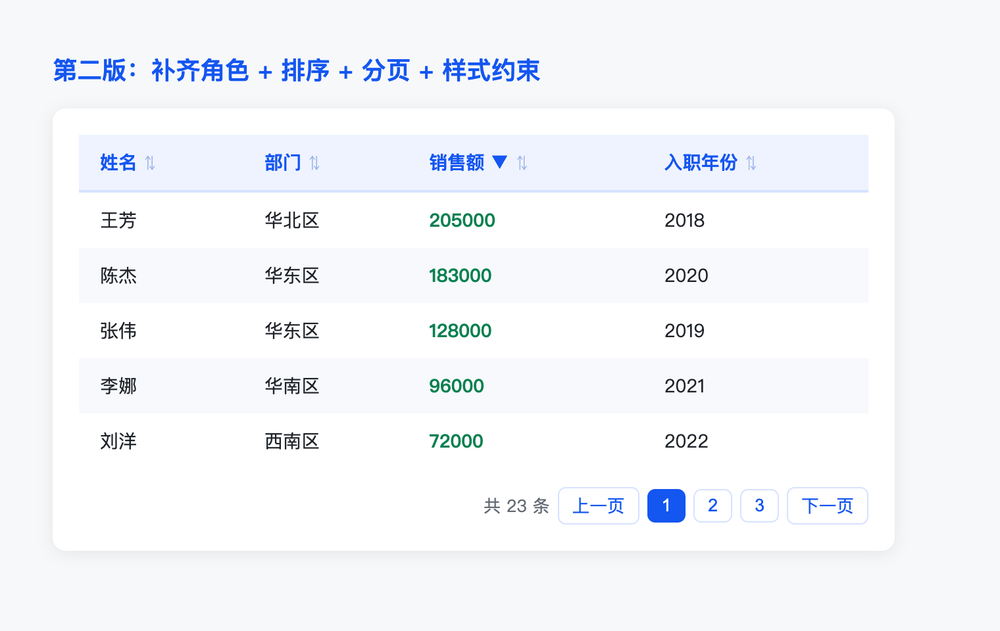

会写一条结构清晰的好 Prompt，只是 Vibe Coding 的入门。真实的协作很少是一问一答就结束的——你往往要跟 AI 来回聊很多轮，中间它会答错、会跑偏，你还想让它参考某个现成的东西，甚至希望它在整个项目里都遵守你定的某些规矩。这些单条 Prompt 之外的功夫，就是这一篇要讲的进阶技巧。

掌握了它们，你和 AI 的协作就能从会写单条指令，提升到会经营一整段合作。这一篇内容偏方法，每一条都能实打实地提升你的效率，也是把 Prompt 能力从够用推向好用的关键一跃。

## **1. 多轮对话的上下文管理**

先理解一个核心概念：**上下文（Context）**。在一次对话里，你之前说过的话、它之前给过的回复、它读过的文件，都会被一并纳入它当前能看到的范围，它后续的回答都基于这些内容。可以把上下文理解成 AI 在这次对话中能同时记住的全部信息。

这块信息范围有两个特点你必须知道。**第一，它有容量上限**，装得太满，前面的内容就会被挤出或变模糊，AI 就开始忘事、答非所问。**第二，它不会自动清空**——一次对话里聊的所有东西都会持续累积。这就带来一个常见问题：聊得太久、话题太杂，AI 反而越来越糊涂。理解了这两点，你就明白为什么有人用着用着觉得 AI 变笨了——多半不是模型的问题，而是上下文被无关内容塞满了。换句话说，上下文是一种需要你主动打理的资源：它不是越多越好，而是越干净、越聚焦当前任务越好。把和当前任务无关的东西及时清出去，AI 才能把注意力放在真正要紧的内容上。这个意识，是用好所有 Coding Agent 的共同前提。



管理上下文有两个最实用的原则。

**一是新任务就开新对话。** 当你要开始一件和之前完全无关的新事情时，别在原来那个聊了半天的对话里接着说，开一个全新的对话，让 AI 不被之前的内容干扰。在 Claude Code 里这一步就是敲 `/clear`，在 Cursor 里新建一个对话即可。这是新手最容易忽略、却收益最大的一个习惯——很多 AI 怎么越来越笨的抱怨，根源都是在一个对话里堆了太多不相干的事。养成做完一件事就清空、换新任务先开新对话的习惯，能避免绝大多数这类问题。

**二是长对话适时压缩。** 如果一个任务确实需要长时间持续推进，聊着聊着上下文快满了，可以让 AI 把前面的内容总结成一段摘要，再基于摘要继续。Claude Code 提供了 `/compact` 命令专门干这个；手动做也行——让它总结一下目前的进展和关键决定，然后新开对话把这段摘要贴进去接着聊。判断什么时候该压缩有个信号：当你发现 AI 开始重复问你已经说过的信息、或者忘了前面定下的规矩，基本就是上下文该清理了。

那到底什么时候该开新对话、什么时候该继续？有个简单的判断标准：看新任务和当前对话还有没有关系。如果你接下来要做的事，需要用到这个对话里已经积累的背景——比如还在同一个功能上继续迭代，那就继续聊，让它带着上下文；如果是一件全新的、不依赖前面任何内容的事，比如刚写完登录功能、现在要去做一个无关的数据导出，那就果断开新对话。一个常见的误区是怕麻烦，什么都在一个对话里聊到底，结果上下文越积越杂，AI 的表现反而越来越差。开新对话几乎没有成本，该开就开。

## **2. 如何纠正 AI 的错误输出**

AI 一定会犯错，关键是你怎么纠正。同样面对一个不满意的结果，纠错方式不同，效率能差出好几倍。这里新手和熟手的差距特别明显。

新手纠错，往往是这样的：

**不推荐的写法：**
```
不对，重写
```
```
还是不对，你能不能认真点
```

这种纠正基本没用。AI 不知道哪里不对、为什么不对、你到底想要什么，它只能再猜一遍，很可能越改越偏，你也越来越急。问题的根子在于，不对、重写这类反馈，信息量几乎为零——它和你最初那条含糊的 Prompt 是同一种毛病，只不过换到了纠错环节。你嫌它没做对，可你给的纠正信息，并不比第一次多。

熟手纠错，是**具体地指出问题**：

**推荐的写法：**
```
这个版本有两个问题：
1. 点击"删除"按钮后，列表没有实时更新，要刷新才行——我希望点完立刻消失
2. 配色太深了，看着压抑，换成浅色调

其他部分都很好，保留不动，只改这两处。
```

差别在哪？**你把哪里错了、错成什么样、你期望怎样、哪些别动都说清楚了。** AI 拿到这种反馈，就能精准地改对，而不是推倒重来。这和 Bug 修复的思路一脉相承：信息给得越具体，AI 改得越准。尤其是其他部分保留不动这句，很关键——不加这句，AI 可能在改你指出的问题时，顺手把别的地方也动了，越改越乱。

这里还有个小技巧：**当 AI 连续两三次都改不对时，别再硬刚下去。** 这通常说明上下文已经乱了，或者你的描述始终没说到点子上。这时候最好的办法是停下来，开一个新对话，把需求重新、完整地组织一遍说清楚，往往比在旧对话里反复拉扯更快。在旧对话里反复纠正还有个副作用：那些失败的尝试都堆在上下文里，反而干扰 AI 的判断，越纠越偏。果断重开，有时是最高效的选择。

总结一下纠错的要领，其实和写第一条 Prompt 是同一套逻辑：**把信息说具体**。第一次是说清楚要做什么，纠错时是说清楚哪里不对、要改成什么样。很多人写初始 Prompt 时挺认真，一到纠错就退化成不对、再改改，把前面攒下的优势全丢了。记住，纠错也是 Prompt，同样值得你把话说清楚。你越是把问题精准地指出来，AI 越能精准地改对，你们来回的轮次也就越少。很多人觉得纠错费劲、来回好多遍还改不对，问题往往不在 AI 不行，而在反馈给得太含糊。

## **3. 给 AI 一个参考样板**

有时候，与其费劲用文字描述你想要什么，不如**直接给 AI 一个参考**，让它照着做。这是个效率极高的技巧，因为一个具体的样板，往往比一大段文字描述更能说清你的意图。

参考可以有好几种形式。**参考代码**：你看到一段写得很好的代码，可以说参考这段代码的写法和风格帮我实现某功能。**参考设计**：你有一张设计稿或一张喜欢的网页截图，可以直接发给 AI（现在主流工具都支持发图），让它做一个长得像这样的页面。**参考文档**：把某个库的文档片段贴给它，让它照着正确的用法写，避免它用过时或错误的写法。

在 Claude Code、Cursor 这类工具里，引入参考还有一个特别方便的方式——用 **`@` 引用**。你在对话里打一个 `@`，就能直接引用项目里的某个文件、某段代码，让 AI 把它作为参考或上下文。比如参考 `@utils/format.js` 里的写法，帮我写一个类似的日期格式化函数，AI 就会照着那个文件的风格来写，和你的项目保持一致。这一点在已有项目里尤其有用：你不必费口舌描述项目的代码风格，直接 `@` 一个现有文件，它就照着学了。`@` 引用还能一次带多个文件，比如让它同时参考一个数据接口文件和一个页面文件，照着已有的模式新增一个类似的页面，它就能把两边的风格和约定都对齐。对在真实项目里干活的人来说，这比把代码复制粘贴进对话框高效得多，也不容易漏掉关联的上下文。



**引入参考的本质，是把凭空创造变成有样学样**，后者对 AI 来说更容易、结果也更可控。当你发现某个需求很难用语言描述清楚时，先别急着憋措辞，想一想：我能不能找个样板直接给它看？很多时候，一张截图、一段示例代码，胜过你反复解释半天。尤其是涉及视觉、风格这类难以用文字精确传达的东西，给参考几乎总比纯描述强。

发图这一种值得多说两句，因为它对小白特别友好。你看到一个喜欢的网页、一张设计稿、甚至自己手画的草图，都可以直接截图发给 AI，配一句话：

**Prompt：**
```
照着这张图的布局和配色，帮我用 HTML+CSS 做一个类似的页面，
顶部导航、中间的卡片排列、底部的样式都尽量还原，文字内容你先用占位的。
```

AI 就能把图里的布局、配色、结构大致复刻出来。对说不清自己想要什么、但看到就知道喜不喜欢的新手来说，这是把脑子里的画面变成成品的最短路径。同样地，程序报错时与其费劲描述，不如直接把报错截图发给它，让它自己看。学会用图和 AI 沟通，很多原本要写一长段才能说清的事，一张图就解决了，效率高得多。

## **4. 用项目级配置立长期规矩**

前面讲的都是单次对话里的技巧。但有些要求，你希望 AI 在**整个项目里自始至终**都遵守，比如所有回复用中文、这个项目用 Vue 不要用 React、代码注释要写清楚、遵循某套命名规范。这些话如果每次对话都重说一遍，太累了。

解决办法是**项目级配置文件**。它相当于给项目立一份长期生效的规矩文档，AI 在这个项目里干活时会自动读取并参考，不用你反复交代。三大工具各有自己的配置文件：



在 Claude Code 里，这个文件叫 **`CLAUDE.md`**，放在项目根目录；在 Cursor 里，是 **`.cursor/rules/`** 目录下的规则文件；在 Codex 里，则是 **`AGENTS.md`**。它们作用一致，写法也很朴素，就是用大白话把你的项目规矩列出来，比如：

```markdown
# 项目说明

- 本项目是一个用 Vue 3 + TypeScript 写的待办清单应用
- 所有和我的对话请用中文回复
- 代码要写清楚注释，变量命名用驼峰式
- 不要引入新的第三方库，除非我明确同意
```

把这些写进配置文件，以后 AI 在这个项目里干活就会自动照办，省去大量重复交代。**这是从每次都要叮嘱到立好规矩一次到位的关键一步。** 写这类文件有两个通用原则值得先记住：一是内容要具体、可执行，写用 2 空格缩进比写代码格式规范点好，因为前者 AI 能照做、后者它得猜；二是别贪多，只放真正每次都该遵守的核心规矩，塞太多反而会稀释重点、让 AI 抓不住关键。这几个配置文件都很重要，后面工具精通篇会分别用专门的篇幅深入讲它们的写法和高级用法，这里你先建立有这么个东西、它能让 AI 持续遵守你规矩的概念就够了。

要补一句的是，这类配置是给 AI 的强引导，但不是百分百的强制。绝大多数时候它会照着办，可一旦你的规矩写得含糊或彼此冲突，它也可能打折扣。所以写清楚、不矛盾，本身就是让它更听话的前提。

项目级配置和单次对话里的临时要求，其实是配合着用的。配置文件放那些长期不变、每次都该遵守的规矩，比如技术栈、语言、命名规范；具体某次任务的特殊要求，还是在对话里临时说。这样分工，配置文件保持精简稳定，临时需求灵活机动，两者互不干扰。一个实用的判断：一条要求你预计会重复说三次以上，就值得写进配置文件；只这一次用到的，对话里说说就行。

还有个常被新手忽略的好处：配置文件是团队共享的。你把项目规矩写进 `CLAUDE.md` 或 `AGENTS.md` 并提交到代码仓库，团队里每个人用 AI 时都会自动遵守同一套规矩，产出的代码风格自然就统一了。这等于把你对项目的理解沉淀下来，让 AI 帮所有人守住同一条底线，新人加入时也能少踩不少坑。

## **5. 让 AI 先提问再动手**

还有一个特别好用、却很少有人主动用的技巧：**遇到复杂需求，先让 AI 反过来问你，把没说清的地方补齐，再让它动手。** 前面讲需求拆解时提过类似的思路，这里把它作为一个通用的进阶习惯再强调一遍，因为它能避免大量返工。

道理很简单：你一条 Prompt 写得再仔细，也难免有遗漏，而那些遗漏往往要等 AI 做出来、你看到不对，才发现当初没说清。与其事后返工，不如让它在动手前就把疑问抛出来。做法是在 Prompt 末尾加一句：

**Prompt：**
```
帮我做一个团队协作的看板工具。在动手写代码之前，
如果有任何需求不明确的地方，先一次性把问题列给我，
等我回答清楚了你再开始做。
```

AI 会列出一串它拿不准的点：看板要不要支持多个项目？任务卡片需要哪些字段？要不要拖拽排序？数据存本地还是要后端？这些往往正是你没交代、但会直接影响成品的关键。你回答完，它再动手，做出来的东西命中率会高得多。

这一招尤其适合那种你自己也没完全想透、只有个大概方向的需求。它把 AI 从一个只会闷头执行的执行者，变成了一个会帮你查漏补缺、提前发现问题的协作者。当然，和前面说的一样，问题是它提的，决定还得你来做——它帮你想到该考虑什么，但每个该怎么定，仍然取决于你的实际需求。

要注意的是，别滥用这一招。让 AI 把按钮改个颜色这种一句话能说清的小事，再让它反问就是浪费时间。它的用武之地是那些有多个功能、有不少待定细节的复杂需求——这种时候，前置的几个问题能帮你省下后面好几轮返工。判断标准和前面一致：事情越复杂、你心里越没底，就越值得先让它问、把需求聊清楚再动手。

## **6. Prompt 调试与优化方法**

最后讲点方法层面的东西。写 Prompt 这件事，本身也是可以反复打磨的——它和写代码一样，第一版往往不完美，需要你观察结果、找出问题、改进指令、再试一次。这个观察、改进、再试的循环，就是优化 Prompt 的核心方法。



这个循环里，有一个判断特别重要。**当 AI 反复做不对，先别急着怪它，回头看看是不是你的 Prompt 出了问题**——是不是漏了关键信息？是不是任务太大没拆开？是不是某个词有歧义、它理解偏了？大多数时候，AI 答得不好的真正原因是问得不好。把责任先归到自己的 Prompt 上，你才会去改进它；一味怪 AI，你只会原地打转、白白浪费时间。

几条实用的优化方向，可以照着对号入座：**信息不足就补要素**，回到角色、上下文、任务、约束，看看哪个没给全；**结果太发散就加约束**，把不想要的明确排除掉、把规格定死；**任务太大就拆解**，切成小步分别来；**它理解偏了就换种说法**，同一个意思换个更直白、更具体的表达，或者直接举个例子。这四条基本覆盖了 Prompt 出问题的绝大多数情况，遇到 AI 表现不佳，挨个比对一遍，往往就能找到症结。

养成把写 Prompt 当成可优化的事这个意识，你会进步得很快。每一次没达到预期，都是一次让你的 Prompt 能力涨一截的机会，而不是单纯的挫败。久而久之，你会对什么样的表达 AI 容易接住、什么样的容易跑偏形成直觉，这种直觉正是熟手和新手最大的区别，也是你用 AI 越来越省心的根本原因。

举个优化的实例感受一下这个过程。假设你想让 AI 做一个表格组件，第一版你写：

```
帮我做一个数据表格
```

结果它给的表格功能太单薄，就是一张静态表，不能排序、不能翻页，样式也很素：



这时按对号入座的思路一看，问题是信息不足，于是补要素、加约束，改成：

```
你是资深前端，用 Vue 3 帮我做一个数据表格组件：
1. 支持点击表头按该列排序
2. 底部带分页，每页 10 条
3. 表格数据通过 props 传入，列配置也可配
4. 现代简约风格，带斑马纹和悬停高亮
```

第二版立刻就到位了——表头能点击排序、底部带了分页、加了斑马纹和悬停高亮，整体也清爽了不少：



你看，从第一版到第二版，AI 没变，变的是你诊断出问题、补上缺失信息的过程。这就是把写 Prompt 当成可调试的事的实际样子——不是一次写对，而是有方法地越改越准。值得强调的是，这种优化能力比记住任何一条具体技巧都重要。技巧会随工具更新，但观察结果、定位问题、改进表达这套循环是不变的。你越早把它当成一种可练习的方法，而不是凭手感碰运气，进步就越快。

## **7. 小结**

这一篇的几个进阶技巧，跳出了单条 Prompt 的范畴，讲的是怎么经营和 AI 的整段协作：**管好上下文，别让它过载；纠错要具体到点，别只会说重做；善用参考和 `@` 引用，让 AI 有样可循；用项目级配置立下长期规矩，省去重复叮嘱；把写 Prompt 当成可以反复打磨的事。**

这几个技巧有一条共同的暗线：**AI 是协作者，不是许愿池。** 你不能丢一句话就指望它读心、一次到位，而要主动管理你们的协作——控制好它能看到什么（上下文）、给它可参考的样板、把长期规矩固定下来、错了精准地纠、复杂的先聊清楚再做。把 AI 当成一个能力很强但需要你引导的搭档，你就能稳定地从它身上拿到好结果，而不是时灵时不灵。

把这些技巧和前面的四要素、需求拆解、常用模式连起来看，你已经握住了 Vibe Coding 最核心的那项能力：把需求清清楚楚地传达给 AI，并在多轮协作中持续把控方向。这套能力跨工具通用、越练越值钱。它不像某个工具的某个按钮，学会了就过时；它考的是表达和沟通，这是无论 AI 怎么迭代都不会贬值的硬功夫。把这几篇的方法揉进日常，你和 AI 的配合会肉眼可见地越来越顺。最后给一个落地建议：别想着一次把这些技巧都用上，先挑你当下最痛的一两个改起来。如果总觉得 AI 越聊越笨，就先把新任务开新对话练成习惯；如果老在纠错上耗时间，就先练把问题指具体。一个个攻克，比一口气全记下来更容易见效。这些技巧的价值，最终都体现在你每天和 AI 实打实的协作里——用得越多，它们就越会从刻意的技巧变成自然的习惯。

<div style="background-color: #f0f9eb; padding: 10px 15px; border-radius: 4px; border-left: 5px solid #67c23a; margin: 20px 0; color:rgb(64, 147, 255);">

<h2><span style="color: #006400;"><strong>关注秀才公众号：</strong></span><span style="color: red;"><strong>IT杨秀才</strong></span><span style="color: #006400;"><strong>，回复：</strong></span><span style="color: red;"><strong>面试</strong></span></h2>

<div style="text-align: center;"><span style="color: #006400; font-size: 28px;"><strong>领取后端/AI面试题库PDF</strong></span></div>


<div style="text-align: center; margin-top: 22px; padding-top: 20px; border-top: 1px solid #c2e7b0;">
<div style="color: #006400; font-size: 20px; font-weight: bold;">🔥 配套实战项目，拆得开、跑得起、能写进简历</div>
<div style="color: red; font-size: 16px; font-weight: bold; margin-top: 8px;">多 Agent 编排 + RAG 混合检索 · 31 篇深度教程 + 50+ 面试题</div>
<a href="/projects/dev-support.html" style="display: inline-block; margin-top: 14px; background: #ff7a18; color: #fff; font-size: 18px; font-weight: bold; padding: 10px 28px; border-radius: 24px; text-decoration: none;">点击查看 DevSupport AI 实战项目 →</a>
</div>
</div>
