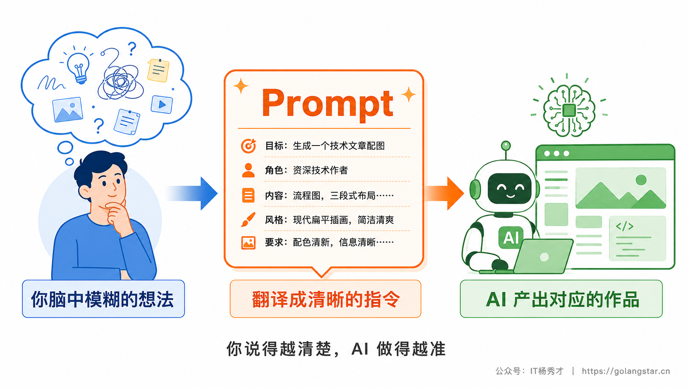
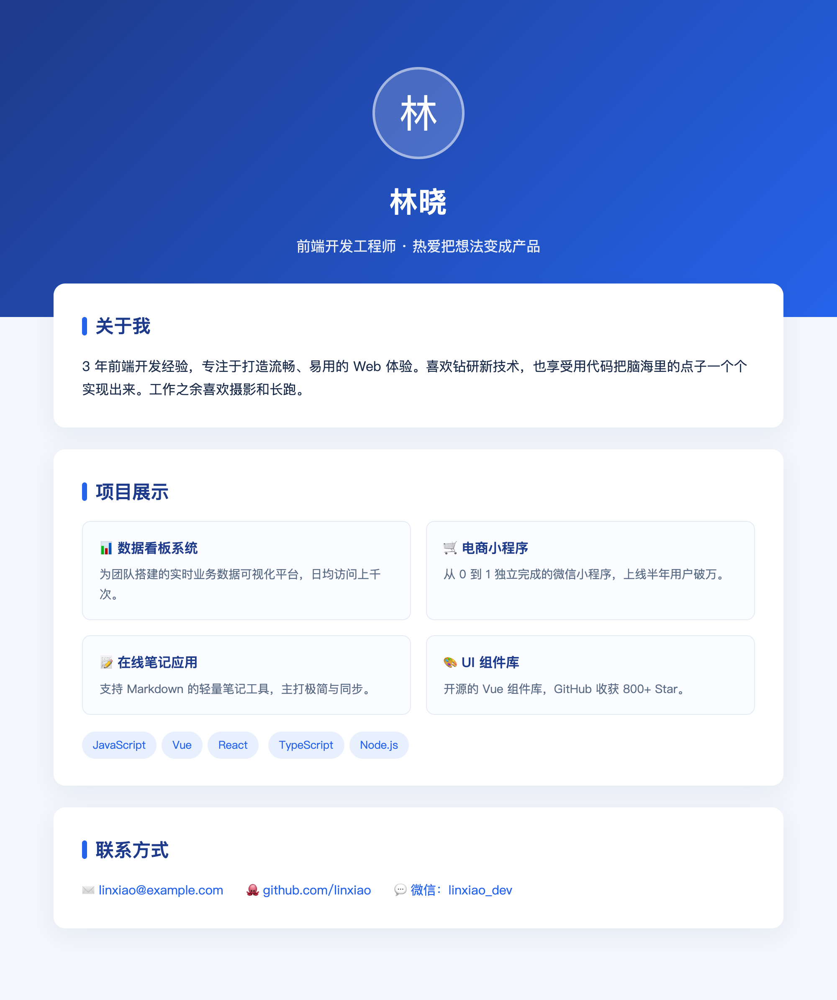
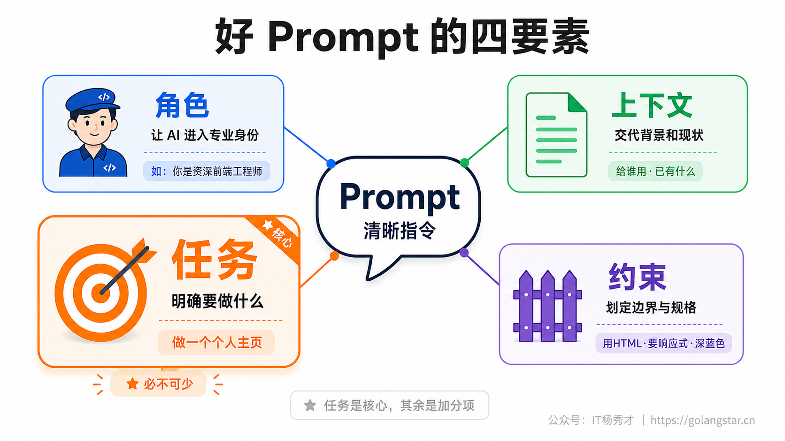
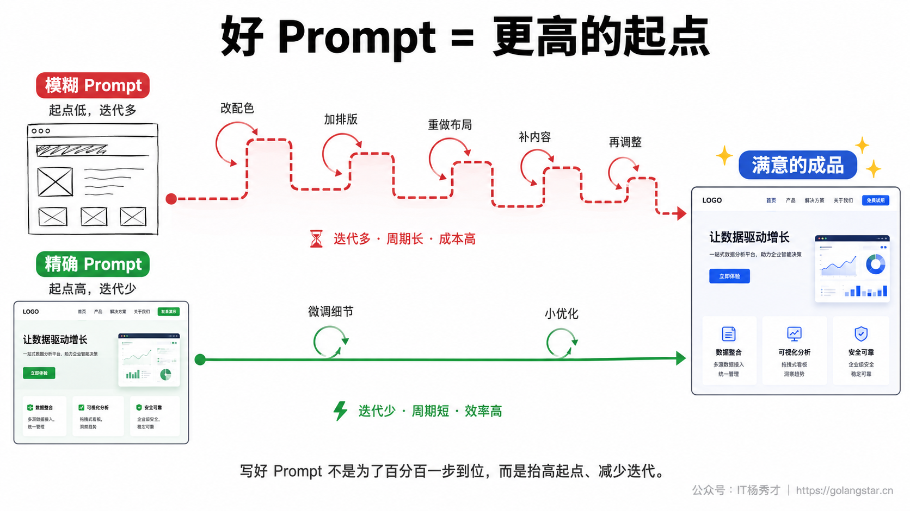
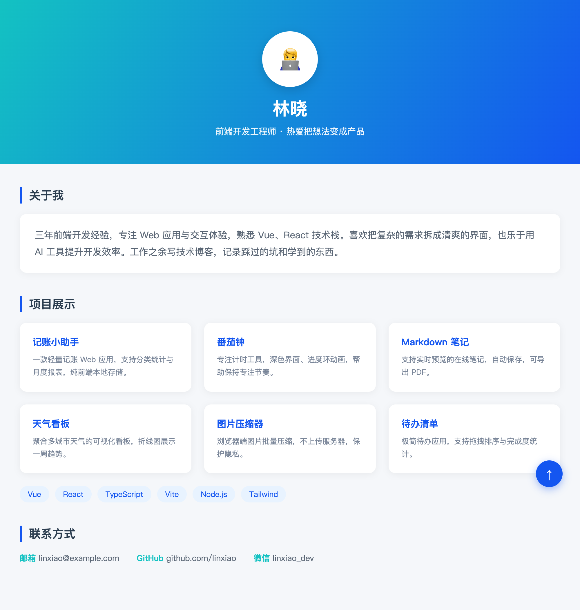

Vibe Coding 最核心、也最值钱的一项能力，就是**写 Prompt**。它把编程从写代码变成了表达需求，而表达需求的唯一载体就是 Prompt。同一个 AI、同一个工具，有人三言两语就让它做出像模像样的作品，有人折腾半天却只得到一堆四不像，差距几乎全在 Prompt 上。

这一篇先打地基：讲清 Prompt 到底是什么、一条好 Prompt 该有哪些要素，并用一个真实的网页生成案例，让你亲眼看看随口一说和说清楚之间到底差多远。这是整个系列里最该反复练的能力，因为它不挑工具、不会过时，练熟了用哪个 Coding Agent 都通用。

## **1. Prompt 到底是什么**

Prompt 直译是提示词，但在 Vibe Coding 里，你把它理解成**你下给 AI 的那段指令、那句话**就行。你想让 AI 做什么、做成什么样，全靠这段话告诉它。它是你和 AI 之间唯一的沟通通道——AI 再聪明，也只能根据你给的这段文字来理解你的意图，你没说的，它只能靠猜。这一点像极了给一位手艺顶尖、却完全不了解你的师傅下需求单：单子写得越清楚，他做出来的越接近你要的；只甩一句随便做个东西，结果大概率不是你想要的。



这里有个新手最容易栽的认知误区：**以为 AI 能读懂你的心思**。它不能。它不知道你的审美偏好、不知道这个东西要给谁用、不知道你嫌弃什么样的风格。所有这些它不掌握的信息，只要对结果重要，你就得在 Prompt 里说出来。Vibe Coding 的功力，很大程度上就体现在你能不能把脑子里那个模糊的想法，准确翻译成 AI 能接收的指令。说得再直白一点：AI 负责执行，你负责表达，表达的精度直接决定执行的质量。

为什么 AI 只能依赖你给的这段文字？因为它没有你的记忆，也接触不到你脑子里的画面。你写这条 Prompt 时，心里其实装着一大堆默认信息——这个页面是给求职用的、你偏爱冷色调、你讨厌花里胡哨的动效。这些信息对你是理所当然的，但对 AI 完全是空白。它唯一能看到的，就是你打出来的那几行字。凡是你觉得不言而喻、于是没写出来的部分，AI 一律不知道，只能用最常见的默认值替你填上。很多人觉得 AI 不懂我，其实是自己把太多关键信息留在了脑子里没说出口。理解了这一层，你就会明白写好 Prompt 的第一原则：**把重要的隐含信息显式地说出来。**

也正因为如此，写 Prompt 这件事和编程能力几乎没关系，却和表达能力高度相关。它考的不是你懂多少技术名词，而是你能不能把一件事讲清楚——讲清楚你要什么、为什么要、要做成什么样。这其实是一种通用能力：一个能把需求跟同事交代明白的人，往往也能把需求跟 AI 交代明白。反过来，如果你给 AI 的指令含糊，多半你平时给人安排活儿也容易被反问。所以练 Prompt 的过程，顺带也是在练你梳理和表达需求的能力，这部分收益甚至会溢出到 Vibe Coding 之外。

## **2. 模糊与精确的对比**

光说概念没感觉，直接上案例。同样是让 AI 做一个个人主页，我们用两种截然不同的 Prompt，看看结果差多少。

先看第一种，很多新手张口就来的写法：

**模糊的写法：**
```
帮我做个人主页网页
```

AI 收到这句话，会怎么做？它只拿到个人主页和网页两个关键词，剩下的全靠猜。它不知道你是谁、做什么的、想放哪些内容、喜欢什么风格，于是只能给你一个最保险、最不会出错、也最平庸的版本——一个白底黑字、连样式都没加的骨架页面：


没有配色、没有排版、没有重点，几乎没法看。但这不能怪 AI——你给的信息太少了，它能交付这个已经算尽职。信息量决定了它发挥的下限，你给得越少，它越只能往最普适、最平庸的方向交差。这背后有个值得记住的规律：**面对信息不足的指令，AI 倾向于给一个最安全的答案**，因为它无从判断你的偏好，只能选一个最不容易出错、但也最不出彩的版本。你想要出彩，就得主动把偏好喂给它。

现在换第二种写法，把需求一次性说清楚：

**精确的写法：**
```
帮我做一个个人主页网页，要求如下：

【角色】你是一名资深前端工程师，擅长做现代、精致的网页。
【内容】页面包含三个部分：
  1. 顶部：头像、姓名"林晓"、一句话简介"前端开发工程师·热爱把想法变成产品"
  2. 关于我：一段自我介绍
  3. 项目展示：用卡片列出 4 个项目，每个有标题和简介；下面再列出技术标签
  4. 联系方式：邮箱、GitHub、微信
【风格】现代简约，主色用深蓝到亮蓝的渐变，卡片式布局，带圆角和柔和阴影。
【技术】用纯 HTML + CSS 实现，单个文件，要响应式、手机上也能正常显示。
```

同样的 AI、同样的工具，这次它交出来的是这样的：



渐变顶栏、头像、卡片式的项目展示、配色统一的技术标签、清爽的联系方式区——完全是可以直接拿出去用的水准。

两张图摆在一起，差距一目了然。**AI 没变、工具没变，变的只是你那段话。** 这就是 Prompt 的价值所在，也是它值得作为 Vibe Coding 第一项硬功夫来练的原因。新手和熟手用同一个工具，产出能差出一大截，关键就藏在这段话里。

那第二条 Prompt 多花了多少功夫？也就多写了几行字。这点投入换来的产出落差，正是写 Prompt 这件事性价比极高的地方——你不需要懂任何代码，只需要把话说清楚，就能把 AI 的产出从下限拉到上限。

精确的 Prompt 还有一个容易被忽略的好处：**结果更稳定、更可复现**。模糊指令每次生成的东西可能都不一样，这次给你白底黑字，下次可能给你另一种随机风格，你根本没法预期会拿到什么。而一条把规格定死的 Prompt，AI 每次都会朝同一个明确方向走，产出落在一个可预期的范围内。这对实际干活很重要——你写代码、做项目，要的是可控、可重复，而不是开盲盒。换个角度看，你在 Prompt 里多定一条约束，就等于把一份不确定性变成了确定性，AI 能瞎猜的余地就少一分。这也解释了为什么熟手写出来的东西总是又快又稳：不是他们运气好，而是他们把该说的都说清楚了，没给随机性留空间。

## **3. 好 Prompt 的四要素**

那么，第二条 Prompt 凭什么比第一条强这么多？拆开看你会发现，它不是靠写得长，而是补齐了四样关键信息：**角色、上下文、任务、约束**。这四样合起来，就是好 Prompt 的四要素。



先回头把前面那条精确版个人主页 Prompt 拆开，你会发现它正好对应这四样：开头你是一名资深前端工程师是**角色**；页面包含哪几个部分、放什么内容是**任务**；现代简约、深蓝渐变、卡片式布局是**约束**里的风格部分；用纯 HTML+CSS、单文件、响应式是**约束**里的技术部分。它唯一没怎么展开的是上下文（这个主页给谁用），因为内容本身已经够具体了。换句话说，一条好 Prompt 不是凭感觉堆字，而是这四个维度的信息恰好都给到了位。学会这样拆解，你以后读到别人写得好的 Prompt，也能一眼看出它好在哪、能照着学。

下面一个个说清楚，每个要素到底在解决什么问题，并给出对应的好坏对比。

### **3.1 角色**

**角色，就是先告诉 AI 它该以什么专业身份来做这件事。** 比如开头加一句你是一名资深前端工程师、你是一位有十年经验的广告文案。这一句看似多余，作用却实在：它会引导 AI 调用对应领域更专业的表达方式和判断标准，输出的质量和专业度明显提升。

原理上，大模型的输出会受提示内容影响，你点明专业身份，等于把它的回答往该领域的高水准样本上靠。下面这组对比很能说明问题：

**没有角色：**
```
帮我写一段产品介绍
```

**带上角色：**
```
你是一名顶尖的广告文案，帮我写一段产品介绍，要有记忆点、能打动人
```

后者写出来的文案，措辞、节奏、卖点提炼都明显更到位。给 AI 安一个合适的身份，是花一句话就能换来明显提升的技巧，很划算。要注意身份要和任务匹配，让前端工程师去写营销文案就南辕北辙了。

### **3.2 上下文**

**上下文，就是交代清楚相关的背景信息——这个东西给谁用、用在什么场景、已经有了什么、要解决什么问题。** AI 不了解你的处境，这些背景你不说，它就只能按最普遍的情况来猜。

比如同样做一个网页，给个人求职用的和给公司做活动落地页用的，做出来该是两个样子。再比如让 AI 改代码，你把项目用的是 Vue 框架这个背景告诉它，它就不会给你写出一段 React 代码来。下面这组对比能看出背景的分量：

**缺上下文：**
```
帮我做一个数据展示页面
```

**给足上下文：**
```
我在做一个面向运营同事的后台，他们每天要看销售数据。
帮我做一个数据展示页面，用卡片展示当日关键指标，下面配一个趋势折线图。
```

后者 AI 才知道页面给谁看、要突出什么。**上下文给得越足，AI 的产出越贴合你的真实场景**，而不是一个谁都能用、但谁都不完全合用的通用版本。一个简单的自检：如果把你的 Prompt 发给一个陌生人，他能不能明白这东西是干嘛、给谁用的？不能的话，缺的就是上下文。

### **3.3 任务**

**任务，就是这条 Prompt 最核心的部分——你到底要 AI 做什么。** 四要素里别的都可以省，唯独这个不能含糊。任务要说得明确、具体，最好让人一读就知道做完是什么样子。

帮我做个东西不是任务，帮我做一个个人主页、包含自我介绍、项目展示、联系方式三个部分，才是任务。前者 AI 无从下手，后者目标清清楚楚。判断任务写得够不够具体，有个标准：它是不是可验证的。做完之后，你能不能对照这句话逐项检查它做到没有？能，就说明任务说清楚了；只能凭感觉评判好不好，就说明还太虚。如果任务比较大、比较复杂，把它拆成几条列出来，AI 照着一条条做，命中率更高，具体怎么拆，会用专门一篇来讲。

### **3.4 约束**

**约束，就是给 AI 划定边界和规格——哪些要求必须满足、哪些坑不能踩、用什么技术、什么风格、什么限制。** 这是把结果从大致对逼到正是我要的的关键一步。

前面精确版里那些纯 HTML+CSS、单文件、响应式、深蓝色渐变、卡片式布局，全是约束。正是这些约束，把 AI 从随便给你做个网页框定到了按我的规格做出这个网页。约束给得越清楚，AI 自由发挥（也就是猜）的空间就越小，结果越可控。约束大致可以分三类，对照着补不容易漏：一是技术约束，比如用什么语言、什么框架、能不能引第三方库；二是形式约束，比如单文件、响应式、多少行以内；三是风格约束，比如配色、布局、整体调性。新手最常忽略约束，结果就是 AI 做是做出来了，但技术选型不对、风格不喜欢、还少了关键限制，来回返工。

把这四样凑齐，你的 Prompt 就从碰运气变成了有把握。当然不是每条 Prompt 都得四样俱全——简单任务有个清晰的任务就够了；但越是重要、越是复杂的需求，四要素补得越全，结果越省心。

## **4. 一个可以直接套用的模板**

道理讲完，给你一个能直接抄的模板。以后写重要的 Prompt 时，对着它把四个空填上，基本就不会跑偏：

```
【角色】你是一名{某个领域的专家，如：资深前端工程师}。
【背景】{交代这个东西给谁用、用在什么场景、已有什么基础}。
【任务】请帮我{要做的具体事情，复杂的话拆成 1.2.3. 几条}。
【要求】
  1. {技术或形式要求，如：用纯 HTML+CSS 实现}
  2. {风格要求，如：现代简约，主色深蓝}
  3. {其他限制，如：要响应式、单文件}
```

不用死记格式，记住它背后的逻辑就行：**先给身份（角色），再交代背景（上下文），然后说清要做什么（任务），最后定好规格（约束）。** 哪怕你不用这个模板的格式，只要在心里过一遍这四样我交代清楚了没有，你的 Prompt 质量就会甩开大多数人。

要提醒一句，模板是帮你起步的工具，不是必须照搬的格式。日常让 AI 把这个按钮改成蓝色这种小事，完全没必要套模板，直接说就行。模板用在你一开口就要让 AI 做对一个完整东西的场景，比如从零生成一个页面、一个脚本、一个功能。什么时候该详细、什么时候可以随意，用多了你自然有感觉。

为了让你看清这套方法不只对做网页有效，再换一个完全不同的场景套一遍。假设你不懂编程，但每天要手动整理一个 Excel 表格，想让 AI 写个脚本帮你自动处理。新手往往会说一句帮我写个处理 Excel 的脚本，这跟前面帮我做个人主页是同一种毛病——信息太少。套上四要素，它会变成这样：

```
【角色】你是一名熟悉数据处理的 Python 工程师。
【背景】我每天会拿到一个销售明细的 Excel 表格（sales.xlsx），
       里面有日期、产品、销售额三列，我想自动算出每个产品的总销售额。
【任务】帮我写一个 Python 脚本，读取 sales.xlsx，
       按产品汇总销售额，把结果导出成一个新的 Excel 文件 result.xlsx。
【要求】
  1. 用 pandas 库实现
  2. 结果按销售额从高到低排序
  3. 代码里加上中文注释，我能看懂每一步在干什么
  4. 如果文件不存在，给一句友好的提示，不要直接报错崩溃
```

你看，角色、背景、任务、约束一样不少。AI 拿到这条 Prompt，给出的不是一段需要你反复追问的半成品，而是一个带注释、连文件不存在都处理好的完整脚本：

```python
import os
import pandas as pd

INPUT_FILE = "sales.xlsx"
OUTPUT_FILE = "result.xlsx"

# 约束4：文件不存在时友好提示，而不是直接崩溃
if not os.path.exists(INPUT_FILE):
    print(f"没有找到文件 {INPUT_FILE}，请确认它和脚本在同一个文件夹下。")
else:
    df = pd.read_excel(INPUT_FILE)              # 读取销售明细
    # 按产品分组汇总销售额
    result = df.groupby("产品")["销售额"].sum().reset_index()
    # 约束2：按销售额从高到低排序
    result = result.sort_values("销售额", ascending=False)
    result.to_excel(OUTPUT_FILE, index=False)   # 导出结果
    print(f"已生成 {OUTPUT_FILE}，共 {len(result)} 个产品的汇总。")
```

拿一份真实的销售明细跑一遍，终端会打印：

```
已生成 result.xlsx，共 4 个产品的汇总。
```

打开生成的 `result.xlsx`，每个产品的总销售额已经按从高到低排好了：

| 产品 | 销售额 |
|---|---|
| 笔记本 | 18200 |
| 显示器 | 4500 |
| 键盘 | 960 |
| 鼠标 | 267 |

代码不长，但要求里的每一条都落实到了：pandas 实现、降序排序、中文注释、文件不存在的兜底提示。**同一套四要素，从做网页到写脚本、到改文案、到分析数据，全都通用**——这正是它值得你花时间练熟的原因：学一次，处处能用。

## **5. 一次说对不等于一步到位**

最后纠正一个重要的误解。讲了这么多把 Prompt 写好，并不是说你要憋一条完美无缺的 Prompt 一次到位——那既不现实，也没必要。

Vibe Coding 的常态是**迭代**：你先用一条还不错的 Prompt 让 AI 做出个初版，看到效果后再针对不满意的地方继续提要求，配色太深了换浅一点、项目卡片改成三列、加个返回顶部的按钮，一轮轮地调。所以这一篇教你的把需求说清楚，目的是让你的**起点更高**——第一版就八九不离十，而不是从一团乱麻开始改。起点越高，后面要迭代的次数越少，整个过程越省心。

换句话说，好 Prompt 不是为了一句话搞定一切，而是为了让你和 AI 的每一轮对话都更高效。把这章的四要素练熟，你会发现自己跟 AI 的沟通顺畅了一个量级。



拿前面那个个人主页接着说，迭代的过程大致是这样的。第一版出来后，你觉得整体不错，但有几处想调，于是接着提：

```
整体很好，在这个基础上改三处：
1. 顶部渐变换成青绿到蓝的配色，现在的深蓝有点沉
2. 项目展示从两列改成三列，卡片之间的间距再大一点
3. 最下面加一个返回顶部的小按钮，点了平滑滚回顶部
```

改完后的效果就成了这样——顶栏换成了青绿到蓝的渐变，项目展示排成了三列，右下角也多了个返回顶部的按钮：



注意这条追加 Prompt 的写法，依然遵循前面讲的原则：**具体指出改哪里、改成什么样，还明确说了其他地方保留不动。** AI 拿到这种反馈，会在原有版本上精准调整，而不是推倒重来。改完你再看，可能又发现手机上卡片有点挤，那就再提一句单独调移动端。

这就是 Vibe Coding 真实的工作节奏：起点靠一条说清楚的 Prompt 抬高，之后靠一轮轮具体的小迭代逼近你心里的样子。理解这一点，你写第一条 Prompt 时就不会有心理负担——它不需要完美，只需要足够好，好到让后面的迭代越改越少。怎么把迭代和纠错做得更高效，后面会有专门一篇展开。

## **6. 新手最常踩的四个坑**

讲完正面方法，再把新手写 Prompt 最常见的几个坑摆出来，对照避开，能让你少走很多弯路。

**第一，把需求埋在一大段话里。** 很多人习惯把所有要求写成一长段，AI 容易顾此失彼、漏掉中间的条目。复杂需求宁可分行、编号列出来，一条是一条，AI 命中率明显更高。这和你给人布置任务是一个道理：口头连珠炮说十件事，对方多半记不全；写成一二三四，每条都不会落下。结构化不只是为了好看，它实实在在影响 AI 能不能把你的要求一条不漏地接住。

**第二，用词含糊、留下歧义。** 比如让它做一个好看的页面，好看是个没有标准的词，AI 只能按自己的理解发挥。换成具体的现代简约、深蓝主色、卡片布局，它才知道你心里的好看长什么样。凡是你脑子里有具体画面、嘴上却用了笼统词的地方，都要警惕。

**第三，一上来就要一个大而全的成品。** 把十个功能塞进一条 Prompt，结果往往是每个都做得半生不熟，出了问题还难定位。更稳的做法是先要核心功能、跑通了再逐步加，这一点会在后续讲拆解时展开。

**第四，默认 AI 知道你的项目背景。** 它不知道你用什么框架、有什么已有代码、面向什么用户，除非你说。把这些背景补上，比事后反复纠正高效得多。尤其是在已有项目里让它加功能时，先交代清楚技术栈和现状，能避免它写出一段和你项目格格不入的代码。

这四个坑，本质上都是同一个问题的不同表现：**你以为说清楚了，其实没有。** 写完一条重要的 Prompt，回头花十秒钟自己读一遍，问问角色、上下文、任务、约束这四样到底有没有交代到位，就能拦下绝大多数返工。

还有一个很多人纠结的问题顺便说清楚：Prompt 写长了会不会不好？答案是，只要每一句都在传递有效信息，长不是问题，AI 完全消化得了；真正要避免的是又长又空——堆一堆请你务必认真、尽量做好这类没有信息量的话。判断标准很简单，把你写的每一句删掉试试，删掉后 AI 可能做错或做偏的，就是有效信息，该留；删掉毫无影响的，就是废话，该删。按这个标准过一遍，你的 Prompt 会既完整又干净。

## **7. 小结**

这一篇的核心就一句话：**在 Vibe Coding 里，决定你产出上限的，往往不是 AI 有多强，而是你能不能把需求说清楚。** 同一个 AI，模糊指令给你一个白底黑字的骨架，精确指令却能给你一个能直接用的作品——中间隔着的，就是你有没有把角色、上下文、任务、约束这四样交代到位。

把这四要素练熟，再对照那四个常见坑反复自检，你写 Prompt 的稳定性会上一个台阶。不用追求一开口就完美，先把角色、上下文、任务、约束这四样养成下意识会过一遍的习惯，再配合一轮轮具体的迭代，你就能稳稳地把脑子里的想法落成 AI 做得出来的东西。这是一项越练越顺的硬功夫，也是 Vibe Coding 里最划算的投资：它不挑工具、不会过时，今天练熟了，用 Claude Code、Cursor、Codex 哪个都通用。表达需求的精度，就是你驾驭 AI 的精度。

<div style="background-color: #f0f9eb; padding: 10px 15px; border-radius: 4px; border-left: 5px solid #67c23a; margin: 20px 0; color:rgb(64, 147, 255);">

<h2><span style="color: #006400;"><strong>关注秀才公众号：</strong></span><span style="color: red;"><strong>IT杨秀才</strong></span><span style="color: #006400;"><strong>，回复：</strong></span><span style="color: red;"><strong>面试</strong></span></h2>

<div style="text-align: center;"><span style="color: #006400; font-size: 28px;"><strong>领取后端/AI面试题库PDF</strong></span></div>


</div>
