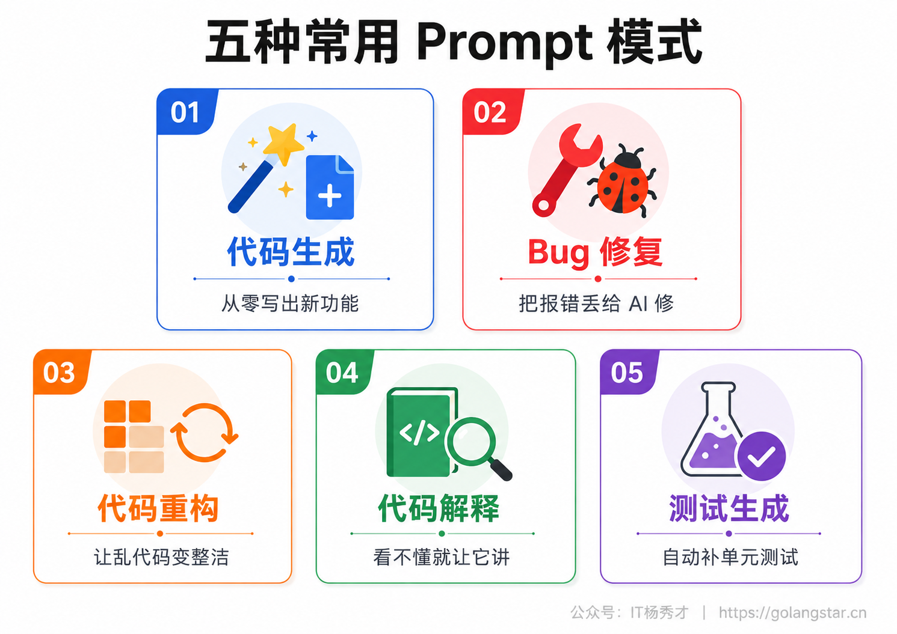
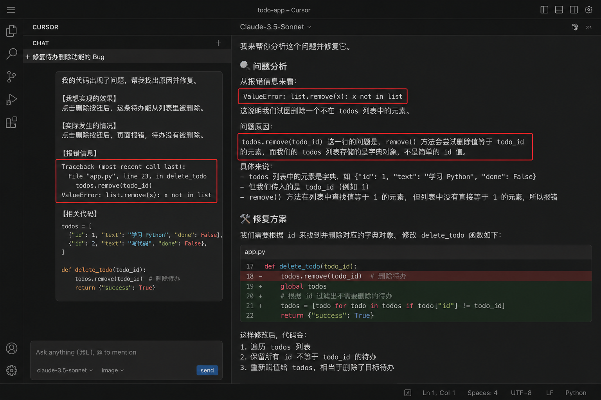
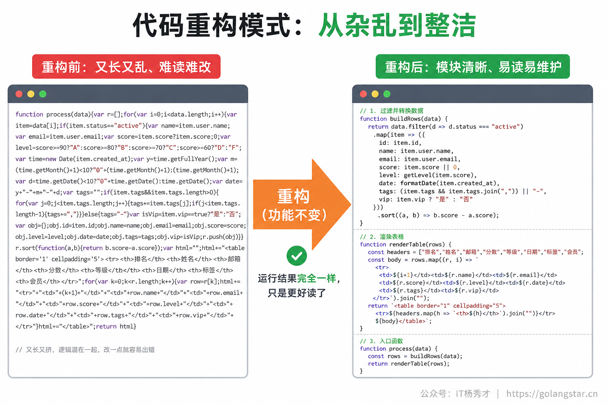
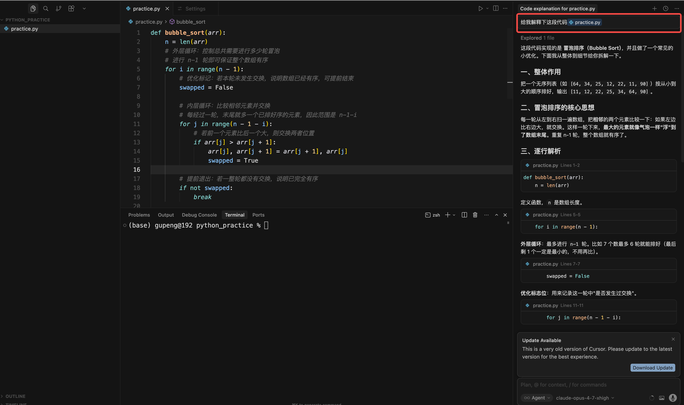

日常用 Vibe Coding，你会发现自己反复在做几类很相似的事——让 AI 写点东西、帮你改 Bug、把代码理顺、给你讲讲这段代码、补几个测试。这些高频场景，其实各有各的最佳问法，摸清了就能事半功倍，每次还从零琢磨怎么开口就太亏了。

这一篇把这几种最常用的 Prompt 模式整理成可直接套用的模板，每个都配真实示例。把它们记在手边，下次遇到对应场景，照着套就行。这些模式背后的共同内核，还是把 AI 需要的关键信息一次给全——只不过不同场景需要给全的信息各不相同，这正是模式化的价值：帮你记住每类任务该交代些什么。

## **1. 五种最常用的 Prompt 模式**

先看个全貌。日常 Vibe Coding 里，绝大多数需求都能归到下面五类：**让 AI 生成新代码、修复报错的 Bug、重构已有代码、解释看不懂的代码、生成测试**。每一类都有自己的套路。



这五类几乎覆盖了你日常和 AI 打交道的全部场景。生成是从无到有，让它造一个新东西；修复是有东西但不对，让它找问题；重构是东西能用但写得糙，让它改好；解释是看不懂别人或 AI 写的代码，让它讲明白；测试是给已有功能补上自动验证。把这五类对应的问法都摸熟，你日常遇到的需求基本都有现成的开口方式，不用再对着空白输入框发愣。

怎么快速判断手头的事该用哪一类？有个简单的对应关系：手上还什么都没有，要从头造一个，用生成；有东西但报错或行为不对，用修复；东西能跑但写得乱、想改好，用重构；看到一段代码不明白，用解释；想给已有功能加一道自动验证，用测试。绝大多数时候，你的需求一句话就能对号入座。偶尔遇到一件事横跨好几类，那就拆开、分别用对应模式处理，这也是后面会专门演示的串联用法。下面一类一类拆开讲，每类都给你可直接套用的模板和一个真实例子。

## **2. 代码生成模式**

这是最常用的一类——让 AI 从零帮你写出一个新东西，可能是一个网页、一个组件、一个函数、一个脚本。

它的模板，其实就是好 Prompt 四要素（角色、上下文、任务、约束）的实战版：

```
【角色】你是一名{相关领域专家}。
【任务】帮我做一个{具体要做的东西}，它需要{核心功能描述}。
【要求】
  1. 用{技术/语言}实现
  2. {风格、规格、约束}
  3. {其他限制，如单文件、响应式等}
```

这个模板看着和上一类没区别，因为生成模式本来就是四要素最直接的应用场景——你要从零造一个东西，自然得把身份、要做什么、做成什么样都说清楚。它在五种模式里也是自由度最高的一类：修复、重构、解释都有现成的代码作为约束，唯独生成是一张白纸，AI 能发挥的空间最大，也最依赖你给的信息。

举个真实例子，我想要一个产品定价的卡片区：

**Prompt：**
```
你是一名资深前端工程师。帮我做一个 SaaS 产品的定价卡片区，用纯 HTML+CSS 实现：
1. 横向并排三个套餐卡片：基础版（¥0）、专业版（¥39）、团队版（¥199）
2. 每张卡片包含套餐名、价格、一句简介、功能列表、一个按钮
3. 中间的专业版要突出显示（加边框，加一个最受欢迎的角标）
4. 现代简约风格，主色蓝色，卡片带圆角和阴影，鼠标悬停有上浮效果
```

AI 直接给出了一个可以拿去用的成品：


**这一类的关键，是把要做什么和做成什么样都交代清楚。** 功能（任务）决定它做对不对，规格（要求）决定它做得合不合你心意。两者缺一，AI 就得靠猜。新手最常见的毛病是只说了要做什么、忘了说做成什么样，结果功能虽然有了，样式和细节却全凭 AI 发挥，往往不合心意。所以用生成模式时，宁可在要求那一栏多写两条，把技术、风格、限制都钉死，也别留太多空白让它自由发挥。

同一个需求，差的写法和好的写法对比起来一目了然：

**信息不足的写法：**
```
帮我做个定价页面
```

**信息给足的写法：**
```
你是资深前端，用纯 HTML+CSS 做一个 SaaS 定价区，
三个套餐横排，中间那个突出显示，现代简约风、主色蓝、卡片带阴影。
```

前者 AI 只能给你一个平庸的默认版本，后者它知道用什么技术、排成什么样、什么风格，一次就能交付接近你心里预期的东西，省去大量来回返工。差距不在 AI，而在你给的信息量。这条规律对生成模式尤其明显：**生成是从零创造，AI 自由度最大，你给的约束越少，结果跑偏的可能越大。**

## **3. Bug 修复模式**

代码报错了、或者行为不对，这是日常最常碰到的。很多新手修 Bug 时只甩一句我的代码报错了帮我看看，这等于让 AI 在没有线索的情况下硬猜。正确的做法是**把定位问题需要的信息一次给全**。

模板是这样的：

```
我的代码出现了问题，帮我找出原因并修复。

【我想实现的效果】{本来期望的正确行为}
【实际发生的情况】{现在的错误表现}
【报错信息】{把完整的报错信息原样贴上}
【相关代码】{贴上出问题的那段代码}
```

**这四样里，最容易被忽略、却最关键的是报错信息和我想实现的效果。** 报错信息是 AI 定位问题的最直接线索，一定要原样复制完整的那一段，别自己概括成它说有个错误——你概括掉的，往往正是 AI 最需要的关键。而我想实现的效果，则告诉 AI 什么才算对，否则它可能把代码改得不报错了，但也不是你要的功能。

这里还有一个新手常踩的坑：明明是 A 处的现象，却凭直觉断定问题出在 B 处，然后只让 AI 看 B。结果往往是误导了它。更好的做法是**只客观描述现象，把找原因的活交给 AI**——你说清楚期望什么、实际发生了什么、报什么错，至于根因在哪，让它自己判断。它看到的线索越完整、越不被你的猜测带偏，定位得越准。

如果你用的是 Claude Code、Cursor 这类能直接读项目的工具，事情更简单——你甚至不用贴代码，直接描述现象，它会自己去翻相关文件。但期望效果、实际现象、报错这三样，依然建议你说清楚。

把差的写法和好的写法摆在一起，差距很明显：

**没法定位的写法：**
```
我的代码报错了，帮我看看
```

**能精准定位的写法：**
```
点提交按钮后页面应该跳到列表页，但现在没反应，
控制台报错 TypeError: Cannot read properties of undefined (reading 'id')，
相关代码在 submit 函数里，帮我找原因并修复。
```

前者 AI 只能反问你一堆信息，或者瞎猜；后者它一眼就能顺着报错和现象定位到问题。修 Bug 这件事，你给的线索越完整，AI 越像个有经验的同事；线索越含糊，它越像个只能靠运气的新手。所以花十几秒把现象、报错、期望补全，往往比来回拉扯几轮省时间得多。



## **4. 代码重构模式**

代码能跑，但写得乱、读着费劲、或者你想让它更规范——这时候用重构模式。重构的意思是不改变功能、只改善代码本身，所以这一类最重要的一句话是：**明确告诉 AI 功能不要变。**

模板：

```
帮我重构下面这段代码，要求功能保持完全不变，只优化代码本身：
【优化目标】{你想让它变成什么样，如：更易读、拆成小函数、去掉重复、改用更现代的写法}
【代码】{贴上要重构的代码}
重构后请简单说明你改动了哪些地方、为什么这么改。
```



为什么强调功能不变和说明改动这两点？前者是给 AI 划红线，防止它趁机把功能也一起改了；后者是让你能看懂它到底干了什么，顺便还能学到更好的写法——AI 重构后的解释，往往是很好的学习材料。

重构模式还有一个稳妥用法值得养成习惯：**改之前先确保你有办法验证功能没变**。最好是这段代码已经有测试，或者你能手动跑一遍核对结果。因为重构最大的风险就是改着改着把功能悄悄改坏了，而你如果没有验证手段，可能过很久才发现。如果暂时没有测试，可以先用后面讲的测试生成模式补几个，再动手重构，这样就有了一道安全网。对新手来说，重构是个学习的好机会——让 AI 把你写的糙代码改漂亮、再讲清楚为什么这么改，比单纯看教程涨得快。

重构时还有个值得注意的点：**把优化目标说具体，别只说帮我优化一下。** 优化是个很笼统的词，AI 不知道你嫌它哪儿不好——是嫌长、嫌重复、嫌命名乱、还是嫌性能差？目标越具体，它改得越对路。你可以说把这个一百多行的函数拆成几个小函数、把重复的三段逻辑合并成一个、把变量名改成能看懂的，这样它就知道往哪个方向使劲。一次也别让它改太多目标，一两个聚焦的改动，比一口气大改更可控、也更容易验证功能没坏。

## **5. 代码解释模式**

看到一段看不懂的代码（可能是 AI 自己写的、也可能是网上找来的），想搞明白它在干嘛，用解释模式。这一类对新手尤其有用，等于给你配了一个能随时追问、不怕你问蠢问题的讲解者。

模板很简单：

```
帮我解释下面这段代码：
1. 整体上它是做什么的？
2. 逐段说明每部分的作用，用大白话，别太专业
3. 有没有需要注意的地方或潜在问题？
【代码】{贴上代码}
```

**关键技巧是指定解释的深度和角度。** 你可以让它用初学者能懂的话讲、重点讲这段为什么这么写、逐行加注释，甚至举个具体例子帮助理解。说清楚你想要什么程度的解释，它就不会甩给你一堆同样看不懂的术语。这一点很重要：默认情况下 AI 不知道你的水平，可能讲得太深或太浅，你主动点明用零基础能懂的话讲，它才会把解释调到合适的档位。

这一类还有个进阶用法：看不懂某段解释时，可以顺着追问下去——这里说的闭包是什么意思、能不能再举个简单点的例子。一层层追问，直到真懂为止。学习别人的代码时，这种边读边问的方式能帮你飞快地把陌生代码啃下来，比硬啃文档高效得多。

解释模式对 Vibe Coding 的新手有一层特殊价值：它能让你不至于变成只会复制粘贴、却完全不懂代码的人。很多人担心用 AI 写代码会让自己什么都学不到，其实关键就在你用不用解释模式。AI 每生成一段你看不太懂的代码，顺手让它讲一讲，日积月累，你对代码的理解会在不知不觉中长起来。把生成和解释配合着用——让它写、也让它教，你既享受了 AI 的效率，又没有荒废自己的成长。这是新手特别值得养成的习惯。



## **6. 测试生成模式**

写测试是件又重要又烦的事，特别适合交给 AI。测试就是写一些代码去自动验证你的功能是不是正常工作的，有了它，你以后改动代码就不怕悄悄改坏别的地方。

模板：

```
帮我为下面这段代码写单元测试：
【说明】这段代码的作用是{功能描述}
【要求】
  1. 用{测试框架，如 Jest / pytest}
  2. 覆盖正常情况、边界情况和异常情况
  3. 每个测试用例加一句注释说明在测什么
【代码】{贴上要测试的代码}
```

**这一类的精髓是提醒 AI 覆盖边界和异常情况。** 新手让 AI 写测试，常常只测了一切正常的情况，但真正容易出 Bug 的，恰恰是那些边边角角——空输入、超大数值、非法格式、负数。明确要求它把这些情况也考虑进去，测试才真正有价值。

为什么测试值得专门让 AI 来做？因为它有两个对新手特别友好的地方。一是它把验证从手动变成了自动：以前你改完代码得自己一个个点、一个个试，有了测试，跑一下就知道哪儿坏了。二是 AI 写测试时会替你想到很多你没考虑的边界情况，相当于帮你查漏。这一类稍微进阶一点，刚入门可以先了解有这么个用法，等你做的项目变复杂、改动一多，它的价值会越来越突出——它是你大胆重构、放心迭代的底气。

具体到怎么写好测试 Prompt，除了点明覆盖边界，还有两点值得交代。一是指定测试框架，比如 JavaScript 用 Jest、Python 用 pytest，不说清楚 AI 可能用一个你项目里没装的；二是让它给每个用例加一句注释说明在测什么，这样测试本身就成了一份可读的功能说明，将来你或别人看代码时，扫一眼测试就知道这个函数该有哪些行为。新手刚接触测试可能觉得陌生，不必有压力，先让 AI 写、你照着跑通，慢慢就熟悉了它的样子和价值。

## **7. 五种模式的串联实战**

单独看每种模式还不够直观，下面用一个很小的例子，把五种模式连起来走一遍，你就能看清它们在真实开发里是怎么接力的。任务很简单：写一个判断字符串是不是回文（正着读反着读一样，比如 level、上海自来水来自海上）的函数。

**第一步，生成。** 先用代码生成模式让它写出来：

```
你是一名 Python 工程师，帮我写一个函数 is_palindrome(s)，
判断字符串 s 是不是回文，是返回 True，不是返回 False。
要求忽略大小写和空格，代码加中文注释。
```

**第二步，修复。** 假设你拿去一跑，发现传入带标点的句子时结果不对，用 Bug 修复模式反馈：

```
这个函数有个问题：
【期望】"上海自来水，来自海上"这种带标点的也能正确判断为回文
【实际】带标点时返回了 False
【报错】没有报错，就是结果不符合预期
帮我找出原因并修复。
```

**第三步，重构。** 修好之后，你觉得代码里重复处理太多，用重构模式让它理顺：

```
帮我重构这个函数，功能保持完全不变，
把清洗字符串（去标点、转小写、去空格）的部分单独抽成一个小函数，
让主函数更清爽。改完说明你调整了什么。
```

重构后的代码长这样，清洗逻辑被抽成了独立的 `clean` 函数，主函数一眼就能读懂：

```python
import re

def clean(s):
    """清洗字符串：转小写，去掉标点、空格等非字母数字和非汉字字符"""
    return re.sub(r"[^0-9a-z一-鿿]", "", s.lower())

def is_palindrome(s):
    """判断 s 是不是回文，忽略大小写、空格和标点"""
    cleaned = clean(s)
    return cleaned == cleaned[::-1]
```

**第四步，解释。** 重构后多了点你没把握的写法，用解释模式问明白：

```
逐行解释一下重构后的清洗函数，用初学者能懂的话，
重点讲那行正则表达式是怎么去掉标点的。
```

**第五步，测试。** 最后用测试生成模式给它兜底：

```
帮这个 is_palindrome 函数写一组单元测试，用 pytest，
覆盖正常回文、非回文、带标点、带大小写、空字符串这几种情况，
每个用例加注释说明在测什么。
```

它会生成五个对应的测试用例，跑一下 `pytest`，五种情况全部通过：

```
============================= test session starts ==============================
collected 5 items

test_palindrome.py::test_normal_palindrome PASSED                        [ 20%]
test_palindrome.py::test_not_palindrome PASSED                           [ 40%]
test_palindrome.py::test_with_punctuation PASSED                         [ 60%]
test_palindrome.py::test_with_case PASSED                                [ 80%]
test_palindrome.py::test_empty PASSED                                    [100%]

============================== 5 passed in 0.01s ===============================
```

走完这一圈，你得到的不只是一个能用的函数，还有理顺过的代码、搞懂了的细节、以及一组保命的测试。**这就是五种模式在实战里的样子——它们不是孤立的招法，而是一条顺畅的流水线**，从无到有、从有到对、从对到好、从好到懂、从懂到稳。把这条线跑顺，你会发现自己用 AI 写东西的节奏一下子就稳了。

当然，这个例子是为了演示才把五种都串上，真实开发里不一定每次都走全套——简单的东西可能生成完跑通就结束了，复杂的东西可能在某一两个模式上反复多轮。这里的重点不是流程要多完整，而是让你看清：**这几种模式之间是能自然衔接的，前一个模式的产出，往往就是后一个模式的输入。** 理解了这种衔接，你面对一个稍复杂的任务时，心里就有了一条清晰的推进路线，而不是想到哪问到哪。

## **8. 贯穿所有模式的两个习惯**

五种模式各有侧重，但有两个习惯贯穿其中，养成了能让每一类都用得更顺。

**第一，给 AI 一个明确的身份和目标。** 不管是生成、重构还是解释，开头点明你是一名经验丰富的某某工程师，都能让它的输出更专业、更对路。这一句几乎不花成本，却能稳定地抬高下限。目标也要明确：你是要一段能直接用的代码，还是要一个讲解，还是要一份测试？把最终想要的东西说清楚，AI 才不会答非所问。

**第二，把一次做不好的事拆成多轮。** 很多人期待一条 Prompt 解决所有问题，结果 AI 顾此失彼。更稳的做法是分轮推进：先让它生成核心，再让它补功能，再让它优化，每轮只聚焦一件事。这和拆解需求是同一个道理——步子小，每一步都好验证、好纠正。尤其在修复和重构这类容易牵一发动全身的场景，分轮做比一次性大改安全得多。

这两个习惯说起来简单，但能不能稳定做到，往往就是用 AI 用得顺不顺的分水岭。它们不属于某一种模式，而是所有模式共享的底层方法。说到底，五种模式是术，这两个习惯是道——术帮你应对具体场景，道决定你的整体水准。把道练扎实了，哪怕遇到这五类之外的新场景，你也能凭着给清身份目标、分轮小步推进这两条，稳稳地把事情交代清楚。

## **9. 灵活组合这些模式**

最后说一点使用心态。这五种模式是帮你面对常见场景时快速开口的起点，但它们不是必须一字不差遵守的公式。

上一节的串联只是其中一种走法，实际并不需要每次都把五种都用上。简单的小改动，可能一个生成模式就够了；遇到难缠的 Bug，可能在修复模式里反复几轮，每轮补一点新发现的线索。关键是根据手头的事，挑合适的模式、按需增删要素——简单的事一句话带过，复杂的事多交代几句。模式是给你参考的框架，不是限制你的格子，怎么用、用几个，始终由你当下的需求决定。用得多了你会发现，自己慢慢不再去想这属于哪个模式，而是自然而然就把该说的说全了——那一刻，模式就真正长进了你的本能里。

**模板真正的价值，在于帮你养成把关键信息说全的习惯。** 每一类任务该交代什么，模板都替你列好了：生成要给清功能和规格，修复要给全报错和期望，重构要划好功能不变的红线，解释要指定深度，测试要点明边界。用熟之后，这些套路会内化成你的直觉，到时候你张口就是一条结构清晰的好 Prompt，根本不用再想该套哪个模板。模式是帮你入门的工具，等你不再需要它，恰恰说明你已经练到家了。

## **10. 小结**

把这五种模式记在手边——代码生成、Bug 修复、代码重构、代码解释、测试生成——你日常 Vibe Coding 遇到的绝大多数场景就都有了现成的开口方式。它们的共同内核，其实还是前面反复强调的那件事：**把 AI 需要的关键信息一次给全**。生成要给清功能和规格，修 Bug 要给全报错和期望，重构要划好功能不变的红线，解释要指定深度，测试要点明边界。每一类模式，本质上都是在帮你记住这类任务最容易漏掉的关键信息。它们不是要你死记硬背五套模板，而是帮你建立一种条件反射：拿到一件事，先判断它属于哪一类，再想这一类该交代清楚什么。这种判断一旦变成本能，你写 Prompt 的稳定性就和靠灵感、碰运气的人拉开了差距。

模板是入门的拐杖，先照着套，套熟了自然会忘掉它、随需要灵活发挥。到那时候，你面对任何场景都能下意识地把该说的说全，和 AI 的配合也会越来越顺。这五类模式覆盖的是最高频的日常需求，把它们用熟，就足以应付绝大多数 Vibe Coding 的场景了。

最后给个上手建议：别想着一次记住全部，挑你当下最常做的那一两类先用起来。如果你天天在做网页，就把生成和修复练熟；如果你在读别人的项目，就多用解释。用着用着，其他模式自然会在你需要的时候被你拾起。模式这东西，是在一次次反复使用中慢慢变成本能的，不是靠背下来的。等哪天你发现自己不再需要对照模板、张口就能把需要的信息说全，这一篇的目的也就真正达到了。

<div style="background-color: #f0f9eb; padding: 10px 15px; border-radius: 4px; border-left: 5px solid #67c23a; margin: 20px 0; color:rgb(64, 147, 255);">

<h2><span style="color: #006400;"><strong>关注秀才公众号：</strong></span><span style="color: red;"><strong>IT杨秀才</strong></span><span style="color: #006400;"><strong>，回复：</strong></span><span style="color: red;"><strong>面试</strong></span></h2>

<div style="text-align: center;"><span style="color: #006400; font-size: 28px;"><strong>领取后端/AI面试题库PDF</strong></span></div>


</div>
