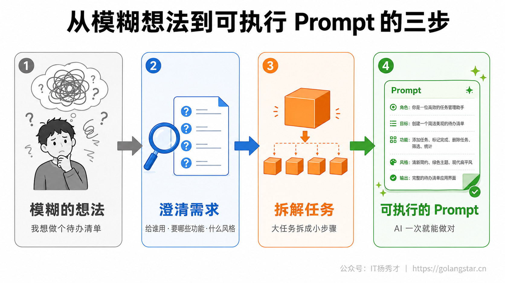
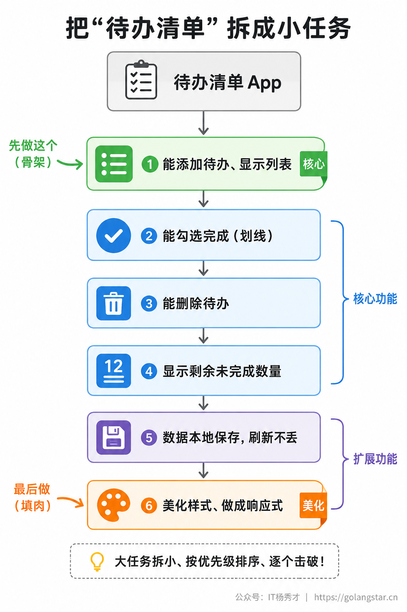
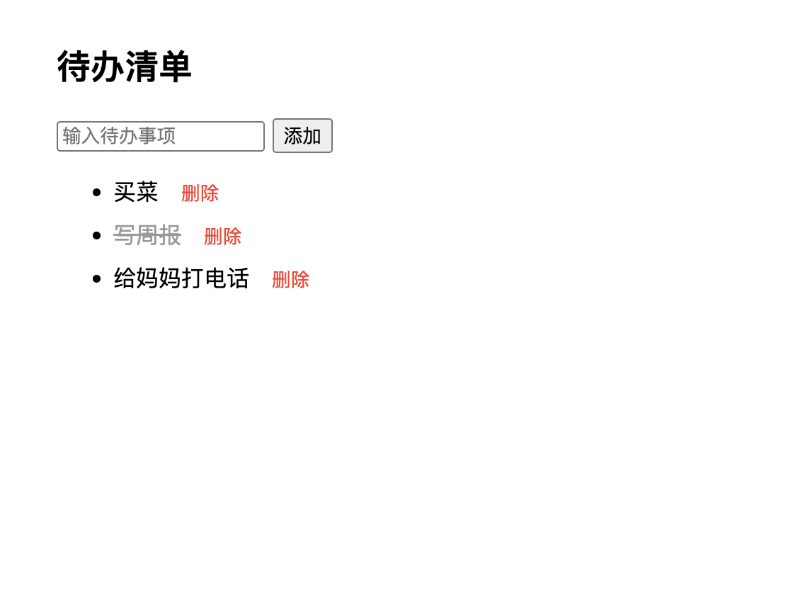
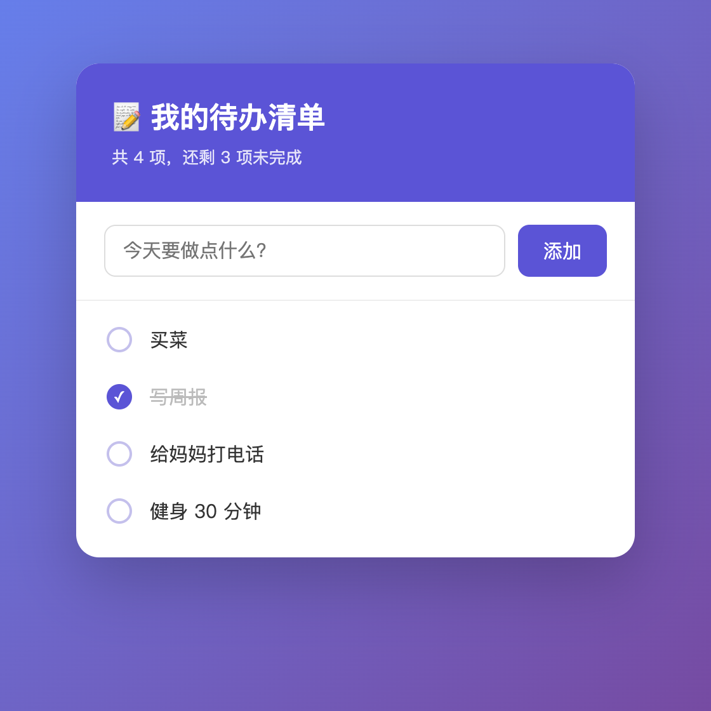

写 Prompt 之前，很多人会卡在更前面一步：**脑子里明明有个想法，可一旦要落成 Prompt，却不知从何说起。** 我想做个记账的、我想搞个小网站——想法是有的，但它模糊、笼统，根本没法直接喂给 AI。一上来就把这种半成品念头丢给 AI，它只能连蒙带猜，做出来的十有八九不是你要的。

这一篇就专门解决从想法到 Prompt 的转化难题。这中间其实有一套可复制的章法：先把模糊的想法问清楚，再把大任务拆成小任务，最后用先搭骨架再填血肉的渐进式打法一步步推进。下面用做一个待办清单这个最经典的例子，带你完整走一遍，并用真实的迭代截图让你看清每一步的样子。

## **1. 为什么不能把想法直接丢给 AI**

先想清楚问题出在哪。你脑子里的我想做个待办清单，看似是个需求，其实只是个**愿望**。它没说要在哪用（网页还是手机）、要有哪些功能（能不能勾选完成、能不能删除、要不要分类）、长什么样（什么风格）。这些没想清楚的地方，AI 全得替你猜，猜错了你再返工，一来二去就乱了。

所以从想法到 Prompt，中间隔着一个把需求想清楚的过程。这个过程不复杂，但不能跳过。它大致是三步：**把想法澄清成明确需求 → 把大需求拆成小任务 → 用渐进式的方式逐步交给 AI 实现。** 这一篇的核心观点就一句话：写 Prompt 的功夫，大半在动手敲字之前。把这三步走顺了，真正写给 AI 的那几句话反而简单。

为什么不能指望 AI 替你把愿望补全成需求？因为需求里藏着大量只有你才知道的取舍。待办要不要分类、数据要不要云端同步、界面走极简还是活泼——这些没有标准答案，全看你的实际用途和偏好。AI 可以替你写代码、替你查资料，但它替你做不了这些决定，因为它不知道你的处境。如果你不定，它就只能按最常见的情况替你假设一个，假设错了就是返工。所以这一步看着不起眼，却是整个流程里最不能外包给 AI 的部分——把要什么想清楚，永远是你的责任。这也是为什么同样用 AI，有人产出稳定、有人总在返工：差距不在谁更会调教 AI，而在谁在动手前真正把需求想明白了。把这件事做好，你就已经领先大多数人了。



## **2. 先把想法问清楚自己**

在跟 AI 开口之前，先跟自己开口。拿做一个待办清单来说，你可以像下面这样，自己给自己问几个问题，把愿望逼成具体需求：

- **给谁用、在哪用？** —— 自己用，做成一个网页，电脑手机都能开。
- **最核心的功能是什么？** —— 能添加待办、能看到列表，这是不能少的。
- **还想要哪些功能？** —— 能勾选完成、能删除、最好能显示还剩几项没做。
- **数据要不要存下来？** —— 关掉网页再打开，希望待办还在。
- **想要什么风格？** —— 简洁好看，配色清爽就行。

几个问题问下来，那个模糊的做个待办清单就变成了一份清清楚楚的需求清单。**这一步是整个转化里最关键的，因为你自己都没想清楚的事，AI 不可能替你想清楚。** 而且这些问题都不需要任何技术知识，纯粹是站在使用者的角度想一想。养成动手前先问自己几句的习惯，你的 Vibe Coding 就成功了一半。

这几个问题不是针对待办清单才有用，它们几乎适用于任何想法，可以当成一份通用的需求自检清单：**给谁用、核心功能是什么、还要哪些次要功能、数据要不要持久保存、要什么风格**。无论你想做的是记账工具、个人博客还是一个数据小脚本，动手前把这五个问题过一遍，都能把笼统的念头逼出具体的轮廓。很多人觉得自己想得挺清楚了，可一旦被这几个问题追问，才发现一堆细节根本没定。这恰恰说明这一步的价值：它把你脑子里那些含糊的、没成形的部分逼到台面上，让你不得不做决定。

这里有个常见的坑要避开：**别在这一步就追求功能想得越多越好。** 想法澄清不等于把能想到的功能全堆上去。先分清哪些是核心的、不能少的，哪些是锦上添花、可以后加的。这恰恰是下一步拆解要干的事。一上来就贪大求全，往往是项目做着做着失控的起点。先把核心做出来、能用了，再回头看要不要加那些次要功能，很多时候你会发现，当初想加的一堆东西，真用起来根本没那么必要。

## **3. 让 AI 帮你把需求问清楚**

上一节让你自己问自己，但新手常遇到一个更尴尬的处境：**我连该问自己什么都不知道。** 这时候有个很好用的技巧——把模糊的想法直接交给 AI，让它反过来采访你。AI 见过大量同类项目，往往比你更清楚一个东西该考虑哪些方面。

具体做法是，别一上来就让它写代码，而是先让它帮你梳理需求：

**Prompt：**
```
我想做一个待办清单的小网页，但还没想清楚细节。
先别写代码，你作为产品经理，问我一些关键问题，
帮我把这个需求理清楚。问题一次别太多，我回答完你再接着问。
```

AI 会像产品经理一样，一条条问你：要不要分类？待办要不要设截止日期？完成的要不要单独归档？数据存本地还是要登录同步？这些问题里，有些可能正是你没想到、但确实该决定的。你逐个回答的过程，就是把需求一点点定下来的过程。等你把它的问题都答完，往往会惊讶地发现，原来一个看似简单的待办清单，背后竟藏着这么多需要拍板的细节。

这一招的价值在于，它把澄清需求从你一个人冥思苦想，变成了一问一答的对话，门槛低得多。尤其当你面对的是一个陌生领域、压根不知道有哪些坑时，AI 的提问能帮你补上经验的空缺。举个例子，你想做个简单的记账工具，可能根本没想到要不要区分收入和支出、要不要支持多个账户、金额要不要保留两位小数这些细节，而 AI 一问，你就一个个把它们定下来了。等问得差不多了，你再让它把整理好的需求复述一遍：

**Prompt：**
```
好了，把我们刚才确定的需求完整总结成一份清单，
按核心功能和次要功能分开列，方便我接下来一步步实现。
```

这样你就拿到了一份经过梳理、分好优先级的需求清单，下一步的拆解几乎是顺水推舟。**要提醒的是，主意还得你来拿。** AI 问的问题是帮你打开思路，但每个问题怎么答、要不要这个功能，最终都得你拍板——它再会问，也不知道你心里真正想要什么。把 AI 当成帮你理清思路的助手，而不是替你做决定的人。这一招和上一节自己问自己并不冲突，反而是互补的：能自己想清楚的，自己先过一遍；想不到、拿不准的，再借 AI 的提问打开思路。两者配合，需求澄清这一步就既高效又少漏。

## **4. 把大任务拆成小任务**

需求清楚了，但如果你把上面那一长串功能一股脑全写进一条 Prompt 丢给 AI，往往会出问题：要么 AI 顾此失彼、漏掉几个；要么生成一大段代码，一旦哪里不对，你根本不知道问题出在哪。

更稳的做法是**拆解**：把一个大任务，切成几个有先后顺序的小任务。还是待办清单这个例子，可以这么拆：



拆解时有两个原则。**一是按核心优先排序**：最不能少的功能（能加、能看）排最前面，锦上添花的（美化、本地存储）放后面。**二是每个小任务都要独立可验证**：做完一个就能跑起来看到效果，对了再做下一个。这样万一哪一步出错，你立刻就能定位，而不是等全做完了对着一堆代码发懵。

这里多说一句怎么判断拆得合不合适。一个好的拆分，每一步都应该满足两个条件：做完能单独跑起来看到结果，并且和下一步之间界限清楚、不会搅在一起。如果某一步做完什么都看不到、必须等后面几步一起才能验证，那说明它切得太细或切错了位置；反过来，如果一步里塞了好几件不相干的事，那是切得太粗，该再分。拆解不是越碎越好，而是每一步都恰好是一个能独立交付、独立验收的最小单元。

拆解的好处，本质上是**把一次性赌一大把，变成分多次小步推进**。每一步都小、都可控、都能验收，AI 出错的概率低，你纠错的成本也低。这一点对新手尤其重要：你越没经验，越要把步子迈小，因为小步出的错好发现、好回退，大步一旦翻车，往往整个推倒重来。

拆解还有个附带的好处：它会逼你把上一步没想透的地方暴露出来。当你试图把待办清单拆成一步步时，可能突然意识到一个之前没定的问题——勾选完成的待办是留在列表里划掉，还是移到一个单独的已完成区？这个问题在你笼统地想做个待办清单时根本不会冒出来，只有当你认真排执行顺序时才会浮现。所以拆解不只是排顺序，它本身也是一轮更细的需求澄清。这也是为什么我把想清楚和拆开来当成两步来讲——它们各自能逼出不同层次的细节。

## **5. 渐进式开发**

拆好了任务，接下来就是渐进式地交给 AI 一步步实现——这是 Vibe Coding 里非常重要的一招：**先搭骨架，再填血肉。** 别指望一条 Prompt 就让 AI 端出一个完美成品，而是先让它把最核心的骨架立起来，跑通了，再一层层往上加。

下面就用前面拆好的任务，真实走一遍，你能直观看到成品逐步成形的过程。

**第一步，先搭骨架（对应任务①）。** 先只让 AI 实现最核心的功能：

**Prompt：**
```
帮我用纯 HTML + JavaScript 做一个最简单的待办清单网页：
有一个输入框和"添加"按钮，输入文字点添加，就把它显示到下面的列表里。
先实现这个核心功能就行，样式先不用管。
```

AI 很快给出一个能跑的骨架版——丑是丑了点，但核心功能（能输入、能添加、能显示）跑通了：


**第二步，往骨架上加功能（对应任务②③④）。** 核心跑通了，接着让 AI 在这个基础上加东西，不用重做：

**Prompt：**
```
在刚才的基础上加三个功能：
1. 点击某条待办，可以把它标记为"已完成"，已完成的显示一条删除线
2. 每条待办后面加一个"删除"按钮，能删掉它
3. 顶部显示一共多少项、还剩几项没完成
```

现在它已经像个能用的工具了——能勾选完成（带划线）、能删除：



**第三步，最后填肉、美化（对应任务⑤⑥）。** 功能齐了，再让 AI 把样式和体验做漂亮：

**Prompt：**
```
功能都很好，现在帮我美化一下：
1. 整体用现代简约风格，主色用紫色渐变，卡片式布局、圆角、阴影
2. 待办数据保存到浏览器本地，刷新页面后还在
3. 做成响应式，手机上也能正常用
```

最终成品就出来了，和一开始那个白底黑字的骨架版相比，简直判若两物：



这就是渐进式开发的价值所在。它和盖房子先立框架、再砌墙通水电、最后装修是同一个道理：每一步都建立在上一步稳固的基础上，你也能在每一步看到实实在在的进展，整个过程踏实、可控、不容易翻车。更重要的是，万一某一步效果不对，你要纠正的只是这一小步刚加的东西，前面跑通的部分原封不动，改起来代价极小。

反过来，如果你一上来就把美观的、能勾选能删除能本地存储的、响应式的待办清单全塞进一条 Prompt，AI 也不是做不出来，但只要有一个细节不对，你就得在一大段代码和一长串需求里来回找问题，效率反而低。**越是复杂的东西，越要拆开、分步来。** 这条经验不只适用于 Vibe Coding，任何稍微复杂点的事，分步推进都比一口吃成胖子稳得多。

渐进式开发里有一个细节新手容易忽略：**每加完一步，一定要真的去验一下，确认没问题再往下走。** 很多人图快，让 AI 连着加好几个功能都不中途检查，等发现不对，已经分不清是哪一步引入的问题了。正确的节奏是加一步、跑一下、看效果，对了再提下一个需求。如果某一步加完发现前面好好的功能反而坏了，立刻告诉 AI 哪里退化了、让它修，而不是继续往上堆。

还有一个实用习惯：**在关键节点让 AI 停一下、给你讲讲它做了什么。** 比如骨架搭完后问一句这段代码大概是怎么工作的，既能帮你判断它有没有理解偏，也能顺带学到东西。Vibe Coding 不是把活全甩给 AI 就不管了，而是你始终清楚每一步在发生什么，保持对项目的掌控。哪怕你看不懂具体代码，至少要知道每一步它做了什么、效果对不对，这种掌控感正是新手能稳步推进、不至于做着做着失控的关键。

## **6. 换个例子再走一遍**

待办清单是个前端的例子，你可能会想，那种要做工具、要处理数据的需求，是不是就不适用了？其实一模一样。这里换一个完全不同的场景，把这套章法再走一遍，你就能体会它的通用性。

假设你的想法是：我想要一个能统计我读书笔记的小工具。还是先**问清楚自己**：给谁用——自己用；做成什么形态——一个能在电脑上跑的 Python 脚本就行；核心功能——读取我存笔记的文件夹，统计一共写了多少篇、总字数多少；还想要什么——按月份分组看看每个月写了多少；数据从哪来——笔记都是 Markdown 文件，放在一个固定目录里。几个问题下来，模糊的想法就有了清晰的轮廓。

接着**拆解排序**：第一步，能扫描目录、数出有多少篇笔记；第二步，统计每篇和总的字数；第三步，按月份分组汇总；第四步，把结果打印得清楚好看。核心的排前面，锦上添花的放后面，每一步都能单独验证。

然后**渐进式实现**，先搭最核心的骨架：

**Prompt：**
```
你是一名熟悉数据处理的 Python 工程师。
帮我写一个脚本，扫描指定文件夹下所有的 .md 文件，
先实现最基础的功能：数出一共有多少个 .md 文件，打印出来。
代码加上中文注释，我能看懂每一步。
```

跑通之后，再一步步往上加：

**Prompt：**
```
在刚才的基础上加功能：
1. 统计每个文件的字数，以及所有文件的总字数
2. 按文件名里的年月（格式是 2025-06-xxx.md）把笔记分组，
   统计每个月有几篇、多少字
打印结果时分块显示，清楚一点。
```

两步跑通后，最后再让它把输出整理得更好看，比如生成一份带表头的汇总，或者干脆导出成一个 Excel。要不要加这一步、加到什么程度，由你按实际需要决定——但因为前面骨架和核心功能都稳了，这一步只是锦上添花，加坏了也不影响主体。

你看，从一个前端网页换成一个数据脚本，方法没有任何变化：**先问清楚自己，再拆解排序，最后渐进式实现。** 不管做什么，难的从来不是写 Prompt 的措辞，而是动手前把需求理顺、把步骤排好。这套章法是跨场景通用的，练熟一次，做什么都用得上。两个例子放一起对比，你应该能更踏实地相信：它不是只对某类项目管用的技巧，而是一套能迁移到任何 Vibe Coding 任务上的通用思路。

## **7. 完整流程回顾**

我们把整个过程串起来再看一遍，你就能体会这套章法的连贯性了。

起点是一句模糊的话——我想做个待办清单。第一步，**问清楚自己**，把它澄清成一份具体需求：自己用的网页，要能增删、能勾选完成、能本地保存、要好看。第二步，**拆解排序**，把需求切成六个有先后的小任务，核心的排前面，美化的放最后。第三步，**渐进式实现**，用三条循序渐进的 Prompt，先骨架、再功能、后美化，一步步喂给 AI，每一步都验收过关再走下一步。

你会发现，真正写给 AI 的那几条 Prompt，每一条都不长、也不烧脑，因为难的部分（想清楚要什么、按什么顺序做）你在动手前已经解决了。**这正是从需求到 Prompt 的精髓：把功夫下在动手之前。** 想清楚了，剩下的就是顺理成章地一条条交给 AI。整个过程里，AI 始终只是执行者，真正决定成败的，是你前期那点理清需求、排好顺序的思考。

把这三步连起来看，你会发现它们其实是一条收窄的漏斗：最上面是一个宽泛模糊的愿望，经过问清楚，收成一份具体需求；经过拆解，收成一串有序的小任务；经过渐进式实现，收成一个个跑通的版本，最后汇成成品。每经过一步，不确定性就少一截，到真正动手时，留给 AI 猜的空间已经很小了。新手之所以容易在 Vibe Coding 里失控，往往就是跳过了前两步，直接拿着模糊愿望让 AI 一步到位，把所有不确定性都压到了最后。把漏斗一节节走下来，过程自然就稳了。

## **8. 小结**

新手和熟手在 Vibe Coding 上的差距，很多时候不在会不会写 Prompt 的措辞，而在会不会把一个想法理清楚、拆明白。同样是做待办清单，有人对着 AI 反复折腾还一团乱，有人三步就稳稳拿下，区别就在动手前那点想清楚、拆开来、分步走的功夫。

当然，这套三步法不是要你做任何小事都郑重其事走一遍。让 AI 帮你改个按钮颜色、加个小函数，张口就说即可，没必要先澄清再拆解。它真正的用武之地，是当你要从零做一个有好几个功能、稍微复杂一点的东西时——这种时候，前期多花十分钟理需求、排顺序，能帮你省下后面反复返工的几个小时。判断要不要走全套，看一个标准：这件事是不是一句话说不完、需要好几步才能做完。是，就值得按这套来；不是，直接开口。

记住这套从需求到 Prompt 的章法：**先把模糊的想法问清楚自己，再把大任务拆成有序的小任务，最后用先骨架后填肉的方式一步步交给 AI。** 它不只适用于待办清单，做任何东西都通用。把它练成习惯，你会发现自己跟 AI 协作时越来越从容，做出来的东西也越来越接近你心里想的那个样子。说到底，AI 再强，也替代不了你把需求想明白这一步——而这一步，恰恰是最不需要技术、却最拉开差距的地方。把动手前的思考练成习惯，你和 AI 的每一次合作都会更省心、更可控。

<div style="background-color: #f0f9eb; padding: 10px 15px; border-radius: 4px; border-left: 5px solid #67c23a; margin: 20px 0; color:rgb(64, 147, 255);">

<h2><span style="color: #006400;"><strong>关注秀才公众号：</strong></span><span style="color: red;"><strong>IT杨秀才</strong></span><span style="color: #006400;"><strong>，回复：</strong></span><span style="color: red;"><strong>面试</strong></span></h2>

<div style="text-align: center;"><span style="color: #006400; font-size: 28px;"><strong>领取后端/AI面试题库PDF</strong></span></div>


</div>
