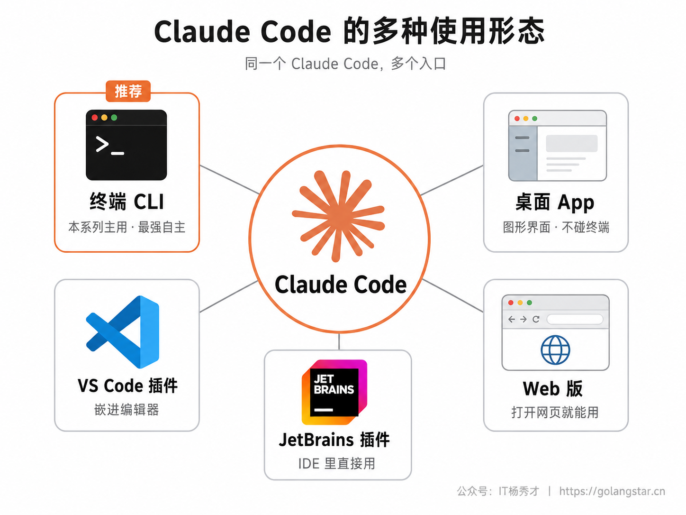
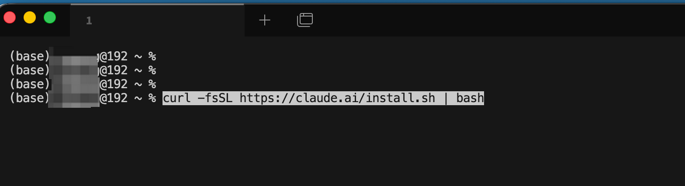
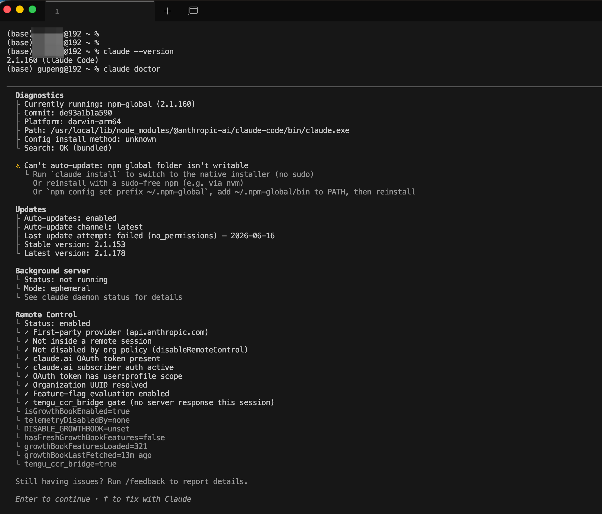
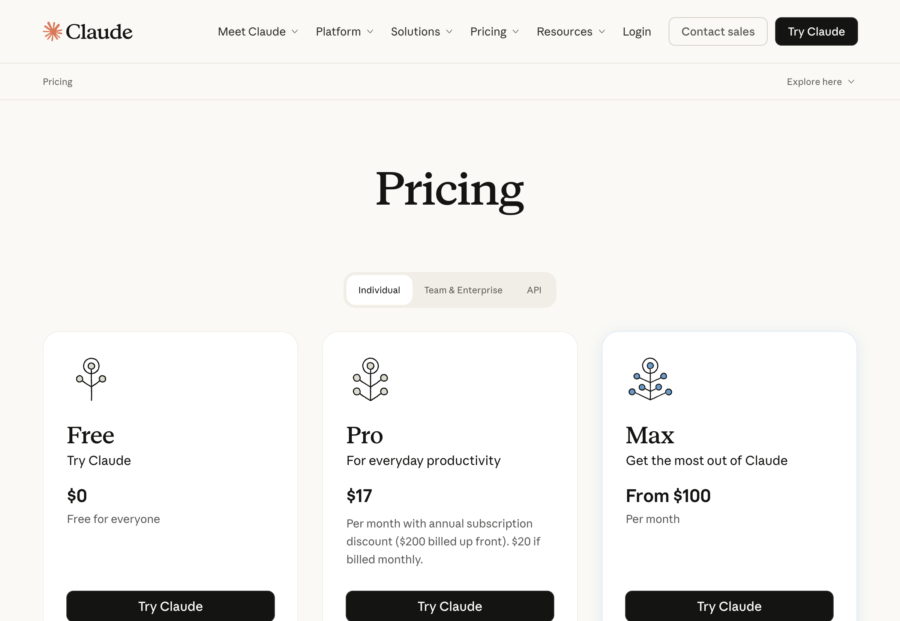
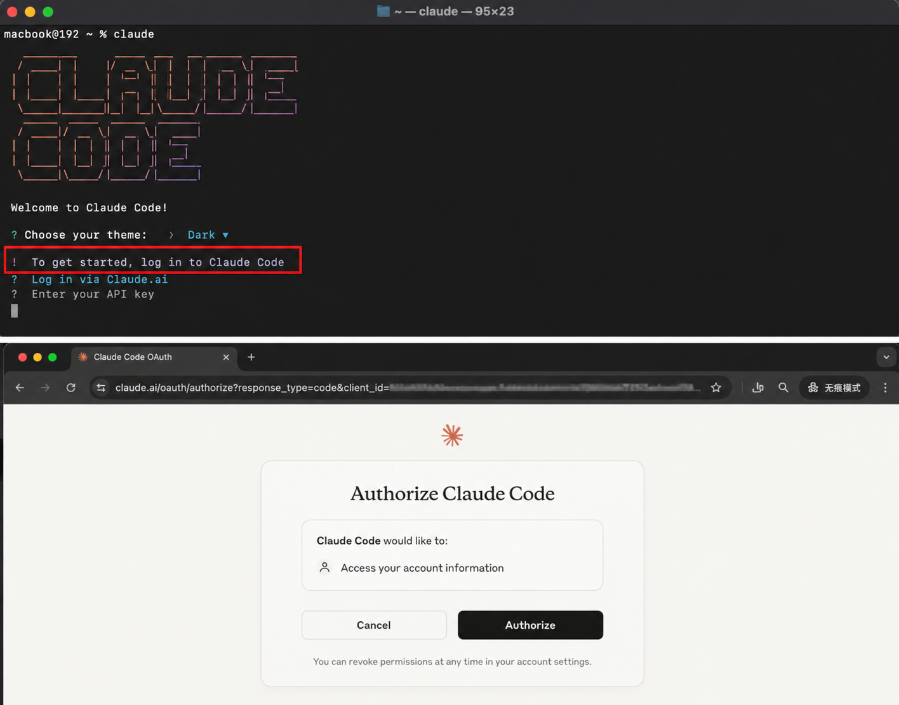
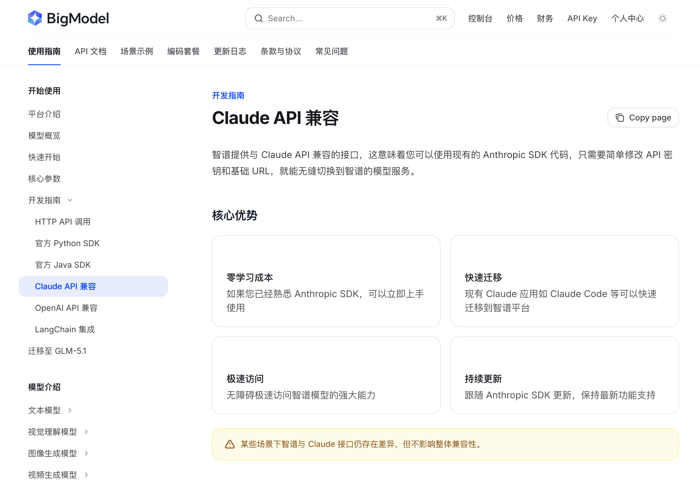
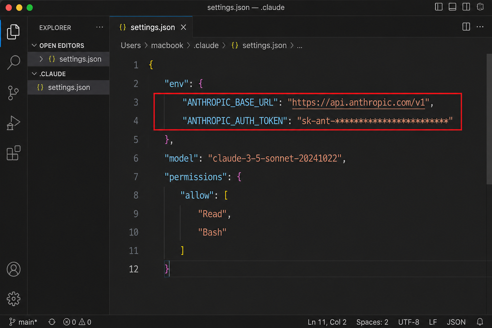
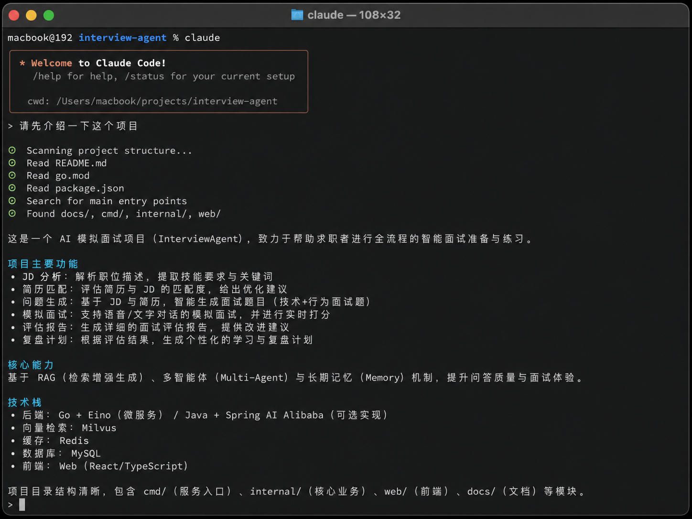
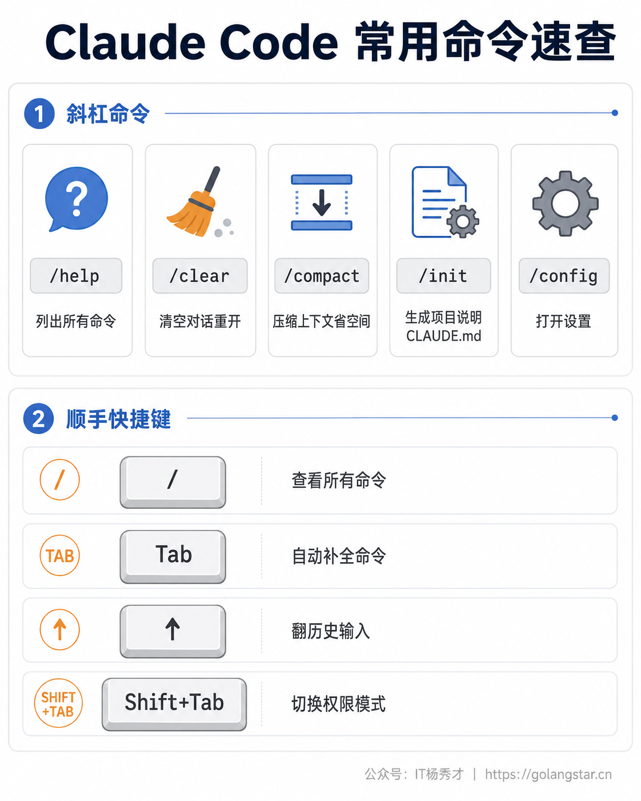

上一篇我们把开发环境的地基打好了，从这一篇开始，真正的主角要登场了。第一个请上台的，是本系列的主线工具——**Claude Code**。它是 Anthropic 出品的终端类 Coding Agent，自主能力极强，你交代一个任务，它能自己读项目、自己写代码、自己跑命令、自己调试，是目前公认体验天花板级别的 Vibe Coding 工具。

这一篇就手把手带你把它装好、配好、跑通第一次对话。整个流程其实就一条命令装好，难点不在安装本身，而在两件中国用户绕不开的事：一是 Claude Code 需要 Anthropic 账号，二是中国大陆并不在它的官方支持区域内。别担心，这两关都有成熟的解法，我会专门用一整节讲清楚国内用户怎么直连使用——用国产大模型的兼容接口，连梯子和海外支付都省了。跟着做，半小时之内你就能在终端里和 AI 聊起来。

## **1. 先认识一下 Claude Code**

正式安装前，先花一分钟搞清楚 Claude Code 到底是个什么东西、有哪些用法，免得装完了一脸懵。

简单说，Claude Code 是一个跑在你电脑上的 AI 编程助手。它最经典、也是本系列主要使用的形态，是**命令行工具（CLI）**——也就是上一篇我们认识的那个终端窗口里，你输入 `claude` 就能把它唤起，然后用大白话跟它对话、派活。除了终端，它其实还有好几种"分身"：有不想碰终端的人可以用的**桌面 App**（图形界面），有能嵌进 **VS Code、JetBrains** 这些编辑器里的插件，还有打开浏览器就能用的 **Web 版**。它们背后是同一个 Claude Code，只是入口不同。



本系列的教程，主要围绕**终端 CLI** 这个形态来讲，因为它最能体现 Claude Code "自主干活"的精髓，也是后面所有高级玩法（命令、MCP、子代理等）的基础。如果你实在对终端发怵，可以先用桌面 App 过渡，但我还是建议你跟着教程把 CLI 用熟，那才是它真正的主场。

## **2. 安装 Claude Code**

先看一眼系统要求，免得装到一半发现机器不支持。Claude Code 支持 macOS 13.0 及以上、Windows 10（1809 版本）及以上、以及主流 Linux 发行版，内存 4GB 以上即可，基本上这几年的电脑都没问题。

官方现在**最推荐的安装方式是"原生安装"（Native Install）**，它不依赖别的东西、装好后还能自动在后台更新，是最省心的路子。打开你的终端，根据系统复制对应的命令粘进去回车就行。

**macOS / Linux 用户**，在终端里执行：

```bash
curl -fsSL https://claude.ai/install.sh | bash
```

**Windows 用户**，用 PowerShell（注意不是 CMD）执行：

```powershell
irm https://claude.ai/install.ps1 | iex
```

> 这里插一句怎么分辨 PowerShell 和 CMD：看命令行开头，PowerShell 的提示符长这样 `PS C:\`，前面带个 `PS`；CMD 则是 `C:\` 没有 `PS`。上面这条 `irm` 命令只能在 PowerShell 里跑。



除了原生安装，还有几种备选方式，按需选用：macOS 上习惯用 Homebrew 的，可以 `brew install --cask claude-code`；Windows 上有 WinGet 的，可以 `winget install Anthropic.ClaudeCode`；如果你上一篇装了 Node.js，也可以用 npm 装：`npm install -g @anthropic-ai/claude-code`（注意**千万别加 `sudo`**，容易引发权限问题）。这几种方式效果一样，但原生安装能自动更新、最省事，新手首选它就好。

装完之后，**重启一下终端**（关掉重新打开，让系统认得新命令），然后验证是否装好。敲这条命令看版本号：

```bash
claude --version
```

如果它回给你一个版本号（比如 `2.x.x`），说明装好了。想更全面地体检一下安装和配置状态，还可以敲 `claude doctor`，它会把环境检查一遍并告诉你有没有问题。



要是敲 `claude` 提示 `command not found`，八成是没重启终端，关掉重开再试；还不行就重启电脑。

## **3. 账号与认证**

Claude Code 装好了，但它不能白用，得有个账号来认证。这里要先说清楚一个关键点：**免费的 Claude.ai 账号是用不了 Claude Code 的**，你需要下面几种之一：

一是 **Claude 订阅账号**，包括 Pro、Max、Team、Enterprise 这几档，这是官方最推荐的方式。其中 Pro 大约每月 17 美元（按年付）或 20 美元（按月付），适合个人日常使用；Max 从每月 100 美元起，给重度用户用，额度大得多。二是 **Claude Console 账号**，也就是走 API、按用量预付费的方式。三是通过 Amazon Bedrock、Google Vertex AI 这类云服务商接入，主要是企业在用。



认证方式很简单：装好后在终端直接敲 `claude` 启动它，第一次运行它会引导你选一个界面主题，然后弹出浏览器让你登录账号，按提示在浏览器里登录、授权，回到终端就认证完成了。之后凭证会存在本地，不用每次都登。如果中途想换账号，在 Claude Code 里敲 `/login` 就能重新登录。



但是——这里就要讲到中国用户绕不开的那道坎了。

## **4. 国内用户怎么直连使用（重点）**

中国大陆目前并不在 Anthropic 官方支持的国家和地区名单里，这意味着直接注册 Claude 官方账号、用海外信用卡订阅付费，对国内用户来说门槛不低，网络上也常会碰到连接问题。好在 Claude Code 有一个非常关键的设计，给我们留了一条又稳又便宜的路。

Claude Code 允许你通过两个环境变量，把它的"大脑"从 Anthropic 官方接口，切换到**任何兼容 Anthropic 接口格式的服务**上。这两个变量是 `ANTHROPIC_BASE_URL`（接口地址）和 `ANTHROPIC_AUTH_TOKEN`（密钥）。这就好比 Claude Code 是一台能换发动机的车，官方发动机用不了，我们可以换一台能用的上去。

而国内多家大模型厂商，恰恰都提供了"Anthropic 兼容接口"——也就是说，你可以用**智谱 GLM、Kimi（月之暗面）、阿里通义千问**这些国产大模型来驱动 Claude Code，全程国内网络直连、用支付宝微信就能充值付款，彻底绕开海外账号和网络的麻烦。这是目前国内用户最省心、最推荐的上手方式。



如上图，以智谱 GLM 为例，它的官方文档里明确写着提供"Claude API 兼容"接口，现有的 Claude Code 可以快速迁移过来用。下面给你一套通用的配置方法（以智谱 GLM 为例，其他厂商同理，只是地址和密钥不同）。

第一步，去对应厂商的开放平台注册账号、充值、创建一个 API Key（这一步各家平台都有引导，按它的说明做即可）。

第二步，把接口地址和密钥告诉 Claude Code。最推荐的做法是写进 Claude Code 的配置文件 `~/.claude/settings.json` 里（这个文件在你用户目录下的 `.claude` 文件夹里，没有就新建一个）：

```json
{
  "env": {
    "ANTHROPIC_BASE_URL": "https://open.bigmodel.cn/api/anthropic",
    "ANTHROPIC_AUTH_TOKEN": "你在智谱申请的API_Key"
  }
}
```

> 不同厂商的接口地址不一样，这里给几个常见的供参考：智谱 GLM 是 `https://open.bigmodel.cn/api/anthropic`，Kimi 是 `https://api.moonshot.cn/anthropic`。具体地址和可用的模型名称，请以各厂商官方文档的最新说明为准——这些信息更新较快，照着官方文档抄最稳妥。

第三步，保存文件，重新启动 Claude Code（`claude`），它就会改用你配置的国产大模型来干活了。这时候你不再需要 Anthropic 官方账号，也不用操心海外网络，国内直连就能愉快地玩起来。



需要说明的是，用国产大模型驱动 Claude Code，体验已经相当不错，但和官方顶配的 Claude 模型在最复杂任务上还是会有些差距。如果你后续想追求极致效果，也有海外信用卡和稳定网络环境，再切回官方订阅即可——配置方式是一样的，把 `settings.json` 里那段 env 删掉、重新用 `claude` 登录官方账号就行。**起步阶段，能用、好用、没障碍，比追求最强更重要。**

## **5. 第一次对话体验**

环境和认证都搞定了，来感受一下 Claude Code 是怎么干活的。找一个你电脑上的项目文件夹（没有的话随便新建一个空文件夹也行），在终端里 `cd` 进去，然后敲 `claude` 启动。

第一次在某个文件夹启动时，它会问你信不信任这个目录（确认是你自己的文件夹，放心选信任即可）。然后你就会看到一个对话提示符，可以开始打字了。先别急着让它写代码，试试让它了解一下这个项目：

**Prompt：**
```
这个项目是做什么的？用了哪些技术？
```

Claude Code 会自己去读文件夹里的文件，然后用中文给你总结这个项目的用途和技术栈。你会发现你压根不用手动把文件喂给它，它会自己按需去看——这正是 Coding Agent 自主能力的体现。



接着可以试试让它干点实事，比如：

**Prompt：**
```
在这个项目里加一个简单的 hello world 函数
```

它会先找到合适的文件、把要做的改动展示给你看，然后**停下来等你批准**——这是 Claude Code 一个很重要的安全设计：默认情况下，它改任何文件之前都会先征求你同意。你看一眼觉得没问题，按确认它才动手。等你用熟了，也可以开启"全部接受"模式让它放开手脚，但新手阶段，保持这种"它提议、你点头"的节奏更稳妥。

## **6. 几个必会的基础命令**

在 Claude Code 里，除了用大白话对话，还有一类以斜杠 `/` 开头的"命令"，用来管理会话本身。新手不用全记，先掌握下面这几个高频的就够日常用了。



最常用的是 **`/help`**，忘了有哪些命令时敲它，会列出当前所有可用命令。**`/clear`** 用来清空当前对话历史、开始一段全新的对话——这个特别有用，当你聊着聊着发现话题跑偏了、或者要开始一个不相干的新任务时，敲一下 `/clear`，相当于把桌子擦干净重新开始，能让 AI 不被之前的内容干扰。

**`/compact`** 是压缩对话上下文：聊得很长之后，对话内容会越积越多，敲 `/compact` 能让 Claude Code 把前面聊过的东西浓缩成一段摘要，既保留关键信息，又给后面的对话腾出空间（这背后的"上下文"概念很重要，进阶心法篇会专门讲）。**`/init`** 则是让 Claude Code 扫描你的项目、自动生成一个叫 `CLAUDE.md` 的项目说明文件，相当于给项目建一份"使用手册"，让 AI 以后更懂你的项目（这个文件后面工具精通篇会细讲）。**`/config`** 用来打开设置，调整主题、模型、自动更新等各种选项。

除了斜杠命令，还有几个顺手的小技巧值得记一下：打一个 `/` 就能看到所有命令的列表；按 `Tab` 键能自动补全命令；按 `↑` 上方向键能翻出你之前输入过的内容；按 `Shift + Tab` 能在不同的权限模式之间切换（比如从"每步都问我"切到"自动接受"）。这些小操作能让你用起来顺手很多。

## **7. 常见问题排查**

最后把几个新手最容易撞上的问题集中说一下，碰到了别慌，对号入座。

敲 `claude` 提示 **`command not found`** 或"不是内部或外部命令"，这是最常见的，原因基本都是装完没重启终端。把终端关掉重新打开再试，九成能解决；还不行就重启电脑，让系统重新加载环境配置。

**登录卡住、连接超时、或者提示当前地区不支持**，多半是网络或地区限制的问题。如果你走的是官方账号，需要确认网络环境；如果嫌麻烦，直接回到第 4 节用国产大模型的兼容接口，国内直连就不会有这些问题了。

**配置了兼容接口还是报认证错误**，先检查 `settings.json` 里的接口地址和密钥有没有填错、有没有多余的空格或引号，再确认你在厂商平台的账户里确实充值了、API Key 是有效的。这个文件是标准的 JSON 格式，少个逗号、多个括号都会出错，可以把内容贴给 AI 或在线 JSON 校验工具检查一下格式。

实在搞不定时，记得 Claude Code 自带一个体检命令 **`claude doctor`**，它会帮你把安装和配置扫一遍，很多问题它会直接告诉你出在哪、怎么修。

## **8. 小结**

把 Claude Code 装好、配好、跑通第一次对话，你就算真正一只脚踏进 Vibe Coding 的大门了。回头看，整个过程的技术难度其实很低——一条命令安装、浏览器点一下登录，唯一需要动点脑筋的，是国内用户怎么绕开账号和网络的坎，而这道坎，用国产大模型的兼容接口就能轻松迈过去。

工具到手只是开始，真正决定你能用它做出多少东西的，还是前面认知篇反复强调的那套协作心态和把需求讲清楚的能力。从下一篇起，我们会继续把 Cursor、Codex 也各装一份，让你手里的兵器库齐整起来。但你完全可以现在就用刚装好的 Claude Code，找个小文件夹，随便跟它聊几句、让它帮你写个小脚本——亲手感受一次"说句话、AI 干活"的爽快，比看十篇教程都来得实在。

<div style="background-color: #f0f9eb; padding: 10px 15px; border-radius: 4px; border-left: 5px solid #67c23a; margin: 20px 0; color:rgb(64, 147, 255);">

<h2><span style="color: #006400;"><strong>关注秀才公众号：</strong></span><span style="color: red;"><strong>IT杨秀才</strong></span><span style="color: #006400;"><strong>，回复：</strong></span><span style="color: red;"><strong>面试</strong></span></h2>

<div style="text-align: center;"><span style="color: #006400; font-size: 28px;"><strong>领取后端/AI面试题库PDF</strong></span></div>


<div style="text-align: center; margin-top: 22px; padding-top: 20px; border-top: 1px solid #c2e7b0;">
<div style="color: #006400; font-size: 20px; font-weight: bold;">🔥 配套实战项目，拆得开、跑得起、能写进简历</div>
<div style="color: red; font-size: 16px; font-weight: bold; margin-top: 8px;">多 Agent 编排 + RAG 混合检索 · 31 篇深度教程 + 50+ 面试题</div>
<a href="/projects/dev-support.html" style="display: inline-block; margin-top: 14px; background: #ff7a18; color: #fff; font-size: 18px; font-weight: bold; padding: 10px 28px; border-radius: 24px; text-decoration: none;">点击查看 DevSupport AI 实战项目 →</a>
</div>
</div>
