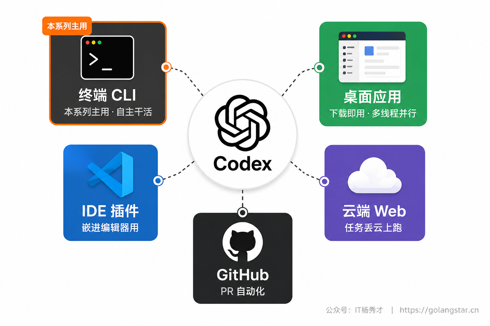
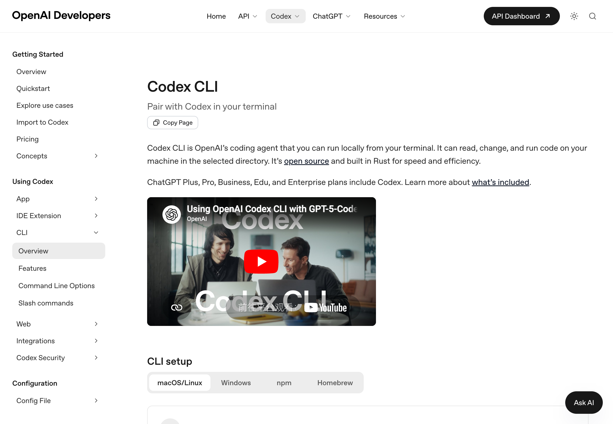
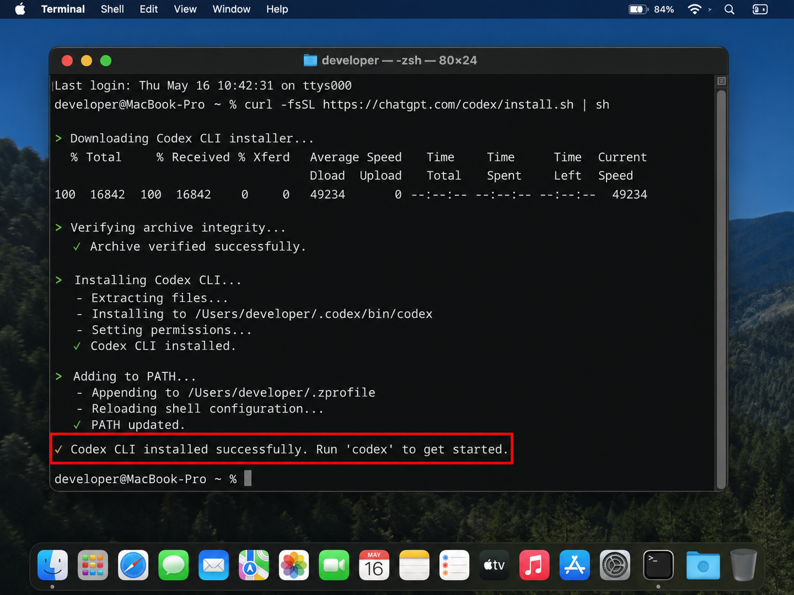
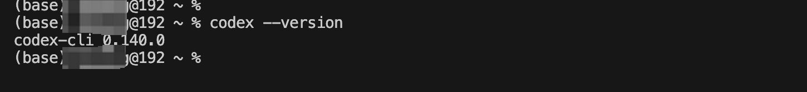
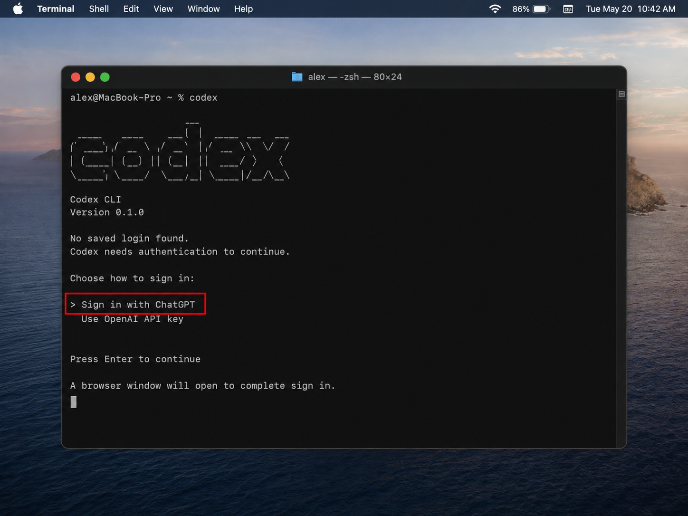
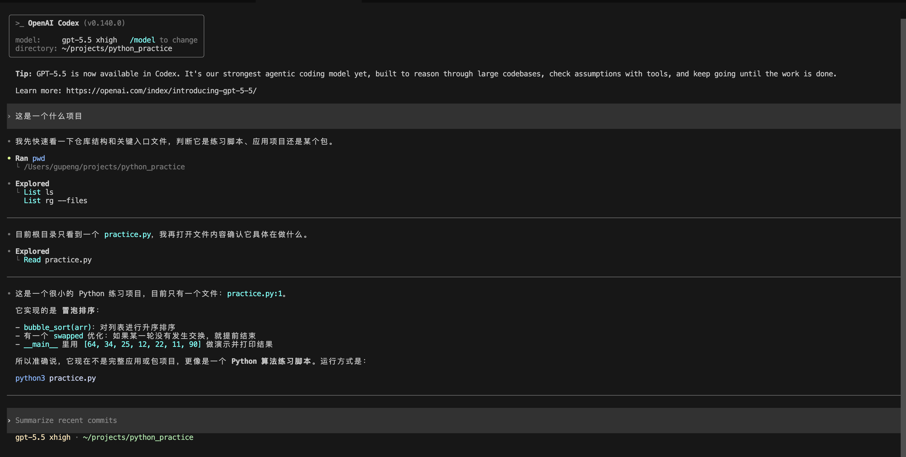
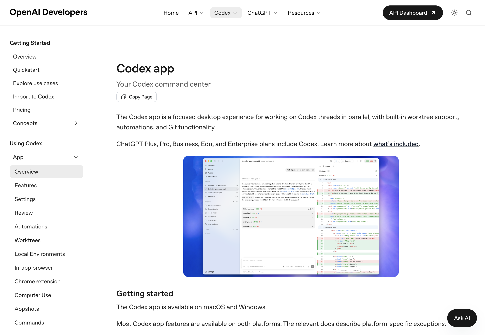
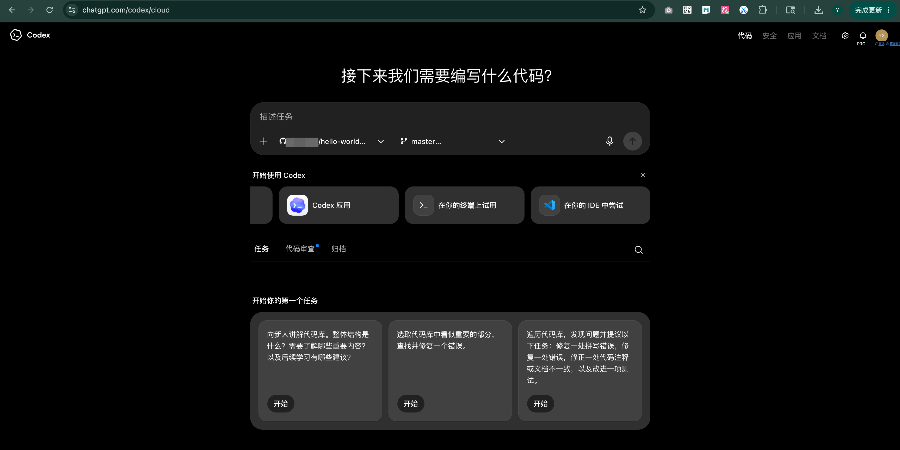
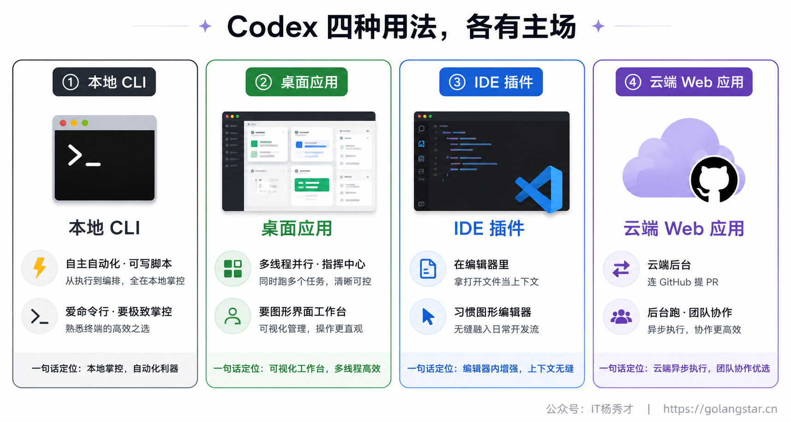
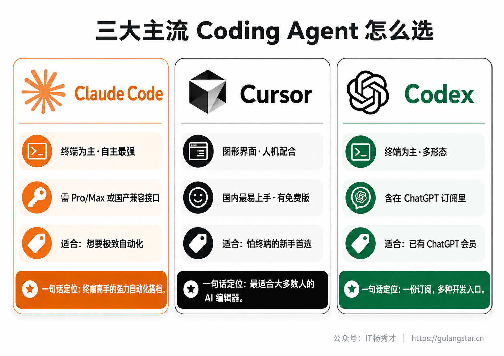

环境搭建篇的最后一块拼图，是三大主流 Coding Agent 里的第三位——**Codex**。它是 OpenAI（也就是 ChatGPT 那家公司）出品的编程智能体，路数和 Claude Code 很像：活在终端里，给它一个任务，它自己规划、自己写、自己跑、自己改，自主能力很强；同时它还提供编辑器插件、云端、GitHub 等多种用法。它背后用的是 OpenAI 专门为写代码优化过的 GPT 系列模型，实力属于第一梯队。

对中国用户来说，Codex 是三个工具里配置门槛相对最高的一个，因为它和 OpenAI 的账号、网络绑得比较紧。但它也有个独特的便利：如果你本来就是 ChatGPT 的付费用户，Codex 基本是订阅里"附赠"的能力，不用再额外掏钱。这一篇就带你把 Codex 装好、用 ChatGPT 账号登录、跑通第一次会话，并把国内使用要注意的几道坎讲清楚。装完这篇，三大主流工具你就集齐了。

## **1. 先认识一下 Codex**

和 Cursor 那种图形界面编辑器不同，Codex 最核心的形态和 Claude Code 一样，是**命令行工具（CLI）**——在终端里用 `codex` 命令唤起，然后用大白话给它派活。它是开源的、用 Rust 语言写的，主打一个快和省资源。

除了终端 CLI，Codex 还有好几种"分身"：可以下载安装、带图形界面的**桌面应用**、能嵌进 VS Code 等编辑器的 **IDE 插件**、打开浏览器就能用的**云端 Web 应用**、以及深度集成进 **GitHub** 的自动化能力。它们背后是同一个 Codex，适合不同场景。



在 Codex 的官方开发者文档里，这些用法被分门别类地列了出来，你能直观看到它的"全家桶"长什么样。



本系列主要带你上手**终端 CLI** 这个形态，因为它最能体现 Codex 自主干活的能力，也最贴合我们前面一直在讲的 Vibe Coding 节奏。但**桌面应用、云端 Web 应用、IDE 插件这几种"应用模式"同样重要**，尤其对怕终端的新手来说，桌面应用是个很友好的入口，本文第 6 节会专门带你认识。我们先从安装 CLI 开始。

## **2. 安装 Codex**

Codex 的安装方式有好几种，挑一种顺手的即可。

如果你上一篇装 Claude Code 时已经装了 Node.js，**用 npm 安装最直接**，在终端里执行：

```bash
npm install -g @openai/codex
```

> 这里有个**坑要避开**：包名是 `@openai/codex`，前面那个 `@openai/` 不能丢。npm 上还有一个不带前缀的 `codex` 包，那是个 2012 年的无关老项目，装错了可用不了。

如果你不想用 npm，也可以用**官方安装脚本**。macOS / Linux 用户在终端执行：

```bash
curl -fsSL https://chatgpt.com/codex/install.sh | sh
```

Windows 用户在 PowerShell 里执行：

```powershell
irm https://chatgpt.com/codex/install.ps1 | iex
```

macOS 上习惯用 Homebrew 的，也可以用 `brew install codex`。这几种方式效果一样，按你的习惯选一个就行。



装完之后，**重启终端**，敲下面这条命令验证是否装好：

```bash
codex --version
```

如果它回给你一个版本号，就说明装好了。



## **3. 用 ChatGPT 账号登录认证**

装好之后，和 Claude Code 一样，得登录认证才能用。Codex 推荐的方式是**用你的 ChatGPT 账号登录**。

这里要说清楚一个关键点，也是 Codex 最大的便利所在：**Codex 的使用额度，是包含在 ChatGPT 付费订阅里的**。也就是说，ChatGPT 的 Plus、Pro、Business、Edu、Enterprise 这些付费套餐，都自带了 Codex 的使用权限。如果你本来就订阅了 ChatGPT（比如每月 20 美元的 Plus），那 Codex 对你来说几乎是白送的，不用再额外付费——这对手里已经有 ChatGPT 的人来说相当划算。


认证方式很简单：在终端里敲 `codex` 启动它，第一次运行它会提示你登录，按提示选"用 ChatGPT 账号登录"，它会弹出浏览器让你授权，登录成功回到终端就行了。除了 ChatGPT 账号，Codex 也支持用 API Key（OpenAI 的接口密钥）来认证，这种方式按用量付费，更适合进阶用户，新手用 ChatGPT 账号登录最省心。



## **4. 国内用户要过的几道坎**

这一节得跟你说点实在的。Codex 深度绑定 OpenAI 的账号体系，而 OpenAI 的服务在中国大陆并不开放，所以国内用户使用 Codex，要过三道坎，比前两个工具都更麻烦些。

**第一道是网络**。访问 OpenAI 的服务、完成登录授权，都需要你具备稳定访问海外网络的条件，否则登录这一步就会卡住。**第二道是账号**。你需要一个 ChatGPT 账号，注册过程本身对国内用户就有一定门槛。**第三道是付费**。要让 Codex 真正好用，你需要 ChatGPT 的付费订阅，而付费环节通常需要支持外币的信用卡或其他海外支付方式。

这三道坎客观存在，我不打算粉饰。但也给你几条务实的建议。**如果你已经有 ChatGPT 的付费账号和稳定的网络环境**，那 Codex 几乎是顺手就能用上的强力工具，没理由不体验。**如果你目前还没有**，那我的建议是：环境搭建阶段不必死磕 Codex，完全可以先用上一篇讲的 Claude Code（配国产大模型的兼容接口，国内直连）或者 Cursor 把 Vibe Coding 玩起来，等以后条件成熟了再把 Codex 补上。三大工具的核心能力是相通的，先用能顺利跑起来的那个，比卡在某个工具的配置上死磕要明智得多。

> 顺便一提，Codex CLI 也支持通过 API Key 的方式认证，市面上有一些第三方提供 OpenAI 兼容接口的服务，理论上也能给 Codex 供能。但这类配置更折腾、稳定性参差，不适合新手，这里就不展开了——记住"先用能跑通的工具起步"这个原则即可。

## **5. 第一次会话体验**

如果你已经顺利登录，来感受一下 Codex 怎么干活。它的体验和 Claude Code 非常像。找一个项目文件夹，在终端里 `cd` 进去，敲 `codex` 启动，就能开始对话了。

先让它了解一下项目：

**Prompt：**
```
这个项目是做什么的？主要用了哪些技术？
```

Codex 会自己去读文件夹里的文件，然后给你总结。接着可以让它干点实事：

**Prompt：**
```
帮我在这个项目里加一个简单的功能：写一个能打印当前时间的小脚本
```

Codex 会规划步骤、写代码，并且在执行可能影响你文件或系统的操作之前，**会先征求你的同意**——这一点和 Claude Code 一样，是个重要的安全设计。它有不同的"审批模式"和"沙箱"机制来控制它能自主做到什么程度（这部分比较进阶，工具精通篇会专门讲），新手阶段保持默认、它问你就看一眼再点同意，就很稳妥。



## **6. 桌面应用、云端 Web 与 IDE 插件**

讲完了终端 CLI，得专门花一节说说 Codex 的几种"应用模式"——**桌面应用**、**云端 Web 应用**和 **IDE 插件**。它们不是 CLI 的附属品，而是各有各的主场，对不同习惯的人来说，吸引力一点不输 CLI。

### **6.1 桌面应用**

如果你像用 Cursor 那样，更喜欢一个能下载安装、点点点就能用的图形软件，Codex 也有一个官方的**桌面应用（Codex App）**。它在 macOS（苹果 M 系列芯片和 Intel 芯片都支持）和 Windows 上都能装，去 OpenAI 官网下载安装包，装好后同样用 ChatGPT 账号登录、选一个项目文件夹就能开干。



如上图，OpenAI 把这个桌面应用定位成"你的 Codex 指挥中心"，它的看家本领是**多线程并行**——你可以同时开好几个任务线程并排放着、随时切换，配合内置的 Git worktree（工作树）能力，让多个并发的代码改动互不干扰。除此之外它还集成了不少实用功能：能自动调度的**定时自动化**、方便看改动和提交的**代码审查工具**、内置终端、甚至还有能操作图形界面和浏览器的"computer use"能力。对那些既怕命令行、又想要比编辑器插件更专注的工作台的人来说，桌面应用是个很舒服的选择。

### **6.2 云端 Web 应用**

Codex 有一个完全不用在本地装任何东西的用法——**云端 Web 应用**。你打开 ChatGPT，在它的侧边栏里就能找到 Codex 的入口（网址是 `chatgpt.com/codex`），直接在浏览器里用。

它和本地 CLI 最大的区别在于"活在哪跑"。本地 CLI 是在你自己电脑上干活；而云端 Web 应用，是 Codex 在**它自己的云端环境（沙箱）里**帮你跑任务。这带来两个很实用的好处：一是**后台运行、还能并行**——你可以同时丢给它好几个任务，它在云上一起处理，你该干嘛干嘛，过会儿回来收结果；二是**和 GitHub 深度打通**——你先把自己的 GitHub 账号和仓库连上，之后 Codex 就能直接读你仓库里的代码、干完活儿还能自动帮你提一个 Pull Request（代码修改请求）。你甚至可以在 GitHub 的 issue 或 PR 里直接 `@codex` 一下，把任务派给它，它就在云端自己开干了。

对国内用户来说要提醒一句：云端 Web 应用同样依托 ChatGPT 账号和 OpenAI 的服务，所以前面讲的网络、账号那几道坎依然存在，它不是绕开门槛的捷径。但如果你条件具备，它是一个非常强大的用法——特别适合那种"任务比较独立、能交给 AI 自己在后台慢慢磨"的活儿。



### **6.3 IDE 插件**

如果你更习惯在图形界面的编辑器里写代码，Codex 还提供了 **IDE 插件**。它支持的编辑器很全：VS Code（以及基于它的 Cursor、Windsurf）、还有 JetBrains 全家桶（IntelliJ、PyCharm、WebStorm 等），三大操作系统都能用。

安装很简单：在你编辑器的扩展市场里搜 "Codex" 装上，然后用 ChatGPT 账号登录即可，额度同样走你的 ChatGPT 订阅。装好后，你不用切到终端，**直接在编辑器里就能给 Codex 派活**——它能拿你当前打开的文件、选中的代码当上下文，理解得更准；你还能切换不同的模型，以及选择它的"放手程度"（从只聊天给建议、到自主改代码、再到完全放开手脚）。更妙的是，编辑器里的活儿要是嫌大，还能一键转交给前面说的云端去跑。

简单说，这几种用法各有各的主场：**本地 CLI** 适合追求自主自动化、喜欢命令行的人；**桌面应用** 适合想要图形界面、多线程并行工作台的人；**IDE 插件** 适合习惯在编辑器里、想要可视化和实时上下文的人；**云端 Web 应用** 适合要后台并行处理、深度结合 GitHub 协作的场景。它们背后是同一个 Codex、同一个 ChatGPT 账号，你完全可以按手头的活儿灵活切换。



## **7. 常见问题排查**

几个新手容易撞上的问题，集中说一下。

敲 `codex` 提示 **`command not found`**，老规矩，多半是装完没重启终端，关掉重开再试；还不行就重启电脑。如果你是用 npm 装的，还要确认装的是 `@openai/codex` 这个带前缀的正确包。

**登录卡住、转圈、或提示无法连接**，基本都是网络问题。Codex 的登录需要稳定访问 OpenAI 服务的网络环境，这一步过不去，就先回到第 4 节说的思路，考虑用 Claude Code 或 Cursor 起步。

**提示账号没有 Codex 权限或额度**，确认你的 ChatGPT 是付费套餐（免费版可能不含或额度有限），并在 OpenAI 的相关页面确认你的套餐包含 Codex。

## **8. 三大工具集齐了，怎么用**

到这里，环境搭建篇就接近尾声了。Claude Code、Cursor、Codex 三大主流 Coding Agent 你已经全部装好，可以根据手感和场景灵活搭配着用。最后用一张图帮你把三者的特点和定位再捋一遍，方便你日后对号入座。



简单总结一下我的建议：**怕终端、想要最平缓的上手曲线**，从 Cursor 开始；**想体验最极致的"说句话、AI 全包"的自动化**，主攻 Claude Code（国内配兼容接口）；**手里已经有 ChatGPT 会员**，那 Codex 顺手就能用起来，别浪费。这三个不是单选题，很多人是混着用的——日常贴身改代码用 Cursor，大任务交给 Claude Code 或 Codex 自主跑。用熟一个之后，切换到另一个几乎没有学习成本，因为把需求讲清楚这个核心能力是通用的。

## **9. 小结**

随着 Codex 就位，你的 Vibe Coding 兵器库正式集齐了三员大将。回头看整个环境搭建篇，从认识终端、装好基础环境，到把 Claude Code、Cursor、Codex 一一配好，你已经从"什么都没有"走到了"随时能开干"。这中间最磨人的，往往不是技术本身，而是国内用户绕账号、绕网络、绕付费的那些琐碎门槛——能把这些坎一个个迈过去，你已经比很多停在"想试试但没装成"的人走得远多了。

工具齐备，地基夯实，接下来就是真正的重头戏了。从下一篇开始，我们要进入 Prompt 技巧篇，去打磨 Vibe Coding 最核心、最值钱的那项能力——把需求清清楚楚地讲给 AI 听。工具只是兵器，而怎么用好兵器，才是决定胜负的真功夫。

<div style="background-color: #f0f9eb; padding: 10px 15px; border-radius: 4px; border-left: 5px solid #67c23a; margin: 20px 0; color:rgb(64, 147, 255);">

<h2><span style="color: #006400;"><strong>关注秀才公众号：</strong></span><span style="color: red;"><strong>IT杨秀才</strong></span><span style="color: #006400;"><strong>，回复：</strong></span><span style="color: red;"><strong>面试</strong></span></h2>

<div style="text-align: center;"><span style="color: #006400; font-size: 28px;"><strong>领取后端/AI面试题库PDF</strong></span></div>


</div>
