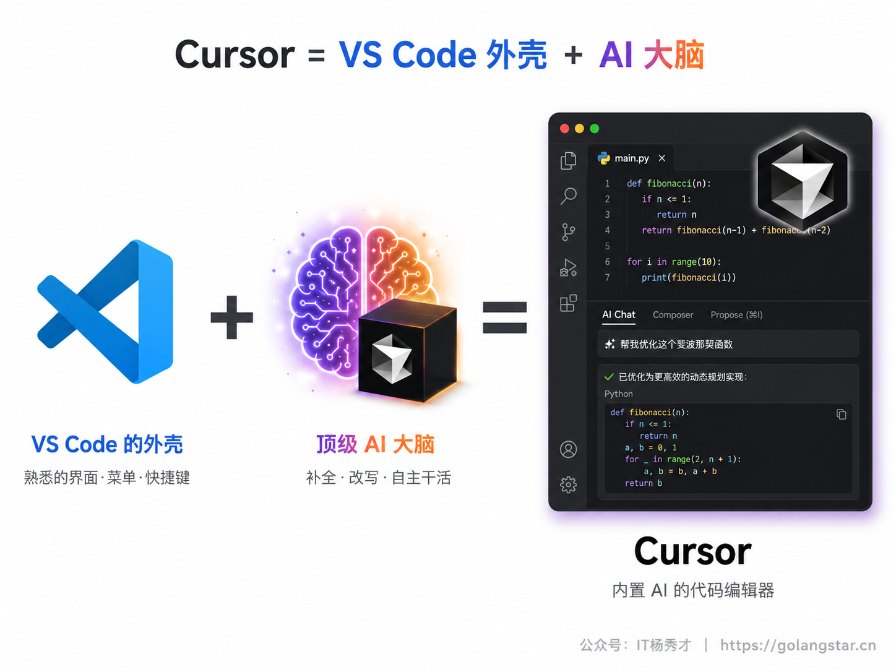
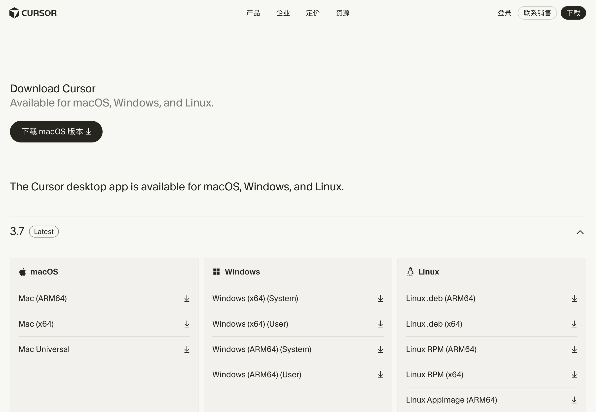
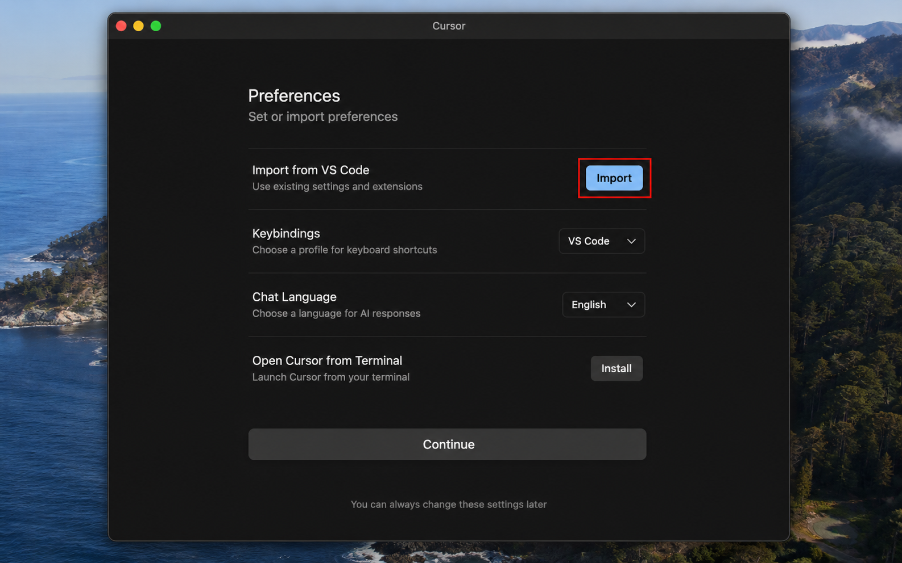
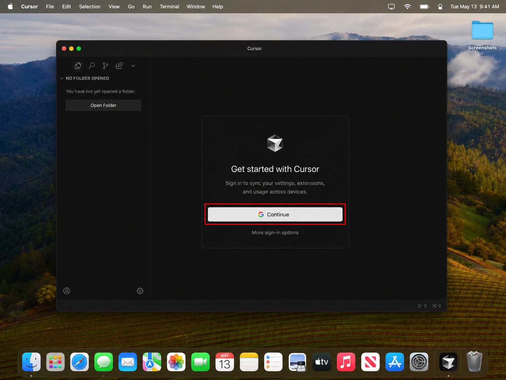
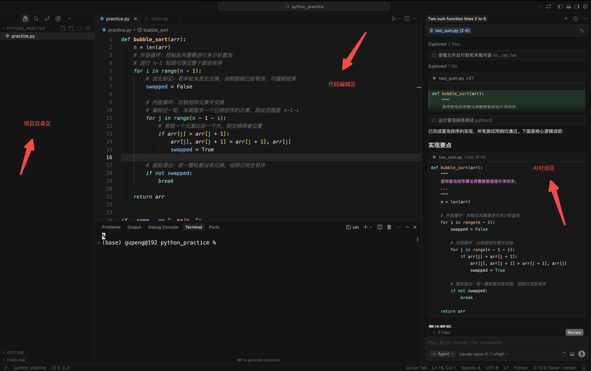
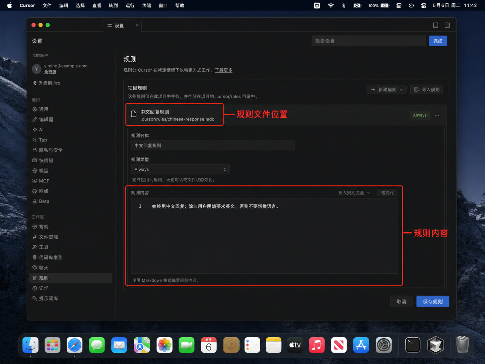

上一篇我们请出了 Claude Code，这一篇换一种风格的工具——**Cursor**。如果说 Claude Code 是活在终端里、放手让它自己干的"自主型选手"，那 Cursor 就是一个有菜单、有按钮、看得见摸得着的图形界面编辑器，特别适合对黑乎乎的命令行还有点发怵的新手。它本质上是一个"内置了顶级 AI 的代码编辑器"，你写代码的每一个动作旁边，AI 都随时待命。

Cursor 对新手最大的友好之处在于：它是在大家最常用的 VS Code 基础上改造而来的，长得几乎一模一样。所以你上一篇装好的 VS Code 使用习惯、甚至插件和配置，都能几乎无缝地搬过来。这一篇就带你把 Cursor 装好、把 VS Code 的设置一键迁移过来、登录配置好，再快速认识一下它的几种核心用法。装完这一篇，你的工具库里就有了"终端派"和"界面派"两员大将。

## **1. Cursor 是什么**

先用一句话讲清楚 Cursor 的定位：**它 = VS Code 的外壳 + 顶级 AI 的大脑**。

它把你熟悉的 VS Code 完整地保留了下来——文件列表、代码编辑区、菜单栏、快捷键，全都在原来的位置；然后在这副熟悉的躯壳里，深度植入了强大的 AI 能力。你写代码时它会智能补全，你选中一段代码可以让它解释或修改，你还能开一个对话框，让它像 Claude Code 那样自主跨多个文件完成一整个任务。换句话说，你既能享受 AI 的强大，又随时能自己插手——这种"人机配合"的平衡感，正是 Cursor 最受欢迎的原因。

## **2. 下载与安装**

先看系统要求：Cursor 支持 macOS 12 及以上、Windows 10（1903 版本）及以上的 64 位系统，以及主流 Linux 发行版，苹果的 M 系列芯片也有专门的版本。这几年的电脑基本都满足。

打开浏览器访问官网 **cursor.com**，点击页面上的下载按钮，进入下载页面。Cursor 是国内可以正常访问的，官网还有中文界面，对我们很友好。

如上图，下载页面会列出 macOS、Windows、Linux 三个系统的下载选项，认准你自己的系统下载：

- **macOS 用户**：根据你的芯片选择——苹果 M 系列芯片选 ARM64 版，老一点的 Intel 芯片选 x64 版，拿不准就选 Universal（通用）版，它两种芯片都能跑。下载得到一个 `.dmg` 安装包，双击打开，把 Cursor 图标拖进"应用程序"文件夹即可，和装普通 Mac 软件一样。
- **Windows 用户**：通常选"Windows (x64) User"用户版即可（不需要管理员权限）。下载得到一个 `.exe` 安装程序，双击一路"下一步"装好。

安装本身没什么难度，跟装任何一个普通软件一样。装好后打开 Cursor，真正有意思的"第一次配置"才开始。

## **3. 首次启动**

第一次打开 Cursor，它会用一个引导流程帮你完成初始设置，这里有一个对老 VS Code 用户极其贴心的功能——**一键导入 VS Code 的设置**。

如果你电脑上已经装过并用过 VS Code（比如上一篇我们刚装的），Cursor 在首次启动时会提示你，可以把 VS Code 的扩展插件、主题、快捷键、各项配置统统一键搬过来。你只要点一下"导入"，几秒钟之后，Cursor 就长成了你熟悉的 VS Code 的样子，连你装的中文语言包都会一起搬过来，省去了重新配置的麻烦。这也是为什么我建议你先装 VS Code 再装 Cursor——前面的功夫不会白费。

紧接着，引导流程会让你**登录账号**。Cursor 需要一个账号才能使用 AI 功能，你可以用 Google 账号、GitHub 账号或邮箱注册登录，按提示在浏览器里完成即可。Cursor 提供免费版（有一定的 AI 使用额度，够新手上手体验）和大约每月 20 美元的 Pro 版，新手先用免费版把功能摸熟完全够用。

登录之后，你还会看到模型选择的相关设置。Cursor 背后接了多种顶级大模型（包括 Claude、GPT 系列，以及它自家训练的快速模型），在 AI 对话框旁边有个下拉菜单可以切换。新手阶段不用纠结，用默认的就很好，等以后用熟了，再根据任务复杂度去挑模型（这部分工具精通篇会专门讲）。

## **4. 认识一下 Cursor 的界面**

设置完成，正式进入 Cursor 的主界面。因为它就是 VS Code 的样子，用过 VS Code 的话会非常眼熟。大致认一下几个关键区域，心里有数就行。

**最左侧**是活动栏和文件资源管理器，点开能看到你当前打开的项目文件夹里的所有文件，跟 VS Code 一模一样。**中间最大的区域**是代码编辑区，你写代码、看代码都在这里。**最关键的、也是 Cursor 区别于 VS Code 的地方，在右侧**——那里有一个 AI 对话面板（通常叫 Chat 或 Agent 面板），这是你跟 AI 交流、派活的主战场。**底部和顶部**则是状态栏和菜单，跟普通编辑器无异。

跟 Claude Code 一样，你用 Cursor 时也是先用它"打开一个文件夹"——这个文件夹就是你的项目，AI 会基于这个文件夹里的内容来理解和干活。

## **5. 四种模式与 Tab 补全初体验**

Cursor 的 AI 能力，主要通过几种不同的"模式"来使用。新手现在不需要把它们用得多溜，先认个脸、知道大概各管什么就行，工具精通篇会带你把它们一个个用透。

**Ask（问）模式**最简单，就是"只问不改"：你选中一段代码或者直接提问，让 AI 解释、给建议，它不会动你的代码，适合学习和咨询。**Agent（智能体）模式**是 Cursor 最强大的用法，用快捷键 `Cmd/Ctrl + I` 调出，它能像 Claude Code 那样自主理解需求、跨多个文件改代码、完成一整个任务，是你用 Cursor 干大活的主力。**Plan（规划）模式**则更稳妥：面对复杂任务，它会先研究你的代码、生成一份详细的实施计划让你过目，你确认没问题了它再动手写，避免一上来就跑偏。**Edit 模式**（按 `Cmd/Ctrl + K`）用来就地修改：把光标放在某处或选中一段代码，按下快捷键，用一句话告诉它怎么改，它就在原地帮你改好。

这几种模式之间，可以用 `Shift + Tab` 快速切换，不用记太死，用的时候按一下就能轮换。

除了这些模式，还有一个你天天都会用到的功能——**Tab 智能补全**。当你在编辑器里写代码时，Cursor 会预测你接下来想写什么，用灰色的文字提示出来，你觉得对，按一下 `Tab` 键就接受了。它不只是补全一行，有时还能智能地补好几行、甚至预测你下一步想跳到哪里改。这个功能润物细无声，用顺了会上瘾。

新手建议这样上手：先靠 **Tab 补全** 和 **Ask 模式** 找找感觉，等熟悉了再用 **Agent 模式** 让它干大活，遇到复杂任务时记得先用 **Plan 模式** 让它出个方案。

## **6. Rules 规则配置入门**

最后介绍一个能让 Cursor 更懂你的小配置——**Rules（规则）**。

你可以把 Rules 理解成给 AI 立的"项目规矩"。比如你希望 AI 在这个项目里始终用中文回复、代码注释也写中文、遵循某种代码风格、或者优先用某个技术框架，把这些要求写成规则，AI 在这个项目里干活时就会一直记着、自动遵守，不用你每次都重复交代。这跟上一篇提到的 Claude Code 的 `CLAUDE.md` 是一个思路，都是给 AI 一份"项目说明书"。

在 Cursor 里，项目级的规则放在项目根目录下的 `.cursor/rules/` 文件夹里，每条规则是一个 `.mdc` 文件。新手不用一上来就配复杂规则，等你用熟了、发现自己总在重复交代某些要求时，再把它们沉淀成规则文件即可。这部分工具精通篇会有一篇专门细讲，这里你先知道有这么个东西、它能让 AI 更听话就行。

## **7. 国内可用性与常见问题**

关于国内使用，Cursor 比 Claude Code、Codex 这类工具要省心一些：官网国内能正常访问、有中文界面，软件本身也能正常下载安装使用。免费版的额度足够新手把功能体验透。如果你想升级 Pro 版，付费环节可能需要支持外币的信用卡，这一点和大多数海外工具一样，可以视情况准备。整体而言，Cursor 是国内新手相对最容易顺利上手的一款主流 Coding Agent。

再说几个新手常见的小问题。**导入 VS Code 设置后插件没生效**，多半重启一下 Cursor 就好。**AI 对话提示额度用完**，免费版有使用限制，等额度刷新，或者考虑升级 Pro。**找不到 AI 面板**，看看右上角有没有开启对话面板的图标，或者用快捷键 `Cmd/Ctrl + I` 直接调出 Agent。**中文界面没生效**，去扩展面板确认中文语言包装好了、并按提示重启。这些问题都很小，稍微试一下就过去了。

最后给你一条新手友好的推荐工作流，把这一篇学的东西串起来：面对一个稍微复杂点的任务，先用 **Plan 模式**让 AI 出方案、你过目确认，再切到 **Agent 模式**让它放手去实现，期间小的局部调整用 **Cmd+K** 就地改，日常写代码则靠 **Tab 补全**提速。这套"先规划、再执行、随手改"的节奏，会让你和 Cursor 配合得相当顺手。

## **8. 小结**

装好 Cursor，你就给自己的工具库添了一员风格迥异的大将。如果说 Claude Code 是那种你下了指令就可以去喝杯咖啡、回来收货的"全自动选手"，那 Cursor 更像一个并肩作战的搭档——它把 AI 的强大揉进了你写代码的每一个动作里，又始终把方向盘留在你手边，让你随时能停下来自己改两笔。对从图形界面一路用过来、对终端还有点陌生的新手来说，它往往是上手门槛最低的那一个。

两员大将到手，你已经能应付绝大多数 Vibe Coding 场景了。下一篇我们会把第三位主角 Codex 也收入麾下，让你的兵器库彻底齐整。不过在那之前，不妨先打开 Cursor，新建一个文件夹，用 Tab 补全和 Agent 模式随便折腾点东西——亲手感受一下这种"AI 贴身陪写"的手感，你大概率会喜欢上它。

<h2><strong>关注秀才公众号：</strong><strong>IT杨秀才</strong><strong>，回复：</strong><strong>面试</strong></h2>

<strong>领取后端/AI面试题库PDF</strong>

