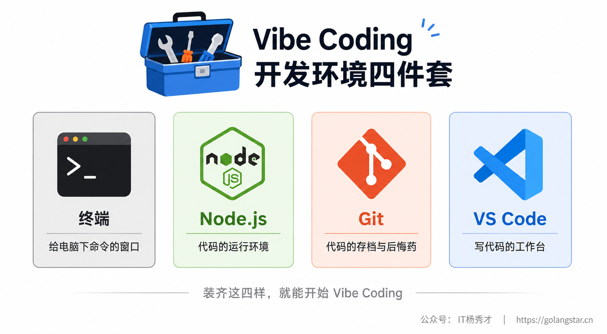
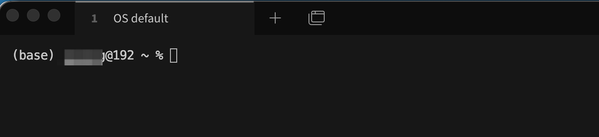
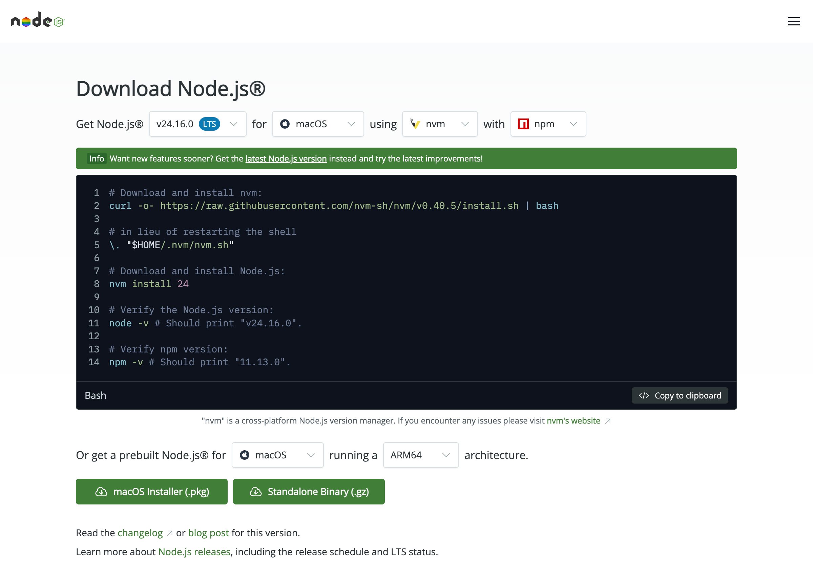
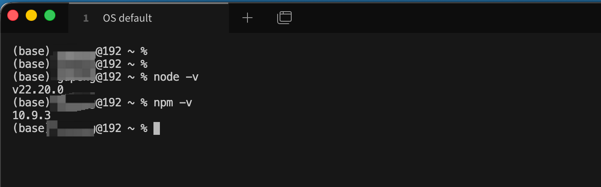
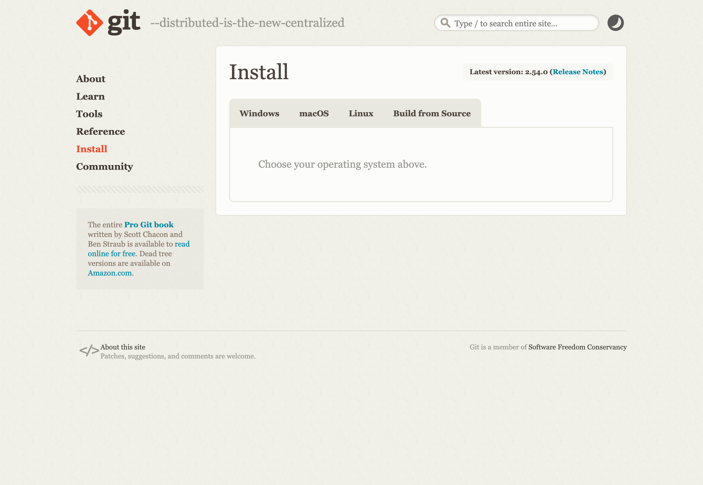
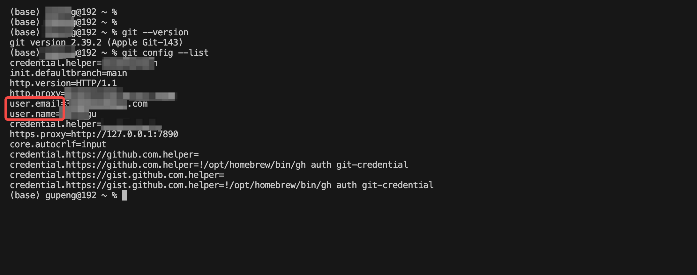
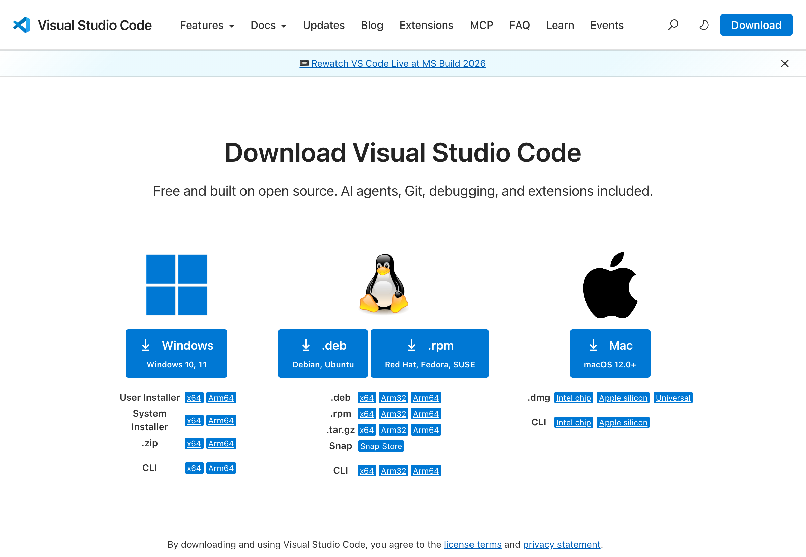
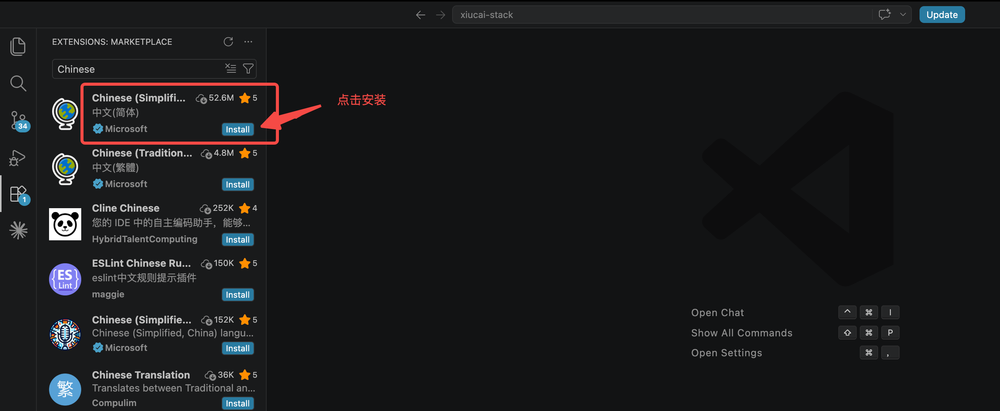
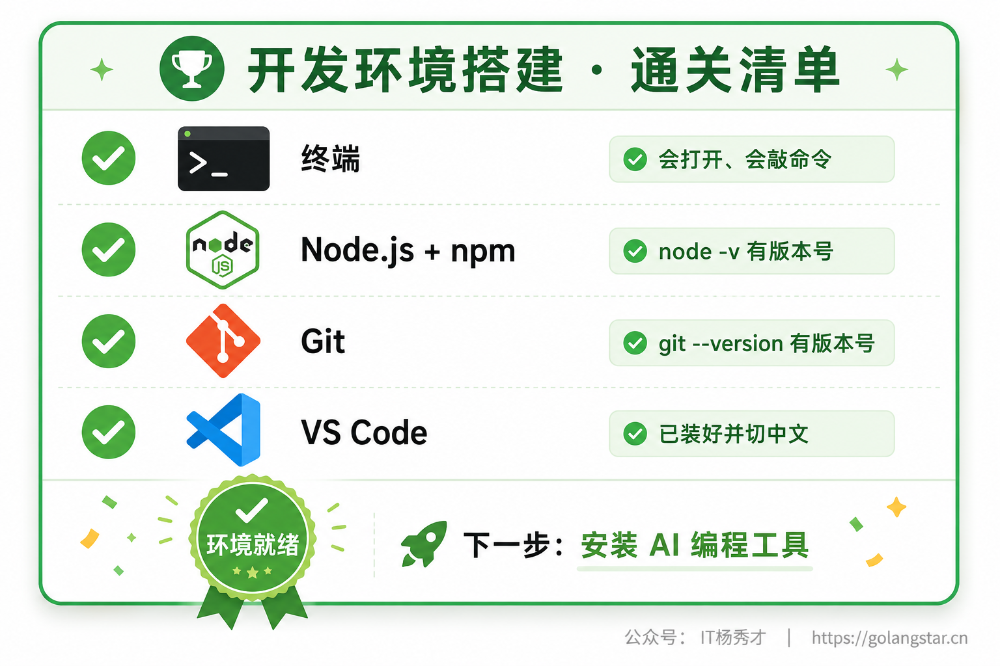

要玩 Vibe Coding，光有热情还不够，得先把"工地"平整好——也就是在你的电脑上把几样基础工具装齐。这一步对从没碰过开发的人来说，往往是整个学习过程里最劝退的一关：满屏幕的英文、黑乎乎的命令行窗口、看不懂的版本号，还没开始写第一句 Prompt，信心就先垮了一半。

别慌，这一篇就是来陪你过这一关的。我会假设你完全没有任何编程基础，从"终端是什么"这种最基础的问题讲起，一步一步带你把开发环境搭好。macOS 和 Windows 两个系统的操作我都会分开讲，你照着自己的系统做就行。这一关看着唬人，其实就是"下载、双击、下一步"那点事，跟着做，半小时就能全部搞定。装好之后，你的电脑就正式具备了跑 Claude Code、Cursor、Codex 这些工具的能力，后面的旅程才能真正开始。

## **1. 先搞清楚要装哪几样东西**

动手之前，先花一分钟看清全貌，知道自己要装什么、每样东西是干嘛的，心里有数，做起来才不慌。Vibe Coding 的基础环境，核心就四样东西：**终端、Node.js、Git、VS Code**。



简单交代一下这四样各自是什么角色。**终端**，就是那个黑底白字、只能打字的窗口，它是你给电脑直接下达命令的地方——后面装东西、跑工具，很多操作都在这里完成，所以得先跟它混个脸熟。**Node.js** 你可以理解成"代码的运行环境"，很多 AI 编程工具（包括 Claude Code）本身就是用它来运行的，还有大量项目也依赖它，所以它是绕不开的地基。**Git** 是代码的"存档系统"和"后悔药"，它能帮你记录每一次改动、随时退回到之前的版本——这一点对 Vibe Coding 尤其重要，因为 AI 偶尔会把代码越改越糟，有了 Git 你就不怕。**VS Code** 则是程序员最常用的代码编辑器，相当于你写代码、看代码的"工作台"，界面友好、还能装各种插件，Cursor 本身就是基于它改造的。

这四样里，终端是系统自带的、不用装，剩下三样需要你动手安装。下面就按"终端 → Node.js → Git → VS Code"的顺序，一样一样来。

## **2. 先和终端混个脸熟**

很多新手一看到终端那个黑窗口就头皮发麻，觉得"这是高手才用的东西"。其实完全不用怕，终端只是一个**让你用打字的方式给电脑下命令**的工具。平时你用鼠标点图标打开软件，而在终端里，你是敲一行字、按回车，让电脑去干活。就这么简单。

你现在不需要会用它，只要知道它在哪、怎么打开就行。

在 **macOS** 上，终端这个软件叫"终端"（Terminal）。打开方式最快的是：按下键盘上的 `Command（⌘）+ 空格` 调出聚焦搜索，输入"终端"两个字，回车，黑窗口（有的是白窗口）就出来了。你也可以在"访达 → 应用程序 → 实用工具"里找到它。

在 **Windows** 上，推荐用系统自带的"Windows 终端"（Windows Terminal），Win11 一般已经预装好了。在屏幕左下角的搜索框里输入"终端"或"Terminal"，点开就行；或者在开始菜单上点右键，菜单里也能找到"终端"。如果你的电脑比较老找不到，用"命令提示符"（CMD）或"PowerShell"也可以，效果差不多。



打开之后，你会看到一个窗口，里面有一行字符，末尾有个一闪一闪的光标，那就是在等你输入命令。你可以先随手试一条无害的命令找找感觉：输入 `echo hello` 然后按回车，它会原样回你一个 `hello`。看，终端也没那么可怕，它只是个听话的复读机加跑腿小弟。后面安装工具、验证是否装好，我们都会回到这个窗口来敲几行命令，到时候你照着抄就行。

## **3. 安装 Node.js**

第一个要正式安装的是 Node.js。前面说了，它是很多 AI 编程工具和项目的运行底座，必须先装好。

打开浏览器，访问官网 **nodejs.org**，进入下载页面。官网会自动识别你的操作系统，页面上很醒目地给出推荐版本。这里有个小知识：Node.js 的版本分两种，一种标着 **LTS**（Long Term Support，长期支持版），一种是最新尝鲜版。**新手一律选 LTS 版**，它最稳定、坑最少。截至本文写作时，LTS 版本是 24 系列。



如上图，下载页面其实是个"配置器"：你可以选系统（macOS / Windows / Linux）、选安装方式。对新手来说，最省心的路子是**直接下载安装包**：

- **Windows 用户**：在页面上把架构等选项保持默认，点下载，会得到一个 `.msi` 安装包。双击打开，全程"下一步、下一步、同意协议、安装"，保持默认选项即可，不用改任何东西。
- **macOS 用户**：点页面下方的"macOS Installer (.pkg)"按钮，下载一个 `.pkg` 安装包，双击打开，同样一路"继续、同意、安装"到底。

页面上你可能还会看到一种用命令行配合 `nvm`（一个 Node.js 版本管理工具）来安装的方式，那是给进阶用户准备的，能灵活切换多个 Node 版本。新手别被它绕进去，**直接下安装包是最稳妥的**，等以后有需要再研究 nvm 不迟。

装完之后，怎么确认装好了没有？回到上一节认识的终端，敲下面两行命令验证（一行一行来，每行敲完按回车）：

```bash
node -v
npm -v
```

如果终端分别回给你两个版本号，比如 `v24.16.0` 和 `11.x.x`，那就说明 Node.js（以及随它一起装好的包管理工具 npm）已经成功安装了。`npm` 是 Node 自带的，不用你单独装。



要是敲完命令终端报错，提示类似 `command not found` 或"不是内部或外部命令"，最常见的原因是安装后没有重启终端。把终端窗口关掉重新打开，再敲一遍试试，多数情况就好了。如果还不行，重启一下电脑，让系统重新加载环境配置，基本能解决。

## **4. 安装并配置 Git**

第二个要装的是 Git。它是 Vibe Coding 路上你最好的安全带——每次 AI 帮你改完代码，你都可以用它存个档；万一 AI 把代码越改越乱，你随时能一键退回到上一个好版本。这个能力后面工程实践篇会专门讲怎么用，这一篇我们先把它装好、配好。

访问官网 **git-scm.com**，进入下载/安装页面，根据你的系统选择对应的安装方式。



**Windows 用户**：在页面上点进 Windows，下载安装包。Git 的 Windows 安装程序步骤稍微多一点，会问你一堆配置选项，但**新手全部保持默认、一路下一步就好**，这些默认值都是经过精心挑选的，不用纠结。装好后，它会附带一个叫"Git Bash"的小终端，也很好用。

**macOS 用户**：macOS 其实经常自带了 Git。你可以先在终端里敲 `git --version`，如果它回给你一个版本号，说明系统已经有了，可以跳过安装。如果提示要安装命令行工具，按提示点"安装"即可；或者如果你装了 Homebrew（macOS 上常用的软件包管理器），用一条 `brew install git` 也能装上最新版。

装好之后，有一步**必做的基础配置**：告诉 Git 你是谁。因为 Git 在记录每一次改动时，要标记是谁改的。在终端里敲下面两行命令，把引号里的内容换成你自己的名字和邮箱（用英文名和常用邮箱就行，随便填也不影响使用）：

```bash
git config --global user.name "你的名字"
git config --global user.email "你的邮箱@example.com"
```

配置完想确认一下有没有生效，可以敲：

```bash
git config --list
```

终端会列出当前的配置，你能在里面看到刚才填的 `user.name` 和 `user.email`，就说明配好了。



这一步就完成了。你现在不用理解 Git 还能干嘛，只要知道它已经装好、配好，随时待命就行。

## **5. 安装并配置 VS Code**

最后一个要装的是 VS Code，全名 Visual Studio Code，是微软出的免费代码编辑器，也是全球程序员用得最多的写代码工具。它就是你后面查看代码、管理项目文件的"工作台"。装它的另一个好处是：等你以后想用 Cursor，会发现 Cursor 跟它几乎长得一模一样（Cursor 就是基于 VS Code 改的），到时候你会无缝上手。

访问官网 **code.visualstudio.com**，点击下载。



如上图，下载页面给出了 Windows、Linux、macOS 三个系统的下载入口，认准自己的系统下载：

- **Windows 用户**：下载后会得到一个 `.exe` 安装程序（推荐选"User Installer"用户版，不需要管理员权限）。双击安装，过程中有一步会问你要不要勾选一些选项，建议把"添加到 PATH"和"添加右键菜单'通过 Code 打开'"这类选项都勾上，以后用起来方便。
- **macOS 用户**：下载后得到一个压缩包，解压会出现一个 VS Code 应用图标，把它**拖进"应用程序"文件夹**就算装好了，跟装其他 Mac 软件一样。

第一次打开 VS Code，界面是全英文的，对小白不太友好。第一件事就是把它**改成中文**：

打开 VS Code 后，按快捷键 `Ctrl + Shift + X`（macOS 是 `Cmd + Shift + X`）打开左侧的扩展（Extensions）面板，在搜索框里输入 `Chinese`，找到那个名叫"Chinese (Simplified) (简体中文) Language Pack"、由 Microsoft 官方出品的插件，点"Install"安装。装完它通常会在右下角弹出一个提示，问你要不要重启以应用语言，点重启，再打开就是熟悉的中文界面了。



切成中文之后，VS Code 就基本可以用了。新手阶段不用急着装一堆插件、改一堆设置，保持简洁就好，后面用到什么再装什么。你现在只要会一个最基础的操作：用 VS Code"打开一个文件夹"——以后 AI 帮你生成的项目，都是一个个文件夹，用 VS Code 打开它，你就能看到里面所有的代码文件了。

## **6. 验收：四件套是否都就位**

四样东西都装完了，最后做一次总验收，确认它们都正常工作。打开终端，把下面几条命令依次敲一遍，看是不是都能正常吐出版本号：

```bash
node -v
npm -v
git --version
```

如果这几条命令都各自回给你一个版本号，没有报错，那么恭喜你——Node.js、npm、Git 全都就位了。再加上你已经装好并切成中文的 VS Code，Vibe Coding 的开发环境就算搭建完成了。



万一某条命令报错，别灰心，回到对应那一节按"重启终端 → 重启电脑 → 重新安装"的顺序排查一遍，绝大多数问题都能解决。环境搭建这种事，最容易卡在一些琐碎的小毛病上，但它们几乎都有现成的解法，多搜一下、多试一次就过去了。

## **7. 小结**

环境搭建是 Vibe Coding 旅程里的第一道坎，也是劝退率最高的一道坎。但你只要静下心来，照着步骤一样一样地装，会发现它远没有想象中可怕——无非就是认识一个黑窗口，再装三个软件，配两行信息。这道坎跟后面真正有趣的"指挥 AI 写代码"比起来，只是开场前的热身。

更重要的是，今天你把这套环境搭好了，它就会一直待在你电脑里，为后面所有的学习和创作打底。从下一篇开始，我们就要往这套环境里装真正的主角了——Claude Code、Cursor、Codex 这些 Coding Agent。地基已经夯实，是时候请正主登场了。

<div style="background-color: #f0f9eb; padding: 10px 15px; border-radius: 4px; border-left: 5px solid #67c23a; margin: 20px 0; color:rgb(64, 147, 255);">

<h1><span style="color: #006400;"><strong>关注秀才公众号：</strong></span><span style="color: red;"><strong>IT杨秀才</strong></span><span style="color: #006400;"><strong>，领取精品学习资料</strong></span></h1>

<div style="color: #333; font-family: 'Microsoft YaHei', Arial, sans-serif; font-size: 14px;">
<ul>
<li><strong><span style="color: #006400;">公众号后台回复：</span><span style="color: red;">Go面试</span><span style="color: #006400;">，领取Go面试题库PDF</span></strong></li>
<li><strong><span style="color: #006400;">公众号后台回复：</span><span style="color: red;">Go学习</span><span style="color: #006400;">，领取Go必看书籍</span></strong></li>
<li><strong><span style="color: #006400;">公众号后台回复：</span><span style="color: red;">大模型</span><span style="color: #006400;">，领取大模型学习资料</span></strong></li>
<li><strong><span style="color: #006400;">公众号后台回复：</span><span style="color: red;">111</span><span style="color: #006400;">，领取架构学习资料</span></strong></li>
<li><strong><span style="color: #006400;">公众号后台回复：</span><span style="color: red;">26届秋招</span><span style="color: #006400;">，领取26届秋招企业汇总表</span></strong></li>
</ul>
</div>


</div>
