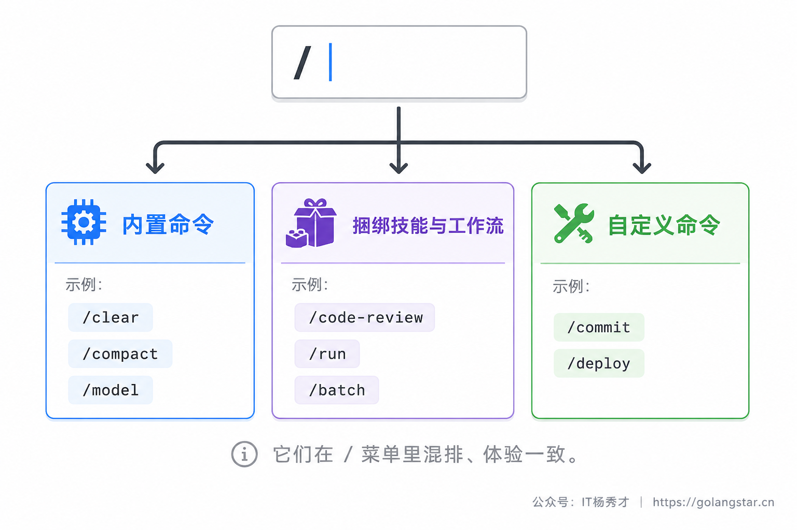
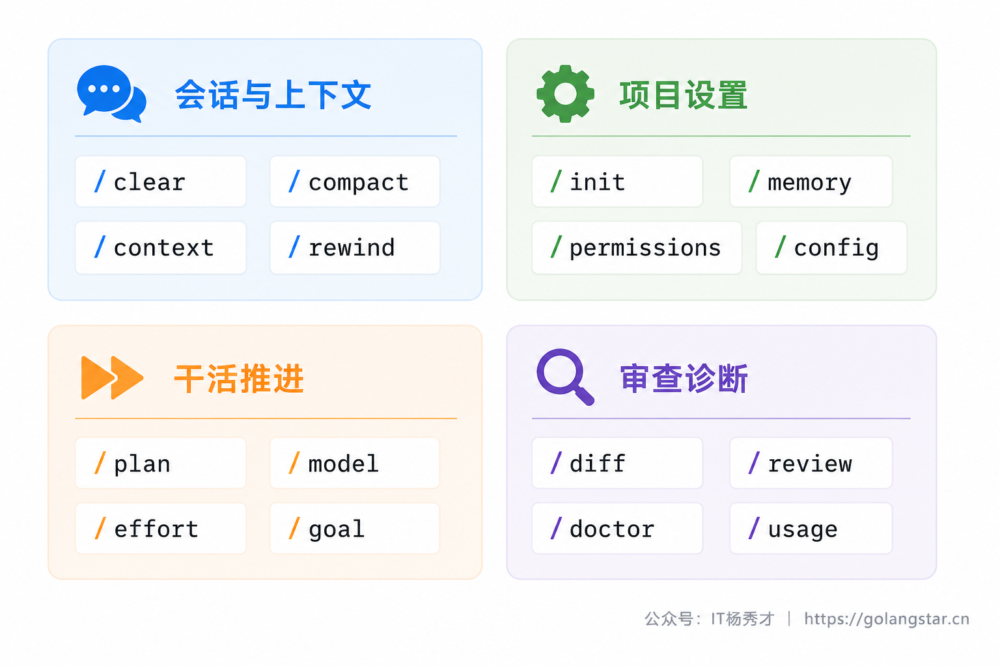
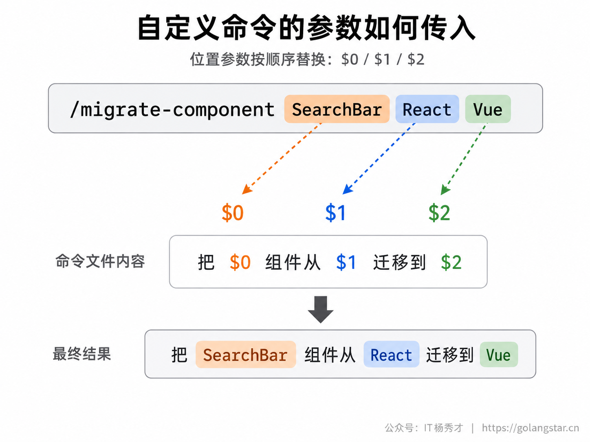
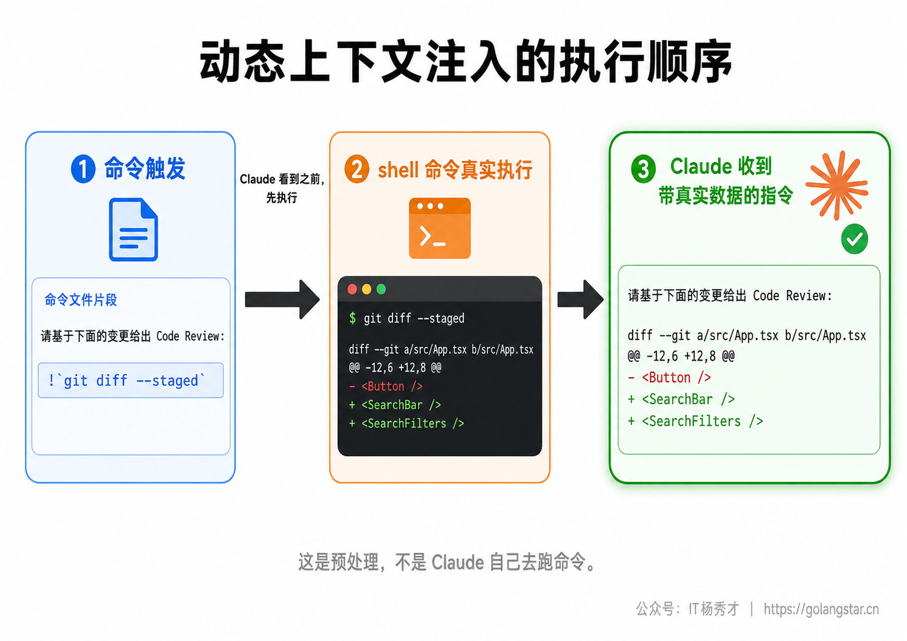
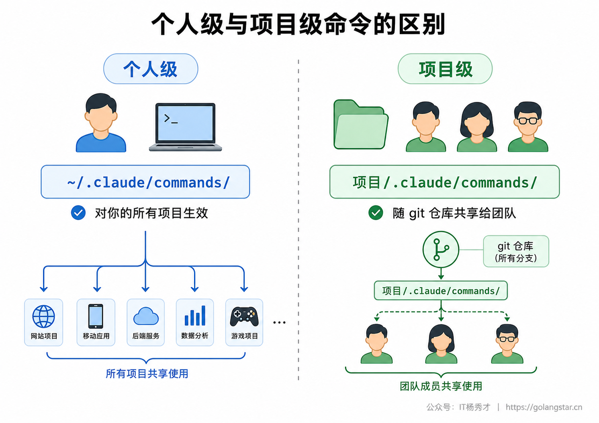
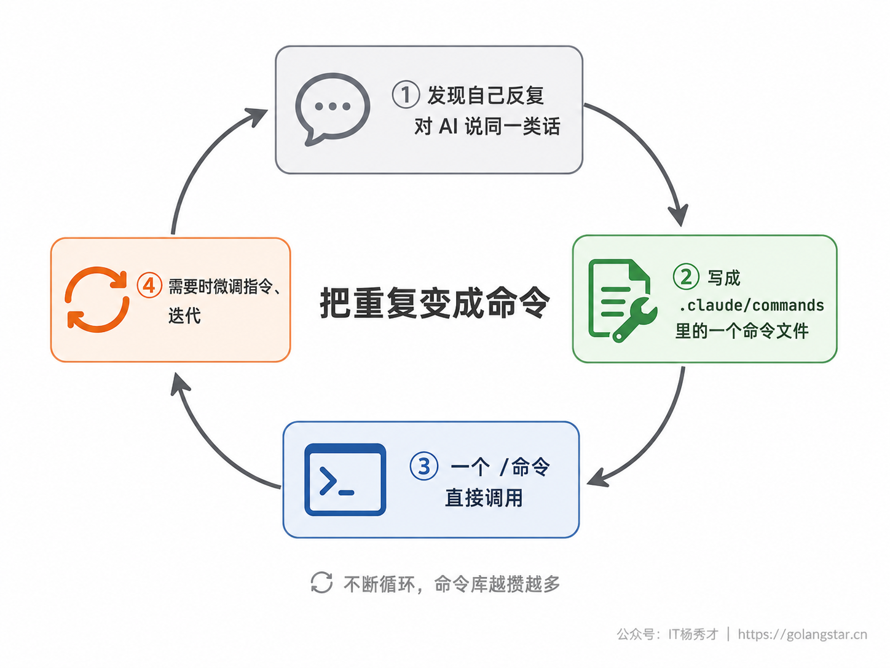

用 Claude Code 干活，很多操作其实不必打一长串字去描述：清空上下文、切换模型、看看这一轮改了什么、压缩太长的对话、生成一条提交信息……一个斜杠命令就够了。斜杠命令是 Claude Code 的快捷操作入口，输入框开头敲一个 `/`，几十个能直接调用的功能就列在眼前。

会用命令和不会用，效率差一大截。不会用的人，每次都靠大白话跟 AI 反复交代；会用的人，常用操作一个命令解决，还能把自己高频的工作流封装成专属命令、团队之间共享。这一篇把斜杠命令彻底讲透：内置命令怎么用、有哪些非记不可的，以及怎么打造属于你自己的命令。

## **1. 斜杠命令是什么**

斜杠命令就是在输入框**开头**敲 `/` 触发的快捷指令。有两个规则要先记住：一是命令只在消息开头才被识别，你在句子中间打 `/` 不会触发；二是命令名后面跟的文字会作为参数传给它，比如 `/model sonnet` 里的 `sonnet` 就是参数。

更重要的是认清，你在 `/` 菜单里看到的并不是一种东西，而是三类来源不同的命令。理解这个分类，后面的内容才不会乱。



内置命令是 Claude Code 自带、行为写死在程序里的，比如 `/clear`、`/compact`、`/model`。捆绑技能与工作流是官方预置的一批技能形态的命令，比如 `/code-review`、`/run`，它们本质是交给 Claude 执行的一段指令，所以既能你手动调用、也能 Claude 在合适时自动触发。自定义命令是你自己创建的，把高频的指令或流程封装成 `/你的命令名`。三类在 `/` 菜单里混排显示，用起来体验一致，但来源和能力不同。

要提前说清命令的定位：它不是用来取代你和 AI 的正常对话的。一次性的、具体的需求，直接用大白话说最灵活；反复出现的、有固定结构的操作，才值得固化成命令。一个简单的信号——当你发现自己第三次对 AI 说几乎一样的话时，就该考虑把它做成命令了。而像清空上下文、切换模型这类对 Claude Code 本身的操作，用内置命令永远比打字描述快，这部分没什么好犹豫的。

## **2. 怎么找到所有命令**

命令几十个，没人能全记住，也不需要。两个办法随时查。

最直接的是在输入框开头敲 `/`，会立刻弹出所有可用命令的列表，继续输入字母就实时过滤，比如敲 `/co` 就只剩 `/compact`、`/context`、`/config`、`/copy` 这几个。看到想要的，方向键选中回车即可。命令名也支持 `Tab` 补全；如果一个命令需要参数，菜单里还会用浅色文字提示该传什么——这正是后面讲自定义命令时 `argument-hint` 的作用。另一个办法是 `/help`，它会列出可用命令和简要说明，适合你想系统看一遍时用。


有一点要提前说明：不是每个命令对每个人都可见。命令列表会因你的平台、订阅套餐、运行环境而不同——比如 `/desktop` 只在 macOS/Windows 且登录订阅账号时出现，`/upgrade` 只在 Pro/Max 套餐显示，云端、企业版相关的命令也只在对应环境出现。所以你的菜单和别人的不完全一样是正常的。

## **3. 必会的内置命令**

内置命令有几十个，日常真正高频的就十来个。下面按使用场景分组，先给速查表，再把最该用熟的几个细讲。

### **3.1 会话与上下文管理**

这一组管的是对话和上下文，是新手最该先掌握的，因为它们直接决定 AI 会不会越聊越糊涂。

| 命令 | 作用 |
|------|------|
| `/clear` | 清空上下文、开一个新对话（旧对话仍可在 `/resume` 找回）。别名 `/new`、`/reset` |
| `/compact` | 把当前长对话压缩成摘要、腾出上下文，可附一句压缩侧重 |
| `/context` | 把上下文占用可视化成一张彩色网格，提示哪些工具/记忆占得多 |
| `/rewind` | 把代码和（或）对话回退到之前某个检查点。别名 `/undo`、`/checkpoint` |
| `/resume` | 按 ID 或名字恢复某次历史会话，或打开会话选择器 |
| `/branch` | 从当前这一点分叉出一个对话副本，去试另一个方向而不丢失现有进度 |
| `/btw` | 问一个不想写进对话历史、不污染上下文的临时小问题 |

最该养成习惯的是 `/clear`：每开始一件和之前无关的新任务，先敲它。很多人抱怨 AI 越聊越笨，根源就是在一个对话里堆了太多不相干的内容，把上下文塞乱了。`/clear` 把上下文清空重来，成本为零、收益极大，而且旧对话不会丢，随时能 `/resume` 找回；想之后好认，还能 `/clear 重构登录` 这样给刚结束的对话起个名。

任务确实需要长时间连续推进、聊到上下文快满时，用 `/compact` 而不是 `/clear`——它把前面的内容压缩成摘要、保留关键信息，让你接着干而不丢上下文。还能附一句压缩侧重，比如 `/compact 重点保留数据库设计的讨论`，让它别把你最在意的部分摘掉。拿不准上下文还剩多少，先敲 `/context` 看一眼那张占用网格最直观。

`/rewind` 是另一道保险：AI 把代码改坏了，用它回退到之前的检查点，连同对话一起还原。还有个进阶用法 `/branch`：聊到某一步想试一个不同方向、又不舍得丢掉现在的进展，用它从当前点分叉出一份副本去试，原对话原封不动地留着，随时能 `/resume` 切回来。

### **3.2 项目设置**

这一组在你刚进一个项目、或要调整 Claude Code 行为时用。

| 命令 | 作用 |
|------|------|
| `/init` | 扫描项目、生成一份起步用的 `CLAUDE.md` |
| `/memory` | 编辑 CLAUDE.md 记忆文件、开关与查看自动记忆 |
| `/permissions` | 管理工具权限的允许 / 询问 / 拒绝规则 |
| `/config` | 打开设置界面调主题、模型等；也可 `/config model=sonnet` 直接设 |
| `/mcp` | 管理 MCP 服务器连接与认证 |
| `/agents` | 管理子代理（subagents）配置 |
| `/skills` | 列出可用技能，可按 token 占用排序、隐藏不想要的技能 |

`/init` 和 `/memory` 是新项目的标配动作，让 AI 长期记住项目的技术栈和规矩。`/permissions` 用来固定放行安全操作、挡住危险操作。`/mcp`、`/agents`、`/skills` 涉及更进阶的能力，后面各有专门篇幅展开，这里知道有这几个入口即可。

### **3.3 干活推进**

| 命令 | 作用 |
|------|------|
| `/plan` | 直接进入 Plan 模式，可带任务描述，如 `/plan 修复登录 bug` |
| `/model` | 切换模型并设为新会话默认 |
| `/effort` | 调推理强度（low/medium/high/xhigh/max），活越复杂给越高 |
| `/goal` | 设一个目标，让 Claude 跨多轮持续干到目标达成再停 |

复杂任务先 `/plan` 让它出方案、确认后再动手，是最该养成的高效习惯。简单活用快模型、复杂活用最强模型，靠 `/model` 随时切；想让同一个模型多想一会儿、把难题啃下来，用 `/effort` 把推理强度调高。`/goal` 适合那种你能用一句话描述完成标准、但中间要折腾很多轮的任务——设好目标，它会自己一轮轮往前推，直到满足条件。

### **3.4 审查与诊断**

| 命令 | 作用 |
|------|------|
| `/diff` | 打开交互式 diff 视图，看未提交改动和每一轮的改动 |
| `/review [PR]` | 在当前会话里本地审查一个 PR |
| `/security-review` | 分析当前分支的改动有无安全漏洞 |
| `/doctor` | 诊断安装与配置问题，按 `f` 让 Claude 修 |
| `/status` | 查看版本、模型、账号、连接状态 |
| `/usage` | 看本次花费、套餐用量和活动统计。别名 `/cost`、`/stats` |

提交代码前用 `/diff` 扫一眼改了什么、`/security-review` 过一遍安全，是很值得养成的收尾习惯。装好后或出问题时，`/doctor` 是第一诊断工具，它列出问题后按 `f` 还能让 Claude 直接帮你修。



除了这些分场景的主力命令，还有几个顺手的小命令值得知道：`/copy` 把上一条回复复制到剪贴板，`/copy 2` 复制倒数第二条，回复里有代码块时还会让你挑某一段单独复制；`/export` 把整段对话导出成文本，存档或分享给同事都方便；`/rename` 给当前会话起个名字，之后 `/resume` 找它时一眼就认得出。这些不天天用，但需要时能省不少事。

记不住这些没关系——它们都在 `/` 菜单里，敲 `/` 加首字母就能找到。真正要做的是建立遇到这类需求就有个对应命令的意识，用几次就成肌肉记忆了。

## **4. 捆绑技能与工作流**

`/` 菜单里还有一类容易被忽略、但很强的命令——捆绑技能（bundled skills）和工作流（workflows）。它们不是写死的内置命令，而是官方预置的、技能形态的命令：本质是一段交给 Claude 执行的指令，所以既能你手动调用，Claude 也能在合适时自动触发。

几个特别实用的：

| 命令 | 作用 |
|------|------|
| `/code-review` | 审查当前 diff 的正确性 bug 和可简化处，`--fix` 直接改、`ultra` 跑云端深度审查 |
| `/simplify` | 只做整洁化清理（复用、简化、提效、抽象层级），不找 bug |
| `/debug` | 开启调试日志、读日志帮你排查运行问题 |
| `/run` | 真正启动你的应用，看改动在跑起来的程序里是否生效 |
| `/verify` | 构建并运行应用，确认改动达到预期，而不只靠测试 |
| `/batch` | 把一项跨代码库的大改拆成多个独立单元，各自在隔离的 worktree 里并行做 |
| `/deep-research` | 把一个问题扇出多路网络搜索、交叉核对来源、给出带引用的报告 |

这些命令不少能带参数调节力度，比如 `/code-review` 可以指定审查强度（从 `low` 到 `max`，再到云端深度审查的 `ultra`），`/code-review --fix` 直接把发现的问题改掉。这里有个新版变化要点明：`/simplify` 已经和 `/code-review` 分了工——`/code-review` 专管找 bug，`/simplify` 专管整洁化清理（不再顺带找 bug），两个各司其职。

这类命令的价值在于，它们把一套成熟流程封装好了，你一个命令就能调起一整套动作。比如 `/code-review` 背后是完整的审查逻辑，`/run` 背后是一套识别项目类型、启动、观察效果的流程，`/batch` 背后是把大任务拆成 5 到 30 个单元、每个单元派一个后台代理在独立工作区并行实现的编排。它们和你自己写的自定义命令是同一种机制，只是官方帮你预置好了——理解了这点，下一节自己造命令就顺理成章了。

还有一类来源容易被忽略：MCP 服务器提供的命令。当你接入了 MCP 服务器（一种给 Claude Code 扩展外部能力的机制，前面 MCP 篇专门讲过），有些服务器会暴露出自己的命令，以 `/mcp__服务器名__命令名` 的格式出现在菜单里，并随连接动态发现。看到菜单里偶尔出现这种带双下划线的长命令，就是 MCP 服务器带来的。

## **5. 打造你自己的命令**

内置命令再多，也覆盖不了你的个性化需求：你可能每天都要让 AI 按团队规范写一条提交信息、把某段代码翻译成 TypeScript 并加测试。这种高频指令，与其每次打一长串，不如封装成一个专属命令。

### **5.1 最简单的自定义命令**

创建自定义命令最轻量的方式，是在项目里建一个 `.claude/commands/` 目录，放一个 markdown 文件。文件名就是命令名：`.claude/commands/changelog.md` 会生成 `/changelog` 命令。文件内容就是这个命令触发时交给 Claude 执行的指令。

比如建一个让 AI 写提交信息的命令，文件 `.claude/commands/commit.md` 内容可以是：

```markdown
---
description: 按 Conventional Commits 规范，根据暂存区改动生成一条提交信息
---

查看当前 git 暂存区的改动，生成一条符合 Conventional Commits 规范的提交信息：
- 用 feat/fix/docs/refactor 等前缀
- 标题不超过 50 字，用中文
- 如果改动较多，下面分点列出要点
只输出提交信息本身，不要额外解释。
```

存好后，在该项目里敲 `/commit`，Claude 就会按这段指令去看改动、生成提交信息。你把一段每天要重复说的话，固化成了一个命令。

### **5.2 自定义命令已经并入 Skills**

这里有个必须讲清的最新变化：Claude Code 已经把自定义命令并入了技能（Skills）体系。也就是说，`.claude/commands/commit.md` 这个文件，和 `.claude/skills/commit/SKILL.md` 这个技能，都会生成 `/commit` 命令、行为一样。

两者怎么选？`.claude/commands/*.md` 是轻量写法：单个文件、一条命令，适合简单的、就是一段指令的命令，老的命令文件继续有效、不用改。`.claude/skills/<名字>/SKILL.md` 是技能写法：一个目录，除了指令还能带配套文件（脚本、模板、参考文档），能力更强，还能让 Claude 在合适时自动调用。简单理解：**就是一段指令的命令，用 `commands/` 写最省事；需要带脚本、模板、或想让 AI 自动触发的复杂工作流，用 `skills/` 写。** 两者同名时技能优先。Skills 的完整体系是后面专门一篇的内容，这一篇你先掌握轻量的命令写法就够日常用了。

### **5.3 给命令传参数**

很多命令需要接收输入。自定义命令里用占位符接参数，调用时跟在命令名后面的内容会被填进去。

最常用的是 `$ARGUMENTS`，它代表你传入的全部参数。比如 `.claude/commands/fix-issue.md`：

```markdown
---
description: 按编号修复一个 GitHub issue
argument-hint: [issue编号]
---

修复 GitHub issue $ARGUMENTS，遵循我们项目的编码规范。
```

调用 `/fix-issue 123`，`$ARGUMENTS` 就被替换成 `123`。frontmatter 里的 `argument-hint` 是给你自己看的提示，在自动补全时显示该传什么。

需要多个独立参数时，用 `$0`、`$1`、`$2`（它们是 `$ARGUMENTS[0]`、`$ARGUMENTS[1]` 的简写，序号从 0 开始）：

```markdown
---
description: 把一个组件从某框架迁移到另一框架
argument-hint: [组件名] [源框架] [目标框架]
---

把 $0 组件从 $1 迁移到 $2，保持功能不变。
```

调用 `/migrate-component SearchBar React Vue`，`$0` 是 `SearchBar`、`$1` 是 `React`、`$2` 是 `Vue`。带空格的参数用引号包起来当一个传，比如 `/my-cmd "hello world" second`，这时 `$0` 整个是 `hello world`。



### **5.4 注入动态上下文**

自定义命令真正强的地方，是能在命令触发时先跑一段命令、把实时结果填进指令里，再交给 Claude。用 `` !`命令` `` 语法（反引号包住 shell 命令、前面加 `!`），Claude Code 会先执行它、把输出替换进去，再让 Claude 读到。

这正是前面 `/commit` 可以更进一步的地方：

```markdown
---
description: 根据暂存区改动生成提交信息
allowed-tools: Bash(git diff *)
---

## 当前改动

!`git diff --staged`

## 任务

根据上面的实际改动，生成一条符合 Conventional Commits 规范的中文提交信息。
```

这里 `` !`git diff --staged` `` 会在命令触发时真实执行，把当前暂存区的 diff 直接拼进指令。这样 Claude 拿到的不是一句让它自己去翻改动的模糊指令，而是改动内容已经摆在眼前——结果更准，还省了一轮工具调用。类似地，用 `@文件路径` 可以把某个文件的内容引用进来当上下文。



### **5.5 个人级与项目级**

命令放在哪，决定了谁能用它：

| 放置位置 | 路径 | 谁能用 |
|---|---|---|
| 个人级 | `~/.claude/commands/`（或 `~/.claude/skills/`） | 你的所有项目 |
| 项目级 | `项目/.claude/commands/`（或 `.claude/skills/`） | 这个项目，且随仓库共享给团队 |

判断很简单：只对你自己、跨项目通用的命令（比如你习惯的提交信息风格）放个人级；这个项目特有、想让团队都能用的命令放项目级，提交到 git 后团队每个人拉下来都有了。这就是命令的团队共享——把团队的最佳实践沉淀成命令，所有人一个 `/` 就能调用，比写在文档里让大家照着做有效得多。



### **5.6 控制谁能调用**

默认情况下，一个自定义命令既能你手动调用，Claude 也可能在它判断合适时自动触发。Claude 靠什么判断该不该自动用某个命令？就靠 frontmatter 里的 `description`。所以你希望一个命令被 AI 在恰当时机主动用上，description 就要写清这个命令是做什么的、什么时候该用，写得越准触发得越对——这和写 CLAUDE.md 要具体是同一个道理。

但反过来，有些命令你绝不希望 AI 自作主张去跑——比如 `/deploy`（部署）、`/commit`（提交）这种有副作用的操作，你不会想让它看代码写得差不多了就自己部署上线。这时在 frontmatter 加一行 `disable-model-invocation: true`，这个命令就只能由你手动触发，Claude 不会自动调用：

```markdown
---
description: 部署到生产环境
disable-model-invocation: true
---

把 $ARGUMENTS 部署到生产环境。
```

一个判断原则：只读、安全的命令（解释代码、生成草稿）可以让 AI 自动调用；有副作用、有风险的命令（部署、提交、发消息）一律加 `disable-model-invocation: true`，把扳机攥在自己手里。

### **5.7 命令变多后怎么管**

命令攒多了，全堆在一个目录会乱。两个实用手段帮你管好。

一是用子目录分组。在 `.claude/commands/` 下建子目录，命令名会带上目录前缀做命名空间，比如 `.claude/commands/git/commit.md` 会生成 `/git:commit`。把同类命令归到一个子目录，菜单里一目了然，也避免命名冲突。

二是给命令单独指定模型。frontmatter 里加 `model` 字段，就能让某个命令固定用某个模型，而不跟当前会话走。比如一个只是生成提交信息的轻量命令，可以指定用更快的模型省时省钱；一个要做复杂分析的命令，则固定用最强模型保证质量。

```markdown
---
description: 快速生成提交信息
model: claude-haiku-4-5-20251001
---
```

这两个手段配合作用域（个人级 / 项目级），就能让你和团队的命令库既丰富又不混乱。

## **6. 动手做一个 commit 命令**

把上面的东西串起来，从零做一个你明天就能用的提交信息命令，完整走一遍。

第一步，在项目根目录建文件 `.claude/commands/commit.md`，写入：

```markdown
---
description: 根据暂存区改动生成符合规范的中文提交信息
argument-hint: [可选的额外说明]
allowed-tools: Bash(git diff *), Bash(git status *)
disable-model-invocation: true
---

## 当前暂存的改动

!`git diff --staged`

## 任务

根据上面的实际改动，生成一条提交信息，要求：
- 遵循 Conventional Commits 规范（feat/fix/docs/refactor/chore 等前缀）
- 标题用中文、不超过 50 字
- 改动较多时，正文分点列出关键变更
- 如果我补充了说明（$ARGUMENTS），结合它来写
只输出提交信息本身，不要解释。
```

第二步，存好文件。因为 Claude Code 会实时监测命令目录的变化，不用重启，新命令立刻可用——这让你可以边写边调：改一句指令、敲一次命令看效果，不满意再改，迭代很快。

第三步，正常改代码、用 `git add` 暂存，然后敲 `/commit`。这条命令会先真实执行 `git diff --staged` 把改动拼进指令，再让 Claude 据此生成提交信息。需要时还能补充说明，比如 `/commit 这次重点是性能优化`。


这个命令麻雀虽小，却用上了本篇几乎所有要点：frontmatter 描述、参数 `$ARGUMENTS`、动态上下文 `` !`git diff` ``、`allowed-tools` 预授权、`disable-model-invocation` 防止误触发。把它放进项目的 `.claude/commands/` 提交上去，全团队的提交信息风格立刻统一了。

把这套思路套到别处，你能很快攒出一批趁手的命令。比如一个 `/explain` 命令，让 AI 用初学者能懂的中文解释你指定的代码；一个 `/cn` 命令，把刚生成的英文注释统一改成中文；一个 `/add-test` 命令，按项目的测试框架为指定文件补单元测试。它们的写法和 `/commit` 如出一辙——一段说清要求的指令，需要时配上参数和动态上下文。诀窍始终是同一个：留意你每天重复对 AI 说的话，那些就是你下一个该做的命令。



## **7. 常见问题**

**Q：自定义命令建好了，菜单里没出现？**
先确认文件位置对：项目级在 `项目根目录/.claude/commands/`，个人级在 `~/.claude/commands/`，文件名即命令名、扩展名是 `.md`。新版 Claude Code 会实时监测、无需重启；如果是会话开始前就不存在的顶层目录，则需重启一次让它被监测到，或用 `/reload-skills` 重新扫描。

**Q：`.claude/commands/` 的老命令还能用吗？**
能。自定义命令并入 Skills 后，`.claude/commands/*.md` 完全向后兼容、支持相同的 frontmatter，老命令不用改。只是官方推荐新命令用 skills 写，因为能带配套文件等额外能力。

**Q：命令名和内置命令、技能重名了怎么办？**
你自己定义的同名命令会覆盖内置的同名捆绑技能；自定义里 skill 又比 command 优先。所以起名尽量避开 `/clear`、`/init` 这些内置名，免得混淆。

**Q：怎么把团队的命令共享出去？**
放进项目的 `.claude/commands/` 或 `.claude/skills/` 并提交到 git，团队成员拉取后就自动拥有。这是沉淀团队工作流最轻量的方式。

**Q：自定义命令和 CLAUDE.md 有什么区别？**
`CLAUDE.md` 是项目的常驻规矩，每次对话都自动加载、始终生效，适合放需要永远遵守的约定（技术栈、规范）；自定义命令是你主动调用、或让 AI 在合适时触发才执行的具体动作，适合封装需要时才做的操作（生成提交信息、补测试）。一个是背景规则，一个是按需动作，配合着用最顺手。

## **8. 小结**

斜杠命令是 Claude Code 效率的放大器。内置命令把高频操作变成一个 `/` 就能触发的快捷动作，记不住就敲 `/` 加首字母现查；捆绑技能与工作流把成熟流程预置好，一个命令调起一整套动作；而真正拉开差距的，是把你自己和团队高频的指令封装成自定义命令——一段 markdown、几个参数占位符、一行动态上下文注入，就能把每天重复说的话固化成可复用、可共享的工具。

从今天起，留意自己有哪些话是反复在对 AI 说的，把它们一个个变成命令。命令攒得越多，你和 Claude Code 的协作就越像在用一套为自己量身定制的工具，而不是每次从头交代。

<div style="background-color: #f0f9eb; padding: 10px 15px; border-radius: 4px; border-left: 5px solid #67c23a; margin: 20px 0; color:rgb(64, 147, 255);">

<h2><span style="color: #006400;"><strong>关注秀才公众号：</strong></span><span style="color: red;"><strong>IT杨秀才</strong></span><span style="color: #006400;"><strong>，回复：</strong></span><span style="color: red;"><strong>面试</strong></span></h2>

<div style="text-align: center;"><span style="color: #006400; font-size: 28px;"><strong>领取后端/AI面试题库PDF</strong></span></div>


<div style="text-align: center; margin-top: 22px; padding-top: 20px; border-top: 1px solid #c2e7b0;">
<div style="color: #006400; font-size: 20px; font-weight: bold;">🔥 配套实战项目，拆得开、跑得起、能写进简历</div>
<div style="color: red; font-size: 16px; font-weight: bold; margin-top: 8px;">多 Agent 编排 + RAG 混合检索 · 31 篇深度教程 + 50+ 面试题</div>
<a href="/projects/dev-support.html" style="display: inline-block; margin-top: 14px; background: #ff7a18; color: #fff; font-size: 18px; font-weight: bold; padding: 10px 28px; border-radius: 24px; text-decoration: none;">点击查看 DevSupport AI 实战项目 →</a>
</div>
</div>
