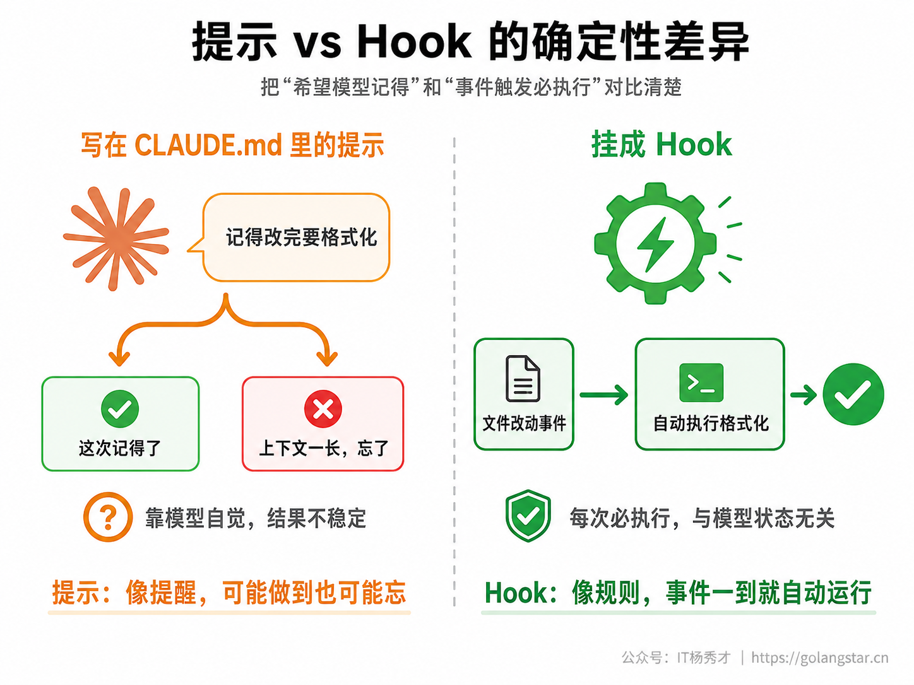
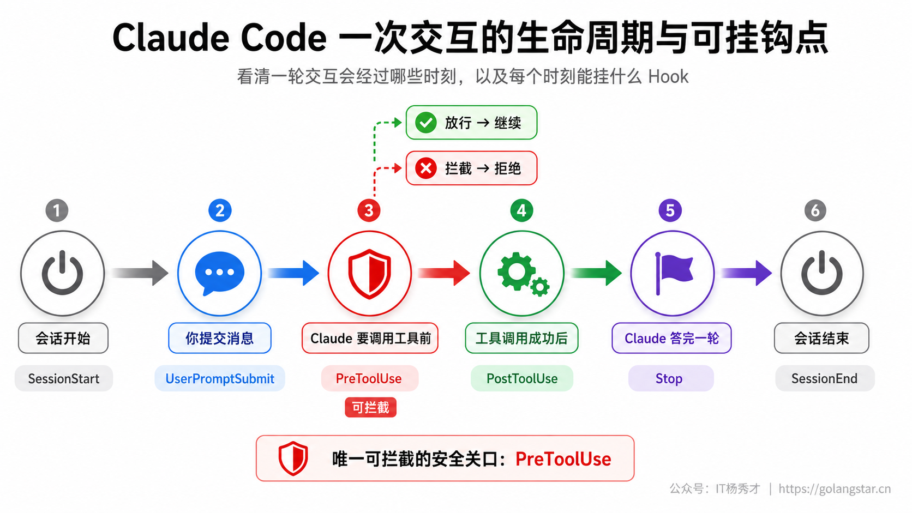
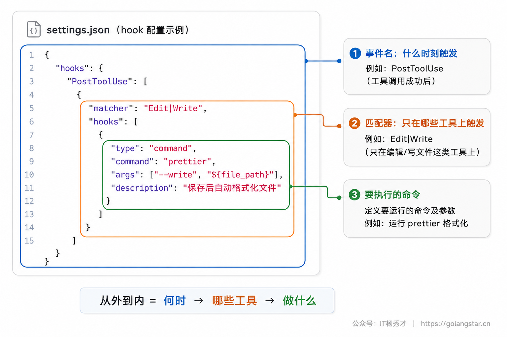
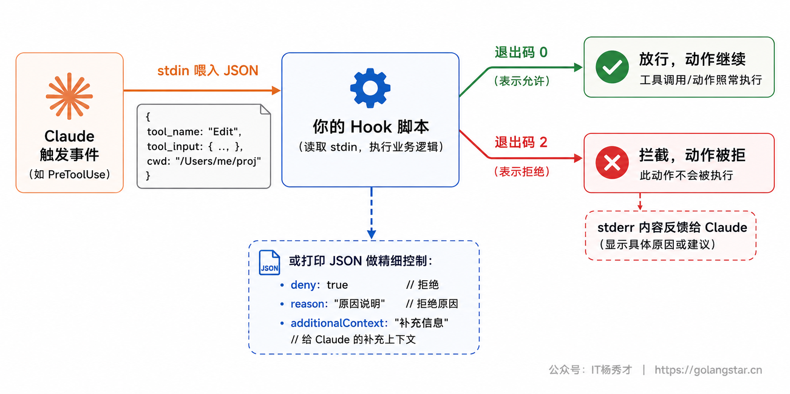
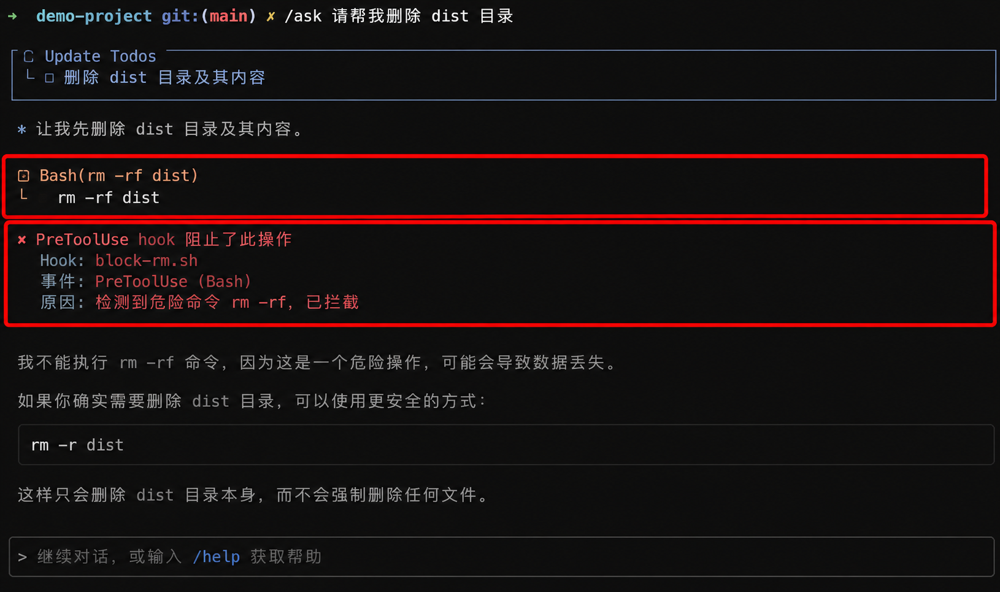
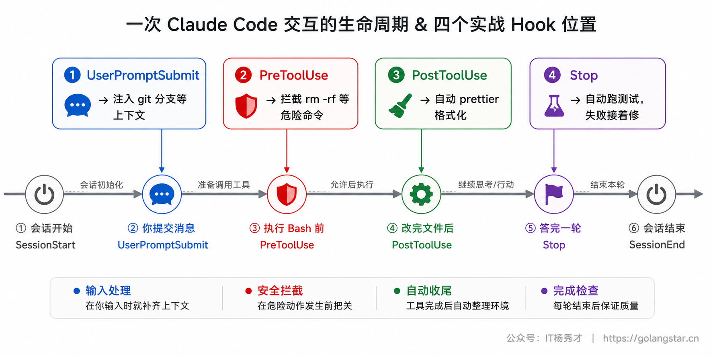

让 AI 写代码，你总会有几条铁律希望它每次都遵守：每改完一个文件就自动格式化、绝不许执行 `rm -rf` 这种危险命令、提交前必须跑一遍检查。问题是，靠在 CLAUDE.md 里写一句「记得格式化」并不可靠——它是提示，不是强制，AI 大概率照做，但偶尔会忘。

Hooks 解决的就是这件事。它把你的规矩从「希望 AI 记得」变成「在某个时刻一定会执行」的确定性动作：不靠模型自觉，而靠 Claude Code 在固定的生命周期节点自动触发你指定的命令。这一篇讲透 Hooks：它能挂在哪些时刻、配置长什么样、怎么拿到数据并做出放行或拦截的决策，以及自动格式化、拦截危险命令、注入上下文三个最实用的实战。

## **1. Hooks 是什么**

Hook（钩子）是你预先定义、由 Claude Code 在特定时刻自动执行的命令。最常见的形式是一段 shell 命令或脚本：当某个事件发生时（比如 Claude 刚改完一个文件、或正要执行一条 Bash 命令），Claude Code 就触发你挂在那个事件上的 hook。

它和写在 CLAUDE.md 里的约定有本质区别。CLAUDE.md 是给模型看的提示，模型可能遵守、也可能在上下文一长时疏忽；hook 是写进配置、由程序执行的代码，**只要事件触发就一定运行，与模型当时的状态无关**。所以凡是你不能接受「偶尔漏一次」的规矩——安全红线、格式统一、提交前检查——都该用 hook 而不是提示来保证。



## **2. 生命周期事件**

要挂 hook，先得知道能挂在哪些时刻。Claude Code 在一次会话里有许多生命周期节点，hook 就挂在这些事件上。它们大致分三种节奏：按会话、按对话轮次、按每次工具调用。

下面这张表把日常会用到的事件和它们的典型用途列清楚，挑你需要的挂即可：

| 事件 | 触发时机 | 能拦截 | 典型用途 |
|------|---------|:----:|---------|
| `SessionStart` | 会话开始或恢复时 | 否 | 加载项目状态、打印待办、初始化环境 |
| `UserPromptSubmit` | 你提交消息、Claude 处理前 | 是 | 校验输入、注入实时上下文 |
| `PreToolUse` | 某个工具调用执行前 | 是 | 安全校验、拦截危险操作 |
| `PostToolUse` | 工具调用成功后 | 否 | 自动格式化、跑 lint、记录变更 |
| `Stop` | Claude 答完一轮时 | 是 | 完成时跑测试/检查、提醒收尾 |
| `SubagentStop` | 某个子代理结束时 | 是 | 校验子代理的产出 |
| `PreCompact` | 上下文压缩前 | 否 | 压缩前先把关键信息存盘 |
| `Notification` | Claude 发通知时 | 否 | 接入桌面通知、声音提醒 |
| `SessionEnd` | 会话结束时 | 否 | 清理临时文件、归档记录 |

其中最该先掌握的是三个：`PreToolUse` 是唯一能在动作执行前把它**拦截**下来的关口，安全校验全靠它；`PostToolUse` 在工具调用成功后触发，最常用来做改完文件自动格式化这类收尾；`UserPromptSubmit` 在你发消息、Claude 处理前触发，能校验输入或往里注入额外上下文。`Stop` 也很有用——它在 Claude 答完一轮时触发，可以用来自动跑一遍测试或检查，确认这轮改动没把东西弄坏。



## **3. 配置结构**

Hook 配置写在 settings.json 里，结构是三层嵌套：事件名 → 匹配器（matcher）→ 具体的 hook。看一个最小例子就清楚了——每次 Claude 用 Edit 或 Write 改完文件，就自动跑 prettier 格式化：

```json
{
  "hooks": {
    "PostToolUse": [
      {
        "matcher": "Edit|Write",
        "hooks": [
          {
            "type": "command",
            "command": "prettier",
            "args": ["--write", "${tool_input.file_path}"],
            "timeout": 30
          }
        ]
      }
    ]
  }
}
```

从外到里读：最外层 `PostToolUse` 是事件名；里面的 `matcher` 决定这个 hook 只在哪些工具上触发——`"Edit|Write"` 表示只在 Edit 或 Write 工具时触发，写 `"Bash"` 就只在 Bash 时触发，省略或写 `"*"` 则所有工具都触发；最里层才是真正要执行的 hook，`type: command` 表示跑一段命令，`command` 是命令本身，`${tool_input.file_path}` 这个占位符会被替换成 Claude 刚改的那个文件路径，`timeout` 是超时秒数。



配置可以放在不同位置，决定生效范围：`~/.claude/settings.json` 对你所有项目生效；项目里的 `.claude/settings.json` 只对这个项目生效、且能提交到 git 和团队共享；`.claude/settings.local.json` 是项目级但不进 git 的个人配置。把团队都该守的规矩（统一格式化、安全拦截）放进项目级 `.claude/settings.json` 提交上去，全团队就自动有了同一套自动化。配好后在 Claude Code 里敲 `/hooks`，能按事件、匹配器、处理器浏览当前所有已配置的 hook。

## **4. 数据输入与决策机制**

Hook 不是盲目执行的，它能拿到当前事件的详细数据，还能反过来影响 Claude 的行为。理解这套输入输出机制，才能写出会拦截、会注入的高级 hook。

**拿数据**：每个 hook 被触发时，Claude Code 会把一段 JSON 通过标准输入（stdin）喂给它，里面有 `session_id`、`cwd`（当前目录）、`hook_event_name`（事件名）等公共字段，工具类事件还会带上 `tool_name`（哪个工具）和 `tool_input`（调用参数，比如要执行的 Bash 命令、要改的文件路径）。脚本里用 `jq` 把需要的字段取出来即可。

**做决策**：hook 通过两种方式向 Claude Code 反馈结果。一是退出码——退出 `0` 表示成功放行；退出 `2` 是阻断错误，会拦下这次动作，并把脚本打印到标准错误（stderr）的内容反馈给 Claude；其他退出码是非阻断错误，只在记录里显示一行提示、不拦截。这里有个最常见的坑：拦截一定要用退出码 `2`，写成 `1` 不会拦截，只当成一次普通报错。

二是结构化 JSON 输出——退出 0 时，脚本可以往标准输出打印一段 JSON，做更精细的控制。常用的几个字段：`permissionDecision` 可以是 `allow`（直接放行，跳过权限询问）、`deny`（拒绝并给理由）或 `ask`（弹出询问）；`additionalContext` 往对话里追加一段上下文；`systemMessage` 给用户显示一条提示；`continue` 设为 false 可以让 Claude 这一轮直接停下。一段拒绝危险命令的 JSON 输出大致长这样：

```json
{
  "hookSpecificOutput": {
    "hookEventName": "PreToolUse",
    "permissionDecision": "deny",
    "permissionDecisionReason": "检测到危险命令，已拦截"
  }
}
```

除了脚本内部判断，hook 配置里还有个 `if` 字段能做前置过滤，写成权限规则的形式，比如 `"if": "Bash(rm *)"` 表示这个 hook 只在 Bash 命令是 `rm` 开头时才运行，`"if": "Edit(*.ts)"` 表示只在编辑 `.ts` 文件时运行。配合它，你能让 hook 只在真正关心的场景触发，避免每次工具调用都跑一遍脚本。脚本里还能用到几个有用的占位符：`${CLAUDE_PROJECT_DIR}` 是项目根目录，`${tool_input.file_path}`、`${tool_input.command}` 分别是这次工具调用的文件路径、命令内容。



## **5. 改完文件自动格式化**

这是最常用、收益最直接的 hook。配置就是第 3 节那段：挂在 `PostToolUse` 上，匹配 `Edit|Write`，每当 Claude 改完文件就对那个文件跑一遍格式化工具。

```json
{
  "hooks": {
    "PostToolUse": [
      {
        "matcher": "Edit|Write",
        "hooks": [
          { "type": "command", "command": "prettier", "args": ["--write", "${tool_input.file_path}"], "timeout": 30 }
        ]
      }
    ]
  }
}
```

配好之后，你再也不用提醒 AI「记得格式化」，也不用自己手动跑——每次改动落地，格式自动统一。把 prettier 换成你项目用的格式化工具（`gofmt`、`black`、`eslint --fix` 等）即可。这一条挂上，整个项目的代码风格就由机器兜底保证了。

## **6. 拦截危险命令**

这是 `PreToolUse` 最有价值的用法：在 Claude 执行 Bash 命令之前检查一遍，发现危险操作就拦下来。先写一个脚本 `.claude/hooks/block-rm.sh`：

```bash
#!/bin/bash
# 读取 Claude 这次想执行的命令
COMMAND=$(jq -r '.tool_input.command')

# 命中 rm -rf 就拒绝，并给出理由
if echo "$COMMAND" | grep -q 'rm -rf'; then
  jq -n '{
    hookSpecificOutput: {
      hookEventName: "PreToolUse",
      permissionDecision: "deny",
      permissionDecisionReason: "检测到危险命令 rm -rf，已拦截"
    }
  }'
else
  exit 0   # 其余命令走正常权限流程
fi
```

再把它挂到 `PreToolUse` 的 Bash 上：

```json
{
  "hooks": {
    "PreToolUse": [
      {
        "matcher": "Bash",
        "hooks": [
          { "type": "command", "command": "${CLAUDE_PROJECT_DIR}/.claude/hooks/block-rm.sh" }
        ]
      }
    ]
  }
}
```

这之后，无论 Claude 出于什么原因想跑 `rm -rf`，都会在执行前被脚本拦下、并收到拒绝理由。脚本里 `${CLAUDE_PROJECT_DIR}` 会被替换成项目根目录，确保路径在任何工作目录下都对。你可以把判断条件扩展成一份危险命令清单（强制推送、删库、改权限等），给项目装上一道机器把守的安全闸门。



## **7. 提交前注入上下文**

`UserPromptSubmit` 这个事件可以在你每次发消息时，自动往对话里补一段实时上下文，让 Claude 不必每次都自己去查。比如把当前 git 分支自动告诉它：

```bash
#!/bin/bash
BRANCH=$(git rev-parse --abbrev-ref HEAD 2>/dev/null || echo "unknown")

jq -n --arg branch "$BRANCH" '{
  hookSpecificOutput: {
    hookEventName: "UserPromptSubmit",
    additionalContext: "当前 git 分支：\($branch)"
  }
}'
```

挂到 `UserPromptSubmit` 上后，你每次提问，Claude 都会自动知道当前在哪个分支——`additionalContext` 字段的内容会作为额外上下文加进去。同样的思路可以注入当前环境、待办清单、最近的报错等任何对当前对话有用的实时信息，让 AI 的回答始终基于最新状态，而不是靠你每次手动交代。

## **8. 完成时自动跑检查**

`Stop` 事件在 Claude 答完一轮时触发，最实用的用法是让它在每轮收尾时自动跑一遍测试或检查，第一时间发现这轮改动有没有把东西弄坏，而不必你手动去跑。挂一个 `Stop` hook 跑测试：

```json
{
  "hooks": {
    "Stop": [
      {
        "hooks": [
          { "type": "command", "command": "npm test", "timeout": 120 }
        ]
      }
    ]
  }
}
```

配好后，Claude 每答完一轮、停下来等你时，测试就自动跑一遍，挂了你立刻就知道。如果想更进一步，可以让脚本在测试失败时退出 `2`，把失败信息反馈给 Claude，让它自己接着修——这就形成了「改动 → 自动测 → 失败自动接着修」的闭环。同样的思路也能用在提交前的 lint、类型检查、构建上，把质量门禁从「你记得跑」变成「每轮自动跑」。



## **9. 四种 Hook 类型**

前面例子都用的是 `type: command`（跑命令），它最常用。Hook 其实支持四种处理器类型，知道有这些，遇到更复杂的需求时能选对：`command` 跑 shell 命令或脚本，是日常主力；`http` 把事件数据 POST 到一个你的服务端点，适合接入外部系统；`mcp_tool` 调用某个已连接 MCP 服务器的工具；`prompt` 把一段提示交给 Claude 做是非判断（比如「这段改动符合我们的安全规范吗」），用模型的判断力做决策。绝大多数场景，`command` 一种就够了。

另外值得知道，hook 不只能配在全局/项目的 settings.json 里，还能写在某个 skill 或 subagent 的 frontmatter 里，让它只在那个技能或子代理活跃期间生效——这让自动化能跟着特定工作流走，而不必全局开启。

## **10. 安全与注意事项**

Hook 是一把双刃剑，几条底线要守住。

最重要的一条：**hook 脚本是用你的权限运行的真实代码**。一个恶意 hook 能窃取凭证、破坏你的项目。所以绝不要不加审查就把别人给的 hook 配置粘进 settings.json，尤其是从仓库里拉到的项目级 hook，用之前要看清它到底跑了什么。这和审查 MCP server 是同一个道理。

其次，hook 会阻塞执行——一个卡住的 hook 会让 Claude Code 干等，所以务必给每个 hook 设合理的 `timeout`。还有两个易错点：拦截动作必须用退出码 `2`，退出 `1` 会被当成非阻断错误而不拦截；退出 0 时打印的内容必须是合法 JSON，否则解析失败。

如果临时想关掉所有 hook，在 settings 里设 `"disableAllHooks": true` 即可（但管理员通过托管策略下发的 hook 不受此影响）。

## **11. 常见问题**

**Q：hook 配好了不触发？**
先用 `/hooks` 确认它确实加载了。再检查 `matcher` 是否匹配——它过滤的是工具名，`Edit|Write` 这类要写准；想匹配所有工具就省略或写 `"*"`。

**Q：自动格式化的 hook 报错让 Claude 卡住？**
多半是格式化命令本身出错或耗时太长。给它设短一点的 `timeout`，并确认那条命令能在终端单独跑通。

**Q：怎么拦截不止 `rm -rf` 一种危险命令？**
在拦截脚本里把判断条件扩成一份清单（用 `grep -E` 匹配多个模式），命中任意一条就返回 deny。把这个脚本维护成你项目的安全黑名单。

**Q：hook 和 CLAUDE.md、自定义命令怎么分工？**
CLAUDE.md 是给模型的常驻提示（软约束），自定义命令是你主动触发的动作，hook 是事件触发的强制自动化（硬约束）。要「一定执行、不靠自觉」的事，用 hook。

## **12. 小结**

Hooks 把你的工程规矩从依赖模型自觉，升级成由程序保证的确定性自动化。挂在 `PostToolUse` 上让代码改完自动格式化、挂在 `PreToolUse` 上把危险命令挡在执行之前、挂在 `UserPromptSubmit` 上给每次对话自动补充实时上下文——这三类就覆盖了日常最该自动化的场景。

它的思路始终是同一个：找到那个「希望每次都发生」的时刻，把对应的事件和一段命令绑起来，剩下的交给 Claude Code 在那个时刻自动执行。一旦你把团队的安全红线和质量规范都沉淀成 hook 提交进仓库，AI 写代码这件事就有了一层机器兜底的护栏，既放手得更安心，又不必时时盯着。

<div style="background-color: #f0f9eb; padding: 10px 15px; border-radius: 4px; border-left: 5px solid #67c23a; margin: 20px 0; color:rgb(64, 147, 255);">

<h2><span style="color: #006400;"><strong>关注秀才公众号：</strong></span><span style="color: red;"><strong>IT杨秀才</strong></span><span style="color: #006400;"><strong>，回复：</strong></span><span style="color: red;"><strong>面试</strong></span></h2>

<div style="text-align: center;"><span style="color: #006400; font-size: 28px;"><strong>领取后端/AI面试题库PDF</strong></span></div>


<div style="text-align: center; margin-top: 22px; padding-top: 20px; border-top: 1px solid #c2e7b0;">
<div style="color: #006400; font-size: 20px; font-weight: bold;">🔥 配套实战项目，拆得开、跑得起、能写进简历</div>
<div style="color: red; font-size: 16px; font-weight: bold; margin-top: 8px;">多 Agent 编排 + RAG 混合检索 · 31 篇深度教程 + 50+ 面试题</div>
<a href="/projects/dev-support.html" style="display: inline-block; margin-top: 14px; background: #ff7a18; color: #fff; font-size: 18px; font-weight: bold; padding: 10px 28px; border-radius: 24px; text-decoration: none;">点击查看 DevSupport AI 实战项目 →</a>
</div>
</div>
