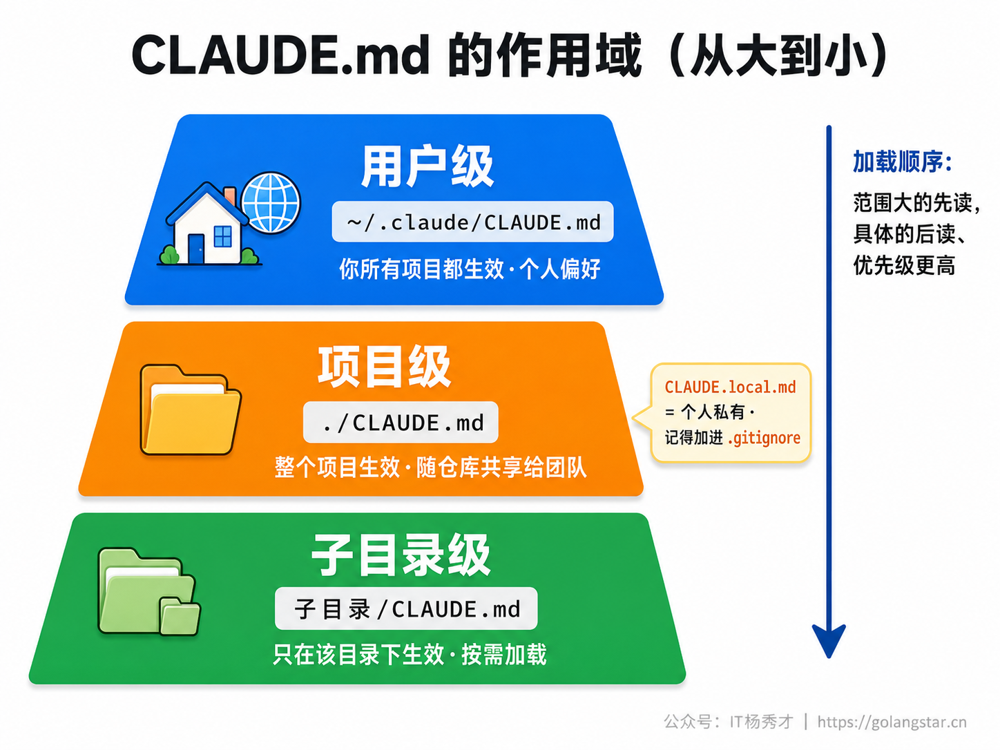
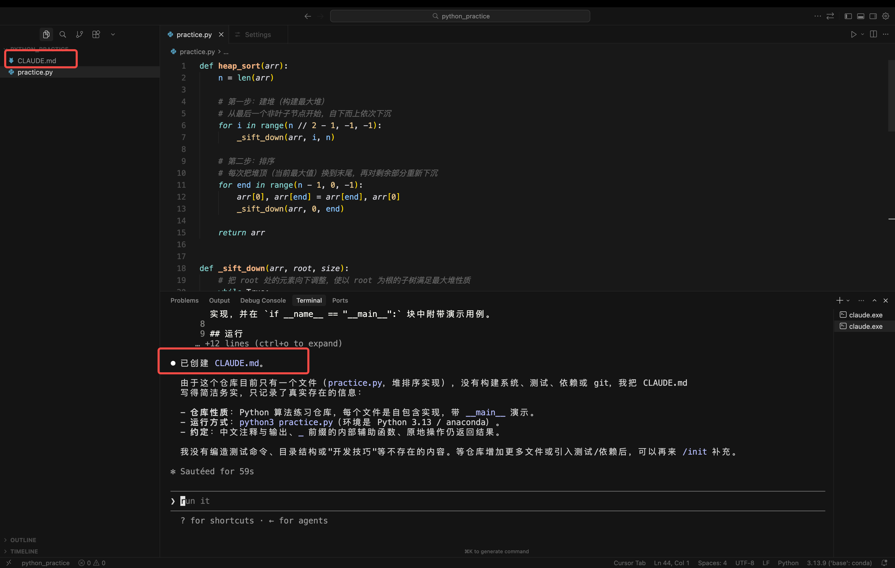
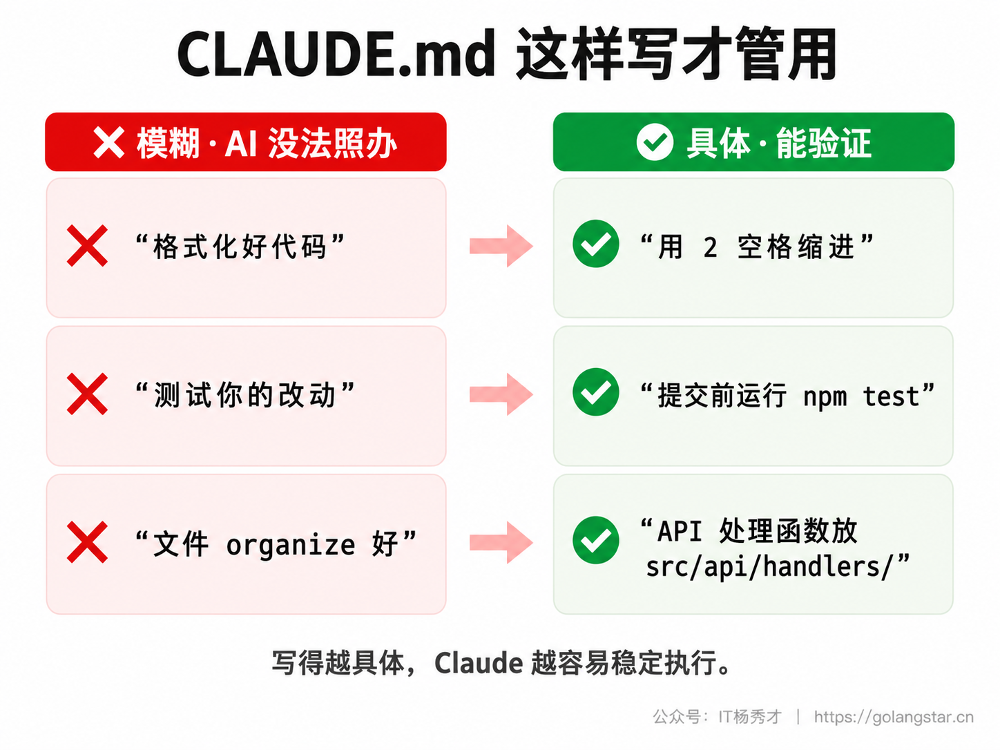
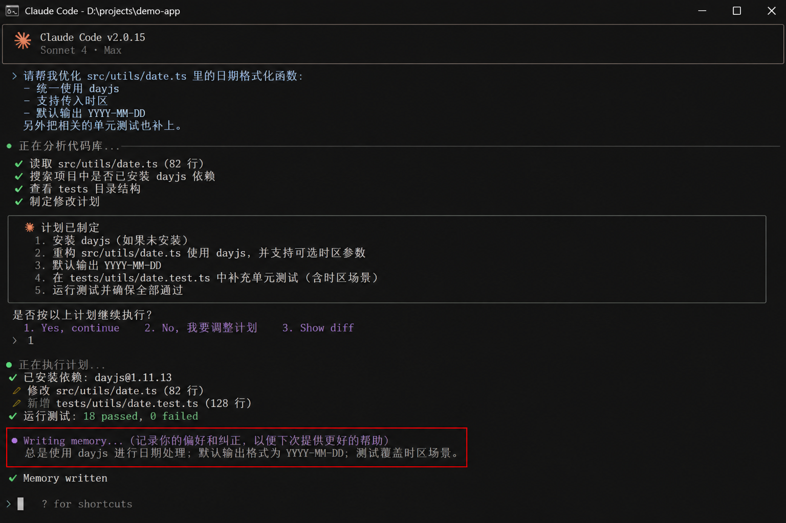
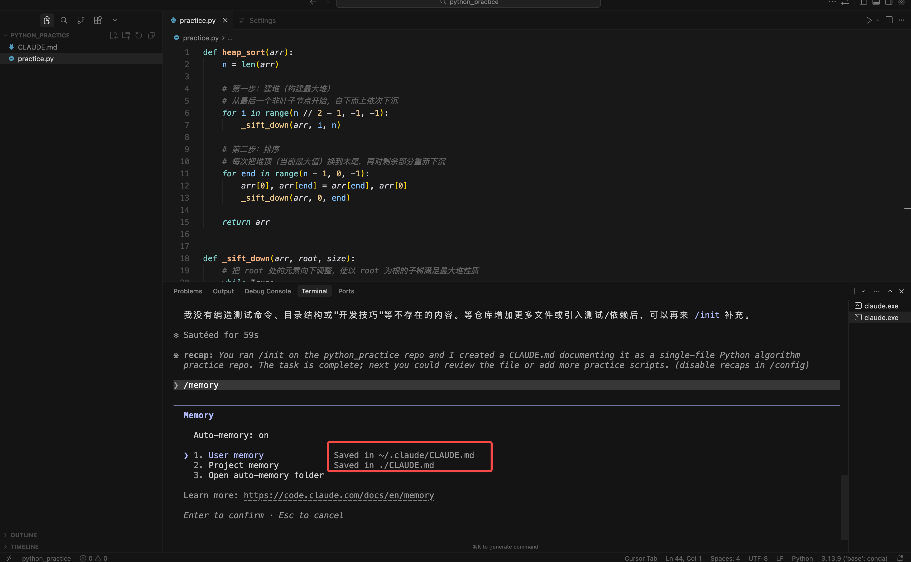

上一篇把 Claude Code 的基本操作打通了，但你可能很快会遇到一个恼人的问题：**它没有长期记忆**。每开一个新对话，它就"失忆"一次——你上次交代过"这个项目用 Vue""回复请用中文""提交前先跑测试"，这次又得重说一遍。重要的项目背景、你的个人偏好，每次从头交代，烦不胜烦。

这一篇就来解决这个问题。Claude Code 有两套机制专门用来跨会话"记事"：一套是你亲手写的 **`CLAUDE.md`**，一套是它自己悄悄积累的 **自动记忆（auto memory）**。把这两套用好，AI 就能真正"记住"你的项目和习惯，再也不用每次从头交代。这是 Claude Code 进阶路上极其关键的一环。

## **1. 两套记忆系统**

先建立整体认知。Claude Code 的"记忆"分两套，它们互补，而且**每次对话开始时都会自动加载进来**。


**`CLAUDE.md` 是"你写给 AI 的员工手册"。** 由你来写，里面放那些你希望 AI 在这个项目里始终遵守的指令——编码规范、构建命令、项目架构、"永远要做 X"之类的规矩。它是你主动定的规则。

**自动记忆是"AI 自己的工作笔记"。** 由 Claude 自己写，它在帮你干活的过程中，会把发现的有用信息悄悄记下来——比如"这个项目的构建命令是 `pnpm build`""上次那个 Bug 是因为忘了启动 Redis""这人喜欢用 pnpm 不用 npm"。不用你操心，它自己积累。

一个是你定的规矩，一个是它攒的经验，两者配合，AI 对你项目的"熟悉度"就会随着时间越来越高。下面分别细说。

## **2. CLAUDE.md 放在哪：三层作用域**

`CLAUDE.md` 不是只能放一个地方，它有几层不同的作用域，覆盖范围从大到小。理解这个层级，你才能把不同的规矩放到合适的地方。



**用户级**：放在你用户目录下的 `~/.claude/CLAUDE.md`，对你**所有项目**都生效，适合放你的个人偏好，比如"所有回复用中文""我习惯用 pnpm"。

**项目级**：放在项目根目录的 `./CLAUDE.md`（或 `./.claude/CLAUDE.md`），对**这个项目**生效，而且会随着代码仓库一起共享给团队。适合放项目相关的规矩，比如"本项目用 Vue 3 + TypeScript""API 处理函数放在 `src/api/` 下"。这是最常用的一层。

**子目录级**：放在项目某个子文件夹里的 `CLAUDE.md`，只在 Claude 处理那个子目录里的文件时才**按需加载**。适合大项目里给某个模块单独定规矩。

加载时，Claude Code 会从大范围到小范围依次读取、拼接到一起——**范围越大的越先读，越具体的越后读、优先级越高**。所以当用户级说"用 4 空格缩进"、项目级说"用 2 空格缩进"时，项目级会赢。另外还有个 `CLAUDE.local.md`，放项目根目录、但只属于你个人（记得加进 `.gitignore` 别提交），适合放你自己的沙箱地址、测试数据这类不该共享的东西。

## **3. 怎么写好 CLAUDE.md**

知道放哪了，接下来是怎么写。这里有个好消息：**你不用从零手写，Claude Code 能帮你生成初稿。**

在项目目录里启动 Claude Code，敲一个命令：

```
/init
```

它会自动扫描你的整个项目——看你用了什么技术栈、有哪些构建和测试命令、项目结构是怎样的，然后生成一份 `CLAUDE.md` 初稿。你在这个基础上再补充、修改，比从白纸开始轻松多了。如果项目里已经有 `CLAUDE.md`，`/init` 会建议改进而不是覆盖。



生成只是起点，关键是写得好。官方和我自己的经验，总结成几条最佳实践：

**第一，要具体，能验证。** 这是最重要的一条。模糊的指令 AI 没法照办，具体的它才能执行。



像"格式化好代码"这种就太空泛，换成"用 2 空格缩进";"测试你的改动"换成"提交前运行 `npm test`";"文件组织好"换成"API 处理函数放在 `src/api/handlers/`"。**越具体，AI 照做的概率越高。**

**第二，要简洁，别太长。** `CLAUDE.md` 每次对话都会整个加载进上下文、占用 token，太长不仅费上下文，还会让 AI 抓不住重点、遵守度下降。建议**单个文件控制在 200 行以内**，只放那些"每次对话都该记得"的核心规矩。

**第三，用 Markdown 结构化。** 用标题、列表把相关的规矩分组，别堆成一大段。结构清晰的指令，AI 和人一样都更容易抓住要点。

一份写得好的项目级 `CLAUDE.md` 大概长这样：

```markdown
# 项目说明

本项目是一个 Vue 3 + TypeScript 的待办清单应用。

## 技术约定
- 用 2 空格缩进，变量命名用驼峰式
- 状态管理用 Pinia，不要引入 Vuex
- 组件放在 src/components/，页面放在 src/views/

## 工作流
- 提交代码前先运行 `pnpm test` 和 `pnpm lint`
- 所有和我的对话请用中文回复

## 注意
- 不要擅自引入新的第三方库，需要的话先问我
```

**第四，内容多了就拆分。** 如果规矩实在多，可以用 `@` 语法把内容拆到别的文件里，在 `CLAUDE.md` 里用 `@路径` 引入，比如 `@docs/code-style.md`，它会在启动时一并加载。更进阶的做法是用 `.claude/rules/` 目录，把规则按主题拆成多个文件，甚至能让某些规则只在处理特定类型的文件时才加载——这部分等你项目复杂了再研究，新手先用好一个 `CLAUDE.md` 就够。

## **4. 自动记忆：让 AI 自己记**

说完你手写的部分，再看 Claude 自己记的那套——**自动记忆**。这是 Claude Code 一个很贴心的能力（较新版本默认开启），它会在帮你干活的过程中，自动把值得记的东西存下来，下次对话还能想起来。

你不用做任何事，它自己判断什么值得记。当你在界面上看到 **"Writing memory"（正在记忆）** 或 **"Recalled memory"（想起记忆）** 的提示，就是它在读写自己的记忆。这些记忆存在你电脑本地一个专门的目录里，有一个 `MEMORY.md` 作为索引、每次对话开头加载，详细内容则分散在各个主题文件里、用到时才读。



你也可以**主动让它记**。在对话里直接说一句"记住，这个项目的测试需要先启动本地 Redis"或者"以后都用 pnpm，别用 npm"，它就会把这条存进自动记忆，以后自然就记得了。如果你希望某条规矩进的是 `CLAUDE.md`（而不是自动记忆），就明确说"把这条加到 CLAUDE.md"。

想看看 AI 到底记了些什么、或者管理这些记忆，用这个命令：

```
/memory
```

它会列出当前会话加载的所有 `CLAUDE.md`、`CLAUDE.local.md`、规则文件，以及自动记忆文件夹的入口。这些记忆都是纯文本的 Markdown，你可以随时打开来看、编辑、甚至删掉——完全在你掌控之中，不用担心它记了什么你不知道的东西。



什么该写进 `CLAUDE.md`、什么交给自动记忆？一个简单的判断：**你明确想让团队都遵守、想长期固定下来的规矩，写进 `CLAUDE.md`;那些零碎的、AI 在协作中自己发现的经验，交给自动记忆去攒。** 两者配合，省心又高效。

## **5. 小结**

这一篇解决了 Claude Code "每次失忆"的痛点。记住核心两件事：**`CLAUDE.md` 是你手写的项目规矩**，有用户级、项目级、子目录级三层作用域，越具体越简洁越好，用 `/init` 能帮你生成初稿；**自动记忆是 Claude 自己攒的经验**，默认开启、自动积累，用 `/memory` 随时查看和管理。

把这套记忆系统配置好，你会明显感觉到 AI 越来越"懂"你的项目——不用反复交代背景，它张口就知道你的规矩和习惯。这是从"每次都要叮嘱的生手"到"熟悉项目的老搭档"的关键一步。下一篇，我们讲 Claude Code 的另一大利器——Slash Commands 斜杠命令，看看怎么用好内置命令、甚至打造你自己的专属命令。

<div style="background-color: #f0f9eb; padding: 10px 15px; border-radius: 4px; border-left: 5px solid #67c23a; margin: 20px 0; color:rgb(64, 147, 255);">

<h2><span style="color: #006400;"><strong>关注秀才公众号：</strong></span><span style="color: red;"><strong>IT杨秀才</strong></span><span style="color: #006400;"><strong>，回复：</strong></span><span style="color: red;"><strong>面试</strong></span></h2>

<div style="text-align: center;"><span style="color: #006400; font-size: 28px;"><strong>领取后端/AI面试题库PDF</strong></span></div>


</div>
