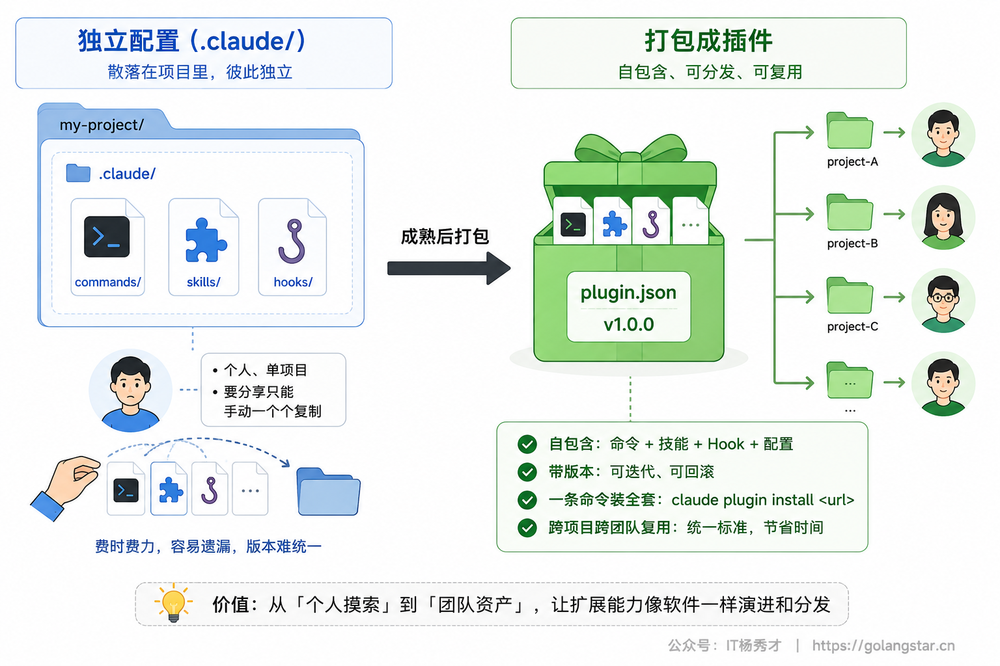
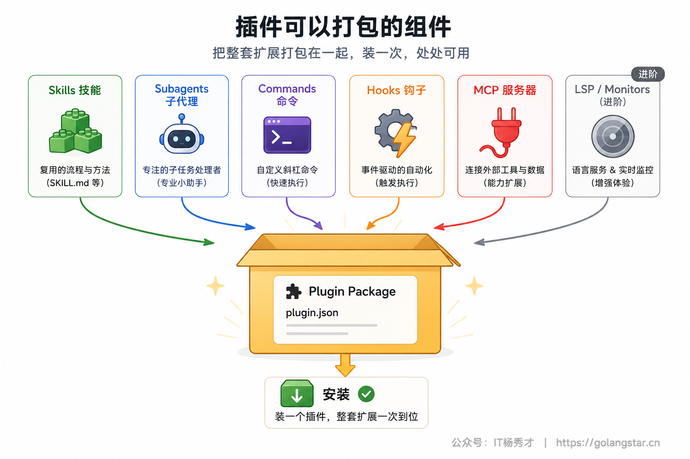
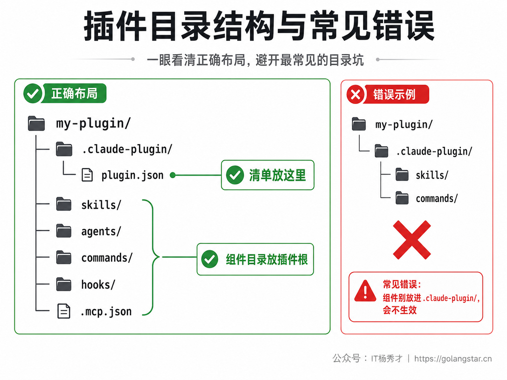
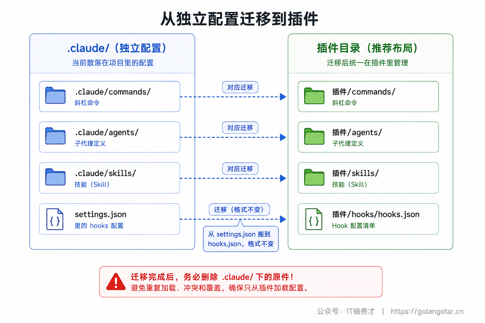
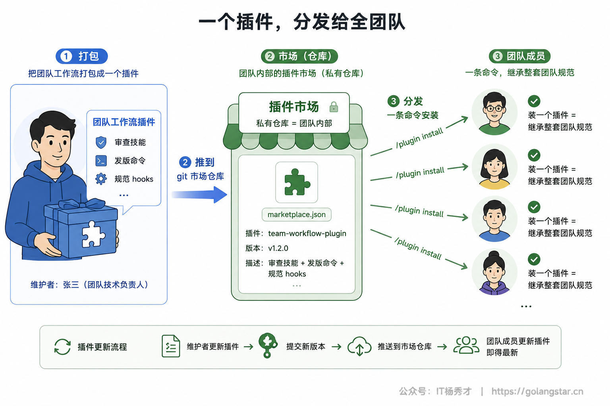

前面几篇你陆续学会了给 Claude Code 加各种扩展：用 CLAUDE.md 立规矩、用命令封装高频指令、用子代理隔离支线、用 Hooks 做自动化、用 Skills 沉淀流程、用 MCP 连外部工具。但这些扩展现在是散的——分别躺在 `.claude/` 下的不同目录里。想把整套打包给同事用，或在多个项目间复用，就得手动一个个复制，既麻烦又容易漏。

Plugins（插件）解决的就是分发问题。它把 skills、子代理、命令、hooks、MCP 配置等打包成一个自包含、带版本号的整体，别人用一条 `/plugin install` 就能装上全套。这一篇讲透插件：它能打包什么、目录长什么样、怎么安装现成插件、怎么从零做一个并分发给团队。

## **1. Plugins 是什么**

一个插件就是一个目录，里面装着若干扩展组件，外加一个 `plugin.json` 清单文件描述它的身份（名字、版本、描述）。装上插件，它带的技能、子代理、命令、hooks、MCP 全都一次性生效。

它和你直接放在 `.claude/` 下的独立配置，区别在于定位。独立配置适合个人的、单项目的、还在试验的东西，技能名也短（`/deploy`）；插件适合要跨项目复用、要分享给团队或社区、要做版本管理和更新的场景，代价是技能名带上插件命名空间前缀（`/我的插件:deploy`），好处是多个插件之间不会重名打架。

一句话定位：**自己用、临时试，放 `.claude/`；要分享、要复用、要版本化，打包成插件。** 通常的路径是先在 `.claude/` 里把东西调顺手，等成熟了再转成插件拿去分发。



## **2. 一个插件能打包什么**

插件强在它能把前面学过的所有扩展形态装进同一个包里。一个完整插件可以包含：`skills/` 里的技能、`agents/` 里的子代理、`commands/` 里的命令、`hooks/hooks.json` 里的钩子、`.mcp.json` 里的 MCP 服务器配置。除此之外还能带更进阶的：`.lsp.json` 配语言服务器给 Claude 实时代码智能、`monitors/` 配后台监视器盯日志或文件、`bin/` 放可执行文件、`settings.json` 带一套默认设置。

下面这张表把各组件放在插件里的位置和作用列清楚：

| 组件 | 位置 | 作用 |
|------|------|------|
| 技能 | `skills/<名>/SKILL.md` | 可复用的流程，Claude 自动或手动调用 |
| 子代理 | `agents/` | 专精某类活的独立代理 |
| 命令 | `commands/` | 轻量的斜杠命令（新插件推荐用 `skills/`） |
| 钩子 | `hooks/hooks.json` | 事件触发的自动化 |
| MCP | `.mcp.json` | 连接外部工具与数据源 |
| 语言服务 | `.lsp.json` | 给 Claude 实时代码智能（按语言） |
| 后台监视 | `monitors/monitors.json` | 在后台盯日志/文件，有事件就通知 Claude |
| 默认设置 | `settings.json` | 插件启用时应用的默认配置 |

这意味着插件可以是一整套工作流的集合。比如一个「前端开发」插件，可以同时带上前端代码审查技能、组件生成命令、保存自动格式化的 hook、以及连接设计工具的 MCP——装一个插件，整套前端工作流就位。

其中有两个进阶组件值得单独提一句。一是后台监视器：在 `monitors/monitors.json` 里配一条命令（比如 `tail -F ./logs/error.log`），插件启用时它自动在后台跑，命令每输出一行就作为通知发给 Claude，让它能对日志、外部状态的变化实时反应，你不必主动叫它去盯。二是默认设置：插件根目录的 `settings.json` 里设 `"agent": "某子代理"`，能让插件启用时直接把它带的某个子代理设为主线代理，应用那个代理的系统提示、工具限制和模型——也就是说，一个插件可以整体改变 Claude Code 默认的行为风格，比如装上就变成一个专注安全审查的助手。



## **3. 插件的目录结构**

插件结构很有规律。根目录下有一个 `.claude-plugin/` 文件夹，里面放清单 `plugin.json`；其余各组件目录都直接放在插件根目录下（不是放进 `.claude-plugin/` 里）：

```text
my-plugin/
├── .claude-plugin/
│   └── plugin.json        # 清单，只有它放这里
├── skills/                # 技能
│   └── code-review/SKILL.md
├── agents/                # 子代理
├── commands/              # 命令
├── hooks/
│   └── hooks.json         # 钩子
└── .mcp.json              # MCP 配置
```

这里有个最常见的错误必须点明：**除了 `plugin.json`，`skills/`、`agents/`、`commands/`、`hooks/` 这些组件目录绝不能放进 `.claude-plugin/` 里，它们必须在插件根目录下。** 放错位置是插件不生效最常见的原因。

清单 `plugin.json` 本身很简单：

```json
{
  "name": "my-first-plugin",
  "description": "学习插件基础的问候插件",
  "version": "1.0.0",
  "author": { "name": "你的名字" }
}
```

`name` 是唯一标识，也是技能的命名空间前缀（这个插件里的 `hello` 技能会变成 `/my-first-plugin:hello`）；`description` 在插件管理器里展示；`version` 可选但建议写——设了它，用户只在你升版本号时才收到更新，不设的话（用 git 分发时）每次提交都算一个新版本。



## **4. 安装和使用现成插件**

用别人的插件，靠 `/plugin` 命令和市场（marketplace）。市场就是插件的仓库目录。Anthropic 维护了两个公共市场：`claude-plugins-official`（官方精选，首次交互启动 Claude Code 时会自动注册）和 `claude-community`（社区提交、审核后上架）。

装一个插件分两步：先添加它所在的市场，再从市场装。比如添加社区市场再装某个插件：

```bash
# 在 Claude Code 里执行
/plugin marketplace add anthropics/claude-plugins-community
/plugin install 插件名@claude-community
```

不带参数直接敲 `/plugin` 会打开插件菜单，可以浏览、安装、启用、禁用。装好后，插件带的技能就以 `/插件名:技能名` 的形式出现，子代理出现在 `/agents` 里，hooks 和 MCP 自动生效。会话中临时改动了插件，用 `/reload-plugins` 重载即可，不必重启。


## **5. 从零做一个插件**

自己打包一个插件，跟着五步走就行。

第一步，建插件目录和清单。建一个 `my-first-plugin/` 文件夹，里面建 `.claude-plugin/plugin.json`，内容就是第 3 节那段清单。

第二步，加一个技能。在插件根目录建 `skills/hello/` 目录，放一个 `SKILL.md`：

```markdown
---
description: 友好地问候用户
disable-model-invocation: true
---

热情地问候用户，并问今天能帮上什么忙。
```

文件夹名 `hello` 就是技能名，加上插件命名空间后变成 `/my-first-plugin:hello`。

第三步，本地加载测试。用 `--plugin-dir` 启动 Claude Code，直接加载这个插件而不必先安装：

```bash
claude --plugin-dir ./my-first-plugin
```

启动后敲 `/my-first-plugin:hello` 试一下，能看到 Claude 按技能问候你。

第四步，让技能接参数。给 `SKILL.md` 正文加上 `$ARGUMENTS` 占位符，就能接收用户在命令后输入的内容，比如让它按名字问候。改完跑 `/reload-plugins` 重载，再 `/my-first-plugin:hello Alex` 试。

第五步，往里加更多组件。同样的方式，在插件根目录建 `agents/`、`commands/`、`hooks/hooks.json`、`.mcp.json`，把你已有的子代理、命令、钩子、MCP 配置放进去，一个功能完整的插件就成型了。开发期间改了什么，`/reload-plugins` 重载即可看到效果。

如果你嫌每次启动都带 `--plugin-dir` 麻烦，还有个更省事的路子：用 `claude plugin init my-tool` 在你的技能目录里脚手架一个插件，它会在 `~/.claude/skills/my-tool/` 下生成好清单和起步的 `SKILL.md`，下次会话自动以 `my-tool@skills-dir` 的形式加载，不用市场、不用安装步骤。这适合你自己边用边迭代的个人插件。等真正要分发给别人，再走市场那条路。

提一句版本管理，因为它直接影响别人怎么收到你的更新：`plugin.json` 里设了 `version`，用户就只在你升版本号时才更新；不设的话，用 git 分发时每个提交都被当成一个新版本。所以正式分发的插件，建议显式维护 `version` 字段，按语义化版本号（如 `1.2.0`）递增，让团队的更新节奏可控。

## **6. 把已有配置转成插件**

如果你 `.claude/` 下已经攒了一批好用的命令、技能、hooks，不用重写，直接迁移成插件。

步骤很直接：建好插件目录和 `plugin.json`，把 `.claude/commands/`、`.claude/agents/`、`.claude/skills/` 整个复制到插件根目录下对应位置；hooks 稍有不同——它原本写在 `settings.json` 的 `hooks` 对象里，迁移时新建 `hooks/hooks.json`，把那段 `hooks` 配置原样搬过去（格式完全一样）。然后用 `--plugin-dir` 加载测试，逐个验证命令、子代理、hooks 都正常。

迁移后记得把 `.claude/` 里的原件删掉，避免重复——尤其是子代理，项目和用户级的 `.claude/agents/` 会覆盖同名的插件子代理，不删原件插件版就不生效。



## **7. 分发给团队**

插件做好后，分发也靠市场。最适合团队的方式是建一个自己的市场，托管在一个 git 仓库里（内部团队就用私有仓库）。团队成员 `/plugin marketplace add 你们的仓库` 添加这个市场，再 `/plugin install` 装上你们的插件，整套团队工作流就同步到每个人机器上了。之后你更新插件、提交新版本，大家更新一下就拿到最新的。

如果想把插件分享给整个社区，可以提交到社区市场 `claude-community` 走审核上架。提交前先在本地跑 `claude plugin validate` 校验一下，审核流水线也会跑同样的检查。

这套机制让团队的最佳实践有了统一的载体：与其在 wiki 里写一堆「我们团队这样审查代码、这样发版、这样写提交信息」，不如把它们做成一个插件——新人入职装一个插件，就继承了团队沉淀下来的整套技能、命令和规范，而且这些是 Claude 真正会执行的能力，不是文档里的文字。



## **8. 命名空间与启用禁用**

插件的技能总是带命名空间前缀（`/插件名:技能名`），这是故意的——多个插件即使有同名技能也不会冲突。想改前缀，改 `plugin.json` 的 `name` 字段即可。

装了的插件可以随时启用或禁用：`/plugin` 菜单里操作，或用子命令 `/plugin enable`、`/plugin disable`。一个值得知道的优先级规则是：项目和用户级 `.claude/` 里的同名子代理、技能会盖过插件里的同名组件，所以如果你发现某个插件组件没生效，先看是不是本地 `.claude/` 里有个同名的把它顶掉了。

## **9. 常见问题**

**Q：插件装了但组件不生效？**
最常见是目录结构错了——确认 `skills/`、`agents/`、`hooks/` 这些在插件根目录下，而不是错放进了 `.claude-plugin/`（里面只该有 `plugin.json`）。其次检查是不是本地 `.claude/` 有同名组件把插件版盖住了。

**Q：开发插件每次都要 `--plugin-dir` 很烦？**
本地开发用 `--plugin-dir` 即可，改了用 `/reload-plugins` 重载、不必重启。也可以用 `claude plugin init` 在技能目录里脚手架一个插件，它会自动加载、免去每次带参数。

**Q：插件和单独配技能/命令有什么区别？**
能力一样，差别在分发。单个项目自己用，直接放 `.claude/` 最省事；要跨项目、跨团队复用并做版本管理，才值得打包成插件。

**Q：怎么更新一个装好的插件？**
在 `/plugin` 菜单里更新。作者按版本号发新版后，你更新即得最新；走 git 分发的，每次新提交都算新版本。

## **10. 小结**

Plugins 是 Claude Code 扩展体系的集大成者：它把你前面学的技能、子代理、命令、hooks、MCP 全都装进一个自包含、带版本号的包，让原本散落各处、只能手动复制的扩展，变成一条 `/plugin install` 就能分发的整体。

它的真正价值在团队层面：把团队的审查规范、发版流程、自动化钩子、外部工具集成打包成一个插件推到市场，新人装一个就继承整套最佳实践，更新也只需提交新版本。从在 `.claude/` 里把单个扩展调顺手，到把它们打包成插件分发出去——这条路走通，你就从「自己用得好」迈到了「让一个团队都用得好」。

<div style="background-color: #f0f9eb; padding: 10px 15px; border-radius: 4px; border-left: 5px solid #67c23a; margin: 20px 0; color:rgb(64, 147, 255);">

<h2><span style="color: #006400;"><strong>关注秀才公众号：</strong></span><span style="color: red;"><strong>IT杨秀才</strong></span><span style="color: #006400;"><strong>，回复：</strong></span><span style="color: red;"><strong>面试</strong></span></h2>

<div style="text-align: center;"><span style="color: #006400; font-size: 28px;"><strong>领取后端/AI面试题库PDF</strong></span></div>


<div style="text-align: center; margin-top: 22px; padding-top: 20px; border-top: 1px solid #c2e7b0;">
<div style="color: #006400; font-size: 20px; font-weight: bold;">🔥 配套实战项目，拆得开、跑得起、能写进简历</div>
<div style="color: red; font-size: 16px; font-weight: bold; margin-top: 8px;">多 Agent 编排 + RAG 混合检索 · 31 篇深度教程 + 50+ 面试题</div>
<a href="/projects/dev-support.html" style="display: inline-block; margin-top: 14px; background: #ff7a18; color: #fff; font-size: 18px; font-weight: bold; padding: 10px 28px; border-radius: 24px; text-decoration: none;">点击查看 DevSupport AI 实战项目 →</a>
</div>
</div>
