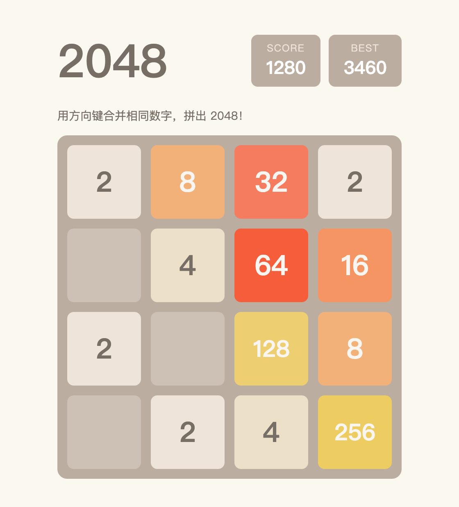
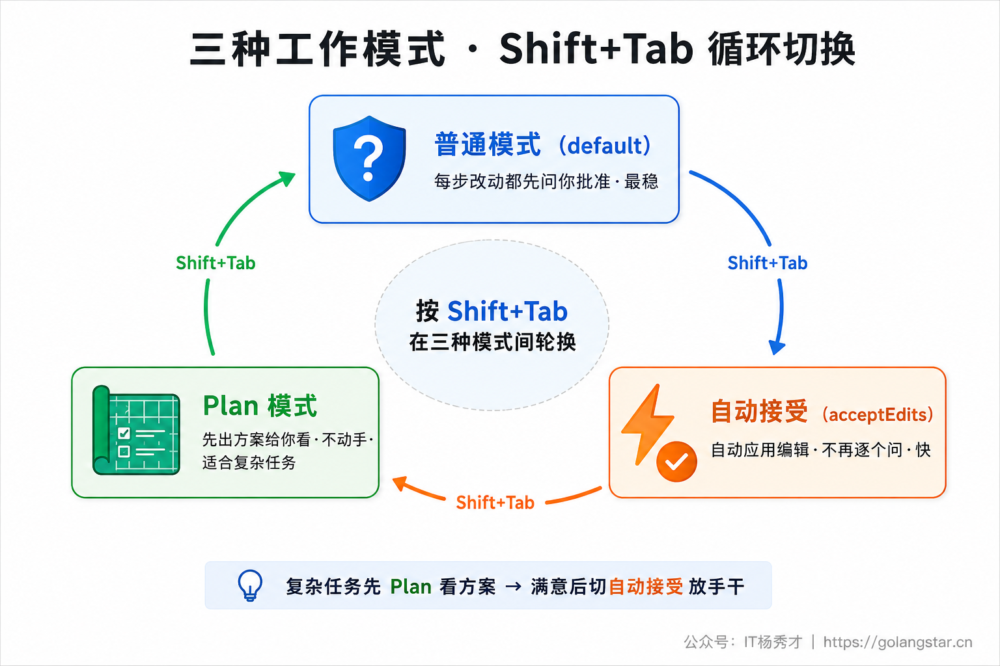
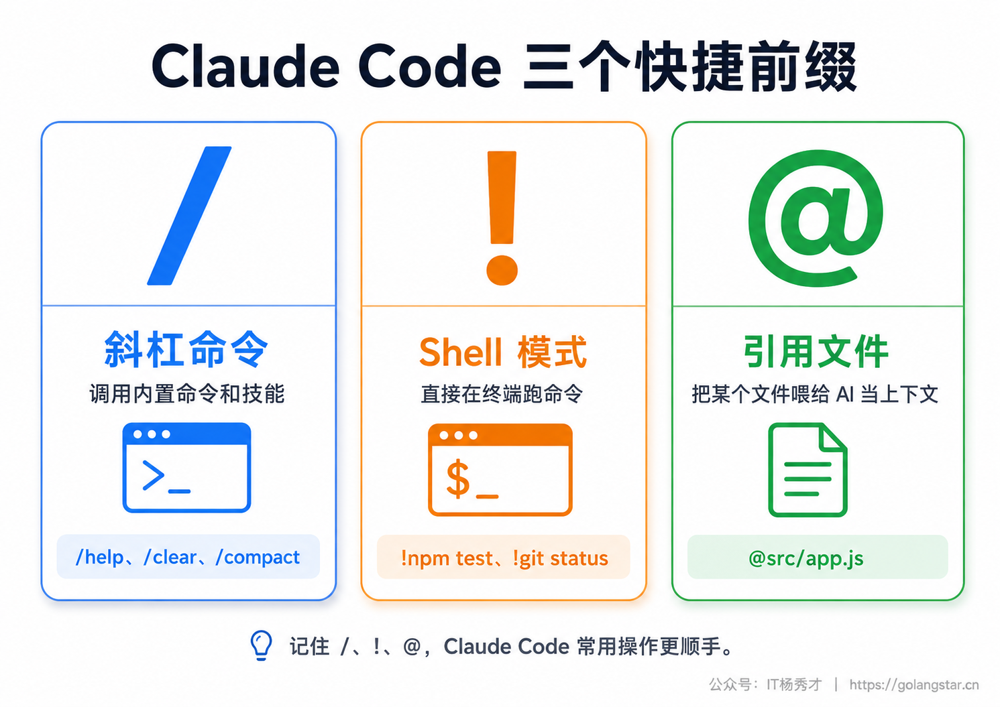
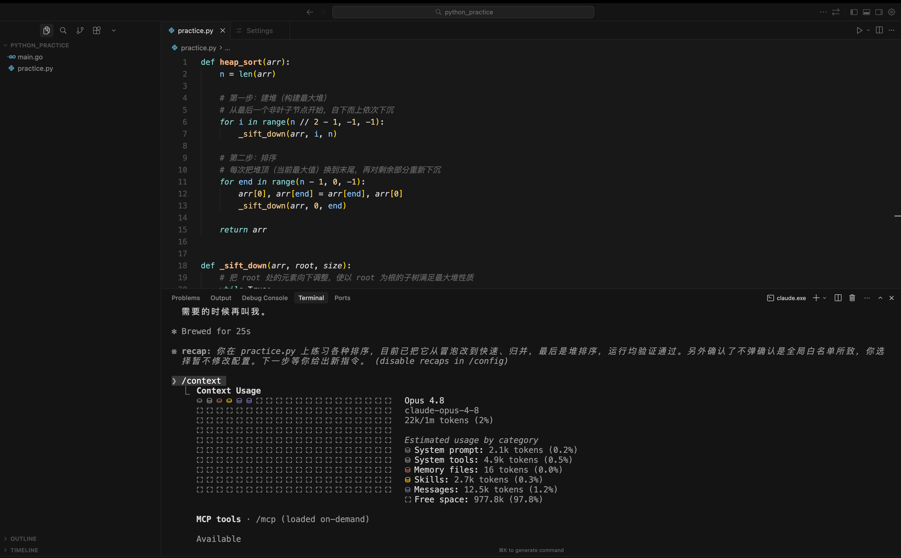

不少人把 Claude Code 装好、跑通了第一次对话，就以为自己会用了，其实离用得顺还差得远——只会一句句地问、一下下地点确认，把一个能自己规划、自己跑命令、自己调试的强力 Agent，用成了普通的问答机器人，白白浪费了它一大半的本事。

这一篇是 Claude Code 深入浅出子系列的开篇，目标是把会用这件事**彻底打通**。读完你会清楚：它有哪几种形态、该用哪个；怎么通过几个小实验快速找到手感；它干活时的几种放手程度怎么切换；那些能让你效率翻倍的快捷前缀和快捷键；日常必会的核心命令；以及把这些串起来的一套真实工作流。内容偏多，但每一块都是天天要用的真功夫，建议跟着动手过一遍。

> 本篇默认你已按环境搭建篇装好 Claude Code（含国内可用性配置）。还没装的，先回去看《Claude Code 安装与配置》那一篇，这里不再重复安装步骤。

## **1. 多种使用形态**

很多人以为 Claude Code 就是个命令行工具，其实它有一整套产品形态，同一个账号、同一套能力，可以在好几种入口里用。先认清它们，挑一个最适合你的当主战场。


| 形态 | 怎么进入 | 特点 | 适合谁 |
|------|----------|------|--------|
| **终端 CLI** | 终端里敲 `claude` | 功能最全、最强大，所有高级能力都基于它 | 想把 Claude Code 用透的人（**本系列主力**） |
| **VS Code 插件** | VS Code 扩展市场搜 "Claude Code" 安装 | 在编辑器里侧边栏对话，改动直接显示在编辑器里 | 平时就用 VS Code 写代码的人 |
| **JetBrains 插件** | IDEA/PyCharm 等插件市场安装 | 同上，融进 JetBrains 系 IDE | 用 IntelliJ、PyCharm、GoLand 的人 |
| **桌面 App** | 官网下载安装包（macOS/Windows） | 图形界面，多会话并排管理 | 怕终端、想要图形工作台的人 |
| **Web 版** | 浏览器打开 `claude.ai/code` | 打开网页就能用，不装任何东西 | 临时试用、不想装东西的人 |

这五种里，**终端 CLI 是绝对的主力**——它功能最全，本系列后面所有进阶能力（CLAUDE.md、命令、MCP、子代理、Hooks、Skills）都是围绕它讲的。VS Code / JetBrains 插件本质上是把 CLI 的能力嵌进了编辑器，习惯在 IDE 里写代码的话用它们很顺手。桌面 App 和 Web 版则是给那些实在不想碰命令行的人留的图形入口。

**我的建议：把终端 CLI 当主力练熟。** 终端听着唬人，实际用起来就是打字聊天，半小时就上手；而且只有 CLI 才能完整发挥 Claude Code 的威力。下面的所有讲解，都以终端 CLI 为准。

## **2. 三个上手实验**

讲一堆概念不如直接上手玩。下面三个小实验由浅入深，跟着做一遍，你就能对 Claude Code 能干什么、怎么跟它配合，建立起直观的感觉。先在终端里 `cd` 进任意一个文件夹（空文件夹也行），敲 `claude` 启动。

> 第一次在某个文件夹启动时，它会问你是否信任这个目录（trust this folder）。确认是你自己的文件夹，选信任即可——这是它的一道安全闸，防止你误在陌生目录里让它乱跑。

### **2.1 纯对话**

先别让它写代码，就当个聊天机器人，试试它读不读得懂你的项目。如果你是在一个有代码的文件夹里启动的，直接问：

```
这个项目是做什么的？用了哪些技术？主要入口在哪个文件？
```

你会发现一件神奇的事：**你根本不用手动把文件贴给它**，它会自己去翻文件夹里的文件，然后用中文给你总结项目用途、技术栈、入口位置。这种主动寻找上下文的能力，正是 Coding Agent 和普通问答机器人的本质区别。

### **2.2 生成一个网页**

接着让它干点产出。试试让它从零做一个网页：

```
帮我做一个简洁好看的「番茄钟」网页，纯 HTML+CSS+JS 单文件：
25 分钟倒计时，有开始/暂停/重置按钮，深色背景、大字号显示剩余时间。
```

它会规划、写代码、把文件创建出来。生成完，你用浏览器打开那个 HTML 文件就能看到效果。下面就是用这条 Prompt 真实跑出来的番茄钟——深色背景、大字号倒计时、进度环、三个控制按钮，一个能直接用的小工具：


这一步让你感受到说一句话就能产出一个能用的东西的效率。

### **2.3 写个能跑的小游戏**

最后来个更有成就感的——让它写个小游戏，并且它能自己把环境跑起来：

```
用 HTML+CSS+JS 写一个 2048 小游戏，单文件就行：
4×4 棋盘，方向键控制合并，右上角显示当前分数和最高分，配色参考经典 2048。
写完直接帮我在浏览器里打开看看效果。
```

它会写出完整代码，甚至自己执行命令把网页打开。下面就是用这条 Prompt 真实跑出来的成品——一个配色、布局、计分都到位、可以直接玩的 2048：



三个实验做完，你对 Claude Code 的特点就有数了：它能读懂项目、能从零造东西、还能自己跑命令验证。接下来的内容，都是为了让你把这种配合做得更顺、更高效。

## **3. 四种工作模式**

这一节是很多人装完没搞明白、白白浪费一半本事的地方——**工作模式**。

Claude Code 干活时的放手程度是可以调的：是每改一步都要问过你，还是放开手自己干，或者先别动手、先把方案讲给你听。这就是工作模式。它们用一个快捷键 **`Shift + Tab`** 循环切换，界面上会实时显示当前在哪个模式。



| 模式 | 放手程度 | 行为 | 什么时候用 |
|------|----------|------|------------|
| **普通模式 / default** | 最稳 | 每次改文件、跑命令前都停下来问你批准 | 新手默认；做不确定、影响大的操作 |
| **自动接受编辑 / acceptEdits** | 中 | 文件编辑自动应用，不再逐个问 | 已经信任它做这类活、不想被频繁打断时 |
| **Plan 模式 / plan** | 只想不做 | 只研究和规划、出方案，**绝不动代码** | 复杂任务先让它出方案，确认后再执行 |
| **（进阶）auto / bypassPermissions** | 最放飞 | 几乎全自动、跳过大部分确认 | 你非常清楚自己在干什么、且在安全环境里时才用 |

重点说三个常用的。

**普通模式（default）** 是默认值，也是最稳的。AI 每次要改文件或跑命令之前，都会把要做的事列出来、停下等你点 `Yes`。新手就用它——万一它理解错了、要乱改，你一眼能看到、随时能拦。

**自动接受编辑模式（acceptEdits）** 放开一档：它生成的代码编辑会自动落盘，不再一个个弹窗问你。当你已经信任它做某类活儿、不想被反复的确认打断节奏时，切到这个模式会顺畅很多。

**Plan 模式（plan）** 最特别，也最该学会用——它**只规划、不动手**。你给一个复杂任务，它会先去读项目、想清楚分几步做、可能动哪些文件，然后给你一份详细的实施方案，**停在那等你确认**，而不是直接开干。


为什么 Plan 模式这么重要？因为 AI 最怕理解偏了还一路狂奔——等它把一堆文件改完，你才发现方向错了，回滚都费劲。先让它出方案，你花一分钟扫一眼，对了再放它干，错了当场纠正，成本极低。**这是 Claude Code 最值得养成的一个习惯。**

一套高效的组合拳是这样的：**复杂任务先按 `Shift+Tab` 切到 Plan 模式看方案 → 方案满意后再按 `Shift+Tab` 切到自动接受模式，放手让它一口气干完。** 简单的小改动，普通模式直接做就行。

至于 `auto` / `bypassPermissions` 这种全自动放飞模式，它会跳过几乎所有确认、效率最高，但风险也最大（它可能跑任何命令）。新手阶段不建议用，等你非常熟练、且在隔离/安全的环境里再说。

## **4. 基础交互**

跟 Claude Code 打交道，大部分时候就是用大白话对话。但掌握下面几个输入技巧，能让你快出一个量级。

### **4.1 三个快捷前缀**

在输入框开头敲不同的符号，会进入不同的模式。这三个前缀是日常最高频的。



**`/` 斜杠命令**——开头打 `/`，弹出所有可用命令的列表（内置命令、技能、插件命令都在这），用来管理会话、调用功能。下一节专门讲常用的几个。

**`!` Shell 模式**——开头打 `!`，后面的内容会作为终端命令**直接执行**，不经过 AI，而且**执行结果会自动进入对话上下文**。这点特别妙：

```
! npm test
! git status
! ls -la src/
```

你不用切出去再开一个终端窗口，命令跑完的结果会自动进入上下文，Claude 能据此继续判断。比如 `! npm test` 后看到几个测试挂了，直接说"把上面失败的测试修一下"，它就知道你指的是哪些。

**`@` 引用文件**——打 `@` 会触发文件路径自动补全，把项目里某个具体文件精准地交给 AI 当上下文：

```
参考 @src/utils/format.js 的写法，帮我写一个类似的金额格式化函数
照着 @docs/api.md 里的接口规范，实现 @src/api/user.js 里的用户查询
```

当你明确知道该看哪个文件时，用 `@` 点名比让它自己满项目找要快、要准得多。

### **4.2 直接贴图片**

Claude Code 不只读文字，也能读图，这一点新手很容易忽略。遇到下面几种情况，与其用文字费劲描述，不如直接把图贴进去：程序报错时，把终端或浏览器控制台的报错截图贴给它，让它自己看错误信息和调用栈；想还原一张设计稿，把设计图贴进去让它照着实现页面；页面样式不对，截下当前效果让它对比着改。对小白来说，很多时候你根本说不清问题出在哪，但一张截图就把现场交代清楚了。

操作方式是：先用截图工具把图存进剪贴板，回到 Claude Code 输入框按 `Ctrl + V` 粘贴。这里要特别留意——是 `Ctrl + V`，不是 macOS 习惯的 `Cmd + V`，只有 iTerm2 等部分终端额外支持 `Cmd + V`。粘贴成功后，输入框里会插入一个 `[Image #1]` 标记，你可以在它前后继续输入文字，告诉它针对这张图做什么，比如"按这张设计稿写一个落地页"或"这个报错怎么解决"。

### **4.3 救命快捷键**

除了前缀，下面这些键用熟了，能帮你从各种卡住的情况里脱身。建议把这张表存下来。

| 快捷键 | 作用 | 典型场景 |
|--------|------|----------|
| `Esc` | 打断当前动作 | 它跑偏了、或你想中途改主意，按一下立刻停，已做的工作保留 |
| `Esc` `Esc`（连按两下） | 打开回退菜单 | 它把代码改坏了，回退到之前某个时间点 |
| `Shift + Tab` | 循环切换工作模式 | default → acceptEdits → plan 来回切 |
| `Ctrl + C` | 中断 / 清空输入 | 强行打断；连按两次退出 |
| `Ctrl + B` | 把正在跑的命令转到后台 | 跑长时间的构建/服务时，腾出手继续聊 |
| `Ctrl + O` | 展开 / 收起执行详情 | 想看清它具体调了哪些工具、跑了什么命令时 |
| `Ctrl + R` | 反向搜索历史输入 | 找回之前敲过的某条 Prompt |
| `↑` / `↓` | 翻历史输入 | 复用上一条指令 |
| `Tab` | 接受灰色的输入建议 / 补全 | 快速采纳它猜的下一步 |
| `\` + 回车 / `Shift + 回车` / `Ctrl + J` | 多行输入 | 要粘一大段需求、不想中途回车发出去 |

这里要特别强调**双击 `Esc` 回退**——这是 Claude Code 内置的状态回退能力。AI 偶尔会越改越歪，把本来正常的功能改坏，这时不用慌，也不用手动逐个撤销，连按两下 `Esc` 打开回退菜单，选一个之前的好状态恢复即可。有这道保底，你才敢放手让它去做。

还有两个小细节能让输入更省力。其一，输入框里时不时会浮现一行浅灰色的文字，那是 Claude Code 根据你的项目和当前对话猜测的下一步操作，正合你意就按 `Tab` 或 `→` 直接采纳，不需要就继续打字、它自动消失。其二，配合 `↑` / `↓` 翻历史、`Ctrl + R` 反向搜索，你常用的那几条指令基本不必重复敲。这些键单看不起眼，但每天省下的时间累积起来很可观。

## **5. 必会的核心命令**

斜杠命令有几十个，但新手日常高频用到的就那么几个。把下面这张速查表记住，基本够用了。


| 命令 | 作用 | 什么时候用 |
|------|------|------------|
| `/help` | 列出所有可用命令 | 记不清命令时 |
| `/clear` | 清空当前对话、开新会话 | **换不相干的新任务时（高频！）** |
| `/compact` | 把长对话压缩成摘要、腾出上下文 | 一个任务聊太久、上下文快满时 |
| `/context` | 可视化当前上下文被什么占用了 | 想知道该不该 clear / compact 时 |
| `/init` | 扫描项目、生成 CLAUDE.md | 新项目第一次用、想让它长期记住项目规矩时 |
| `/memory` | 查看、编辑项目的 CLAUDE.md 与自动记忆 | 想调整 AI 长期记住的项目规则时 |
| `/permissions` | 查看和编辑工具权限的允许 / 拒绝列表 | 想固定放行或挡掉某类操作时 |
| `/model` | 切换使用的模型 | 简单活用快模型、复杂活用最强模型 |
| `/resume` | 恢复之前的某次会话 | 想接着昨天那个任务继续聊 |
| `/btw` | 问一个不进入对话历史的临时问题 | 想顺嘴问一句又不想打断当前任务时 |
| `/config` | 打开设置 | 调主题、编辑器模式、自动更新等 |

挑几个最该用熟的细说。

**`/clear` 是新手最该养成的习惯。** 很多人抱怨 AI 聊着聊着越来越笨，根源就是在一个对话里堆了太多不相干的内容，把上下文塞乱了。**只要开始一件和之前无关的新任务，就先 `/clear`**，把上下文清空、重新开始。这个动作收益极大、成本为零。

**`/compact` 用于长任务续命。** 如果一个任务确实要长时间持续推进，聊到上下文快满了，敲 `/compact`，它会把前面的内容浓缩成摘要、保留关键信息，再接着干，避免丢失前面的关键内容。

**`/context` 帮你判断上下文健康度。** 它会把当前上下文窗口的占用情况可视化地画出来——系统提示占多少、对话历史占多少、读过的文件占多少、还剩多少空间。当你拿不准是不是该 clear 时，敲它看一眼最直观。



**`/init` 是项目第一次用时的标配动作。** 它会扫描整个项目、自动生成一份 `CLAUDE.md` 项目说明文件，让 AI 以后一进这个项目就懂它的技术栈和规矩。这个文件极其重要，下一篇会专门展开讲。和它配套的是 `/memory`，能列出当前生效的所有 CLAUDE.md 和自动记忆文件、直接打开编辑，是日常管理项目记忆的入口。

## **6. 权限与安全**

前面讲的工作模式，控制的是 AI 在改代码、跑命令前要不要停下来问你；而更底层、更细的一层控制，是 Claude Code 的权限系统。把它理解透，你才能既放心地放手，又不至于让它在你不知情的情况下做危险操作。

默认情况下，凡是有副作用的操作（写文件、删文件、执行 shell 命令、发起联网请求等），Claude Code 都会先弹出确认框，把它要干什么列清楚，等你批准；只读操作（看文件、搜索代码）一般不打断。这就是为什么你前期会频繁看到要你点允许的弹窗——这是一道安全闸，不是它笨。看懂这一点，你就不会被满屏的确认搞烦，而是知道每一次确认都是一个让你拦截误操作的机会。

确认框通常给三种选择：只允许这一次、本次会话内都允许这类操作、以及拒绝。当你已经确认某类操作安全、又要反复用（比如 `npm test`、`git status`），选"本次会话都允许"，之后它就不再为这条反复打断你。

如果想长期、跨会话地固定一批规则，用 `/permissions` 命令打开权限设置，把操作写进允许列表（allow）或拒绝列表（deny）。比如把只读的 `git status`、`ls`、`npm test` 加进允许列表，日常就清净很多；把 `rm -rf`、`git push` 这类高风险命令放进拒绝列表，等于上了一道硬保险，AI 再想跑也会被挡下。这些规则会写进项目配置文件，团队之间可以共享同一套安全基线。

最后强调一条底线：**不要图省事就长期开着 `bypassPermissions`（全自动放飞）模式**。它会跳过所有确认，一旦 AI 理解偏差或被外部内容诱导，可能执行你完全不想要的命令。正确的姿势是日常用普通模式或自动接受模式，把高频且安全的操作通过允许列表放行，把危险操作通过拒绝列表挡死，而不是一刀切地全放开。涉及生产环境、密钥、批量删除这些场景，尤其要让它停下来等你拍板。顺带一提，第一次在某个目录启动时它要你确认是否信任，也是同一套思路：只在你信得过的项目里放手，避免在陌生代码里被诱导执行恶意指令。

## **7. 一次完整的实战流程**

把上面这些拼到一起，看一次真实的使用流程长什么样——假设你要给一个项目加一个用户登录功能：

```bash
# 1. 终端进入项目，启动
cd ~/projects/my-app
claude

# 2. 先让它熟悉项目（实验一那样）
> 这个项目用的什么技术栈？用户相关的代码在哪？

# 3. 复杂功能，先 Shift+Tab 切到 Plan 模式，让它出方案
> 帮我加一个用户登录功能（邮箱+密码），先给我一份分步实施计划，先别写代码

# 4. 看完方案觉得 OK，Shift+Tab 切到自动接受模式，放它干
> 方案没问题，按这个计划实现吧

# 5. 干活中途想跑测试验证（用 ! 前缀，结果它能看到）
> ! npm test

# 6. 有个文件想让它参考着改（用 @ 精准投喂）
> 参考 @src/api/user.js 的错误处理风格，统一一下登录接口的报错

# 7. 发现它某步理解偏了，按 Esc 打断，纠正它
（按 Esc）
> 等下，密码不要明文存，用 bcrypt 加密

# 8. 这个功能做完了，换下一个不相干的任务前，先清空
> /clear
```

你看，这一套下来，**模式（Plan/自动接受）、前缀（`!`/`@`）、快捷键（`Esc`）、命令（`/clear`）各司其职，配合得很顺。** 这些操作用不了几次就会变成肌肉记忆，到时候你压根不用想该按哪个键，手自己就动了。

## **8. 常见问题排查**

**Q：敲 `claude` 提示 `command not found`？**
装完没重启终端是最常见的原因，关掉终端重开再试；还不行就重启电脑，让系统重新加载环境变量。如果是 npm 装的，确认全局 bin 目录在 PATH 里。

**Q：聊着聊着 AI 明显变笨、答非所问？**
基本都是上下文塞乱了。先 `/context` 看占用，如果是堆了太多不相干内容，换新任务就 `/clear`；如果是同一个大任务聊太长，用 `/compact` 压缩。**养成新任务先 `/clear` 的习惯，能避免绝大多数这类问题。**

**Q：它把我的代码改坏了，怎么退回去？**
两道防线：① Claude Code 内置的——连按两下 `Esc` 打开回退菜单，恢复到之前的好状态；② 通用的——用 Git，`git checkout .` 或 `git reset` 回退（所以前面环境搭建篇才让你一定装 Git）。**重要改动前先 `git commit` 存个档，是最稳的习惯。**

**Q：它每一步都要我确认是否允许，太烦了？**
说明你在普通模式。`Shift+Tab` 切到自动接受模式，它就不再逐个问文件编辑了。如果是某几条命令反复要确认，更稳的办法是用 `/permissions` 把这些安全命令加进允许列表，长期放行又不至于全放开（见第 6 节）。但别一上来就用最放飞的 `auto` 模式，那会跳过所有安全确认。

**Q：截图粘贴不进去、或贴了没反应？**
最常见的原因是按错了键——在大多数终端里贴图是 `Ctrl + V`，不是 `Cmd + V`。先确认图已经在剪贴板里（用截图工具截取后通常会自动进剪贴板），再回到输入框按 `Ctrl + V`，看到 `[Image #N]` 标记才算成功。个别终端对图片支持不好，换 iTerm2 或在桌面 App 里操作一般就好了。

**Q：国内用着卡 / 登录连不上？**
这是网络和账号的问题，解决办法在《Claude Code 安装与配置》那篇讲过——用国产大模型的 Anthropic 兼容接口（智谱 GLM、Kimi 等）国内直连，回去按那篇配一下即可。

## **9. 小结**

这一篇把 Claude Code 的核心用法彻底打通了。回头梳理一下你现在握住的东西：知道了**多种使用形态**（终端 CLI 为主力）；通过**三个实验**找到了读项目、造东西、跑起来的手感；搞清了**四种工作模式**（普通 / 自动接受 / Plan / 放飞，`Shift+Tab` 切换，复杂任务先 Plan 后执行）；掌握了**三个快捷前缀**（`/` 命令、`!` 跑 shell、`@` 引用文件）、**贴图片**让它看报错和设计稿、以及**一把救命快捷键**（尤其双击 `Esc` 回退）；记住了**几个核心命令**（`/clear`、`/compact`、`/context`、`/init` 等）；理清了**权限与安全**的边界（用 `/permissions` 放行安全操作、挡住危险操作，不轻易全放开）；最后用一条**端到端工作流**把它们串成了肌肉记忆。

这些是你天天都要用的基本盘，多用几次就熟了。但要让 Claude Code 真正读懂你的项目、不必每次从头熟悉，光会用还不够——还得给它配上长期记忆，让它一进项目就知道你的技术栈、规范和偏好。把这些基础操作练成肌肉记忆，是你和这个工具长期默契配合的真正起点。

<div style="background-color: #f0f9eb; padding: 10px 15px; border-radius: 4px; border-left: 5px solid #67c23a; margin: 20px 0; color:rgb(64, 147, 255);">

<h2><span style="color: #006400;"><strong>关注秀才公众号：</strong></span><span style="color: red;"><strong>IT杨秀才</strong></span><span style="color: #006400;"><strong>，回复：</strong></span><span style="color: red;"><strong>面试</strong></span></h2>

<div style="text-align: center;"><span style="color: #006400; font-size: 28px;"><strong>领取后端/AI面试题库PDF</strong></span></div>


</div>
