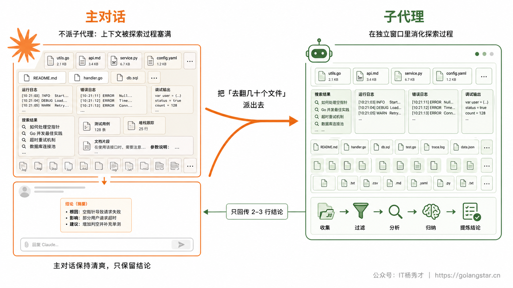
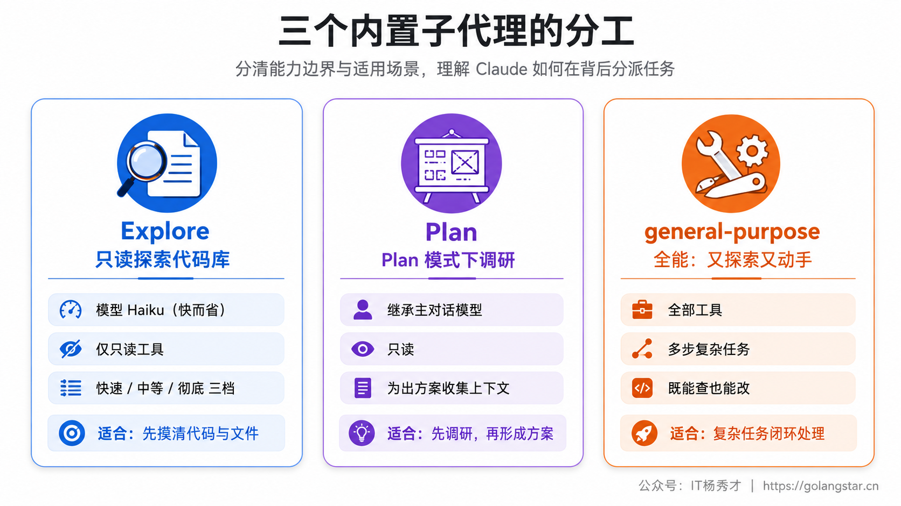
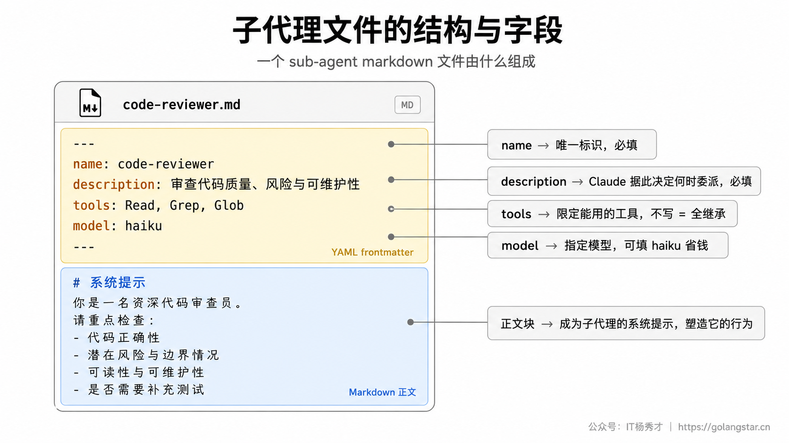
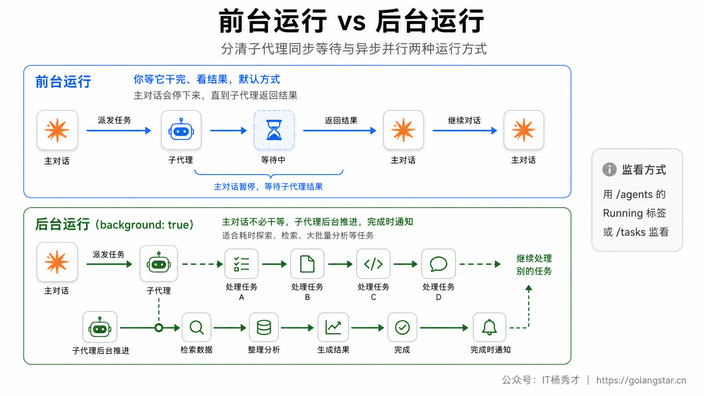
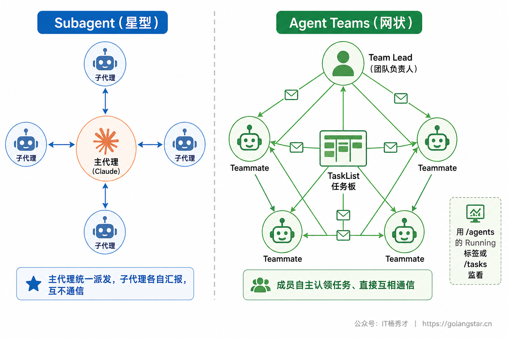
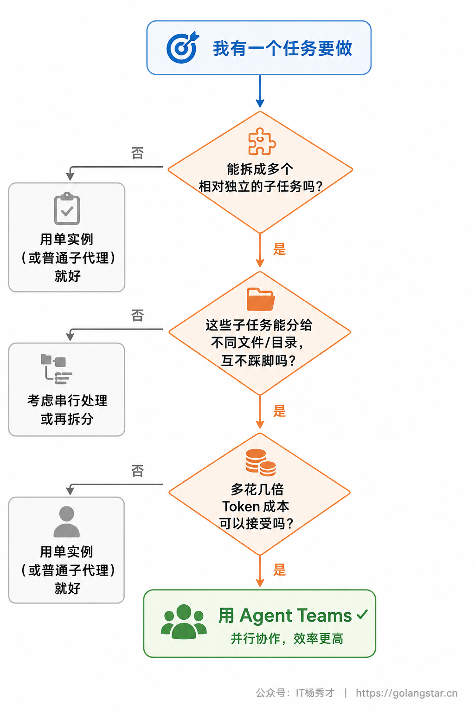

用 Claude Code 干一件大事时，你会发现一个矛盾：要让它把活干好，得让它先去翻一大堆文件、读一堆日志、跑一堆搜索——但这些过程产物会把主对话的上下文塞得满满当当，等真正要它干活时，上下文里已经堆了一屏屏你再也不会回看的搜索结果。聊得越久，它反而越糊涂。

子代理就是解决这个矛盾的。它让 Claude 把某类活派给一个独立的小助手去干：那个助手在自己单独的上下文窗口里折腾，干完只把结论交回来，过程中的一地鸡毛留在它自己那边，不污染你的主对话。这一篇讲透子代理：它怎么省上下文、内置的几个怎么用、怎么定义你自己的、怎么在前台后台跑和监看，以及更进一步的 Agent Teams 多代理并行协作。

## **1. 子代理是什么**

子代理（subagent）是一个专门干某类活的独立 Claude 实例。它和主对话最关键的区别是：拥有自己独立的上下文窗口、自己的系统提示、自己的工具权限。当 Claude 遇到一个匹配某子代理职责的任务时，就把它委派出去，子代理独立干完，只把结果摘要交回主对话。

它带来的最大好处是保住上下文。设想你让 Claude 在一个大项目里查清楚某个功能是怎么实现的：如果它在主对话里直接搜，几十个文件的内容会一股脑灌进来，占掉大量上下文；如果它派一个子代理去查，子代理在自己的窗口里读完几十个文件，回来只给你一句两三行的结论，那几十个文件的原文根本不进你的主对话。一句话：**探索的过程留在子代理那边，只有结论回到你这边。**



除了省上下文，子代理还有几个用处：可以给它限定只能用某些工具（比如一个只读的审查代理，不许它改文件），可以给它指定更便宜的模型（简单的活派给 Haiku 省钱），可以给它写一段专精某领域的系统提示（让它当一个专职的安全审查员）。它们在 `~/.claude/agents/` 里定义一次，所有项目都能复用。

判断什么时候该用子代理，有个简单标准：当一个支线任务会往主对话灌入一大堆你之后不会再看的东西（搜索结果、日志、整文件内容）时，就派子代理去干。而当你发现自己反复在派同一种活、给同样的指令时，就该把它固化成一个自定义子代理。

## **2. 内置子代理**

你不用从零开始，Claude Code 自带几个内置子代理，它会在合适时自动调用，多数时候你甚至感觉不到。

`Explore` 是一个快速只读的探索代理，专门用来搜索和分析代码库。它用速度快、成本低的 Haiku 模型，只有只读工具（不能写、不能改）。当 Claude 需要在不改动代码的前提下搞清楚代码库里某件事时，就派它去——它读完一堆文件，只把发现带回来，探索结果不进你的主对话。调用时 Claude 还会指定彻底程度：快速查一下、中等探索、或非常彻底地全面分析。

`Plan` 是 Plan 模式下专用的研究代理。当你在 Plan 模式让 Claude 先调研再给方案时，它把代码库调研派给 Plan 子代理，这样探索的输出待在独立窗口里，主对话保持只读、干净。

`general-purpose` 是个全能代理，能用全部工具，应付那些既要探索又要动手、需要多步推理的复杂任务。当一个活既要查、又要改、还要分好几步走时，Claude 会派它。



这些内置代理在交互式会话里总是可用，由 Claude 自动调度，你一般不必手动点名。知道它们存在，主要是为了理解 Claude 干活时那些一闪而过的「正在用 Explore 探索」是怎么回事。

## **3. 定义你自己的子代理**

内置的不够用时，你可以造专属子代理。最省心的方式是用 `/agents` 命令，它会打开一个引导式界面，一步步带你建。

在 Claude Code 里敲 `/agents`，切到 Library 标签，选新建、再选个人级（存到 `~/.claude/agents/`，所有项目可用）或项目级。然后可以让 Claude 帮你生成——你用一句话描述这个代理是干嘛的，它会自动写好标识名、描述和系统提示。接着选这个代理能用哪些工具（只读审查代理就只勾只读工具）、用哪个模型、配个颜色方便在界面里区分，保存即可立即生效。


界面背后，每个子代理就是一个带 YAML frontmatter 的 markdown 文件，存在 `.claude/agents/`（项目级）或 `~/.claude/agents/`（个人级）。你也可以直接手写这个文件。一个最简单的代码审查子代理长这样：

```markdown
---
name: code-reviewer
description: 审查代码的质量、安全和最佳实践。改完代码后主动调用。
tools: Read, Glob, Grep
model: sonnet
---

你是一名资深代码审查员。被调用时，分析代码并就质量、安全、
最佳实践给出具体、可操作的反馈：解释问题、贴出当前代码、给出改进版。
```

frontmatter 定义这个代理的配置，下面的正文就是它的系统提示——子代理只拿到这段系统提示（加上工作目录等基本环境信息），不会拿到 Claude Code 完整的系统提示，所以它的行为完全由你这段话塑造。两个字段是必填的：`name` 是唯一标识（小写字母加连字符），`description` 告诉 Claude 什么时候该委派给它——这个描述写得越准，自动委派触发得越对。

其余字段都是可选的，常用的几个值得记住：`tools` 限定它能用的工具（不写就继承主对话的全部）；`model` 指定它用哪个模型（`haiku`/`sonnet`/`opus` 或 `inherit` 跟随主对话）；`disallowedTools` 反向地从继承的工具里去掉某几个；`color` 设界面显示颜色。



文件级子代理在会话启动时加载，所以直接在磁盘上新建或改了文件后，要重启会话才生效（通过 `/agents` 界面建的则立即生效）。项目级子代理（`.claude/agents/`）提交到 git 后，团队每个人都能用、还能一起改进，是把团队的专家经验沉淀下来的好办法。

下面三个开箱即用的模板，覆盖最常见的几类支线活，复制到 `~/.claude/agents/` 改改就能用。第一个是只读的代码审查员，专门在你写完一段代码后帮你挑毛病：

```markdown
---
name: code-reviewer
description: 改完一段代码后调用，审查质量、安全与最佳实践，只读不改。
tools: Read, Glob, Grep
model: sonnet
---

你是一名资深代码审查员。被调用时：
1. 先看清这次改动涉及哪些文件
2. 逐项检查：命名、错误处理、边界情况、安全风险、是否有重复逻辑
3. 按「严重 / 建议 / 可选」三档给出问题，每条都贴出问题代码并给改进版
不要改动任何文件，只输出审查意见。
```

第二个是调试专家，专门接「报错了帮我定位」这类活，派它去读日志、复现、查根因，主对话不必被一大堆栈信息淹没：

```markdown
---
name: debugger
description: 遇到报错、测试失败、异常行为时调用，定位根因并给出修复方案。
tools: Read, Glob, Grep, Bash
model: sonnet
---

你是调试专家。被调用时：
1. 复述错误现象与触发条件
2. 定位出错的具体文件和行，沿调用链追根因
3. 给出最小修复方案，并说明为什么这样改
先解释清楚根因再动手，不要盲目试错。
```

第三个是测试编写员，指定用便宜的 Haiku 跑批量的补测试工作，省钱又快：

```markdown
---
name: test-writer
description: 需要为某个文件或函数补单元测试时调用。
tools: Read, Glob, Grep, Write, Edit, Bash
model: haiku
---

你负责补单元测试。被调用时：
1. 读目标文件，识别它用的测试框架与现有测试风格
2. 覆盖正常路径、边界值、异常输入
3. 写完真实跑一遍测试，确认通过再交付
保持与项目既有测试一致的风格和目录结构。
```

这三个一摆出来，子代理的用法就具体了：每个都是一段专精的系统提示加一组收紧的工具权限，Claude 在遇到对应的活时按 `description` 自动派给它们，你也能直接点名调用。

## **4. 控制子代理的能力**

子代理强大，但你往往希望它别太放飞。两个维度的控制最常用。

一是限定工具。用 `tools` 字段给白名单（只允许列出的这几个），或用 `disallowedTools` 给黑名单（从继承的全部工具里去掉这几个）。比如一个研究代理，你只想让它读、不想让它写，就 `tools: Read, Grep, Glob, Bash`，它就碰不了 Write 和 Edit。两者都设时，先应用黑名单、再在剩下的里按白名单解析。

二是选模型。这是控制成本的关键。子代理的活如果简单（搜代码、读文件、做格式化检查），指定 `model: haiku` 能明显省钱省时；要做复杂分析的，才用 `opus`。一个常见搭配是让负责调度的主对话用强模型，把大量并行的探索、执行类支线派给便宜模型的子代理——既保证决策质量，又压住总成本。

还有个进阶选项 `isolation: worktree`：让子代理在一个临时的 git worktree（仓库的一份隔离副本）里干活，它的改动不会直接动你当前的工作区，干完没产生改动还会自动清理。当你让多个子代理并行改文件、又怕它们互相踩脚时，这个隔离很有用。

除了工具和模型，还有几个 frontmatter 字段在特定场景很值钱。`permissionMode` 控制子代理的权限模式（`default` 每步问、`acceptEdits` 自动接受改动、`plan` 只读规划等），让一个你信任的执行型子代理少打扰你。`skills` 把指定的技能在启动时就预加载进子代理的上下文（注入的是完整技能内容，不只是描述），适合让一个子代理一上来就带着某套专门流程干活。`maxTurns` 给它设一个最多折腾几轮的上限，防止某个子代理在死胡同里无限打转。

最值得单独一提的是 `memory`——给子代理开持久记忆。设成 `user`、`project` 或 `local`，子代理就有了一个跨会话的记忆目录，能把它在一次次任务里积累的洞察（比如这个代码库的惯用模式、反复出现的问题）记下来，下次再被调用时带着这些经验上场。一个长期服务于同一个项目的审查代理，开了持久记忆后会越用越懂你的项目。

## **5. 前台与后台运行**

子代理可以在前台跑——你等着它干完、看它的结果，这是默认方式。但有些活耗时长（跑一整套测试、做一次彻底的代码库分析），你不想干等，可以让它在后台跑。

让一个子代理始终后台运行，在它的 frontmatter 里加 `background: true`。后台子代理启动后，你的主对话可以继续干别的，它在背后推进，干完通知你。用 `/agents` 的 Running 标签能看到当前在跑和刚结束的子代理，可以打开查看或停掉它；`/tasks` 则列出当前会话后台正在跑的所有东西。



更进一步，整个会话也能丢到后台：用 `/background` 把当前会话变成一个后台代理、腾出你的终端，之后用 `claude agents` 监看它。这适合那种你交代清楚了、可以放手让它自己跑很久的大任务。

## **6. Agent Teams 多代理并行协作**

子代理是星型结构：主代理派活、子代理干完汇报，子代理之间互不通信。当任务复杂到需要多个角色像真实开发团队那样**互相沟通、并行推进**时，就轮到 Agent Teams 上场了。这是一项较新的、偏实验性的能力，理解它要先看清它和子代理的根本差别。



在 Agent Teams 里，有一个 Team Lead 负责分析需求、拆解任务、创建团队、统筹结果；若干个 teammate 是独立的 Claude 实例，各有自己完整的上下文窗口和工具权限，能自主从一块共享的任务板上认领任务、并通过一套消息系统直接互相沟通。任务板用 pending / in_progress / completed 管理状态，还带依赖关系和文件锁，避免两个成员同时改同一个文件冲突。这套东西全部落在本地文件系统上，透明可查。

它的价值不在于「更快」，而在于「更完整、更专业」。一个典型对比：让单个实例从头写一个稍复杂的项目，往往写到一半因上下文不够而功能缩水、细节丢失；而一个分了架构、战斗、UI、音效等角色的团队并行来做，各管一摊、还能就接口对接互相确认，最终交付的完整度和代码量都高出一截。代价是 Token 消耗会涨到单实例的好几倍——成员越多、协调越多，成本越高，而且不是线性增长。

正因为成本高，用不用 Agent Teams 要挑场景。它适合那种**能拆成多个相对独立、又能分给不同文件去做的子任务**的活：大型系统重构（多模块并行分析）、多角度代码审查（安全、性能、错误处理各派一个）、前后端基于约定好的接口并行开发、并行写多份文档。它不适合简单小改（启动和协调的开销比干活本身还大）、高度串行没有并行空间的任务、以及对成本敏感的场景。



几条用 Agent Teams 的经验值得提前知道。其一，先把接口约定好再并行开发（合同优先），让各成员对着同一份接口规范写，避免最后对不上返工。其二，给成员合理分配模型——Team Lead 用强模型保证拆解和统筹质量，普通成员用性价比高的模型干具体活。其三，任务粒度别太大也别太碎，每个任务能在十几二十分钟内干完比较合适。其四，启动成员时要主动喂足初始上下文，因为每个成员开局时对话历史是空的，项目背景、技术栈、结构都得交代清楚。

## **7. 子代理还是 Agent Teams**

两者都让多个 AI 一起干活，但定位不同，别混用。

需要把某类支线活隔离出去、保住主对话上下文，或者反复派同一种专精任务——用子代理。它轻量、即派即用、由主代理统一调度，是日常最常用的。需要多个角色像团队那样并行推进、还要彼此沟通对接的大工程——才上 Agent Teams，它重、贵、偏实验性，是为复杂协作准备的重武器。

一个朴素的判断：日常开发，子代理足够；只有当你面对的是一个明显能拆成多人并行、且并行收益大到值得多烧几倍 Token 的大活时，才考虑 Agent Teams。

## **8. 常见问题**

**Q：自定义子代理建好了，Claude 不调用它？**
多半是 `description` 写得不够具体。Claude 靠这个描述判断该不该委派，把它写清楚——这个代理是干什么的、什么时候该用，触发就准了。也可以直接点名让它用，比如「用 code-reviewer 这个代理审查一下这个项目」。

**Q：手写的子代理文件不生效？**
文件级子代理在会话启动时加载，直接改磁盘文件后要重启会话。通过 `/agents` 界面建的则立即生效，不用重启。

**Q：子代理会拖慢我吗？**
前台子代理你要等它干完。耗时长的活给它加 `background: true` 丢后台，主对话就能继续干别的，干完它再通知你。

**Q：怎么省子代理的钱？**
给简单的探索、检查类子代理指定 `model: haiku`，把贵模型留给真正需要复杂推理的活。这是控制多代理成本最直接的手段。

**Q：Agent Teams 稳定吗？能用在重要项目上吗？**
它目前偏实验性，可能有不稳定的地方。重要项目先备份、先在小范围试，确认顺手了再用于关键任务。

## **9. 小结**

子代理的本质是上下文管理：把那些会把主对话搞乱的探索、调研、批量执行隔离到独立窗口里，主对话只收一份干净的结论。用好它，你既能让 Claude 放手去翻几十个文件，又不必担心主对话被噪音淹没；再配合工具限定和便宜模型，还能把成本和风险一起摁住。

从内置的 Explore 开始感受这种隔离，再把你反复派的活固化成自定义子代理；当任务大到一个人忙不过来、需要多个角色并行协作时，Agent Teams 是更上一层的选择。记住它们的分工：子代理管隔离与复用，Agent Teams 管团队级并行——按活的大小选对工具，AI 才真正像一支能调度的队伍替你干活。

<div style="background-color: #f0f9eb; padding: 10px 15px; border-radius: 4px; border-left: 5px solid #67c23a; margin: 20px 0; color:rgb(64, 147, 255);">

<h2><span style="color: #006400;"><strong>关注秀才公众号：</strong></span><span style="color: red;"><strong>IT杨秀才</strong></span><span style="color: #006400;"><strong>，回复：</strong></span><span style="color: red;"><strong>面试</strong></span></h2>

<div style="text-align: center;"><span style="color: #006400; font-size: 28px;"><strong>领取后端/AI面试题库PDF</strong></span></div>


<div style="text-align: center; margin-top: 22px; padding-top: 20px; border-top: 1px solid #c2e7b0;">
<div style="color: #006400; font-size: 20px; font-weight: bold;">🔥 配套实战项目，拆得开、跑得起、能写进简历</div>
<div style="color: red; font-size: 16px; font-weight: bold; margin-top: 8px;">多 Agent 编排 + RAG 混合检索 · 31 篇深度教程 + 50+ 面试题</div>
<a href="/projects/dev-support.html" style="display: inline-block; margin-top: 14px; background: #ff7a18; color: #fff; font-size: 18px; font-weight: bold; padding: 10px 28px; border-radius: 24px; text-decoration: none;">点击查看 DevSupport AI 实战项目 →</a>
</div>
</div>
