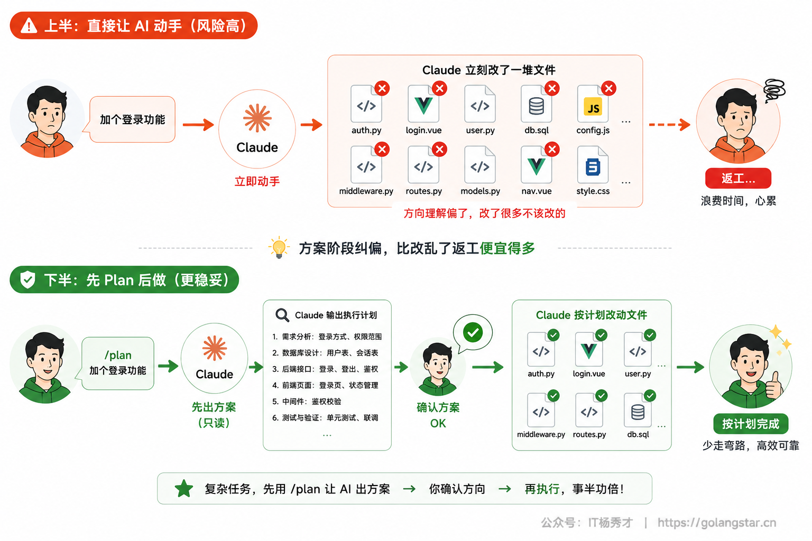
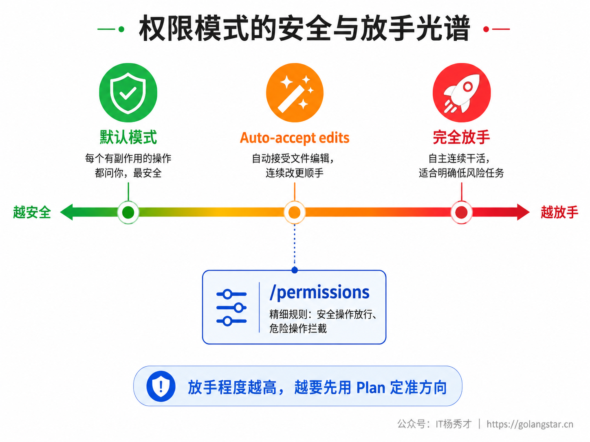
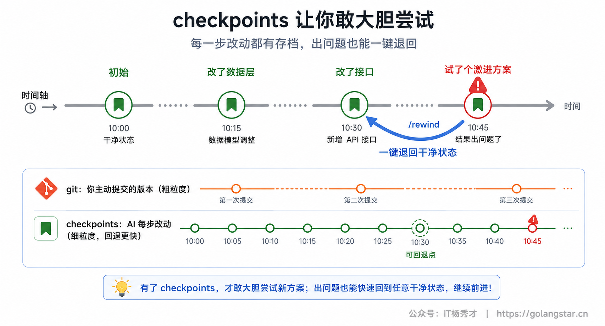
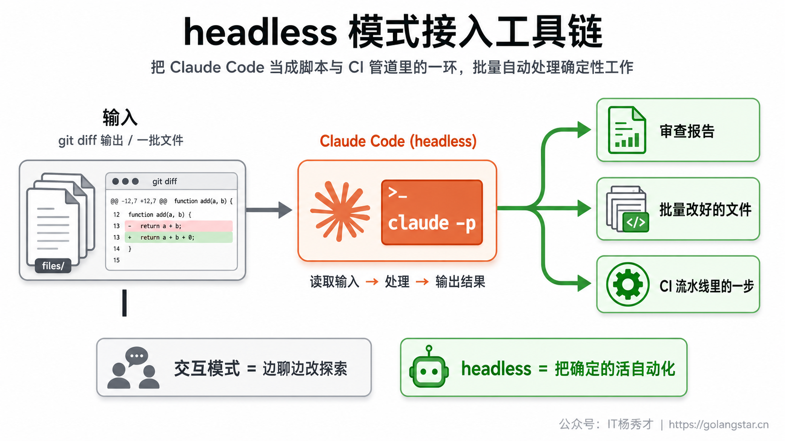

学到这里，Claude Code 的各项能力你大都见过了。但会用一个个功能，和能把它们串成一套顺手的工作流，是两码事。真正高效的人，不是记住了最多命令，而是养成了一套稳定的节奏：什么时候先让它出方案、什么时候放手让它自动改、改坏了怎么一键退回、上下文乱了怎么收拾、能不能把它塞进脚本批量干活。

这一篇把前面散落的能力收拢成实战工作流，再盘点一批能立竿见影的高效技巧。它不引入新功能，而是教你怎么把已有的功能用出乘数效应。

## **1. 先想后做的 Plan 模式**

新手最容易犯的错，是抛一句需求就让 AI 直接上手改代码。活一复杂，它往往理解偏了方向，等你发现，一堆文件已经改乱了。Plan 模式就是用来治这个的：让 Claude 先把方案想清楚、讲给你听，你确认后它再动手。

进入方式有两个：按 `Shift+Tab` 在几种模式间切换到 Plan 模式，或直接敲 `/plan`、还能带上任务（`/plan 给登录加上记住我功能`）。在 Plan 模式下，Claude 只读不改——它会去看相关代码、理清思路，然后给你一份分步计划，等你点头才开始执行。

养成「复杂任务先 Plan」的习惯，收益巨大：方案阶段纠偏的成本，远低于代码改乱后返工的成本。简单的小改动可以直接说，但凡涉及多个文件、要做架构取舍的活，先让它出方案。



## **2. 权限模式与把关**

Claude Code 有几种权限模式，决定它干活时要不要每步都问你。理解它们，才能在「安全」和「顺手」之间找到适合你的挡位。

默认模式下，涉及改文件、跑命令这类有副作用的操作，Claude 执行前都会问你一句，你确认才做——最安全，但频繁打断。Auto-accept edits 模式（同样用 `Shift+Tab` 切换）下，它会自动接受文件编辑，不再每次问，适合你已经信任它的方向、想让它连续多改几个文件时。还有完全放手的模式，让它自主连续干活，适合明确、低风险的任务——但放手程度越高，越要先用 Plan 模式把方向定准。

更精细的控制靠 `/permissions`：你可以设规则，把安全的操作（读文件、跑测试）固定放行、不再询问，把危险的操作（删文件、强推、部署）固定拦截。把这套规则配好，既挡住了风险，又免去了对安全操作的反复确认。



## **3. 改坏了一键回退**

放手让 AI 改代码，心里总有点怕：万一它改出一堆问题怎么办？Claude Code 的 checkpoints（检查点）就是这颗定心丸。它在干活过程中自动记录检查点，一旦发现 AI 把代码改坏了，用 `/rewind` 就能把代码、或连同对话一起，退回到之前某个干净的点。

这个能力的价值不只是「能后悔」，更在于它让你敢大胆尝试。反正随时能退回，你就可以放手让 AI 试一个激进的方案、改一大片代码，效果不好 `/rewind` 一下满血复活，不必小心翼翼。它和 git 是两层保险：git 管的是你主动提交的版本，checkpoints 管的是两次提交之间 AI 的每一步改动，粒度更细、回退更快。



## **4. 管好上下文这条命脉**

AI 越聊越笨，十有八九是上下文乱了。三个命令是你日常收拾上下文的主力，把它们用成肌肉记忆，AI 的状态就稳。

开始一件和之前无关的新任务，先 `/clear` 清空重来——这是最该养成的习惯，很多「AI 变笨」其实是旧任务的内容还堆在上下文里干扰。任务确实要长时间连续推进、聊到上下文快满时，用 `/compact` 把前面的内容压缩成摘要、保留关键信息接着干，还能 `/compact 重点保留数据库设计` 指定别压掉你最在意的部分。拿不准上下文还剩多少、被什么占着，敲 `/context` 看那张占用网格，一目了然。

一个简单的判断：新任务用 `/clear`，长任务中途用 `/compact`，看占用用 `/context`。把上下文当成需要主动维护的资源，而不是任由它越堆越满，是高手和新手最明显的差距之一。


## **5. headless 模式与管道**

Claude Code 不只是个交互式终端，它还能以 headless（无界面）模式跑，让你把它塞进脚本和工具链里批量干活。核心是 `-p` 参数：`claude -p "你的指令"` 会非交互地执行一次、把结果打印出来就退出。

这打开了自动化的大门。因为它读标准输入、写标准输出，就能和其他命令用管道串起来。比如把改动直接喂给它审查：

```bash
git diff | claude -p "审查这段改动，列出潜在 bug 和风险点"
```

或者批量处理一批文件、生成报告、接进 CI 流水线让它在每次提交时自动做一遍检查。凡是你能用一句话描述、又需要重复跑的活，都能用 `-p` 固化成脚本。

几个让 headless 更好用的点：可以让它输出结构化结果方便后续程序解析，可以在循环里对一批文件逐个跑（`for f in src/*.js; do claude -p "给 $f 补注释"; done`），也可以把它的输出再喂给下一条命令形成流水线。交互模式适合探索式地一边聊一边改，headless 模式适合把成熟的、确定的任务自动化掉——前者是你和 AI 一起想，后者是你把想清楚的活交给 AI 批量执行。两者配合，才把 Claude Code 的能力榨干。



## **6. 定时与循环任务**

有些活你希望它定期自动跑，或在一个会话里反复跑，Claude Code 也支持。

`/schedule`（也叫 routines）让你创建定时任务，跑在 Anthropic 托管的云端，按你设的周期自动执行——比如每天早上自动审查昨天的 PR、每周巡检一遍依赖更新。设置是对话式的，Claude 会引导你一步步配好。`/loop` 则是在当前会话里把一个指令反复跑，可以带间隔（`/loop 5m 看看部署完成了没`），也可以省略间隔让 Claude 自己掌握节奏——适合盯一个会变化的状态、或对一个任务反复迭代直到满意。

这两个能力把 Claude Code 从「你叫一次它干一次」扩展成「能主动按节奏替你盯事、办事」，是迈向自动化协作的一步。

## **7. 让 AI 越来越懂你的项目**

同一套功能，在一个 AI 摸不着头脑的项目里用，和在一个它了如指掌的项目里用，效率天差地别。区别就在于你有没有给项目建一份知识库。这是高效工作流里最容易被忽略、却回报最高的一项投入。

最核心的是 `CLAUDE.md`，放项目概述、技术栈、目录结构、代码规范、常见任务的做法、关键的数据库表结构。它每次对话自动加载，等于让 AI 一上来就懂你项目的底细，不必你每次从头交代。除了它，再建两类文档很值：`docs/troubleshooting.md` 记常见问题和解决方案，下次撞上同样的坑，AI 一查就有答案；`docs/decisions/` 记重要的技术决策（背景、决定、理由、后果），让 AI 改相关代码时知道当初为什么这么设计，不会好心改坏。

这份知识库不是一次写完的，而是边干边长：解决了一个棘手问题就记一笔，定了一个重要决策就存档。它积累得越厚，AI 给的方案就越贴合你的项目，工作流的整体效率也水涨船高——这是「持续改进」在 Vibe Coding 里最实在的落点。

## **8. 一套完整的实战工作流**

把前面的能力串起来，一个开发任务从头到尾的高效节奏大致是这样的。

先理清需求，把要做什么、预期结果说清楚。复杂任务用 `/plan` 让 Claude 出方案，你审一遍、纠偏，确认方向对了再让它执行。执行时，简单连续的改动可以切到 auto-accept 让它一气呵成，关键节点你盯着。每完成一小步就验证——改一处、测一处，别攒一大堆再一起测。中途如果它把某处改坏了，`/rewind` 退回上一个干净检查点重来。上下文聊长了，`/compact` 压一下接着干；换新任务了，`/clear` 清空重开。最后用 `/diff` 看一遍改了什么、`/security-review` 过一遍安全，再让它按规范生成提交信息提交。

这套节奏的核心，是把「想清楚、做决策、把关质量」攥在自己手里，把「具体编码、查找、重复劳动」交给 AI。小步快跑、及时验证、随时能退，你既放手得快，又始终掌控全局。


## **9. 高效习惯盘点**

最后盘一批能立刻见效的小习惯，它们不依赖某个具体功能，而是和 AI 协作的通用心法。

**一次只做一件事。** 把大任务拆成小任务，每完成一个就验证，别让它一口气改一大片——任务越小，出错越好查、返工越便宜。

**描述越具体越好。** 别说「这个功能有问题」，要说「点提交后表单没反应，控制台报了某某错、在第 23 行」。给得越准，它定位越快。

**善用 `@` 和 `` ! ``。** 用 `@文件名` 把相关文件直接引用进上下文当参考；用 `` ! `` 在对话里直接跑 shell 命令、把结果带进来。让 AI 基于真实的代码和数据干活，而不是凭空猜。

**改坏了双击 Esc 撤销。** 想中断它当前的动作、回到上一步，双击 `Esc` 是最快的；要退更早的状态用 `/rewind`。

**把好方案沉淀下来。** 解决了一个棘手问题，把方案记进项目文档或做成命令/技能。同样的活下次就不必从头交代，团队也能共享。

**理解它写的代码，别盲目复制。** AI 生成的代码要审、要测，可能有逻辑错误或安全隐患。最终质量靠你把关——它是让你更高效的工具，不是替你负责的人。

## **10. 小结**

Claude Code 的功能再多，真正决定效率的是你怎么把它们组织成工作流。先 Plan 想清楚再动手，用权限模式在安全和顺手间选挡位，靠 checkpoints 大胆尝试又随时能退，主动用三个命令管好上下文这条命脉，再用 headless 和定时任务把确定的活自动化——这套节奏跑顺了，你和 AI 的协作就从「一问一答」升级成了「分工明确的高效配合」。

说到底，所有技巧都服务于同一个分工：你负责想清楚做什么、做决策、把关质量，AI 负责执行、查找、处理重复劳动。守住这条分工，小步快跑、及时验证、随时可退，你就能既享受 AI 带来的速度，又始终掌控着代码和方向。

<div style="background-color: #f0f9eb; padding: 10px 15px; border-radius: 4px; border-left: 5px solid #67c23a; margin: 20px 0; color:rgb(64, 147, 255);">

<h2><span style="color: #006400;"><strong>关注秀才公众号：</strong></span><span style="color: red;"><strong>IT杨秀才</strong></span><span style="color: #006400;"><strong>，回复：</strong></span><span style="color: red;"><strong>面试</strong></span></h2>

<div style="text-align: center;"><span style="color: #006400; font-size: 28px;"><strong>领取后端/AI面试题库PDF</strong></span></div>


<div style="text-align: center; margin-top: 22px; padding-top: 20px; border-top: 1px solid #c2e7b0;">
<div style="color: #006400; font-size: 20px; font-weight: bold;">🔥 配套实战项目，拆得开、跑得起、能写进简历</div>
<div style="color: red; font-size: 16px; font-weight: bold; margin-top: 8px;">多 Agent 编排 + RAG 混合检索 · 31 篇深度教程 + 50+ 面试题</div>
<a href="/projects/dev-support.html" style="display: inline-block; margin-top: 14px; background: #ff7a18; color: #fff; font-size: 18px; font-weight: bold; padding: 10px 28px; border-radius: 24px; text-decoration: none;">点击查看 DevSupport AI 实战项目 →</a>
</div>
</div>
