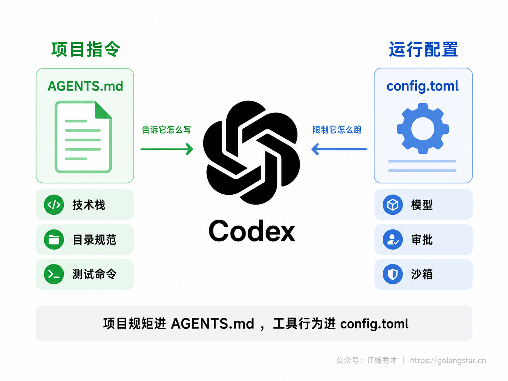
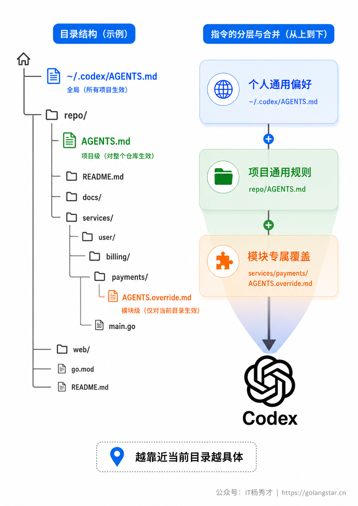
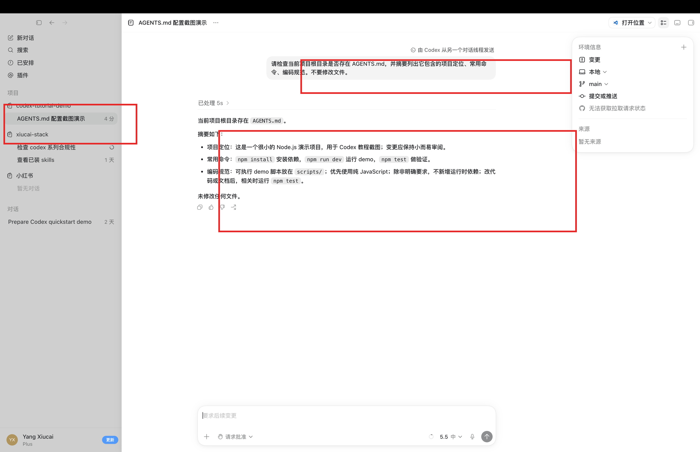
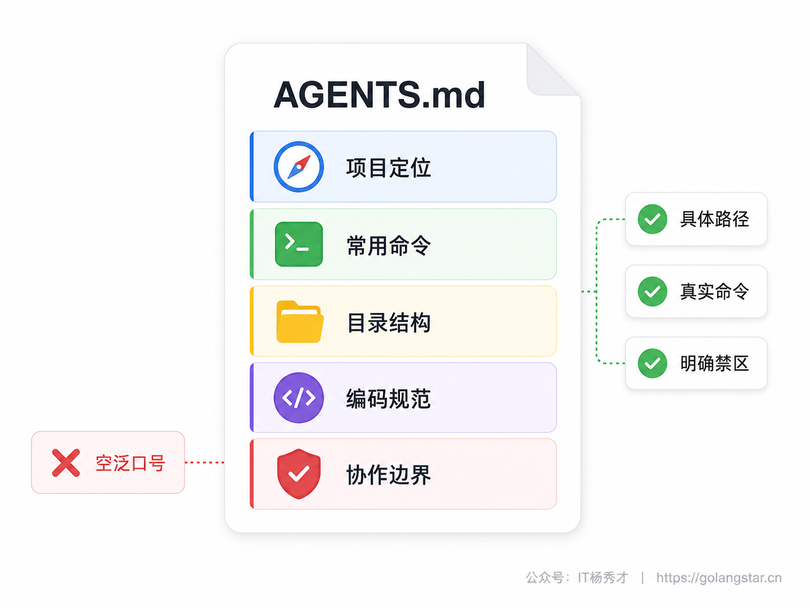
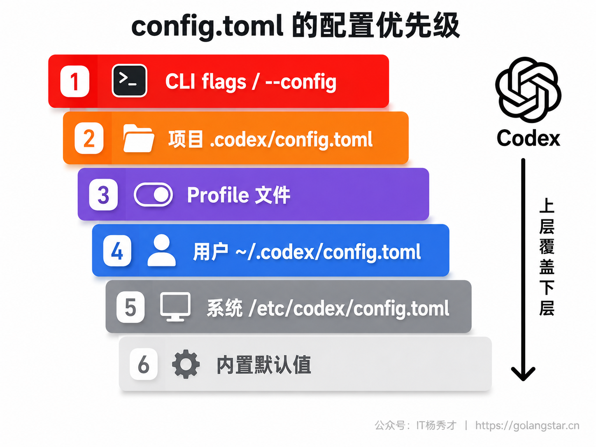
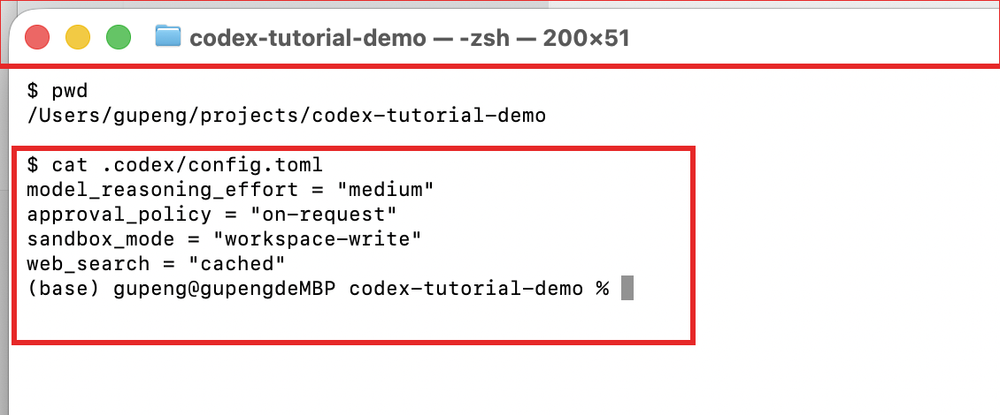
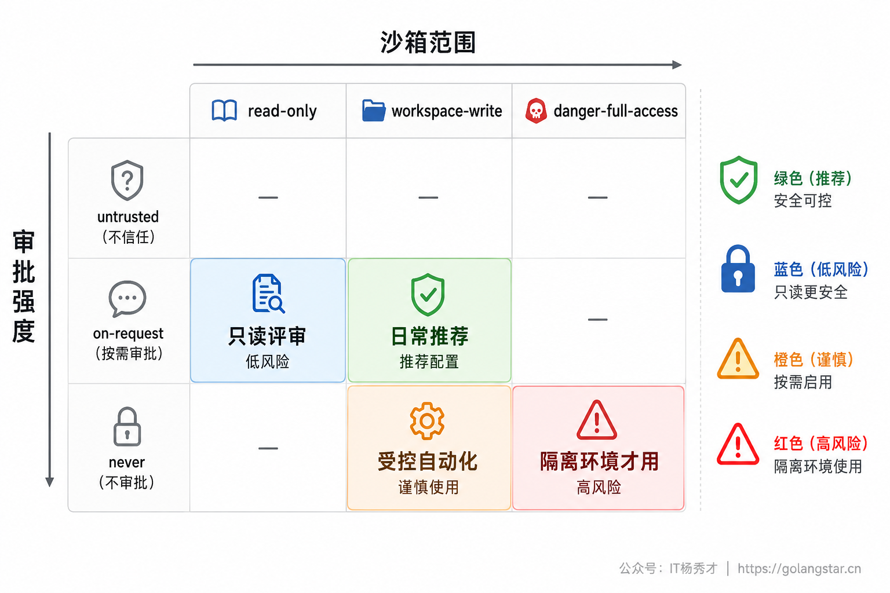
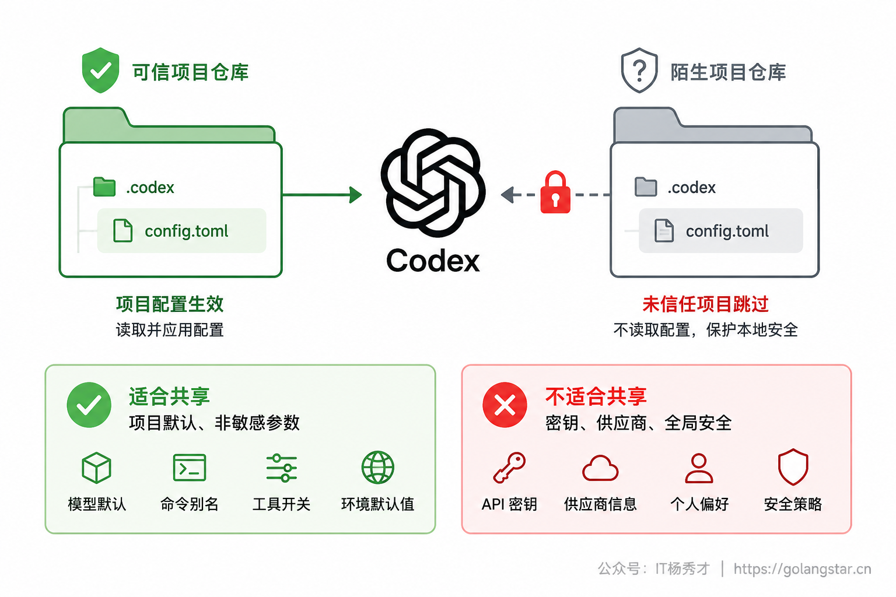
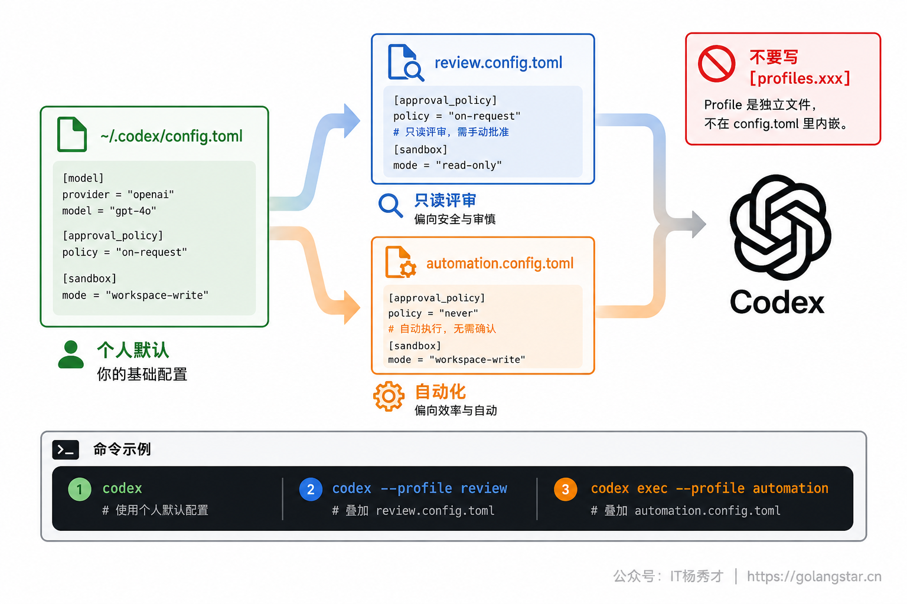
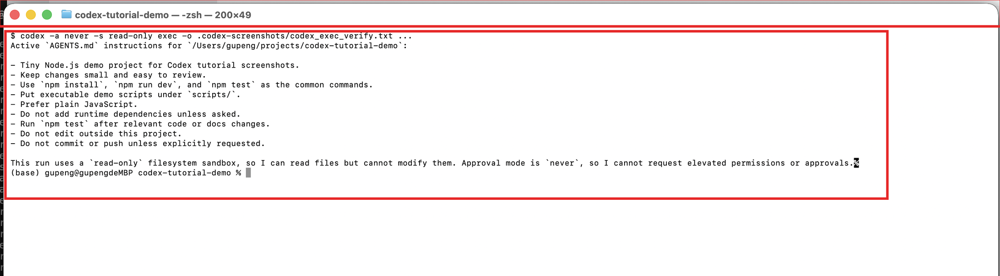

用 Codex 做真实项目，很快会遇到两个问题：它不一定知道这个项目的目录约定、测试命令、代码风格；它也不一定按你舒服的权限边界运行，比如什么时候要问你、能不能联网、能不能改工作区外的文件。前一个问题靠 `AGENTS.md` 解决，后一个问题靠 `config.toml` 解决。

这两个文件不是装饰文档，而是 Codex 日常工作的控制面。`AGENTS.md` 写项目规矩，让 Codex 在生成代码前先知道这个仓库怎么做事；`config.toml` 写运行配置，让 Codex 按固定的模型、沙箱、审批和 Profile 行为启动。把这两层配好，Codex App、CLI、IDE 扩展里的协作体验会稳定很多。

## **1. 两类控制面**

`AGENTS.md` 和 `config.toml` 最容易被混在一起。记住一句话就够了：`AGENTS.md` 是写给模型看的项目指令，`config.toml` 是写给 Codex 程序看的运行参数。

`AGENTS.md` 适合写自然语言规则，比如项目技术栈、目录结构、编码规范、测试命令、不要做什么。它可以提交到仓库，团队成员共享同一套项目指令。`config.toml` 适合写 TOML 配置，比如使用哪个模型、沙箱模式、审批策略、Web 搜索策略、MCP 服务、Profiles。它通常放在个人目录，项目级配置只应该放在可信仓库的 `.codex/config.toml` 里。

| 配置对象 | 文件 | 读者 | 内容 | 是否适合进仓库 |
| --- | --- | --- | --- | --- |
| 项目指令 | `AGENTS.md` | Codex 模型 | 技术栈、目录、规范、命令、禁区 | 适合 |
| 运行配置 | `~/.codex/config.toml` | Codex 程序 | 模型、沙箱、审批、Profiles、MCP | 通常不适合 |
| 项目运行配置 | `.codex/config.toml` | Codex 程序 | 仓库内可信配置 | 只在团队明确需要时提交 |



## **2. AGENTS.md 指令**

`AGENTS.md` 是 Codex 在开始工作前读取的项目指令文件。它不是 README 的重复版，也不是写给人看的长篇项目介绍，而是给 Coding Agent 准备的操作说明。写得好，Codex 少问、少猜、少犯项目规范错误；写得差，Codex 仍然会靠通用经验行动，遇到非标准项目结构时就容易跑偏。

一份合格的 `AGENTS.md` 至少要回答四个问题：这个项目是什么，代码该放哪里，任务该怎么验收，哪些事不能擅自做。对于小白读者，可以先从根目录一份文件开始，不必一上来拆很多层。

```markdown
# 项目指令

## 项目定位
- 这是一个订单管理服务，后端使用 Go，数据库使用 PostgreSQL。
- 主要代码在 `cmd/`、`internal/`、`pkg/` 三个目录。

## 常用命令
- 安装依赖：`go mod tidy`
- 运行测试：`go test ./...`
- 本地启动：`go run ./cmd/server`

## 编码规范
- 新增业务逻辑优先放在 `internal/service/`。
- HTTP 接口统一返回 `{ code, data, message }`。
- 数据库错误必须向上返回，不要吞掉错误。
- 新增公开函数要补测试，测试文件和被测文件放在同一目录。

## 协作边界
- 不要擅自引入新框架或大型依赖。
- 修改数据库 schema 前先说明影响范围。
- 生成代码后运行相关测试，并在回复里说明测试结果。
```

这个模板不追求全面，追求可执行。`代码要优雅` 这类句子没有可操作性，Codex 很难稳定执行；`新增公开函数要补测试`、`数据库错误必须向上返回`、`不要擅自引入新框架` 这种规则更容易落地。

### **2.1 加载顺序**

Codex 当前的 `AGENTS.md` 读取逻辑是分层的。第一层是全局层，默认在 `~/.codex`，也就是 `CODEX_HOME`。这一层会优先读取 `AGENTS.override.md`，如果没有，再读 `AGENTS.md`。全局层适合放个人通用偏好，比如回复语言、提交前自检习惯、测试优先级。

第二层是项目层。Codex 会从项目根目录开始，一路向当前工作目录查找指令文件。每一层目录最多取一个文件，优先级是 `AGENTS.override.md`，然后是 `AGENTS.md`，最后才是你在配置里声明的 fallback 文件名。越靠近当前工作目录的指令越具体，后面的规则可以覆盖前面更通用的规则。

一个常见结构是这样：

```text
~/.codex/AGENTS.md
your-repo/
  AGENTS.md
  services/
    payments/
      AGENTS.override.md
```

如果 Codex 在 `services/payments` 里工作，它会先拿到全局偏好，再叠加仓库根目录的通用项目规则，最后叠加支付模块的专属规则。`AGENTS.override.md` 不是随便起的名字，它在同一目录内优先级高于 `AGENTS.md`，适合临时或强约束场景。普通项目建议优先用 `AGENTS.md`，只有明确需要覆盖同目录规则时再用 override。



### **2.2 编写原则**

`AGENTS.md` 最怕写成一堵提示词墙。指令越长，维护成本越高，Codex 读取时也越容易被无关信息干扰。官方默认项目文档读取上限是 `project_doc_max_bytes = 32768`，也就是 32 KiB。超过上限后，后续内容可能不会被纳入有效指令链。与其堆满背景介绍，不如保留稳定、明确、经常影响代码行为的规则。

推荐把内容分成五类：项目定位、目录结构、常用命令、代码规范、协作边界。项目定位让 Codex 快速知道这是前端、后端、脚本工具还是全栈项目；目录结构让它知道代码该放哪；常用命令让它知道如何安装、启动、测试；代码规范让它少生成不合风格的实现；协作边界负责安全和团队约定，比如不要改生产配置、不要删除迁移文件、不要引入大依赖。

不推荐这样写：

```markdown
# 项目要求

请写出高质量代码，注意可维护性，遵守最佳实践，保持风格统一。
```

推荐改成这样：

```markdown
# 项目要求

- TypeScript 代码必须通过 `pnpm lint`。
- React 组件放在 `src/components/`，业务页面放在 `src/pages/`。
- 表单校验统一使用 Zod schema，不要在组件里散写校验逻辑。
- 新增 API 调用要放在 `src/services/`，不要直接在页面里写 fetch。
```

两者的差别不是文采，而是约束是否可执行。Codex 不能稳定执行抽象口号，但能按具体路径、命令、依赖边界和验收方式行动。



### **2.3 生成初稿**

第一次给旧项目写 `AGENTS.md`，可以让 Codex 先读项目再给草稿，但 Prompt 要限制它的输出范围。不要让它凭想象补规则，也不要让它把 README 重写一遍。

**不推荐的写法：**

```text
帮我写一个 AGENTS.md。
```

这个 Prompt 太短，Codex 可能只生成通用模板，和项目真实情况脱节。

**推荐的写法：**

```text
请先阅读当前仓库的目录结构、README、package.json 或 go.mod、测试配置和主要入口文件。

然后生成一份 AGENTS.md 草稿，要求：
1. 只写你能从仓库中确认的信息，不要猜测不存在的框架或命令
2. 分成项目定位、常用命令、目录结构、编码规范、协作边界五段
3. 命令必须来自项目真实文件，例如 package.json scripts、Makefile、go test 命令
4. 对不确定的地方用 TODO 标出，不要编造
5. 输出 markdown 内容即可，不要直接写入文件，等我确认后再落盘
```

这里的关键是让 Codex 先调查，再生成，而且要求它区分已确认信息和不确定信息。拿到初稿后，你再把团队真正关心的规范补进去，最后提交到项目根目录。



### **2.4 兼容文件**

有些团队已经有 `TEAM_GUIDE.md`、`.agents.md` 或内部规范文件，不想马上迁移到 `AGENTS.md`。Codex 支持通过 `project_doc_fallback_filenames` 配置 fallback 文件名。它的意思不是让你无限堆文档，而是在某一层目录没有 `AGENTS.override.md` 或 `AGENTS.md` 时，再尝试读取这些候选文件。

```toml
# ~/.codex/config.toml
project_doc_fallback_filenames = ["TEAM_GUIDE.md", ".agents.md"]
project_doc_max_bytes = 65536
```

这适合迁移期使用。长期看，团队最好统一一个主文件名，减少维护分叉。另一个需要说清的点是：`AGENTS.md` 正在成为 Coding Agent 领域常见的项目指令文件名，但不同工具对文件名、加载层级和覆盖规则的支持并不完全一样。不要因为 Codex 支持 `AGENTS.md`，就直接删除 Claude Code 的 `CLAUDE.md` 或 Cursor 的 rules；先确认团队正在使用的工具是否已经读取同一份文件，再做合并。

### **2.5 多工具迁移**

很多团队不是从零开始用 Codex，而是已经有 Claude Code 的 `CLAUDE.md`、Cursor 的 `.cursor/rules/*.mdc`，现在想把 Codex 也接进来。这时不要把旧文件一把复制成 `AGENTS.md`。不同工具的指令系统相似，但加载规则、作用域和支持的元数据不一样，直接复制容易把工具专属写法带进来。

迁移时建议分三步。第一步，把稳定的项目事实抽出来：技术栈、目录结构、测试命令、代码规范、禁区。这些内容与工具无关，适合进入 `AGENTS.md`。第二步，把工具专属内容留在原工具文件里：比如 Claude Code 的 Slash Commands、Cursor 的 rule frontmatter、某个工具的快捷键或 UI 操作，都不应该放进 Codex 的项目指令。第三步，跑一次指令审查，让 Codex 自己指出哪些规则不够具体、哪些规则像是其他工具的专属配置。

可以直接用这个 Prompt 做迁移审查：

```text
请对比当前项目里的 CLAUDE.md、.cursor/rules 目录和 AGENTS.md 草稿。

目标：
1. 找出三者共同的项目规则，建议合并进 AGENTS.md
2. 找出只属于 Claude Code 或 Cursor 的工具专属规则，不要迁移
3. 找出 AGENTS.md 里过于抽象或无法执行的条目
4. 输出迁移建议，不要直接改文件
```

如果团队同时使用多种 Coding Agent，更稳的做法是把通用项目规范沉淀到 `AGENTS.md`，把工具特性留在各自文件里。这样不会让 Codex 看到一堆无法执行的其他工具指令，也不会因为追求一份文件通吃，反而破坏已有工作流。

### **2.6 维护节奏**

`AGENTS.md` 不是一次写完就长期不动的文件。它应该跟着项目经验更新，但更新频率不能太高。每次 Codex 反复犯同一种错误，或者团队新增了一条稳定规范，就可以补进去；一次性任务、临时偏好、只对当前需求有效的限制，应该写在当次 Prompt 里，不要进入长期文件。

比较好的维护方式是把它当成项目里的轻量工程规范。修改 `AGENTS.md` 时，最好在 commit message 里说明原因，比如 `docs: clarify test command for Codex`，让团队知道这不是普通文档润色，而是在调整 Coding Agent 的行为边界。多人协作时，不建议把个人偏好写进项目 `AGENTS.md`，比如总是用某种语气回复、每次都解释得非常详细。这类偏好放到 `~/.codex/AGENTS.md` 更合适。

也要定期删旧规则。项目重构后，旧目录、旧命令、旧依赖如果还留在 `AGENTS.md` 里，Codex 会优先相信这些文字，结果比没有指令更麻烦。每次改目录结构、换测试工具、迁移包管理器，都应该顺手检查 `AGENTS.md`。这份文件越短、越准、越贴近当前仓库，实际效果越好。

## **3. 指令验证**

写完 `AGENTS.md` 后，不要靠感觉判断是否生效。最稳的做法是让 Codex 在一个低风险请求里说明当前读取到的指令来源。

```bash
codex --ask-for-approval never "Summarize the current instructions."
```

如果你要验证子目录规则，可以指定工作目录：

```bash
codex --cd services/payments --ask-for-approval never "Show which instruction files are active."
```

如果你怀疑配置或指令链没读到，可以开日志目录：

```bash
codex -c log_dir=./.codex-log --ask-for-approval never "Summarize the current instructions."
```

然后查看 `.codex-log` 里的日志。调试全局配置时，还可以临时改 `CODEX_HOME`，让 Codex 在一个干净目录里启动，避免被你平时的全局配置影响。

```bash
CODEX_HOME=$(pwd)/.codex codex exec "List active instruction sources"
```

这里的命令主要用于验证，不建议把 `--ask-for-approval never` 当成日常默认。`never` 只是避免一个只读检查任务频繁弹审批，真正写代码时仍建议使用更稳的审批和沙箱组合。

## **4. config.toml 配置**

`config.toml` 是 Codex 的本地配置文件。个人默认路径是 `~/.codex/config.toml`。Codex App、CLI、IDE 扩展会共享这些配置层，所以同一台机器上最好别把配置散落到多个地方。

最小可用配置可以这样写：

```toml
model = "gpt-5.5"
model_reasoning_effort = "medium"
approval_policy = "on-request"
sandbox_mode = "workspace-write"
web_search = "cached"
```

这几项分别控制模型、推理强度、审批策略、沙箱边界和 Web 搜索模式。新手不需要一开始把所有键都研究完，先把这五项配清楚，已经能覆盖大多数本地开发场景。

### **4.1 配置层级**

Codex 的配置不是只读一个文件，而是按层级叠加。优先级从高到低是：命令行参数和 `--config`，项目 `.codex/config.toml`，Profile 文件，用户配置，系统配置，内置默认值。越靠上越能覆盖下面。

| 优先级 | 来源 | 典型场景 |
| --- | --- | --- |
| 1 | CLI flags 和 `--config` | 临时覆盖一次模型或沙箱 |
| 2 | 项目 `.codex/config.toml` | 可信项目的团队级默认配置 |
| 3 | `--profile` 选择的 Profile 文件 | 只读审查、深度分析、自动化任务 |
| 4 | `~/.codex/config.toml` | 个人默认配置 |
| 5 | `/etc/codex/config.toml` | 机器级系统配置 |
| 6 | Codex 内置默认值 | 没有任何显式配置时使用 |

临时覆盖用 `-c` 很方便。比如只想这一次打开网络访问：

```bash
codex -c 'sandbox_workspace_write.network_access=true'
```

只想这一次换模型：

```bash
codex --model gpt-5.5
```

`-c` 写法的优先级很高，适合一次性实验，不适合长期团队约定。长期约定应该沉淀进 `config.toml` 或 Profile。





### **4.2 审批沙箱**

审批策略和沙箱模式是 `config.toml` 里最应该谨慎理解的两项。沙箱回答 Codex 技术上能做什么，审批策略回答 Codex 什么时候必须停下来问你。

常见沙箱模式有三种。`read-only` 只适合阅读和分析，Codex 不能自动改文件。`workspace-write` 是日常开发最常用的模式，Codex 可以在工作区内读写和运行常规命令，但越界动作需要审批。`danger-full-access` 会移除主要边界，只有在隔离的临时项目或非常明确的自动化环境里才考虑。

常见审批策略也有三种。`untrusted` 更保守，陌生命令更容易触发确认；`on-request` 适合大多数本地开发，Codex 在沙箱内自动做事，越界时再问；`never` 不弹审批，适合受控自动化，但不应该和全权限环境随便组合。

| 场景 | 推荐配置 | 原因 |
| --- | --- | --- |
| 代码阅读和方案评审 | `sandbox_mode = "read-only"` + `approval_policy = "on-request"` | 能看不能改，适合低风险分析 |
| 日常本地开发 | `sandbox_mode = "workspace-write"` + `approval_policy = "on-request"` | 能在仓库内高效行动，越界会停下 |
| 受控自动化 | `sandbox_mode = "workspace-write"` + `approval_policy = "never"` | 适合 CI 或临时目录，仍保留工作区边界 |
| 一次性全权限任务 | `sandbox_mode = "danger-full-access"` + `approval_policy = "never"` | 只用于隔离环境，风险最高 |

网络访问也属于安全边界。默认情况下，Codex 本地命令的网络访问通常是关闭的。需要让命令访问网络时，可以在 `workspace-write` 沙箱下显式打开：

```toml
[sandbox_workspace_write]
network_access = true
```

这和 `web_search = "cached"` 不是一回事。`web_search` 控制 Codex 的搜索工具，`network_access` 控制 Codex 执行的命令能不能联网。比如 `npm install`、`go get`、`curl` 这类命令是否能访问外网，看的是沙箱网络配置。



### **4.3 项目配置**

除了个人配置，Codex 也支持读取项目里的 `.codex/config.toml`。这个能力适合团队统一某些默认行为，比如项目内额外可写目录、特定 MCP 配置或项目专属非敏感参数。但它有一个重要前提：项目必须被 Codex 信任。未信任项目会跳过 `.codex/` 下的项目配置、hooks、rules 等内容，避免陌生仓库通过配置影响你的本地环境。

项目配置会从项目根目录一路向当前目录叠加，离当前目录越近优先级越高。需要注意的是，项目配置不能覆盖敏感键，比如模型提供商、OpenAI 基础 URL、通知配置、Profile 配置、遥测配置等。原因很简单：仓库不应该决定你的账号、供应商和全局安全边界。

项目级配置应该保持克制。适合写团队确实要共享、且不会泄露个人环境的信息；不适合写 API Key、代理地址、私有模型供应商凭证，也不适合把权限直接放到很宽。涉及密钥的内容应该放到环境变量、系统钥匙串、企业配置或个人配置里。



### **4.4 环境边界**

`config.toml` 还经常涉及环境变量和命令运行环境。这里不建议新手一开始就写很多复杂策略，但要知道一个原则：不要把敏感信息直接写进仓库配置，也不要让 Codex 默认继承一大堆无关环境变量。环境变量越多，任务复现越难，泄露面也越大。

如果你需要控制命令执行时能看到哪些环境变量，可以使用 shell 环境策略。比如只允许常见的基础变量进入命令环境：

```toml
[shell_environment_policy]
include_only = ["PATH", "HOME", "SHELL", "TMPDIR"]
```

这类配置更适合团队已经有安全要求的项目。普通个人项目可以先不配置，保持默认即可。真正需要 API Key 的任务，应该让 Codex 明确说明需要什么变量，由你决定是否在当前会话中提供，而不是把密钥写进 `AGENTS.md` 或项目 `.codex/config.toml`。

### **4.5 排错顺序**

配置不生效时，按优先级从高到低排查，比凭感觉改文件更快。

先看启动方式。命令行里的 `--config`、`--model`、`--sandbox`、`--ask-for-approval` 优先级最高，它们会覆盖文件配置。如果你在命令里临时加过参数，先去掉再验证。

再看 Profile。确认文件名是 `~/.codex/review.config.toml`，命令是 `codex --profile review`，文件内容是顶层键。不要把 Profile 写成嵌套表，也不要以为写了 `profile = "review"` 就会自动启用。

然后看项目配置。项目 `.codex/config.toml` 只在可信项目生效，且不能覆盖敏感键。你如果把供应商、基础 URL、Profile 这类键写进项目配置，即使语法没错，也不应该期待它覆盖个人配置。

最后看 TOML 语法。字符串值要加引号，表名要用方括号，布尔值是 `true` 或 `false`。像 `approval_policy = on-request` 这种少了引号的写法不是 Codex 问题，而是 TOML 本身解析不了。改完配置后，开新会话验证一次，避免旧会话残留状态影响判断。

## **5. Profiles 切换**

Profiles 解决的是多套配置切换问题。日常开发、只读评审、深度审查、批量自动化，对模型推理强度、审批策略、沙箱模式的要求不同。每次手改 `~/.codex/config.toml` 很容易出错，Profile 更适合固定成独立文件。

当前 Codex 的 Profile 写法是独立文件。基础配置仍然放在 `~/.codex/config.toml`，某个 Profile 的覆盖项放在 `~/.codex/{profile-name}.config.toml`。Profile 名称只能用字母、数字、连字符和下划线。

基础配置：

```toml
# ~/.codex/config.toml
model = "gpt-5.5"
model_reasoning_effort = "medium"
approval_policy = "on-request"
sandbox_mode = "workspace-write"
web_search = "cached"
```

只读评审 Profile：

```toml
# ~/.codex/review.config.toml
sandbox_mode = "read-only"
approval_policy = "on-request"
model_reasoning_effort = "high"
```

自动化 Profile：

```toml
# ~/.codex/automation.config.toml
sandbox_mode = "workspace-write"
approval_policy = "never"
model_reasoning_effort = "medium"

[sandbox_workspace_write]
network_access = false
```

使用时通过 `--profile` 选择：

```bash
codex --profile review
codex exec --profile review "review this change"
codex exec --profile automation "run the project checks and summarize failures"
```

这里有一个旧资料常见坑：不要再把 Profile 写成 `~/.codex/config.toml` 里的 `[profiles.review]` 表。Codex 0.134.0 之后，`--profile` 不再读取主配置里的嵌套 Profile 表，也不再支持通过顶层 `profile = "xxx"` 设置默认 Profile。Profile 文件要单独放，并且内容写顶层键。



## **6. 实战组合**

把 `AGENTS.md`、`config.toml`、Profiles 合在一起，推荐一个最稳的落地顺序。

第一步，在项目根目录写一份最小 `AGENTS.md`。先只写真实命令、目录结构、关键规范和禁止事项，不要追求一版完美。用下面这个 Prompt 让 Codex 帮你检查是否有编造内容：

```text
请检查当前 AGENTS.md：
1. 找出里面无法从仓库文件确认的命令或技术栈描述
2. 找出过于抽象、不可执行的规则
3. 建议保留、删除或改写的条目
4. 不要直接修改文件，先给出审查结果
```

第二步，在 `~/.codex/config.toml` 写个人默认配置。日常本地开发优先用 `workspace-write + on-request`，让 Codex 在仓库内能做常规修改，越界时再停下来。不要为了省确认，把个人默认直接设成 `danger-full-access + never`。

```toml
model = "gpt-5.5"
model_reasoning_effort = "medium"
approval_policy = "on-request"
sandbox_mode = "workspace-write"
web_search = "cached"
```

第三步，按真实场景加 Profile。只读评审用 `review`，批量自动化用 `automation`，深度审查用 `deep-review`。每个 Profile 只写和基础配置不同的项，避免复制一大份后忘记同步。

第四步，验证指令和配置是否真的按预期生效。先问当前指令来源，再跑一个低风险任务。确认没问题后，再让 Codex 做真实修改。

```bash
codex -a never -s read-only exec \
  -o .codex-screenshots/codex_exec_verify.txt \
  "Summarize the active AGENTS.md instructions and say which sandbox and approval mode this run uses. Do not modify files."
```

如果你在 Codex App 里工作，思路仍然一样：项目指令在仓库里，默认权限在配置里，具体任务前看当前权限模式。App 的图形界面更适合日常交互，CLI 的 `--profile` 更适合一次性、可重复的任务入口。两者共享底层配置，不必把它们割裂成两套工具。



## **7. 常见问题**

**Q：AGENTS.md 可以替代 README 吗？**

不建议。README 面向人，重点是项目介绍、安装、使用和贡献方式；`AGENTS.md` 面向 Coding Agent，重点是让 Codex 按项目规矩行动。两者可以引用同一批事实，但写作目标不同。

**Q：AGENTS.md 是否要写得越长越好？**

不是。长文档容易过期，也可能超过项目指令读取上限。稳定、具体、常用的规则优先写进去；一次性需求放在当前对话 Prompt 里，不要塞进长期文件。

**Q：Codex 不遵守 AGENTS.md 怎么办？**

先检查文件是否在正确目录，是否被当前工作目录链路读取；再检查规则是否具体。把 `保持代码整洁` 改成 `新增函数超过 60 行时先考虑拆分，并补单元测试`，执行效果会稳定很多。

**Q：项目 `.codex/config.toml` 为什么没生效？**

常见原因是项目没有被信任，或者你想覆盖的键属于敏感键。先确认 Codex 当前打开的项目目录是否正确，再用日志或低风险命令检查配置来源。

**Q：Profiles 为什么没有切换成功？**

先确认文件名是不是 `~/.codex/review.config.toml` 这种独立文件，再确认命令里写的是 `--profile review`。不要写成主配置里的 `[profiles.review]`，这是旧资料里常见的过时写法。

**Q：团队要不要共享 config.toml？**

默认不要共享个人 `~/.codex/config.toml`。团队如果确实需要项目级默认配置，可以放 `.codex/config.toml`，但只写非敏感、可共享、不会扩大个人安全边界的内容。账号、代理、供应商、密钥和全局权限都应该留在个人或组织管理层。

## **8. 小结**

Codex 的稳定性不只取决于模型能力，也取决于你是否把项目指令和运行边界写清楚。`AGENTS.md` 负责让 Codex 知道这个仓库怎么做事，`config.toml` 负责让 Codex 按你设定的模型、沙箱、审批和搜索策略运行，Profiles 负责把不同工作场景固化成可切换的配置层。

实用的配置不是一次写满，而是从最小规则开始，随着项目协作中反复出现的问题逐步补齐。项目规矩进 `AGENTS.md`，工具行为进 `config.toml`，临时场景用 `--profile` 和 `-c` 覆盖。这个分工清楚以后，Codex 才会从一个通用编码助手，变成更贴近你项目习惯的工程协作者。

<div style="background-color: #f0f9eb; padding: 10px 15px; border-radius: 4px; border-left: 5px solid #67c23a; margin: 20px 0; color:rgb(64, 147, 255);">

<h2><span style="color: #006400;"><strong>关注秀才公众号：</strong></span><span style="color: red;"><strong>IT杨秀才</strong></span><span style="color: #006400;"><strong>，回复：</strong></span><span style="color: red;"><strong>面试</strong></span></h2>

<div style="text-align: center;"><span style="color: #006400; font-size: 28px;"><strong>领取后端/AI面试题库PDF</strong></span></div>


<div style="text-align: center; margin-top: 22px; padding-top: 20px; border-top: 1px solid #c2e7b0;">
<div style="color: #006400; font-size: 20px; font-weight: bold;">🔥 配套实战项目，拆得开、跑得起、能写进简历</div>
<div style="color: red; font-size: 16px; font-weight: bold; margin-top: 8px;">多 Agent 编排 + RAG 混合检索 · 31 篇深度教程 + 50+ 面试题</div>
<a href="/projects/dev-support.html" style="display: inline-block; margin-top: 14px; background: #ff7a18; color: #fff; font-size: 18px; font-weight: bold; padding: 10px 28px; border-radius: 24px; text-decoration: none;">点击查看 DevSupport AI 实战项目 →</a>
</div>
</div>
