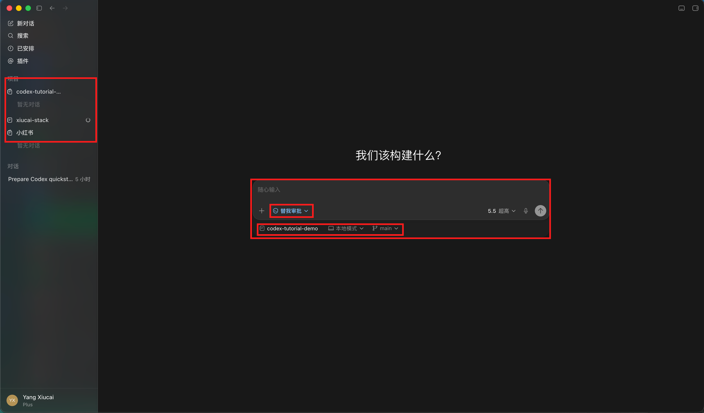
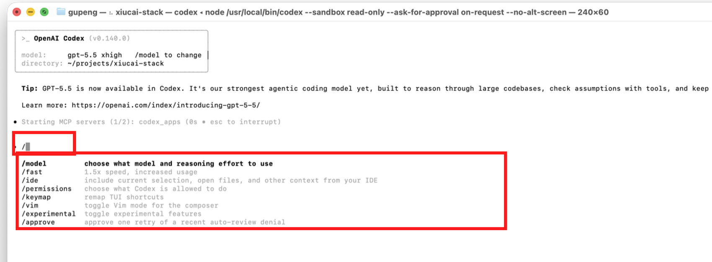
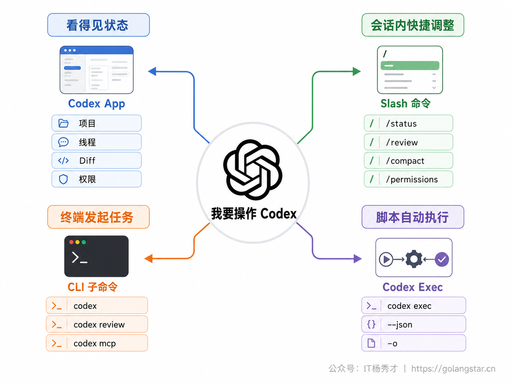
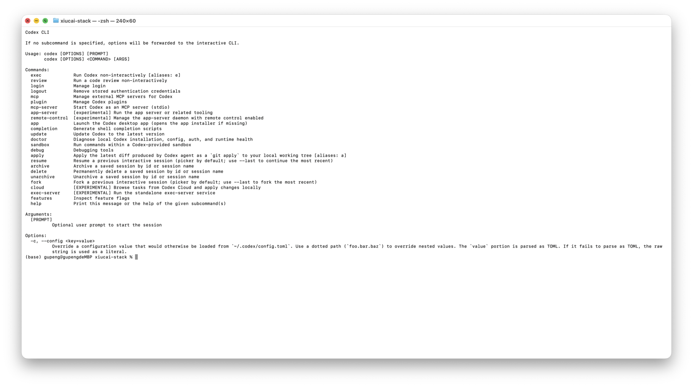
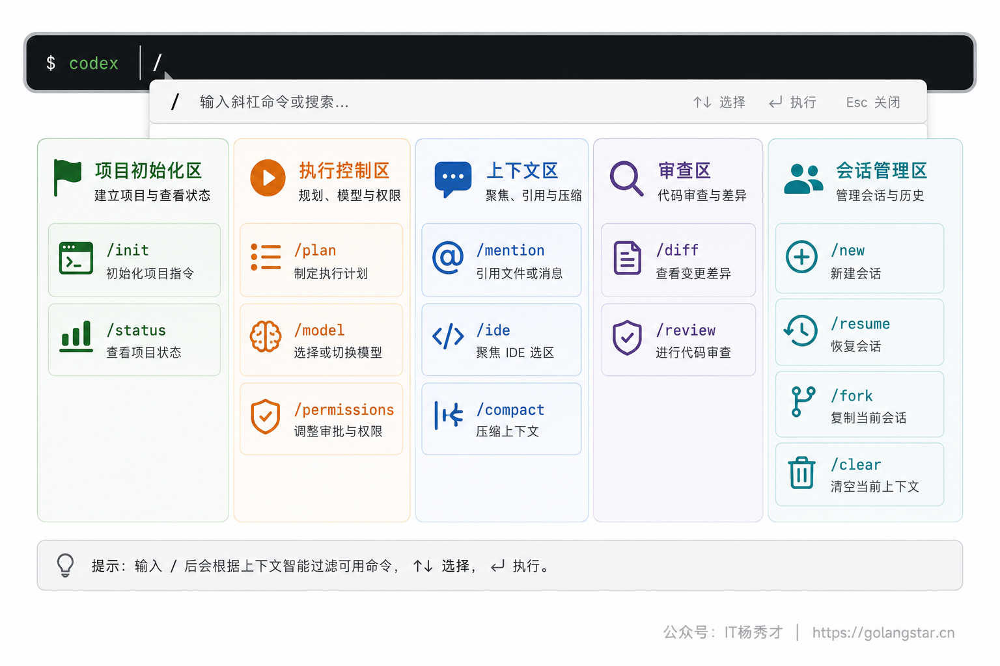
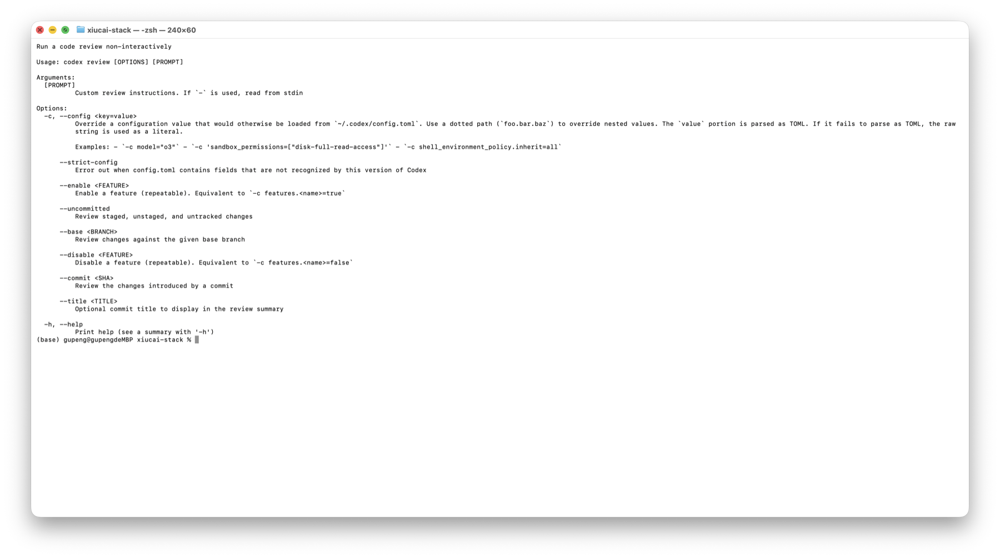
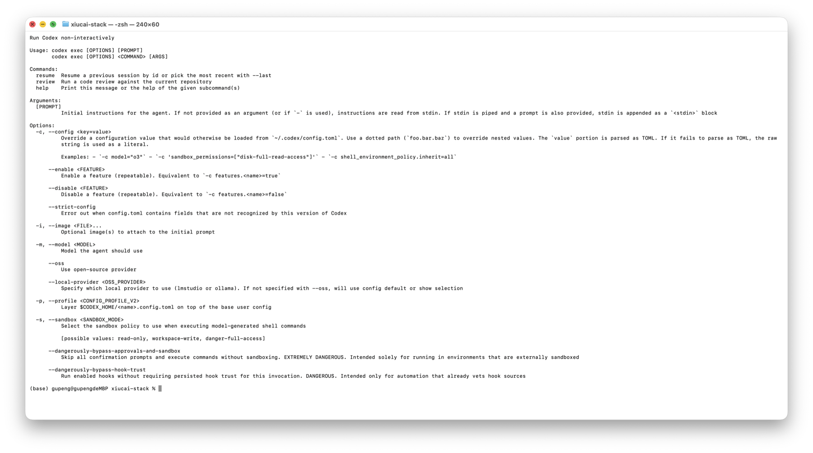
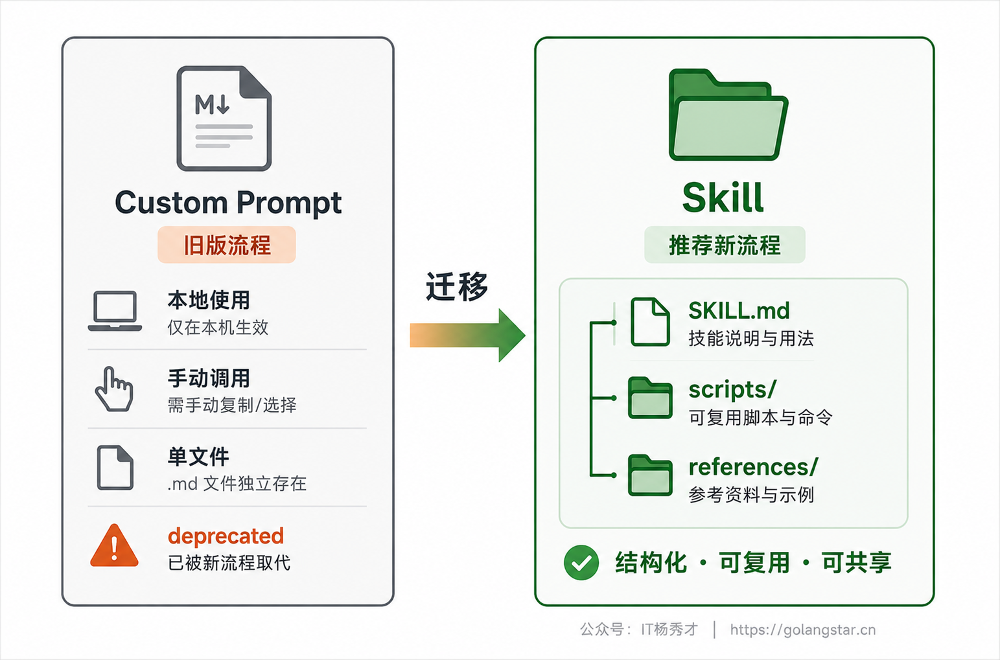
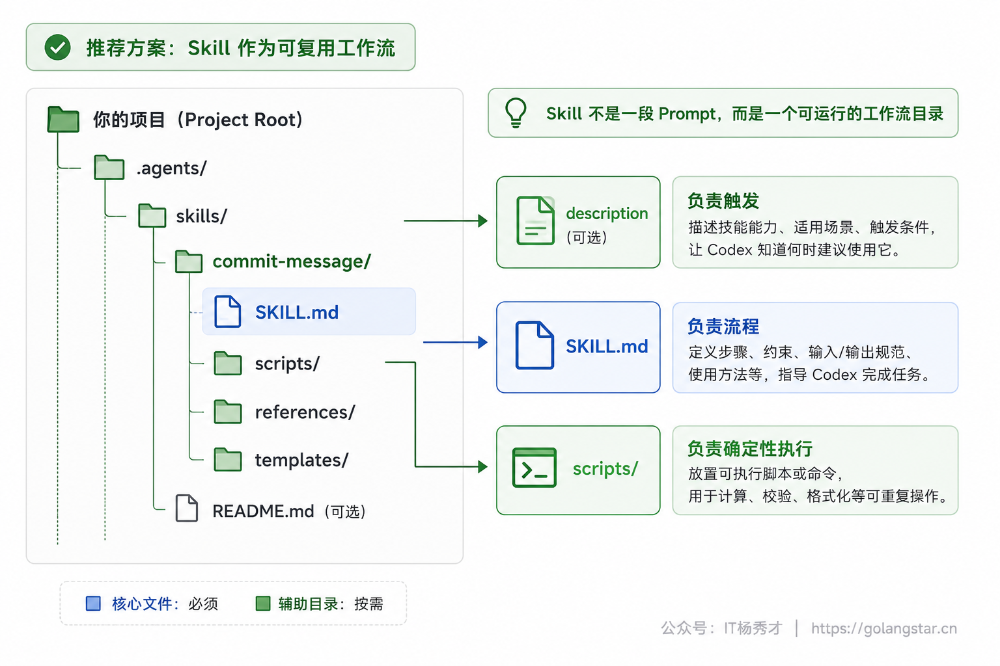
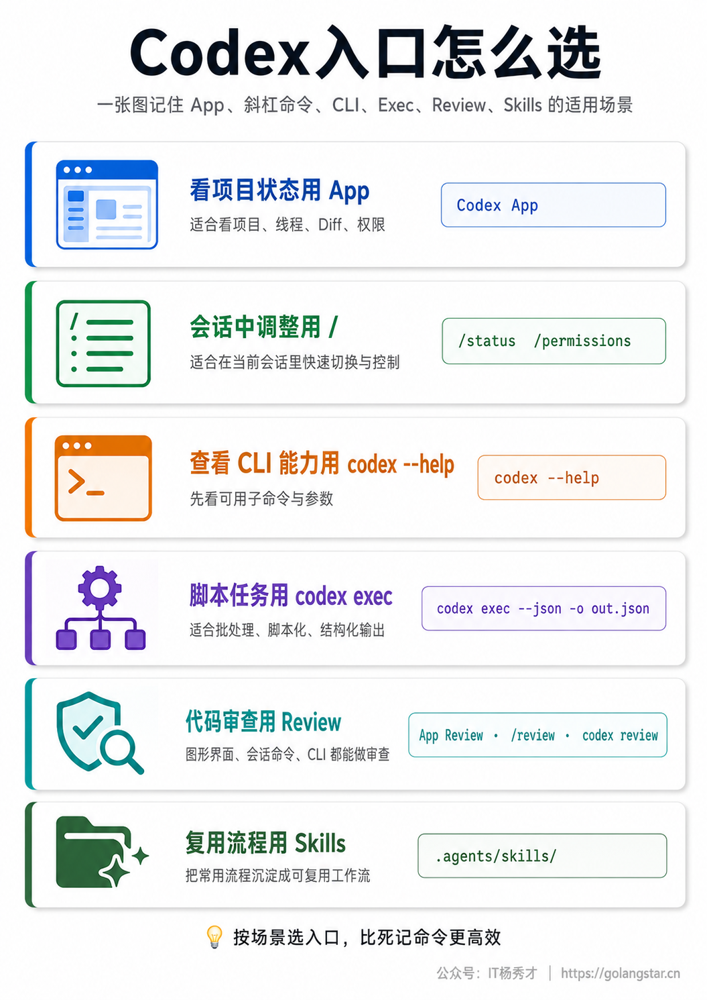

用 Codex 做项目时，新手最容易卡住的地方不是不会提需求，而是不知道该从哪里下手。同一个动作，在 App 里可能是一个按钮，在 CLI 里可能是一条斜杠命令，在自动化脚本里又变成 `codex exec` 的参数。入口选错了，轻则多绕几步，重则权限放太大、上下文堆太乱、重复流程每次都重新写。

本文按当前 OpenAI Codex 官方手册和本机 `codex` 命令输出整理。现在，Codex 已经把 Custom Prompts 标记为 deprecated，新建可复用流程应优先迁移到 Skills。旧 Prompt 仍然值得了解，但它不再是主线。

## **1. 入口总览**

Codex 的入口可以分成四层。第一层是 Codex App 里的图形入口，适合新手日常使用。你能看到项目、线程、输入框、权限选择器、环境信息、Git 面板、Diff 面板和终端，操作反馈最直观。第二层是 App 或 CLI 输入框里的斜杠命令，适合在当前会话中快速切换模式、查看状态、打开审查、压缩上下文。第三层是 `codex` CLI 子命令，适合终端用户直接启动会话、运行审查、管理 MCP、诊断环境。第四层是 `codex exec`，适合脚本化、CI、批量处理这类非交互任务。



新手优先从 App 开始。原因很简单：App 会把很多抽象动作显式摆出来，比如本地模式、分支、变更、提交或推送、权限选择器。你不需要一上来记住所有命令，只要知道当前任务应该点哪里。等你熟悉了 Codex 的工作方式，再把高频动作搬到 CLI，效率会更高。

上图是 Codex App 打开项目后的真实界面。左侧红框是项目和线程入口，底部红框是当前会话的输入区；输入区里还能看到审批方式、项目目录、运行模式和分支。对新手来说，这张图比一串命令更重要，因为它先帮你确认自己到底在哪个项目里、用什么权限让 Codex 做事。

命令入口的选择可以按这个规则判断：要看得见项目状态，用 App；要在一个正在进行的会话里快速调整，用 `/`；要从终端发起一次明确任务，用 `codex`；要让脚本拿到稳定输出，用 `codex exec`；要沉淀可复用流程，用 Skills。

更细一点，可以把入口和风险边界一起看：

| 任务场景 | 推荐入口 | 适合原因 | 注意事项 |
| --- | --- | --- | --- |
| 第一次打开项目 | Codex App | 项目、线程、权限、Git 状态都可见 | 先确认项目路径，不要在错仓库开线程 |
| 当前会话里调状态 | `/` 菜单 | 不打断上下文，能快速切模式 | 命令是否出现以当前环境为准 |
| 终端里发起一次任务 | `codex "<任务>"` | 可以带工作目录、模型、沙箱参数 | 任务描述要完整，不要只写一句模糊目标 |
| 提交前审查 | `/review` 或 `codex review` | 能聚焦当前 diff 或指定 base | 审查范围要明确，避免审查无关改动 |
| 自动化脚本 | `codex exec` | 输出可重定向，可接 JSONL | 显式写 `-s` 和 `-a`，不要依赖默认配置 |
| 固化个人流程 | Skill | 可带脚本、资料和触发说明 | `description` 要写清触发边界 |

## **2. App入口**

Codex App 是现在最适合新手的主入口。它不是一个简单聊天框，而是围绕项目线程组织起来的桌面工作台。一个窗口里可以管理多个项目，每个项目下面有自己的对话线程；线程右侧能看到环境信息和 Git 状态；输入框下方能选择项目、模式、分支、权限、模型和推理强度。

App 的高频快捷键也值得记住几个。命令菜单是 `Cmd+Shift+P` 或 `Cmd+K`，设置是 `Cmd+,`，打开文件夹是 `Cmd+O`，新建线程是 `Cmd+N` 或 `Cmd+Shift+O`，查找当前线程是 `Cmd+F`，切换 Diff 面板是 `Cmd+Option+B`，打开集成终端是 `Cmd+J`。这些入口不要求你背命令，只要知道它们都在 App 里。

实际使用时，App 入口最适合下面几类任务。第一类是新项目上手，你需要看当前项目、线程和环境状态；第二类是改代码后审查 Diff，你需要逐文件看变化、加 inline comment、决定是否 stage；第三类是权限和沙箱切换，你需要在输入框附近确认当前是只读、本地编辑还是更高权限；第四类是多线程并行，你需要同时看几个任务的进度，不希望所有东西挤在一个终端里。

App 还有一个容易被忽略的好处：它把 Git 操作收进了同一个工作流。Codex 修改文件后，你可以先看变更，再决定 stage 哪些文件、revert 哪些 hunk、是否提交或推送。对小白来说，这比在终端里连续敲 `git diff`、`git add`、`git reset` 更不容易误操作。需要进一步确认时，再打开集成终端跑测试或 lint。

如果你的项目本身很大，不建议在 App 里一次打开过宽的工作区。官方手册建议把单仓库里的不同 app 或 package 拆成不同项目，这样 sandbox 只覆盖当前项目需要的文件。比如 monorepo 里有 `web/`、`api/`、`docs/`，做前端任务时优先打开 `web/`，不要让 Codex 默认看到整个仓库。

如果你已经在终端里，最简单的打开方式就是：

```bash
codex app .
```

这个命令会把当前目录交给 Codex Desktop。进入 App 后，再通过左侧项目列表、线程、右侧环境信息和底部输入框处理具体任务。对刚开始用 Codex 的人来说，先用 App 建立项目、线程、权限和 Git 状态的全局感，再逐步把高频动作迁移到 CLI，会更稳。

## **3. 斜杠菜单**

Codex App 和 Codex CLI 都支持在输入框里敲 `/` 打开命令菜单。App 里的可见命令会根据你的版本、功能开关和账号权限变化，官方手册列出的 App 常见命令包括 `/feedback`、`/goal`、`/init`、`/mcp`、`/plan`、`/review`、`/status`。CLI 里的菜单更偏键盘流，适合在终端会话里快速切换模型、权限、审查、压缩和初始化等动作。



这张图是在 Terminal 里启动 `codex --sandbox read-only --ask-for-approval on-request --no-alt-screen` 后，输入 `/` 得到的真实 CLI 菜单。红框标出了触发输入和弹出的斜杠命令列表，可以看到 `/model`、`/permissions`、`/keymap`、`/approve` 这类命令。菜单项会随版本、账号、插件、MCP server 和当前项目状态变化，所以教程里讲的是使用方法，不是要求你的菜单和截图逐项完全一致。

这类命令的价值是不用离开当前线程。比如你正在让 Codex 改一个功能，想看当前上下文用了多少，就输入 `/status`；想把当前未提交改动拉出来审查，就输入 `/review`；会话太长时，用 `/compact` 压缩上下文；刚进入一个空项目时，用 `/init` 生成 `AGENTS.md` 起步稿。

App 菜单和 CLI 菜单不是完全一模一样。App 更偏图形工作流，很多动作可以通过按钮完成；CLI 菜单更偏键盘控制，命令数量也更多。文章里凡是提到斜杠命令，都要加一个前提：以你当前环境弹出的菜单为准。如果某个命令没有出现，先不要怀疑自己操作错了，可能是版本、功能开关、工作区状态或运行表面不同。



## **4. CLI入口**

CLI 是终端用户的主入口。直接运行 `codex` 会进入交互式终端界面；运行 `codex "<任务描述>"` 可以带着首条 Prompt 进入会话；运行 `codex --help` 可以查看当前安装版本支持的子命令和全局参数。下面这张图来自当前项目目录里的真实 `codex --help` 输出。



当前 CLI 的常用子命令可以按场景记，不必逐条背。`codex app` 用来从终端打开桌面 App；`codex exec` 用来非交互执行任务；`codex review` 用来非交互代码审查；`codex mcp` 管理 MCP server；`codex plugin` 管理插件；`codex doctor` 诊断本地安装、配置、认证和运行环境；`codex resume` 继续已有会话；`codex fork` 从已有会话分叉；`codex features` 查看或调整功能开关。

下面这张表适合放在旁边当速查：

| 命令 | 用途 | 新手常见用法 |
| --- | --- | --- |
| `codex` | 打开交互式 CLI | 在项目根目录启动一次终端会话 |
| `codex app` | 打开桌面 App | 从当前路径进入 App 项目 |
| `codex exec` | 非交互执行 | 生成报告、批量总结、CI 辅助检查 |
| `codex review` | 非交互审查 | 审查未提交改动或某个 base 分支差异 |
| `codex mcp` | 管理 MCP | 查看、添加、移除外部工具连接 |
| `codex plugin` | 管理插件 | 查看已装插件或安装插件包 |
| `codex doctor` | 诊断环境 | 登录失败、配置异常、运行问题时先跑 |
| `codex resume` | 继续会话 | 找回之前没做完的 CLI 会话 |

最常用的全局参数也要理解。`--model` 或 `-m` 用来指定模型；`--profile` 或 `-p` 用来加载某个配置 profile；`--cd` 或 `-C` 指定工作目录；`--sandbox` 或 `-s` 指定沙箱模式；`--ask-for-approval` 或 `-a` 指定审批策略；`--search` 开启 live web search；`--no-alt-screen` 让 TUI 不占用终端备用屏幕，方便保留滚动历史。

对新手来说，CLI 不该从危险参数开始学。比如 `--dangerously-bypass-approvals-and-sandbox` 或 `--yolo` 会跳过审批和沙箱，这类参数只适合已经有外部隔离的环境。普通本地项目优先使用 `workspace-write` 加 `on-request`，只在确实需要时临时放宽。

一个比较稳的本地启动命令如下：

```bash
codex --sandbox workspace-write --ask-for-approval on-request
```

如果你只想让 Codex 解释项目，不允许它改文件，就用：

```bash
codex --sandbox read-only --ask-for-approval on-request
```

这两个命令的差别不是模型能力，而是行动边界。前者允许 Codex 在工作区内改文件，越界再问你；后者更适合读代码、解释架构、检查配置这类只读任务。小白刚开始练习时，先用只读模式做解释和审查，再切到 workspace-write 做小改动，风险更低。

## **5. 交互命令**

CLI 里的斜杠命令比 App 更完整。官方手册中列出的常见命令包括 `/permissions`、`/ide`、`/keymap`、`/agent`、`/apps`、`/plugins`、`/hooks`、`/clear`、`/compact`、`/copy`、`/diff`、`/approve`、`/memories`、`/skills`、`/import`、`/feedback`、`/init`、`/mcp`、`/mention`、`/model`、`/fast`、`/plan`、`/goal`、`/personality`、`/fork`、`/side`、`/raw`、`/resume`、`/new`、`/review`、`/status`、`/usage`、`/theme` 等。

这些命令可以按工作阶段分组。刚进项目，用 `/init` 生成 `AGENTS.md` 起步稿，用 `/status` 看模型、权限、上下文和工作区信息。准备执行前，用 `/plan` 先拿计划，用 `/model` 切模型或推理配置，用 `/permissions` 调整沙箱和审批。执行中，用 `/mention` 指定文件，用 `/ide` 拉取编辑器上下文，用 `/agent` 查看子线程。执行后，用 `/diff` 看改动，用 `/review` 审查，用 `/compact` 压缩长对话，用 `/new` 开新上下文。

这里最值得养成习惯的是 `/status` 和 `/permissions`。`/status` 能帮你确认当前会话到底在什么目录、用什么模型、权限是什么、上下文还剩多少。很多误操作都来自状态没确认，比如你以为在 demo 项目，实际在生产仓库；你以为只读，实际已经允许写工作区。`/permissions` 则是中途收紧或放宽权限的入口，适合在任务阶段切换时使用。

`/compact` 也很重要。长对话里，Codex 会保留大量历史和工具输出，上下文满了以后，模型会更难稳定抓住当前重点。`/compact` 的作用是把可见对话压缩成摘要，保留关键决策、文件、剩余任务和注意事项。做一个大功能时，不要等到上下文爆了才压缩；完成一个阶段、测试通过、进入下一个阶段前压缩一次，效果更稳。

`/new` 和 `/clear` 不一样。`/new` 是开一个新对话，适合切换到一个没有强依赖的新任务；`/clear` 在 CLI 里会清理终端并开始新聊天。单纯想清屏时，终端里的 `Ctrl+L` 只是清视觉输出，不等于清上下文。这一点很容易混淆，尤其是从普通终端习惯迁移过来的读者。



命令可以排队。官方手册说明，当任务正在运行时，你可以输入斜杠命令并按 `Tab`，让它在下一轮执行。这对长任务很有用，比如 Codex 正在跑测试，你已经知道跑完后要 `/review`，就可以提前排队。新手不必一开始就用这个技巧，但知道它存在，可以减少等待时的中断。

## **6. 审查入口**

代码审查是 Codex 里非常高频的入口。App 里有 Review pane，能展示 Git 仓库当前状态，既包括 Codex 改的内容，也包括你自己改的未提交内容。它可以看 uncommitted changes、all branch changes、last turn changes，也可以在本地任务中切换 staged 和 unstaged。你还能在 diff 行上加 inline comment，再让 Codex 针对这些评论继续改。

CLI 里有两条相关路径。交互式会话中输入 `/review`，适合当前工作树已经有改动、你想在同一会话里做一次检查。非交互场景运行 `codex review`，适合 CI、提交前脚本或单独的审查任务。下面截图是 `codex review --help` 的真实输出，可以看到它支持 `--uncommitted`、`--base`、`--commit`、`--title` 等参数。



实战里可以这样选：正在 App 里看改动，就用 Review pane；正在 CLI 会话里改代码，就用 `/review`；想把审查接进自动化，就用 `codex review`。如果你只想审查当前未提交内容，用 `--uncommitted`；如果要和某个基准分支比，用 `--base main`；如果要审查某个提交，用 `--commit <SHA>`。

审查入口的关键不是多跑几次，而是让 Codex 知道什么叫严重问题。官方 GitHub 代码审查集成默认更关注 P0 和 P1 级别问题，本地审查也应保持同样思路。你可以把审查范围写进 `AGENTS.md` 的 Review guidelines，也可以在一次 Prompt 里临时指定。比如支付模块重点查金额精度和权限校验，前端表单重点查空状态、错误提示和重复提交，后端接口重点查鉴权、输入校验和并发问题。

**Prompt：**

```text
请审查当前未提交改动，重点看：
1. 是否有真实 bug 或边界条件遗漏
2. 是否缺少必要测试
3. 是否引入安全风险
4. 是否有不必要的大范围重构

只列出需要修改的问题，不做泛泛表扬。
```

这类审查 Prompt 要尽量说明范围和优先级。不要只写 `review this`，否则 Codex 可能给你一堆风格建议。教程读者最需要学会的是让审查聚焦高风险问题，尤其是边界、测试、安全和回归。

## **7. 权限沙箱**

权限和沙箱必须单独讲，因为它决定 Codex 能不能改文件、能不能联网、什么时候停下来问你。官方手册把这件事拆成两个概念：sandbox 定义技术边界，approval policy 定义什么时候需要审批。两者配合，才是完整的安全控制。

App 和 IDE 里，权限入口通常在输入框下面的权限选择器。你可以选择默认权限、切到 full access，或使用自定义配置。CLI 里用 `/permissions` 在会话中切换；启动命令时用 `--sandbox` 和 `--ask-for-approval` 固定本次运行的策略。

常见 sandbox 模式有三个。`read-only` 只能读取文件，不能直接修改；`workspace-write` 可以在当前工作区内读写并运行常规本地命令，是本地开发更常用的低摩擦模式；`danger-full-access` 去掉沙箱边界，只应该在隔离环境里使用。常见 approval policy 也有三个。`untrusted` 会对不在可信集合里的命令询问；`on-request` 允许沙箱内动作自动执行，越界时询问；`never` 不停下来问你，失败就直接返回给模型。

本地日常推荐从保守到放开。阅读和解释代码用 `read-only`；小范围改代码用 `workspace-write` 加 `on-request`；自动化任务如果不需要人参与，可以用 `-a never`，但要配合明确的 sandbox。不要为了省一次确认就上 full access。

几种常见组合如下：

| 组合 | 适用场景 | 风险边界 |
| --- | --- | --- |
| `read-only` + `on-request` | 读代码、解释架构、审查配置 | 默认不能改文件，越界会问 |
| `workspace-write` + `on-request` | 日常本地开发 | 工作区内可写，越界会问 |
| `workspace-write` + `never` | 可信 CI 或批量脚本 | 不等待人工确认，必须配合清晰任务 |
| `danger-full-access` + `never` | 外部已隔离的容器或一次性环境 | Codex 不受本地沙箱限制，普通项目不要用 |

权限策略还有一个实用原则：让权限跟任务阶段走，而不是跟心情走。需求讨论阶段用只读，实施阶段用工作区写入，提交前回到审查和确认，自动化阶段把参数写死。这样你在教程、团队规范和脚本里都能复现同一套安全边界。

## **8. 非交互任务**

`codex exec` 是把 Codex 放进脚本里的入口。它不会打开交互式 TUI，而是接受一个 Prompt，执行完后把最终回答输出到 stdout，也可以用 `-o` 写到文件。官方手册说明，`codex exec` 适合 CI、预合并检查、定时任务、批量总结、从其它命令管道接收输入，以及需要固定 sandbox 和 approval 的可复现工作流。



上图是 Terminal 里运行 `codex exec --help` 的真实截图。这里重点看四类参数：`[PROMPT]` 是本次自动化任务的说明，`-s` 或 `--sandbox` 决定文件和命令边界，`--json` 让事件按 JSON Lines 输出，`-o` 或 `--output-last-message` 把最终回答写到文件。真正执行业务 Prompt 时，输出会随项目内容和任务变化，不应该在教程里把某次回答写成固定效果。

可复用模板如下：

```bash
codex -a never -s read-only exec \
  --ignore-user-config \
  -o .codex-screenshots/codex_commands_exec_result.txt \
  "只读取当前目录，不要修改文件。用三行中文说明当前任务。"
```

这个模板适合只读分析类任务。你可以把 Prompt 换成生成发布说明、总结 CI 日志、检查配置差异、整理变更摘要等明确目标。只要任务会进入脚本或 CI，就不要依赖个人默认配置，应该把 sandbox、approval、输出文件这些参数写清楚。

自动化里还有几个参数很有用。`--json` 会把事件作为 JSON Lines 输出，适合下游程序解析；`--output-schema` 可以要求最终回答符合 JSON Schema；`--ephemeral` 不持久化会话文件；`--ignore-user-config` 可以减少个人配置对自动化任务的影响；`--skip-git-repo-check` 允许在非 Git 仓库运行，但只有你清楚环境安全时才用。

写自动化 Prompt 时要比交互会话更具体。交互会话可以边跑边追问，脚本里没有这个过程。一个合格的 `codex exec` Prompt 应该写清输入范围、禁止动作、输出格式、失败时怎么说明。比如生成发布说明时，说明读取哪个 tag 范围、忽略哪些提交类型、输出 Markdown 还是 JSON；审查 CI 日志时，说明只分析日志、不修改文件、输出最可能原因和下一步命令。

不推荐把高风险写入任务直接交给 `codex exec -a never -s danger-full-access`。如果确实需要让自动化改文件，先把范围限制在工作区，输出 diff 或 patch，再由人或 CI 审核。Codex 能自动执行，不代表每个自动执行都应该无审批落地。

## **9. Custom Prompts**

Custom Prompts 是旧入口，官方手册已经标记为 deprecated，并明确建议用 Skills 替代。它仍然值得了解，因为很多老配置和旧教程会提到 `~/.codex/prompts`、`/prompts:name`、`$ARGUMENTS` 这些写法。读者遇到存量项目时能看懂它，但新建可复用工作流不建议从这里开始。

旧 Prompt 的基本结构是一个 Markdown 文件，放在本地 Codex home 的 prompts 目录下：

```bash
mkdir -p ~/.codex/prompts
```

```markdown
---
description: 生成提交信息
argument-hint: [FILES=] [FOCUS=""]
---

查看当前改动，为 $FILES 生成一条中文提交信息。
如果传入 FOCUS，则优先强调 $FOCUS。
提交信息使用 Conventional Commits 风格，只输出提交信息本身。
```

调用时，在 CLI 或 IDE 扩展的斜杠菜单里输入：

```text
/prompts:commit FILES="src/app.ts src/api.ts" FOCUS="修复登录跳转"
```

它支持几种参数写法。`$1` 到 `$9` 是位置参数，`$ARGUMENTS` 是全部参数，`KEY=value` 可以对应命名占位符，包含空格的值用引号包起来，想输出字面量 `$` 时写 `$$`。这些能力对一段式个人快捷指令够用，但它有明显边界：只能显式调用，只存在本地，不随仓库共享，不能带配套脚本和参考资料，也不能靠 description 自动匹配复杂任务。

如果你接手一个已经有 Custom Prompts 的环境，先做三件事。第一，看 prompt 是否只是个人快捷语句，还是已经承担团队流程。第二，看它有没有隐含危险动作，比如直接提交、推送、删除文件、改权限。第三，看它是否依赖某些未写明的上下文，比如团队代码规范、测试命令、发布流程。第一类可以继续留着，第二类要加审批边界，第三类更适合迁移到 Skill。



## **10. Skills迁移**

Skills 是当前 Codex 推荐的可复用工作流入口。一个 Skill 是一个目录，必须有 `SKILL.md`，可以带 `scripts/`、`references/`、模板、图片和其它资源。Codex 先只看到 skill 的名称、描述和路径，只有匹配任务时才读取完整 `SKILL.md`，这叫 progressive disclosure，可以减少上下文浪费。

Skills 可以显式调用，也可以隐式匹配。显式调用是在 Prompt 里写 `$skill-name`，或在 CLI 里用 `/skills` 选择。隐式匹配依赖 `description`，所以描述要写清什么时候触发、什么时候不触发。Skill 可以放在项目里，也可以放在个人目录里。项目级常见位置是 `.agents/skills/`，个人级位置是 `~/.agents/skills/`。

一个从旧 Prompt 迁移过来的 Skill 可以这样写：

```markdown
---
name: commit-message
description: 当用户要求生成提交信息、整理 staged diff、编写 commit message 时使用。不要在用户只要求解释代码时触发。
---

你负责根据当前 Git 改动生成提交信息。

执行步骤：
1. 读取当前 staged diff；如果没有 staged diff，再提醒用户先 stage 或明确允许查看 unstaged。
2. 判断改动类型，优先使用 feat、fix、docs、refactor、test、chore。
3. 标题使用中文，不超过 50 个汉字。
4. 如果改动包含多类文件，正文用 2 到 4 个短句列出重点。
5. 只输出提交信息，不执行 git commit。
```

如果流程需要固定脚本，可以在 Skill 下加 `scripts/`。比如提交信息前先跑一个小脚本提取 staged 文件列表，脚本路径写进 `SKILL.md`，让 Codex 知道什么时候运行。这样就不是单纯的一段 Prompt，而是一套可维护的工作流。



迁移时不要一次性把所有旧 Prompt 都改掉。先找高频、复杂、需要团队共享的流程迁移。个人的一句话快捷模板可以暂时保留；涉及项目规范、测试命令、审查清单、发布流程、脚本执行的，优先迁到 `.agents/skills/` 并提交到仓库。

迁移可以按这个顺序做：

| 步骤 | 做什么 | 检查点 |
| --- | --- | --- |
| 盘点 | 列出 `~/.codex/prompts/*.md` | 标出高频、危险、团队共享三类 |
| 拆分 | 把单段 Prompt 拆成触发描述和执行步骤 | `description` 是否能准确触发 |
| 落盘 | 创建 `.agents/skills/<name>/SKILL.md` | name 是否唯一，路径是否进仓库 |
| 补资料 | 加 `references/` 或模板 | Codex 是否能找到规范和示例 |
| 补脚本 | 必要时加 `scripts/` | 脚本是否可重复、失败是否可解释 |
| 试跑 | 用真实任务调用 Skill | 是否误触发，是否遗漏输入条件 |

最容易写坏的是 `description`。它不是宣传语，而是触发器。好的 description 会写清触发词、任务边界和不要触发的场景。比如生成提交信息时触发，不要在解释代码时触发；审查安全风险时触发，不要在普通重构建议时触发。这样 Codex 才能在隐式匹配时稳定选中正确 Skill。

## **11. 常见问题**

**Q：App 里输入 `/` 后看到的命令和文章不一样，正常吗？**
正常。Codex 官方也说明可用命令会随环境和权限变化。以你当前菜单为准，缺失命令先检查版本、功能开关、项目状态和运行表面。

**Q：`/permissions` 和 `--sandbox` 是一回事吗？**
不是同一种入口，但控制的是同一类行为。`/permissions` 是会话中调整，`--sandbox` 是启动时固定本次运行的沙箱。自动化脚本更推荐写明参数，避免依赖个人默认配置。

**Q：Custom Prompts 还能用吗？**
能维护存量，但官方已经标记 deprecated。个人单文件快捷指令可以暂时保留，新建团队级或项目级流程优先用 Skills。

**Q：`codex exec` 会不会改文件？**
取决于 sandbox 和 Prompt。默认更偏只读，自动化里要显式写 `-s read-only` 或 `-s workspace-write`。只想读取时，把 Prompt 写清楚不要修改文件，并使用 `read-only`。

**Q：什么时候用 `/review`，什么时候用 `codex review`？**
正在交互会话里就用 `/review`；要把审查做成独立命令或脚本，就用 `codex review`。App 里查看、评论和选择改动时，用 Review pane 更直观。



## **12. 小结**

Codex 的命令体系不是让你背一堆快捷命令，而是让不同工作场景有合适入口。App 负责可视化和日常协作，斜杠命令负责会话内快捷控制，CLI 子命令负责终端任务，`codex exec` 负责脚本化和自动化，Skills 负责把稳定流程沉淀下来。

旧版 Custom Prompts 可以帮助你读懂存量配置，但新流程不要再围着它扩展。把能复用的工作流写进 Skills，把高风险操作放进明确的沙箱和审批策略，把审查、执行、状态查看放到合适入口里，Codex 才会从一个聊天工具变成可靠的项目协作工具。

<div style="background-color: #f0f9eb; padding: 10px 15px; border-radius: 4px; border-left: 5px solid #67c23a; margin: 20px 0; color:rgb(64, 147, 255);">

<h2><span style="color: #006400;"><strong>关注秀才公众号：</strong></span><span style="color: red;"><strong>IT杨秀才</strong></span><span style="color: #006400;"><strong>，回复：</strong></span><span style="color: red;"><strong>面试</strong></span></h2>

<div style="text-align: center;"><span style="color: #006400; font-size: 28px;"><strong>领取后端/AI面试题库PDF</strong></span></div>


<div style="text-align: center; margin-top: 22px; padding-top: 20px; border-top: 1px solid #c2e7b0;">
<div style="color: #006400; font-size: 20px; font-weight: bold;">🔥 配套实战项目，拆得开、跑得起、能写进简历</div>
<div style="color: red; font-size: 16px; font-weight: bold; margin-top: 8px;">多 Agent 编排 + RAG 混合检索 · 31 篇深度教程 + 50+ 面试题</div>
<a href="/projects/dev-support.html" style="display: inline-block; margin-top: 14px; background: #ff7a18; color: #fff; font-size: 18px; font-weight: bold; padding: 10px 28px; border-radius: 24px; text-decoration: none;">点击查看 DevSupport AI 实战项目 →</a>
</div>
</div>
