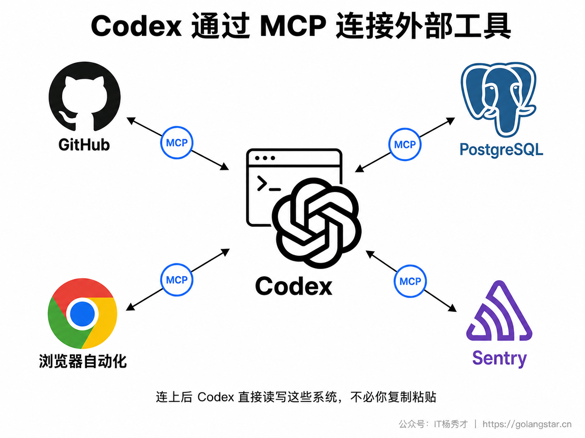
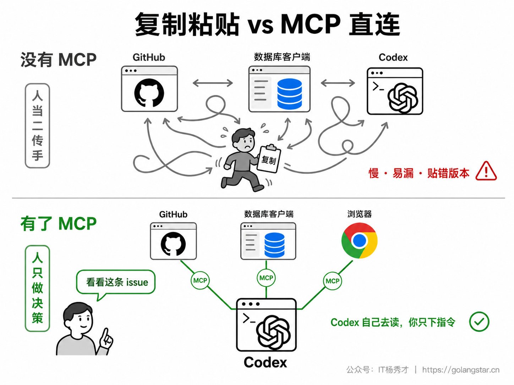
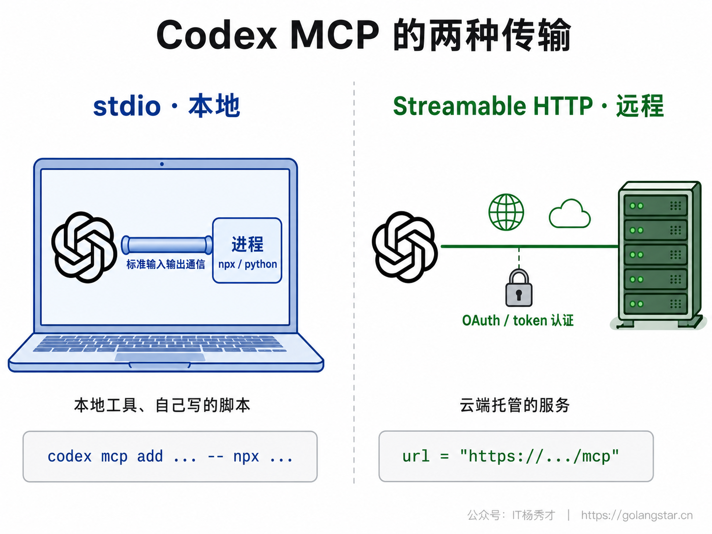
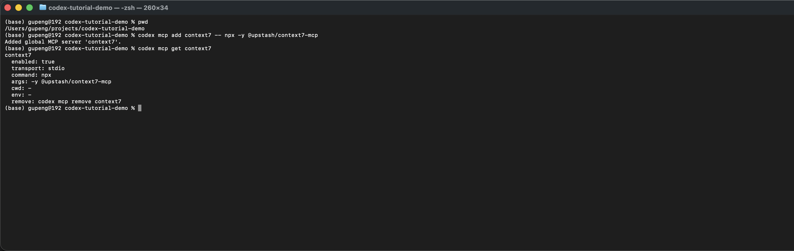
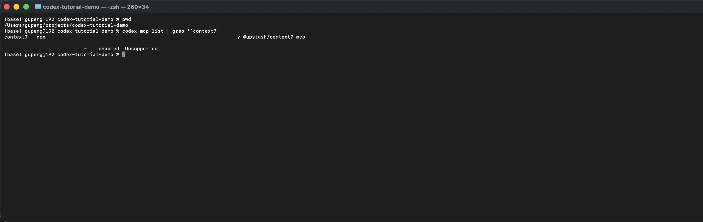
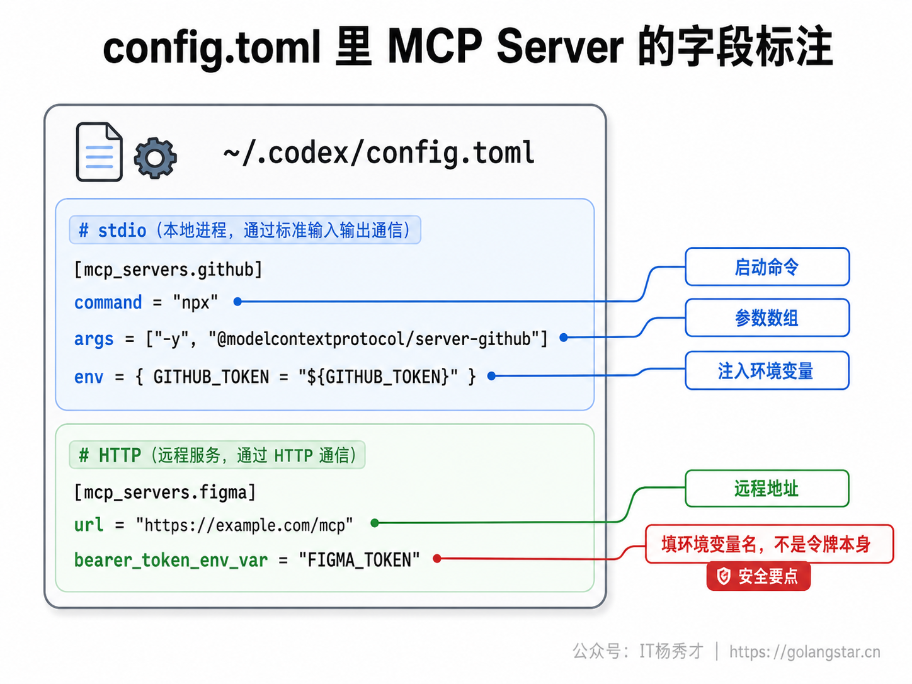
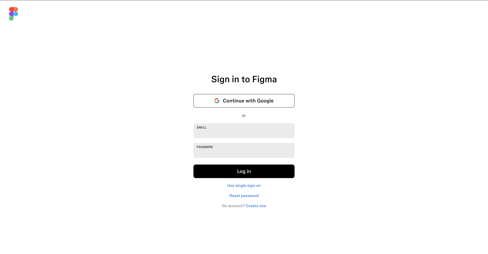
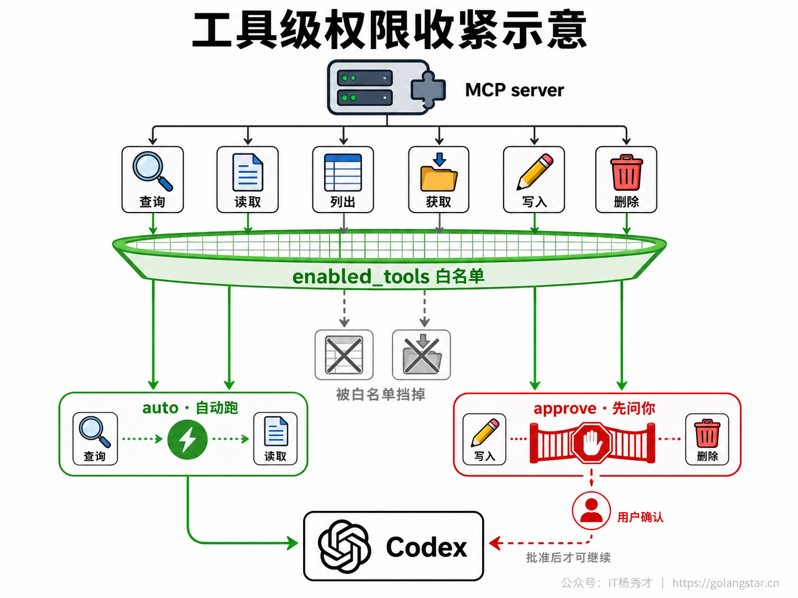
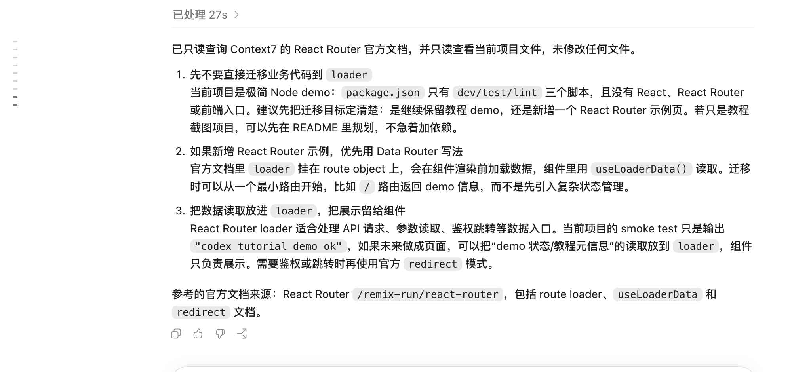

你大概率遇到过这个场景：让 Codex 改一个 bug，它需要先看 GitHub 上那条 issue 的描述，于是你打开浏览器、复制 issue 正文、贴回终端；它改完想确认数据对不对，你又去数据库客户端跑一条查询、把结果复制回来给它。Codex 很能干，但它默认只看得见你本地的代码文件，外面的 GitHub、数据库、线上监控、浏览器，它一概够不着——所有跨系统的信息，都得靠你手动当二传手来回搬运。

MCP 就是来拆掉这堵墙的。它让 Codex 直接连上这些外部系统，自己去读 issue、查数据库、开页面、拉报错，不再需要你复制粘贴。这一篇把 Codex 这边的 MCP 集成从头讲清楚：MCP 到底是什么、为什么值得配，stdio 和 streamable HTTP 两种 server 怎么分、怎么连，远程 server 的 OAuth 认证怎么走，以及怎么用工具白名单和审批策略把它的权限收在安全范围内。

## **1. 为什么需要 MCP**

MCP（Model Context Protocol，模型上下文协议）是一个开放标准，作用是给 AI 工具和外部系统之间定义一套统一的对接方式。你可以把它理解成 AI 世界的通用插座——以前每个工具想接一个外部系统，都得各写一套对接代码；有了 MCP，外部系统这边按标准实现一个 MCP server，AI 工具那边按标准做一个 MCP 客户端，两边就能即插即用。Codex 扮演的就是客户端，GitHub、PostgreSQL、Playwright 浏览器这些则各自提供一个 server。

它解决的痛点很具体。没有 MCP 时，Codex 的视野被锁在当前代码目录里，任何目录之外的信息——一条 issue 的来龙去脉、某张表的真实数据、线上一个报错的堆栈——都进不了它的上下文，除非你手动粘进去。手动搬运有三个毛病：慢、容易漏、还会贴错版本。接上 MCP 之后，这些系统变成 Codex 能主动调用的工具，它干活时按需自己去读写，你只管用自然语言下指令。

一个判断标准能帮你决定要不要接某个 server：当你发现自己反复从某个工具里复制内容、粘进 Codex 的对话框时，这个工具就值得接进来。偶尔查一次的，手动贴一下也无妨；每天来回搬好几趟的，接进来一劳永逸。

MCP 是开放标准还带来一个额外好处——跨工具通用。同一个 GitHub MCP server，既能接进 Codex，也能接进 Claude Code、Cursor。你只要理解一遍 MCP 的工作方式，换工具时变的只是配置写法，server 本身和它提供的能力是同一套，不必为每个工具重学一遍对接。



看懂连接关系之后，再看工作方式的变化会更直观。下面这张图只对比一件事：没有 MCP 时，人要在不同系统之间搬内容；接上 MCP 后，人只下指令，Codex 自己去查需要的外部信息。



## **2. MCP 在 Codex 里的位置**

在动手配之前，先搞清楚 Codex 这边的 MCP 配置长在哪、对哪些形态生效。

Codex 的 MCP 配置不是单独一个文件，而是和它其他所有设置放在一起，统一写在 `config.toml` 里。这个文件有两个位置：全局配置在 `~/.codex/config.toml`，对你所有项目生效；项目级配置在项目根目录的 `.codex/config.toml`，只对该项目生效。出于安全考虑，项目级的 `.codex/config.toml` 只在你信任的项目里才会被加载——这是为了防止你 clone 下来一个陌生仓库时，里面夹带的配置自动把某个 server 拉起来。

配好的 server 在 Codex 的不同形态之间是通用的。你在 Codex App 里开会话、在 CLI 里跑命令，或在 IDE 扩展里贴着编辑器上下文干活，都能复用同一套 MCP 配置，不必每个入口各配一遍。这和 Codex 一套大脑多个入口的设计是一致的：配置跟着账号和文件走，入口换了，能力不变。

每次启动一个新会话时，Codex 会读取 `config.toml`、把里面配置的 server 自动拉起来连上。也就是说配置是一次性的工作——配好之后你不用每次手动启动 server，开新会话它就在那儿待命了。

## **3. 两种传输类型**

Codex 支持两种 MCP 传输方式，配置字段不一样，动手前先分清你要接的 server 属于哪种。

**stdio（本地）**。server 作为一个本地子进程跑在你自己机器上，Codex 负责把它启动起来，通过标准输入输出（standard input/output，这也是 stdio 这个名字的由来）和它通信。这类 server 适合本地安装的工具和你自己写的脚本。配置时你要给出启动这个进程的命令，比如用 `npx` 或 `python` 把它跑起来。GitHub、Playwright 这些官方 server 通常都以 stdio 方式提供。

**Streamable HTTP（远程）**。这类 server 不在你本地，而是跑在远端某个地址上，Codex 通过 HTTP 去访问它。因为是远程访问，往往需要认证，它支持 bearer token 和 OAuth 两种方式。云端托管的 MCP 服务（比如 Figma 官方提供的远程 server）走的就是这种。

判断方法很简单：如果接入说明让你在本地跑一条命令（`npx ...`、`python ...` 之类）把 server 启动起来，那就是 stdio；如果给你的是一个 URL 地址，那就是 streamable HTTP。一句话——本地工具走 stdio，云端服务走 HTTP。



## **4. 用 codex mcp 命令管理**

接 server 有两条路：用 `codex mcp` 命令，或者直接编辑 `config.toml`。先讲命令——第一次配、想快速加一个 server 时，命令最省事，它会替你把配置写进 `config.toml`。

加一个本地 stdio server，用 `codex mcp add`。语法是在 `--` 后面写出启动这个 server 的完整命令。官方文档给的入门例子是 Context7，它是一个开发文档 MCP server，不需要令牌，适合先跑通流程：

```bash
codex mcp add context7 -- npx -y @upstash/context7-mcp
```

如果 server 需要密钥，就在 `--` 前面用 `--env` 传环境变量。例如 GitHub MCP server 通常需要 `GITHUB_TOKEN`：

```bash
codex mcp add github --env GITHUB_TOKEN=你的令牌 -- npx -y @modelcontextprotocol/server-github
```

这里有个容易看懵的地方是那个 `--`。它的作用是把 Codex 自己的选项和后面真正启动 server 的命令隔开：`--` 之前是给 `codex mcp add` 看的（server 名字、`--env` 这些），`--` 之后的内容原样交给系统去执行、用来启动 server。这个用法和 Claude Code 的 `claude mcp add` 几乎一模一样，理解了一个另一个就通了。

加远程的 streamable HTTP server，则不写启动命令，改用 `--url` 指定地址：

```bash
codex mcp add figma --url https://mcp.figma.com/mcp
```

加完之后，`codex mcp` 下还有几个子命令用来管理已经配好的 server。完整列表随时可以用 `codex mcp --help` 查，常用的这几个先记住：

```bash
codex mcp list          # 列出所有已配置的 server 及状态
codex mcp get context7  # 查看某个 server 的详细配置
codex mcp login figma   # 给需要 OAuth 的远程 server 走授权登录
codex mcp remove context7 # 移除一个 server
codex mcp --help        # 查看全部 MCP 子命令
```

最常用的是 `codex mcp list`——配完先跑它确认配置已经进入列表、状态是否正常。如果某个 server 显示失败，别急着怀疑配置写错，先看它是 stdio 还是 HTTP：stdio 的多半是 `--` 后那条启动命令本身有问题，HTTP 的多半是认证没走通。



终端里的操作顺序是：先确认当前目录，再用 `codex mcp add context7 -- npx -y @upstash/context7-mcp` 添加 server，最后用 `codex mcp get context7` 查看配置。输出里可以看到它被识别为 `stdio` 传输，启动命令是 `npx`，参数是 `-y @upstash/context7-mcp`。



`codex mcp list` 适合做第一轮验收。如果你的列表里还有其它 server，可以用 `grep '^context7'` 只看目标 server 这一行。这里状态显示为 `enabled`，说明配置已经进入 Codex 的 MCP 列表；`Auth` 显示 `Unsupported`，是因为这个 stdio server 不走 OAuth 登录。远程 server 如果支持 OAuth，这一列就会体现认证状态。

## **5. 在 config.toml 里直接配**

命令之外，你也可以直接编辑 `config.toml`。当你想一次配齐好几个 server、或者想把团队统一的 MCP 配置纳入版本管理时，直接写文件比一条条敲命令更顺手。两种方式效果完全一样，命令本质上也是帮你往这个文件里写而已。

MCP server 写在 `[mcp_servers]` 这张表下面，每个 server 占一个子表，表名就是 server 的名字。一个本地 stdio server 最小配置长这样：

```toml
[mcp_servers.github]
command = "npx"
args = ["-y", "@modelcontextprotocol/server-github"]
env = { GITHUB_TOKEN = "你的令牌" }
```

`command` 是启动命令，`args` 是传给它的参数数组，`env` 是要注入给这个 server 进程的环境变量。这三项对应的正是命令方式里 `--` 后面那串内容和 `--env`，只是换成了 TOML 的结构化写法。

stdio server 除了这三项，还有几个可选字段在实际中很有用：

- `cwd`：指定 server 进程的工作目录，server 需要在特定目录下运行时用得上。
- `env_vars`：在 `env` 之外，额外把你本机的哪些环境变量透传给 server，适合不想把值硬写进配置、而是从当前环境取的情况。
- `startup_timeout_sec`：server 的启动超时，默认 10 秒。有些 server 第一次要下载依赖、启动慢，连接失败时可以把这个值调大。

配多个 server 就并列写多个 `[mcp_servers.xxx]` 块。下面同时配一个本地 stdio 的浏览器自动化和一个远程 HTTP 服务：

```toml
[mcp_servers.playwright]
command = "npx"
args = ["-y", "@playwright/mcp@latest"]

[mcp_servers.figma]
url = "https://mcp.figma.com/mcp"
bearer_token_env_var = "FIGMA_OAUTH_TOKEN"
```

注意这里远程 server 的认证写法——是 `bearer_token_env_var = "FIGMA_OAUTH_TOKEN"`，填的是一个**环境变量的名字**，而不是把令牌本身明文写进去。这是一条重要的安全实践：`config.toml` 很可能会被你提交进 git，令牌一旦明文写在里面就等于泄露了。正确做法是把真正的令牌放在环境变量 `FIGMA_OAUTH_TOKEN` 里，配置文件只引用这个变量名，Codex 连接时才去环境里把值读出来。stdio server 的 `env` 同理，真实密钥也应该走环境变量而不是硬编码。

写好后保存，下次开会话 Codex 会自动把这些 server 连上。改完配置想立刻确认，跑一遍 `codex mcp list` 即可。



## **6. 远程 server 的认证**

本地 stdio server 一般不涉及认证，启动起来就能用。远程 HTTP server 因为要从公网访问别人的服务，几乎都要认证。Codex 支持两条认证路径，按 server 提供哪种来选。

**bearer token 方式**。如果服务方给你的是一个固定令牌，用上面提到的 `bearer_token_env_var` 引用一个存着令牌的环境变量即可。Codex 连接时会把这个令牌放进请求的 Authorization 头里发过去。

**OAuth 方式**。如果 server 走的是 OAuth 授权（比如 Figma 这类要你登录账号授权的），就用 `codex mcp login <server-name>` 走一遍授权流程。它会打开浏览器让你登录、授权，然后把拿到的凭证存在本地，之后会话自动用。这种方式不用你手动管理令牌，更省心也更安全。

OAuth 登录有几个全局设置在特殊网络环境下会用到，平时用不上、但遇到问题时知道有这些开关能少走弯路：`mcp_oauth_callback_port` 固定本地回调端口（默认系统随机选一个），`mcp_oauth_callback_url` 覆盖回调地址（在远程开发机、devbox 这种回调地址不是 localhost 的环境下需要），`mcp_oauth_credentials_store` 指定 OAuth 凭证存哪（`auto` / `file` / `keyring`）。

除了认证令牌，远程 server 有时还要求带上特定的 HTTP 头，Codex 提供两个字段应对：`http_headers` 写死的静态头（值直接写在配置里），`env_http_headers` 让头的值从环境变量取（同样是为了不把敏感值写进配置）。



执行 `codex mcp login figma` 后，Codex 会把远程 server 的 OAuth 授权流程交给浏览器。登录页说明这类认证不是把令牌写进配置文件，而是由浏览器完成账号授权；如果你已经登录对应账号，下一步会进入授权确认，完成后凭证会保存到本机。

## **7. 收紧 server 的权限**

接一个 server 进来，等于把它提供的一批工具都交给了 Codex 调用。如果这个 server 有写权限（能改你的仓库、改你的数据库），就得想清楚要给它多大的自由度。Codex 在 server 这一层提供了好几个开关，让你精细地控制每个 server、甚至每个工具的权限。这一节的字段平时不全用得上，但接有写权限的 server 时一定要会用。

先是 server 整体的开关。`enabled` 是个布尔值，设成 `false` 能临时停用一个 server 而不必删掉它的配置——调试时很方便，想暂时排除某个 server 的干扰，关掉就行，默认是开启。`required` 设成 `true` 表示这个 server 是必须的，它如果连不上，Codex 启动就直接失败——适合那种少了它整个工作流就没法干的关键 server，宁可一开始就报错，也别让你以为接上了其实没接上。

然后是超时控制。`startup_timeout_sec` 是启动超时（默认 10 秒）。`tool_timeout_sec` 是单个工具调用的超时（默认 60 秒），如果某个 server 的工具执行很慢（比如要跑一个耗时查询），可以把它调大，免得 Codex 没等到结果就当超时失败了。

最关键的是工具级的访问控制，这是把 server 权限收窄的主力：

- `enabled_tools`：白名单。只放行你列出的这些工具，其余一律不暴露给 Codex。接一个工具很多的 server、但你只想用其中一两个时，用白名单最干净。
- `disabled_tools`：黑名单。在白名单基础上再排除掉某些工具。比如一个数据库 server 同时提供了查询和删表的工具，你可以把删表这类危险工具拉黑，让 Codex 根本调不到它。
- `default_tools_approval_mode`：这个 server 下工具的默认审批行为，三选一——`auto`（自动执行不打断）、`prompt`（每次调用前问你一下）、`approve`（需要明确批准）。
- `tools.<工具名>.approval_mode`：针对单个工具覆盖上面的默认值。常见用法是整体设成 `auto` 让大部分工具自动跑，单独把某个有写权限的危险工具设成 `prompt` 或 `approve`，让它每次动手前都先经你点头。

这套机制的价值在于，它让你能放心地接入有写权限的 server——能力给足，但危险动作被卡在审批关口后面。一个稳妥的默认策略是：只读类的工具（查询、读取）放开自动跑，写入类、删除类的工具单独设成需要审批。再叠加上 Codex 自身的沙箱和审批策略（那是更上层的安全闸，本系列有专门一篇讲），就构成了多层防护。



## **8. 一个完整的接入实战**

把前面拆开讲的东西串成一条主线，以接 Context7 为例走一遍完整流程。这条主线对任何 server 都通用，记住它，换 server 只是换第一步的参数。这里不用 GitHub 作为入门例子，是因为 GitHub 通常涉及个人令牌和仓库数据；先用 Context7 这类不涉及私有账号的数据源，更适合把 MCP 的主流程跑通。

**第一步，加上它。** Context7 是本地 stdio server，用命令加最快：

```bash
codex mcp add context7 -- npx -y @upstash/context7-mcp
```

**第二步，验证配置存在。** 跑 `codex mcp list`，看到 `context7` 出现在列表里，并且 `Status` 是 `enabled`，说明这个 server 已经进入 Codex 配置。需要注意：`list` 看到的是配置状态，不等于你已经真的调过它的某个工具；最终是否能正常返回，还要在真实会话里发一次需要它查询文档的请求。

```bash
codex mcp list
```

**第三步，用自然语言指挥。** 不用记任何工具名，直接在会话里说你想干什么，Codex 会自己判断该调哪个工具：

```
用 Context7 查一下 React Router 的 loader 用法，结合当前项目给我一个迁移建议。
```

Codex 会调用 Context7 server 去查开发文档，再把结果和当前项目代码结合起来。整个过程你不需要手动打开网页、复制文档、再粘回对话框。

主线就这三步：加上、验证、用自然语言指挥。任何 server 都是这套动作，区别只在第一步——本地 server 在 `--` 后写启动命令，远程 server 用 `--url`，需要认证的再加一步 `login`。这套和 Claude Code 的 `claude mcp add` 流程几乎完全一致，会了一个就会了另一个。



图里的重点不是某个具体工具名，而是调用链路：Codex 收到自然语言任务后，先通过 Context7 查询 React Router 官方文档，再把 `loader`、`useLoaderData()`、`redirect` 这些文档要点和当前项目状态合在一起，整理成可执行的迁移建议。读者需要关注的是这种工作方式，而不是手动复制文档再粘回对话框。

## **9. 常用 server 盘点**

知道接法之后，接哪些 server 最值。下面几类是实战中回报最高的，对照你日常复制粘贴最多的环节挑：

GitHub server 让 Codex 直接读写 issue 和 PR——按 issue 描述改代码、读 PR 的 review 意见、查某个改动的历史，省掉你在网页和终端间来回切。数据库 server（PostgreSQL、MySQL 等）让它直接查你的库，开发时边写代码边核对真实数据结构和数据，不用你手动跑查询再贴结果。浏览器自动化 server（Playwright）让它打开页面、看渲染效果、做简单的端到端验证，写前端时尤其有用。监控类 server（Sentry 等）让它拉取线上报错和堆栈，帮你定位问题根因。

连上之后，这些 server 提供的工具就进入 Codex 的可用工具池，它干活时按需自动调用；你也可以在指令里明确点名让它用某个工具。不必一上来全接——从你最常复制粘贴的那一个开始接第一个，体会到省事了再接下一个。

## **10. 常见问题**

**Q：codex mcp add 加完了，list 里显示连不上怎么办？**

先分清传输类型。本地 stdio server：把 `--` 后那条启动命令单独拎到终端里跑一遍，看能不能正常启动，多半是命令本身、依赖或环境变量的问题；启动慢导致超时的，调大 `startup_timeout_sec`。远程 HTTP server：检查 URL 对不对、认证有没有走通，OAuth 的补跑 `codex mcp login`。

**Q：令牌到底该写哪儿？**

绝不要明文写进 `config.toml`。stdio server 的密钥放环境变量、用 `env` 或 `env_vars` 引用；远程 server 的 bearer token 用 `bearer_token_env_var` 引用环境变量名；能用 OAuth 的优先用 `codex mcp login`，凭证由 Codex 自己安全保管。`config.toml` 可能进 git，明文令牌等于泄露。

**Q：一个 server 工具太多、怕它乱调危险工具怎么办？**

用工具级控制收紧。`enabled_tools` 只放行你要的几个工具，`disabled_tools` 拉黑危险工具，再用 `default_tools_approval_mode` 和 `tools.<工具名>.approval_mode` 给写入、删除类工具单独设成调用前需要审批。

**Q：我在 Claude Code 里用的 server，Codex 能用吗？**

能。MCP 是开放标准，server 本身是通用的，变的只是各工具的配置写法。把对应的 `command` / `args` / `env`（或远程的 `url` / `bearer_token_env_var`）按 Codex 的 TOML 格式写进 `config.toml` 即可。

**Q：server 连上了，但 Codex 不主动用它？**

确认你的指令和 server 的能力对得上——指令太含糊它可能判断不出该调哪个工具。必要时在指令里明确点名让它用某个 server 或工具。也检查一下你是不是用 `enabled_tools` 把需要的工具挡在白名单外了。

**Q：项目里的 `.codex/config.toml` 配的 server 没生效？**

项目级配置只在你信任的项目里才加载。确认这个项目已经被标记为受信任；密钥这类不要写进项目级配置提交到仓库，团队共享的应该是配置结构，敏感值留给每个人自己的环境变量。

## **11. 小结**

接上 MCP，Codex 就从只懂你本地代码，扩成了能直接对接 GitHub、数据库、浏览器、监控平台的协作者——那些过去靠你手动复制粘贴搬运的跨系统信息，现在它自己去读写。

配置上抓住几条主线就不乱：server 写在 `config.toml` 的 `[mcp_servers]` 下，本地工具走 stdio（给 `command`/`args`/`env`）、云端服务走 streamable HTTP（给 `url`，认证用 `bearer_token_env_var` 或 `codex mcp login`）；用 `codex mcp add` 快速加、直接编辑文件适合批量配；密钥一律走环境变量、绝不明文进配置；有写权限的 server 用 `enabled_tools`、`disabled_tools` 和按工具的审批模式把危险动作关在审批关口后。配好开新会话自动连，`codex mcp list` 随时验状态。

这一套和 Claude Code、Cursor 的 MCP 是同一个开放标准、同一套思路，区别只在配置文件格式和命令名。从你最常复制粘贴的那个工具接起第一个 server，Codex 的能力边界就实实在在向外扩了一圈。

<div style="background-color: #f0f9eb; padding: 10px 15px; border-radius: 4px; border-left: 5px solid #67c23a; margin: 20px 0; color:rgb(64, 147, 255);">

<h2><span style="color: #006400;"><strong>关注秀才公众号：</strong></span><span style="color: red;"><strong>IT杨秀才</strong></span><span style="color: #006400;"><strong>，回复：</strong></span><span style="color: red;"><strong>面试</strong></span></h2>

<div style="text-align: center;"><span style="color: #006400; font-size: 28px;"><strong>领取后端/AI面试题库PDF</strong></span></div>


<div style="text-align: center; margin-top: 22px; padding-top: 20px; border-top: 1px solid #c2e7b0;">
<div style="color: #006400; font-size: 20px; font-weight: bold;">🔥 配套实战项目，拆得开、跑得起、能写进简历</div>
<div style="color: red; font-size: 16px; font-weight: bold; margin-top: 8px;">多 Agent 编排 + RAG 混合检索 · 31 篇深度教程 + 50+ 面试题</div>
<a href="/projects/dev-support.html" style="display: inline-block; margin-top: 14px; background: #ff7a18; color: #fff; font-size: 18px; font-weight: bold; padding: 10px 28px; border-radius: 24px; text-decoration: none;">点击查看 DevSupport AI 实战项目 →</a>
</div>
</div>
