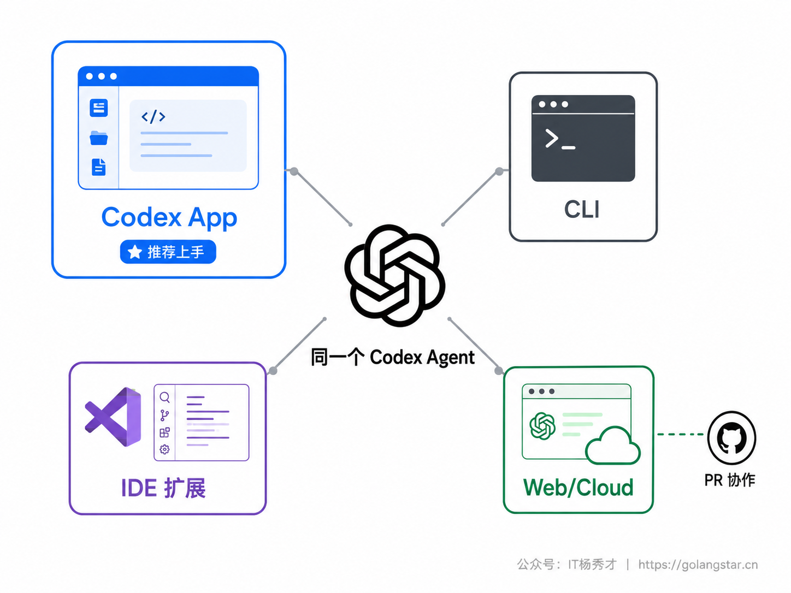
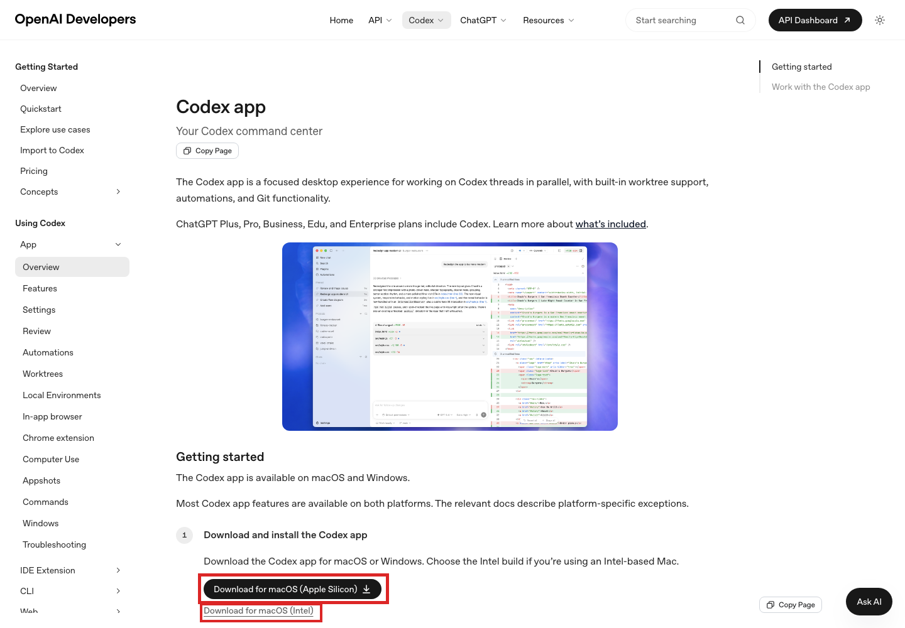
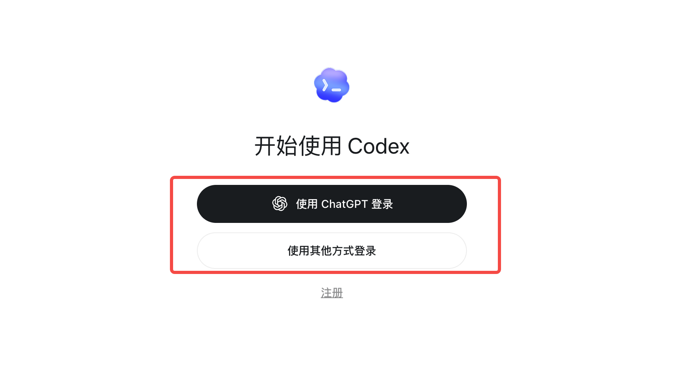
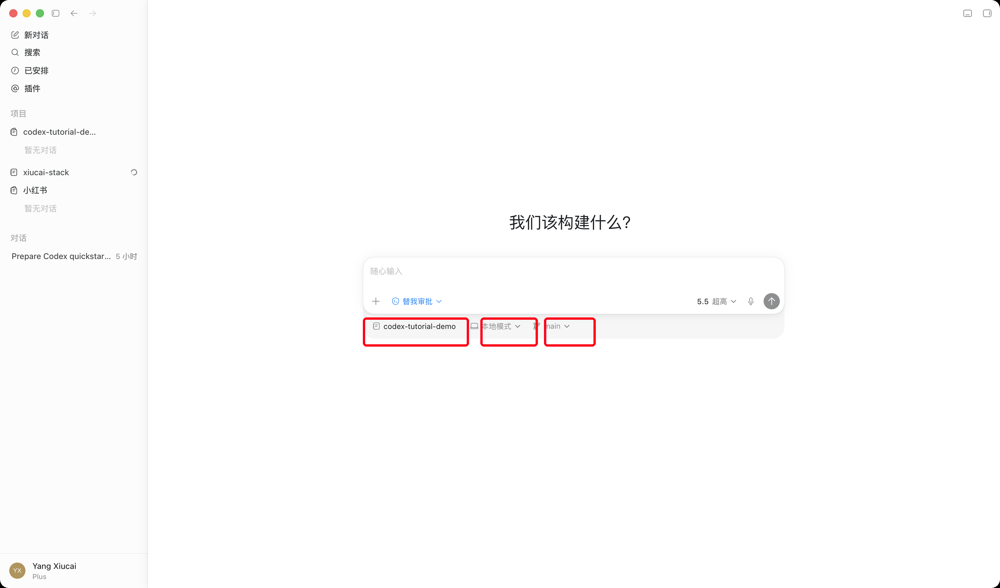
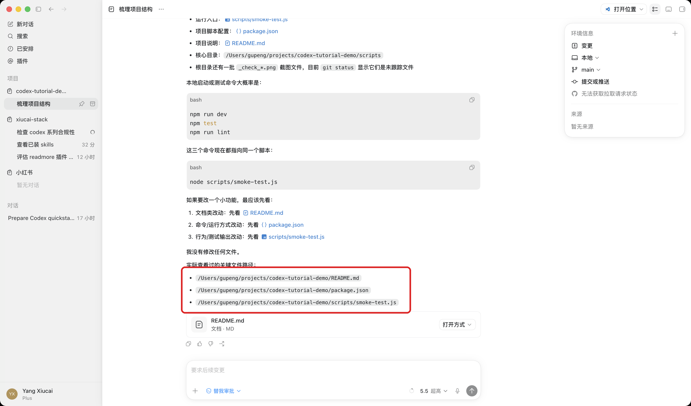
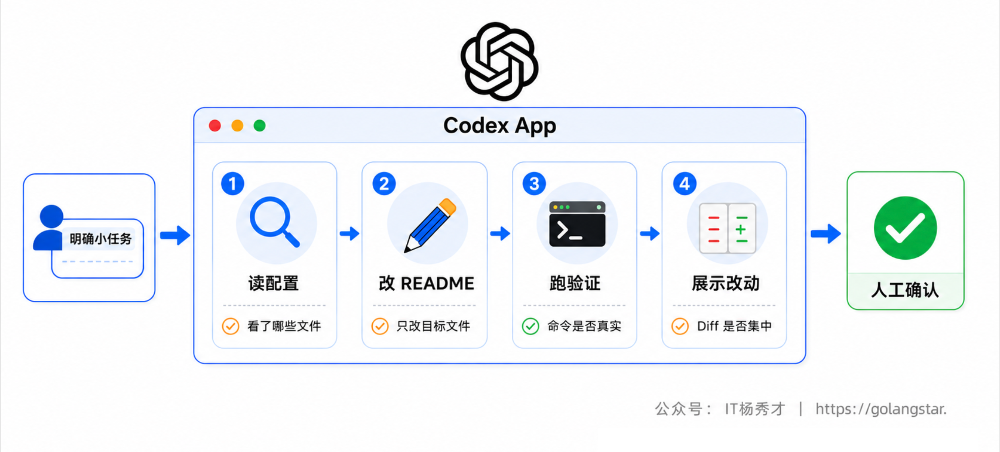
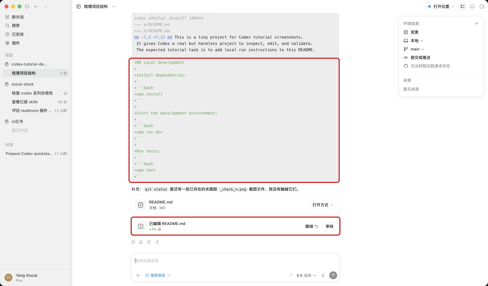
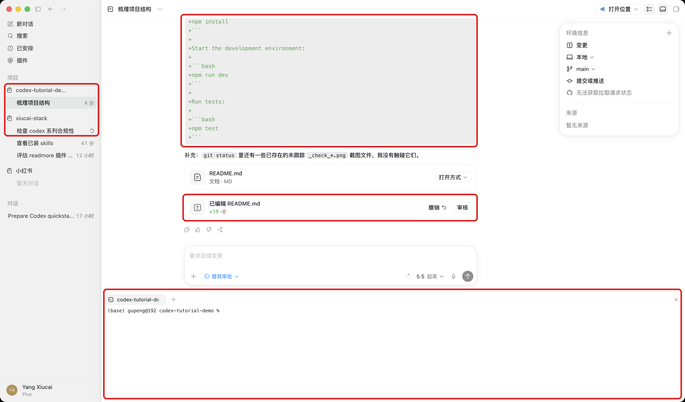
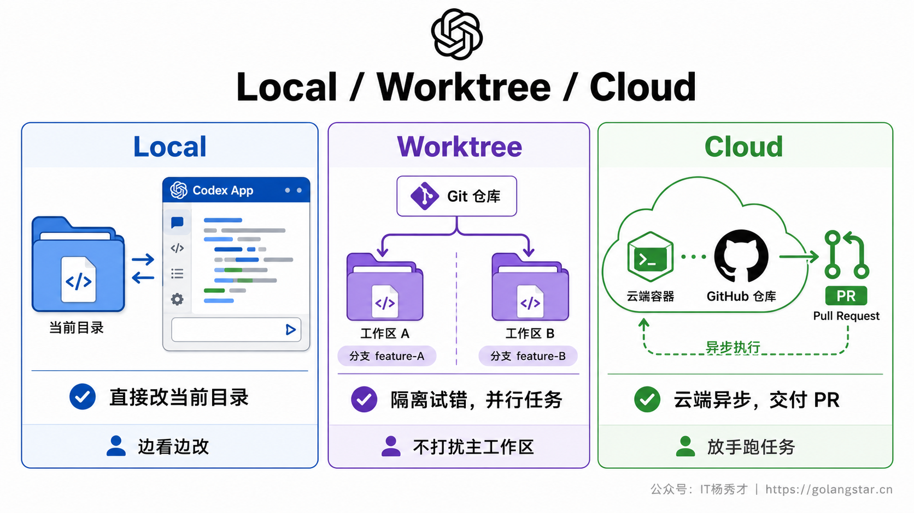
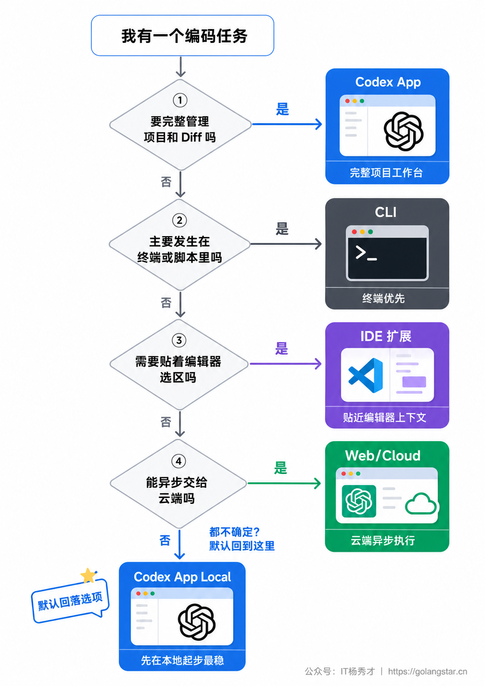

很多人第一次接触 Codex，会下意识把它理解成终端里的一个 `codex` 命令。这个理解不算错，但对刚开始学 AI 编程的人来说，命令行不是最顺手的入口。现在更推荐的上手路径，是先用 Codex App 桌面端跑通一次完整流程：打开项目、发任务、看它读代码、看它改文件、看 Diff、跑验证、决定是否接受改动。

这篇文章只解决一个目标：让你在一个真实项目里，把 Codex 从下载安装到第一次能放心使用打通。文章会按 App 优先来讲，同时把 CLI、IDE 扩展、Web/Cloud 放到正确的位置，避免一上来就被多个入口绕晕。

## **1. Codex 是什么**

Codex 是 OpenAI 的编码代理，专门用来理解、修改、审查和调试代码。它不是单纯的聊天机器人，也不是只会补全几行代码的编辑器插件。你给它一个明确目标，它会读取项目文件、规划步骤、修改代码、运行命令验证，再把改动交给你检查。

Codex 当前有几个主要入口。**Codex App** 是桌面端工作台，适合日常项目管理和小白上手；**CLI** 是终端入口，适合脚本、远程环境和自动化；**IDE 扩展**贴着 VS Code、Cursor 等编辑器上下文工作；**Web/Cloud** 适合把边界清楚的任务交到云端异步跑，并和 GitHub PR、代码审查配合。

对新手来说，先理解这一点很关键：这些入口不是互相竞争的四个工具，而是同一个 Codex 在不同工作位置的表现形式。App 把项目、线程、Diff、Git、Worktree、终端和浏览器这些常用能力放在一个图形界面里，所以更适合建立第一印象。



## **2. 安装准备**

Codex App 支持 macOS 和 Windows。普通读者先安装 App 就够了，不需要一开始同时装 CLI、IDE 扩展和各种插件。你只需要准备三样东西：一个能登录 Codex 的 ChatGPT 账号，一个本地项目文件夹，一套能回退改动的 Git 环境。

账号方面，官方文档说明 ChatGPT 计划包含 Codex，也可以用 OpenAI API key 登录。新手优先用 ChatGPT 账号，因为它能覆盖 App、Cloud、GitHub 等更完整的体验。API key 更适合自动化、CI、脚本这类按量计费场景，而且部分云端和团队能力可能不可用。

项目方面，不建议第一次就打开生产项目。最好的练习对象是一个你熟悉、文件不多、已经用 Git 管理的项目。哪怕只是一个个人博客、一个小工具、一个 README 比较完整的练习仓库，都比直接拿公司核心仓库试水安全得多。

如果你手头没有合适项目，可以新建一个很小的练习仓库，里面放一个 README、一个简单脚本、一个测试文件。Codex 第一次上手的重点不是做出多复杂的功能，而是看清它如何读文件、如何决定修改范围、如何运行验证命令。项目越小，你越容易判断它做得对不对。

打开项目之前，建议先在终端里做一次基线检查：

```bash
git status
git branch --show-current
```

`git status` 用来确认当前有没有未提交改动。第一次练习最好从干净工作区开始，这样 Codex 改完以后，你在 Diff 里看到的每一行变化都来自本次任务。`git branch --show-current` 用来确认自己在哪个分支上，避免把练习改动混进正在开发的功能分支。

还要提前处理敏感文件。`.env`、私钥、数据库密码、生产配置这类内容不要交给 Codex 读。对新手最简单的做法，是先用不含真实密钥的练习项目；如果必须打开真实项目，至少确认敏感文件没有被提交到仓库，并在给任务时明确说明不要读取或修改这些文件。

安装步骤按这个顺序来：

1. 打开 Codex 官方下载页面。
2. 根据系统选择 macOS 或 Windows 版本，Intel Mac 选择 Intel 构建。
3. 安装后启动 Codex App。
4. 用 ChatGPT 账号登录。
5. 选择一个本地项目文件夹。
6. 在新线程里选择 Local 模式。

如果你后面确实需要终端能力，再安装 CLI。macOS 或 Linux 可以使用官方安装脚本：

```bash
curl -fsSL https://chatgpt.com/codex/install.sh | sh
```

Windows 用户可以用原生 PowerShell 跑 Codex，也可以在 WSL2 里按 Linux 环境使用。新手阶段不要把重点放在安装所有入口上，先把 App 的第一条任务跑通，再补 CLI 和 IDE 扩展。

国内用户还要额外确认登录链路。Codex App 需要能正常完成 ChatGPT 账号登录，如果登录页打不开、验证码加载不出来、或跳转后 App 没拿到登录态，先解决网络和浏览器授权问题，再继续折腾项目配置。不要在登录没稳定的情况下去改 API key、代理脚本和系统证书，排查面会变得很乱。



## **3. 登录和项目**

第一次打开 Codex App，先完成登录。选择 ChatGPT 账号登录后，App 会把你的账号、计划和可用能力带进来。登录成功后进入项目选择界面，这里要选的是本地项目文件夹，而不是随便选一个文件。

项目选择有两个原则。第一，尽量选 Git 仓库，因为后面 Worktree、Diff、提交、PR 都依赖 Git 工作流；第二，项目边界要清楚，最好直接选仓库根目录或某个独立子项目目录，不要选太大的上层目录。比如一个 monorepo 里有多个应用，就可以把前端应用、后端服务分别加成不同项目，让 Codex 的读写范围更清晰。

登录以后先做一个安全检查：确认 App 左侧或项目列表里显示的是你预期的项目名，确认当前线程模式是 Local，确认权限不是完全放开的危险配置。上手阶段不要急着点 Cloud，也不要先开 Worktree。Local 最直观，它直接在你选中的项目目录里工作，最适合观察 Codex 的行为。

第一次打开项目后，可以先让 Codex 做一次环境盘点，但不要让它立刻修改文件。

**Prompt：**

```text
请先不要修改任何文件。

帮我检查这个项目是否适合作为第一次 Codex 练习项目：
1. 判断它是不是 Git 仓库
2. 找出主要语言和包管理工具
3. 找出可能的启动命令和测试命令
4. 提醒我哪些文件不应该让你读取或修改
5. 如果当前项目太复杂，请建议一个更小的练习任务
```

这个 Prompt 的价值在于把项目选择变成可检查的步骤。Codex 如果能识别出包管理工具、测试命令和敏感文件，你就可以继续；如果它连项目结构都判断不清，先换一个更小的项目，或者把任务改成只读解释。





## **4. 第一次 Local 任务**

第一次任务不要让 Codex 直接改核心业务。更稳妥的做法是分两步：先让它只读项目，解释结构；再给它一个很小、可回退、容易检查的改动任务。这样你能同时观察它的阅读能力、规划能力、改文件方式和验证习惯。

这里有一个新手很容易忽略的点：第一次任务的成功标准应该由你定义，而不是让 Codex 自己发挥。比如给 README 增加运行步骤，成功标准就是只改 README、命令来自真实配置文件、Diff 容易人工检查。标准越清楚，Codex 越不容易把任务扩大成重构。

### **4.1 认识项目**

先发一个只读 Prompt，让 Codex 建立上下文。这个任务不会要求它改文件，适合用来确认它读了哪些目录、理解是否准确。

**Prompt：**

```text
请先不要修改任何文件。

帮我快速理解这个项目：
1. 这个项目主要做什么
2. 入口文件和核心目录分别在哪里
3. 本地启动或测试命令可能是什么
4. 如果我要让你改一个小功能，最应该先看哪些文件

请用中文回答，结尾列出你实际查看过的关键文件路径。
```

这个 Prompt 里最重要的是第一句。新手常见问题是直接说帮我看看项目，结果 Codex 可能顺手开始探索、规划甚至修改。把不改文件写在最前面，能把任务边界收窄到只读分析。最后要求它列出查看过的文件路径，是为了让你判断它的理解是否来自真实项目，而不是泛泛而谈。

**AI 回复效果：**



### **4.2 小改动任务**

确认它能读懂项目后，再给一个小改动。第一次最适合改 README、补注释、加一个非常明确的参数校验，避免需求太大导致文件改动范围失控。

**不推荐的写法：**

```text
帮我优化一下这个项目。
```

这种写法太空。Codex 不知道优化什么、改到什么程度、是否要动架构、是否要跑测试。对新手来说，越空的任务越难检查。

**推荐的写法：**

```text
请做一个很小的改动：给 README 增加本地运行步骤。

要求：
1. 先阅读 package.json 或项目配置，确认真实启动命令
2. 只修改 README，不要改业务代码
3. 新增内容包括安装依赖、启动开发环境、运行测试三部分
4. 改完后展示 Diff，并说明你依据哪些文件判断这些命令
```

这个 Prompt 把范围、文件、输出和依据都说清楚了。Codex 应该先读取配置文件，再修改 README，最后给出 Diff。即使它判断错了命令，你也能从依据文件里看出来哪里出了问题。

如果你的项目不是前端项目，把 README 任务换成对应技术栈的小任务即可。Go 项目可以让它补一段 `go test ./...` 的说明；Python 项目可以让它确认 `requirements.txt`、`pyproject.toml` 或 `uv.lock`；Java 项目可以让它确认 Maven 或 Gradle 命令。关键不是命令长什么样，而是让 Codex 从项目文件里找依据，而不是凭经验猜。

**Prompt：**

```text
这个项目不是 Node.js 项目，请不要假设存在 npm 命令。

请根据当前仓库里的配置文件，判断正确的安装、运行、测试命令。
如果找不到依据，请明确说找不到，不要编一个看起来合理的命令。
```

这段 Prompt 很适合放在第一次任务后追问。很多 AI 编程错误不是代码能力差，而是工具在信息不足时猜了一个常见命令。你提前禁止猜测，就能把错误暴露在对话里，而不是藏进 README。



**AI 回复效果：**



## **5. 界面操作**

Codex App 的价值，不只是有个聊天框。第一次使用时，重点认识四个区域：线程、任务过程、Diff、内置终端。

线程是你和 Codex 的对话记录。一个任务尽量放在一个线程里，不要在同一个线程里同时塞登录 bug、样式调整、测试补全三件事。线程越干净，Codex 越容易保持目标一致，你后面回看也更容易。

任务过程通常会展示 Codex 正在做什么，比如读取文件、运行命令、整理计划、等待你确认。新手不要只看最后回答，要看中间步骤。它如果开始读不相关目录，或者准备执行你不理解的命令，就应该暂停追问。

Diff 面板是最重要的验收区域。你要养成三个检查动作：先看改了几个文件，再看每个文件改了哪些块，最后看有没有超出任务范围的改动。如果你让它只改 README，却看到业务代码也变了，就不要直接接受。

内置终端适合跑验证命令。官方文档里提到，每个线程都有一个作用于当前项目或 worktree 的内置终端，常见命令包括 `git status`、`npm test`、`pnpm run lint` 等。你可以自己跑，也可以让 Codex 跑；关键是不要把验证省掉。

几个常用快捷入口也值得先记住。macOS 上 `Cmd+K` 或 `Cmd+Shift+P` 打开命令菜单，`Cmd+J` 切换终端，`Cmd+Option+B` 切换 Diff 面板，`Cmd+,` 打开设置。Windows 上按 App 菜单里对应命令即可，不必强记快捷键。

如果一个项目经常要运行固定命令，可以在 Codex App 的本地环境里配置 actions。比如前端项目常用启动、测试、lint 三个动作，后端项目常用单测、集成测试、格式化三个动作。配置好以后，这些动作会出现在 App 顶部，Codex 或你自己都能更快触发验证。

第一次上手不必马上配置 actions，但要知道它解决什么问题：把每次都要手敲的命令固定下来，减少输错命令的概率。等你确定这个项目会反复用 Codex 改，就可以把最常用的验证命令沉淀进去。



## **6. 三种线程模式**

Codex App 新建线程时可以选择 Local、Worktree、Cloud。新手最容易混的是这三个模式，它们的区别不在于能力强弱，而在于代码改动发生在哪里。

**Local** 直接在当前项目目录工作。它适合第一次上手、小改动、需要你边看边验收的任务。缺点是改动会直接出现在你的工作区，所以每次开始前最好确认 `git status` 干净，或者至少知道当前有哪些未提交改动。

**Worktree** 会基于 Git worktree 隔离出一个新的工作目录，让 Codex 在独立环境里改。它适合尝试新功能、并行跑多个想法、或者你不希望当前工作区被打扰的任务。Worktree 需要项目本身是 Git 仓库。官方文档也提醒，worktree 本质上是另一个 checkout，同一个分支不能同时在多个 worktree 里被 checkout。

Worktree 第一次用时，最常见的问题是环境不完整。比如你的 `.env.local` 没进 Git，依赖目录没安装，或者本地生成文件没有复制到新 worktree。官方文档提供了本地环境 setup scripts 和 `.worktreeinclude` 这类机制，用来在创建 worktree 时自动准备依赖，或者复制被 Git 忽略但 worktree 需要的文件。新手不用一开始就配置很复杂，但要知道 Worktree 不是魔法副本，它需要项目本身具备可重复安装和启动的能力。

**Cloud** 在云端环境里工作。它适合边界清楚、可以放手异步跑的任务，比如补一批测试、做一轮重构、按 issue 开一个 PR。Cloud 通常需要仓库和 GitHub 协作打通，因为它会在云端克隆仓库、完成任务后交付 PR。

Cloud 不适合用来探索一个你自己都说不清的需求。你给 Cloud 的任务应该像一张清楚的工单：背景是什么、改动范围在哪里、验收标准是什么、哪些文件不要碰。否则它能跑得很远，但你最后会花很多时间审一个方向不对的 PR。

可以用下面这条规则做第一次判断：要贴身观察就选 Local，要隔离试错就选 Worktree，要放手异步就选 Cloud。

| 模式 | 改动位置 | 适合任务 | 新手注意 |
|---|---|---|---|
| Local | 当前项目目录 | 小改动、即时验收、学习工具行为 | 开始前先看 `git status` |
| Worktree | 独立 Git worktree | 并行尝试、隔离分支、后台任务 | 需要 Git 仓库和环境 setup |
| Cloud | 云端环境 | 可异步的任务、PR 协作、批量工作 | 任务边界要清楚，仓库要可访问 |



## **7. 四种入口选择**

理解了 App 以后，再看 CLI、IDE、Web/Cloud 就清楚了。它们不是必须按顺序全部学完，而是按任务发生的位置来选。

日常学习、改项目、看 Diff、管理线程，优先用 Codex App。它的优势是可视化和完整工作流：项目列表、线程历史、Local/Worktree/Cloud、Git、终端、浏览器、权限设置都在一个地方。

App 还有一个容易被低估的优势：它让你把多条线程分开管理。比如一个线程专门解释项目结构，一个线程修 README，一个线程试 Worktree，一个线程跑 Cloud 任务。每条线程目标清楚，后续回看和继续都更容易。不要把所有问题塞进同一个长对话里，尤其是新手阶段。

已经在终端里工作，或者要把 Codex 放进脚本，就用 CLI。比如批量跑一次代码审查、在远程机器上处理仓库、用 `codex exec` 做非交互任务，这些场景 App 反而不是最高效的。

正在编辑器里看某个文件，需要 Codex 结合打开文件、选区和当前编辑位置来改，用 IDE 扩展。它适合局部修改和边写边问，尤其是你已经在 VS Code、Cursor 等编辑器里工作时。

任务边界明确、可以异步等待结果，就用 Web/Cloud。比如让 Codex 按 GitHub issue 修一个 bug、补一批测试、开 PR 给你审。Cloud 的优势是你不用守着本地电脑，还能并行跑多个任务。

**Prompt：**

```text
我现在有一个任务：给登录接口增加参数校验，并补单元测试。
请先帮我判断应该用 Codex 的哪个入口完成：App Local、App Worktree、CLI、IDE 扩展，还是 Cloud。

请按下面格式回答：
1. 推荐入口
2. 为什么适合
3. 开始前需要准备什么
4. 不建议使用的入口和原因
```

这类 Prompt 很适合新手。你不必一开始就自己硬选入口，可以先让 Codex 根据任务特点给出建议，再决定是否采纳。注意让它同时说不建议的入口，能帮你理解边界。



## **8. 权限和验证**

Codex 能读文件、改文件、运行命令，所以权限一定要讲清。新手不需要一开始理解所有配置字段，只要记住两层：权限决定它能碰哪些文件和网络，审批决定它什么时候停下来问你。

第一次使用建议保持默认或偏谨慎的权限。只让 Codex 在当前项目范围内工作，遇到访问项目外目录、联网、执行高风险命令时先问你。如果你看不懂它要做什么，不要为了省事一路批准。更稳妥的做法是追问：

**Prompt：**

```text
你刚才请求执行这个命令。请先不要执行。

请解释：
1. 这个命令要做什么
2. 它会读取或修改哪些文件
3. 有没有网络访问或删除文件风险
4. 有没有更安全的替代命令
```

这个 Prompt 能把审批从机械点按钮变成学习过程。你不用害怕审批提示，真正要避免的是看不懂还批准。App 里的权限选择器适合日常调整，CLI 里可以用 `/permissions` 或启动参数控制。后续做自动化、Worktree、Cloud 时，再系统学习 permission profiles、sandbox、approval 这些配置。

验证也同样重要。Codex 改完文件后，你至少要做三件事：看 Diff 是否集中，跑项目测试或 lint，确认 Git 状态只包含本次任务相关文件。可以直接让 Codex 帮你做一轮自检：

**Prompt：**

```text
请在提交前帮我自检这次改动。

要求：
1. 总结改了哪些文件，每个文件为什么要改
2. 检查是否有超出任务范围的改动
3. 运行项目里最合适的测试或 lint 命令
4. 如果命令失败，先解释失败原因，不要继续扩大改动范围
5. 最后给出我需要人工检查的风险点
```

**AI 回复效果：**


最后再用终端做一次人工兜底：

```bash
git status
git diff --stat
```

`git status` 看哪些文件变了，`git diff --stat` 看改动规模。第一次练习里，如果你只让它改 README，却看到十几个源文件变化，就应该回到线程里要求解释原因，或者直接丢弃本次改动。AI 编程不是把确认权交出去，而是把执行过程交出去。

一个合格的第一次任务，最好满足这四个条件：改动文件少，Diff 看得懂，验证命令有结果，失败原因能解释。只要这四点都满足，哪怕它只帮你改了 README，也比一次生成一大坨你看不懂的代码更有价值。

验收通过后也不要急着开新任务。先决定这次改动的去向：如果只是练习，可以直接 revert；如果确实有用，就自己写一条清楚的 commit message 提交；如果改动方向对但细节不满意，就在同一个线程里继续要求 Codex 按 Diff 上的具体行修改。不要在尚未处理上一轮改动时继续叠加新需求，否则你很快分不清哪些变化来自哪个任务。

## **9. 常见问题**

**Q：一定要先学 CLI 吗？**
不用。CLI 很强，但它不是新手的必经入口。你先用 Codex App 建立项目、线程、Diff、权限和验证的完整认知，再学 CLI 会轻松很多。

**Q：没有 Git 仓库能用 Codex App 吗？**
能用 Local，但 Worktree、提交、PR 这些能力会受限。建议尽早把练习项目放进 Git，哪怕只是本地 `git init`，也能让你更安全地回退和对比改动。

**Q：ChatGPT 账号和 API key 怎么选？**
普通学习优先 ChatGPT 账号。API key 适合脚本、CI 和按量计费，且可能缺少部分 cloud-based 能力。不要为了显得专业一上来就折腾 API key。

**Q：Codex App 和 IDE 扩展能一起用吗？**
能。官方文档提到 App 和 IDE 扩展在同一项目中可以同步上下文。你可以用 App 管线程和 Diff，用 IDE 看具体代码位置，用 CLI 跑自动化命令。

**Q：第一次任务失败怎么办？**
不要立刻换模型或放大权限。先让 Codex 解释失败原因、列出它读过的文件、说明下一步准备改哪里。新手最该练的是收窄任务，而不是把一个模糊任务越滚越大。

**Q：什么时候可以用 Cloud？**
等你能把任务边界说清楚再用。比如修某个 issue、补某类测试、按明确规则改一批文件，这些适合 Cloud。需要你边看边判断设计细节的任务，先留在 App Local 或 Worktree。

## **10. 小结**

Codex 上手的关键，不是记住多少命令，而是先建立正确的工作位置感。Codex App 是最适合新手的第一入口，因为它把项目、线程、模式选择、Diff、Git、终端、权限这些关键环节放在一个界面里，让你能看见 Codex 到底在做什么。

第一次使用时，把任务压小：先只读项目，再做一个 README 或轻量代码改动，最后看 Diff、跑验证、检查 Git 状态。Local 适合贴身观察，Worktree 适合隔离试错，Cloud 适合异步委托；CLI 和 IDE 扩展则分别补上终端自动化和编辑器上下文。把这套入口选择跑顺，后面的 AGENTS.md、Skills、MCP、云端任务和权限配置才会自然接上。

<div style="background-color: #f0f9eb; padding: 10px 15px; border-radius: 4px; border-left: 5px solid #67c23a; margin: 20px 0; color:rgb(64, 147, 255);">

<h2><span style="color: #006400;"><strong>关注秀才公众号：</strong></span><span style="color: red;"><strong>IT杨秀才</strong></span><span style="color: #006400;"><strong>，回复：</strong></span><span style="color: red;"><strong>面试</strong></span></h2>

<div style="text-align: center;"><span style="color: #006400; font-size: 28px;"><strong>领取后端/AI面试题库PDF</strong></span></div>


<div style="text-align: center; margin-top: 22px; padding-top: 20px; border-top: 1px solid #c2e7b0;">
<div style="color: #006400; font-size: 20px; font-weight: bold;">🔥 配套实战项目，拆得开、跑得起、能写进简历</div>
<div style="color: red; font-size: 16px; font-weight: bold; margin-top: 8px;">多 Agent 编排 + RAG 混合检索 · 31 篇深度教程 + 50+ 面试题</div>
<a href="/projects/dev-support.html" style="display: inline-block; margin-top: 14px; background: #ff7a18; color: #fff; font-size: 18px; font-weight: bold; padding: 10px 28px; border-radius: 24px; text-decoration: none;">点击查看 DevSupport AI 实战项目 →</a>
</div>
</div>
